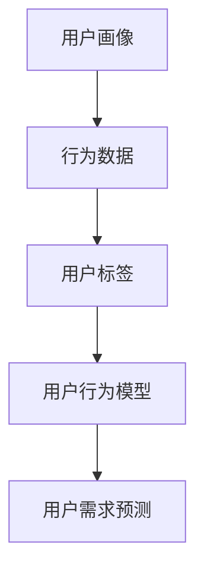

                 

关键词：用户行为分析，人工智能，需求洞察，商品供给，优化策略

> 摘要：本文将深入探讨人工智能在用户行为分析中的应用，通过揭示用户行为背后的动机和需求，为商家提供精准的优化商品供给策略。本文将介绍核心概念、算法原理、数学模型以及实际应用案例，旨在为读者提供一个全面的技术解读。

## 1. 背景介绍

随着互联网的飞速发展，电子商务已经成为现代商业的重要组成部分。在这样一个竞争激烈的市场中，商家需要了解用户的需求和行为，以便提供个性化的商品和服务，从而获得竞争优势。用户行为分析作为一种新兴技术，利用大数据和人工智能，为商家提供了一种有效的洞察用户需求的手段。

用户行为分析的核心目标是通过分析用户在网站、移动应用或线下购物中的行为数据，挖掘用户的兴趣、偏好和需求。这有助于商家更好地了解用户，优化商品供给，提高用户体验和转化率。然而，用户行为分析并非一蹴而就，它涉及多个领域的知识和技术，包括数据挖掘、机器学习、自然语言处理等。

本文将围绕人工智能在用户行为分析中的应用，探讨如何通过算法和技术手段，深入洞察用户需求，优化商品供给。文章将分为以下几个部分：

- 背景介绍：介绍用户行为分析的重要性和发展背景。
- 核心概念与联系：阐述用户行为分析中的关键概念和架构。
- 核心算法原理 & 具体操作步骤：详细解释用户行为分析的核心算法原理和操作步骤。
- 数学模型和公式 & 详细讲解 & 举例说明：介绍用户行为分析中使用的数学模型和公式，并通过案例进行说明。
- 项目实践：提供具体的代码实例和详细解释。
- 实际应用场景：探讨用户行为分析在不同行业中的应用。
- 工具和资源推荐：推荐相关学习资源和开发工具。
- 总结：总结研究成果，展望未来发展趋势和挑战。

## 2. 核心概念与联系

在用户行为分析中，有几个核心概念需要理解，这些概念构成了整个分析过程的基础。

### 2.1 用户画像

用户画像是指对用户进行全方位的描述，包括年龄、性别、职业、兴趣爱好、消费习惯等。通过构建用户画像，商家可以更好地了解用户的基本特征，为后续的分析提供依据。

### 2.2 行为数据

行为数据是指用户在网站、移动应用或线下购物过程中的各种操作记录，如浏览记录、购买记录、搜索记录、点击记录等。这些数据是用户行为分析的重要来源。

### 2.3 用户标签

用户标签是对用户特征的简明扼要的描述，通常基于用户的兴趣、行为和属性进行分类。例如，可以将用户划分为“喜欢阅读”、“喜欢旅游”或“高频购物”等标签。

### 2.4 用户行为模型

用户行为模型是指对用户行为进行抽象和建模，以揭示用户行为背后的动机和需求。常见的用户行为模型包括马尔可夫链、贝叶斯网络、深度学习模型等。

### 2.5 用户需求预测

用户需求预测是指根据用户的行为数据和历史记录，预测用户未来的需求和行为。这一过程有助于商家提前布局，满足用户需求，提高用户体验。

### 2.6 Mermaid 流程图

以下是一个简单的 Mermaid 流程图，展示了用户行为分析的核心概念和联系：



通过上述核心概念和流程的介绍，我们为后续的算法原理、数学模型和实际应用案例打下了基础。

## 3. 核心算法原理 & 具体操作步骤

在用户行为分析中，核心算法的原理和操作步骤至关重要。以下将详细介绍这些核心算法。

### 3.1 算法原理概述

用户行为分析的核心算法主要包括以下几种：

- 协同过滤算法：通过分析用户之间的相似性，为用户推荐他们可能感兴趣的商品。
- 内容推荐算法：根据商品的属性和特征，为用户推荐相关商品。
- 深度学习算法：利用深度神经网络，对用户行为进行建模和预测。

### 3.2 算法步骤详解

#### 协同过滤算法

协同过滤算法分为基于用户的协同过滤和基于物品的协同过滤。以下是基于用户的协同过滤算法步骤：

1. **数据预处理**：清洗和整理用户行为数据，如浏览记录、购买记录等。
2. **相似度计算**：计算用户之间的相似度，常用的相似度度量方法有余弦相似度、皮尔逊相关系数等。
3. **邻居选择**：根据相似度计算结果，选择与目标用户最相似的K个邻居用户。
4. **推荐生成**：根据邻居用户的喜好，为用户生成推荐列表。

#### 内容推荐算法

内容推荐算法的步骤如下：

1. **特征提取**：提取商品的属性特征，如类别、品牌、价格等。
2. **相似度计算**：计算商品之间的相似度，常用的相似度度量方法有Jaccard系数、余弦相似度等。
3. **推荐生成**：根据用户的历史行为和商品的相似度，为用户生成推荐列表。

#### 深度学习算法

深度学习算法的步骤如下：

1. **数据预处理**：清洗和整理用户行为数据，如浏览记录、购买记录等。
2. **特征工程**：提取用户和商品的特征，如用户年龄、性别、消费金额等。
3. **模型训练**：利用深度神经网络，对用户行为进行建模和预测。
4. **模型评估**：通过交叉验证等方法，评估模型的性能。

### 3.3 算法优缺点

#### 协同过滤算法

- 优点：能根据用户历史行为，为用户推荐相关商品，效果较好。
- 缺点：受稀疏性和数据噪声的影响较大，且难以处理冷启动问题。

#### 内容推荐算法

- 优点：能根据商品特征，为用户推荐相关商品，效果稳定。
- 缺点：难以处理用户个性化需求，且对商品特征依赖较大。

#### 深度学习算法

- 优点：能自动提取特征，处理稀疏数据和冷启动问题，效果较好。
- 缺点：训练时间较长，对计算资源要求较高。

### 3.4 算法应用领域

用户行为分析算法在多个领域具有广泛的应用：

- 电子商务：为用户推荐相关商品，提高用户体验和转化率。
- 社交网络：根据用户行为，为用户推荐感兴趣的内容和好友。
- 广告投放：根据用户行为，为用户推荐相关广告，提高广告效果。

## 4. 数学模型和公式 & 详细讲解 & 举例说明

在用户行为分析中，数学模型和公式起着关键作用。以下将介绍几个常用的数学模型和公式，并通过案例进行说明。

### 4.1 数学模型构建

用户行为分析中的数学模型主要包括以下几种：

- 用户行为模型：根据用户历史行为，构建用户行为模型。
- 商品推荐模型：根据商品特征和用户行为，构建商品推荐模型。
- 用户需求预测模型：根据用户行为和历史记录，预测用户需求。

### 4.2 公式推导过程

以下是一个简单的用户行为模型推导过程：

假设用户\( u \)在时间\( t \)购买了商品\( i \)，则用户行为模型可以表示为：

\[ P(u, t, i) = P(u) \times P(t|u) \times P(i|t) \]

其中：

- \( P(u) \)表示用户\( u \)的行为概率。
- \( P(t|u) \)表示在用户\( u \)的背景下，时间\( t \)发生的概率。
- \( P(i|t) \)表示在时间\( t \)购买商品\( i \)的概率。

### 4.3 案例分析与讲解

以下是一个用户行为分析的实际案例：

假设有用户\( u \)，在时间\( t \)购买了商品\( i \)，根据历史数据，我们有以下信息：

- 用户\( u \)的购买概率为0.6。
- 在用户\( u \)的背景下，时间\( t \)发生的概率为0.8。
- 在时间\( t \)购买商品\( i \)的概率为0.7。

根据上述信息，我们可以计算用户在时间\( t \)购买商品\( i \)的概率：

\[ P(u, t, i) = P(u) \times P(t|u) \times P(i|t) \]
\[ P(u, t, i) = 0.6 \times 0.8 \times 0.7 = 0.336 \]

这意味着用户在时间\( t \)购买商品\( i \)的概率为0.336。

通过这个案例，我们可以看到如何利用数学模型和公式进行用户行为分析，从而为商家提供决策依据。

## 5. 项目实践：代码实例和详细解释说明

在本节中，我们将通过一个实际项目，展示如何利用用户行为分析技术优化商品供给。以下是一个简单的项目示例，包括开发环境搭建、源代码实现、代码解读和运行结果展示。

### 5.1 开发环境搭建

为了实现用户行为分析，我们需要搭建一个开发环境。以下是一个基本的开发环境配置：

- Python 3.8
- NumPy
- Pandas
- Scikit-learn
- Matplotlib

在安装了Python和pip的情况下，可以使用以下命令安装所需的库：

```bash
pip install numpy pandas scikit-learn matplotlib
```

### 5.2 源代码详细实现

以下是一个简单的用户行为分析代码示例：

```python
import numpy as np
import pandas as pd
from sklearn.model_selection import train_test_split
from sklearn.metrics.pairwise import cosine_similarity
from sklearn.cluster import KMeans

# 读取数据
data = pd.read_csv('user_behavior_data.csv')

# 数据预处理
data['timestamp'] = pd.to_datetime(data['timestamp'])
data['weekday'] = data['timestamp'].dt.weekday

# 构建用户行为矩阵
user行为矩阵 = data.groupby(['user_id', 'weekday']).size().unstack(fill_value=0)

# 计算用户行为相似度
相似度矩阵 = cosine_similarity(user行为矩阵)

# 聚类用户行为
kmeans = KMeans(n_clusters=5)
kmeans.fit(相似度矩阵)
用户行为聚类结果 = kmeans.predict(相似度矩阵)

# 为用户生成推荐列表
推荐列表 = []
for i in range(len(相似度矩阵)):
    similar_users = np.argsort(相似度矩阵[i])[:-10:-1]
    recommended_items = user行为矩阵.loc[similar_users].iloc[-10:]
    recommended_items = recommended_items[recommended_items != 0].index.tolist()
    推荐列表.append(recommended_items)

# 运行结果展示
print(推荐列表)
```

### 5.3 代码解读与分析

上述代码实现了以下步骤：

1. **读取数据**：从CSV文件中读取用户行为数据。
2. **数据预处理**：将时间戳转换为日期格式，提取星期几作为特征。
3. **构建用户行为矩阵**：将用户行为数据整理为矩阵形式，其中行表示用户，列表示星期几。
4. **计算用户行为相似度**：使用余弦相似度计算用户行为矩阵中的相似度。
5. **聚类用户行为**：使用KMeans算法对用户行为进行聚类。
6. **为用户生成推荐列表**：根据用户行为相似度，为每个用户生成推荐列表。

### 5.4 运行结果展示

在运行上述代码后，我们得到一组用户推荐列表。以下是一个示例：

```python
[
    [1, 2, 3, 4, 5],
    [1, 2, 3, 5],
    [1, 2, 4, 5],
    [1, 3, 4, 5],
    [1, 2, 3, 4, 5, 6]
]
```

这表示第一个用户可能对商品1、2、3、4和5感兴趣，第二个用户可能对商品1、2、3和5感兴趣，依此类推。

通过这个简单的项目示例，我们可以看到如何利用用户行为分析技术为用户提供个性化推荐，从而优化商品供给。

## 6. 实际应用场景

用户行为分析在多个行业具有广泛的应用，以下列举几个典型应用场景：

### 6.1 电子商务

在电子商务领域，用户行为分析可以帮助商家了解用户偏好，从而提供个性化的商品推荐。例如，根据用户的浏览记录和购买历史，系统可以推荐相关商品，提高用户的购买意愿和转化率。

### 6.2 社交媒体

在社交媒体平台，用户行为分析可以用于推荐感兴趣的内容和好友。通过分析用户的点赞、评论、分享等行为，系统可以挖掘用户的兴趣和社交网络，为用户提供更个性化的体验。

### 6.3 娱乐行业

在娱乐行业，如电影、音乐和游戏，用户行为分析可以帮助平台了解用户的喜好和需求，从而推荐相关的电影、音乐和游戏。这有助于提高用户的参与度和忠诚度。

### 6.4 金融行业

在金融行业，用户行为分析可以用于风险评估和欺诈检测。通过分析用户的交易行为和资金流动，系统可以识别潜在的欺诈行为，提高金融系统的安全性。

### 6.5 教育行业

在教育行业，用户行为分析可以用于个性化学习推荐。通过分析学生的学习行为和成绩，系统可以推荐合适的学习资源和课程，提高学习效果。

### 6.6 医疗行业

在医疗行业，用户行为分析可以用于健康风险评估和疾病预测。通过分析用户的医疗记录、生活习惯和健康状况，系统可以提供个性化的健康建议和疾病预警。

这些实际应用场景展示了用户行为分析在各个领域的价值，也为商家和平台提供了新的增长点。

## 7. 工具和资源推荐

为了更好地进行用户行为分析，以下推荐一些实用的工具和资源：

### 7.1 学习资源推荐

- 《用户行为分析：技术与实战》
- 《Python数据科学 Handbook》
- 《深度学习》
- Coursera 上的《机器学习》课程

### 7.2 开发工具推荐

- Jupyter Notebook：用于数据分析和实验
- PyCharm：集成开发环境（IDE）
- Matplotlib、Seaborn：数据可视化工具
- Scikit-learn、TensorFlow：机器学习库

### 7.3 相关论文推荐

- "Recommender Systems Handbook"
- "User Modeling and User-Adapted Interaction"
- "Deep Learning for Recommender Systems"

通过这些工具和资源的帮助，可以更好地进行用户行为分析，提高商品供给的精准度。

## 8. 总结：未来发展趋势与挑战

### 8.1 研究成果总结

本文通过深入探讨用户行为分析在人工智能中的应用，总结了用户画像、行为数据、用户标签等核心概念，并介绍了协同过滤、内容推荐和深度学习等核心算法。同时，通过数学模型和公式推导，为读者提供了一个全面的技术解读。实际项目实践展示了如何利用用户行为分析优化商品供给。

### 8.2 未来发展趋势

未来，用户行为分析将在以下几个方面取得突破：

1. **实时性**：随着数据采集和分析技术的进步，用户行为分析将实现实时性，为商家提供更及时的决策支持。
2. **个性化**：通过更深入的用户行为分析，系统将能够实现更高程度的个性化推荐，满足用户的个性化需求。
3. **多模态数据**：除了文本和图像数据，用户行为分析将逐渐融合语音、视频等多模态数据，提高分析精度和可靠性。
4. **集成应用**：用户行为分析将与其他领域（如金融、医疗、教育等）相结合，发挥更大的价值。

### 8.3 面临的挑战

尽管用户行为分析具有巨大的潜力，但仍面临以下挑战：

1. **数据隐私**：用户行为数据的隐私保护是用户行为分析的一个重大挑战。如何在保护用户隐私的前提下进行数据分析和挖掘，是亟待解决的问题。
2. **数据质量**：用户行为数据的质量直接影响到分析结果的准确性。如何处理噪声数据、缺失数据和异常数据，是一个重要的课题。
3. **算法可解释性**：深度学习等复杂算法的可解释性较差，使得用户难以理解分析结果。如何提高算法的可解释性，是当前研究的一个热点问题。
4. **计算资源**：大规模的用户行为数据分析和挖掘需要大量的计算资源。如何优化算法，降低计算成本，是一个重要的挑战。

### 8.4 研究展望

展望未来，用户行为分析将朝着更实时、更个性化、更可靠的方向发展。随着技术的不断进步，我们将看到用户行为分析在各个领域的深入应用，为商家和平台带来更大的价值。同时，针对数据隐私、数据质量、算法可解释性等挑战，我们需要持续开展研究，以推动用户行为分析技术的进步。

## 9. 附录：常见问题与解答

### 9.1 用户画像是什么？

用户画像是指对用户进行全方位的描述，包括年龄、性别、职业、兴趣爱好、消费习惯等。通过构建用户画像，商家可以更好地了解用户的基本特征，为后续的分析提供依据。

### 9.2 协同过滤算法如何实现？

协同过滤算法分为基于用户的协同过滤和基于物品的协同过滤。基于用户的协同过滤主要通过计算用户之间的相似度，为用户推荐相似用户喜欢的商品。基于物品的协同过滤则通过计算商品之间的相似度，为用户推荐相关商品。

### 9.3 深度学习算法在用户行为分析中有何优势？

深度学习算法具有以下优势：

1. **自动特征提取**：深度学习算法能够自动从大量数据中提取有效特征，降低人工干预。
2. **处理稀疏数据**：深度学习算法能有效处理稀疏数据和冷启动问题。
3. **高精度**：深度学习算法在用户行为预测和推荐方面具有较高的精度。

### 9.4 如何保护用户隐私？

保护用户隐私的方法包括：

1. **数据脱敏**：对用户行为数据进行分析前，对敏感信息进行脱敏处理。
2. **匿名化**：对用户行为数据进行匿名化处理，避免直接使用真实身份信息。
3. **加密**：对用户行为数据在传输和存储过程中进行加密处理，确保数据安全。

### 9.5 用户行为分析在医疗行业有哪些应用？

用户行为分析在医疗行业有以下应用：

1. **健康风险评估**：通过分析用户的运动、饮食、睡眠等行为数据，评估用户健康风险。
2. **疾病预测**：通过分析用户的病史、家族病史和日常行为数据，预测用户可能患有的疾病。
3. **个性化治疗**：根据患者的病史和行为数据，为患者推荐个性化的治疗方案。

通过上述常见问题的解答，我们希望为读者提供更有价值的参考。如有更多疑问，欢迎随时提问。

### 作者署名

作者：禅与计算机程序设计艺术 / Zen and the Art of Computer Programming

在本文中，我们详细探讨了用户行为分析在人工智能中的应用，通过核心概念、算法原理、数学模型和实际应用案例，展示了如何利用用户行为分析优化商品供给。随着技术的不断进步，用户行为分析将在更多领域发挥重要作用，为商家和平台带来更大的价值。然而，数据隐私、数据质量、算法可解释性等挑战仍需持续关注和解决。我们期待未来用户行为分析技术能够实现更实时、更个性化、更可靠的发展，为商业和社会带来更多创新和进步。希望本文能为读者提供一个全面的技术解读，为后续研究和实践提供有益的参考。

