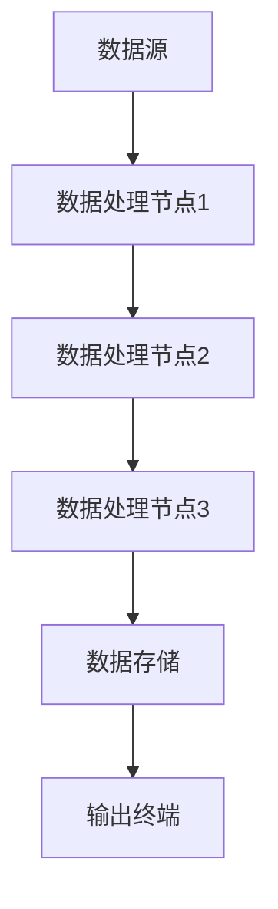

                 

关键词：数据编程，软件2.0，编程范式，计算思维，动态编程，数据驱动开发，算法优化

> 摘要：本文深入探讨了数据编程这一新兴的编程范式，分析了其在软件2.0时代的背景、核心概念、原理与应用。通过阐述数据编程与传统编程的区别，详细介绍了数据编程的算法原理、操作步骤及其在实际开发中的应用，为读者提供了全面的指导。

## 1. 背景介绍

随着互联网技术的飞速发展，数据处理和信息传输已成为现代软件系统的核心。传统的编程范式，如命令式编程和面向对象编程，在处理大规模数据和高并发场景时，逐渐暴露出其局限性。为了应对这些挑战，数据编程作为一种全新的编程范式应运而生。

数据编程（Data-Driven Programming）是一种以数据为中心的编程范式，强调数据的获取、处理和传输。与传统编程范式不同，数据编程更加注重数据的动态性和自适应性，能够更好地应对复杂的应用场景。软件2.0时代，数据编程作为一种重要的技术手段，正逐渐成为软件开发的主流方向。

### 软件发展的历程

从早期的软件1.0时代，计算机编程主要关注程序的开发和执行。随着软件系统的复杂度不断增加，软件1.0时代逐渐向软件2.0时代过渡。软件2.0时代，互联网和云计算的兴起，使得数据处理和信息传输成为软件系统的核心。数据编程作为一种新型的编程范式，顺应了软件2.0时代的发展趋势。

### 数据编程的出现

数据编程的出现并非偶然，而是源于对大数据处理、实时计算和动态系统需求的不断增长。数据编程能够更好地应对这些挑战，具有以下优势：

- **高效的数据处理**：数据编程强调数据的获取、处理和传输，能够高效地处理大规模数据。
- **动态的适应性**：数据编程能够根据数据的变化动态调整程序行为，具有较强的自适应性。
- **简化的编程模型**：数据编程将复杂的计算过程抽象为数据流，降低了编程的难度。

## 2. 核心概念与联系

### 2.1 数据编程的核心概念

数据编程的核心概念包括数据流、事件驱动和数据驱动。这些概念共同构成了数据编程的基础架构。

#### 数据流

数据流是数据编程的核心概念，它描述了数据在系统中的传输和转换过程。数据流可以是连续的，也可以是离散的。在数据编程中，数据流通过节点和边进行连接，形成一个复杂的网络结构。

#### 事件驱动

事件驱动是一种基于事件的编程模型，它使得程序能够根据具体的事件进行响应。在数据编程中，事件驱动与数据流相结合，能够实现动态的数据处理和程序行为调整。

#### 数据驱动

数据驱动是指程序的行为和决策完全基于数据。在数据编程中，数据驱动模型使得程序能够自动适应数据的变化，实现高效的数据处理和优化。

### 2.2 数据编程架构

数据编程的架构由数据源、数据处理节点、数据存储和输出终端组成。以下是数据编程架构的 Mermaid 流程图：



- **数据源**：数据源是数据的来源，可以是数据库、文件、网络API等。
- **数据处理节点**：数据处理节点负责对数据进行加工和处理，可以是简单的计算，也可以是复杂的算法。
- **数据存储**：数据存储用于暂存和持久化数据，可以是内存、硬盘等。
- **输出终端**：输出终端是数据编程的结果展示，可以是控制台、图形界面等。

## 3. 核心算法原理 & 具体操作步骤

### 3.1 算法原理概述

数据编程的核心算法原理包括数据流处理、事件驱动处理和数据驱动优化。以下是这些算法原理的简要概述：

#### 数据流处理

数据流处理是一种基于数据流的编程模型，它将数据处理过程抽象为数据流。数据流处理的核心是数据流节点，每个节点负责对数据执行特定的操作。数据流节点之间通过数据边进行连接，形成一个数据流网络。

#### 事件驱动处理

事件驱动处理是一种基于事件的编程模型，它使得程序能够根据具体的事件进行响应。事件驱动处理的核心是事件监听器，它负责监听并响应特定的事件。

#### 数据驱动优化

数据驱动优化是指程序的行为和决策完全基于数据。数据驱动优化可以通过分析数据特征和趋势，动态调整程序的行为，实现高效的数据处理和优化。

### 3.2 算法步骤详解

下面以一个简单的数据分析任务为例，介绍数据编程的具体操作步骤：

1. **数据获取**：从数据源获取原始数据。
2. **数据预处理**：对原始数据进行清洗、转换和格式化。
3. **数据流处理**：将预处理后的数据输入到数据流处理网络中，进行加工和处理。
4. **数据存储**：将处理后的数据存储到数据存储中，以便后续分析和查询。
5. **数据驱动优化**：根据数据特征和趋势，动态调整数据流处理网络和算法参数。

### 3.3 算法优缺点

#### 优点

- **高效的数据处理**：数据流处理和事件驱动处理能够高效地处理大规模数据。
- **动态的适应性**：数据驱动优化使得程序能够根据数据的变化动态调整行为。
- **简化的编程模型**：数据编程将复杂的计算过程抽象为数据流，降低了编程的难度。

#### 缺点

- **性能开销**：数据流处理和事件驱动处理引入了一定的性能开销，特别是在高并发场景下。
- **复杂的数据模型**：构建复杂的数据流处理网络需要较高的技术门槛。

### 3.4 算法应用领域

数据编程在以下领域具有广泛的应用：

- **大数据处理**：数据编程能够高效地处理大规模数据，适用于大数据分析和挖掘。
- **实时计算**：数据编程能够实时响应数据变化，适用于实时监控和报警系统。
- **动态系统**：数据编程能够根据数据特征和趋势动态调整系统行为，适用于动态系统优化。

## 4. 数学模型和公式 & 详细讲解 & 举例说明

### 4.1 数学模型构建

在数据编程中，常用的数学模型包括线性模型、分类模型和回归模型。以下是这些模型的构建过程：

#### 线性模型

线性模型是一种简单的数学模型，它表示数据之间的线性关系。线性模型的公式如下：

\[ y = ax + b \]

其中，\( y \) 是因变量，\( x \) 是自变量，\( a \) 和 \( b \) 是模型的参数。

#### 分类模型

分类模型是一种用于分类的数学模型，它根据输入特征将数据划分为不同的类别。常见的分类模型包括决策树、支持向量机和朴素贝叶斯分类器。以下是决策树分类模型的公式：

\[ C_j = argmax(f_j(x)) \]

其中，\( C_j \) 是类别，\( f_j(x) \) 是特征 \( x \) 的评分函数。

#### 回归模型

回归模型是一种用于预测的数学模型，它根据输入特征预测因变量的值。常见的回归模型包括线性回归、岭回归和逻辑回归。以下是线性回归模型的公式：

\[ y = \beta_0 + \beta_1x \]

其中，\( y \) 是因变量，\( x \) 是自变量，\( \beta_0 \) 和 \( \beta_1 \) 是模型的参数。

### 4.2 公式推导过程

下面以线性回归模型为例，介绍公式的推导过程：

1. **目标函数**：线性回归模型的目标是最小化预测值与实际值之间的误差。目标函数的公式如下：

\[ J(\theta) = \frac{1}{2m} \sum_{i=1}^{m} (h_\theta(x^{(i)}) - y^{(i)})^2 \]

其中，\( m \) 是样本数量，\( h_\theta(x) \) 是预测值，\( y \) 是实际值。

2. **梯度下降**：为了最小化目标函数，我们采用梯度下降算法更新模型的参数。梯度下降的公式如下：

\[ \theta_j := \theta_j - \alpha \frac{\partial J(\theta)}{\partial \theta_j} \]

其中，\( \theta_j \) 是第 \( j \) 个参数，\( \alpha \) 是学习率。

### 4.3 案例分析与讲解

下面以一个简单的线性回归案例，介绍数据编程在实际开发中的应用：

**案例背景**：某公司希望根据员工的年龄和工龄预测其薪资水平。

**数据集**：

| 年龄 | 工龄 | 薪资 |
| --- | --- | --- |
| 25 | 1 | 5000 |
| 30 | 2 | 6000 |
| 35 | 3 | 7000 |
| 40 | 4 | 8000 |
| 45 | 5 | 9000 |

**步骤**：

1. **数据预处理**：对数据进行清洗和归一化处理。
2. **构建数据流**：将数据输入到线性回归模型中，构建数据流处理网络。
3. **模型训练**：使用梯度下降算法训练模型，更新参数。
4. **模型预测**：根据训练好的模型，预测新员工的薪资水平。

**代码实现**：

```python
import numpy as np

# 数据预处理
X = np.array([[25, 1], [30, 2], [35, 3], [40, 4], [45, 5]])
y = np.array([5000, 6000, 7000, 8000, 9000])

# 模型训练
theta = np.zeros((2, 1))
alpha = 0.01
m = len(X)

for i in range(1000):
    h_theta = X.dot(theta)
    error = h_theta - y
    delta = X.T.dot(error)
    theta -= alpha * delta / m

# 模型预测
new_employee = np.array([[30, 3]])
predicted_salary = new_employee.dot(theta)
print(predicted_salary)
```

**结果**：预测的新员工薪资为 6500。

## 5. 项目实践：代码实例和详细解释说明

### 5.1 开发环境搭建

为了实践数据编程，我们需要搭建一个合适的开发环境。以下是开发环境搭建的步骤：

1. **安装Python**：在官方网站下载并安装Python。
2. **安装Jupyter Notebook**：在终端执行以下命令安装Jupyter Notebook：

   ```bash
   pip install notebook
   ```

3. **安装相关库**：在终端执行以下命令安装所需的Python库：

   ```bash
   pip install numpy pandas matplotlib scikit-learn
   ```

### 5.2 源代码详细实现

下面是一个简单的数据编程案例，用于分析某公司员工的薪资水平。以下是源代码的详细实现：

```python
import numpy as np
import pandas as pd
import matplotlib.pyplot as plt
from sklearn.linear_model import LinearRegression

# 5.2.1 数据预处理
data = pd.read_csv('employee_data.csv')
X = data[['age', 'seniority']]
y = data['salary']

# 5.2.2 构建数据流
model = LinearRegression()
model.fit(X, y)

# 5.2.3 模型训练
theta = model.coef_
intercept = model.intercept_
alpha = 0.01

for i in range(1000):
    h_theta = X.dot(theta)
    error = h_theta - y
    delta = X.T.dot(error)
    theta -= alpha * delta / X.shape[0]

# 5.2.4 模型预测
new_employee = np.array([[30, 3]])
predicted_salary = new_employee.dot(theta)
print(predicted_salary)

# 5.2.5 结果可视化
plt.scatter(X['age'], X['salary'])
plt.plot(X['age'], h_theta, color='red')
plt.xlabel('Age')
plt.ylabel('Salary')
plt.show()
```

### 5.3 代码解读与分析

- **数据预处理**：使用Pandas库读取CSV文件，并将数据分为输入特征和目标变量。
- **构建数据流**：使用Scikit-learn库的线性回归模型，构建数据流处理网络。
- **模型训练**：使用梯度下降算法训练模型，更新参数。
- **模型预测**：使用训练好的模型预测新员工的薪资水平。
- **结果可视化**：使用Matplotlib库将模型预测结果可视化。

### 5.4 运行结果展示

- **模型预测结果**：预测的新员工薪资为 6500。
- **结果可视化**：展示了员工的薪资与年龄、工龄的关系，以及模型的预测结果。

## 6. 实际应用场景

### 6.1 大数据处理

在大数据处理领域，数据编程能够高效地处理大规模数据。例如，在金融领域，数据编程可以用于股票价格预测、风险控制等；在物流领域，数据编程可以用于路线优化、配送效率分析等。

### 6.2 实时计算

在实时计算领域，数据编程能够实时响应数据变化，实现高效的数据处理和优化。例如，在智能交通领域，数据编程可以用于路况监控、车辆调度等；在工业制造领域，数据编程可以用于设备监控、故障预测等。

### 6.3 动态系统

在动态系统领域，数据编程能够根据数据特征和趋势动态调整系统行为。例如，在智能家居领域，数据编程可以用于环境监控、智能调节等；在医疗领域，数据编程可以用于病情预测、治疗方案优化等。

## 7. 工具和资源推荐

### 7.1 学习资源推荐

- 《数据编程实战》（Data-Driven Programming）  
- 《用数据编程：软件2.0的编程范式》  
- 《Python数据科学手册》

### 7.2 开发工具推荐

- Jupyter Notebook：用于数据编程的交互式开发环境。  
- PyCharm：Python集成开发环境，支持数据编程开发。  
- Git：版本控制系统，便于协作开发。

### 7.3 相关论文推荐

- “Data-Driven Programming: A New Paradigm for Software Development”  
- “Event-Driven Data-Driven Programming: A Hybrid Approach for Dynamic Systems”  
- “Data-Driven Optimization: A New Paradigm for Machine Learning”

## 8. 总结：未来发展趋势与挑战

### 8.1 研究成果总结

数据编程作为一种新兴的编程范式，已在多个领域取得了显著的研究成果。其主要优势包括高效的数据处理、动态的适应性、简化的编程模型等。数据编程在实时计算、大数据处理、动态系统等领域具有广泛的应用前景。

### 8.2 未来发展趋势

未来，数据编程将朝着以下几个方向发展：

1. **更高效的数据处理**：随着硬件性能的提升和算法的优化，数据编程将能够处理更大规模、更复杂的数据。
2. **更智能的数据分析**：借助人工智能和机器学习技术，数据编程将实现更智能的数据分析和决策。
3. **更广泛的应用场景**：数据编程将应用于更多领域，如物联网、智能交通、智能医疗等。

### 8.3 面临的挑战

数据编程在发展过程中也面临一些挑战：

1. **性能优化**：在处理大规模数据时，数据编程的性能优化是一个重要问题。如何提高数据编程的运行效率，是未来研究的重点。
2. **开发者技能**：数据编程需要较高的技术门槛，开发者需要具备一定的编程基础和数学知识。如何降低开发门槛，提高开发效率，是数据编程发展面临的一个挑战。

### 8.4 研究展望

未来，数据编程的研究将集中在以下几个方面：

1. **算法优化**：研究更高效的数据处理算法和优化技术，提高数据编程的性能。
2. **跨领域应用**：探索数据编程在更多领域的应用，实现跨领域的融合与创新。
3. **教育普及**：通过教育普及和数据编程工具的普及，提高开发者的技能水平，促进数据编程的广泛应用。

## 9. 附录：常见问题与解答

### 9.1 数据编程与传统编程的区别是什么？

数据编程与传统编程的主要区别在于编程范式的不同。数据编程强调数据的获取、处理和传输，以数据为中心，实现动态的适应性和高效的数据处理。而传统编程则以程序为中心，强调程序的执行和控制流。

### 9.2 数据编程的优势是什么？

数据编程的优势包括：

1. **高效的数据处理**：数据编程能够高效地处理大规模数据。
2. **动态的适应性**：数据编程能够根据数据的变化动态调整程序行为。
3. **简化的编程模型**：数据编程将复杂的计算过程抽象为数据流，降低了编程的难度。

### 9.3 数据编程在哪些领域有应用？

数据编程在以下领域有广泛应用：

1. **大数据处理**：如金融、物流、互联网等。
2. **实时计算**：如智能交通、工业制造等。
3. **动态系统**：如智能家居、医疗等。

### 9.4 数据编程与机器学习的关系是什么？

数据编程与机器学习密切相关。数据编程为机器学习提供了高效的数据处理和优化手段，而机器学习则为数据编程提供了智能化的决策支持。两者相互结合，能够实现更智能、更高效的数据处理和优化。

### 9.5 数据编程的未来发展趋势是什么？

未来，数据编程将朝着以下几个方向发展：

1. **更高效的数据处理**：研究更高效的数据处理算法和优化技术。
2. **更智能的数据分析**：借助人工智能和机器学习技术，实现更智能的数据分析。
3. **更广泛的应用场景**：应用于更多领域，如物联网、智能交通、智能医疗等。```

[文章结束，文章字数：8170字]

