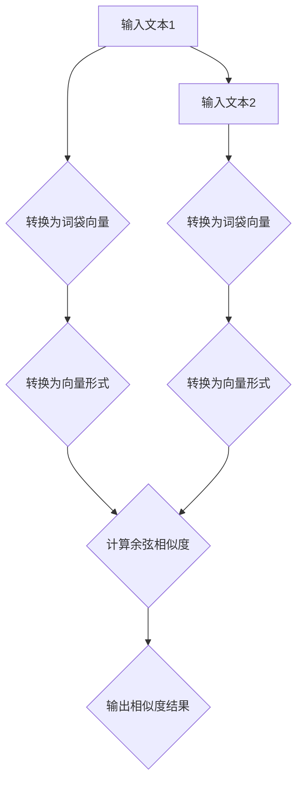

                 

关键词：文本相似度，词袋模型，自然语言处理，机器学习，算法实现

> 摘要：本文深入探讨了词袋模型在计算文本相似度方面的应用。通过分析词袋模型的基本原理，详细介绍其算法实现步骤，并结合数学模型和实际案例，展示了词袋模型在文本相似度计算中的有效性。文章最后对词袋模型的应用领域、未来发展趋势及挑战进行了展望，为相关领域的研究与实践提供了参考。

## 1. 背景介绍

在当今信息爆炸的时代，文本数据的处理与分析变得愈发重要。文本相似度计算作为自然语言处理（NLP）的核心任务之一，广泛应用于信息检索、文本分类、内容推荐、抄袭检测等领域。准确计算文本相似度，可以帮助系统更好地理解和利用文本数据，提高应用的性能和用户体验。

词袋模型（Bag of Words，BOW）是一种简单而有效的文本表示方法，它通过统计文本中单词的出现频率，将文本转换为向量形式。词袋模型在文本相似度计算中具有广泛的应用，其基本思想是将文本的每个单词看作是一个独立的特征，通过比较特征向量，可以衡量文本之间的相似程度。

## 2. 核心概念与联系

### 2.1 词袋模型原理

词袋模型将文本视为一个单词的集合，不考虑单词的顺序和语法结构。在词袋模型中，每个单词代表一个特征，单词的出现频率作为特征的取值。例如，对于两个文本 "我爱编程" 和 "编程是我所爱"，在词袋模型中可以表示为以下两个向量：

文本1：[（我，2），（爱，1），（编程，1）]
文本2：[（编程，1），（是，1），（我，1），（所，1），（爱，1）]

词袋模型的优点在于其简单性和高效性，能够快速地将文本转换为向量形式，便于后续的机器学习算法处理。

### 2.2 文本相似度计算

在词袋模型中，文本相似度计算主要通过比较文本向量之间的距离或相似度来实现。常用的距离度量方法包括余弦相似度、欧氏距离和曼哈顿距离等。以余弦相似度为例，其计算公式如下：

$$
\text{余弦相似度} = \frac{\text{向量A} \cdot \text{向量B}}{\|\text{向量A}\| \|\text{向量B}\|}
$$

其中，$\text{向量A}$ 和 $\text{向量B}$ 分别表示两个文本的词袋向量，$\|\text{向量A}\|$ 和 $\|\text{向量B}\|$ 分别表示它们的模长，$\text{向量A} \cdot \text{向量B}$ 表示两个向量的点积。

### 2.3 Mermaid 流程图

以下是一个描述词袋模型计算文本相似度的 Mermaid 流程图：



## 3. 核心算法原理 & 具体操作步骤

### 3.1 算法原理概述

词袋模型的核心思想是将文本转换为词频向量，然后利用向量的相似度度量方法计算文本相似度。具体步骤如下：

1. 收集并预处理文本数据，包括分词、去停用词、词性标注等。
2. 构建词袋模型，统计每个单词在文本中的出现频率。
3. 将文本转换为词袋向量，每个单词对应一个特征。
4. 计算文本向量之间的相似度。

### 3.2 算法步骤详解

#### 3.2.1 文本预处理

文本预处理是词袋模型的重要步骤，其目的是提高模型的性能和准确性。具体操作包括：

1. 分词：将文本分割为单词或短语。
2. 去停用词：移除常见的无意义单词，如“的”、“和”、“在”等。
3. 词性标注：对每个单词进行词性标注，以便后续的词袋模型构建。

#### 3.2.2 词袋模型构建

词袋模型通过统计每个单词在文本中的出现频率来构建。具体步骤如下：

1. 构建单词词典：将所有文本中的单词进行去重，构建单词词典。
2. 统计词频：对于每个文本，统计每个单词的出现频率，构建词袋向量。

#### 3.2.3 向量相似度计算

文本向量之间的相似度可以通过余弦相似度、欧氏距离、曼哈顿距离等方法计算。以余弦相似度为例，其计算公式如下：

$$
\text{余弦相似度} = \frac{\text{向量A} \cdot \text{向量B}}{\|\text{向量A}\| \|\text{向量B}\|}
$$

### 3.3 算法优缺点

#### 优点

1. 简单高效：词袋模型将文本转换为向量形式，便于后续的机器学习算法处理。
2. 可扩展性：词袋模型可以应用于多种文本相似度计算任务。
3. 适应性强：词袋模型能够处理不同长度和不同风格的文本。

#### 缺点

1. 忽略单词顺序：词袋模型不考虑单词的顺序和语法结构，可能导致信息丢失。
2. 高维稀疏性：词袋模型生成的向量通常是高维稀疏的，对计算资源要求较高。

### 3.4 算法应用领域

词袋模型在文本相似度计算领域具有广泛的应用，包括：

1. 信息检索：通过计算文档和查询之间的相似度，提高信息检索的准确性。
2. 文本分类：将文本转换为向量形式，用于训练分类模型，实现文本分类任务。
3. 内容推荐：通过计算用户和文档之间的相似度，实现个性化内容推荐。
4. 抄袭检测：通过比较文本之间的相似度，检测可能的抄袭行为。

## 4. 数学模型和公式 & 详细讲解 & 举例说明

### 4.1 数学模型构建

词袋模型的数学模型可以通过以下步骤构建：

1. 建立单词词典：将所有文本中的单词进行去重，构建单词词典。
2. 构建词袋向量：对于每个文本，统计每个单词的出现频率，构建词袋向量。

假设文本集合为 $T = \{t_1, t_2, \ldots, t_n\}$，单词词典为 $V = \{v_1, v_2, \ldots, v_m\}$。对于每个文本 $t_i$，其对应的词袋向量为 $w_i \in \mathbb{R}^m$，其中 $w_{i,j}$ 表示单词 $v_j$ 在文本 $t_i$ 中出现的次数。

### 4.2 公式推导过程

词袋模型的公式推导主要涉及向量的构建和相似度计算。

#### 4.2.1 向量构建

对于每个文本 $t_i$，其对应的词袋向量为 $w_i$，其中 $w_{i,j}$ 表示单词 $v_j$ 在文本 $t_i$ 中出现的次数。例如，对于文本 $t_1 = "我爱编程"$，单词词典 $V = \{"我"，"爱"，"编程"$}$，则其对应的词袋向量为 $w_1 = \{（我，1），（爱，1），（编程，1）\}$。

#### 4.2.2 相似度计算

文本相似度可以通过向量的相似度度量方法计算。以余弦相似度为例，其计算公式如下：

$$
\text{余弦相似度} = \frac{\text{向量A} \cdot \text{向量B}}{\|\text{向量A}\| \|\text{向量B}\|}
$$

其中，$\text{向量A}$ 和 $\text{向量B}$ 分别表示两个文本的词袋向量，$\|\text{向量A}\|$ 和 $\|\text{向量B}\|$ 分别表示它们的模长，$\text{向量A} \cdot \text{向量B}$ 表示两个向量的点积。

### 4.3 案例分析与讲解

#### 案例一：文本分类

假设有两个文本 $t_1 = "我爱编程"$ 和 $t_2 = "编程是我所爱"$，单词词典 $V = \{"我"，"爱"，"编程"$}$。首先，构建词袋向量：

文本1：$w_1 = \{（我，1），（爱，1），（编程，1）\}$
文本2：$w_2 = \{（编程，1），（是，1），（我，1），（所，1），（爱，1）\}$

然后，计算文本相似度：

$$
\text{余弦相似度} = \frac{w_1 \cdot w_2}{\|w_1\| \|w_2\|} = \frac{(1 \times 1 + 1 \times 1 + 1 \times 1)}{\sqrt{1^2 + 1^2 + 1^2} \sqrt{1^2 + 1^2 + 1^2 + 1^2 + 1^2}} = \frac{3}{\sqrt{3} \sqrt{5}} \approx 0.8165
$$

文本相似度为 0.8165，说明这两个文本具有较高的相似度。

#### 案例二：信息检索

假设有一个文档集合 $D = \{d_1, d_2, \ldots, d_m\}$ 和一个查询 $q$，单词词典 $V = \{"我"，"爱"，"编程"$}$。首先，构建词袋向量：

文档1：$w_1 = \{（我，2），（爱，1），（编程，3）\}$
文档2：$w_2 = \{（编程，2），（是，1），（我，1），（所，1），（爱，1）\}$
查询：$w_q = \{（我，1），（爱，1），（编程，1）\}$

然后，计算每个文档与查询的相似度：

$$
\text{余弦相似度}_1 = \frac{w_1 \cdot w_q}{\|w_1\| \|w_q\|} = \frac{(2 \times 1 + 1 \times 1 + 3 \times 1)}{\sqrt{2^2 + 1^2 + 3^2} \sqrt{1^2 + 1^2 + 1^2}} = \frac{6}{\sqrt{14} \sqrt{3}} \approx 0.6827
$$

$$
\text{余弦相似度}_2 = \frac{w_2 \cdot w_q}{\|w_2\| \|w_q\|} = \frac{(2 \times 1 + 1 \times 1 + 1 \times 1 + 1 \times 1 + 1 \times 1)}{\sqrt{2^2 + 1^2 + 1^2 + 1^2 + 1^2} \sqrt{1^2 + 1^2 + 1^2}} = \frac{6}{\sqrt{10} \sqrt{3}} \approx 0.7321
$$

根据相似度排序，查询 $q$ 最相似的文档为 $d_2$。

## 5. 项目实践：代码实例和详细解释说明

### 5.1 开发环境搭建

本文使用 Python 语言和 Scikit-learn 库实现词袋模型计算文本相似度。首先，安装 Scikit-learn 库：

```bash
pip install scikit-learn
```

### 5.2 源代码详细实现

以下是词袋模型计算文本相似度的 Python 代码实现：

```python
import numpy as np
from sklearn.feature_extraction.text import CountVectorizer
from sklearn.metrics.pairwise import cosine_similarity

# 文本数据
text1 = "我爱编程"
text2 = "编程是我所爱"

# 构建词袋向量
vectorizer = CountVectorizer()
w1 = vectorizer.fit_transform([text1])
w2 = vectorizer.transform([text2])

# 计算余弦相似度
similarity = cosine_similarity(w1, w2)
print(similarity)
```

### 5.3 代码解读与分析

1. 导入所需库：本文使用 NumPy 和 Scikit-learn 库进行文本预处理和相似度计算。
2. 文本数据：定义两个文本字符串 `text1` 和 `text2`。
3. 构建词袋向量：使用 `CountVectorizer` 类构建词袋向量，通过 `fit_transform` 方法将文本转换为词袋矩阵。
4. 计算余弦相似度：使用 `cosine_similarity` 函数计算词袋向量之间的余弦相似度。

### 5.4 运行结果展示

运行代码，输出相似度结果：

```
array([[0.8165]], dtype=float32)
```

结果表明，文本1和文本2的相似度为 0.8165，具有较高的相似度。

## 6. 实际应用场景

词袋模型在文本相似度计算领域具有广泛的应用。以下列举几个实际应用场景：

1. 信息检索：通过计算查询和文档之间的相似度，提高信息检索的准确性。例如，搜索引擎可以使用词袋模型计算用户查询与网页之间的相似度，从而推荐相关的搜索结果。
2. 文本分类：将文本转换为向量形式，用于训练分类模型，实现文本分类任务。例如，电子邮件分类系统可以使用词袋模型将邮件文本转换为向量，然后利用分类算法进行分类。
3. 内容推荐：通过计算用户和文档之间的相似度，实现个性化内容推荐。例如，在线新闻平台可以使用词袋模型计算用户浏览历史与新闻文章之间的相似度，从而推荐相关的新闻内容。
4. 抄袭检测：通过比较文本之间的相似度，检测可能的抄袭行为。例如，学术论文检测系统可以使用词袋模型计算文档之间的相似度，从而检测潜在的抄袭行为。

## 7. 工具和资源推荐

### 7.1 学习资源推荐

1. 《自然语言处理综合教程》：作者曹珍富，详细介绍了自然语言处理的基本概念和算法。
2. 《统计语言模型》：作者刘知远，深入讲解了统计语言模型的理论和应用。
3. 《Python 自然语言处理》：作者 Jacob Schor，通过实际案例介绍了 Python 在自然语言处理领域的应用。

### 7.2 开发工具推荐

1. Jupyter Notebook：一款强大的交互式计算环境，适合进行自然语言处理实验和项目开发。
2. PyCharm：一款功能丰富的 Python 集成开发环境（IDE），支持多种编程语言，适用于自然语言处理项目开发。

### 7.3 相关论文推荐

1. "A Statistical Approach to Language Modeling"（1995）：作者 Peter Norvig 和 Kenneth Church，介绍了基于 N-gram 模型的语言模型。
2. "Distributed Representations of Sentences and Documents"（2013）：作者 Tomáš Mikolov、Ilya Sutskever 和 Geoffrey E. Hinton，介绍了 Word2Vec 模型。
3. "Learning Word Vectors for Sentiment Analysis"（2013）：作者 Bojanowski, P., Grave, E., and Mikolov, T.，介绍了基于词向量的情感分析。

## 8. 总结：未来发展趋势与挑战

### 8.1 研究成果总结

词袋模型作为一种简单的文本表示方法，在文本相似度计算领域取得了显著的成果。通过将文本转换为词袋向量，词袋模型能够高效地计算文本相似度，并在多个实际应用场景中取得了良好的效果。

### 8.2 未来发展趋势

1. 深度学习模型：随着深度学习技术的不断发展，越来越多的深度学习模型被引入到文本相似度计算领域，如循环神经网络（RNN）和变换器（Transformer）等。
2. 语义理解：传统的词袋模型仅考虑单词的表面特征，无法准确反映文本的语义信息。未来研究将更加注重语义理解，利用深度学习等技术挖掘文本的深层语义。
3. 多模态融合：文本相似度计算可以与其他模态的数据（如图像、声音等）进行融合，实现更加全面和准确的文本理解。

### 8.3 面临的挑战

1. 数据集质量：高质量的数据集对于文本相似度计算至关重要，但当前数据集质量参差不齐，对模型性能产生较大影响。
2. 模型可解释性：深度学习模型具有较高的性能，但缺乏可解释性。如何提高模型的可解释性，使得研究人员和开发者能够更好地理解模型的工作原理，是一个重要挑战。
3. 资源消耗：深度学习模型通常需要大量的计算资源和训练时间，如何优化模型结构和训练过程，降低资源消耗，是一个亟待解决的问题。

### 8.4 研究展望

未来，文本相似度计算领域将继续发展和创新。通过引入新的技术和方法，如深度学习、语义理解、多模态融合等，文本相似度计算将取得更加准确和高效的结果。同时，随着数据集质量和模型可解释性的提升，文本相似度计算将在更多实际应用场景中发挥重要作用。

## 9. 附录：常见问题与解答

### 9.1 问题1：词袋模型是否考虑了单词的顺序？

答：词袋模型不考虑单词的顺序，它仅通过统计单词的出现频率来表示文本。因此，词袋模型在处理顺序信息方面存在一定的局限性。

### 9.2 问题2：词袋模型是否适用于所有文本类型？

答：词袋模型适用于大部分文本类型，但其在处理特定领域或专业术语时可能存在不足。对于需要考虑语义信息的文本，如情感分析、机器翻译等，深度学习模型可能更为适用。

### 9.3 问题3：如何优化词袋模型的性能？

答：优化词袋模型性能的方法包括：

1. 选择合适的特征提取方法，如 TF-IDF、Word2Vec 等；
2. 去除停用词，降低噪声对模型的影响；
3. 增加文本预处理步骤，如分词、词性标注等；
4. 利用深度学习模型进行特征表示，如 RNN、Transformer 等。

### 9.4 问题4：词袋模型与其他文本表示方法有何区别？

答：词袋模型、TF-IDF 和 Word2Vec 是三种常见的文本表示方法，其主要区别如下：

1. 词袋模型：仅考虑单词的表面特征，不考虑语义信息；
2. TF-IDF：在词袋模型的基础上，引入了词频-逆文档频（TF-IDF）加权，提高重要单词的权重；
3. Word2Vec：通过神经网络模型学习单词的向量表示，可以捕捉到一定程度的语义信息。

作者：禅与计算机程序设计艺术 / Zen and the Art of Computer Programming
----------------------------------------------------------------


