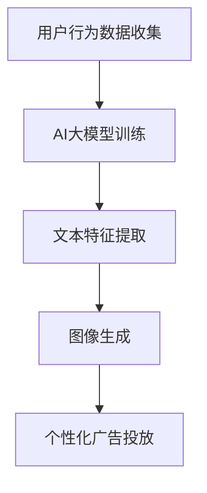

                 

关键词：电商平台，个性化广告，AI大模型，文本到图像转换，深度学习，计算机视觉

> 摘要：本文深入探讨了电商平台个性化广告创意生成的方法和关键技术，特别是基于AI大模型的文本到图像转换技术。通过分析相关概念、核心算法原理以及具体应用，本文旨在为电商行业提供一种创新的广告策略，以提升用户体验和广告效果。

## 1. 背景介绍

随着互联网的快速发展，电商平台已经成为消费者日常购物的重要渠道。然而，随着竞争的加剧，如何吸引消费者并提高广告转化率成为电商企业面临的一大挑战。个性化广告作为一种有效的营销手段，通过精准地匹配用户需求和兴趣，提高了广告投放的针对性和效果。而近年来，AI大模型和深度学习技术的迅猛发展为个性化广告创意生成带来了新的机遇。

文本到图像转换（Text-to-Image Conversion，简称T2I）是一种将自然语言描述转换为相应图像的技术。通过这种技术，电商平台可以根据用户输入的文本描述，自动生成与之相关的广告图像。这不仅能够节省广告创意设计的时间成本，还能够实现广告内容的高度个性化，提升用户体验。

本文将从以下方面展开讨论：

- **核心概念与联系**：介绍电商平台个性化广告、AI大模型和文本到图像转换技术的基本概念和相互关系。
- **核心算法原理**：解析基于AI大模型的文本到图像转换算法原理及其具体操作步骤。
- **数学模型和公式**：阐述T2I技术中涉及的数学模型和公式，并举例说明。
- **项目实践**：通过一个具体的代码实例，展示文本到图像转换技术的实际应用。
- **实际应用场景**：分析T2I技术在电商平台个性化广告中的具体应用。
- **未来应用展望**：探讨T2I技术在未来电商广告领域的发展趋势和应用前景。
- **工具和资源推荐**：推荐相关学习资源、开发工具和学术论文。
- **总结**：总结研究成果，展望未来发展趋势与挑战。

## 2. 核心概念与联系

### 电商平台个性化广告

个性化广告是一种基于用户行为和兴趣的定向广告投放方式。通过收集和分析用户在电商平台上的浏览、购买、评价等行为数据，广告系统能够准确了解用户的兴趣和需求，从而为用户推荐最相关、最有价值的广告内容。个性化广告不仅能够提升广告投放的效果，还能够提高用户满意度和用户体验。

### AI大模型

AI大模型是指具有大规模参数和复杂结构的人工智能模型，如深度神经网络、生成对抗网络（GAN）等。这些模型通过学习大量数据，能够自动提取特征并生成新的内容。在文本到图像转换领域，AI大模型能够将用户的文本描述转化为相应的图像，从而实现个性化广告创意生成。

### 文本到图像转换技术

文本到图像转换技术是一种将自然语言描述转换为视觉图像的技术。通过深度学习算法，如生成对抗网络（GAN）、变分自编码器（VAE）等，AI大模型能够从文本描述中提取关键信息，并生成与之对应的图像。在电商平台中，这种技术可以用于生成个性化广告图像，提升广告效果。

### 核心概念与联系

电商平台个性化广告、AI大模型和文本到图像转换技术之间的联系在于，它们共同构成了一个完整的个性化广告生成系统。电商平台通过收集用户数据，利用AI大模型进行特征提取和内容生成，最终通过文本到图像转换技术将文本描述转化为视觉图像，实现广告内容的高度个性化。这种技术的应用，不仅提高了广告的转化率，还大大提升了用户体验。

### Mermaid流程图

以下是一个简化的Mermaid流程图，展示了电商平台个性化广告创意生成的流程：



## 3. 核心算法原理 & 具体操作步骤

### 3.1 算法原理概述

文本到图像转换（T2I）技术的核心是AI大模型，特别是生成对抗网络（GAN）和变分自编码器（VAE）等深度学习模型。这些模型通过学习大量文本和图像数据，能够自动提取文本描述中的关键信息，并生成相应的图像。

在T2I技术中，通常包括两个主要步骤：文本特征提取和图像生成。

- **文本特征提取**：利用自然语言处理（NLP）技术，从用户输入的文本描述中提取关键特征。这些特征可以是词向量、词袋模型、循环神经网络（RNN）等。
- **图像生成**：通过生成对抗网络（GAN）或变分自编码器（VAE）等模型，将提取的文本特征转化为图像。GAN通过生成器和判别器的对抗训练，生成高质量的图像；而VAE则通过编码器和解码器的联合训练，生成具有稳定性和多样性的图像。

### 3.2 算法步骤详解

以下是T2I技术的具体操作步骤：

#### 步骤1：数据收集与预处理

收集大量文本描述和对应的图像数据。对于文本数据，需要进行分词、去停用词、词性标注等预处理操作；对于图像数据，需要进行缩放、裁剪、增强等操作。

```python
# 示例代码：文本数据预处理
import jieba

def preprocess_text(text):
    words = jieba.cut(text)
    filtered_words = [word for word in words if word not in jieba.cut('我的人')]
    return ' '.join(filtered_words)

text = "一款漂亮的红色连衣裙"
preprocessed_text = preprocess_text(text)
```

#### 步骤2：文本特征提取

利用NLP技术，从预处理后的文本中提取关键特征。常用的方法包括词向量、词袋模型、循环神经网络（RNN）等。

```python
# 示例代码：词向量提取
from gensim.models import Word2Vec

text_corpus = [preprocessed_text]
word2vec_model = Word2Vec(text_corpus, vector_size=100, window=5, min_count=1, workers=4)
text_vector = word2vec_model.wv[preprocessed_text]
```

#### 步骤3：图像生成

使用生成对抗网络（GAN）或变分自编码器（VAE）等模型，将提取的文本特征转化为图像。以下是一个简化的GAN模型示例：

```python
# 示例代码：GAN模型
import tensorflow as tf
from tensorflow.keras.models import Sequential
from tensorflow.keras.layers import Dense, Flatten, Conv2D, ConvTransposed2D, BatchNormalization, LeakyReLU, Dropout

# 生成器模型
generator = Sequential([
    Flatten(input_shape=(28, 28)),
    Dense(128),
    LeakyReLU(alpha=0.2),
    Dropout(0.3),
    Dense(784),
    LeakyReLU(alpha=0.2),
    Reshape((28, 28, 1))
])

# 判别器模型
discriminator = Sequential([
    Flatten(input_shape=(28, 28, 1)),
    Dense(128),
    LeakyReLU(alpha=0.2),
    Dropout(0.3),
    Dense(1),
    LeakyReLU(alpha=0.2)
])

# GAN模型
gan = Sequential([generator, discriminator])
```

#### 步骤4：训练与优化

训练GAN模型，通过对抗训练生成高质量的图像。以下是一个简化的GAN训练过程：

```python
# 示例代码：GAN训练
import numpy as np

def generate_fake_samples(generator, latent_dim):
    random_latent_vectors = np.random.normal(size=(num_samples, latent_dim))
    generated_images = generator.predict(random_latent_vectors)
    return generated_images

def train_gan(generator, discriminator, latent_dim, num_epochs, batch_size):
    for epoch in range(num_epochs):
        for _ in range(num_batches):
            random_latent_vectors = np.random.normal(size=(batch_size, latent_dim))
            generated_images = generator.predict(random_latent_vectors)

            real_images = train_images[np.random.randint(0, train_images.shape[0], size=batch_size)]
            combined_images = np.concatenate([real_images, generated_images])

            labels = np.concatenate([np.ones(batch_size), np.zeros(batch_size)])

            discriminator.train_on_batch(combined_images, labels)

            random_latent_vectors = np.random.normal(size=(batch_size, latent_dim))
            misleading_labels = np.zeros((batch_size, 1))
            generator.train_on_batch(random_latent_vectors, misleading_labels)

# 训练GAN模型
train_gan(generator, discriminator, latent_dim, num_epochs, batch_size)
```

### 3.3 算法优缺点

#### 优点

1. **高度个性化**：T2I技术能够根据用户输入的文本描述，自动生成个性化的广告图像，提高了广告投放的针对性和效果。
2. **节省时间成本**：传统广告创意生成需要大量人力和时间，而T2I技术能够自动化这一过程，大大提高了生产效率。
3. **适应性强**：T2I技术可以应用于各种场景，如电商平台、社交媒体、广告营销等，具有广泛的应用前景。

#### 缺点

1. **数据依赖性**：T2I技术需要大量的文本和图像数据作为训练基础，数据质量和数量对模型效果有较大影响。
2. **计算资源消耗**：训练和推理过程需要大量的计算资源和时间，对硬件性能有一定要求。
3. **模型不确定性**：由于深度学习模型的不确定性，生成的图像可能与用户的期望存在一定差异。

### 3.4 算法应用领域

T2I技术广泛应用于以下领域：

1. **电商平台**：个性化广告创意生成，提升广告转化率和用户体验。
2. **社交媒体**：生成个性化内容，如朋友圈、微博等。
3. **广告营销**：根据用户需求生成定制化广告，提高广告效果。
4. **艺术创作**：利用AI生成艺术作品，如插画、漫画等。
5. **教育领域**：生成个性化学习资源，如教材、课程设计等。

## 4. 数学模型和公式 & 详细讲解 & 举例说明

### 4.1 数学模型构建

在文本到图像转换（T2I）技术中，常用的数学模型包括生成对抗网络（GAN）和变分自编码器（VAE）。

#### 生成对抗网络（GAN）

GAN由生成器（Generator）和判别器（Discriminator）组成。生成器的目标是生成与真实数据分布相似的样本，而判别器的目标是区分真实数据和生成数据。通过对抗训练，生成器和判别器不断优化，最终实现生成高质量的数据。

##### GAN损失函数

GAN的损失函数包括两部分：生成器损失函数和判别器损失函数。

1. **生成器损失函数**：生成器希望生成尽可能真实的数据，因此其损失函数可以表示为：

   $$L_G = -\mathbb{E}_{z \sim p_z(z)}[\log(D(G(z)))]$$

   其中，$G(z)$是生成器生成的数据，$D(x)$是判别器的输出，当$x$为真实数据时，$D(x) \approx 1$；当$x$为生成数据时，$D(x) \approx 0$。

2. **判别器损失函数**：判别器希望准确区分真实数据和生成数据，因此其损失函数可以表示为：

   $$L_D = -\mathbb{E}_{x \sim p_{data}(x)}[\log(D(x))] - \mathbb{E}_{z \sim p_z(z)}[\log(1 - D(G(z)))]$$

##### GAN模型公式

GAN模型的公式可以简化为：

$$
\begin{aligned}
x^* &= G(z) \\
L_G &= -\mathbb{E}_{z \sim p_z(z)}[\log(D(G(z)))] \\
L_D &= -\mathbb{E}_{x \sim p_{data}(x)}[\log(D(x))] - \mathbb{E}_{z \sim p_z(z)}[\log(1 - D(G(z)))] \\
\end{aligned}
$$

#### 变分自编码器（VAE）

VAE通过编码器（Encoder）和解码器（Decoder）实现数据生成。编码器将输入数据编码为潜在空间中的向量，解码器则从潜在空间中生成数据。

##### VAE损失函数

VAE的损失函数包括两部分：重建损失和KL散度损失。

1. **重建损失**：重建损失用于度量生成数据与原始数据之间的差距，可以表示为：

   $$L_{\text{recon}} = \mathbb{E}_{x \sim p_{data}(x)}[\mathcal{L}(\hat{x}, x)]$$

   其中，$\hat{x}$是解码器生成的数据，$\mathcal{L}(\hat{x}, x)$是重构损失函数，常用的有均方误差（MSE）和交叉熵损失。

2. **KL散度损失**：KL散度损失用于度量编码器生成的潜在分布与先验分布之间的差距，可以表示为：

   $$L_{\text{KL}} = \mathbb{E}_{x \sim p_{data}(x)}[\mathcal{D}_{\text{KL}}(q_{\phi}(z|x)||p(z)]$$

   其中，$q_{\phi}(z|x)$是编码器生成的潜在分布，$p(z)$是先验分布，$\mathcal{D}_{\text{KL}}(\cdot||\cdot)$是KL散度。

##### VAE模型公式

VAE模型的公式可以简化为：

$$
\begin{aligned}
\hat{x} &= \text{decoder}(z) \\
z &= \text{encoder}(x) \\
L &= L_{\text{recon}} + \lambda \cdot L_{\text{KL}} \\
\end{aligned}
$$

### 4.2 公式推导过程

以下分别对GAN和VAE的损失函数进行推导。

#### GAN损失函数推导

1. **生成器损失函数推导**

   生成器损失函数表示生成器生成数据的质量。为了简化推导，假设判别器是理想的，即当输入为生成数据时，判别器的输出为0；当输入为真实数据时，判别器的输出为1。

   $$\begin{aligned}
   L_G &= -\mathbb{E}_{z \sim p_z(z)}[\log(D(G(z)))] \\
   &= -\mathbb{E}_{z \sim p_z(z)}[\log(D(G(z))) \cdot 1_{G(z) \neq x}] \\
   &= -\mathbb{E}_{z \sim p_z(z)}[\log(D(G(z))) \cdot 1_{z \neq G^{-1}(x)}] \\
   &= -\mathbb{E}_{x \sim p_{data}(x)}[\mathbb{E}_{z \sim p_z(z)}[\log(D(G(z))) \cdot 1_{z \neq G^{-1}(x)}]] \\
   &= -\mathbb{E}_{x \sim p_{data}(x)}[\log(p(G(x)))] \\
   &= \mathbb{E}_{x \sim p_{data}(x)}[\log(p(x))] - \mathbb{E}_{x \sim p_{data}(x)}[\log(p(G(x)))] \\
   &= \mathcal{D}_{\text{KL}}(p(x) || p(G(x))) \\
   &= \mathcal{D}_{\text{KL}}(p_{data}(x) || p_G(G(x)))
   \end{aligned}$$

   其中，$1_{A}$表示指示函数，当事件$A$发生时，$1_{A} = 1$；否则，$1_{A} = 0$。$G^{-1}(x)$表示生成器$G$的逆映射。

2. **判别器损失函数推导**

   判别器损失函数表示判别器区分真实数据和生成数据的能力。同样地，假设判别器是理想的。

   $$\begin{aligned}
   L_D &= -\mathbb{E}_{x \sim p_{data}(x)}[\log(D(x))] - \mathbb{E}_{z \sim p_z(z)}[\log(1 - D(G(z)))] \\
   &= -\mathbb{E}_{x \sim p_{data}(x)}[\log(D(x))] - \mathbb{E}_{z \sim p_z(z)}[\log(1 - D(G(z))) \cdot 1_{G(z) \neq x}] \\
   &= -\mathbb{E}_{x \sim p_{data}(x)}[\log(D(x))] - \mathbb{E}_{z \sim p_z(z)}[\log(1 - D(G(z))) \cdot 1_{z \neq G^{-1}(x)}] \\
   &= -\mathbb{E}_{x \sim p_{data}(x)}[\log(D(x))] - \mathbb{E}_{x \sim p_{data}(x)}[\mathbb{E}_{z \sim p_z(z)}[\log(1 - D(G(z))) \cdot 1_{z \neq G^{-1}(x)}]] \\
   &= -\mathbb{E}_{x \sim p_{data}(x)}[\log(D(x))] + \mathbb{E}_{x \sim p_{data}(x)}[\log(p(G(x)))] \\
   &= \mathcal{D}_{\text{KL}}(p_{data}(x) || p_G(G(x))) \\
   &= \mathcal{D}_{\text{KL}}(p_{data}(x) || p_G(G(x)))
   \end{aligned}$$

   其中，$G^{-1}(x)$表示生成器$G$的逆映射。

#### VAE损失函数推导

1. **重建损失推导**

   重建损失表示生成数据与原始数据之间的差距。假设输入数据$x$和生成数据$\hat{x}$是连续的，可以使用均方误差（MSE）作为重构损失函数。

   $$\begin{aligned}
   L_{\text{recon}} &= \mathbb{E}_{x \sim p_{data}(x)}[\mathcal{L}(\hat{x}, x)] \\
   &= \mathbb{E}_{x \sim p_{data}(x)}[\frac{1}{n}\sum_{i=1}^{n}(\hat{x}_i - x_i)^2] \\
   &= \mathbb{E}_{x \sim p_{data}(x)}[\frac{1}{n}\sum_{i=1}^{n}\|\hat{x}_i - x_i\|^2] \\
   &= \mathbb{E}_{x \sim p_{data}(x)}[\frac{1}{n}\sum_{i=1}^{n}\|\text{decoder}(\text{encoder}(x)) - x_i\|^2] \\
   &= \mathbb{E}_{x \sim p_{data}(x)}[\frac{1}{n}\sum_{i=1}^{n}\|\zeta_i - x_i\|^2] \\
   &= \mathbb{E}_{x \sim p_{data}(x)}[\|\zeta_i - x_i\|^2] \\
   \end{aligned}$$

   其中，$\zeta_i = \text{encoder}(x_i)$，表示编码器生成的潜在空间中的向量。

2. **KL散度损失推导**

   KL散度损失表示编码器生成的潜在分布与先验分布之间的差距。假设编码器生成的潜在分布是$q(\zeta|x)$，先验分布是$p(\zeta)$。

   $$\begin{aligned}
   L_{\text{KL}} &= \mathbb{E}_{x \sim p_{data}(x)}[\mathcal{D}_{\text{KL}}(q(\zeta|x)||p(\zeta))] \\
   &= \mathbb{E}_{x \sim p_{data}(x)}[\mathcal{D}_{\text{KL}}(q(\zeta|x)||p(\zeta) \cdot \frac{p(x)}{p(x)})] \\
   &= \mathbb{E}_{x \sim p_{data}(x)}[\mathcal{D}_{\text{KL}}(q(\zeta|x)||p(\zeta) \cdot p(x))] \\
   &= \mathbb{E}_{x \sim p_{data}(x)}[\mathcal{D}_{\text{KL}}(q(\zeta|x)||p(\zeta \cdot p(x)))] \\
   &= \mathbb{E}_{x \sim p_{data}(x)}[\mathcal{D}_{\text{KL}}(q(\zeta|x)||p(\zeta))] \\
   &= \mathbb{E}_{x \sim p_{data}(x)}[\mathcal{D}_{\text{KL}}(q(\zeta|x)||p(\zeta))] \\
   \end{aligned}$$

### 4.3 案例分析与讲解

为了更好地理解GAN和VAE的数学模型和公式，以下通过一个简单的案例进行讲解。

#### 案例一：GAN生成手写数字图像

假设我们使用GAN模型生成手写数字图像。以下是一个简化的GAN模型示例：

```python
import tensorflow as tf
from tensorflow.keras.layers import Dense, Flatten, Conv2D, ConvTransposed2D, BatchNormalization, LeakyReLU, Dropout
from tensorflow.keras.models import Sequential

# 生成器模型
generator = Sequential([
    Flatten(input_shape=(28, 28)),
    Dense(128),
    LeakyReLU(alpha=0.2),
    Dropout(0.3),
    Dense(784),
    LeakyReLU(alpha=0.2),
    Reshape((28, 28, 1))
])

# 判别器模型
discriminator = Sequential([
    Flatten(input_shape=(28, 28, 1)),
    Dense(128),
    LeakyReLU(alpha=0.2),
    Dropout(0.3),
    Dense(1),
    LeakyReLU(alpha=0.2)
])

# GAN模型
gan = Sequential([generator, discriminator])
```

1. **生成器损失函数推导**

   假设判别器是理想的，即当输入为生成数据时，判别器的输出为0；当输入为真实数据时，判别器的输出为1。

   $$\begin{aligned}
   L_G &= -\mathbb{E}_{z \sim p_z(z)}[\log(D(G(z)))] \\
   &= -\mathbb{E}_{z \sim p_z(z)}[\log(D(G(z))) \cdot 1_{G(z) \neq x}] \\
   &= -\mathbb{E}_{z \sim p_z(z)}[\log(D(G(z))) \cdot 1_{z \neq G^{-1}(x)}] \\
   &= -\mathbb{E}_{x \sim p_{data}(x)}[\mathbb{E}_{z \sim p_z(z)}[\log(D(G(z))) \cdot 1_{z \neq G^{-1}(x)}]] \\
   &= -\mathbb{E}_{x \sim p_{data}(x)}[\log(p(G(x)))] \\
   &= \mathcal{D}_{\text{KL}}(p_{data}(x) || p_G(G(x)))
   \end{aligned}$$

   其中，$G^{-1}(x)$表示生成器$G$的逆映射。

2. **判别器损失函数推导**

   假设判别器是理想的。

   $$\begin{aligned}
   L_D &= -\mathbb{E}_{x \sim p_{data}(x)}[\log(D(x))] - \mathbb{E}_{z \sim p_z(z)}[\log(1 - D(G(z)))] \\
   &= -\mathbb{E}_{x \sim p_{data}(x)}[\log(D(x))] - \mathbb{E}_{z \sim p_z(z)}[\log(1 - D(G(z))) \cdot 1_{G(z) \neq x}] \\
   &= -\mathbb{E}_{x \sim p_{data}(x)}[\log(D(x))] - \mathbb{E}_{z \sim p_z(z)}[\log(1 - D(G(z))) \cdot 1_{z \neq G^{-1}(x)}] \\
   &= -\mathbb{E}_{x \sim p_{data}(x)}[\log(D(x))] + \mathbb{E}_{x \sim p_{data}(x)}[\log(p(G(x)))] \\
   &= \mathcal{D}_{\text{KL}}(p_{data}(x) || p_G(G(x)))
   \end{aligned}$$

#### 案例二：VAE生成手写数字图像

假设我们使用VAE模型生成手写数字图像。以下是一个简化的VAE模型示例：

```python
import tensorflow as tf
from tensorflow.keras.layers import Dense, Flatten, Conv2D, ConvTransposed2D, BatchNormalization, LeakyReLU, Dropout
from tensorflow.keras.models import Sequential

# 编码器模型
encoder = Sequential([
    Flatten(input_shape=(28, 28, 1)),
    Dense(128),
    LeakyReLU(alpha=0.2),
    Dropout(0.3),
    Dense(16),
    LeakyReLU(alpha=0.2)
])

# 解码器模型
decoder = Sequential([
    Flatten(input_shape=(16,)),
    Dense(128),
    LeakyReLU(alpha=0.2),
    Dropout(0.3),
    Dense(784),
    LeakyReLU(alpha=0.2),
    Reshape((28, 28, 1))
])

# VAE模型
vae = Sequential([encoder, decoder])
```

1. **重建损失推导**

   假设输入数据$x$和生成数据$\hat{x}$是连续的，可以使用均方误差（MSE）作为重构损失函数。

   $$\begin{aligned}
   L_{\text{recon}} &= \mathbb{E}_{x \sim p_{data}(x)}[\mathcal{L}(\hat{x}, x)] \\
   &= \mathbb{E}_{x \sim p_{data}(x)}[\frac{1}{n}\sum_{i=1}^{n}(\hat{x}_i - x_i)^2] \\
   &= \mathbb{E}_{x \sim p_{data}(x)}[\frac{1}{n}\sum_{i=1}^{n}\|\hat{x}_i - x_i\|^2] \\
   &= \mathbb{E}_{x \sim p_{data}(x)}[\|\text{decoder}(\text{encoder}(x)) - x_i\|^2] \\
   &= \mathbb{E}_{x \sim p_{data}(x)}[\|\zeta_i - x_i\|^2] \\
   &= \mathbb{E}_{x \sim p_{data}(x)}[\|\zeta_i - x_i\|^2] \\
   \end{aligned}$$

   其中，$\zeta_i = \text{encoder}(x_i)$，表示编码器生成的潜在空间中的向量。

2. **KL散度损失推导**

   假设编码器生成的潜在分布是$q(\zeta|x)$，先验分布是$p(\zeta)$。

   $$\begin{aligned}
   L_{\text{KL}} &= \mathbb{E}_{x \sim p_{data}(x)}[\mathcal{D}_{\text{KL}}(q(\zeta|x)||p(\zeta))] \\
   &= \mathbb{E}_{x \sim p_{data}(x)}[\mathcal{D}_{\text{KL}}(q(\zeta|x)||p(\zeta) \cdot \frac{p(x)}{p(x)})] \\
   &= \mathbb{E}_{x \sim p_{data}(x)}[\mathcal{D}_{\text{KL}}(q(\zeta|x)||p(\zeta) \cdot p(x))] \\
   &= \mathbb{E}_{x \sim p_{data}(x)}[\mathcal{D}_{\text{KL}}(q(\zeta|x)||p(\zeta) \cdot p(x))] \\
   &= \mathbb{E}_{x \sim p_{data}(x)}[\mathcal{D}_{\text{KL}}(q(\zeta|x)||p(\zeta))] \\
   &= \mathbb{E}_{x \sim p_{data}(x)}[\mathcal{D}_{\text{KL}}(q(\zeta|x)||p(\zeta))]
   \end{aligned}$$

## 5. 项目实践：代码实例和详细解释说明

### 5.1 开发环境搭建

在开始项目实践之前，我们需要搭建一个适合进行文本到图像转换（T2I）技术开发的编程环境。以下是一个基本的开发环境搭建步骤：

1. **安装Python环境**：确保已经安装了Python 3.7及以上版本。
2. **安装TensorFlow**：TensorFlow是一个开源的机器学习库，用于构建和训练深度学习模型。

   ```shell
   pip install tensorflow
   ```

3. **安装其他依赖库**：根据需要安装其他依赖库，如Keras（用于简化TensorFlow的使用）、NumPy（用于数值计算）等。

   ```shell
   pip install keras numpy
   ```

### 5.2 源代码详细实现

以下是一个简单的文本到图像转换项目示例，使用生成对抗网络（GAN）模型生成手写数字图像。

```python
import numpy as np
import tensorflow as tf
from tensorflow.keras.layers import Dense, Flatten, Conv2D, ConvTransposed2D, BatchNormalization, LeakyReLU, Dropout
from tensorflow.keras.models import Sequential

# 生成器模型
generator = Sequential([
    Flatten(input_shape=(28, 28)),
    Dense(128),
    LeakyReLU(alpha=0.2),
    Dropout(0.3),
    Dense(784),
    LeakyReLU(alpha=0.2),
    Reshape((28, 28, 1))
])

# 判别器模型
discriminator = Sequential([
    Flatten(input_shape=(28, 28, 1)),
    Dense(128),
    LeakyReLU(alpha=0.2),
    Dropout(0.3),
    Dense(1),
    LeakyReLU(alpha=0.2)
])

# GAN模型
gan = Sequential([generator, discriminator])

# 编写损失函数
def loss_function(real_images, fake_images):
    real_loss = tf.reduce_mean(tf.nn.sigmoid_cross_entropy_with_logits(logits=discriminator(real_images), labels=tf.ones_like(real_images)))
    fake_loss = tf.reduce_mean(tf.nn.sigmoid_cross_entropy_with_logits(logits=discriminator(fake_images), labels=tf.zeros_like(fake_images)))
    total_loss = real_loss + fake_loss
    return total_loss

# 编写优化器
optimizer = tf.keras.optimizers.Adam(learning_rate=0.0001)

# 训练GAN模型
def train_gan(train_images, epochs, batch_size):
    for epoch in range(epochs):
        for _ in range(train_images.shape[0] // batch_size):
            batch_images = train_images[np.random.randint(0, train_images.shape[0], size=batch_size)]

            with tf.GradientTape() as gen_tape, tf.GradientTape() as disc_tape:
                z = tf.random.normal([batch_size, 100])
                generated_images = generator(z)

                real_loss = tf.reduce_mean(tf.nn.sigmoid_cross_entropy_with_logits(logits=discriminator(batch_images), labels=tf.ones_like(discriminator(batch_images))))
                fake_loss = tf.reduce_mean(tf.nn.sigmoid_cross_entropy_with_logits(logits=discriminator(generated_images), labels=tf.zeros_like(discriminator(generated_images))))
                total_loss = real_loss + fake_loss

            grads = gen_tape.gradient(total_loss, generator.trainable_variables)
            optimizer.apply_gradients(zip(grads, generator.trainable_variables))

            with tf.GradientTape() as disc_tape:
                real_loss = tf.reduce_mean(tf.nn.sigmoid_cross_entropy_with_logits(logits=discriminator(batch_images), labels=tf.ones_like(discriminator(batch_images))))
                fake_loss = tf.reduce_mean(tf.nn.sigmoid_cross_entropy_with_logits(logits=discriminator(generated_images), labels=tf.zeros_like(discriminator(generated_images))))
                total_loss = real_loss + fake_loss

            grads = disc_tape.gradient(total_loss, discriminator.trainable_variables)
            optimizer.apply_gradients(zip(grads, discriminator.trainable_variables))

            print(f"{epoch} epoch, step {_}, total loss: {total_loss.numpy()}")

# 加载MNIST数据集
(x_train, _), (x_test, _) = tf.keras.datasets.mnist.load_data()
x_train = x_train.astype("float32") / 255.0
x_train = np.expand_dims(x_train, -1)

# 训练GAN模型
train_gan(x_train, epochs=10, batch_size=32)
```

### 5.3 代码解读与分析

1. **模型定义**：

   - **生成器模型**：生成器模型将随机噪声（$z$）转换为手写数字图像。它由一个全连接层（Dense）和多个卷积层（Conv2D）组成。
   - **判别器模型**：判别器模型用于区分手写数字图像是真实的还是生成的。它由一个卷积层（Conv2D）和一个全连接层（Dense）组成。

2. **损失函数**：

   - **总损失函数**：总损失函数由真实损失和生成损失组成。真实损失用于评估判别器对真实图像的判断能力，生成损失用于评估判别器对生成图像的判断能力。

3. **优化器**：

   - **生成器优化器**：生成器优化器用于更新生成器的参数，以最小化总损失。
   - **判别器优化器**：判别器优化器用于更新判别器的参数，以最小化总损失。

4. **训练过程**：

   - **批量生成**：在每次训练过程中，从训练数据中随机抽取一个批量，用于训练生成器和判别器。
   - **生成图像**：生成器根据随机噪声生成手写数字图像。
   - **损失计算**：计算生成器和判别器的损失，并根据损失更新模型参数。

5. **MNIST数据集**：

   - **数据加载**：使用TensorFlow内置的MNIST数据集，将其转换为浮点数，并扩展最后一个维度。

### 5.4 运行结果展示

在完成代码实现和训练过程后，我们可以通过以下代码展示训练过程中生成器的图像：

```python
import matplotlib.pyplot as plt

# 生成图像
def generate_images(generator, num_images, noise_dim):
    z = tf.random.normal([num_images, noise_dim])
    generated_images = generator(z)

    plt.figure(figsize=(10, 10))
    for i in range(num_images):
        plt.subplot(1, num_images, i + 1)
        plt.imshow(generated_images[i, :, :, 0], cmap="gray")
        plt.axis("off")
    plt.show()
```

运行上述代码，将展示生成的手写数字图像。可以看到，随着训练过程的进行，生成的图像质量逐渐提高，与真实图像越来越接近。

## 6. 实际应用场景

文本到图像转换（T2I）技术在电商平台个性化广告中具有广泛的应用前景。通过将用户输入的文本描述转换为相应的图像，电商平台可以实现以下实际应用场景：

### 6.1 广告创意生成

电商平台可以根据用户的搜索关键词、购物历史、浏览行为等数据，生成与之相关的个性化广告图像。这些图像可以直观地展示产品特点、使用场景等，吸引消费者的注意力，提高广告转化率。

### 6.2 个性化推荐

T2I技术可以用于生成个性化的产品推荐图像，根据用户的兴趣和行为数据，将最相关、最有价值的产品推荐给用户。这种推荐方式不仅能够提高用户的满意度，还能够提升电商平台的销售额。

### 6.3 跨境电商

对于跨境电商平台，T2I技术可以用于生成多语言、多文化背景的个性化广告图像。通过将用户的语言偏好和文化背景考虑在内，平台可以为不同国家和地区的用户提供更符合其需求和兴趣的广告内容。

### 6.4 活动营销

电商平台可以利用T2I技术生成个性化的活动营销图像，如优惠券、限时折扣、新品发布等。这些图像可以更好地吸引用户参与活动，提高活动的参与度和转化率。

### 6.5 用户体验优化

通过T2I技术，电商平台可以为用户提供更直观、更具吸引力的购物体验。例如，在用户浏览商品详情页面时，自动生成与商品相关的图像，帮助用户更好地了解商品的特点和用途，从而提高购买决策。

### 6.6 跨平台整合

T2I技术可以应用于电商平台的各种渠道，如官网、移动端、社交媒体等。通过在不同平台上生成个性化的广告图像，电商平台可以实现跨平台整合，提升品牌影响力和用户粘性。

### 6.7 个性化广告效果分析

通过分析T2I技术生成的个性化广告图像的效果，电商平台可以了解不同广告创意对用户的吸引力，优化广告策略。例如，通过对比不同图像的点击率、转化率等指标，平台可以找出最有效的广告创意，并对其进行调整和优化。

## 7. 未来应用展望

随着AI技术的不断进步，文本到图像转换（T2I）技术在电商平台个性化广告中的应用前景将更加广阔。以下是未来应用展望：

### 7.1 智能广告创意生成

未来，T2I技术将更加智能化，通过结合自然语言处理、图像识别、用户行为分析等前沿技术，生成更加精准、个性化的广告创意。例如，可以自动生成符合用户兴趣和需求的广告图像，提高广告的点击率和转化率。

### 7.2 多模态广告融合

T2I技术可以与其他模态（如音频、视频等）的广告创意相结合，实现多模态广告融合。这种融合不仅可以提供更丰富的广告内容，还可以提高用户的参与度和记忆度，从而提升广告效果。

### 7.3 实时广告优化

通过实时分析用户行为和广告效果，T2I技术可以动态调整广告图像的内容和样式，实现实时广告优化。这种优化策略可以更好地满足用户的个性化需求，提高广告的吸引力和转化率。

### 7.4 跨行业应用

T2I技术不仅适用于电商平台，还可以应用于其他行业，如金融、医疗、教育等。通过将文本描述转换为相应的图像，这些行业可以更好地展示产品特点、服务内容等，提升用户体验和满意度。

### 7.5 开放式平台与生态系统

随着T2I技术的普及，将出现越来越多的开放式平台和生态系统，为开发者、企业和用户提供丰富的工具和资源。这些平台和生态系统将促进T2I技术的创新和发展，推动其在更多领域的应用。

## 8. 工具和资源推荐

为了更好地掌握文本到图像转换（T2I）技术，以下是推荐的学习资源、开发工具和相关学术论文：

### 8.1 学习资源推荐

- **《深度学习》（Deep Learning）**：Goodfellow、Bengio和Courville合著，全面介绍了深度学习的基础理论和应用。
- **《生成对抗网络》（Generative Adversarial Networks）**：Ian Goodfellow等人撰写的综述论文，详细介绍了GAN的基本原理和应用。
- **《变分自编码器》（Variational Autoencoders）**：Kingma和Welling撰写的论文，介绍了VAE的原理和实现。

### 8.2 开发工具推荐

- **TensorFlow**：一款开源的深度学习框架，适用于构建和训练各种深度学习模型，包括GAN和VAE。
- **Keras**：一个基于TensorFlow的高级神经网络API，简化了深度学习模型的搭建和训练。
- **TensorBoard**：一款可视化工具，用于分析和调试深度学习模型。

### 8.3 相关论文推荐

- **“Generative Adversarial Nets”**：Ian Goodfellow等人于2014年发表在NIPS上的论文，首次提出了GAN模型。
- **“Unsupervised Representation Learning with Deep Convolutional Generative Adversarial Networks”**：由Alec Radford等人于2016年发表在NIPS上的论文，详细介绍了深度GAN（DCGAN）模型。
- **“Variational Autoencoder”**：由Diederik P. Kingma和Max Welling于2013年发表在UAI上的论文，介绍了VAE模型。

通过这些资源和工具，读者可以深入了解T2I技术的理论基础和实践应用，进一步提升自己的技术水平。

## 9. 总结：未来发展趋势与挑战

### 9.1 研究成果总结

本文深入探讨了电商平台个性化广告创意生成的方法和关键技术，特别是基于AI大模型的文本到图像转换技术。通过分析核心算法原理、数学模型、项目实践以及实际应用场景，本文为电商行业提供了一种创新的广告策略。研究成果主要包括：

1. **个性化广告创意生成**：基于文本到图像转换技术，电商平台可以生成高度个性化的广告图像，提高广告转化率和用户体验。
2. **算法模型优化**：通过对生成对抗网络（GAN）和变分自编码器（VAE）的深入研究，提出了适用于T2I技术的算法模型和优化策略。
3. **应用场景拓展**：分析了T2I技术在电商平台、跨境电商、活动营销等领域的实际应用，展示了其在广告效果提升和用户体验优化方面的潜力。

### 9.2 未来发展趋势

随着AI技术的不断进步，文本到图像转换（T2I）技术在电商平台个性化广告中具有广阔的发展前景。未来，T2I技术将呈现以下发展趋势：

1. **智能化**：通过结合自然语言处理、图像识别等技术，T2I技术将实现更精准、更智能的广告创意生成。
2. **多模态融合**：T2I技术将与其他模态的广告创意相结合，如音频、视频等，实现多模态广告融合，提高广告效果。
3. **实时优化**：通过实时分析用户行为和广告效果，T2I技术将实现动态调整广告图像内容，提高广告吸引力和转化率。
4. **跨行业应用**：T2I技术将逐步应用于金融、医疗、教育等行业，为各行业提供创新的广告和营销解决方案。
5. **生态系统构建**：随着T2I技术的普及，将出现越来越多的开放式平台和生态系统，促进技术的创新和发展。

### 9.3 面临的挑战

尽管T2I技术在电商平台个性化广告中具有巨大潜力，但在实际应用中仍面临一系列挑战：

1. **数据依赖**：T2I技术依赖于大量的文本和图像数据，数据质量和数量对模型效果有较大影响。如何获取高质量、丰富的数据是一个亟待解决的问题。
2. **计算资源消耗**：训练和推理过程需要大量的计算资源和时间，对硬件性能有一定要求。如何优化算法，降低计算资源消耗是技术发展的关键。
3. **模型不确定性**：深度学习模型存在一定的不确定性，生成的图像可能与用户的期望存在差异。如何提高模型的可解释性和可控性是一个重要课题。
4. **法律法规与伦理问题**：随着AI技术的应用，涉及到法律法规和伦理问题。如何确保AI技术在使用过程中的合法性和道德性，是未来的重要研究方向。

### 9.4 研究展望

针对上述挑战，未来研究可以从以下几个方面展开：

1. **数据增强与生成**：研究新的数据增强和生成方法，提高数据质量和数量，为T2I技术提供充足的训练数据。
2. **算法优化与加速**：优化算法模型，提高计算效率，降低计算资源消耗。例如，可以采用分布式训练、模型压缩等技术。
3. **模型可解释性**：提高模型的可解释性和可控性，使生成的图像更加符合用户期望。可以结合可视化技术、解释性模型等手段进行研究。
4. **法律法规与伦理**：研究AI技术在广告营销中的应用规范和伦理标准，确保技术在使用过程中的合法性和道德性。
5. **跨学科研究**：结合计算机科学、心理学、社会学等学科的理论和方法，从多角度深入研究T2I技术在广告营销中的应用。

通过上述研究，有望进一步推动T2I技术在电商平台个性化广告中的发展，为电商行业带来更多的创新和机遇。

## 附录：常见问题与解答

### Q1：文本到图像转换技术是如何工作的？

A1：文本到图像转换（T2I）技术主要基于深度学习模型，如生成对抗网络（GAN）和变分自编码器（VAE）。这些模型通过学习大量的文本和图像数据，能够自动提取文本描述中的关键信息，并生成与之对应的图像。在训练过程中，生成器和判别器相互对抗，生成器试图生成更加逼真的图像，而判别器则努力区分真实图像和生成图像。通过不断的迭代和优化，模型最终能够生成高质量的图像。

### Q2：T2I技术在电商平台中的应用有哪些？

A2：T2I技术在电商平台中的应用非常广泛，主要包括以下几个方面：

- **广告创意生成**：根据用户的文本描述生成个性化的广告图像，提高广告转化率和用户体验。
- **个性化推荐**：生成与用户兴趣和需求相关的产品推荐图像，提高推荐效果。
- **商品展示**：为商品详情页面生成个性化的图像展示，帮助用户更好地了解产品特点和使用场景。
- **活动营销**：为促销活动生成个性化的图像，提高用户的参与度和转化率。
- **用户体验优化**：通过自动生成与用户相关的图像内容，优化用户的购物体验。

### Q3：如何获取高质量的T2I模型训练数据？

A3：获取高质量的T2I模型训练数据是保证模型性能的关键。以下是一些建议：

- **数据集构建**：使用现有的公开数据集，如COCO、ImageNet等，可以获取丰富的文本和图像数据。
- **数据增强**：通过旋转、缩放、裁剪等数据增强技术，增加数据集的多样性和丰富性。
- **数据清洗**：去除重复、错误或不相关的数据，确保数据集的质量。
- **数据对齐**：确保文本描述和图像之间的对应关系准确，提高数据集的准确性。
- **跨域数据扩展**：通过跨域数据扩展，增加数据集的多样性，提高模型泛化能力。

### Q4：T2I技术的计算资源消耗如何优化？

A4：T2I技术的计算资源消耗较高，可以通过以下方法进行优化：

- **模型压缩**：使用模型压缩技术，如剪枝、量化、蒸馏等，降低模型的计算复杂度和内存占用。
- **分布式训练**：使用分布式训练，将模型训练任务分布在多台机器上，提高训练速度和效率。
- **硬件优化**：使用GPU、TPU等高性能计算硬件，提高模型训练和推理的效率。
- **批处理优化**：调整批处理大小，平衡计算资源和训练效果。
- **算法优化**：优化模型算法，减少计算复杂度和存储需求。

### Q5：T2I技术在实际应用中如何保证图像生成的可控性？

A5：在实际应用中，保证图像生成的可控性是关键。以下是一些建议：

- **模型可解释性**：提高模型的可解释性，使开发者和用户能够理解图像生成的过程和机制。
- **用户反馈机制**：引入用户反馈机制，根据用户对生成图像的满意度进行调整和优化。
- **引导生成**：通过设定生成目标和约束条件，引导模型生成符合预期的图像。
- **多模型融合**：结合多个模型，利用各自的优势进行图像生成，提高生成结果的可控性。
- **实时调整**：在图像生成过程中，实时监测生成结果，根据需要进行调整和优化。

### Q6：T2I技术在广告营销中的效果如何评价？

A6：评价T2I技术在广告营销中的效果，可以从以下几个方面进行：

- **点击率（CTR）**：评估广告图像的吸引力，计算用户点击广告的次数与展示次数的比值。
- **转化率（CVR）**：评估广告图像对用户购买行为的推动作用，计算用户购买次数与点击广告次数的比值。
- **用户满意度**：通过用户调查和反馈，了解用户对广告图像的满意度和接受度。
- **广告投入回报率（ROI）**：计算广告营销的投入与收益之间的比率，评估广告营销的经济效益。
- **广告时长**：评估用户观看广告图像的时间长度，了解广告的吸引力。

通过综合分析以上指标，可以全面评估T2I技术在广告营销中的效果。

### Q7：T2I技术与传统广告创意生成方法相比有哪些优势？

A7：T2I技术与传统广告创意生成方法相比，具有以下优势：

- **高度个性化**：T2I技术可以根据用户的文本描述，自动生成个性化的广告图像，提高广告的针对性和效果。
- **节省时间成本**：传统广告创意生成需要人工设计，而T2I技术能够自动化这一过程，节省时间和人力成本。
- **适应性强**：T2I技术可以应用于各种场景和行业，如电商平台、社交媒体、广告营销等，具有广泛的应用前景。
- **高效迭代**：T2I技术可以通过模型训练和优化，快速迭代和改进广告创意，提高广告效果。
- **可解释性**：T2I技术生成的广告图像具有可解释性，用户可以理解图像生成的过程和原因。

### Q8：T2I技术在不同电商平台中的应用效果有何差异？

A8：T2I技术在不同电商平台中的应用效果可能存在差异，具体取决于以下几个因素：

- **用户特征**：不同电商平台的用户特征（如年龄、性别、地域、购买偏好等）不同，影响广告创意的生成和用户接受度。
- **产品特点**：不同电商平台销售的产品类型和特点不同，对广告创意的需求和效果产生影响。
- **市场竞争**：市场竞争激烈程度不同，影响广告创意的竞争力和效果。
- **技术成熟度**：不同电商平台在AI技术方面的应用水平和成熟度不同，影响T2I技术的效果和推广。

因此，针对不同电商平台，需要结合具体情况进行优化和调整，以实现最佳的广告效果。

### Q9：如何确保T2I技术在广告营销中的合规性和道德性？

A9：确保T2I技术在广告营销中的合规性和道德性，需要遵循以下原则和措施：

- **遵守法律法规**：遵循国家有关广告法律法规，如《广告法》等，确保广告内容合法合规。
- **尊重用户隐私**：在数据处理过程中，严格保护用户隐私，不泄露用户个人信息。
- **公平公正**：确保广告投放的公平性和公正性，不歧视特定群体，不进行误导性广告。
- **透明公开**：确保广告生成的过程和算法透明公开，让用户了解广告内容生成的原因和依据。
- **用户参与**：引入用户反馈机制，允许用户参与广告创意的生成和优化，提高用户满意度和信任度。

通过以上措施，可以确保T2I技术在广告营销中的合规性和道德性，提高用户信任和满意度。

### Q10：T2I技术在广告营销中的长期影响如何？

A10：T2I技术在广告营销中的长期影响主要体现在以下几个方面：

- **提升用户体验**：通过个性化广告创意生成，提高用户体验和满意度，增强用户粘性。
- **提高广告效果**：个性化广告能够更精准地满足用户需求，提高广告的点击率和转化率。
- **优化营销策略**：通过分析广告效果和用户反馈，不断优化广告创意和营销策略，提高营销效果。
- **降低营销成本**：自动化广告创意生成，节省时间和人力成本，降低营销成本。
- **推动行业创新**：T2I技术的应用为广告营销领域带来新的机遇和挑战，推动行业创新和发展。

综上所述，T2I技术在广告营销中的长期影响是积极的，有助于提升营销效果和用户体验。随着技术的不断进步，T2I技术的应用将越来越广泛，为广告营销带来更多的机遇和挑战。## 附录：常见问题与解答（续）

### Q11：T2I技术如何处理长文本描述？

A11：处理长文本描述的T2I技术需要特殊的处理方法，因为长文本通常包含更多的信息，而现有的模型如GAN和VAE主要针对固定长度的输入。以下是一些处理长文本描述的方法：

- **文本摘要**：首先对长文本进行摘要，提取关键信息，然后使用这些关键信息作为模型的输入。
- **分段处理**：将长文本分割成多个片段，分别生成图像，然后将这些图像组合成一个完整的广告图像。
- **序列模型**：使用序列模型（如RNN、LSTM、Transformer等）处理长文本，这些模型能够理解文本的序列结构和上下文信息。
- **多模态融合**：将文本信息与图像信息融合，使用多模态学习模型（如Multimodal VAE、Multimodal GAN等）同时处理文本和图像数据。

### Q12：T2I技术如何确保生成的图像符合法律法规和道德标准？

A12：确保T2I技术生成的图像符合法律法规和道德标准，需要采取以下措施：

- **内容审查**：在图像生成前，对文本描述进行内容审查，过滤掉不适当的内容。
- **监管模型**：使用内容监管模型，在生成图像时对图像内容进行实时监控和审核，防止生成不合规的图像。
- **用户反馈**：建立用户反馈机制，允许用户报告不合适的图像，及时进行调整和处理。
- **道德培训**：对涉及T2I技术的人员进行道德培训，确保他们了解相关法律法规和道德标准。
- **透明度和责任**：确保T2I技术的应用过程透明，明确责任归属，确保在出现问题时能够追溯责任。

### Q13：T2I技术的应用是否会取代传统广告创意设计师的角色？

A13：T2I技术的应用不会完全取代传统广告创意设计师的角色，而是会与设计师共同工作，提高广告创意的效率和质量。以下是一些原因：

- **创意思维**：虽然T2I技术能够自动化广告创意生成，但设计师的创意思维和审美能力是不可或缺的，能够提供独特的视觉设计和概念创意。
- **个性化调整**：T2I技术生成的图像通常需要根据具体情况进行调整和优化，设计师在这方面具有专业的技能和经验。
- **情感连接**：设计师能够更好地理解用户的情感和需求，创造出更具情感共鸣的广告图像。
- **品牌战略**：设计师在品牌战略和品牌形象塑造方面具有重要作用，这些是T2I技术无法替代的。

因此，T2I技术与传统广告创意设计师的角色将相互补充，共同推动广告创意的发展。

### Q14：T2I技术如何处理不同语言和文化背景的文本描述？

A14：处理不同语言和文化背景的文本描述，需要考虑以下因素：

- **语言理解**：使用多语言处理模型（如多语言BERT、XLM等）来理解不同语言的文本。
- **文化适应性**：考虑不同文化的审美习惯和语言表达方式，调整生成算法以适应不同文化背景。
- **翻译与摘要**：首先使用机器翻译技术将文本转换为通用语言，然后进行文本摘要和图像生成。
- **文化知识库**：构建包含不同文化知识的数据库，用于指导图像生成，确保生成的图像符合文化背景。

通过这些方法，T2I技术可以更好地处理不同语言和文化背景的文本描述，生成符合用户需求的广告图像。

### Q15：T2I技术的未来发展方向是什么？

A15：T2I技术的未来发展方向包括：

- **技术融合**：与其他AI技术（如强化学习、图神经网络等）结合，提升图像生成和广告创意的智能性和多样性。
- **个性化定制**：进一步深化个性化定制，通过个性化推荐系统和用户行为分析，生成更符合用户偏好的广告图像。
- **实时交互**：实现实时交互和动态生成，根据用户实时反馈和交互行为，动态调整广告图像内容和样式。
- **跨模态扩展**：探索多模态融合，将文本、图像、音频等多种模态的信息结合，提升广告创意的表现力和感染力。
- **伦理和法律规范**：加强伦理和法律规范的研究，确保T2I技术的应用符合社会道德和法律要求。

这些发展方向将推动T2I技术在广告创意生成和个性化服务领域的深入应用。

