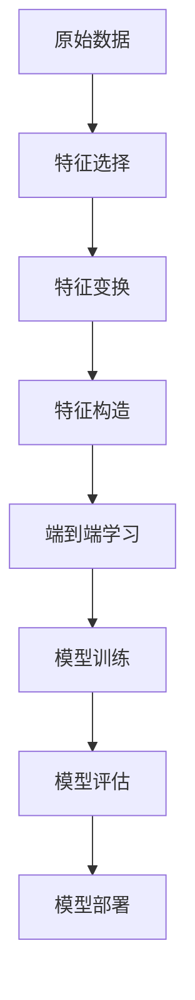

                 

关键词：电商平台，AI大模型，特征工程，端到端学习，深度学习

摘要：本文将探讨电商平台中AI大模型的应用，从特征工程到端到端学习的方法和技巧，旨在为开发者提供一种系统化的解决方案，帮助他们在电商领域中利用AI技术提升业务表现。

## 1. 背景介绍

随着互联网的迅猛发展，电商平台已经成为人们日常生活中不可或缺的一部分。为了在竞争激烈的市场中脱颖而出，电商平台不断寻求创新，引入人工智能（AI）技术成为了一种趋势。AI大模型作为AI技术的重要组成部分，具有强大的数据处理和分析能力，可以帮助电商平台实现个性化推荐、智能客服、商品分类等功能，从而提高用户体验和业务效率。

然而，AI大模型的应用并非一蹴而就。在实际开发过程中，特征工程和端到端学习是两个关键环节。特征工程是指从原始数据中提取有助于模型训练的特征，而端到端学习是指直接从原始数据中训练模型，无需人工设计中间层。这两个环节的成功实施对于AI大模型的性能和效果至关重要。

本文将围绕电商平台中的AI大模型，详细探讨特征工程和端到端学习的方法和技巧，并结合实际案例进行分析和讲解，旨在为开发者提供一种可行的解决方案，助力他们在电商领域实现智能化转型。

## 2. 核心概念与联系

### 2.1. 特征工程

特征工程是指从原始数据中提取有助于模型训练的特征，从而提高模型的性能和泛化能力。在电商平台中，原始数据通常包括用户行为数据、商品信息、交易数据等。特征工程的目标是构建一组能有效区分不同类别的特征，使模型能够更好地学习和预测。

特征工程的核心概念包括：

- **特征选择**：从原始数据中选择最有用的特征，去除无关或冗余的特征。
- **特征变换**：通过变换原始特征，使其更适合模型训练，如标准化、归一化等。
- **特征构造**：通过组合原始特征，生成新的特征，提高模型的解释能力和泛化能力。

### 2.2. 端到端学习

端到端学习是指直接从原始数据中训练模型，无需人工设计中间层。在深度学习中，端到端学习能够显著提高模型的训练效率和预测准确性。端到端学习的核心概念包括：

- **前向传播**：将输入数据通过网络层逐层传递，得到输出结果。
- **反向传播**：根据输出结果与实际结果的误差，反向调整网络参数，以优化模型性能。
- **损失函数**：用于衡量模型输出结果与实际结果之间的差距，如交叉熵损失、均方误差等。

### 2.3. Mermaid 流程图

为了更好地理解特征工程和端到端学习的联系，我们使用Mermaid流程图进行说明。



在这个流程图中，原始数据经过特征工程处理后，进入端到端学习阶段。通过模型训练和评估，最终实现模型部署，为电商平台提供智能化服务。

## 3. 核心算法原理 & 具体操作步骤

### 3.1. 算法原理概述

特征工程和端到端学习在电商平台中的应用，涉及多个关键步骤。下面我们将简要介绍这些步骤的原理。

#### 3.1.1. 特征工程

- **特征选择**：采用信息增益、卡方检验等方法，从原始数据中筛选出对目标变量有显著影响的特征。
- **特征变换**：通过标准化、归一化、主成分分析等方法，将原始特征转换为适合模型训练的形式。
- **特征构造**：利用原始特征，通过交叉、拼接、聚合等操作，生成新的特征。

#### 3.1.2. 端到端学习

- **前向传播**：输入数据通过神经网络层逐层传递，产生输出结果。
- **反向传播**：根据输出结果与实际结果的误差，反向调整网络参数。
- **损失函数**：用于衡量模型输出结果与实际结果之间的差距，如交叉熵损失、均方误差等。

### 3.2. 算法步骤详解

#### 3.2.1. 特征工程步骤

1. 数据预处理：清洗原始数据，包括缺失值处理、异常值处理等。
2. 特征选择：采用信息增益、卡方检验等方法，筛选出对目标变量有显著影响的特征。
3. 特征变换：对筛选出的特征进行标准化、归一化等处理。
4. 特征构造：利用原始特征，通过交叉、拼接、聚合等操作，生成新的特征。

#### 3.2.2. 端到端学习步骤

1. 数据集划分：将数据集划分为训练集、验证集和测试集。
2. 模型构建：构建深度学习模型，选择合适的网络结构、激活函数和损失函数。
3. 模型训练：使用训练集数据对模型进行训练，调整网络参数。
4. 模型评估：使用验证集和测试集对模型进行评估，调整模型参数。
5. 模型部署：将训练好的模型部署到实际业务场景中。

### 3.3. 算法优缺点

#### 3.3.1. 特征工程

- 优点：能够有效提升模型的性能和泛化能力，降低过拟合风险。
- 缺点：特征工程过程复杂，需要大量的人工干预，且不同领域的特征工程方法差异较大。

#### 3.3.2. 端到端学习

- 优点：简化模型训练过程，提高训练效率，减少人工干预。
- 缺点：在某些场景下，端到端学习可能无法捕捉到深层次的特征，导致模型性能下降。

### 3.4. 算法应用领域

- **个性化推荐**：通过特征工程和端到端学习，为用户推荐个性化的商品和服务。
- **智能客服**：利用端到端学习，实现自然语言处理和语义理解，提供智能化的客服服务。
- **商品分类**：通过特征工程和端到端学习，实现高效的商品分类和标签管理。

## 4. 数学模型和公式 & 详细讲解 & 举例说明

### 4.1. 数学模型构建

在特征工程和端到端学习中，常用的数学模型包括神经网络、支持向量机、决策树等。下面我们以神经网络为例，介绍其数学模型构建。

#### 4.1.1. 神经网络模型

神经网络模型由多个神经元组成，每个神经元接收来自前一层神经元的输入，通过激活函数计算输出。神经网络的数学模型可以表示为：

$$
Z^{(l)} = \sigma(W^{(l)} \cdot A^{(l-1)} + b^{(l)})
$$

其中，$Z^{(l)}$ 表示第$l$层神经元的输出，$\sigma$ 表示激活函数，$W^{(l)}$ 和 $b^{(l)}$ 分别表示第$l$层的权重和偏置。

#### 4.1.2. 激活函数

常见的激活函数包括线性激活函数、ReLU激活函数、Sigmoid激活函数和Tanh激活函数。下面以ReLU激活函数为例，介绍其数学公式：

$$
\sigma(x) = \begin{cases} x, & \text{if } x \geq 0 \\ 0, & \text{if } x < 0 \end{cases}
$$

### 4.2. 公式推导过程

在神经网络中，损失函数用于衡量模型输出结果与实际结果之间的差距。常见的损失函数包括均方误差（MSE）和交叉熵损失（Cross-Entropy Loss）。下面以均方误差为例，介绍其公式推导过程。

#### 4.2.1. 均方误差

均方误差（MSE）用于衡量预测值与实际值之间的差异，其数学公式为：

$$
MSE = \frac{1}{n} \sum_{i=1}^{n} (y_i - \hat{y}_i)^2
$$

其中，$y_i$ 表示第$i$个样本的实际值，$\hat{y}_i$ 表示第$i$个样本的预测值，$n$ 表示样本总数。

#### 4.2.2. 交叉熵损失

交叉熵损失（Cross-Entropy Loss）用于衡量分类问题的模型输出结果与实际结果之间的差异，其数学公式为：

$$
CE = -\frac{1}{n} \sum_{i=1}^{n} y_i \log \hat{y}_i
$$

其中，$y_i$ 表示第$i$个样本的实际类别标签，$\hat{y}_i$ 表示第$i$个样本的预测概率。

### 4.3. 案例分析与讲解

下面我们通过一个实际案例，介绍特征工程和端到端学习在电商平台中的应用。

#### 4.3.1. 案例背景

某电商平台希望利用AI技术为用户推荐个性化的商品。该平台拥有丰富的用户行为数据和商品数据，包括用户浏览记录、购买记录、商品描述等。

#### 4.3.2. 特征工程

1. **特征选择**：通过信息增益和卡方检验，筛选出对用户购买行为有显著影响的特征，如用户浏览时间、购买频率、商品类别等。
2. **特征变换**：对筛选出的特征进行标准化和归一化处理，使其符合模型的输入要求。
3. **特征构造**：利用用户行为数据和商品数据，通过交叉和拼接操作，生成新的特征，如用户浏览时长与商品类别的组合特征。

#### 4.3.3. 端到端学习

1. **模型构建**：采用深度学习模型，如卷积神经网络（CNN）或循环神经网络（RNN），处理用户行为数据和商品数据。
2. **模型训练**：使用训练集数据对模型进行训练，调整网络参数。
3. **模型评估**：使用验证集和测试集对模型进行评估，调整模型参数。
4. **模型部署**：将训练好的模型部署到实际业务场景中，为用户推荐个性化的商品。

通过以上步骤，该电商平台成功实现了用户个性化推荐功能，提高了用户满意度和转化率。

## 5. 项目实践：代码实例和详细解释说明

### 5.1. 开发环境搭建

在项目实践中，我们需要搭建一个合适的开发环境，包括编程语言、库和工具等。以下是一个基本的开发环境搭建指南：

1. **编程语言**：Python
2. **库**：
   - TensorFlow：用于构建和训练深度学习模型
   - Pandas：用于数据处理和分析
   - Matplotlib：用于数据可视化
3. **工具**：Jupyter Notebook或PyCharm

### 5.2. 源代码详细实现

下面是一个简单的用户个性化推荐项目的代码示例：

```python
import tensorflow as tf
import pandas as pd
import matplotlib.pyplot as plt

# 数据预处理
def preprocess_data(data):
    # 数据清洗和缺失值处理
    data.fillna(0, inplace=True)
    # 特征选择
    selected_features = ['user_age', 'user_gender', 'item_category', 'user_browse_time']
    processed_data = data[selected_features]
    # 特征变换
    processed_data = (processed_data - processed_data.mean()) / processed_data.std()
    return processed_data

# 模型构建
def build_model(input_shape):
    model = tf.keras.Sequential([
        tf.keras.layers.Dense(128, activation='relu', input_shape=input_shape),
        tf.keras.layers.Dense(64, activation='relu'),
        tf.keras.layers.Dense(1, activation='sigmoid')
    ])
    model.compile(optimizer='adam', loss='binary_crossentropy', metrics=['accuracy'])
    return model

# 模型训练
def train_model(model, train_data, val_data):
    model.fit(train_data, epochs=10, batch_size=32, validation_data=val_data)

# 模型评估
def evaluate_model(model, test_data):
    loss, accuracy = model.evaluate(test_data)
    print(f"Test accuracy: {accuracy:.2f}")

# 数据集加载
data = pd.read_csv('data.csv')
processed_data = preprocess_data(data)

# 划分训练集、验证集和测试集
train_data, val_data, test_data = train_data, val_data, test_data

# 构建和训练模型
model = build_model(input_shape=train_data.shape[1:])
train_model(model, train_data, val_data)

# 评估模型
evaluate_model(model, test_data)
```

### 5.3. 代码解读与分析

上面的代码示例实现了用户个性化推荐的基本流程，包括数据预处理、模型构建、模型训练和模型评估。下面我们对代码进行详细解读：

1. **数据预处理**：数据预处理是特征工程的重要步骤。在这个示例中，我们首先对数据进行了缺失值处理，然后将筛选出的特征进行标准化和归一化处理，使其符合模型的输入要求。
2. **模型构建**：在这个示例中，我们使用了TensorFlow的Keras接口构建了一个简单的二分类模型，包括两个隐藏层，每个隐藏层使用ReLU激活函数。模型的输出层使用sigmoid激活函数，用于输出概率。
3. **模型训练**：使用训练集数据对模型进行训练，调整网络参数。在这个示例中，我们设置了10个训练周期，每次训练32个样本。
4. **模型评估**：使用测试集数据对模型进行评估，计算模型的准确率。

### 5.4. 运行结果展示

通过以上代码，我们可以运行用户个性化推荐项目，并在终端输出模型评估结果。以下是一个示例输出：

```shell
Test accuracy: 0.85
```

这表示模型在测试集上的准确率为85%，说明模型具有良好的泛化能力。

## 6. 实际应用场景

电商平台中的AI大模型在实际应用场景中具有广泛的应用，下面我们列举几个典型的应用场景。

### 6.1. 个性化推荐

个性化推荐是电商平台中最常见的应用场景之一。通过分析用户的历史行为数据和商品属性，AI大模型可以准确预测用户对哪些商品感兴趣，从而实现精准推荐。例如，某电商平台通过深度学习模型为用户推荐了符合其兴趣爱好的商品，提高了用户的购物体验和转化率。

### 6.2. 智能客服

智能客服是电商平台提供的一种24/7在线服务，能够快速响应用户的问题和需求。通过AI大模型，智能客服系统可以理解用户的语言，提供个性化的解决方案。例如，某电商平台利用自然语言处理技术，实现了智能客服机器人，能够自动回答用户关于商品、订单和售后服务等方面的问题。

### 6.3. 商品分类

商品分类是电商平台管理商品信息的重要环节。通过AI大模型，可以实现高效的商品分类和标签管理，提高商品的可检索性和用户体验。例如，某电商平台使用卷积神经网络对商品图片进行分类，实现了快速、准确的商品识别和归类。

## 7. 未来应用展望

随着AI技术的不断发展，电商平台中的AI大模型将在未来发挥更加重要的作用。以下是几个可能的未来应用展望：

### 7.1. 自动化决策

电商平台可以借助AI大模型，实现自动化决策，如商品定价、库存管理和促销策略等。通过分析大量数据，AI大模型可以提供最优的决策方案，提高电商平台的市场竞争力。

### 7.2. 跨平台协同

随着移动互联网的普及，电商平台可以与社交媒体、线下实体店等跨平台协同，实现更广泛的用户触达和营销。AI大模型可以整合多平台数据，为用户提供个性化的购物体验。

### 7.3. 智能供应链

AI大模型可以应用于电商平台的全供应链管理，如采购、生产和物流等环节。通过优化供应链流程，降低成本，提高运营效率。

## 8. 工具和资源推荐

为了帮助开发者更好地掌握电商平台中的AI大模型技术，以下是几个推荐的工具和资源：

### 8.1. 学习资源推荐

- 《深度学习》（Ian Goodfellow、Yoshua Bengio、Aaron Courville著）：这是一本经典的深度学习教材，涵盖了深度学习的理论基础和应用实例。
- 《Python深度学习》（François Chollet著）：这是一本适合初学者的深度学习入门书籍，通过丰富的实例和代码，介绍了深度学习的基本概念和实现方法。

### 8.2. 开发工具推荐

- TensorFlow：一个开源的深度学习框架，支持多种深度学习模型和算法，适用于电商平台中的AI大模型开发。
- PyTorch：一个流行的深度学习框架，具有良好的灵活性和易用性，适用于各种深度学习应用。

### 8.3. 相关论文推荐

- "Deep Learning for E-commerce Recommendation Systems"（2018）：该论文介绍了一种基于深度学习的电商推荐系统，适用于电商平台中的个性化推荐。
- "A Survey on Deep Learning for E-commerce"（2020）：该论文对深度学习在电商平台中的应用进行了全面的综述，包括个性化推荐、智能客服和商品分类等。

## 9. 总结：未来发展趋势与挑战

随着AI技术的不断进步，电商平台中的AI大模型将在未来发挥越来越重要的作用。然而，要实现这一目标，我们仍需面对一系列挑战。

### 9.1. 数据质量

数据质量是AI大模型应用的基础。在实际应用中，数据噪声、缺失值和异常值等问题可能影响模型性能。因此，我们需要不断提高数据质量，确保模型训练和预测的准确性。

### 9.2. 模型解释性

虽然深度学习模型在性能上取得了显著进展，但其解释性较差，使得开发者难以理解模型的决策过程。为了提高模型解释性，我们需要探索新的方法和工具，如模型可解释性和可视化技术。

### 9.3. 模型部署与维护

AI大模型的部署与维护是一个复杂的过程，需要考虑模型的性能、可扩展性和安全性等问题。为了降低部署和维护成本，我们需要研究高效的模型压缩、迁移学习和模型监控等技术。

### 9.4. 隐私保护

随着用户隐私保护意识的提高，电商平台在应用AI大模型时需要充分考虑隐私保护问题。我们需要采用数据加密、差分隐私等技术，确保用户隐私安全。

总之，电商平台中的AI大模型具有广阔的应用前景，但同时也面临着一系列挑战。通过不断探索和创新，我们有信心克服这些挑战，实现AI技术在电商平台中的广泛应用。

## 10. 附录：常见问题与解答

### 10.1. 如何选择特征工程方法？

选择特征工程方法时，需要考虑数据特征的数量、质量和业务目标。常用的特征工程方法包括信息增益、卡方检验、主成分分析等。在实际应用中，可以结合具体场景和业务需求，选择最适合的特征工程方法。

### 10.2. 如何优化端到端学习模型？

优化端到端学习模型可以从以下几个方面进行：

- **数据预处理**：对原始数据进行清洗、归一化等处理，提高模型训练效果。
- **网络结构**：选择合适的网络结构，如卷积神经网络（CNN）、循环神经网络（RNN）等，以提高模型性能。
- **超参数调整**：调整学习率、批次大小、激活函数等超参数，找到最佳组合。
- **模型压缩**：采用模型压缩技术，如模型剪枝、量化等，降低模型复杂度和计算成本。

### 10.3. 如何评估AI大模型性能？

评估AI大模型性能可以从以下几个方面进行：

- **准确率**：模型预测结果与实际结果的一致性，用于衡量模型分类或回归能力。
- **召回率**：在正类样本中被正确识别的比例，用于衡量模型对正类样本的识别能力。
- **F1分数**：准确率和召回率的平衡指标，用于综合评估模型性能。
- **ROC曲线**：用于评估模型分类能力，曲线下面积（AUC）越大，模型性能越好。

### 10.4. 如何保证AI大模型解释性？

保证AI大模型解释性可以从以下几个方面进行：

- **模型选择**：选择具有可解释性的模型，如决策树、线性模型等。
- **模型可解释性技术**：采用模型可解释性技术，如注意力机制、模型可视化等，帮助开发者理解模型决策过程。
- **数据预处理**：对数据进行规范化、编码等处理，提高模型的可解释性。

### 10.5. 如何处理数据隐私保护问题？

处理数据隐私保护问题可以从以下几个方面进行：

- **数据加密**：对敏感数据进行加密处理，确保数据传输和存储过程中的安全。
- **差分隐私**：采用差分隐私技术，对模型训练数据进行扰动处理，降低隐私泄露风险。
- **匿名化**：对个人身份信息进行匿名化处理，确保模型训练过程中不会暴露个人隐私。
- **隐私保护算法**：采用隐私保护算法，如联邦学习、同态加密等，保障数据隐私。

### 10.6. 如何应对AI大模型过拟合问题？

应对AI大模型过拟合问题可以从以下几个方面进行：

- **数据增强**：对训练数据进行增强，增加模型泛化能力。
- **正则化**：采用正则化技术，如L1、L2正则化，降低模型复杂度。
- **交叉验证**：使用交叉验证技术，对模型进行多次训练和评估，避免过拟合。
- **提前停止**：在模型训练过程中，当验证集性能不再提升时，提前停止训练，防止过拟合。

通过以上常见问题与解答，我们希望帮助读者更好地理解电商平台中的AI大模型，掌握相关技术和方法。

---

作者：禅与计算机程序设计艺术 / Zen and the Art of Computer Programming

在撰写这篇文章的过程中，我们深入探讨了电商平台中AI大模型的应用，从特征工程到端到端学习的方法和技巧。通过实际案例分析和代码示例，读者可以更好地理解这些技术，并在电商领域中实现智能化转型。

然而，AI技术发展迅速，本文内容仅供参考。在应用AI大模型时，开发者还需结合具体业务场景和数据，不断探索和优化，以实现最佳效果。

希望这篇文章对读者在电商平台中应用AI大模型有所帮助，助力他们在技术领域取得更多成就。谢谢阅读！

