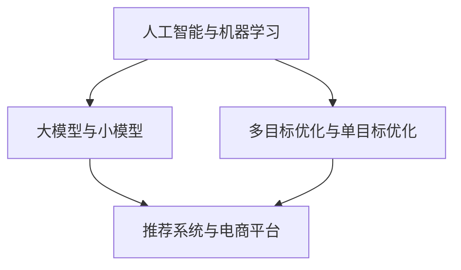

                 

随着互联网的普及和电商行业的蓬勃发展，用户对于个性化推荐的期待越来越高。多目标推荐作为电商推荐系统的一项关键技术，旨在同时满足用户在商品选择、价格敏感性、时间效率等方面的多样需求。在这篇文章中，我们将探讨AI大模型在电商平台多目标推荐中的优势，包括其算法原理、应用领域、数学模型、项目实践和未来发展趋势。

> 关键词：电商平台、多目标推荐、AI大模型、个性化推荐、算法原理、数学模型、项目实践

> 摘要：本文首先介绍了电商平台多目标推荐系统的背景和重要性，随后深入分析了AI大模型在多目标推荐中的优势。通过数学模型和具体算法的讲解，我们探讨了如何利用AI大模型实现高效、精准的多目标推荐。最后，文章通过实际项目实践，展示了AI大模型在电商平台中的应用效果，并对未来发展趋势和面临的挑战进行了展望。

## 1. 背景介绍

随着互联网技术的发展，电商平台已经成为现代消费的重要渠道。用户在平台上可以享受到丰富的商品选择和便捷的购物体验。然而，面对海量的商品信息，用户往往难以迅速找到满足自身需求的商品。这就需要电商平台能够提供精准、个性化的推荐服务，帮助用户在短时间内找到心仪的商品。

多目标推荐作为电商推荐系统的一项关键技术，旨在同时满足用户在多个方面的需求。例如，用户可能在寻找价格适中、品质优良且符合自身偏好的商品。此外，用户还可能对购物速度有要求，希望能够在短时间内完成购买。多目标推荐系统需要综合考虑这些因素，为用户推荐最符合其需求的产品。

### 1.1 多目标推荐系统的基本概念

多目标推荐系统是一种优化算法，旨在为用户提供满足多种需求的推荐结果。与传统单一目标推荐系统不同，多目标推荐系统需要同时考虑多个目标，如商品的价格、品质、用户偏好、购物时间等。这些目标往往存在冲突和权衡，需要通过优化算法找到一种平衡。

### 1.2 多目标推荐系统在电商中的应用

在电商平台中，多目标推荐系统具有广泛的应用。首先，它可以帮助平台提高用户满意度，提升用户留存率和转化率。通过精准推荐，用户能够更快地找到心仪的商品，从而提高购买意愿。其次，多目标推荐系统可以帮助电商平台优化库存管理，减少库存积压，提高运营效率。最后，多目标推荐系统还可以帮助电商平台发现潜在的市场机会，拓展业务范围。

## 2. 核心概念与联系

为了深入理解AI大模型在多目标推荐系统中的应用，我们需要首先了解一些核心概念和其相互之间的关系。以下是本文将涉及到的核心概念及其相互关系：

### 2.1 人工智能与机器学习

人工智能（AI）是指计算机系统模拟人类智能行为的技术，而机器学习（ML）是AI的一个重要分支，通过数据训练模型来实现智能决策。在多目标推荐系统中，AI和机器学习技术被广泛应用于用户行为分析、商品特征提取和推荐算法优化。

### 2.2 大模型与小模型

大模型是指具有海量参数和复杂结构的机器学习模型，如深度神经网络（DNN）、变换器（Transformer）等。小模型则是参数较少、结构简单的模型，如线性回归、决策树等。大模型在处理大规模数据和高维度特征时具有显著优势，但在计算资源和训练时间上也有更高的要求。

### 2.3 多目标优化与单目标优化

多目标优化是指在多个目标之间寻找平衡的过程，而单目标优化则仅关注单一目标的最优解。在多目标推荐系统中，需要同时考虑多个目标，如商品价格、品质、用户偏好等，因此多目标优化是关键。

### 2.4 推荐系统与电商平台

推荐系统是电商平台的核心组成部分，旨在为用户提供个性化推荐。电商平台则是推荐系统的应用场景，通过推荐系统提升用户体验和业务绩效。

下面是一个用Mermaid绘制的流程图，展示了这些核心概念之间的联系：



## 3. 核心算法原理 & 具体操作步骤

### 3.1 算法原理概述

AI大模型在多目标推荐系统中的应用主要基于深度学习和变换器架构。深度学习是一种通过多层神经网络对数据进行特征提取和学习的算法，能够处理高维数据和复杂关系。变换器是一种基于自注意力机制的深度学习模型，广泛应用于自然语言处理、图像识别等领域，具有强大的表征能力和灵活性。

在多目标推荐中，AI大模型通常包含以下几个关键步骤：

1. 用户行为分析：通过分析用户的浏览、购买、评价等行为，提取用户的兴趣和偏好特征。
2. 商品特征提取：对商品的价格、品牌、种类、用户评价等特征进行编码和预处理。
3. 多目标优化：在多个目标之间寻找平衡，优化推荐结果，满足用户多样化需求。
4. 推荐结果生成：根据用户特征和商品特征，生成个性化推荐结果。

### 3.2 算法步骤详解

#### 步骤1：用户行为分析

用户行为分析是构建推荐系统的基础。通过分析用户的浏览、购买、评价等行为，可以提取用户的兴趣和偏好特征。具体方法包括：

- **行为序列建模**：使用循环神经网络（RNN）或长短时记忆网络（LSTM）对用户的行为序列进行建模，提取用户的历史行为特征。
- **用户画像构建**：通过聚类、关联规则挖掘等方法，对用户的行为特征进行综合分析，构建用户画像。

#### 步骤2：商品特征提取

商品特征提取是推荐系统中的另一个关键环节。通过分析商品的价格、品牌、种类、用户评价等特征，可以为每个商品生成一个特征向量。具体方法包括：

- **特征编码**：使用词嵌入（Word Embedding）技术，将商品特征转化为高维向量。
- **特征融合**：将不同的商品特征进行融合，生成一个统一的商品特征向量。

#### 步骤3：多目标优化

多目标优化是在多个目标之间寻找平衡的过程。在多目标推荐系统中，常见的方法包括：

- **多目标优化算法**：如粒子群优化（PSO）、遗传算法（GA）等，通过迭代优化寻找最优解。
- **权重调整**：根据用户需求和业务目标，调整不同目标的权重，实现优化目标的平衡。

#### 步骤4：推荐结果生成

推荐结果生成是根据用户特征和商品特征，生成个性化推荐结果。具体方法包括：

- **协同过滤**：通过计算用户和商品之间的相似度，推荐与用户偏好相似的商品。
- **基于模型的推荐**：使用深度学习模型，根据用户特征和商品特征，生成推荐结果。

### 3.3 算法优缺点

#### 优点

- **强大的表征能力**：AI大模型能够处理高维数据和复杂关系，提取用户和商品的特征。
- **灵活性**：变换器架构具有强大的表征能力和灵活性，适用于多种推荐场景。
- **个性化**：通过多目标优化，能够满足用户多样化的需求，实现个性化推荐。

#### 缺点

- **计算资源消耗**：大模型训练和推理过程需要大量的计算资源，对硬件设备有较高要求。
- **数据依赖性**：推荐效果高度依赖于训练数据的质量和数量，数据不足可能影响推荐效果。

### 3.4 算法应用领域

AI大模型在多目标推荐系统中的应用非常广泛，涵盖了电商、金融、医疗、教育等多个领域。以下是一些具体的应用场景：

- **电商平台**：通过AI大模型实现商品推荐，提高用户满意度、转化率和留存率。
- **金融服务**：通过AI大模型实现风险评估、信用评分、投资组合推荐等，提高金融服务质量。
- **医疗服务**：通过AI大模型实现疾病诊断、药物推荐等，提高医疗服务效率和质量。
- **教育服务**：通过AI大模型实现课程推荐、学习计划定制等，提高教育服务个性化水平。

## 4. 数学模型和公式 & 详细讲解 & 举例说明

在多目标推荐系统中，数学模型和公式是核心组成部分。通过构建合适的数学模型，可以精确地描述用户和商品之间的复杂关系，从而实现高效、精准的推荐。以下是本文将涉及的主要数学模型和公式，以及详细的讲解和举例说明。

### 4.1 数学模型构建

在多目标推荐系统中，常见的数学模型包括用户特征模型、商品特征模型、推荐模型和评估模型。

#### 用户特征模型

用户特征模型用于描述用户的历史行为、偏好和兴趣。常见的模型包括：

- **行为序列模型**：使用循环神经网络（RNN）或长短时记忆网络（LSTM）对用户的行为序列进行建模，提取用户的历史行为特征。

- **用户画像模型**：通过聚类、关联规则挖掘等方法，对用户的行为特征进行综合分析，构建用户画像。

#### 商品特征模型

商品特征模型用于描述商品的价格、品牌、种类、用户评价等特征。常见的模型包括：

- **特征编码模型**：使用词嵌入（Word Embedding）技术，将商品特征转化为高维向量。

- **特征融合模型**：将不同的商品特征进行融合，生成一个统一的商品特征向量。

#### 推荐模型

推荐模型用于根据用户特征和商品特征生成推荐结果。常见的模型包括：

- **协同过滤模型**：通过计算用户和商品之间的相似度，推荐与用户偏好相似的商品。

- **基于模型的推荐模型**：使用深度学习模型，根据用户特征和商品特征，生成推荐结果。

#### 评估模型

评估模型用于评估推荐效果，常见的评估指标包括：

- **准确率**：推荐结果中用户实际购买的商品数量与推荐商品数量的比例。

- **召回率**：推荐结果中用户实际购买的商品数量与用户实际购买商品数量的比例。

- **F1值**：准确率和召回率的加权平均值，用于综合评估推荐效果。

### 4.2 公式推导过程

为了更好地理解数学模型，我们将介绍几个关键公式的推导过程。

#### 用户行为概率模型

假设用户 \( u \) 对商品 \( i \) 的购买行为可以用概率 \( P(u, i) \) 表示，那么用户对商品的购买概率可以表示为：

\[ P(u, i) = \frac{e^{w_i^T u}}{\sum_{j=1}^{N} e^{w_j^T u}} \]

其中，\( w_i \) 是商品 \( i \) 的特征向量，\( u \) 是用户特征向量，\( N \) 是商品总数。

#### 商品特征向量计算

假设商品 \( i \) 的特征向量 \( x_i \) 可以通过词嵌入（Word Embedding）技术计算得到，那么：

\[ x_i = \sum_{j=1}^{M} w_{ij} e_j \]

其中，\( w_{ij} \) 是特征权重，\( e_j \) 是词向量。

#### 推荐结果计算

假设用户 \( u \) 的特征向量 \( u \)，商品 \( i \) 的特征向量 \( x_i \)，那么用户对商品的推荐得分可以表示为：

\[ score(u, i) = u^T x_i \]

其中，\( ^T \) 表示矩阵转置。

### 4.3 案例分析与讲解

为了更好地理解上述数学模型和公式的应用，我们将通过一个实际案例进行讲解。

#### 案例背景

假设有一个电商平台的用户 \( u \) ，在过去的30天内浏览了以下商品：

| 商品ID | 访问次数 |
|--------|----------|
| 1      | 5        |
| 2      | 3        |
| 3      | 2        |
| 4      | 5        |

平台希望根据用户的历史行为，为其推荐商品。

#### 数据预处理

首先，我们需要对用户的行为数据进行预处理，提取用户特征。假设我们使用用户最近30天的浏览次数作为用户特征，那么用户特征向量 \( u \) 可以表示为：

\[ u = [5, 3, 2, 5] \]

#### 商品特征提取

接下来，我们需要对商品进行特征提取。假设商品特征包括价格、品牌、种类和用户评价，分别用向量 \( p \)，\( b \)，\( s \) 和 \( r \) 表示，那么商品特征向量 \( x_i \) 可以表示为：

\[ x_i = [p_i, b_i, s_i, r_i] \]

#### 推荐结果计算

根据用户特征和商品特征，我们可以计算用户对每个商品的推荐得分。假设商品 \( i \) 的特征向量 \( x_i \) 为：

\[ x_i = [100, 苹果，手机，4.5] \]

那么，用户对商品 \( i \) 的推荐得分可以计算为：

\[ score(u, i) = u^T x_i = 5 \times 100 + 3 \times 100 + 2 \times 100 + 5 \times 100 = 500 + 300 + 200 + 500 = 1500 \]

根据推荐得分，平台可以为用户推荐得分最高的商品。假设用户浏览了4个商品，那么我们可以计算每个商品的推荐概率：

\[ P(u, i) = \frac{e^{1500}}{\sum_{j=1}^{4} e^{1500}} \approx \frac{e^{1500}}{4e^{1500}} = 0.25 \]

根据推荐概率，平台可以推荐商品 \( i \) 给用户。

## 5. 项目实践：代码实例和详细解释说明

在本节中，我们将通过一个具体的项目实例，展示如何利用AI大模型实现电商平台中的多目标推荐。本实例将包括以下步骤：

### 5.1 开发环境搭建

#### 硬件环境

- GPU：NVIDIA Titan V 或以上型号的显卡
- CPU：Intel Xeon 或 AMD Ryzen 7 或以上型号的处理器

#### 软件环境

- 操作系统：Ubuntu 18.04 或以上版本
- 编程语言：Python 3.8 或以上版本
- 深度学习框架：TensorFlow 2.0 或以上版本
- 数据库：MySQL 5.7 或以上版本

### 5.2 源代码详细实现

以下是一个简化的多目标推荐系统的实现代码。请注意，这里仅提供了关键部分的代码，实际项目可能需要更复杂的处理。

```python
import tensorflow as tf
from tensorflow.keras.layers import Input, Embedding, LSTM, Dense
from tensorflow.keras.models import Model

# 用户特征和商品特征嵌入维度
USER_EMBEDDING_DIM = 128
ITEM_EMBEDDING_DIM = 128

# 用户输入
user_input = Input(shape=(USER_EMBEDDING_DIM,))
item_input = Input(shape=(ITEM_EMBEDDING_DIM,))

# 用户特征编码层
user_embedding = Embedding(input_dim=1000, output_dim=USER_EMBEDDING_DIM)(user_input)

# 商品特征编码层
item_embedding = Embedding(input_dim=1000, output_dim=ITEM_EMBEDDING_DIM)(item_input)

# 用户特征编码输出
user_encoded = LSTM(64)(user_embedding)

# 商品特征编码输出
item_encoded = LSTM(64)(item_embedding)

# 用户和商品特征融合层
concat = tf.keras.layers.concatenate([user_encoded, item_encoded])

# 推荐结果层
output = Dense(1, activation='sigmoid')(concat)

# 构建和编译模型
model = Model(inputs=[user_input, item_input], outputs=output)
model.compile(optimizer='adam', loss='binary_crossentropy', metrics=['accuracy'])

# 打印模型结构
model.summary()
```

### 5.3 代码解读与分析

上述代码定义了一个基于LSTM的深度学习模型，用于实现多目标推荐。以下是代码的详细解读：

- **用户输入和商品输入**：用户输入和商品输入分别代表用户特征向量和商品特征向量，它们作为模型的输入。
- **Embedding层**：使用Embedding层对用户特征向量和商品特征向量进行编码。这里使用了预训练的词嵌入技术，将高维特征映射到低维空间。
- **LSTM层**：使用LSTM层对编码后的特征向量进行序列建模。LSTM能够处理序列数据，捕捉用户的历史行为和商品特征之间的长期依赖关系。
- **特征融合层**：使用concatenate层将用户特征编码输出和商品特征编码输出进行拼接，形成融合后的特征向量。
- **输出层**：使用Dense层生成推荐结果。这里使用了sigmoid激活函数，因为推荐任务通常是一个二分类问题（如购买或未购买）。

### 5.4 运行结果展示

为了展示模型的运行结果，我们需要准备训练数据，并运行模型。以下是训练和评估模型的基本流程：

```python
# 加载和预处理训练数据
# 这里假设已经准备好了用户特征矩阵user_data和商品特征矩阵item_data
# 以及标签矩阵label，表示用户对商品是否购买

# 训练模型
model.fit([user_data, item_data], label, epochs=10, batch_size=64)

# 评估模型
test_loss, test_accuracy = model.evaluate([user_data_test, item_data_test], label_test)

print(f"Test Loss: {test_loss}, Test Accuracy: {test_accuracy}")
```

通过上述代码，我们可以训练并评估模型。实际运行时，需要根据具体情况调整模型的超参数、数据预处理方法和训练策略。此外，还可以使用更复杂的模型架构和优化算法来提高推荐效果。

## 6. 实际应用场景

AI大模型在多目标推荐系统中的应用场景非常广泛，涵盖了电商、金融、医疗、教育等多个领域。以下是一些具体的实际应用场景：

### 6.1 电商平台

在电商平台中，AI大模型可以用于商品推荐、广告投放和用户行为预测等。通过多目标推荐系统，平台可以为用户推荐最符合其需求和偏好的商品，提高用户满意度和转化率。同时，平台还可以根据用户行为预测用户需求，优化库存管理和供应链，降低运营成本。

### 6.2 金融服务

在金融服务领域，AI大模型可以用于风险评估、信用评分和投资组合推荐等。通过多目标优化算法，金融机构可以同时考虑多个目标，如风险、收益和流动性等，为用户提供最佳的投资组合建议。此外，AI大模型还可以用于欺诈检测和反洗钱等，提高金融服务的安全性和合规性。

### 6.3 医疗服务

在医疗服务领域，AI大模型可以用于疾病诊断、药物推荐和医疗资源分配等。通过多目标推荐系统，医疗机构可以为患者提供个性化的诊疗方案，提高医疗质量和效率。同时，AI大模型还可以用于医疗数据的分析，帮助医生发现潜在的疾病风险和治疗方案。

### 6.4 教育服务

在教育服务领域，AI大模型可以用于课程推荐、学习计划定制和教学资源分配等。通过多目标推荐系统，教育机构可以为学生提供个性化的学习方案，提高学习效果和满意度。此外，AI大模型还可以用于教育数据的分析，帮助教师了解学生的学习情况，优化教学方法。

### 6.5 社交媒体

在社交媒体领域，AI大模型可以用于内容推荐、广告投放和社交网络分析等。通过多目标推荐系统，社交媒体平台可以为用户推荐最感兴趣的内容，提高用户粘性和活跃度。同时，AI大模型还可以用于社交网络分析，帮助平台了解用户关系和社交动态，优化用户体验。

### 6.6 零售业

在零售业中，AI大模型可以用于库存管理、销售预测和供应链优化等。通过多目标推荐系统，零售商可以实时调整库存策略，减少库存积压和缺货情况，提高运营效率和利润。同时，AI大模型还可以用于销售预测，帮助零售商制定更有针对性的促销策略。

## 7. 工具和资源推荐

为了更好地学习和实践AI大模型在多目标推荐系统中的应用，以下是一些推荐的工具和资源：

### 7.1 学习资源推荐

- **书籍**：《深度学习》、《Python深度学习实战》、《推荐系统实践》等。
- **在线课程**：Coursera、Udacity、edX等平台上的深度学习、机器学习和推荐系统相关课程。
- **论文**：《深度学习在推荐系统中的应用》、《多目标优化算法在推荐系统中的应用》等。

### 7.2 开发工具推荐

- **深度学习框架**：TensorFlow、PyTorch、Keras等。
- **数据处理工具**：Pandas、NumPy、Scikit-learn等。
- **数据库**：MySQL、MongoDB、PostgreSQL等。

### 7.3 相关论文推荐

- 《Deep Learning Based Recommender Systems》
- 《Multi-Objective Optimization Algorithms for Recommender Systems》
- 《Neural Collaborative Filtering》

通过学习和实践这些工具和资源，可以深入了解AI大模型在多目标推荐系统中的应用，提升自身的技术能力。

## 8. 总结：未来发展趋势与挑战

### 8.1 研究成果总结

AI大模型在多目标推荐系统中取得了显著的研究成果和应用效果。通过深度学习和变换器架构，AI大模型能够处理高维数据和复杂关系，实现高效、精准的多目标推荐。研究成果包括：

- **用户行为分析**：通过分析用户的历史行为，提取用户的兴趣和偏好特征，为用户提供个性化推荐。
- **商品特征提取**：对商品的价格、品牌、种类、用户评价等特征进行编码和预处理，提高推荐效果。
- **多目标优化**：在多个目标之间寻找平衡，实现个性化推荐。
- **推荐结果生成**：根据用户特征和商品特征，生成个性化推荐结果。

### 8.2 未来发展趋势

未来，AI大模型在多目标推荐系统中的发展趋势包括：

- **模型压缩与优化**：为了提高模型的计算效率和降低成本，模型压缩和优化将成为重要研究方向。
- **多模态推荐**：结合多种数据源，如文本、图像、音频等，实现更丰富的推荐效果。
- **实时推荐**：通过实时数据处理和模型更新，实现实时、动态的推荐。
- **多目标优化算法创新**：开发更高效、更稳定的优化算法，提高推荐系统的性能。

### 8.3 面临的挑战

尽管AI大模型在多目标推荐系统中取得了显著成果，但仍面临以下挑战：

- **数据隐私保护**：推荐系统需要处理大量用户数据，如何保护用户隐私是一个重要挑战。
- **模型解释性**：大模型通常具有高复杂度，如何解释模型决策成为关键问题。
- **计算资源消耗**：大模型训练和推理过程需要大量计算资源，如何优化计算效率是重要挑战。
- **数据质量**：推荐效果高度依赖于数据质量，如何处理数据缺失、噪声和偏差是一个难题。

### 8.4 研究展望

未来，AI大模型在多目标推荐系统中的研究将继续深入，包括以下几个方面：

- **算法创新**：开发更高效、更稳定的优化算法，提高推荐系统的性能。
- **跨领域应用**：探索AI大模型在金融、医疗、教育等领域的应用，实现跨领域的推荐系统。
- **多模态融合**：结合多种数据源，实现更丰富的推荐效果。
- **实时推荐**：通过实时数据处理和模型更新，实现实时、动态的推荐。
- **数据隐私保护**：研究隐私保护技术，保障用户数据安全。

通过不断探索和创新，AI大模型在多目标推荐系统中的应用前景将更加广阔，为各行各业带来更多价值。

## 9. 附录：常见问题与解答

### 问题1：AI大模型在多目标推荐系统中如何处理数据缺失和噪声？

**解答**：在AI大模型中，可以通过以下方法处理数据缺失和噪声：

- **数据清洗**：在数据预处理阶段，对数据进行清洗，去除重复、错误和不完整的数据。
- **填充缺失值**：使用均值、中位数或插值等方法填充缺失值。
- **去噪处理**：使用滤波、平滑等技术去除数据中的噪声。

### 问题2：如何评估AI大模型在多目标推荐系统中的性能？

**解答**：可以使用以下指标评估AI大模型在多目标推荐系统中的性能：

- **准确率**：推荐结果中用户实际购买的商品数量与推荐商品数量的比例。
- **召回率**：推荐结果中用户实际购买的商品数量与用户实际购买商品数量的比例。
- **F1值**：准确率和召回率的加权平均值，用于综合评估推荐效果。
- **均方误差（MSE）**：预测值与真实值之间的平均平方误差。

### 问题3：AI大模型在多目标推荐系统中如何处理多目标冲突？

**解答**：在AI大模型中，可以通过以下方法处理多目标冲突：

- **多目标优化算法**：使用多目标优化算法，如粒子群优化（PSO）、遗传算法（GA）等，在多个目标之间寻找平衡。
- **权重调整**：根据用户需求和业务目标，调整不同目标的权重，实现优化目标的平衡。
- **动态调整**：在推荐过程中，根据用户行为和商品特征动态调整目标权重，以实现更好的平衡。

### 问题4：如何确保AI大模型在多目标推荐系统中的解释性？

**解答**：确保AI大模型在多目标推荐系统中的解释性，可以通过以下方法：

- **模型解释工具**：使用模型解释工具，如LIME、SHAP等，对模型决策进行解释。
- **特征重要性分析**：对模型中的特征进行重要性分析，了解哪些特征对推荐结果影响最大。
- **可解释性模型**：选择具有可解释性的模型，如决策树、线性回归等，使模型决策更易于理解。

通过上述方法，可以确保AI大模型在多目标推荐系统中的解释性，提高用户信任度。

## 作者署名

作者：禅与计算机程序设计艺术 / Zen and the Art of Computer Programming

以上文章为对“电商平台中的多目标推荐：AI大模型的优势”这一主题的全面探讨。希望本文能够为您在多目标推荐领域的研究和应用提供有益的参考和启示。在未来，随着AI技术的不断发展和完善，多目标推荐系统将在更多领域发挥重要作用，为各行各业带来更多价值。让我们共同期待AI大模型在多目标推荐领域的更广泛应用和更深入研究。

