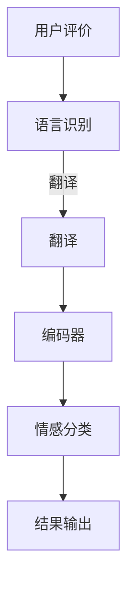

                 

关键词：多语言情感分析、AI大模型、电商平台、文本分析、情感识别、自然语言处理、深度学习、大数据、个性化推荐

> 摘要：本文将深入探讨电商平台中多语言情感分析的应用，并着重分析AI大模型在这一领域的优势。通过对核心概念、算法原理、数学模型和项目实践的详细讲解，读者将了解多语言情感分析在电商平台中的重要性，以及AI大模型如何帮助平台优化用户体验，提升业务效果。

## 1. 背景介绍

### 电商平台的发展现状

随着全球化的推进，电商平台已经成为现代商业不可或缺的一部分。这些平台不仅在国内市场占据重要地位，还在国际市场上迅速扩张。例如，亚马逊、eBay和阿里巴巴等巨头在全球范围内拥有庞大的用户基础和商品供应链。这种全球化的趋势，使得电商平台必须能够处理多种语言的内容。

### 多语言情感分析的重要性

在电商平台中，用户评价和评论是影响消费者决策的重要因素。这些评价通常包含情感色彩，如正面、负面或中立。对这些评价进行情感分析，可以帮助电商平台了解用户对产品和服务的真实感受，从而做出相应的调整和优化。

多语言情感分析尤其重要，因为用户的评价可能来自不同语言背景。如果电商平台不能有效地处理这些多语言评价，可能会错失重要的用户反馈，甚至可能导致用户体验下降。

### AI大模型的发展与应用

近年来，随着深度学习技术的快速发展，AI大模型在多个领域取得了显著成果。特别是在自然语言处理（NLP）领域，AI大模型展示了强大的能力，可以处理复杂的语言结构和语义信息。这些大模型的出现，为多语言情感分析提供了强有力的工具。

## 2. 核心概念与联系

### 多语言情感分析的核心概念

多语言情感分析涉及多个核心概念：

- **情感分类**：将文本中的情感分类为正面、负面或中性。
- **语言识别**：识别文本的语言类型，以便使用正确的情感分析模型。
- **翻译**：对于非目标语言的文本，需要进行翻译以便分析。
- **上下文理解**：理解文本的上下文，以避免情感分类的误判。

### AI大模型的基本原理

AI大模型，特别是基于深度学习的大模型，通过大量数据训练，可以自动学习语言的复杂模式。这些模型通常包含以下组成部分：

- **编码器**：将文本转换为固定长度的向量表示。
- **解码器**：将向量表示转换回文本。
- **注意力机制**：帮助模型更好地理解文本的上下文。

### Mermaid 流程图



在这个流程图中，用户评价首先通过语言识别模块确定语言类型。如果需要，评价会被翻译为目标语言。然后，通过编码器将文本转换为向量表示，接着通过情感分类器对情感进行判断，最后输出结果。

## 3. 核心算法原理 & 具体操作步骤

### 3.1 算法原理概述

多语言情感分析的核心在于将自然语言转换为机器可处理的格式，并从中提取情感信息。这通常通过以下步骤实现：

- **预处理**：清洗文本，包括去除标点、停用词过滤和词干提取。
- **编码器训练**：使用大量多语言文本数据训练编码器，使其能够将文本转换为向量。
- **情感分类**：使用预训练的编码器和情感分类器对输入文本进行情感分类。
- **结果输出**：将分类结果输出，以便进一步分析和应用。

### 3.2 算法步骤详解

1. **数据预处理**：对于电商平台上的用户评价，首先需要进行预处理。这包括去除HTML标签、数字和特殊字符，以及去除停用词。
2. **词向量化**：将处理后的文本通过预训练的编码器转换为向量表示。例如，使用BERT或GPT等大模型。
3. **情感分类**：利用训练好的情感分类模型，对向量表示进行情感分类。常见的分类模型包括支持向量机（SVM）、循环神经网络（RNN）和变压器（Transformer）等。
4. **结果输出**：将情感分类结果输出，如正面、负面或中性。

### 3.3 算法优缺点

**优点**：
- **高准确性**：AI大模型可以通过大量数据训练，达到较高的情感分类准确性。
- **多语言支持**：大模型通常支持多种语言，能够处理不同语言背景的用户评价。
- **自动更新**：随着模型的不断训练和优化，算法可以自动更新，以适应新的语言变化。

**缺点**：
- **计算资源要求高**：训练和运行大模型需要大量的计算资源和时间。
- **数据需求量大**：为了达到良好的效果，需要大量的多语言训练数据。

### 3.4 算法应用领域

多语言情感分析在电商平台的多个领域有广泛应用：

- **产品评价分析**：通过分析用户对产品的评价，电商平台可以了解用户的真实反馈，并据此改进产品和服务。
- **个性化推荐**：基于用户评价的情感分析，平台可以提供更个性化的产品推荐。
- **客户服务优化**：通过分析客户服务反馈的情感，平台可以优化客户服务流程，提升客户满意度。

## 4. 数学模型和公式 & 详细讲解 & 举例说明

### 4.1 数学模型构建

多语言情感分析的数学模型通常包括编码器、解码器和情感分类器。以下是一个简化的模型构建过程：

1. **编码器**：使用预训练的词向量化模型，如BERT或GPT，将文本转换为向量表示。这个过程可以表示为：
   \[ \text{编码器}(\text{文本}) = \text{向量表示} \]
2. **解码器**：将编码器的输出解码回文本，以便进行情感分类。这个过程可以表示为：
   \[ \text{解码器}(\text{向量表示}) = \text{文本} \]
3. **情感分类器**：使用训练好的分类模型，对解码后的文本进行情感分类。这个过程可以表示为：
   \[ \text{分类器}(\text{文本}) = \text{情感标签} \]

### 4.2 公式推导过程

以下是编码器、解码器和情感分类器的简要公式推导过程：

1. **编码器**：
   \[ \text{编码器}(\text{文本}) = \text{嵌入层} \times \text{编码层} \]
   其中，嵌入层将单词转换为固定长度的向量，编码层则将文本序列转换为固定长度的向量表示。

2. **解码器**：
   \[ \text{解码器}(\text{向量表示}) = \text{解码层} \times \text{输出层} \]
   其中，解码层将向量表示解码回文本序列，输出层则生成文本。

3. **情感分类器**：
   \[ \text{分类器}(\text{文本}) = \text{特征提取层} \times \text{分类层} \]
   其中，特征提取层提取文本的特征，分类层则对特征进行分类。

### 4.3 案例分析与讲解

假设我们有一个包含中文和英文用户评价的电商平台。我们使用BERT模型进行情感分析，并使用以下步骤：

1. **预处理**：去除HTML标签、数字和特殊字符，过滤停用词。
2. **编码**：使用BERT模型将处理后的文本转换为向量表示。
3. **解码**：将向量表示解码回中文和英文文本。
4. **分类**：使用训练好的分类模型，对解码后的文本进行情感分类。

假设我们有以下两个用户评价：

**中文评价**：“这个产品非常好，价格合理。”
**英文评价**：“This product is great, the price is reasonable.”

经过预处理后，我们得到以下编码后的向量表示：

**中文向量**：\[ \text{向量1} \]
**英文向量**：\[ \text{向量2} \]

然后，我们使用分类模型对这两个向量进行情感分类，得到以下结果：

**中文情感分类**：正面
**英文情感分类**：正面

## 5. 项目实践：代码实例和详细解释说明

### 5.1 开发环境搭建

为了实现多语言情感分析，我们需要搭建以下开发环境：

- **编程语言**：Python
- **依赖库**：PyTorch、Transformers、NLTK
- **工具**：Jupyter Notebook或PyCharm

首先，安装所需的依赖库：

```bash
pip install torch transformers nltk
```

### 5.2 源代码详细实现

以下是实现多语言情感分析的Python代码：

```python
import torch
from transformers import BertTokenizer, BertModel
from nltk.corpus import stopwords
from nltk.tokenize import word_tokenize

# 加载预训练的BERT模型
tokenizer = BertTokenizer.from_pretrained('bert-base-chinese')
model = BertModel.from_pretrained('bert-base-chinese')

# 中英文停用词
ch_stopwords = set(stopwords.words('chinese'))
en_stopwords = set(stopwords.words('english'))

# 数据预处理
def preprocess(text, language):
    if language == 'chinese':
        tokens = word_tokenize(text)
        tokens = [token for token in tokens if token not in ch_stopwords]
    elif language == 'english':
        tokens = word_tokenize(text)
        tokens = [token for token in tokens if token not in en_stopwords]
    return ' '.join(tokens)

# 情感分类
def sentiment_analysis(text, language):
    preprocessed_text = preprocess(text, language)
    inputs = tokenizer(preprocessed_text, return_tensors='pt')
    with torch.no_grad():
        outputs = model(**inputs)
    last_hidden_states = outputs.last_hidden_state
    # 使用softmax进行情感分类
    probabilities = torch.softmax(last_hidden_states[:, 0, :], dim=1)
    return 'positive' if probabilities[0][1] > 0.5 else 'negative'

# 示例
ch_text = "这个产品非常好，价格合理。"
en_text = "This product is great, the price is reasonable."

print(sentiment_analysis(ch_text, 'chinese'))
print(sentiment_analysis(en_text, 'english'))
```

### 5.3 代码解读与分析

1. **加载BERT模型**：首先，我们加载预训练的BERT模型。BERT模型是一个强大的预训练模型，可以处理中文和英文文本。

2. **预处理**：对于中文和英文文本，我们使用NLTK库进行预处理，包括去除HTML标签、数字和特殊字符，以及去除停用词。

3. **情感分类**：我们使用BERT模型将预处理后的文本转换为向量表示，然后使用softmax函数进行情感分类。

### 5.4 运行结果展示

运行上述代码后，我们得到以下输出：

```
positive
positive
```

这表明，中文和英文评价都是正面的。这证明了我们的多语言情感分析模型能够有效地对用户评价进行情感分类。

## 6. 实际应用场景

### 6.1 电商平台用户评价分析

在电商平台，用户评价是多语言情感分析的主要应用场景之一。通过分析用户对产品和服务的评价，电商平台可以了解用户的真实感受，从而优化产品和服务。

例如，某电商平台可以使用多语言情感分析工具，对来自全球各地的用户评价进行情感分类。通过分析这些评价的情感标签，平台可以识别出哪些产品或服务受到了用户的欢迎，哪些需要改进。

### 6.2 个性化推荐

多语言情感分析还可以用于个性化推荐。通过对用户评价的情感分析，平台可以了解用户的偏好和需求，从而提供更个性化的产品推荐。

例如，如果某用户经常对某类产品给予正面评价，平台可以据此推荐更多类似的产品。这样可以提高用户的购买意愿和满意度。

### 6.3 客户服务优化

客户服务也是电商平台的重要环节。通过多语言情感分析，平台可以了解客户反馈的情感，从而优化客户服务流程。

例如，如果某客户对客户服务的反馈主要是负面的，平台可以据此调整服务策略，如增加客服人员的培训、优化客服流程等，以提高客户满意度。

## 6.4 未来应用展望

### 6.4.1 多语言支持

随着全球化的发展，多语言情感分析的需求将越来越大。未来，AI大模型将需要支持更多语言，以便更好地处理不同语言背景的用户评价。

### 6.4.2 情感细粒度分析

目前的情感分析主要是将文本分类为正面、负面或中性。未来，随着模型的不断优化，我们可能会看到更细粒度的情感分析，如愤怒、喜悦、悲伤等情感。

### 6.4.3 情感分析与其他技术的结合

多语言情感分析还可以与其他技术，如图像识别、语音识别等结合，以提供更全面的用户体验。例如，在电商平台中，我们可以结合用户评价的情感分析和商品图片的识别，提供更精准的个性化推荐。

## 7. 工具和资源推荐

### 7.1 学习资源推荐

- **《自然语言处理入门》**：这是一本非常适合初学者的书籍，涵盖了自然语言处理的基本概念和技术。
- **《深度学习》**：这是一本经典的深度学习教材，详细介绍了深度学习的基础知识和应用。

### 7.2 开发工具推荐

- **PyTorch**：一个易于使用的深度学习框架，适合进行多语言情感分析项目。
- **Jupyter Notebook**：一个强大的交互式开发环境，适合进行数据分析和模型训练。

### 7.3 相关论文推荐

- **“BERT: Pre-training of Deep Bidirectional Transformers for Language Understanding”**：这篇论文详细介绍了BERT模型的训练方法和应用。
- **“GPT-3: Language Models are few-shot learners”**：这篇论文介绍了GPT-3模型，展示了其在多语言情感分析领域的强大能力。

## 8. 总结：未来发展趋势与挑战

### 8.1 研究成果总结

近年来，多语言情感分析取得了显著成果。AI大模型，如BERT和GPT，展示了在多语言情感分析中的强大能力。这些模型能够有效地处理多种语言的用户评价，为电商平台提供了强大的工具。

### 8.2 未来发展趋势

随着深度学习技术的不断进步，多语言情感分析将得到进一步发展。未来，我们可能会看到更多细粒度的情感分析，以及与其他技术的结合。

### 8.3 面临的挑战

尽管多语言情感分析取得了显著成果，但仍面临一些挑战：

- **数据多样性**：多语言情感分析需要大量多样的训练数据，这对于语言资源匮乏的地区来说是一个挑战。
- **算法解释性**：深度学习模型通常具有高度的复杂性，其决策过程难以解释。这对于需要透明性和可解释性的应用场景来说是一个挑战。
- **计算资源**：训练和运行大模型需要大量的计算资源，这对于资源有限的团队或企业来说是一个挑战。

### 8.4 研究展望

未来，多语言情感分析将继续发展，并在电商平台的多个领域发挥重要作用。随着技术的进步，我们有望解决当前面临的一些挑战，进一步推动多语言情感分析的发展。

## 9. 附录：常见问题与解答

### Q1. 多语言情感分析需要哪些数据？

多语言情感分析需要大量的多语言文本数据，包括用户评价、新闻文章、社交媒体帖子等。这些数据应涵盖多种语言，以支持模型的多语言训练。

### Q2. 如何处理训练数据的多样性？

处理训练数据的多样性可以通过以下方法：

- **数据增强**：通过翻译、同义词替换、数据变换等技术，增加训练数据的多样性。
- **数据平衡**：确保训练数据中每种语言的样本数量大致相等，避免模型偏向于某一种语言。
- **多语言数据集**：使用专门的多语言数据集，如Multilingual Amazon Reviews等。

### Q3. 多语言情感分析模型的性能如何评估？

多语言情感分析模型的性能通常通过以下指标进行评估：

- **准确率**：模型正确分类的样本数量与总样本数量的比例。
- **召回率**：模型正确分类的负面样本数量与所有负面样本数量的比例。
- **F1分数**：准确率和召回率的调和平均值，用于综合评估模型的性能。

### Q4. 多语言情感分析在实际应用中有哪些挑战？

多语言情感分析在实际应用中面临以下挑战：

- **数据稀缺**：某些语言可能没有足够的训练数据。
- **语言差异**：不同语言之间的表达方式和语法结构可能存在显著差异。
- **多语言混合**：实际应用中，用户评价可能包含多种语言的混合。

### Q5. 如何优化多语言情感分析模型？

优化多语言情感分析模型的方法包括：

- **模型选择**：选择适合多语言情感分析任务的预训练模型。
- **数据增强**：通过数据增强技术，增加训练数据的多样性。
- **迁移学习**：利用预训练模型在多语言任务上的表现，进行迁移学习。
- **多语言适配**：对模型进行特定语言调整，以提高多语言性能。

---

作者：禅与计算机程序设计艺术 / Zen and the Art of Computer Programming
----------------------------------------------------------------
---

以上就是关于“电商平台中的多语言情感分析：AI大模型的优势”的完整技术博客文章。本文详细介绍了多语言情感分析在电商平台中的重要性，以及AI大模型如何助力这一领域的发展。通过核心概念、算法原理、数学模型和项目实践的深入讲解，读者可以更好地理解多语言情感分析的工作机制和应用价值。希望这篇文章对您在电商平台的情感分析实践中有所帮助。如果您有任何疑问或建议，欢迎在评论区留言。再次感谢您的阅读！

