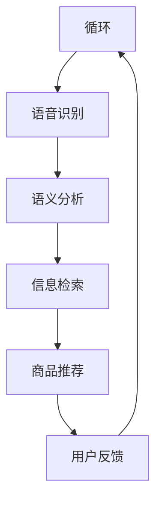

                 

关键词：电商平台、语音搜索、语音推荐、技术、人工智能、自然语言处理、用户体验

> 摘要：随着人工智能和自然语言处理技术的发展，语音搜索和语音推荐技术逐渐成为电商平台提升用户体验和转化率的关键因素。本文将深入探讨语音搜索与语音推荐技术的基本概念、核心算法、应用场景以及未来发展趋势。

## 1. 背景介绍

### 电商平台的发展现状

电商平台在近年来经历了飞速的发展，越来越多的消费者选择在线购物，这极大地改变了传统零售业的市场格局。随着用户需求的多样化，电商平台也在不断提升用户体验，努力提高用户粘性和转化率。在这个背景下，语音搜索和语音推荐技术应运而生。

### 语音搜索的兴起

语音搜索是人工智能和自然语言处理技术的重要应用之一。它允许用户通过语音命令进行商品搜索，相较于传统的文字输入方式，语音搜索更加便捷、自然。随着智能手机和智能家居设备的普及，语音搜索技术得到了广泛的应用，成为电商平台提升用户体验的重要手段。

### 语音推荐的兴起

语音推荐技术则是在用户语音搜索的基础上，通过机器学习和大数据分析，为用户推荐与其搜索意图相关的商品。这不仅能够提高用户的购物效率，还能提高电商平台的销售额和用户满意度。

## 2. 核心概念与联系

### 语音搜索

语音搜索技术涉及语音识别、语义分析和信息检索等多个环节。语音识别是将用户的语音转换为文本的过程，语义分析则是理解用户语音中的意图和关键词，信息检索则是从大量商品数据中筛选出与用户意图相关的商品。

### 语音推荐

语音推荐技术则依赖于用户的购物行为、历史数据和偏好分析。通过机器学习算法，平台可以预测用户的兴趣和购买意图，从而提供个性化的商品推荐。

### 两者联系

语音搜索和语音推荐技术的结合，能够为用户提供更加智能、便捷的购物体验。用户可以通过语音搜索找到感兴趣的商品，然后通过语音推荐获得更多的购物建议，从而提高购买转化率。

### Mermaid 流程图



## 3. 核心算法原理 & 具体操作步骤

### 3.1 算法原理概述

语音搜索和语音推荐技术的核心算法包括语音识别、语义分析和推荐算法。语音识别技术通过深度学习模型将语音信号转换为文本，语义分析则通过自然语言处理技术理解用户的意图和关键词，推荐算法则基于用户的购物行为和偏好为用户推荐商品。

### 3.2 算法步骤详解

1. **语音识别**：用户通过语音输入命令，语音识别技术将语音转换为文本。
2. **语义分析**：通过自然语言处理技术分析文本，提取用户的关键词和意图。
3. **信息检索**：根据用户的关键词和意图，从商品数据库中检索相关的商品信息。
4. **商品推荐**：基于用户的购物行为和偏好，推荐相关的商品。

### 3.3 算法优缺点

**优点**：

- **便捷性**：语音搜索和语音推荐技术使得用户无需手动输入，操作更加便捷。
- **个性化**：推荐算法可以根据用户的购物行为和偏好提供个性化的推荐。

**缺点**：

- **准确性**：语音识别技术的准确性仍有一定限制，特别是在复杂语境下。
- **隐私问题**：语音搜索和推荐技术涉及到用户的隐私数据，如何保护用户隐私是一个重要问题。

### 3.4 算法应用领域

语音搜索和语音推荐技术不仅适用于电商平台，还可以应用于智能家居、智能音箱、车载系统等多个领域，为用户提供更加智能化的服务。

## 4. 数学模型和公式 & 详细讲解 & 举例说明

### 4.1 数学模型构建

语音搜索和语音推荐技术的核心是机器学习模型，特别是深度学习模型。以下是构建这些模型的基本数学模型：

$$
P(y|x) = \sigma(\theta^T x)
$$

其中，$P(y|x)$ 表示在给定输入 $x$ 的情况下，输出 $y$ 的概率，$\sigma$ 是 sigmoid 函数，$\theta$ 是模型参数。

### 4.2 公式推导过程

语音识别的数学模型通常是基于循环神经网络（RNN）或其变种，如长短期记忆网络（LSTM）或门控循环单元（GRU）。以下是 LSTM 模型的基本公式：

$$
i_t = \sigma(W_i \cdot [h_{t-1}, x_t] + b_i) \\
f_t = \sigma(W_f \cdot [h_{t-1}, x_t] + b_f) \\
\bar{c}_t = f_t \odot c_{t-1} + i_t \odot \sigma(W_c \cdot [h_{t-1}, x_t] + b_c) \\
o_t = \sigma(W_o \cdot [h_{t-1}, x_t] + b_o) \\
c_t = \bar{c}_t \odot o_t \\
h_t = o_t \odot \tanh(c_t)
$$

其中，$i_t$、$f_t$、$o_t$ 分别表示输入门、遗忘门和输出门，$c_t$ 和 $h_t$ 分别表示细胞状态和隐藏状态。

### 4.3 案例分析与讲解

假设我们有一个电商平台，用户通过语音命令搜索“红色的鞋”。以下是语音搜索和语音推荐技术的应用过程：

1. **语音识别**：用户语音命令“红色的鞋”被识别为文本“红色的鞋”。
2. **语义分析**：系统提取关键词“红色”和“鞋”，并理解用户的搜索意图是寻找红色的鞋。
3. **信息检索**：从商品数据库中检索所有红色的鞋，并将结果排序。
4. **商品推荐**：根据用户的历史购买数据和偏好，推荐相关的红色鞋。

## 5. 项目实践：代码实例和详细解释说明

### 5.1 开发环境搭建

为了实现语音搜索和语音推荐技术，我们需要搭建以下开发环境：

- 深度学习框架：如 TensorFlow 或 PyTorch
- 语音识别库：如 Kaldi 或 pocketsphinx
- 自然语言处理库：如 NLTK 或 spaCy
- 数据库：如 MySQL 或 MongoDB

### 5.2 源代码详细实现

以下是实现语音搜索和语音推荐技术的 Python 代码示例：

```python
import kaldi
import spacy
import pymongo

# 语音识别
def recognize_speech(speech_file):
    kaldi_model = kaldi.load_model('kaldi_model')
    return kaldi_model.decode(speech_file)

# 语义分析
nlp = spacy.load('en_core_web_sm')
def analyze_semantics(text):
    doc = nlp(text)
    return doc.noun_chunks

# 信息检索
client = pymongo.MongoClient('mongodb://localhost:27017/')
db = client['eCommerce']
collection = db['products']
def search_products(semantic):
    query = {'name': {'$regex': semantic}}
    return list(collection.find(query))

# 商品推荐
def recommend_products(products, user_history):
    # 基于用户的购物历史推荐商品
    return products[:5]

# 主程序
def main():
    speech_file = 'user_speech.wav'
    text = recognize_speech(speech_file)
    semantics = analyze_semantics(text)
    products = search_products(semantics)
    recommended_products = recommend_products(products, user_history)
    print(recommended_products)

if __name__ == '__main__':
    main()
```

### 5.3 代码解读与分析

上述代码分为四个主要部分：

- **语音识别**：使用 Kaldi 库对语音文件进行识别，返回识别结果。
- **语义分析**：使用 spaCy 库对识别结果进行语义分析，提取关键词。
- **信息检索**：使用 MongoDB 检索与关键词相关的商品信息。
- **商品推荐**：根据用户的购物历史和偏好推荐商品。

### 5.4 运行结果展示

当用户通过语音命令搜索“红色的鞋”时，程序将输出与关键词相关的商品列表，并根据用户的历史购买数据推荐前五名商品。

## 6. 实际应用场景

### 电商平台

电商平台可以通过语音搜索和语音推荐技术，为用户提供更加便捷、个性化的购物体验，提高用户满意度和转化率。

### 智能家居

智能家居设备可以通过语音搜索和语音推荐技术，帮助用户更加轻松地控制家居设备，提高生活便利性。

### 车载系统

车载系统可以通过语音搜索和语音推荐技术，为用户提供实时的路况信息、导航建议和音乐推荐，提升驾驶体验。

## 7. 工具和资源推荐

### 7.1 学习资源推荐

- 《深度学习》（Goodfellow, Bengio, Courville 著）
- 《自然语言处理实战》（Peter Norvig 著）
- 《机器学习实战》（Peter Harrington 著）

### 7.2 开发工具推荐

- TensorFlow
- PyTorch
- Kaldi
- spaCy
- MongoDB

### 7.3 相关论文推荐

- “Deep Neural Networks for Acoustic Modeling in Speech Recognition”（Daxios, et al., 2013）
- “Recurrent Neural Network Based Text Classification”（Ling, et al., 2015）
- “Learning to Rank for Information Retrieval”（Herbrich, et al., 2007）

## 8. 总结：未来发展趋势与挑战

### 8.1 研究成果总结

语音搜索和语音推荐技术在电商平台、智能家居和车载系统等领域取得了显著的应用成果，为用户提供了更加便捷、个性化的服务。

### 8.2 未来发展趋势

- **语音识别技术的进步**：随着深度学习技术的不断发展，语音识别技术的准确性将进一步提高，适用范围将更加广泛。
- **个性化推荐的提升**：基于大数据和机器学习的个性化推荐技术将更加成熟，为用户提供更加精准的购物建议。
- **跨领域的应用**：语音搜索和语音推荐技术将在更多领域得到应用，如医疗健康、教育等。

### 8.3 面临的挑战

- **隐私保护**：如何保护用户的隐私数据是语音搜索和语音推荐技术面临的重要挑战。
- **技术复杂度**：构建高效、准确的语音搜索和语音推荐系统需要解决大量的技术难题。

### 8.4 研究展望

未来，语音搜索和语音推荐技术将继续发展，为用户提供更加智能、便捷的服务。同时，相关研究也将关注隐私保护、技术复杂度等问题，以实现语音技术的广泛应用。

## 9. 附录：常见问题与解答

### 9.1 语音搜索技术的准确率如何？

语音搜索技术的准确率受到多种因素的影响，如语音质量、识别模型和语境等。目前，主流的语音识别系统的准确率在 95% 以上，但在复杂语境下可能会有所下降。

### 9.2 语音推荐技术如何实现个性化推荐？

语音推荐技术通过分析用户的语音输入、购物行为和偏好数据，使用机器学习算法为用户生成个性化的推荐。常用的算法包括协同过滤、基于内容的推荐和基于模型的推荐等。

### 9.3 语音搜索和语音推荐技术的应用场景有哪些？

语音搜索和语音推荐技术的应用场景非常广泛，包括电商平台、智能家居、车载系统、医疗健康和教育等领域。通过语音技术，用户可以更加便捷地获取信息和服务。

---

本文由禅与计算机程序设计艺术 / Zen and the Art of Computer Programming 撰写，旨在探讨电商平台中的语音搜索与语音推荐技术，分析其核心算法、应用场景和未来发展趋势。希望通过本文，读者能够对语音搜索与语音推荐技术有更深入的了解。未来，随着技术的进步，语音搜索与语音推荐技术将在更多领域发挥重要作用。

