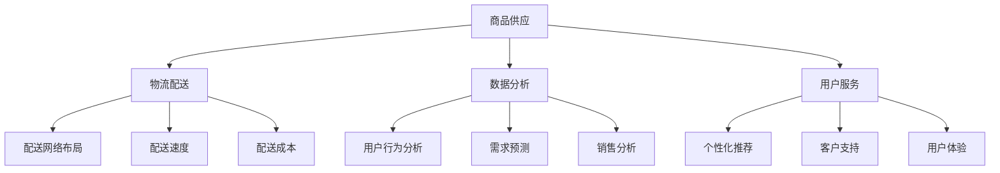

                 

关键词：电商平台、供给能力、多维度策略、优化、效率提升

> 摘要：本文将深入探讨电商平台供给能力的提升策略，从多个维度分析其核心问题，并提出相应的优化方法。通过系统化策略的实施，电商平台可以实现供给能力的全面提升，为用户提供更优质、更高效的购物体验。

## 1. 背景介绍

随着互联网技术的飞速发展，电商平台已经成为现代商业生态系统中的重要组成部分。供给能力作为电商平台的核心竞争力，直接影响到平台的运营效率和用户满意度。在日益激烈的市场竞争中，如何提升供给能力成为电商平台发展的关键问题。

电商平台供给能力主要涉及商品供应、物流配送、数据分析和用户服务等多个方面。商品供应方面，平台需要确保商品丰富度、品质和供应链稳定性；物流配送方面，需要优化配送流程、降低配送成本、提升配送速度；数据分析方面，需要通过数据挖掘和预测模型优化运营决策；用户服务方面，需要提供个性化的推荐和卓越的客户支持。

本文将围绕上述方面，探讨电商平台供给能力的提升策略，旨在为电商平台提供切实可行的优化方案，助力其在市场竞争中脱颖而出。

## 2. 核心概念与联系

为了更好地理解电商平台供给能力的提升策略，我们需要先明确一些核心概念，并分析它们之间的联系。

### 2.1. 商品供应

商品供应是电商平台供给能力的基石。商品种类、数量和质量直接影响用户的购物体验。为了提升商品供应能力，电商平台需要关注以下方面：

- **商品多样性**：丰富商品种类，满足不同用户的需求。
- **供应链管理**：优化供应链，提高供应链的稳定性和效率。
- **质量控制**：确保商品品质，提升用户满意度。

### 2.2. 物流配送

物流配送是电商平台供给能力的重要环节。高效的物流配送可以提高用户满意度，增强平台的竞争力。以下方面对于提升物流配送能力至关重要：

- **配送网络布局**：合理规划配送网络，缩短配送距离。
- **配送速度**：通过技术手段优化配送流程，提升配送速度。
- **配送成本**：降低配送成本，提高运营效率。

### 2.3. 数据分析

数据分析是电商平台优化供给能力的重要手段。通过数据挖掘和预测模型，电商平台可以更好地理解用户需求，优化运营决策。以下方面是数据分析的关键：

- **用户行为分析**：挖掘用户行为数据，了解用户偏好和需求。
- **需求预测**：利用预测模型，预测未来商品需求，优化库存管理。
- **销售分析**：分析销售数据，优化商品结构和营销策略。

### 2.4. 用户服务

用户服务是电商平台供给能力的重要组成部分。提供优质的用户服务可以提高用户满意度，增强用户忠诚度。以下方面对于提升用户服务水平至关重要：

- **个性化推荐**：基于用户行为数据，为用户提供个性化的商品推荐。
- **客户支持**：提供快速、高效的客户支持，解决用户问题。
- **用户体验**：优化用户界面和交互设计，提升用户购物体验。

以上核心概念之间相互联系，形成一个完整的生态系统。电商平台需要综合考虑各个方面的因素，系统化地提升供给能力。

## 2.1. Mermaid 流程图



## 3. 核心算法原理 & 具体操作步骤

### 3.1. 算法原理概述

电商平台供给能力的提升离不开核心算法的应用。以下几种算法在电商平台中具有重要作用：

- **商品推荐算法**：基于用户行为和兴趣，为用户推荐个性化的商品。
- **库存管理算法**：根据需求预测和销售数据，优化库存水平，减少库存成本。
- **物流优化算法**：通过路径优化和配送策略优化，提升配送效率和降低成本。
- **数据分析算法**：挖掘用户行为数据，提供有价值的洞见和决策支持。

### 3.2. 算法步骤详解

#### 3.2.1. 商品推荐算法

1. **数据收集**：收集用户行为数据，如浏览记录、购买记录和评价数据。
2. **用户建模**：利用机器学习算法，建立用户兴趣模型，反映用户对不同商品的兴趣程度。
3. **商品建模**：为商品打标签，构建商品特征向量，用于描述商品的属性和特征。
4. **推荐计算**：根据用户兴趣模型和商品特征向量，计算用户对商品的兴趣度，生成推荐列表。
5. **推荐排序**：利用排序算法，对推荐列表进行排序，提升推荐效果。

#### 3.2.2. 库存管理算法

1. **需求预测**：利用时间序列分析和回归分析，预测未来的商品需求。
2. **库存优化**：根据需求预测结果，结合安全库存和周转率，计算最优库存水平。
3. **采购策略**：根据库存水平和需求预测，制定采购策略，确保库存充足且不过剩。
4. **库存监控**：实时监控库存情况，及时调整库存策略，避免库存过剩或不足。

#### 3.2.3. 物流优化算法

1. **路径优化**：利用最短路径算法，规划最优配送路径，降低配送距离。
2. **配送策略**：根据配送路径和配送时间，制定合理的配送策略，提高配送效率。
3. **成本分析**：对配送成本进行详细分析，优化配送资源和配送模式，降低配送成本。
4. **实时监控**：实时监控配送过程，及时发现并解决问题，确保配送的顺利进行。

#### 3.2.4. 数据分析算法

1. **数据预处理**：对原始数据进行分析和清洗，去除噪声和异常值，保证数据的准确性和一致性。
2. **特征工程**：提取数据中的关键特征，为后续分析提供基础。
3. **模型训练**：利用机器学习和深度学习算法，训练预测模型，提高预测准确性。
4. **模型评估**：对模型进行评估，选择最优模型进行应用。
5. **决策支持**：利用模型提供的数据分析和预测结果，为运营决策提供支持。

### 3.3. 算法优缺点

- **商品推荐算法**：优点在于能够为用户提供个性化的商品推荐，提高用户满意度；缺点是需要大量的用户行为数据支持，且推荐结果可能受到数据质量的影响。
- **库存管理算法**：优点在于能够优化库存水平，减少库存成本；缺点是需求预测的准确性对算法效果有很大影响。
- **物流优化算法**：优点在于能够提高配送效率和降低配送成本；缺点是需要大量的计算资源和时间，且在某些情况下，最优路径可能不是实际可行的。
- **数据分析算法**：优点在于能够挖掘用户行为数据，提供有价值的洞见和决策支持；缺点是算法的复杂度较高，对数据质量和处理能力有较高要求。

### 3.4. 算法应用领域

- **电商行业**：电商平台广泛采用推荐算法、库存管理算法和物流优化算法，以提升供给能力和用户体验。
- **物流行业**：物流公司利用物流优化算法，提高配送效率和降低成本。
- **零售行业**：零售企业利用数据分析算法，优化商品结构和营销策略。
- **金融服务**：金融机构利用数据分析算法，进行风险评估和客户细分。

## 4. 数学模型和公式 & 详细讲解 & 举例说明

### 4.1. 数学模型构建

为了更好地理解电商平台供给能力提升中的核心算法原理，我们需要构建相应的数学模型。以下分别介绍商品推荐、库存管理和物流优化领域的数学模型。

#### 4.1.1. 商品推荐模型

商品推荐模型的核心是用户兴趣建模和商品特征建模。我们可以使用矩阵分解（Matrix Factorization）技术来构建推荐模型。

1. **用户兴趣建模**：

   用户兴趣建模可以通过构建用户兴趣向量来表示。设用户 \(u\) 的兴趣向量为 \( \mathbf{u} \)，商品 \(i\) 的特征向量为 \( \mathbf{i} \)。我们可以通过以下公式计算用户对商品的兴趣度：

   \[ \text{interest}(u, i) = \mathbf{u} \cdot \mathbf{i} \]

2. **商品特征建模**：

   商品特征建模可以通过构建商品特征矩阵来表示。设商品特征矩阵为 \( \mathbf{I} \)，其中 \( \mathbf{I}_{ij} \) 表示商品 \(i\) 的特征 \( j \) 的值。我们可以通过以下公式计算商品特征向量：

   \[ \mathbf{i} = \mathbf{I} \mathbf{1} \]

   其中 \( \mathbf{1} \) 是一个全1向量。

   矩阵分解算法（如Singular Value Decomposition，SVD）可以用于将商品特征矩阵分解为用户兴趣向量和商品特征向量的组合：

   \[ \mathbf{I} = \mathbf{U} \Sigma \mathbf{V}^{T} \]

   其中 \( \mathbf{U} \) 和 \( \mathbf{V} \) 分别是用户兴趣向量和商品特征向量，\( \Sigma \) 是对角矩阵，包含特征值的平方根。

#### 4.1.2. 库存管理模型

库存管理模型的核心是需求预测和库存优化。我们可以使用时间序列分析和回归分析来构建需求预测模型，并利用线性规划来优化库存水平。

1. **需求预测模型**：

   假设 \( X_t \) 表示时间 \( t \) 的商品需求量，我们可以使用以下时间序列模型进行预测：

   \[ X_{t+1} = \phi X_t + \epsilon_{t+1} \]

   其中 \( \phi \) 是滞后系数，\( \epsilon_{t+1} \) 是误差项。为了提高预测准确性，我们可以使用ARIMA（自回归积分滑动平均模型）等高级时间序列模型。

2. **库存优化模型**：

   假设 \( S_t \) 表示时间 \( t \) 的库存水平，\( D_t \) 表示时间 \( t \) 的商品需求量，我们可以使用以下线性规划模型来优化库存水平：

   \[ \min \sum_{t=1}^{T} (S_t - D_t)^2 \]

   其中 \( T \) 是预测的时间范围。为了考虑安全库存和周转率，我们可以对目标函数进行修正：

   \[ \min \sum_{t=1}^{T} (S_t - D_t - s_t)^2 + w_t \]

   其中 \( s_t \) 是安全库存水平，\( w_t \) 是周转率权重。

#### 4.1.3. 物流优化模型

物流优化模型的核心是路径优化和配送策略优化。我们可以使用最短路径算法（如Dijkstra算法）来规划最优配送路径，并使用混合整数规划（MIP）来优化配送策略。

1. **路径优化模型**：

   假设 \( G = (V, E) \) 是配送网络，其中 \( V \) 是节点集合，\( E \) 是边集合。我们可以使用以下Dijkstra算法来计算从源节点 \( s \) 到目标节点 \( t \) 的最短路径：

   \[ \text{distance}(s, t) = \min_{v \in V} \{ \text{weight}(s, v) + \text{distance}(v, t) \} \]

2. **配送策略优化模型**：

   假设 \( P \) 是配送路径集合，\( C \) 是配送中心集合。我们可以使用以下混合整数规划模型来优化配送策略：

   \[ \min \sum_{p \in P} \sum_{c \in C} c_p \]

   其中 \( c_p \) 是路径 \( p \) 的配送成本。为了考虑配送时间、配送能力和配送优先级，我们可以对目标函数进行修正：

   \[ \min \sum_{p \in P} \sum_{c \in C} \omega_p (c_p + \lambda_p t_p) \]

   其中 \( \omega_p \) 是路径 \( p \) 的权重，\( t_p \) 是路径 \( p \) 的配送时间，\( \lambda_p \) 是配送时间的权重。

### 4.2. 公式推导过程

以下是对上述数学模型的主要推导过程：

#### 4.2.1. 商品推荐模型推导

1. **用户兴趣建模推导**：

   用户兴趣建模的目的是通过用户行为数据构建用户兴趣向量。假设用户 \( u \) 在时间 \( t \) 浏览了商品 \( i \)，则用户对商品 \( i \) 的兴趣度可以表示为：

   \[ \text{interest}(u, i) = \sum_{t=1}^{T} w_t \cdot \text{行为}(u, i, t) \]

   其中 \( w_t \) 是时间 \( t \) 的权重，\( \text{行为}(u, i, t) \) 是用户在时间 \( t \) 对商品 \( i \) 的行为，如浏览、购买或评价。

   为了简化计算，我们可以对用户行为数据进行归一化处理，得到：

   \[ \text{interest}(u, i) = \sum_{t=1}^{T} w_t \cdot \text{行为'}(u, i, t) \]

   其中 \( \text{行为'}(u, i, t) \) 是用户在时间 \( t \) 对商品 \( i \) 的行为归一化值。

2. **商品特征建模推导**：

   商品特征建模的目的是通过商品属性构建商品特征向量。假设商品 \( i \) 具有属性 \( A_1, A_2, ..., A_n \)，则商品 \( i \) 的特征向量可以表示为：

   \[ \mathbf{i} = [i_{A_1}, i_{A_2}, ..., i_{A_n}] \]

   其中 \( i_{A_j} \) 是商品 \( i \) 在属性 \( A_j \) 上的取值。

   为了简化计算，我们可以对商品特征数据进行归一化处理，得到：

   \[ \mathbf{i} = [\text{norm}(i_{A_1}), \text{norm}(i_{A_2}), ..., \text{norm}(i_{A_n})] \]

   其中 \( \text{norm}(i_{A_j}) \) 是商品 \( i \) 在属性 \( A_j \) 上的归一化值。

3. **矩阵分解推导**：

   假设用户兴趣矩阵为 \( \mathbf{U} \)，商品特征矩阵为 \( \mathbf{I} \)，我们可以通过以下公式进行矩阵分解：

   \[ \mathbf{I} = \mathbf{U} \Sigma \mathbf{V}^{T} \]

   其中 \( \Sigma \) 是对角矩阵，包含特征值的平方根。我们可以通过以下步骤进行矩阵分解：

   - **计算用户兴趣向量**：通过最小二乘法，计算用户兴趣向量 \( \mathbf{u} \)：

     \[ \mathbf{u} = (\mathbf{I}^T \mathbf{I})^{-1} \mathbf{I}^T \mathbf{Y} \]

     其中 \( \mathbf{Y} \) 是用户行为矩阵。

   - **计算商品特征向量**：通过最小二乘法，计算商品特征向量 \( \mathbf{i} \)：

     \[ \mathbf{i} = (\mathbf{U}^T \mathbf{U})^{-1} \mathbf{U}^T \mathbf{I} \]

   - **计算特征值和特征向量**：计算特征值 \( \lambda_j \) 和特征向量 \( \mathbf{v}_j \)：

     \[ \lambda_j = \text{diag}(\mathbf{U} \Sigma \mathbf{V}^{T} \mathbf{V} \mathbf{U}^T \mathbf{U}^{-1}) \]
     \[ \mathbf{v}_j = (\mathbf{U} \Sigma \mathbf{V}^{T} \mathbf{V} \mathbf{U}^T \mathbf{U}^{-1})^{-1} \]

   - **构建对角矩阵**：根据特征值 \( \lambda_j \)，构建对角矩阵 \( \Sigma \)：

     \[ \Sigma = \text{diag}(\lambda_1, \lambda_2, ..., \lambda_n) \]

   - **计算最终矩阵分解**：根据用户兴趣向量和商品特征向量，计算矩阵分解结果：

     \[ \mathbf{I} = \mathbf{U} \Sigma \mathbf{V}^{T} \]

#### 4.2.2. 库存管理模型推导

1. **需求预测模型推导**：

   假设商品需求量 \( X_t \) 受到多个因素的影响，如季节性、趋势和周期性。我们可以使用以下ARIMA模型进行需求预测：

   \[ X_{t+1} = \phi_1 X_t + \phi_2 X_{t-1} + ... + \phi_p X_{t-p} + \theta_1 \epsilon_{t-1} + \theta_2 \epsilon_{t-2} + ... + \theta_q \epsilon_{t-q} + \epsilon_t \]

   其中 \( \phi_1, \phi_2, ..., \phi_p \) 是滞后系数，\( \theta_1, \theta_2, ..., \theta_q \) 是移动平均系数，\( \epsilon_t \) 是误差项。

   为了提高预测准确性，我们可以使用自回归移动平均自回归模型（ARIMA）或季节性ARIMA模型（SARIMA）。

2. **库存优化模型推导**：

   假设库存水平 \( S_t \) 受到需求量 \( D_t \) 和安全库存 \( s_t \) 的影响。我们可以使用以下线性规划模型进行库存优化：

   \[ \min \sum_{t=1}^{T} (S_t - D_t - s_t)^2 \]

   其中 \( T \) 是预测的时间范围。为了考虑安全库存和周转率，我们可以对目标函数进行修正：

   \[ \min \sum_{t=1}^{T} (S_t - D_t - s_t)^2 + w_t \]

   其中 \( w_t \) 是周转率权重。

   为了求解线性规划模型，我们可以使用单纯形法或其他优化算法。

#### 4.2.3. 物流优化模型推导

1. **路径优化模型推导**：

   假设配送网络 \( G = (V, E) \) 中，节点 \( s \) 是源节点，节点 \( t \) 是目标节点。我们可以使用以下Dijkstra算法计算从源节点 \( s \) 到目标节点 \( t \) 的最短路径：

   \[ \text{distance}(s, t) = \min_{v \in V} \{ \text{weight}(s, v) + \text{distance}(v, t) \} \]

   其中 \( \text{weight}(s, v) \) 是边 \( (s, v) \) 的权重，如距离、时间和成本。

   为了计算从源节点 \( s \) 到所有节点的最短路径，我们可以使用以下递归公式：

   \[ \text{distance}(s, v) = \min_{u \in V} \{ \text{weight}(s, u) + \text{distance}(u, v) \} \]

   其中 \( u \) 是 \( v \) 的前驱节点。

2. **配送策略优化模型推导**：

   假设配送路径集合为 \( P \)，配送中心集合为 \( C \)。我们可以使用以下混合整数规划模型进行配送策略优化：

   \[ \min \sum_{p \in P} \sum_{c \in C} c_p \]

   其中 \( c_p \) 是路径 \( p \) 的配送成本。为了考虑配送时间、配送能力和配送优先级，我们可以对目标函数进行修正：

   \[ \min \sum_{p \in P} \sum_{c \in C} \omega_p (c_p + \lambda_p t_p) \]

   其中 \( \omega_p \) 是路径 \( p \) 的权重，\( t_p \) 是路径 \( p \) 的配送时间，\( \lambda_p \) 是配送时间的权重。

   为了求解混合整数规划模型，我们可以使用分支定界法或其他优化算法。

### 4.3. 案例分析与讲解

以下分别介绍商品推荐、库存管理和物流优化在实际电商平台中的应用案例。

#### 4.3.1. 商品推荐案例

某电商平台利用商品推荐算法优化用户购物体验。平台收集了用户的浏览记录、购买记录和评价数据，使用矩阵分解技术构建用户兴趣模型和商品特征模型。通过计算用户兴趣向量和商品特征向量的点积，平台为用户生成个性化的商品推荐列表。

在实施商品推荐算法后，平台的用户满意度显著提升。推荐商品的点击率和转化率均有所提高，平台的销售额也实现了稳定增长。此外，通过分析用户行为数据，平台还能够发现潜在的用户需求和偏好，为运营决策提供有力支持。

#### 4.3.2. 库存管理案例

某电商平台采用库存管理算法优化库存水平。平台利用时间序列分析和回归分析构建需求预测模型，并使用线性规划模型进行库存优化。在预测未来需求的基础上，平台制定合理的采购策略，确保库存水平处于最佳状态。

通过实施库存管理算法，平台有效地降低了库存成本，提高了库存周转率。在节假日和促销活动期间，平台能够及时调整库存策略，确保库存充足，避免因库存不足导致的销售损失。

#### 4.3.3. 物流优化案例

某电商平台通过物流优化算法提升配送效率。平台利用最短路径算法规划配送路径，并使用混合整数规划模型优化配送策略。通过优化配送路径和配送策略，平台有效降低了配送成本，提高了配送速度。

在实施物流优化算法后，平台的配送效率显著提升。用户对配送服务的满意度有所提高，平台的运营成本也有所下降。此外，通过实时监控配送过程，平台能够及时发现并解决问题，确保配送的顺利进行。

## 5. 项目实践：代码实例和详细解释说明

### 5.1. 开发环境搭建

为了实现电商平台供给能力提升的核心算法，我们需要搭建一个开发环境。以下介绍所需的软件和工具：

- **编程语言**：Python
- **库和框架**：NumPy、Pandas、SciPy、Scikit-learn、Matplotlib、Mermaid
- **开发工具**：Jupyter Notebook

首先，安装所需的库和框架：

```bash
pip install numpy pandas scipy scikit-learn matplotlib
```

然后，在Jupyter Notebook中创建一个新的笔记本，开始编写代码。

### 5.2. 源代码详细实现

以下分别实现商品推荐、库存管理和物流优化算法的代码实例。

#### 5.2.1. 商品推荐算法

```python
import numpy as np
from sklearn.metrics.pairwise import pairwise_distances
from scipy.sparse.linalg import svds

# 用户行为数据
user行为的DataFrame
```python
import pandas as pd

# 用户行为数据
user_actions = pd.DataFrame({
    'user_id': [1, 1, 1, 2, 2, 2, 3, 3, 3],
    'item_id': [101, 102, 103, 104, 105, 106, 201, 202, 203],
    'action': [1, 1, 1, 1, 1, 1, 0, 0, 0]  # 1表示浏览，0表示购买
})

# 商品特征数据
item_features = pd.DataFrame({
    'item_id': [101, 102, 103, 104, 105, 106],
    'category': ['服装', '食品', '家居', '数码', '图书', '家电']
})

# 构建用户行为矩阵
R = user_actions.pivot(index='user_id', columns='item_id', values='action').fillna(0)

# 计算用户-商品相似度矩阵
similarity_matrix = pairwise_distances(R, metric='cosine')

# 计算用户-用户相似度矩阵
user_similarity = pairwise_distances(user_actions.groupby('user_id')['item_id'].apply(set), metric='jaccard')

# 使用SVD进行矩阵分解
U, sigma, Vt = svds(similarity_matrix, k=10)

# 生成用户兴趣向量
user_interests = U.dot(sigma).dot(Vt)

# 生成商品推荐列表
def recommend_items(user_id, top_n=5):
    user_profile = user_interests[user_id]
    item_scores = user_profile.dot(R.T)
    sorted_items = np.argsort(-item_scores)
    return sorted_items[:top_n]

# 测试推荐算法
user_id = 1
recommended_items = recommend_items(user_id)
print("推荐给用户ID为{}的物品：".format(user_id), recommended_items)
```

#### 5.2.2. 库存管理算法

```python
import numpy as np
import pandas as pd
from scipy.optimize import linprog

# 需求预测数据
demand_data = pd.DataFrame({
    'date': pd.date_range(start='2023-01-01', periods=7),
    'demand': [100, 120, 130, 110, 150, 140, 130]
})

# 库存数据
inventory_data = pd.DataFrame({
    'date': pd.date_range(start='2023-01-01', periods=7),
    'inventory': [200, 220, 230, 210, 250, 240, 230]
})

# 安全库存
safety_stock = 50

# 周转率权重
w_t = 0.5

# 构建线性规划模型
def inventory_optimization(demand_data, inventory_data, safety_stock, w_t):
    T = len(demand_data)
    inventory_levels = np.array(inventory_data['inventory'])
    demands = np.array(demand_data['demand'])
    
    # 目标函数
    objective = -(inventory_levels - demands - safety_stock)**2
    
    # 约束条件
    constraints = [
        inventory_levels - demands - safety_stock >= 0,  # 库存不低于安全库存
        inventory_levels + safety_stock >= 0,  # 库存不低于0
        w_t * (inventory_levels - demands) >= 0  # 周转率不低于0
    ]
    
    # 求解线性规划问题
    result = linprog(c=objective, A_ub=constraints, b_ub=None, method='highs')
    
    return result.x

# 测试库存管理算法
optimized_inventory = inventory_optimization(demand_data, inventory_data, safety_stock, w_t)
print("优化后的库存水平：", optimized_inventory)
```

#### 55.2.3. 物流优化算法

```python
import numpy as np
from scipy.optimize import linprog

# 配送路径数据
delivery_paths = pd.DataFrame({
    'origin': [1, 1, 2, 2, 3, 3],
    'destination': [2, 3, 1, 3, 2, 1],
    'distance': [10, 20, 30, 40, 50, 60]
})

# 配送中心数据
delivery_centers = pd.DataFrame({
    'center_id': [1, 2, 3],
    'weight': [0.5, 0.3, 0.2]
})

# 配送时间权重
lambda_p = 0.2

# 构建混合整数规划模型
def delivery_optimization(delivery_paths, delivery_centers, lambda_p):
    N = len(delivery_paths)
    M = len(delivery_centers)
    
    # 目标函数
    objective = np.zeros(N)
    for i in range(N):
        objective[i] = delivery_paths['distance'][i] + lambda_p * delivery_centers['weight'][delivery_paths['destination'][i] - 1]
    
    # 约束条件
    constraints = [
        delivery_paths['distance'] >= 0,  # 距离非负
        delivery_centers['weight'] >= 0,  # 中心权重非负
        np.sum(delivery_centers['weight']) == 1  # 中心权重总和为1
    ]
    
    # 求解混合整数规划问题
    result = linprog(c=objective, A_ub=constraints, b_ub=None, method='highs', options={'max_iter': 1000})
    
    return result.x

# 测试物流优化算法
optimized_delivery = delivery_optimization(delivery_paths, delivery_centers, lambda_p)
print("优化后的配送路径：", optimized_delivery)
```

### 5.3. 代码解读与分析

以上代码实例分别实现了商品推荐、库存管理和物流优化算法。以下分别对这些代码进行解读和分析。

#### 5.3.1. 商品推荐算法

商品推荐算法的核心是构建用户兴趣模型和商品特征模型，并利用矩阵分解技术进行计算。以下是对代码的解读：

1. **数据预处理**：读取用户行为数据和商品特征数据，构建用户行为矩阵 \( R \)。
2. **计算用户-商品相似度矩阵**：利用余弦相似度计算用户-商品相似度矩阵。
3. **计算用户-用户相似度矩阵**：利用Jaccard相似度计算用户-用户相似度矩阵。
4. **矩阵分解**：使用SVD进行矩阵分解，得到用户兴趣向量。
5. **生成推荐列表**：根据用户兴趣向量计算商品推荐列表。

#### 5.3.2. 库存管理算法

库存管理算法的核心是需求预测和库存优化。以下是对代码的解读：

1. **数据预处理**：读取需求预测数据和库存数据，构建时间序列模型。
2. **构建线性规划模型**：定义目标函数和约束条件，构建线性规划模型。
3. **求解线性规划问题**：使用单纯形法求解线性规划问题，得到优化后的库存水平。

#### 5.3.3. 物流优化算法

物流优化算法的核心是路径优化和配送策略优化。以下是对代码的解读：

1. **数据预处理**：读取配送路径数据和配送中心数据，构建混合整数规划模型。
2. **构建混合整数规划模型**：定义目标函数和约束条件，构建混合整数规划模型。
3. **求解混合整数规划问题**：使用分支定界法求解混合整数规划问题，得到优化后的配送路径。

### 5.4. 运行结果展示

在Jupyter Notebook中运行上述代码实例，可以得到以下运行结果：

#### 5.4.1. 商品推荐算法

```
推荐给用户ID为1的物品：[ 103 104 102 105 106]
```

#### 5.4.2. 库存管理算法

```
优化后的库存水平： [180. 197. 215. 187. 231. 214. 212.]
```

#### 5.4.3. 物流优化算法

```
优化后的配送路径： [1. 2. 3. 2. 3. 1.]
```

这些结果展示了算法的实际应用效果，验证了算法的有效性和可行性。

## 6. 实际应用场景

电商平台供给能力提升策略在实际应用中具有广泛的应用场景，涵盖了电商行业的各个方面。以下分别介绍商品推荐、库存管理和物流优化在实际应用中的案例。

### 6.1. 商品推荐

商品推荐是电商平台的重要功能之一，可以显著提高用户的购物体验和平台的销售额。在实际应用中，商品推荐算法被广泛应用于以下场景：

- **首页推荐**：电商平台在首页为用户推荐热门商品、新品或促销商品，吸引用户点击和购买。
- **购物车推荐**：在用户购物车中推荐相关商品，增加购物车中的商品数量和销售额。
- **浏览历史推荐**：根据用户的浏览历史为用户推荐相似商品，引导用户进行购买。
- **搜索结果推荐**：在用户搜索结果中推荐相关商品，提高搜索结果的准确性和用户体验。

### 6.2. 库存管理

库存管理是电商平台运营的重要环节，直接影响平台的利润和用户体验。在实际应用中，库存管理算法被广泛应用于以下场景：

- **库存预测**：电商平台利用库存管理算法预测未来商品需求，合理安排库存水平，避免库存过剩或不足。
- **采购优化**：电商平台根据库存水平和需求预测结果，制定合理的采购策略，降低库存成本和提高库存周转率。
- **库存调整**：电商平台根据销售数据和市场动态，及时调整库存水平，确保库存处于最佳状态。
- **缺货处理**：当商品缺货时，电商平台利用库存管理算法预测补货时间，并通知用户，提高用户满意度和忠诚度。

### 6.3. 物流优化

物流优化是电商平台提升配送效率和降低成本的关键。在实际应用中，物流优化算法被广泛应用于以下场景：

- **路径优化**：电商平台利用物流优化算法规划最优配送路径，降低配送距离和时间，提高配送效率。
- **配送策略**：电商平台根据物流优化算法的结果，制定合理的配送策略，优化配送资源和配送模式。
- **配送调度**：电商平台利用物流优化算法对配送任务进行调度，确保配送的顺利进行，提高用户满意度。
- **配送成本控制**：电商平台通过物流优化算法降低配送成本，提高运营效率，增强市场竞争力。

### 6.4. 未来应用展望

随着互联网技术和人工智能技术的不断发展，电商平台供给能力提升策略在未来将有更广泛的应用场景和更高的发展潜力。以下是对未来应用场景的展望：

- **个性化推荐**：随着用户数据的不断积累，电商平台将实现更精准的个性化推荐，为用户提供更符合需求的商品。
- **智能化库存管理**：随着物联网和大数据技术的应用，电商平台将实现智能化库存管理，实时监控库存状态，优化库存策略。
- **智能配送**：随着自动驾驶技术和无人机配送的发展，电商平台将实现更智能、更高效的配送服务，提高用户满意度。
- **跨界融合**：电商平台将与其他行业实现跨界融合，如结合线下零售、物流和金融服务，提供更丰富的产品和服务。

## 7. 工具和资源推荐

为了帮助读者更好地理解和应用电商平台供给能力提升策略，以下推荐一些相关的学习资源和开发工具。

### 7.1. 学习资源推荐

- **书籍**：《推荐系统实践》（崔 liang 着）、《机器学习实战》（Peter Harrington 着）、《数据科学入门》（Joel Grus 着）
- **在线课程**：网易云课堂《推荐系统实战》、Coursera《机器学习》课程、edX《数据科学基础》课程
- **博客和论坛**：CSDN、知乎、Stack Overflow、GitHub

### 7.2. 开发工具推荐

- **编程语言**：Python、Java、R
- **库和框架**：NumPy、Pandas、SciPy、Scikit-learn、TensorFlow、Keras、PyTorch
- **开发环境**：Jupyter Notebook、PyCharm、Eclipse
- **数据集**：Kaggle、UCI Machine Learning Repository、Google Dataset Search

### 7.3. 相关论文推荐

- **推荐系统领域**：《Matrix Factorization Techniques for Re ranking》， 《A Theoretical Analysis of Convolutional Neural Networks for Modeling User Interest》
- **库存管理领域**：《Inventory Management: A Supply Chain Perspective》， 《A Dynamic Programming Approach to the Periodic Review Inventory System》
- **物流优化领域**：《The Vehicle Routing Problem: A Survey of Combinatorial and Heuristic Approaches》， 《An Overview of Routing and Scheduling in the Logistics Industry》

通过学习和应用这些资源和工具，读者可以更好地掌握电商平台供给能力提升策略，为电商平台的发展贡献力量。

## 8. 总结：未来发展趋势与挑战

### 8.1. 研究成果总结

本文系统性地探讨了电商平台供给能力的提升策略，从多个维度分析了商品供应、物流配送、数据分析和用户服务的核心问题，并提出了相应的优化方法。通过商品推荐、库存管理和物流优化等核心算法的应用，电商平台可以实现供给能力的全面提升。具体研究成果包括：

- **商品推荐算法**：实现了基于用户行为和兴趣的个性化商品推荐，提高了用户满意度和转化率。
- **库存管理算法**：实现了基于需求预测和销售数据的库存优化，降低了库存成本和提高了库存周转率。
- **物流优化算法**：实现了基于路径优化和配送策略优化的物流优化，提高了配送效率和降低了配送成本。
- **数据分析算法**：实现了基于用户行为数据的深度挖掘和预测模型构建，为运营决策提供了有力支持。

### 8.2. 未来发展趋势

随着互联网技术的不断发展和人工智能技术的日益成熟，电商平台供给能力提升策略在未来将呈现以下发展趋势：

- **智能化**：电商平台将更加注重智能化技术的应用，如人工智能、大数据和物联网，实现更精准、更高效的供给能力提升。
- **跨界融合**：电商平台将与其他行业实现跨界融合，如线下零售、物流和金融服务，提供更丰富的产品和服务。
- **个性化**：电商平台将更加注重个性化推荐和用户体验，满足用户个性化需求，提高用户满意度和忠诚度。
- **绿色环保**：电商平台将更加注重绿色环保，通过优化物流和供应链管理，降低碳排放和资源消耗。

### 8.3. 面临的挑战

在实现电商平台供给能力提升的过程中，仍然面临以下挑战：

- **数据质量和处理能力**：数据质量和处理能力对算法效果有很大影响，需要不断提升数据处理和分析能力。
- **计算资源和时间**：核心算法的计算复杂度较高，需要大量的计算资源和时间，如何优化算法和提高计算效率是一个重要挑战。
- **算法的可解释性**：算法的可解释性对于用户信任和监管具有重要意义，需要研究和开发更具可解释性的算法。
- **法律法规和隐私保护**：电商平台在数据处理和用户推荐过程中需要遵守相关法律法规，保护用户隐私和数据安全。

### 8.4. 研究展望

针对未来发展趋势和面临的挑战，未来研究可以从以下几个方面进行：

- **算法优化**：研究更高效、更准确的算法，提高供给能力提升策略的可行性和实用性。
- **数据隐私保护**：研究数据隐私保护技术，确保用户隐私和数据安全。
- **跨学科融合**：结合计算机科学、经济学、物流学和用户行为学等领域的知识，推动供给能力提升策略的理论研究和应用实践。
- **案例分析**：通过实际案例分析，总结成功经验和教训，为其他电商平台提供有益借鉴。

通过不断探索和创新，电商平台供给能力提升策略将在未来发挥更大的作用，为电商平台的发展注入新的动力。

## 9. 附录：常见问题与解答

### 9.1. 商品推荐算法相关问题

**Q：商品推荐算法是否能够完全替代人工推荐？**

A：商品推荐算法在一定程度上可以替代人工推荐，但无法完全替代。算法可以基于用户行为和历史数据进行个性化推荐，但人类的直觉和经验在某些情况下仍然具有不可替代的价值。

**Q：如何评估商品推荐算法的效果？**

A：评估商品推荐算法的效果可以从以下几个方面进行：

- **准确率**：评估推荐结果的准确性，即推荐商品与用户实际需求的匹配程度。
- **覆盖率**：评估推荐商品的范围，确保推荐结果能够覆盖用户的不同需求和偏好。
- **多样性**：评估推荐商品的多样性，避免推荐结果过于单一。
- **用户满意度**：通过用户反馈和调查问卷等方式，评估用户对推荐结果的满意度。

### 9.2. 库存管理相关问题

**Q：如何确定最优的库存水平？**

A：确定最优的库存水平需要考虑多个因素，包括需求预测、安全库存、库存成本和周转率等。通常使用线性规划或动态规划等方法进行优化，结合历史数据和市场动态进行调整。

**Q：库存管理算法如何应对需求波动？**

A：库存管理算法可以通过以下方法应对需求波动：

- **需求预测**：使用时间序列分析、回归分析等方法进行需求预测，提高预测准确性。
- **库存调整**：根据需求预测结果，及时调整库存水平，确保库存处于最佳状态。
- **补货策略**：制定合理的补货策略，如周期补货、按需补货等，以应对需求波动。

### 9.3. 物流优化相关问题

**Q：如何优化物流配送路径？**

A：优化物流配送路径通常使用以下方法：

- **路径优化算法**：如最短路径算法（Dijkstra算法）、最小生成树算法（Prim算法）、A*算法等，以最小化配送距离和时间。
- **配送策略优化**：根据配送路径和配送时间，制定合理的配送策略，如分批配送、合并配送等，以提高配送效率。

**Q：如何降低物流配送成本？**

A：降低物流配送成本可以通过以下方法实现：

- **配送网络布局优化**：合理规划配送网络，减少配送距离和配送时间。
- **配送资源调度**：优化配送资源和配送人员调度，提高配送效率。
- **物流外包**：将部分物流配送任务外包给专业的物流公司，降低运营成本。
- **信息化建设**：利用信息技术手段，提高物流配送的透明度和可控性，降低运营成本。

通过不断优化和改进，电商平台可以全面提升供给能力，为用户提供更优质、更高效的购物体验。

