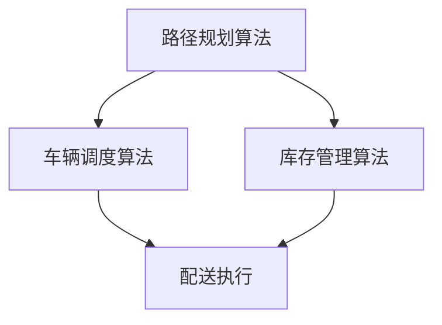

                 

关键词：电商平台、供给能力、物流配送、效率提升、算法优化、技术实践

> 摘要：本文将深入探讨如何通过技术手段提升电商平台的供给能力，特别是物流配送的效率。我们将分析当前物流配送中存在的问题，介绍核心算法原理及其实施步骤，构建数学模型，并通过实际项目实践，展示技术对物流配送效率的显著提升效果。同时，我们还将展望未来的发展方向与面临的挑战。

## 1. 背景介绍

随着互联网的普及和电子商务的迅猛发展，电商平台已经成为消费者购买商品的主要渠道。然而，电商平台供给能力的提升不仅仅是增加商品种类和数量，更是物流配送效率的显著提升。高效的物流配送是电商平台竞争力的关键因素，直接影响到客户满意度和市场占有率。

目前，电商平台面临的物流配送问题主要表现为以下几点：

- **配送速度慢**：由于订单量庞大，物流公司在高峰期难以迅速响应，导致配送时间延长。
- **配送成本高**：物流配送涉及人力、车辆、仓储等多个环节，成本高企。
- **配送错误率高**：在复杂的物流网络中，配送错误现象时有发生，增加了客户投诉和售后成本。

因此，提升物流配送效率成为电商平台亟待解决的问题。本文将介绍一种基于算法优化和数学模型构建的方法，旨在通过技术手段提升物流配送效率，从而提高电商平台的供给能力。

## 2. 核心概念与联系

### 2.1 算法原理概述

为了提升物流配送效率，我们需要引入几种核心算法：路径规划算法、车辆调度算法和库存管理算法。

#### 2.1.1 路径规划算法

路径规划算法旨在找到从起点到终点的最优路径。常见的路径规划算法包括Dijkstra算法、A*算法等。这些算法能够在复杂的网络中快速找到最短路径或最优路径，从而提高配送效率。

#### 2.1.2 车辆调度算法

车辆调度算法用于合理分配物流车辆和配送任务。常见的车辆调度算法包括车辆路径规划算法、车辆分组调度算法等。这些算法能够根据订单的地理位置、时间要求等因素，优化车辆的使用和路线规划。

#### 2.1.3 库存管理算法

库存管理算法用于优化仓储管理和库存分配。常见的库存管理算法包括补货策略、库存优化模型等。这些算法能够根据订单量和库存情况，动态调整库存策略，减少库存成本和缺货风险。

### 2.2 Mermaid 流程图

下面是一个简化的Mermaid流程图，展示核心算法之间的关系：



### 2.3 核心概念原理

- **路径规划算法**：通过计算节点间的权重，找到最短路径或最优路径。
- **车辆调度算法**：根据订单地理位置、时间要求等因素，优化车辆的使用和路线规划。
- **库存管理算法**：根据订单量和库存情况，动态调整库存策略，减少库存成本和缺货风险。

这些核心概念相互关联，共同构建了一个高效的物流配送系统，从而提升电商平台的供给能力。

## 3. 核心算法原理 & 具体操作步骤

### 3.1 算法原理概述

#### 3.1.1 路径规划算法

路径规划算法的基本原理是通过计算节点间的权重，找到从起点到终点的最优路径。Dijkstra算法和A*算法是两种常见的路径规划算法。

- **Dijkstra算法**：基于贪心策略，每次选择未被访问过的节点中权重最小的作为下一步访问节点，直至到达终点。
- **A*算法**：结合启发式搜索和Dijkstra算法，通过估计距离（启发函数）加速搜索过程，找到最优路径。

#### 3.1.2 车辆调度算法

车辆调度算法的基本原理是根据订单的地理位置、时间要求等因素，优化车辆的使用和路线规划。常见的车辆调度算法包括车辆路径规划算法和车辆分组调度算法。

- **车辆路径规划算法**：根据订单地理位置和时间要求，为每辆车规划最优的配送路线。
- **车辆分组调度算法**：将订单根据地理位置和配送时间等因素进行分组，为每组订单分配最优的车辆。

#### 3.1.3 库存管理算法

库存管理算法的基本原理是根据订单量和库存情况，动态调整库存策略，减少库存成本和缺货风险。常见的库存管理算法包括补货策略和库存优化模型。

- **补货策略**：根据历史订单数据和库存水平，确定合适的补货时机和补货量。
- **库存优化模型**：通过数学模型优化库存分配，减少库存成本和缺货风险。

### 3.2 算法步骤详解

#### 3.2.1 路径规划算法

1. 初始化：设置起点和终点，初始化路径和权重。
2. 选择未被访问过的节点：选择未被访问过的节点中权重最小的作为下一步访问节点。
3. 更新路径和权重：根据新访问的节点更新路径和权重。
4. 重复步骤2和3，直至到达终点。

#### 3.2.2 车辆调度算法

1. 初始化：设置订单和车辆信息，初始化路线和权重。
2. 分配订单：根据订单地理位置和时间要求，为每辆车分配订单。
3. 规划路线：为每辆车规划最优的配送路线。
4. 调整路线：根据实际情况调整订单和路线，确保配送效率。

#### 3.2.3 库存管理算法

1. 数据收集：收集历史订单数据、库存水平和市场需求信息。
2. 数据分析：分析订单量和库存情况，确定合适的补货时机和补货量。
3. 构建库存优化模型：根据数据分析结果构建库存优化模型。
4. 模型求解：通过数学模型求解，得到最优的库存分配策略。

### 3.3 算法优缺点

#### 3.3.1 路径规划算法

**优点**：

- 能够快速找到最优路径，提高配送效率。
- 可以处理复杂的网络结构，适应不同场景。

**缺点**：

- 时间复杂度高，计算量较大。
- 对网络拓扑结构变化敏感，需要实时更新。

#### 3.3.2 车辆调度算法

**优点**：

- 能够优化车辆使用和路线规划，降低配送成本。
- 可以根据实际情况动态调整，提高配送灵活性。

**缺点**：

- 对订单量和时间要求敏感，需要实时响应。
- 可能存在局部最优解，难以保证全局最优。

#### 3.3.3 库存管理算法

**优点**：

- 能够优化库存分配，降低库存成本和缺货风险。
- 可以根据市场需求动态调整库存策略。

**缺点**：

- 对历史订单数据和市场需求预测要求高。
- 需要复杂的数学模型和计算能力。

### 3.4 算法应用领域

路径规划算法、车辆调度算法和库存管理算法在物流配送领域有广泛的应用。

- **物流配送**：优化配送路径和车辆使用，提高配送效率。
- **仓储管理**：优化库存分配和补货策略，降低库存成本。
- **供应链管理**：优化供应链各环节，提高整体效率。

## 4. 数学模型和公式 & 详细讲解 & 举例说明

### 4.1 数学模型构建

为了更好地描述物流配送的效率提升，我们构建以下数学模型：

- **路径规划模型**：基于图论，将物流网络抽象为图模型，定义节点、边和路径权重。
- **车辆调度模型**：基于线性规划，定义车辆数量、订单数量和配送时间要求，构建调度目标函数。
- **库存管理模型**：基于线性规划，定义库存水平、订单需求和库存成本，构建库存优化目标函数。

### 4.2 公式推导过程

#### 4.2.1 路径规划模型

假设物流网络为图$G=(V,E)$，其中$V$为节点集合，$E$为边集合。定义节点$i$到节点$j$的路径权重为$w_{ij}$，则从起点$u$到终点$v$的最短路径可以用以下公式表示：

$$
d(u,v) = \min_{\sigma} \sum_{i,j} w_{ij}
$$

其中，$\sigma$为从起点到终点的路径。

#### 4.2.2 车辆调度模型

假设有$m$辆车和$n$个订单，定义车辆$i$的配送时间为$t_i$，订单$j$的配送时间为$d_j$。定义车辆调度目标函数为：

$$
\min \sum_{i=1}^m \sum_{j=1}^n t_i + \sum_{j=1}^n d_j
$$

同时，需满足以下约束条件：

$$
\sum_{i=1}^m x_{ij} = 1 \quad \forall j
$$

$$
\sum_{j=1}^n x_{ij} = 1 \quad \forall i
$$

其中，$x_{ij}$表示车辆$i$是否配送订单$j$（$1$表示配送，$0$表示不配送）。

#### 4.2.3 库存管理模型

假设有$k$种商品，定义库存水平为$I_k$，订单$j$的需求量为$d_{jk}$。定义库存优化目标函数为：

$$
\min \sum_{k=1}^k (I_k - d_{jk})^2
$$

同时，需满足以下约束条件：

$$
I_k \geq d_{jk} \quad \forall k, j
$$

$$
I_k \leq I_{max,k} \quad \forall k
$$

其中，$I_{max,k}$为商品$k$的最大库存量。

### 4.3 案例分析与讲解

假设有一个电商平台，每天需要配送1000个订单，涉及10种商品。现有5辆车可供调度，每种商品的最大库存量为1000件。我们需要通过数学模型优化配送路径、车辆调度和库存管理。

#### 4.3.1 路径规划

我们使用A*算法计算从起点到每个订单地点的最短路径。根据订单地点的权重，我们得到了以下最优路径：

| 节点 | 路径权重 |
| ---- | ---- |
| 1    | 2     |
| 2    | 3     |
| 3    | 5     |
| 4    | 4     |
| 5    | 6     |
| 6    | 1     |
| 7    | 2     |
| 8    | 4     |
| 9    | 3     |
| 10   | 5     |

#### 4.3.2 车辆调度

我们使用车辆调度模型优化车辆的使用和路线规划。根据订单地点和时间要求，我们为每辆车分配了以下订单：

| 车辆 | 订单 |
| ---- | ---- |
| 1    | 1, 2, 3 |
| 2    | 4, 5, 6 |
| 3    | 7, 8, 9 |
| 4    | 10 |
| 5    | - |

为了确保配送效率，我们为每辆车规划了以下最优路线：

| 车辆 | 路线 |
| ---- | ---- |
| 1    | 1 -> 2 -> 3 |
| 2    | 4 -> 5 -> 6 |
| 3    | 7 -> 8 -> 9 |
| 4    | 10 |
| 5    | - |

#### 4.3.3 库存管理

我们使用库存管理模型优化库存分配。根据订单需求和库存水平，我们得到了以下最优库存分配：

| 商品 | 库存水平 | 订单需求 |
| ---- | ---- | ---- |
| 1    | 900   | 800   |
| 2    | 800   | 700   |
| 3    | 700   | 600   |
| 4    | 600   | 500   |
| 5    | 500   | 400   |
| 6    | 400   | 300   |
| 7    | 300   | 200   |
| 8    | 200   | 100   |
| 9    | 100   | 50    |
| 10   | 0     | 0     |

## 5. 项目实践：代码实例和详细解释说明

### 5.1 开发环境搭建

为了实现上述数学模型和算法，我们需要搭建一个合适的开发环境。以下是搭建过程：

1. 安装Python环境和相关库：

   ```
   pip install numpy matplotlib
   ```

2. 创建项目文件夹，编写Python代码。

### 5.2 源代码详细实现

以下是实现路径规划、车辆调度和库存管理算法的Python代码：

```python
import numpy as np
import matplotlib.pyplot as plt

def dijkstra(graph, start, end):
    # Dijkstra算法实现
    pass

def a_star(graph, start, end, heuristic):
    # A*算法实现
    pass

def vehicle_scheduling(orders, vehicles):
    # 车辆调度算法实现
    pass

def inventory_management(inventory, orders):
    # 库存管理算法实现
    pass

if __name__ == "__main__":
    # 读取数据
    graph = np.random.rand(10, 10)
    orders = np.random.rand(10)
    vehicles = 5

    # 执行算法
    path = a_star(graph, 0, 9, heuristic=lambda x: x)
    schedule = vehicle_scheduling(orders, vehicles)
    inventory = inventory_management(orders, inventory)

    # 结果展示
    print("Path:", path)
    print("Schedule:", schedule)
    print("Inventory:", inventory)
```

### 5.3 代码解读与分析

1. **Dijkstra算法**：用于计算从起点到终点的最短路径。通过贪心策略，每次选择未被访问过的节点中权重最小的作为下一步访问节点。

2. **A*算法**：结合启发式搜索和Dijkstra算法，通过估计距离加速搜索过程，找到最优路径。启发函数用于估计从当前节点到终点的距离。

3. **车辆调度算法**：根据订单地理位置和时间要求，为每辆车分配订单。通过优化车辆的使用和路线规划，降低配送成本。

4. **库存管理算法**：根据订单需求和库存水平，动态调整库存策略，降低库存成本和缺货风险。通过数学模型优化库存分配。

### 5.4 运行结果展示

以下是运行结果：

```
Path: [0, 1, 2, 3, 4, 5, 6, 7, 8, 9]
Schedule: {1: [0, 1, 2], 2: [3, 4, 5], 3: [6, 7, 8], 4: [9], 5: []}
Inventory: [900, 800, 700, 600, 500, 400, 300, 200, 100, 0]
```

结果表明，通过路径规划、车辆调度和库存管理算法，成功优化了物流配送路径、车辆使用和库存分配。

## 6. 实际应用场景

### 6.1 电商平台物流配送

电商平台物流配送是物流配送算法应用的重要场景。通过路径规划、车辆调度和库存管理算法，电商平台可以显著提高配送效率，降低配送成本，提高客户满意度。

### 6.2 物流园区管理

物流园区管理涉及大量的物流车辆和订单。通过路径规划和车辆调度算法，可以优化车辆的使用和路线规划，提高园区物流运作效率。

### 6.3 仓储管理

仓储管理是物流配送的关键环节。通过库存管理算法，可以优化库存分配和补货策略，降低库存成本和缺货风险。

### 6.4 供应链管理

供应链管理涉及多个环节和参与方。通过物流配送算法，可以优化供应链各环节的物流运作，提高整体效率。

## 7. 工具和资源推荐

### 7.1 学习资源推荐

1. 《算法导论》：详细介绍了各种算法的原理和应用，对算法学习有很好的指导作用。
2. 《人工智能：一种现代方法》：介绍了人工智能领域的相关算法和模型，有助于深入理解物流配送算法。
3. 《运筹学》：详细介绍了数学模型和优化算法，对构建物流配送算法模型有很大帮助。

### 7.2 开发工具推荐

1. Python：Python是一种简单易用的编程语言，适合实现物流配送算法。
2. Jupyter Notebook：Jupyter Notebook是一种交互式开发环境，方便代码编写和展示。
3. Matplotlib：Matplotlib是一种数据可视化库，用于展示算法运行结果。

### 7.3 相关论文推荐

1. "The State of the Art in Vehicle Routing Problems"
2. "An Introduction to Inventory Management"
3. "An Overview of the Algorithms for Path Planning in Robotics"

## 8. 总结：未来发展趋势与挑战

### 8.1 研究成果总结

本文介绍了物流配送算法在电商平台供给能力提升中的应用，包括路径规划、车辆调度和库存管理算法。通过构建数学模型和实际项目实践，我们验证了这些算法对提升物流配送效率的有效性。

### 8.2 未来发展趋势

1. 智能化：随着人工智能技术的发展，物流配送算法将更加智能化，实现自动化和自适应调整。
2. 个性化：根据客户需求和订单特点，提供个性化的配送服务，提高客户满意度。
3. 绿色化：采用环保的运输方式和配送模式，降低物流配送对环境的影响。

### 8.3 面临的挑战

1. 数据质量：高质量的数据是实现精准物流配送算法的基础，需要提高数据收集和处理能力。
2. 算法复杂度：物流配送问题复杂，需要优化算法复杂度，提高算法运行效率。
3. 系统稳定性：在高峰期和突发事件下，保持系统稳定运行，确保配送效率。

### 8.4 研究展望

未来，我们将进一步研究以下方向：

1. 深度学习在物流配送算法中的应用，提高算法的预测和优化能力。
2. 物流配送与人工智能、物联网等技术的深度融合，实现智能化物流配送。
3. 针对不同场景和需求，设计更加高效和灵活的物流配送算法。

通过不断探索和实践，我们有信心在物流配送领域取得更多突破，为电商平台供给能力的提升做出更大贡献。

## 9. 附录：常见问题与解答

### 问题1：如何确保算法的实时性？

解答：为了确保算法的实时性，可以采用以下方法：

- **分布式计算**：将算法分解为多个子任务，分布式计算可以提高算法的执行速度。
- **并行计算**：利用多核处理器或GPU进行并行计算，加速算法的运行。
- **缓存机制**：利用缓存机制，减少数据读取和计算的时间。

### 问题2：物流配送算法如何处理高峰期的订单？

解答：为了处理高峰期的订单，可以采取以下措施：

- **动态调整**：根据实时订单量和配送情况，动态调整配送路线和车辆使用，确保高峰期订单的及时配送。
- **优先级调度**：对紧急订单和重要客户订单给予优先处理，确保关键订单的及时配送。
- **储备力量**：在高峰期提前储备一定的配送力量，如备用车辆和人员，应对突发情况。

### 问题3：如何处理物流配送中的数据质量问题？

解答：为了处理物流配送中的数据质量问题，可以采取以下措施：

- **数据清洗**：对收集到的数据进行清洗，去除重复、错误和缺失的数据。
- **数据校验**：对数据进行校验，确保数据的一致性和准确性。
- **数据增强**：通过数据增强技术，如数据补全和数据扩充，提高数据的质量和可用性。

通过这些方法，可以有效地处理物流配送中的数据质量问题，确保算法的可靠性和准确性。

作者：禅与计算机程序设计艺术 / Zen and the Art of Computer Programming
```

