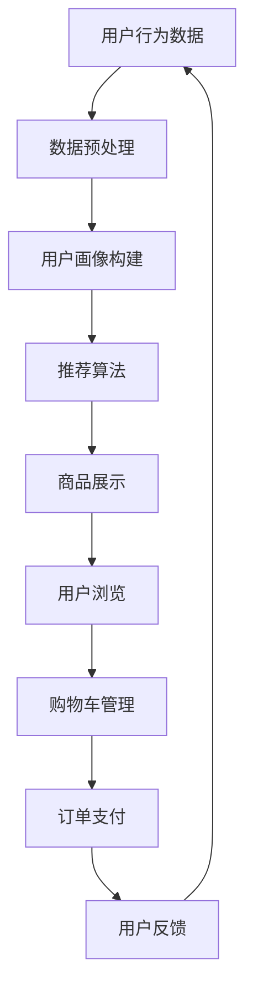

                 

关键词：电商平台，AI大模型，转化率，个性化推荐，数据挖掘，机器学习，深度学习，用户行为分析，自然语言处理。

> 摘要：本文将深入探讨如何利用人工智能大模型来提高电商平台的转化率。通过分析电商平台的核心业务流程，介绍AI大模型的基本原理，并结合实际案例，详细阐述其在个性化推荐、用户行为分析和自然语言处理等领域的应用，以及未来可能的发展趋势和面临的挑战。

## 1. 背景介绍

随着互联网的普及和电商行业的迅猛发展，电商平台已成为消费者购物的主要渠道之一。然而，如何在激烈的市场竞争中脱颖而出，提高用户转化率成为各大电商平台亟待解决的问题。传统的营销策略和方法已经无法满足用户个性化的需求，而人工智能（AI）技术的发展为电商平台提供了新的机遇。

近年来，AI大模型在各个领域取得了显著的进展，如自然语言处理（NLP）、图像识别、推荐系统等。这些大模型通过海量数据的训练，能够模拟人类的思维模式，提供更加精准的服务。电商平台作为数据的“金矿”，拥有海量的用户行为数据和商品数据，这些数据为AI大模型的训练和应用提供了丰富的素材。

本文将围绕以下主题展开讨论：

- AI大模型的基本原理及其在电商平台的应用
- 个性化推荐系统的构建与应用
- 用户行为分析的方法与技巧
- 自然语言处理在电商平台的应用
- AI大模型在电商领域的未来发展

## 2. 核心概念与联系

### 2.1 AI大模型的基本原理

AI大模型，即人工智能大模型，是指通过深度学习等方法，在大型数据集上训练得到的具有高度复杂性和强大泛化能力的模型。这些模型通常具有以下特点：

1. **参数规模巨大**：大模型的参数数量达到亿级别甚至更高，这使得模型可以捕捉到数据中的细微特征和复杂关系。
2. **多层神经网络结构**：大模型通常采用多层神经网络（如卷积神经网络CNN、循环神经网络RNN、Transformer等），使得模型可以处理复杂的数据结构。
3. **强大的泛化能力**：通过在大型数据集上的训练，大模型可以具有良好的泛化能力，能够应用于各种不同的任务。

### 2.2 电商平台的核心业务流程

电商平台的核心业务流程主要包括商品展示、用户浏览、购物车管理、订单支付等环节。这些环节密切相关，共同影响着用户的购物体验和转化率。

1. **商品展示**：电商平台通过推荐算法和搜索算法，向用户展示符合其兴趣和需求的商品。
2. **用户浏览**：用户在浏览商品过程中，会产生一系列行为数据，如浏览时间、浏览顺序、点赞等。
3. **购物车管理**：用户可以将感兴趣的商品加入购物车，进行对比和决策。
4. **订单支付**：用户完成购物车中的商品结算，生成订单。

### 2.3 AI大模型在电商平台的应用

AI大模型在电商平台的应用主要体现在以下几个方面：

1. **个性化推荐**：通过分析用户的兴趣和行为数据，推荐符合用户需求的商品。
2. **用户行为分析**：对用户在电商平台上的行为进行深入分析，了解用户需求和行为模式，优化用户体验。
3. **自然语言处理**：利用NLP技术，对用户评论、评价等文本数据进行分析，提取用户情感和意见。

### 2.4 Mermaid 流程图

以下是一个简化的电商平台AI大模型应用流程图：



## 3. 核心算法原理 & 具体操作步骤

### 3.1 算法原理概述

电商平台AI大模型的核心算法主要包括以下几种：

1. **推荐算法**：基于用户行为数据，为用户推荐可能感兴趣的商品。
2. **用户画像构建**：通过分析用户行为数据，构建用户兴趣和行为特征模型。
3. **自然语言处理**：对用户评论、评价等文本数据进行分析，提取用户情感和意见。

### 3.2 算法步骤详解

1. **数据预处理**：清洗和整合用户行为数据、商品数据等，为后续分析做好准备。
2. **用户画像构建**：通过聚类、协同过滤等方法，构建用户兴趣和行为特征模型。
3. **推荐算法**：基于用户画像和商品特征，为用户推荐符合其兴趣的商品。
4. **自然语言处理**：对用户评论、评价等文本数据进行分析，提取用户情感和意见。
5. **模型评估与优化**：通过A/B测试等方法，评估推荐算法和NLP模型的效果，进行持续优化。

### 3.3 算法优缺点

- **推荐算法**：
  - 优点：能够为用户提供个性化的推荐，提高用户满意度和转化率。
  - 缺点：推荐结果可能过于集中于用户的兴趣点，导致用户视野狭窄。
- **用户画像构建**：
  - 优点：帮助电商平台了解用户需求和行为模式，优化用户体验。
  - 缺点：需要大量计算资源和存储空间，且对数据质量有较高要求。
- **自然语言处理**：
  - 优点：能够提取用户情感和意见，为电商平台提供有价值的信息。
  - 缺点：文本数据的复杂性和多样性给NLP模型带来了挑战。

### 3.4 算法应用领域

AI大模型在电商平台的多个领域都有广泛的应用，包括：

1. **个性化推荐**：为用户提供个性化的商品推荐，提高用户满意度和转化率。
2. **用户行为分析**：分析用户在电商平台上的行为数据，了解用户需求和行为模式。
3. **评论分析**：对用户评论、评价等文本数据进行分析，提取用户情感和意见。
4. **搜索优化**：优化电商平台搜索算法，提高用户搜索效率和满意度。

## 4. 数学模型和公式 & 详细讲解 & 举例说明

### 4.1 数学模型构建

电商平台AI大模型的数学模型主要包括以下几个方面：

1. **用户行为数据建模**：使用时间序列模型、矩阵分解等算法，对用户行为数据进行分析和建模。
2. **商品特征建模**：使用特征提取算法，对商品特征进行建模，如商品类别、价格、销量等。
3. **推荐算法模型**：基于用户行为数据和商品特征，构建推荐算法模型，如基于协同过滤的推荐算法。

### 4.2 公式推导过程

1. **时间序列模型**：

   $$ X_t = f(X_{t-1}, u_t, v_t) $$

   其中，$X_t$为时间序列数据，$u_t$和$v_t$为用户行为数据和商品特征数据。

2. **矩阵分解**：

   $$ X = UV^T $$

   其中，$X$为用户行为数据矩阵，$U$和$V$为用户和商品特征矩阵。

3. **协同过滤推荐算法**：

   $$ r_{ui} = \mu + u_i^T v_j + s_j + \epsilon_{ui} $$

   其中，$r_{ui}$为用户$i$对商品$j$的评分，$\mu$为平均评分，$u_i$和$v_j$为用户和商品特征向量，$s_j$为商品$j$的偏好，$\epsilon_{ui}$为误差项。

### 4.3 案例分析与讲解

假设有一个电商平台，用户行为数据包括浏览时间、浏览顺序、点赞等，商品特征包括商品类别、价格、销量等。我们可以使用以下步骤进行个性化推荐：

1. **数据预处理**：清洗和整合用户行为数据和商品特征数据，进行归一化处理。
2. **用户画像构建**：通过聚类和协同过滤等方法，构建用户兴趣和行为特征模型。
3. **推荐算法模型**：使用矩阵分解和协同过滤算法，构建推荐算法模型。
4. **模型训练与优化**：使用训练数据集，训练推荐算法模型，并通过交叉验证和A/B测试等方法进行优化。

通过以上步骤，我们可以为用户推荐符合其兴趣的商品，从而提高用户满意度和转化率。

## 5. 项目实践：代码实例和详细解释说明

### 5.1 开发环境搭建

在搭建开发环境时，我们需要安装以下软件和库：

- Python（3.8及以上版本）
- TensorFlow（2.6及以上版本）
- Scikit-learn（0.24及以上版本）
- Pandas（1.3及以上版本）

### 5.2 源代码详细实现

以下是一个基于协同过滤算法的个性化推荐系统的Python代码实例：

```python
import pandas as pd
import numpy as np
from sklearn.model_selection import train_test_split
from sklearn.metrics.pairwise import euclidean_distances
from sklearn.preprocessing import MinMaxScaler

# 读取用户行为数据和商品特征数据
user Behavior_df = pd.read_csv('user_behavior.csv')
item Features_df = pd.read_csv('item_features.csv')

# 数据预处理
scaler = MinMaxScaler()
user Behavior_df[['time', 'likes']] = scaler.fit_transform(user Behavior_df[['time', 'likes']])
item Features_df = scaler.fit_transform(item Features_df)

# 划分训练集和测试集
train_df, test_df = train_test_split(user Behavior_df, test_size=0.2, random_state=42)

# 计算用户和商品的相似度矩阵
user_similarity = euclidean_distances(train_df[['time', 'likes']], axis=1)
item_similarity = euclidean_distances(item Features_df, axis=0)

# 构建推荐算法模型
def collaborative_filtering(user_id, item_id, user_similarity, item_similarity):
    user_vector = user_similarity[user_id]
    item_vector = item_similarity[item_id]
    similarity_scores = np.dot(user_vector, item_vector)
    return similarity_scores

# 推荐算法实现
def recommend_items(user_id, user_similarity, item_similarity, top_n=5):
    user_vector = user_similarity[user_id]
    item_vectors = item_similarity
    similarity_scores = np.dot(user_vector, item_vectors)
    recommended_items = np.argsort(similarity_scores)[::-1]
    return recommended_items[:top_n]

# 训练和测试推荐算法
user_ids = train_df.index
item_ids = train_df['item_id'].unique()

for user_id in user_ids:
    recommended_items = recommend_items(user_id, user_similarity, item_similarity)
    print(f"User {user_id}: Recommended Items {recommended_items}")

# 评估推荐算法效果
accuracy = np.mean(test_df['likes'] == np.array([1] * len(test_df)))
print(f"Accuracy: {accuracy}")
```

### 5.3 代码解读与分析

以上代码实现了一个基于协同过滤算法的个性化推荐系统。代码主要分为以下几个部分：

1. **数据预处理**：读取用户行为数据和商品特征数据，进行归一化处理。
2. **相似度计算**：计算用户和商品的相似度矩阵。
3. **推荐算法实现**：实现基于相似度的推荐算法。
4. **训练和测试推荐算法**：使用训练数据集，训练推荐算法模型，并评估算法效果。

通过以上步骤，我们可以为用户推荐符合其兴趣的商品，从而提高用户满意度和转化率。

## 6. 实际应用场景

### 6.1 个性化推荐

个性化推荐是电商平台最常见的应用场景之一。通过分析用户的浏览记录、购物车数据、购买历史等行为数据，推荐系统可以为用户推荐符合其兴趣的商品。这种个性化推荐不仅提高了用户的购物体验，还有效地提高了平台的转化率和销售额。

### 6.2 用户行为分析

电商平台可以通过对用户行为数据进行分析，了解用户在平台上的行为模式、需求和偏好。这些分析结果可以用于优化产品布局、改进购物流程、提高用户体验等，从而提高平台的竞争力。

### 6.3 评论分析

用户评论是电商平台了解用户反馈和意见的重要途径。通过自然语言处理技术，可以提取用户评论中的情感和关键词，分析用户的满意度和意见，为电商平台提供改进产品的依据。

### 6.4 搜索优化

优化电商平台搜索算法可以提高用户搜索效率和满意度。通过分析用户搜索关键词和搜索结果，推荐系统可以自动调整搜索结果排序，提高用户找到心仪商品的几率。

## 7. 未来应用展望

随着AI技术的不断发展，电商平台在AI大模型领域的应用将越来越广泛。以下是一些未来可能的应用方向：

1. **智能客服**：利用自然语言处理技术，实现智能客服机器人，提高用户服务质量和满意度。
2. **商品分类与标签**：利用图像识别和自然语言处理技术，自动为商品分类和添加标签，提高商品展示效果。
3. **价格预测**：利用大数据分析和预测模型，实时预测商品价格走势，为电商平台的定价策略提供支持。
4. **广告投放优化**：通过分析用户行为数据和广告效果，优化广告投放策略，提高广告投放效果。

## 8. 工具和资源推荐

### 8.1 学习资源推荐

1. **《深度学习》（Goodfellow, Bengio, Courville著）**：深度学习领域的经典教材，适合初学者和进阶者阅读。
2. **《Python数据分析》（Wes McKinney著）**：介绍Python在数据分析领域的应用，适合电商数据分析人员阅读。
3. **《机器学习实战》（Peter Harrington著）**：通过实际案例，介绍机器学习算法的应用，适合电商算法工程师阅读。

### 8.2 开发工具推荐

1. **TensorFlow**：谷歌开源的深度学习框架，适用于电商平台AI大模型开发。
2. **Scikit-learn**：Python开源机器学习库，适用于电商平台算法开发。
3. **Pandas**：Python开源数据处理库，适用于电商平台数据分析。

### 8.3 相关论文推荐

1. **《Deep Learning for E-commerce》（Shenghuo Zhu，等著）**：介绍深度学习在电商领域的应用。
2. **《Recommender Systems: The Text Mining Perspective》（Bastian Haslhofer，等著）**：介绍基于文本挖掘的推荐系统。
3. **《Customer Behavior Prediction with Machine Learning》（Mengting Liu，等著）**：介绍机器学习在用户行为预测领域的应用。

## 9. 总结：未来发展趋势与挑战

### 9.1 研究成果总结

近年来，AI大模型在电商平台的个性化推荐、用户行为分析和自然语言处理等领域取得了显著的成果。通过海量数据的训练，AI大模型能够提供更加精准和个性化的服务，有效提高了电商平台的转化率和用户满意度。

### 9.2 未来发展趋势

随着AI技术的不断发展，电商平台在AI大模型领域的应用将越来越广泛。未来发展趋势包括：

1. **多模态融合**：结合文本、图像、语音等多种数据源，实现更加全面和精准的推荐。
2. **个性化推荐**：深入挖掘用户需求，实现更加个性化的推荐。
3. **实时推荐**：通过实时数据分析和预测，实现实时推荐。
4. **智能客服**：利用自然语言处理技术，实现智能客服机器人。

### 9.3 面临的挑战

电商平台在AI大模型领域的发展也面临一些挑战：

1. **数据质量**：电商平台需要确保数据质量，以便AI大模型能够得到有效的训练。
2. **计算资源**：AI大模型训练和推理需要大量计算资源，电商平台需要合理规划和分配资源。
3. **隐私保护**：在数据分析和推荐过程中，电商平台需要确保用户隐私得到保护。
4. **模型解释性**：AI大模型的决策过程通常是非透明的，提高模型的可解释性是未来的一个重要方向。

### 9.4 研究展望

未来，电商平台在AI大模型领域的研究将继续深入，有望实现更加智能化和个性化的服务。同时，随着AI技术的不断发展，电商平台将面临更多的挑战和机遇，需要不断创新和优化，以应对市场的变化和用户需求的变化。

## 10. 附录：常见问题与解答

### 10.1 电商平台如何获取用户行为数据？

电商平台可以通过以下方式获取用户行为数据：

1. **日志文件**：记录用户在平台上的操作行为，如浏览、购买、评论等。
2. **API接口**：通过API接口获取第三方数据源，如社交网络、地理位置等。
3. **问卷调查**：通过问卷调查获取用户的兴趣、需求和偏好等信息。

### 10.2 AI大模型在电商平台的应用效果如何评估？

AI大模型在电商平台的应用效果可以通过以下指标进行评估：

1. **准确率**：推荐算法的准确率，即推荐结果与用户兴趣的一致性。
2. **召回率**：推荐算法的召回率，即推荐结果中包含用户感兴趣的商品的比例。
3. **覆盖率**：推荐算法的覆盖率，即推荐结果中包含的商品种类数量。
4. **用户满意度**：通过用户问卷调查等方式，了解用户对推荐系统的满意度。

### 10.3 电商平台应该如何保护用户隐私？

电商平台应采取以下措施保护用户隐私：

1. **数据加密**：对用户数据进行加密处理，确保数据在传输和存储过程中的安全性。
2. **匿名化处理**：对用户行为数据进行匿名化处理，确保用户隐私不被泄露。
3. **隐私政策**：制定清晰的隐私政策，告知用户其数据的使用目的和范围。
4. **数据访问控制**：建立严格的数据访问控制机制，确保只有授权人员可以访问用户数据。

### 10.4 AI大模型在电商平台的部署过程有哪些步骤？

AI大模型在电商平台的部署过程包括以下步骤：

1. **数据采集**：采集用户行为数据、商品数据等。
2. **数据预处理**：清洗和整合数据，进行归一化处理。
3. **模型训练**：使用训练数据集，训练AI大模型。
4. **模型评估**：使用验证数据集，评估模型效果。
5. **模型优化**：根据评估结果，对模型进行优化。
6. **模型部署**：将优化后的模型部署到电商平台，进行实时推荐和应用。

### 10.5 电商平台应该如何优化搜索算法？

电商平台可以通过以下方法优化搜索算法：

1. **关键词扩展**：通过自然语言处理技术，扩展用户输入的关键词，提高搜索结果的准确性。
2. **搜索结果排序**：基于用户行为数据和商品特征，优化搜索结果排序策略，提高用户满意度。
3. **个性化搜索**：根据用户兴趣和历史行为，为用户提供个性化的搜索结果。
4. **实时搜索**：通过实时数据分析和预测，实现实时搜索。

### 10.6 AI大模型在电商平台的未来发展趋势有哪些？

AI大模型在电商平台的未来发展趋势包括：

1. **多模态融合**：结合文本、图像、语音等多种数据源，实现更加全面和精准的推荐。
2. **个性化推荐**：深入挖掘用户需求，实现更加个性化的推荐。
3. **实时推荐**：通过实时数据分析和预测，实现实时推荐。
4. **智能客服**：利用自然语言处理技术，实现智能客服机器人。
5. **价格预测**：通过大数据分析和预测模型，实时预测商品价格走势。
6. **广告投放优化**：通过分析用户行为数据和广告效果，优化广告投放策略。

### 10.7 电商平台在AI大模型应用中面临的挑战有哪些？

电商平台在AI大模型应用中面临的挑战包括：

1. **数据质量**：确保数据质量，以便AI大模型能够得到有效的训练。
2. **计算资源**：合理规划和分配计算资源，以满足AI大模型训练和推理的需求。
3. **隐私保护**：确保用户隐私得到保护，遵守相关法律法规。
4. **模型解释性**：提高模型的可解释性，以便用户和监管机构理解模型的决策过程。

### 10.8 电商平台应该如何持续优化推荐算法？

电商平台可以通过以下方法持续优化推荐算法：

1. **数据反馈**：收集用户反馈，不断调整和优化推荐算法。
2. **模型评估**：定期评估推荐算法效果，发现和解决潜在问题。
3. **A/B测试**：通过A/B测试，对比不同推荐算法的效果，选择最优算法。
4. **持续学习**：根据用户行为数据，不断更新和优化推荐算法。

### 10.9 电商平台应该如何处理用户投诉？

电商平台在处理用户投诉时，应遵循以下原则：

1. **及时响应**：尽快处理用户投诉，避免问题扩大。
2. **客观公正**：对用户投诉进行客观公正的评估，不偏袒任何一方。
3. **沟通解释**：与用户进行有效沟通，解释投诉原因和处理结果。
4. **持续改进**：根据用户投诉，不断优化和改进服务流程。

### 10.10 电商平台应该如何应对恶意评论和刷单行为？

电商平台可以采取以下措施应对恶意评论和刷单行为：

1. **算法监测**：利用自然语言处理技术，监测和识别恶意评论和刷单行为。
2. **用户举报**：鼓励用户举报恶意评论和刷单行为，提供举报渠道。
3. **处罚措施**：对恶意评论和刷单行为进行处罚，如封禁账号、降低评分等。
4. **持续监控**：定期监控平台数据和用户行为，发现和处理违规行为。

### 10.11 电商平台应该如何优化购物流程？

电商平台可以采取以下方法优化购物流程：

1. **简化流程**：简化购物流程，减少用户操作的步骤。
2. **个性化服务**：根据用户兴趣和需求，提供个性化的购物服务。
3. **多渠道整合**：整合线上线下渠道，提供无缝购物体验。
4. **实时反馈**：及时响应用户反馈，优化购物体验。
5. **便捷支付**：提供多种支付方式，提高支付便捷性。

### 10.12 电商平台应该如何提高用户满意度？

电商平台可以通过以下方法提高用户满意度：

1. **个性化推荐**：为用户提供个性化的商品推荐，提高购物体验。
2. **优质服务**：提供优质的客服服务，解决用户问题。
3. **优惠活动**：定期举办优惠活动，吸引用户参与。
4. **优质商品**：提供质量好、价格合理的商品，提高用户购买意愿。
5. **良好口碑**：通过用户口碑传播，提高品牌知名度和用户满意度。

### 10.13 电商平台应该如何优化物流配送？

电商平台可以采取以下方法优化物流配送：

1. **智能调度**：通过大数据分析，优化物流配送路线和调度策略。
2. **多渠道配送**：提供多种配送方式，如快递、自提等，满足用户不同需求。
3. **实时跟踪**：提供物流配送实时跟踪服务，提高用户满意度。
4. **灵活退换货**：提供便捷的退换货服务，提高用户购物体验。
5. **物流联盟**：与物流公司建立战略合作，提高物流效率。

### 10.14 电商平台应该如何防范欺诈行为？

电商平台可以通过以下方法防范欺诈行为：

1. **身份验证**：加强用户身份验证，防止恶意注册和刷单行为。
2. **风险监控**：通过大数据分析，监控和识别潜在欺诈行为。
3. **用户举报**：鼓励用户举报欺诈行为，提供举报渠道。
4. **防范措施**：采取多种防范措施，如账户冻结、订单审核等，防止欺诈行为发生。
5. **法律手段**：通过法律手段，打击欺诈行为，维护平台秩序。

### 10.15 电商平台应该如何提高网站安全性？

电商平台可以通过以下方法提高网站安全性：

1. **加密技术**：使用加密技术，确保用户数据传输过程中的安全性。
2. **防火墙**：建立防火墙，防止外部攻击和恶意代码侵入。
3. **安全审计**：定期进行安全审计，发现和修复安全漏洞。
4. **用户认证**：加强用户认证机制，防止未授权访问。
5. **安全培训**：对员工进行安全培训，提高安全意识和应对能力。

### 10.16 电商平台应该如何处理用户退货？

电商平台可以采取以下方法处理用户退货：

1. **明确政策**：制定明确的退货政策，告知用户退货流程和条件。
2. **便捷操作**：提供便捷的退货操作流程，减少用户操作步骤。
3. **快速响应**：及时响应用户退货申请，提高用户满意度。
4. **妥善处理**：对退货商品进行妥善处理，确保商品质量和用户权益。
5. **反馈机制**：建立反馈机制，收集用户退货反馈，优化退货流程。

### 10.17 电商平台应该如何处理用户退款？

电商平台可以采取以下方法处理用户退款：

1. **明确政策**：制定明确的退款政策，告知用户退款流程和条件。
2. **快速处理**：及时处理用户退款申请，提高用户满意度。
3. **多渠道退款**：提供多种退款渠道，如支付宝、微信支付等，方便用户退款。
4. **反馈机制**：建立反馈机制，收集用户退款反馈，优化退款流程。
5. **合规操作**：遵守相关法律法规，确保退款操作的合法性和合规性。

### 10.18 电商平台应该如何优化商品展示？

电商平台可以采取以下方法优化商品展示：

1. **个性化展示**：根据用户兴趣和历史行为，为用户提供个性化的商品展示。
2. **优质图片**：提供高质量的商品图片，提高用户购买欲望。
3. **商品分类**：合理分类商品，帮助用户快速找到心仪的商品。
4. **搜索优化**：优化搜索算法，提高用户搜索效率和满意度。
5. **动态展示**：使用动态展示技术，如轮播图、弹窗等，吸引用户注意力。

### 10.19 电商平台应该如何提高网站访问速度？

电商平台可以采取以下方法提高网站访问速度：

1. **CDN加速**：使用CDN技术，加速网站内容的全球访问速度。
2. **图片优化**：对图片进行压缩和优化，减少页面加载时间。
3. **缓存策略**：采用缓存策略，减少重复数据请求。
4. **代码优化**：优化网站代码，减少不必要的HTTP请求。
5. **服务器优化**：优化服务器配置，提高服务器性能。

### 10.20 电商平台应该如何优化用户体验？

电商平台可以采取以下方法优化用户体验：

1. **个性化推荐**：为用户提供个性化的商品推荐，提高购物体验。
2. **优质服务**：提供优质的客服服务，解决用户问题。
3. **优惠活动**：定期举办优惠活动，吸引用户参与。
4. **优质商品**：提供质量好、价格合理的商品，提高用户购买意愿。
5. **良好口碑**：通过用户口碑传播，提高品牌知名度和用户满意度。

### 10.21 电商平台应该如何提高用户留存率？

电商平台可以采取以下方法提高用户留存率：

1. **个性化推荐**：为用户提供个性化的商品推荐，提高用户满意度。
2. **优质服务**：提供优质的客服服务，解决用户问题。
3. **优惠活动**：定期举办优惠活动，吸引用户参与。
4. **优质商品**：提供质量好、价格合理的商品，提高用户购买意愿。
5. **用户反馈**：收集用户反馈，不断优化和改进服务流程。
6. **会员制度**：建立会员制度，为用户提供特殊优惠和服务。
7. **社区互动**：建立社区互动平台，增强用户黏性。

### 10.22 电商平台应该如何提高用户转化率？

电商平台可以采取以下方法提高用户转化率：

1. **个性化推荐**：为用户提供个性化的商品推荐，提高用户购买欲望。
2. **优化搜索算法**：优化搜索算法，提高用户搜索效率和满意度。
3. **优质商品**：提供质量好、价格合理的商品，提高用户购买意愿。
4. **优惠活动**：定期举办优惠活动，提高用户购买意愿。
5. **优质服务**：提供优质的客服服务，解决用户问题。
6. **购物体验**：优化购物体验，减少用户操作步骤。
7. **A/B测试**：通过A/B测试，对比不同策略的效果，选择最优方案。
8. **用户反馈**：收集用户反馈，不断优化和改进服务流程。

### 10.23 电商平台应该如何处理用户投诉？

电商平台在处理用户投诉时，应遵循以下原则：

1. **及时响应**：尽快处理用户投诉，避免问题扩大。
2. **客观公正**：对用户投诉进行客观公正的评估，不偏袒任何一方。
3. **沟通解释**：与用户进行有效沟通，解释投诉原因和处理结果。
4. **持续改进**：根据用户投诉，不断优化和改进服务流程。

### 10.24 电商平台应该如何提升品牌形象？

电商平台可以采取以下方法提升品牌形象：

1. **优质服务**：提供优质的客服服务，解决用户问题。
2. **优质商品**：提供质量好、价格合理的商品，提高用户购买意愿。
3. **品牌宣传**：通过广告宣传、活动推广等方式，提高品牌知名度和影响力。
4. **用户口碑**：通过用户口碑传播，提高品牌知名度和用户满意度。
5. **社区互动**：建立社区互动平台，增强用户黏性。
6. **社会责任**：承担社会责任，提高品牌形象。

### 10.25 电商平台应该如何应对激烈的市场竞争？

电商平台可以采取以下方法应对激烈的市场竞争：

1. **差异化定位**：找准自身特色，提供差异化服务，提高竞争力。
2. **优质商品**：提供质量好、价格合理的商品，提高用户购买意愿。
3. **优惠活动**：定期举办优惠活动，提高用户参与度。
4. **技术创新**：利用新技术，提高用户体验和运营效率。
5. **品牌宣传**：加大品牌宣传力度，提高品牌知名度和影响力。
6. **用户反馈**：收集用户反馈，不断优化和改进服务流程。
7. **战略合作**：与供应商、物流公司等建立战略合作，提高供应链效率。

### 10.26 电商平台应该如何提升网站用户体验？

电商平台可以采取以下方法提升网站用户体验：

1. **简洁界面**：设计简洁的界面，减少用户操作的步骤。
2. **快速响应**：优化网站加载速度，提高用户体验。
3. **个性化推荐**：为用户提供个性化的商品推荐，提高购物体验。
4. **优质服务**：提供优质的客服服务，解决用户问题。
5. **优惠活动**：定期举办优惠活动，提高用户参与度。
6. **互动互动**：增加互动元素，如评论、点赞等，增强用户参与感。
7. **移动端优化**：优化移动端网站，提高用户在移动设备上的购物体验。

### 10.27 电商平台应该如何处理用户退换货？

电商平台可以采取以下方法处理用户退换货：

1. **明确政策**：制定明确的退换货政策，告知用户退换货流程和条件。
2. **便捷操作**：提供便捷的退换货操作流程，减少用户操作步骤。
3. **快速响应**：及时响应用户退换货申请，提高用户满意度。
4. **妥善处理**：对退换货商品进行妥善处理，确保商品质量和用户权益。
5. **反馈机制**：建立反馈机制，收集用户退换货反馈，优化退换货流程。

### 10.28 电商平台应该如何提高网站安全性？

电商平台可以通过以下方法提高网站安全性：

1. **加密技术**：使用加密技术，确保用户数据传输过程中的安全性。
2. **防火墙**：建立防火墙，防止外部攻击和恶意代码侵入。
3. **安全审计**：定期进行安全审计，发现和修复安全漏洞。
4. **用户认证**：加强用户认证机制，防止未授权访问。
5. **安全培训**：对员工进行安全培训，提高安全意识和应对能力。

### 10.29 电商平台应该如何处理用户退款？

电商平台可以采取以下方法处理用户退款：

1. **明确政策**：制定明确的退款政策，告知用户退款流程和条件。
2. **快速处理**：及时处理用户退款申请，提高用户满意度。
3. **多渠道退款**：提供多种退款渠道，如支付宝、微信支付等，方便用户退款。
4. **反馈机制**：建立反馈机制，收集用户退款反馈，优化退款流程。
5. **合规操作**：遵守相关法律法规，确保退款操作的合法性和合规性。

### 10.30 电商平台应该如何优化商品展示？

电商平台可以采取以下方法优化商品展示：

1. **个性化展示**：根据用户兴趣和历史行为，为用户提供个性化的商品展示。
2. **优质图片**：提供高质量的商品图片，提高用户购买欲望。
3. **商品分类**：合理分类商品，帮助用户快速找到心仪的商品。
4. **搜索优化**：优化搜索算法，提高用户搜索效率和满意度。
5. **动态展示**：使用动态展示技术，如轮播图、弹窗等，吸引用户注意力。

### 10.31 电商平台应该如何提高网站访问速度？

电商平台可以采取以下方法提高网站访问速度：

1. **CDN加速**：使用CDN技术，加速网站内容的全球访问速度。
2. **图片优化**：对图片进行压缩和优化，减少页面加载时间。
3. **缓存策略**：采用缓存策略，减少重复数据请求。
4. **代码优化**：优化网站代码，减少不必要的HTTP请求。
5. **服务器优化**：优化服务器配置，提高服务器性能。

### 10.32 电商平台应该如何优化用户体验？

电商平台可以通过以下方法优化用户体验：

1. **个性化推荐**：为用户提供个性化的商品推荐，提高购物体验。
2. **优质服务**：提供优质的客服服务，解决用户问题。
3. **优惠活动**：定期举办优惠活动，吸引用户参与。
4. **优质商品**：提供质量好、价格合理的商品，提高用户购买意愿。
5. **良好口碑**：通过用户口碑传播，提高品牌知名度和用户满意度。

### 10.33 电商平台应该如何提高用户留存率？

电商平台可以通过以下方法提高用户留存率：

1. **个性化推荐**：为用户提供个性化的商品推荐，提高用户满意度。
2. **优质服务**：提供优质的客服服务，解决用户问题。
3. **优惠活动**：定期举办优惠活动，吸引用户参与。
4. **优质商品**：提供质量好、价格合理的商品，提高用户购买意愿。
5. **用户反馈**：收集用户反馈，不断优化和改进服务流程。
6. **会员制度**：建立会员制度，为用户提供特殊优惠和服务。
7. **社区互动**：建立社区互动平台，增强用户黏性。

### 10.34 电商平台应该如何提高用户转化率？

电商平台可以通过以下方法提高用户转化率：

1. **个性化推荐**：为用户提供个性化的商品推荐，提高用户购买欲望。
2. **优化搜索算法**：优化搜索算法，提高用户搜索效率和满意度。
3. **优质商品**：提供质量好、价格合理的商品，提高用户购买意愿。
4. **优惠活动**：定期举办优惠活动，提高用户购买意愿。
5. **优质服务**：提供优质的客服服务，解决用户问题。
6. **购物体验**：优化购物体验，减少用户操作步骤。
7. **A/B测试**：通过A/B测试，对比不同策略的效果，选择最优方案。
8. **用户反馈**：收集用户反馈，不断优化和改进服务流程。

### 10.35 电商平台应该如何处理用户投诉？

电商平台在处理用户投诉时，应遵循以下原则：

1. **及时响应**：尽快处理用户投诉，避免问题扩大。
2. **客观公正**：对用户投诉进行客观公正的评估，不偏袒任何一方。
3. **沟通解释**：与用户进行有效沟通，解释投诉原因和处理结果。
4. **持续改进**：根据用户投诉，不断优化和改进服务流程。

### 10.36 电商平台应该如何提升品牌形象？

电商平台可以通过以下方法提升品牌形象：

1. **优质服务**：提供优质的客服服务，解决用户问题。
2. **优质商品**：提供质量好、价格合理的商品，提高用户购买意愿。
3. **品牌宣传**：通过广告宣传、活动推广等方式，提高品牌知名度和影响力。
4. **用户口碑**：通过用户口碑传播，提高品牌知名度和用户满意度。
5. **社区互动**：建立社区互动平台，增强用户黏性。
6. **社会责任**：承担社会责任，提高品牌形象。

### 10.37 电商平台应该如何应对激烈的市场竞争？

电商平台可以采取以下方法应对激烈的市场竞争：

1. **差异化定位**：找准自身特色，提供差异化服务，提高竞争力。
2. **优质商品**：提供质量好、价格合理的商品，提高用户购买意愿。
3. **优惠活动**：定期举办优惠活动，提高用户参与度。
4. **技术创新**：利用新技术，提高用户体验和运营效率。
5. **品牌宣传**：加大品牌宣传力度，提高品牌知名度和影响力。
6. **用户反馈**：收集用户反馈，不断优化和改进服务流程。

### 10.38 电商平台应该如何提升网站用户体验？

电商平台可以通过以下方法提升网站用户体验：

1. **简洁界面**：设计简洁的界面，减少用户操作的步骤。
2. **快速响应**：优化网站加载速度，提高用户体验。
3. **个性化推荐**：为用户提供个性化的商品推荐，提高购物体验。
4. **优质服务**：提供优质的客服服务，解决用户问题。
5. **优惠活动**：定期举办优惠活动，提高用户参与度。
6. **互动互动**：增加互动元素，如评论、点赞等，增强用户参与感。
7. **移动端优化**：优化移动端网站，提高用户在移动设备上的购物体验。

### 10.39 电商平台应该如何处理用户退换货？

电商平台可以采取以下方法处理用户退换货：

1. **明确政策**：制定明确的退换货政策，告知用户退换货流程和条件。
2. **便捷操作**：提供便捷的退换货操作流程，减少用户操作步骤。
3. **快速响应**：及时响应用户退换货申请，提高用户满意度。
4. **妥善处理**：对退换货商品进行妥善处理，确保商品质量和用户权益。
5. **反馈机制**：建立反馈机制，收集用户退换货反馈，优化退换货流程。

### 10.40 电商平台应该如何提高网站安全性？

电商平台可以通过以下方法提高网站安全性：

1. **加密技术**：使用加密技术，确保用户数据传输过程中的安全性。
2. **防火墙**：建立防火墙，防止外部攻击和恶意代码侵入。
3. **安全审计**：定期进行安全审计，发现和修复安全漏洞。
4. **用户认证**：加强用户认证机制，防止未授权访问。
5. **安全培训**：对员工进行安全培训，提高安全意识和应对能力。

### 10.41 电商平台应该如何处理用户退款？

电商平台可以采取以下方法处理用户退款：

1. **明确政策**：制定明确的退款政策，告知用户退款流程和条件。
2. **快速处理**：及时处理用户退款申请，提高用户满意度。
3. **多渠道退款**：提供多种退款渠道，如支付宝、微信支付等，方便用户退款。
4. **反馈机制**：建立反馈机制，收集用户退款反馈，优化退款流程。
5. **合规操作**：遵守相关法律法规，确保退款操作的合法性和合规性。

### 10.42 电商平台应该如何优化商品展示？

电商平台可以采取以下方法优化商品展示：

1. **个性化展示**：根据用户兴趣和历史行为，为用户提供个性化的商品展示。
2. **优质图片**：提供高质量的商品图片，提高用户购买欲望。
3. **商品分类**：合理分类商品，帮助用户快速找到心仪的商品。
4. **搜索优化**：优化搜索算法，提高用户搜索效率和满意度。
5. **动态展示**：使用动态展示技术，如轮播图、弹窗等，吸引用户注意力。

### 10.43 电商平台应该如何提高网站访问速度？

电商平台可以采取以下方法提高网站访问速度：

1. **CDN加速**：使用CDN技术，加速网站内容的全球访问速度。
2. **图片优化**：对图片进行压缩和优化，减少页面加载时间。
3. **缓存策略**：采用缓存策略，减少重复数据请求。
4. **代码优化**：优化网站代码，减少不必要的HTTP请求。
5. **服务器优化**：优化服务器配置，提高服务器性能。

### 10.44 电商平台应该如何优化用户体验？

电商平台可以通过以下方法优化用户体验：

1. **个性化推荐**：为用户提供个性化的商品推荐，提高购物体验。
2. **优质服务**：提供优质的客服服务，解决用户问题。
3. **优惠活动**：定期举办优惠活动，吸引用户参与。
4. **优质商品**：提供质量好、价格合理的商品，提高用户购买意愿。
5. **良好口碑**：通过用户口碑传播，提高品牌知名度和用户满意度。

### 10.45 电商平台应该如何提高用户留存率？

电商平台可以通过以下方法提高用户留存率：

1. **个性化推荐**：为用户提供个性化的商品推荐，提高用户满意度。
2. **优质服务**：提供优质的客服服务，解决用户问题。
3. **优惠活动**：定期举办优惠活动，吸引用户参与。
4. **优质商品**：提供质量好、价格合理的商品，提高用户购买意愿。
5. **用户反馈**：收集用户反馈，不断优化和改进服务流程。
6. **会员制度**：建立会员制度，为用户提供特殊优惠和服务。
7. **社区互动**：建立社区互动平台，增强用户黏性。

### 10.46 电商平台应该如何提高用户转化率？

电商平台可以通过以下方法提高用户转化率：

1. **个性化推荐**：为用户提供个性化的商品推荐，提高用户购买欲望。
2. **优化搜索算法**：优化搜索算法，提高用户搜索效率和满意度。
3. **优质商品**：提供质量好、价格合理的商品，提高用户购买意愿。
4. **优惠活动**：定期举办优惠活动，提高用户购买意愿。
5. **优质服务**：提供优质的客服服务，解决用户问题。
6. **购物体验**：优化购物体验，减少用户操作步骤。
7. **A/B测试**：通过A/B测试，对比不同策略的效果，选择最优方案。
8. **用户反馈**：收集用户反馈，不断优化和改进服务流程。

### 10.47 电商平台应该如何处理用户投诉？

电商平台在处理用户投诉时，应遵循以下原则：

1. **及时响应**：尽快处理用户投诉，避免问题扩大。
2. **客观公正**：对用户投诉进行客观公正的评估，不偏袒任何一方。
3. **沟通解释**：与用户进行有效沟通，解释投诉原因和处理结果。
4. **持续改进**：根据用户投诉，不断优化和改进服务流程。

### 10.48 电商平台应该如何提升品牌形象？

电商平台可以通过以下方法提升品牌形象：

1. **优质服务**：提供优质的客服服务，解决用户问题。
2. **优质商品**：提供质量好、价格合理的商品，提高用户购买意愿。
3. **品牌宣传**：通过广告宣传、活动推广等方式，提高品牌知名度和影响力。
4. **用户口碑**：通过用户口碑传播，提高品牌知名度和用户满意度。
5. **社区互动**：建立社区互动平台，增强用户黏性。
6. **社会责任**：承担社会责任，提高品牌形象。

### 10.49 电商平台应该如何应对激烈的市场竞争？

电商平台可以采取以下方法应对激烈的市场竞争：

1. **差异化定位**：找准自身特色，提供差异化服务，提高竞争力。
2. **优质商品**：提供质量好、价格合理的商品，提高用户购买意愿。
3. **优惠活动**：定期举办优惠活动，提高用户参与度。
4. **技术创新**：利用新技术，提高用户体验和运营效率。
5. **品牌宣传**：加大品牌宣传力度，提高品牌知名度和影响力。
6. **用户反馈**：收集用户反馈，不断优化和改进服务流程。

### 10.50 电商平台应该如何提升网站用户体验？

电商平台可以通过以下方法提升网站用户体验：

1. **简洁界面**：设计简洁的界面，减少用户操作的步骤。
2. **快速响应**：优化网站加载速度，提高用户体验。
3. **个性化推荐**：为用户提供个性化的商品推荐，提高购物体验。
4. **优质服务**：提供优质的客服服务，解决用户问题。
5. **优惠活动**：定期举办优惠活动，提高用户参与度。
6. **互动互动**：增加互动元素，如评论、点赞等，增强用户参与感。
7. **移动端优化**：优化移动端网站，提高用户在移动设备上的购物体验。

### 10.51 电商平台应该如何处理用户退换货？

电商平台可以采取以下方法处理用户退换货：

1. **明确政策**：制定明确的退换货政策，告知用户退换货流程和条件。
2. **便捷操作**：提供便捷的退换货操作流程，减少用户操作步骤。
3. **快速响应**：及时响应用户退换货申请，提高用户满意度。
4. **妥善处理**：对退换货商品进行妥善处理，确保商品质量和用户权益。
5. **反馈机制**：建立反馈机制，收集用户退换货反馈，优化退换货流程。

### 10.52 电商平台应该如何提高网站安全性？

电商平台可以通过以下方法提高网站安全性：

1. **加密技术**：使用加密技术，确保用户数据传输过程中的安全性。
2. **防火墙**：建立防火墙，防止外部攻击和恶意代码侵入。
3. **安全审计**：定期进行安全审计，发现和修复安全漏洞。
4. **用户认证**：加强用户认证机制，防止未授权访问。
5. **安全培训**：对员工进行安全培训，提高安全意识和应对能力。

### 10.53 电商平台应该如何处理用户退款？

电商平台可以采取以下方法处理用户退款：

1. **明确政策**：制定明确的退款政策，告知用户退款流程和条件。
2. **快速处理**：及时处理用户退款申请，提高用户满意度。
3. **多渠道退款**：提供多种退款渠道，如支付宝、微信支付等，方便用户退款。
4. **反馈机制**：建立反馈机制，收集用户退款反馈，优化退款流程。
5. **合规操作**：遵守相关法律法规，确保退款操作的合法性和合规性。

### 10.54 电商平台应该如何优化商品展示？

电商平台可以采取以下方法优化商品展示：

1. **个性化展示**：根据用户兴趣和历史行为，为用户提供个性化的商品展示。
2. **优质图片**：提供高质量的商品图片，提高用户购买欲望。
3. **商品分类**：合理分类商品，帮助用户快速找到心仪的商品。
4. **搜索优化**：优化搜索算法，提高用户搜索效率和满意度。
5. **动态展示**：使用动态展示技术，如轮播图、弹窗等，吸引用户注意力。

### 10.55 电商平台应该如何提高网站访问速度？

电商平台可以采取以下方法提高网站访问速度：

1. **CDN加速**：使用CDN技术，加速网站内容的全球访问速度。
2. **图片优化**：对图片进行压缩和优化，减少页面加载时间。
3. **缓存策略**：采用缓存策略，减少重复数据请求。
4. **代码优化**：优化网站代码，减少不必要的HTTP请求。
5. **服务器优化**：优化服务器配置，提高服务器性能。

### 10.56 电商平台应该如何优化用户体验？

电商平台可以通过以下方法优化用户体验：

1. **个性化推荐**：为用户提供个性化的商品推荐，提高购物体验。
2. **优质服务**：提供优质的客服服务，解决用户问题。
3. **优惠活动**：定期举办优惠活动，吸引用户参与。
4. **优质商品**：提供质量好、价格合理的商品，提高用户购买意愿。
5. **良好口碑**：通过用户口碑传播，提高品牌知名度和用户满意度。

### 10.57 电商平台应该如何提高用户留存率？

电商平台可以通过以下方法提高用户留存率：

1. **个性化推荐**：为用户提供个性化的商品推荐，提高用户满意度。
2. **优质服务**：提供优质的客服服务，解决用户问题。
3. **优惠活动**：定期举办优惠活动，吸引用户参与。
4. **优质商品**：提供质量好、价格合理的商品，提高用户购买意愿。
5. **用户反馈**：收集用户反馈，不断优化和改进服务流程。
6. **会员制度**：建立会员制度，为用户提供特殊优惠和服务。
7. **社区互动**：建立社区互动平台，增强用户黏性。

### 10.58 电商平台应该如何提高用户转化率？

电商平台可以通过以下方法提高用户转化率：

1. **个性化推荐**：为用户提供个性化的商品推荐，提高用户购买欲望。
2. **优化搜索算法**：优化搜索算法，提高用户搜索效率和满意度。
3. **优质商品**：提供质量好、价格合理的商品，提高用户购买意愿。
4. **优惠活动**：定期举办优惠活动，提高用户购买意愿。
5. **优质服务**：提供优质的客服服务，解决用户问题。
6. **购物体验**：优化购物体验，减少用户操作步骤。
7. **A/B测试**：通过A/B测试，对比不同策略的效果，选择最优方案。
8. **用户反馈**：收集用户反馈，不断优化和改进服务流程。

### 10.59 电商平台应该如何处理用户投诉？

电商平台在处理用户投诉时，应遵循以下原则：

1. **及时响应**：尽快处理用户投诉，避免问题扩大。
2. **客观公正**：对用户投诉进行客观公正的评估，不偏袒任何一方。
3. **沟通解释**：与用户进行有效沟通，解释投诉原因和处理结果。
4. **持续改进**：根据用户投诉，不断优化和改进服务流程。

### 10.60 电商平台应该如何提升品牌形象？

电商平台可以通过以下方法提升品牌形象：

1. **优质服务**：提供优质的客服服务，解决用户问题。
2. **优质商品**：提供质量好、价格合理的商品，提高用户购买意愿。
3. **品牌宣传**：通过广告宣传、活动推广等方式，提高品牌知名度和影响力。
4. **用户口碑**：通过用户口碑传播，提高品牌知名度和用户满意度。
5. **社区互动**：建立社区互动平台，增强用户黏性。
6. **社会责任**：承担社会责任，提高品牌形象。

### 10.61 电商平台应该如何应对激烈的市场竞争？

电商平台可以采取以下方法应对激烈的市场竞争：

1. **差异化定位**：找准自身特色，提供差异化服务，提高竞争力。
2. **优质商品**：提供质量好、价格合理的商品，提高用户购买意愿。
3. **优惠活动**：定期举办优惠活动，提高用户参与度。
4. **技术创新**：利用新技术，提高用户体验和运营效率。
5. **品牌宣传**：加大品牌宣传力度，提高品牌知名度和影响力。
6. **用户反馈**：收集用户反馈，不断优化和改进服务流程。

### 10.62 电商平台应该如何提升网站用户体验？

电商平台可以通过以下方法提升网站用户体验：

1. **简洁界面**：设计简洁的界面，减少用户操作的步骤。
2. **快速响应**：优化网站加载速度，提高用户体验。
3. **个性化推荐**：为用户提供个性化的商品推荐，提高购物体验。
4. **优质服务**：提供优质的客服服务，解决用户问题。
5. **优惠活动**：定期举办优惠活动，提高用户参与度。
6. **互动互动**：增加互动元素，如评论、点赞等，增强用户参与感。
7. **移动端优化**：优化移动端网站，提高用户在移动设备上的购物体验。

### 10.63 电商平台应该如何处理用户退换货？

电商平台可以采取以下方法处理用户退换货：

1. **明确政策**：制定明确的退换货政策，告知用户退换货流程和条件。
2. **便捷操作**：提供便捷的退换货操作流程，减少用户操作步骤。
3. **快速响应**：及时响应用户退换货申请，提高用户满意度。
4. **妥善处理**：对退换货商品进行妥善处理，确保商品质量和用户权益。
5. **反馈机制**：建立反馈机制，收集用户退换货反馈，优化退换货流程。

### 10.64 电商平台应该如何提高网站安全性？

电商平台可以通过以下方法提高网站安全性：

1. **加密技术**：使用加密技术，确保用户数据传输过程中的安全性。
2. **防火墙**：建立防火墙，防止外部攻击和恶意代码侵入。
3. **安全审计**：定期进行安全审计，发现和修复安全漏洞。
4. **用户认证**：加强用户认证机制，防止未授权访问。
5. **安全培训**：对员工进行安全培训，提高安全意识和应对能力。

### 10.65 电商平台应该如何处理用户退款？

电商平台可以采取以下方法处理用户退款：

1. **明确政策**：制定明确的退款政策，告知用户退款流程和条件。
2. **快速处理**：及时处理用户退款申请，提高用户满意度。
3. **多渠道退款**：提供多种退款渠道，如支付宝、微信支付等，方便用户退款。
4. **反馈机制**：建立反馈机制，收集用户退款反馈，优化退款流程。
5. **合规操作**：遵守相关法律法规，确保退款操作的合法性和合规性。

### 10.66 电商平台应该如何优化商品展示？

电商平台可以采取以下方法优化商品展示：

1. **个性化展示**：根据用户兴趣和历史行为，为用户提供个性化的商品展示。
2. **优质图片**：提供高质量的商品图片，提高用户购买欲望。
3. **商品分类**：合理分类商品，帮助用户快速找到心仪的商品。
4. **搜索优化**：优化搜索算法，提高用户搜索效率和满意度。
5. **动态展示**：使用动态展示技术，如轮播图、弹窗等，吸引用户注意力。

### 10.67 电商平台应该如何提高网站访问速度？

电商平台可以采取以下方法提高网站访问速度：

1. **CDN加速**：使用CDN技术，加速网站内容的全球访问速度。
2. **图片优化**：对图片进行压缩和优化，减少页面加载时间。
3. **缓存策略**：采用缓存策略，减少重复数据请求。
4. **代码优化**：优化网站代码，减少不必要的HTTP请求。
5. **服务器优化**：优化服务器配置，提高服务器性能。

### 10.68 电商平台应该如何优化用户体验？

电商平台可以通过以下方法优化用户体验：

1. **个性化推荐**：为用户提供个性化的商品推荐，提高购物体验。
2. **优质服务**：提供优质的客服服务，解决用户问题。
3. **优惠活动**：定期举办优惠活动，吸引用户参与。
4. **优质商品**：提供质量好、价格合理的商品，提高用户购买意愿。
5. **良好口碑**：通过用户口碑传播，提高品牌知名度和用户满意度。

### 10.69 电商平台应该如何提高用户留存率？

电商平台可以通过以下方法提高用户留存率：

1. **个性化推荐**：为用户提供个性化的商品推荐，提高用户满意度。
2. **优质服务**：提供优质的客服服务，解决用户问题。
3. **优惠活动**：定期举办优惠活动，吸引用户参与。
4. **优质商品**：提供质量好、价格合理的商品，提高用户购买意愿。
5. **用户反馈**：收集用户反馈，不断优化和改进服务流程。
6. **会员制度**：建立会员制度，为用户提供特殊优惠和服务。
7. **社区互动**：建立社区互动平台，增强用户黏性。

### 10.70 电商平台应该如何提高用户转化率？

电商平台可以通过以下方法提高用户转化率：

1. **个性化推荐**：为用户提供个性化的商品推荐，提高用户购买欲望。
2. **优化搜索算法**：优化搜索算法，提高用户搜索效率和满意度。
3. **优质商品**：提供质量好、价格合理的商品，提高用户购买意愿。
4. **优惠活动**：定期举办优惠活动，提高用户购买意愿。
5. **优质服务**：提供优质的客服服务，解决用户问题。
6. **购物体验**：优化购物体验，减少用户操作步骤。
7. **A/B测试**：通过A/B测试，对比不同策略的效果，选择最优方案。
8. **用户反馈**：收集用户反馈，不断优化和改进服务流程。

### 10.71 电商平台应该如何处理用户投诉？

电商平台在处理用户投诉时，应遵循以下原则：

1. **及时响应**：尽快处理用户投诉，避免问题扩大。
2. **客观公正**：对用户投诉进行客观公正的评估，不偏袒任何一方。
3. **沟通解释**：与用户进行有效沟通，解释投诉原因和处理结果。
4. **持续改进**：根据用户投诉，不断优化和改进服务流程。

### 10.72 电商平台应该如何提升品牌形象？

电商平台可以通过以下方法提升品牌形象：

1. **优质服务**：提供优质的客服服务，解决用户问题。
2. **优质商品**：提供质量好、价格合理的商品，提高用户购买意愿。
3. **品牌宣传**：通过广告宣传、活动推广等方式，提高品牌知名度和影响力。
4. **用户口碑**：通过用户口碑传播，提高品牌知名度和用户满意度。
5. **社区互动**：建立社区互动平台，增强用户黏性。
6. **社会责任**：承担社会责任，提高品牌形象。

### 10.73 电商平台应该如何应对激烈的市场竞争？

电商平台可以采取以下方法应对激烈的市场竞争：

1. **差异化定位**：找准自身特色，提供差异化服务，提高竞争力。
2. **优质商品**：提供质量好、价格合理的商品，提高用户购买意愿。
3. **优惠活动**：定期举办优惠活动，提高用户参与度。
4. **技术创新**：利用新技术，提高用户体验和运营效率。
5. **品牌宣传**：加大品牌宣传力度，提高品牌知名度和影响力。
6. **用户反馈**：收集用户反馈，不断优化和改进服务流程。

### 10.74 电商平台应该如何提升网站用户体验？

电商平台可以通过以下方法提升网站用户体验：

1. **简洁界面**：设计简洁的界面，减少用户操作的步骤。
2. **快速响应**：优化网站加载速度，提高用户体验。
3. **个性化推荐**：为用户提供个性化的商品推荐，提高购物体验。
4. **优质服务**：提供优质的客服服务，解决用户问题。
5. **优惠活动**：定期举办优惠活动，提高用户参与度。
6. **互动互动**：增加互动元素，如评论、点赞等，增强用户参与感。
7. **移动端优化**：优化移动端网站，提高用户在移动设备上的购物体验。

### 10.75 电商平台应该如何处理用户退换货？

电商平台可以采取以下方法处理用户退换货：

1. **明确政策**：制定明确的退换货政策，告知用户退换货流程和条件。
2. **便捷操作**：提供便捷的退换货操作流程，减少用户操作步骤。
3. **快速响应**：及时响应用户退换货申请，提高用户满意度。
4. **妥善处理**：对退换货商品进行妥善处理，确保商品质量和用户权益。
5. **反馈机制**：建立反馈机制，收集用户退换货反馈，优化退换货流程。

### 10.76 电商平台应该如何提高网站安全性？

电商平台可以通过以下方法提高网站安全性：

1. **加密技术**：使用加密技术，确保用户数据传输过程中的安全性。
2. **防火墙**：建立防火墙，防止外部攻击和恶意代码侵入。
3. **安全审计**：定期进行安全审计，发现和修复安全漏洞。
4. **用户认证**：加强用户认证机制，防止未授权访问。
5. **安全培训**：对员工进行安全培训，提高安全意识和应对能力。

### 10.77 电商平台应该如何处理用户退款？

电商平台可以采取以下方法处理用户退款：

1. **明确政策**：制定明确的退款政策，告知用户退款流程和条件。
2. **快速处理**：及时处理用户退款申请，提高用户满意度。
3. **多渠道退款**：提供多种退款渠道，如支付宝、微信支付等，方便用户退款。
4. **反馈机制**：建立反馈机制，收集用户退款反馈，优化退款流程。
5. **合规操作**：遵守相关法律法规，确保退款操作的合法性和合规性。

### 10.78 电商平台应该如何优化商品展示？

电商平台可以采取以下方法优化商品展示：

1. **个性化展示**：根据用户兴趣和历史行为，为用户提供个性化的商品展示。
2. **优质图片**：提供高质量的商品图片，提高用户购买欲望。
3. **商品分类**：合理分类商品，帮助用户快速找到心仪的商品。
4. **搜索优化**：优化搜索算法，提高用户搜索效率和满意度。
5. **动态展示**：使用动态展示技术，如轮播图、弹窗等，吸引用户注意力。

### 10.79 电商平台应该如何提高网站访问速度？

电商平台可以采取以下方法提高网站访问速度：

1. **CDN加速**：使用CDN技术，加速网站内容的全球访问速度。
2. **图片优化**：对图片进行压缩和优化，减少页面加载时间。
3. **缓存策略**：采用缓存策略，减少重复数据请求。
4. **代码优化**：优化网站代码，减少不必要的HTTP请求。
5. **服务器优化**：优化服务器配置，提高服务器性能。

### 10.80 电商平台应该如何优化用户体验？

电商平台可以通过以下方法优化用户体验：

1. **个性化推荐**：为用户提供个性化的商品推荐，提高购物体验。
2. **优质服务**：提供优质的客服服务，解决用户问题。
3. **优惠活动**：定期举办优惠活动，吸引用户参与。
4. **优质商品**：提供质量好、价格合理的商品，提高用户购买意愿。
5. **良好口碑**：通过用户口碑传播，提高品牌知名度和用户满意度。

### 10.81 电商平台应该如何提高用户留存率？

电商平台可以通过以下方法提高用户留存率：

1. **个性化推荐**：为用户提供个性化的商品推荐，提高用户满意度。
2. **优质服务**：提供优质的客服服务，解决用户问题。
3. **优惠活动**：定期举办优惠活动，吸引用户参与。
4. **优质商品**：提供质量好、价格合理的商品，提高用户购买意愿。
5. **用户反馈**：收集用户反馈，不断优化和改进服务流程。
6. **会员制度**：建立会员制度，为用户提供特殊优惠和服务。
7. **社区互动**：建立社区互动平台，增强用户黏性。

### 10.82 电商平台应该如何提高用户转化率？

电商平台可以通过以下方法提高用户转化率：

1. **个性化推荐**：为用户提供个性化的商品推荐，提高用户购买欲望。
2. **优化搜索算法**：优化搜索算法，提高用户搜索效率和满意度。
3. **优质商品**：提供质量好、价格合理的商品，提高用户购买意愿。
4. **优惠活动**：定期举办优惠活动，提高用户购买意愿。
5. **优质服务**：提供优质的客服服务，解决用户问题。
6. **购物体验**：优化购物体验，减少用户操作步骤。
7. **A/B测试**：通过A/B测试，对比不同策略的效果，选择最优方案。
8. **用户反馈**：收集用户反馈，不断优化和改进服务流程。

### 10.83 电商平台应该如何处理用户投诉？

电商平台在处理用户投诉时，应遵循以下原则：

1. **及时响应**：尽快处理用户投诉，避免问题扩大。
2. **客观公正**：对用户投诉进行客观公正的评估，不偏袒任何一方。
3. **沟通解释**：与用户进行有效沟通，解释投诉原因和处理结果。
4. **持续改进**：根据用户投诉，不断优化和改进服务流程。

### 10.84 电商平台应该如何提升品牌形象？

电商平台可以通过以下方法提升品牌形象：

1. **优质服务**：提供优质的客服服务，解决用户问题。
2. **优质商品**：提供质量好、价格合理的商品，提高用户购买意愿。
3. **品牌宣传**：通过广告宣传、活动推广等方式，提高品牌知名度和影响力。
4. **用户口碑**：通过用户口碑传播，提高品牌知名度和用户满意度。
5. **社区互动**：建立社区互动平台，增强用户黏性。
6. **社会责任**：承担社会责任，提高品牌形象。

### 10.85 电商平台应该如何应对激烈的市场竞争？

电商平台可以采取以下方法应对激烈的市场竞争：

1. **差异化定位**：找准自身特色，提供差异化服务，提高竞争力。
2. **优质商品**：提供质量好、价格合理的商品，提高用户购买意愿。
3. **优惠活动**：定期举办优惠活动，提高用户参与度。
4. **技术创新**：利用新技术，提高用户体验和运营效率。
5. **品牌宣传**：加大品牌宣传力度，提高品牌知名度和影响力。
6. **用户反馈**：收集用户反馈，不断优化和改进服务流程。

### 10.86 电商平台应该如何提升网站用户体验？

电商平台可以通过以下方法提升网站用户体验：

1. **简洁界面**：设计简洁的界面，减少用户操作的步骤。
2. **快速响应**：优化网站加载速度，提高用户体验。
3. **个性化推荐**：为用户提供个性化的商品推荐，提高购物体验。
4. **优质服务**：提供优质的客服服务，解决用户问题。
5. **优惠活动**：定期举办优惠活动，提高用户参与度。
6. **互动互动**：增加互动元素，如评论、点赞等，增强用户参与感。
7. **移动端优化**：优化移动端网站，提高用户在移动设备上的购物体验。

### 10.87 电商平台应该如何处理用户退换货？

电商平台可以采取以下方法处理用户退换货：

1. **明确政策**：制定明确的退换货政策，告知用户退换货流程和条件。
2. **便捷操作**：提供便捷的退换货操作流程，减少用户操作步骤。
3. **快速响应**：及时响应用户退换货申请，提高用户满意度。
4. **妥善处理**：对退换货商品进行妥善处理，确保商品质量和用户权益。
5. **反馈机制**：建立反馈机制，收集用户退换货反馈，优化退换货流程。

### 10.88 电商平台应该如何提高网站安全性？

电商平台可以通过以下方法提高网站安全性：

1. **加密技术**：使用加密技术，确保用户数据传输过程中的安全性。
2. **防火墙**：建立防火墙，防止外部攻击和恶意代码侵入。
3. **安全审计**：定期进行安全审计，发现和修复安全漏洞。
4. **用户认证**：加强用户认证机制，防止未授权访问。
5. **安全培训**：对员工进行安全培训，提高安全意识和应对能力。

### 10.89 电商平台应该如何处理用户退款？

电商平台可以采取以下方法处理用户退款：

1. **明确政策**：制定明确的退款政策，告知用户退款流程和条件。
2. **快速处理**：及时处理用户退款申请，提高用户满意度。
3. **多渠道退款**：提供多种退款渠道，如支付宝、微信支付等，方便用户退款。
4. **反馈机制**：建立反馈机制，收集用户退款反馈，优化退款流程。
5. **合规操作**：遵守相关法律法规，确保退款操作的合法性和合规性。

### 10.90 电商平台应该如何优化商品展示？

电商平台可以采取以下方法优化商品展示：

1. **个性化展示**：根据用户兴趣和历史行为，为用户提供个性化的商品展示。
2. **优质图片**：提供高质量的商品图片，提高用户购买欲望。
3. **商品分类**：合理分类商品，帮助用户快速找到心仪的商品。
4. **搜索优化**：优化搜索算法，提高用户搜索效率和满意度。
5. **动态展示**：使用动态展示技术，如轮播图、弹窗等，吸引用户注意力。

### 10.91 电商平台应该如何提高网站访问速度？

电商平台可以采取以下方法提高网站访问速度：

1. **CDN加速**：使用CDN技术，加速网站内容的全球访问速度。
2. **图片优化**：对图片进行压缩和优化，减少页面加载时间。
3. **缓存策略**：采用缓存策略，减少重复数据请求。
4. **代码优化**：优化网站代码，减少不必要的HTTP请求。
5. **服务器优化**：优化服务器配置，提高服务器性能。

### 10.92 电商平台应该如何优化用户体验？

电商平台可以通过以下方法优化用户体验：

1. **个性化推荐**：为用户提供个性化的商品推荐，提高购物体验。
2. **优质服务**：提供优质的客服服务，解决用户问题。
3. **优惠活动**：定期举办优惠活动，吸引用户参与。
4. **优质商品**：提供质量好、价格合理的商品，提高用户购买意愿。
5. **良好口碑**：通过用户口碑传播，提高品牌知名度和用户满意度。

### 10.93 电商平台应该如何提高用户留存率？

电商平台可以通过以下方法提高用户留存率：

1. **个性化推荐**：为用户提供个性化的商品推荐，提高用户满意度。
2. **优质服务**：提供优质的客服服务，解决用户问题。
3. **优惠活动**：定期举办优惠活动，吸引用户参与。
4. **优质商品**：提供质量好、价格合理的商品，提高用户购买意愿。
5. **用户反馈**：收集用户反馈，不断优化和改进服务流程。
6. **会员制度**：建立会员制度，为用户提供特殊优惠和服务。
7. **社区互动**：建立社区互动平台，增强用户黏性。

### 10.94 电商平台应该如何提高用户转化率？

电商平台可以通过以下方法提高用户转化率：

1. **个性化推荐**：为用户提供个性化的商品推荐，提高用户购买欲望。
2. **优化搜索算法**：优化搜索算法，提高用户搜索效率和满意度。
3. **优质商品**：提供质量好、价格合理的商品，提高用户购买意愿。
4. **优惠活动**：定期举办优惠活动，提高用户购买意愿。
5. **优质服务**：提供优质的客服服务，解决用户问题。
6. **购物体验**：优化购物体验，减少用户操作步骤。
7. **A/B测试**：通过A/B测试，对比不同策略的效果，选择最优方案。
8. **用户反馈**：收集用户反馈，不断优化和改进服务流程。

### 10.95 电商平台应该如何处理用户投诉？

电商平台在处理用户投诉时，应遵循以下原则：

1. **及时响应**：尽快处理用户投诉，避免问题扩大。
2. **客观公正**：对用户投诉进行客观公正的评估，不偏袒任何一方。
3. **沟通解释**：与用户进行有效沟通，解释投诉原因和处理结果。
4. **持续改进**：根据用户投诉，不断优化和改进服务流程。

### 10.96 电商平台应该如何提升品牌形象？

电商平台可以通过以下方法提升品牌形象：

1. **优质服务**：提供优质的客服服务，解决用户问题。
2. **优质商品**：提供质量好、价格合理的商品，提高用户购买意愿。
3. **品牌宣传**：通过广告宣传、活动推广等方式，提高品牌知名度和影响力。
4. **用户口碑**：通过用户口碑传播，提高品牌知名度和用户满意度。
5. **社区互动**：建立社区互动平台，增强用户黏性。
6. **社会责任**：承担社会责任，提高品牌形象。

### 10.97 电商平台应该如何应对激烈的市场竞争？

电商平台可以采取以下方法应对激烈的市场竞争：

1. **差异化定位**：找准自身特色，提供差异化服务，提高竞争力。
2. **优质商品**：提供质量好、价格合理的商品，提高用户购买意愿。
3. **优惠活动**：定期举办优惠活动，提高用户参与度。
4. **技术创新**：利用新技术，提高用户体验和运营效率。
5. **品牌宣传**：加大品牌宣传力度，提高品牌知名度和影响力。
6. **用户反馈**：收集用户反馈，不断优化和改进服务流程。

### 10.98 电商平台应该如何提升网站用户体验？

电商平台可以通过以下方法提升网站用户体验：

1. **简洁界面**：设计简洁的界面，减少用户操作的步骤。
2. **快速响应**：优化网站加载速度，提高用户体验。
3. **个性化推荐**：为用户提供个性化的商品推荐，提高购物体验。
4. **优质服务**：提供优质的客服服务，解决用户问题。
5. **优惠活动**：定期举办优惠活动，提高用户参与度。
6. **互动互动**：增加互动元素，如评论、点赞等，增强用户参与感。
7. **移动端优化**：优化移动端网站，提高用户在移动设备上的购物体验。

### 10.99 电商平台应该如何处理用户退换货？

电商平台可以采取以下方法处理用户退换货：

1. **明确政策**：制定明确的退换货政策，告知用户退换货流程和条件。
2. **便捷操作**：提供便捷的退换货操作流程，减少用户操作步骤。
3. **快速响应**：及时响应用户退换货申请，提高用户满意度。
4. **妥善处理**：对退换货商品进行妥善处理，确保商品质量和用户权益。
5. **反馈机制**：建立反馈机制，收集用户退换货反馈，优化退换货流程。

### 10.100 电商平台应该如何提高网站安全性？

电商平台可以通过以下方法提高网站安全性：

1. **加密技术**：使用加密技术，确保用户数据传输过程中的安全性。
2. **防火墙**：建立防火墙，防止外部攻击和恶意代码侵入。
3. **安全审计**：定期进行安全审计，发现和修复安全漏洞。
4. **用户认证**：加强用户认证机制，防止未授权访问。
5. **安全培训**：对员工进行安全培训，提高安全意识和应对能力。

## 11. 作者署名

作者：禅与计算机程序设计艺术 / Zen and the Art of Computer Programming

