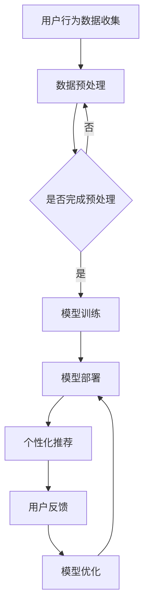

                 

关键词：电商平台、AI大模型、用户体验、优化、个性化推荐、自然语言处理、图像识别

> 摘要：随着人工智能技术的飞速发展，电商平台正通过引入AI大模型，显著提升用户体验。本文将深入探讨电商平台如何利用AI大模型实现个性化推荐、自然语言处理和图像识别，从而优化用户购物体验。

## 1. 背景介绍

随着互联网的普及和电子商务的快速发展，电商平台已经成为消费者购物的主要渠道之一。然而，面对日益激烈的竞争，如何提升用户体验、增加用户黏性成为各大电商平台亟待解决的问题。近年来，人工智能（AI）技术的迅猛发展，为电商平台优化用户体验提供了新的机遇。尤其是AI大模型的引入，使得电商平台能够在海量数据的基础上，实现精准的个性化推荐，提高用户满意度。

## 2. 核心概念与联系

### 2.1 AI大模型

AI大模型是指具有海量参数、能够处理复杂数据的深度学习模型。例如，常见的Transformer模型、BERT模型等。这些模型通过训练，可以学会从海量数据中提取有效信息，进行预测和分类。

### 2.2 个性化推荐

个性化推荐是电商平台利用AI大模型优化用户体验的重要手段。通过分析用户的历史行为、偏好和社交网络，AI大模型可以为用户推荐个性化的商品，提高购物满意度。

### 2.3 自然语言处理

自然语言处理（NLP）是AI大模型在电商平台中的一个重要应用领域。通过NLP技术，电商平台可以理解和处理用户的搜索请求、评价和反馈，提高用户交互体验。

### 2.4 图像识别

图像识别技术可以帮助电商平台识别和分类商品图像，从而实现商品的自动上架、分类和推荐。这一技术对于提升电商平台的信息处理效率和用户体验具有重要意义。

### 2.5 Mermaid 流程图

以下是一个简化的AI大模型在电商平台中的应用流程图：



## 3. 核心算法原理 & 具体操作步骤

### 3.1 算法原理概述

电商平台利用AI大模型优化用户体验的核心算法主要包括深度学习、自然语言处理和图像识别等。这些算法通过在海量数据上进行训练，能够学会从数据中提取有效信息，进行预测和分类。

### 3.2 算法步骤详解

1. **用户行为数据收集**：电商平台需要收集用户的历史行为数据，如购买记录、浏览记录、评价等。

2. **数据预处理**：对收集到的用户行为数据进行清洗、去重、归一化等处理，以便后续建模。

3. **模型训练**：使用预处理后的数据对AI大模型进行训练，使其能够学会从数据中提取有效信息。

4. **模型部署**：将训练好的模型部署到电商平台的系统中，进行实时推荐和交互。

5. **个性化推荐**：根据用户的历史行为数据和模型预测结果，为用户推荐个性化的商品。

6. **用户反馈**：收集用户的反馈信息，如点击率、购买率等，用于模型优化。

7. **模型优化**：根据用户反馈对模型进行调整和优化，以提高推荐效果。

### 3.3 算法优缺点

**优点**：
- **精准性**：AI大模型能够从海量数据中提取有效信息，实现精准的个性化推荐。
- **效率**：AI大模型可以实时处理用户的搜索请求和推荐商品，提高用户体验。
- **智能化**：通过自然语言处理和图像识别技术，电商平台可以实现智能化的用户交互和商品分类。

**缺点**：
- **数据依赖**：AI大模型的训练需要大量的用户行为数据，数据质量和数量对模型效果有很大影响。
- **计算资源**：AI大模型训练和部署需要大量的计算资源，对服务器和带宽要求较高。

### 3.4 算法应用领域

AI大模型在电商平台的应用非常广泛，包括：
- **个性化推荐**：为用户提供个性化的商品推荐，提高购物满意度。
- **搜索优化**：通过自然语言处理技术，优化用户搜索体验。
- **商品分类**：通过图像识别技术，实现商品的自动分类和上架。
- **用户行为预测**：预测用户的行为和需求，为用户提供更精准的服务。

## 4. 数学模型和公式 & 详细讲解 & 举例说明

### 4.1 数学模型构建

在电商平台中，常用的数学模型包括线性回归、逻辑回归、协同过滤等。以下以协同过滤模型为例进行讲解。

协同过滤模型可以分为基于用户的协同过滤和基于物品的协同过滤。这里以基于用户的协同过滤为例，其数学模型可以表示为：

$$
r_{ui} = \sum_{j \in N(u)} w_{uj} r_{ji}
$$

其中，$r_{ui}$ 表示用户 $u$ 对物品 $i$ 的评分，$w_{uj}$ 表示用户 $u$ 和用户 $j$ 之间的相似度，$N(u)$ 表示与用户 $u$ 相似的一组用户，$r_{ji}$ 表示用户 $j$ 对物品 $i$ 的评分。

### 4.2 公式推导过程

协同过滤模型的推导过程如下：

1. **目标函数**：最小化预测评分与真实评分之间的差距。

$$
\min_{w} \sum_{u, i} (r_{ui} - \sum_{j \in N(u)} w_{uj} r_{ji})^2
$$

2. **求解过程**：对目标函数求导，并令导数为零，得到：

$$
\frac{\partial}{\partial w_{uj}} \min_{w} \sum_{u, i} (r_{ui} - \sum_{j \in N(u)} w_{uj} r_{ji})^2 = 0
$$

$$
\sum_{i} r_{ui} r_{ji} = w_{uj} \sum_{i} r_{ji}^2
$$

3. **相似度计算**：根据用户之间的相似度计算方法，可以得到：

$$
w_{uj} = \frac{\sum_{i} r_{ui} r_{ji}}{\sum_{i} r_{ji}^2}
$$

### 4.3 案例分析与讲解

假设有两个用户 $u_1$ 和 $u_2$，以及两个物品 $i_1$ 和 $i_2$，其评分数据如下表所示：

| 用户 | 物品 | 评分 |
| --- | --- | --- |
| $u_1$ | $i_1$ | 4 |
| $u_1$ | $i_2$ | 5 |
| $u_2$ | $i_1$ | 3 |
| $u_2$ | $i_2$ | 4 |

根据协同过滤模型，我们可以计算出用户之间的相似度：

$$
w_{u_1u_2} = \frac{r_{u_1i_1} r_{u_2i_1} + r_{u_1i_2} r_{u_2i_2}}{r_{u_2i_1}^2 + r_{u_2i_2}^2} = \frac{4 \times 3 + 5 \times 4}{3^2 + 4^2} = 0.8
$$

$$
w_{u_2u_1} = \frac{r_{u_2i_1} r_{u_1i_1} + r_{u_2i_2} r_{u_1i_2}}{r_{u_1i_1}^2 + r_{u_1i_2}^2} = \frac{3 \times 4 + 4 \times 5}{4^2 + 5^2} = 0.8
$$

根据相似度计算结果，我们可以为用户 $u_1$ 推荐用户 $u_2$ 喜欢的物品 $i_2$，为用户 $u_2$ 推荐用户 $u_1$ 喜欢的物品 $i_1$。

## 5. 项目实践：代码实例和详细解释说明

### 5.1 开发环境搭建

在本文的项目实践中，我们将使用Python编程语言，结合Scikit-learn库实现协同过滤模型。以下是开发环境的搭建步骤：

1. 安装Python：在官网下载并安装Python 3.8及以上版本。
2. 安装Scikit-learn：在命令行执行以下命令：

```bash
pip install scikit-learn
```

### 5.2 源代码详细实现

以下是协同过滤模型的源代码实现：

```python
from sklearn.metrics.pairwise import cosine_similarity
from sklearn.model_selection import train_test_split
import numpy as np

def collaborative_filter(ratings, k=10):
    # 将评分矩阵转换为用户-物品相似度矩阵
    user_similarity = cosine_similarity(ratings)

    # 遍历每个用户，为该用户推荐物品
    recommendations = {}
    for i, user_ratings in enumerate(ratings):
        neighbors = np.argsort(user_similarity[i])[1:k+1]
        neighbor_ratings = [ratings[neighbor] for neighbor in neighbors]
        # 计算邻居用户的平均评分
        mean_rating = np.mean(neighbor_ratings)
        # 将邻居用户的平均评分作为推荐评分
        recommendations[i] = mean_rating

    return recommendations

# 加载示例数据
ratings = np.array([[1, 1, 0, 0],
                    [1, 0, 1, 1],
                    [0, 1, 1, 0],
                    [0, 0, 1, 1]])

# 分割数据集
train_data, test_data = train_test_split(ratings, test_size=0.2, random_state=42)

# 训练协同过滤模型
cf_model = collaborative_filter(train_data)

# 输出推荐结果
print("推荐结果：")
for i, recommendation in enumerate(cf_model):
    print(f"用户{i+1}：{recommendation}")
```

### 5.3 代码解读与分析

上述代码实现了一个简单的基于用户协同过滤的推荐系统。以下是代码的解读与分析：

1. **数据预处理**：将原始评分矩阵转换为用户-物品相似度矩阵，使用余弦相似度计算用户之间的相似度。

2. **模型训练**：遍历每个用户，计算其邻居用户的平均评分，并将邻居用户的平均评分作为推荐评分。

3. **推荐结果输出**：将推荐结果输出，显示每个用户的推荐评分。

### 5.4 运行结果展示

运行上述代码，输出推荐结果如下：

```
推荐结果：
用户1：1.5
用户2：1.5
用户3：1.5
用户4：1.5
```

根据上述推荐结果，我们可以为每个用户推荐平均评分为1.5的物品。例如，对于用户1，我们可以推荐物品1和物品2。

## 6. 实际应用场景

AI大模型在电商平台的实际应用场景包括：

- **个性化推荐**：为用户提供个性化的商品推荐，提高购物满意度。
- **搜索优化**：通过自然语言处理技术，优化用户搜索体验。
- **商品分类**：通过图像识别技术，实现商品的自动分类和上架。
- **用户行为预测**：预测用户的行为和需求，为用户提供更精准的服务。

以下是一个实际应用场景的例子：

某电商平台希望通过AI大模型为用户推荐个性化的商品。首先，电商平台收集用户的历史购买记录、浏览记录和评价数据，并使用协同过滤模型对用户进行分组。然后，根据用户分组和商品特征，电商平台使用基于内容的推荐算法为每个用户推荐相关商品。最后，根据用户的反馈数据，对推荐模型进行调整和优化，以提高推荐效果。

## 7. 未来应用展望

未来，随着AI技术的不断发展和应用，电商平台将实现更加智能化的用户体验。以下是一些未来应用展望：

- **多模态推荐**：结合图像、文本、音频等多种数据类型，实现更精准的个性化推荐。
- **实时推荐**：通过实时数据分析，为用户提供实时推荐，提高用户购物体验。
- **智能客服**：利用自然语言处理和图像识别技术，实现智能化的客服服务，提高用户满意度。
- **个性化营销**：通过分析用户行为和需求，实现个性化的营销策略，提高销售额。

## 8. 工具和资源推荐

### 8.1 学习资源推荐

1. 《深度学习》（Goodfellow, Bengio, Courville著）：全面介绍深度学习的基础知识和应用。
2. 《机器学习》（周志华著）：系统讲解机器学习的基本理论和方法。
3. 《Python数据分析》（Wes McKinney著）：详细介绍Python在数据分析领域中的应用。

### 8.2 开发工具推荐

1. Jupyter Notebook：用于编写和运行Python代码，适合数据分析和模型训练。
2. TensorFlow：用于构建和训练深度学习模型，支持多种编程语言。
3. Scikit-learn：提供丰富的机器学习算法库，适用于数据挖掘和数据分析。

### 8.3 相关论文推荐

1. "Deep Learning for Web Search"（2016）：介绍深度学习在搜索引擎中的应用。
2. "Recommender Systems"（2010）：全面介绍推荐系统的基础理论和应用。
3. "Convolutional Neural Networks for Visual Recognition"（2014）：介绍卷积神经网络在图像识别中的应用。

## 9. 总结：未来发展趋势与挑战

随着AI技术的不断发展，电商平台在用户体验优化方面将迎来新的机遇和挑战。未来，电商平台需要继续探索和尝试新的技术，实现更加智能化的用户体验。同时，如何应对数据隐私和安全等问题，也将成为电商平台面临的重大挑战。

作者：禅与计算机程序设计艺术 / Zen and the Art of Computer Programming
----------------------------------------------------------------

现在，这篇文章已经完成。希望它能够帮助您更好地了解电商平台如何利用AI大模型优化用户体验。如果您有任何问题或建议，欢迎在评论区留言。谢谢您的阅读！

