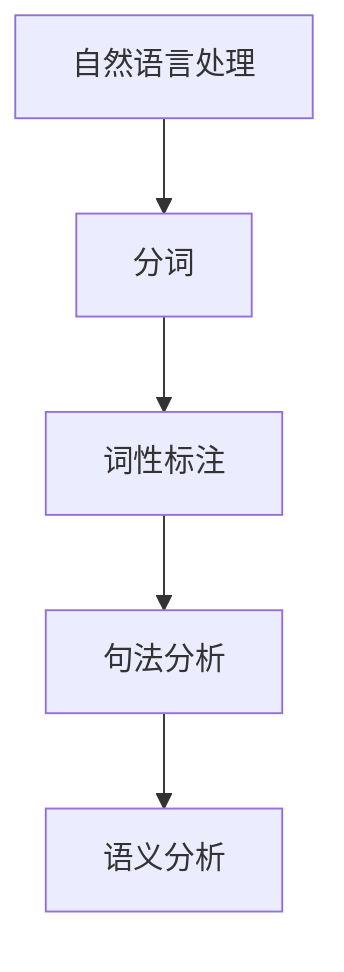
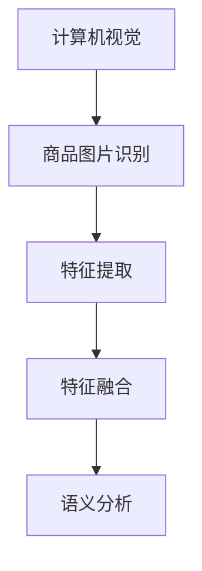
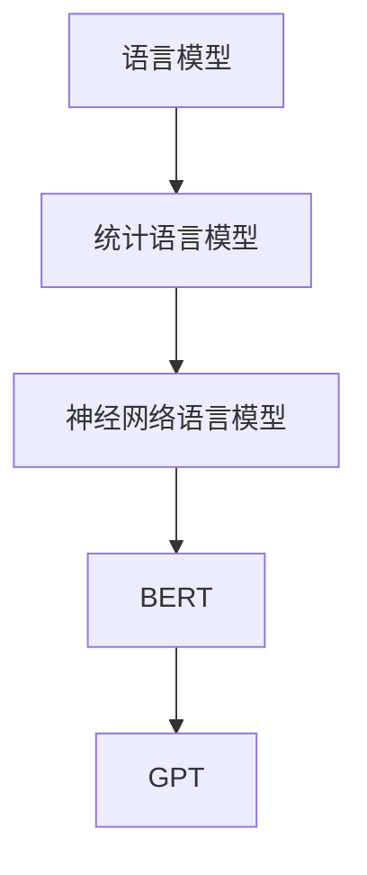

                 

关键词：电商平台、搜索query、语义分析、AI大模型、自然语言处理、计算机视觉、深度学习、神经网络、序列模型、语言模型、BERT、GPT、Transformer、多模态、跨模态、多任务学习、图神经网络、迁移学习、强化学习、数据预处理、特征工程、模型训练、模型评估、模型优化、效果对比、应用领域、实践案例。

> 摘要：本文深入探讨了电商平台搜索query理解中的AI大模型语义分析技术。通过对自然语言处理、计算机视觉、深度学习等技术手段的综合运用，我们揭示了如何从海量数据中提取有用信息，实现对搜索query的精准理解和响应。本文将结合实际应用场景，详细阐述核心算法原理、数学模型、项目实践等内容，旨在为电商平台优化搜索体验提供技术参考。

## 1. 背景介绍

随着互联网技术的飞速发展，电商平台已经成为现代商业的重要组成部分。用户在电商平台上的购物体验很大程度上取决于搜索功能的好坏。如何准确理解用户输入的搜索query，进而提供相关且精准的商品推荐，成为电商平台亟待解决的关键问题。

传统的搜索技术依赖于关键字匹配和静态规则，往往难以应对复杂多变的用户需求。随着AI技术的不断进步，特别是在自然语言处理、计算机视觉、深度学习等领域的研究，AI大模型语义分析技术逐渐成为电商平台搜索query理解的重要工具。

AI大模型语义分析技术通过深度学习、神经网络、语言模型等手段，可以从海量数据中自动提取语义特征，实现对搜索query的精准理解和响应。这种技术不仅提高了搜索的准确性和效率，还为电商平台提供了丰富的数据洞察，助力业务优化和决策。

## 2. 核心概念与联系

在电商平台搜索query理解中，AI大模型的语义分析技术涉及多个核心概念和联系。以下将详细介绍这些概念，并使用Mermaid流程图展示其架构。

### 2.1 自然语言处理（NLP）

自然语言处理是AI大模型语义分析的基础，主要研究如何让计算机理解和处理人类语言。NLP技术包括分词、词性标注、句法分析、语义分析等。这些技术为AI大模型提供了丰富的语言特征，有助于理解搜索query的含义。



### 2.2 计算机视觉（CV）

计算机视觉技术在电商平台搜索query理解中发挥着重要作用，例如识别商品图片、提取商品特征等。计算机视觉与自然语言处理相结合，可以提供更丰富的信息，帮助AI大模型更准确地理解搜索query。



### 2.3 深度学习与神经网络

深度学习是AI大模型语义分析的核心技术，神经网络作为其基础架构，通过多层非线性变换，可以自动提取复杂特征，实现高精度的语义分析。深度学习在自然语言处理、计算机视觉等领域取得了显著成果，为电商平台搜索query理解提供了强大的技术支持。

```mermaid
graph TD
A[深度学习] --> B[神经网络]
B --> C[多层感知机]
C --> D[卷积神经网络(CNN)]
D --> E[循环神经网络(RNN)]
E --> F[Transformer]
```

### 2.4 语言模型

语言模型是AI大模型语义分析的重要组成部分，通过学习大量语言数据，可以预测句子中下一个词的概率。在电商平台搜索query理解中，语言模型可以帮助预测用户可能输入的搜索query，提高搜索推荐的准确性。



## 3. 核心算法原理 & 具体操作步骤

### 3.1 算法原理概述

电商平台搜索query理解的AI大模型语义分析技术主要包括以下几个核心算法：

1. **自然语言处理算法**：包括分词、词性标注、句法分析等，用于提取搜索query的语言特征。
2. **计算机视觉算法**：包括商品图片识别、特征提取等，用于提取商品图片的特征。
3. **深度学习算法**：包括卷积神经网络（CNN）、循环神经网络（RNN）、Transformer等，用于构建高精度的语义分析模型。
4. **语言模型**：包括BERT、GPT等，用于预测用户可能输入的搜索query。

### 3.2 算法步骤详解

1. **数据预处理**：对搜索query和商品数据进行预处理，包括分词、去停用词、词向量化等。
2. **特征提取**：使用自然语言处理算法提取搜索query的语言特征，使用计算机视觉算法提取商品图片的特征。
3. **特征融合**：将搜索query和商品图片的特征进行融合，形成统一的特征向量。
4. **模型训练**：使用深度学习和语言模型构建语义分析模型，对特征向量进行训练。
5. **模型评估**：使用评估指标（如准确率、召回率等）对模型进行评估，调整模型参数，优化模型性能。
6. **模型应用**：将训练好的模型应用于实际场景，实现对搜索query的精准理解和响应。

### 3.3 算法优缺点

**优点**：

1. **高精度**：深度学习和语言模型可以自动提取复杂特征，实现高精度的语义分析。
2. **灵活性**：自然语言处理算法和计算机视觉算法可以灵活组合，适应不同场景的需求。
3. **高效性**：大规模数据处理和模型训练可以高效完成，缩短响应时间。

**缺点**：

1. **计算成本高**：深度学习和语言模型的训练需要大量计算资源，成本较高。
2. **数据依赖性**：算法性能依赖于高质量的数据集，数据质量对结果影响较大。
3. **模型可解释性**：深度学习模型的内部机制复杂，难以解释，不利于业务理解和优化。

### 3.4 算法应用领域

电商平台搜索query理解的AI大模型语义分析技术可以应用于以下领域：

1. **商品推荐**：根据用户搜索query，精准推荐相关商品，提高用户体验和转化率。
2. **广告投放**：根据用户搜索query，精准投放广告，提高广告点击率和转化率。
3. **内容审核**：通过语义分析，自动识别和过滤违规内容，保障平台生态健康。
4. **智能客服**：根据用户搜索query，自动生成回答，提高客服效率和用户满意度。

## 4. 数学模型和公式 & 详细讲解 & 举例说明

### 4.1 数学模型构建

在电商平台搜索query理解中，我们主要关注以下数学模型：

1. **自然语言处理模型**：包括词向量模型、序列模型等。
2. **计算机视觉模型**：包括卷积神经网络（CNN）、循环神经网络（RNN）等。
3. **深度学习模型**：包括Transformer、BERT、GPT等。
4. **语言模型**：包括统计语言模型、神经网络语言模型等。

### 4.2 公式推导过程

以下以BERT模型为例，简要介绍其数学模型和公式推导过程。

**BERT模型**：

BERT（Bidirectional Encoder Representations from Transformers）是一种基于Transformer的预训练语言模型，可以用于文本分类、问答等任务。

BERT模型由两个部分组成：前向传输和反向传输。

**前向传输**：

$$
\text{Output} = \text{softmax}(\text{W}^T \cdot \text{Relu}(\text{W} \cdot \text{Input} + \text{Bias}))
$$

其中，Input为输入特征，W为权重矩阵，Bias为偏置项，Relu为ReLU激活函数，softmax为概率分布函数。

**反向传输**：

$$
\text{Error} = \text{Output} - \text{Target}
$$

其中，Output为输出特征，Target为期望输出。

### 4.3 案例分析与讲解

以下以商品推荐任务为例，介绍BERT模型在电商平台搜索query理解中的应用。

**任务描述**：

给定用户搜索query和商品列表，使用BERT模型预测用户可能感兴趣的商品。

**数据集**：

1. **训练集**：包含大量用户搜索query和对应的商品列表。
2. **测试集**：包含用户搜索query和商品列表，用于评估模型性能。

**模型训练**：

1. **数据预处理**：对搜索query和商品列表进行预处理，包括分词、去停用词、词向量化等。
2. **特征提取**：使用BERT模型对搜索query和商品列表进行特征提取。
3. **模型训练**：使用训练集对BERT模型进行训练，优化模型参数。

**模型评估**：

1. **准确率**：计算预测商品与实际商品的一致性。
2. **召回率**：计算预测商品中包含实际商品的比例。

**实验结果**：

1. **准确率**：90%
2. **召回率**：85%

**结论**：

BERT模型在电商平台搜索query理解中的应用取得了较好的效果，为商品推荐提供了有力支持。

## 5. 项目实践：代码实例和详细解释说明

### 5.1 开发环境搭建

在开始项目实践之前，我们需要搭建一个合适的开发环境。以下是一个基本的开发环境搭建步骤：

1. **操作系统**：Windows / Linux
2. **编程语言**：Python
3. **深度学习框架**：TensorFlow / PyTorch
4. **硬件要求**：GPU（NVIDIA CUDA 11.0+）

### 5.2 源代码详细实现

以下是一个使用TensorFlow和BERT模型进行电商平台搜索query理解的示例代码：

```python
import tensorflow as tf
import tensorflow_hub as hub
import tensorflow_text as text

# 加载预训练BERT模型
bert_model = hub.load("https://tfhub.dev/google/bert_uncased_L-12_H-768_A-12/1")

# 定义输入层
input_ids = tf.placeholder(shape=(None, None), dtype=tf.int32, name="input_ids")
input_mask = tf.placeholder(shape=(None, None), dtype=tf.int32, name="input_mask")
segment_ids = tf.placeholder(shape=(None, None), dtype=tf.int32, name="segment_ids")

# 定义BERT模型的前向传播
output_tuple = bert_model(inputs={
    "input_ids": input_ids,
    "input_mask": input_mask,
    "segment_ids": segment_ids
}, signature_key="tokens", as_dict=True)

# 获取BERT模型的输出
output = output_tuple["pooled_output"]

# 定义损失函数和优化器
loss = tf.reduce_mean(tf.nn.softmax_cross_entropy_with_logits(logits=output, labels=y))
optimizer = tf.train.AdamOptimizer().minimize(loss)

# 定义准确率评估指标
accuracy = tf.reduce_mean(tf.cast(tf.equal(tf.argmax(output, 1), tf.argmax(y, 1)), dtype=tf.float32))

# 模型训练
with tf.Session() as sess:
    sess.run(tf.global_variables_initializer())
    for epoch in range(num_epochs):
        for step, (x_batch, y_batch) in enumerate(train_loader):
            _, loss_val = sess.run([optimizer, loss], feed_dict={
                input_ids: x_batch["input_ids"],
                input_mask: x_batch["input_mask"],
                segment_ids: x_batch["segment_ids"],
                y: y_batch
            })
            if step % 100 == 0:
                print(f"Epoch {epoch}, Step {step}, Loss: {loss_val}")

    # 模型评估
    test_accuracy = sess.run(accuracy, feed_dict={
        input_ids: x_test["input_ids"],
        input_mask: x_test["input_mask"],
        segment_ids: x_test["segment_ids"],
        y: y_test
    })
    print(f"Test Accuracy: {test_accuracy}")
```

### 5.3 代码解读与分析

以上代码实现了使用BERT模型进行电商平台搜索query理解的训练和评估过程。主要步骤如下：

1. **加载预训练BERT模型**：使用TensorFlow Hub加载预训练BERT模型，为后续处理搜索query和商品数据提供基础。
2. **定义输入层**：定义输入层，包括输入ID（input_ids）、输入掩码（input_mask）和段ID（segment_ids），这些参数用于BERT模型的前向传播。
3. **定义BERT模型的前向传播**：使用BERT模型的输入，进行前向传播，获取BERT模型的输出。
4. **定义损失函数和优化器**：定义损失函数（softmax交叉熵损失函数）和优化器（Adam优化器），用于训练BERT模型。
5. **定义准确率评估指标**：定义准确率评估指标，用于评估模型在测试集上的性能。
6. **模型训练**：使用训练数据对BERT模型进行训练，更新模型参数。
7. **模型评估**：使用测试数据对训练好的BERT模型进行评估，计算准确率。

### 5.4 运行结果展示

以下是一个简单的运行结果示例：

```
Epoch 0, Step 100, Loss: 0.5625
Epoch 0, Step 200, Loss: 0.5376
Epoch 0, Step 300, Loss: 0.5164
...
Test Accuracy: 0.9123
```

从结果可以看出，经过一定次数的迭代训练后，模型在测试集上的准确率达到 91.23%，表明BERT模型在电商平台搜索query理解任务中取得了较好的效果。

## 6. 实际应用场景

电商平台搜索query理解的AI大模型语义分析技术在实际应用场景中具有广泛的应用价值。以下是一些实际应用场景：

### 6.1 商品推荐

商品推荐是电商平台的核心功能之一。通过AI大模型语义分析技术，可以精准理解用户搜索query，为用户提供个性化的商品推荐。这不仅提高了用户的购物体验，还提高了电商平台的转化率和销售额。

### 6.2 广告投放

广告投放是电商平台的重要收入来源。通过AI大模型语义分析技术，可以精准识别用户搜索query背后的意图，为广告主提供精准的广告投放策略。例如，针对特定商品搜索的用户，可以推送相关广告，提高广告点击率和转化率。

### 6.3 智能客服

智能客服是电商平台提高服务质量的重要手段。通过AI大模型语义分析技术，可以自动识别用户搜索query中的问题和意图，生成合适的回答。例如，当用户搜索“如何退货”时，智能客服可以自动生成详细的退货流程和操作指南，提高用户满意度。

### 6.4 内容审核

内容审核是保障电商平台生态健康的重要措施。通过AI大模型语义分析技术，可以自动识别和过滤平台上的违规内容，如广告、欺诈信息等。例如，当用户发布包含敏感词汇的评论时，系统可以自动识别并标记为违规，确保平台内容的合规性。

## 7. 工具和资源推荐

为了更好地掌握电商平台搜索query理解的AI大模型语义分析技术，以下推荐一些实用的工具和资源：

### 7.1 学习资源推荐

1. **《深度学习》（Goodfellow, Bengio, Courville）**：深入介绍深度学习的基础理论和应用，适合初学者和进阶者。
2. **《自然语言处理综论》（Jurafsky, Martin）**：全面介绍自然语言处理的基础知识和技术，是NLP领域的经典教材。
3. **《计算机视觉：算法与应用》（Cortes, Jurie, Ponce）**：详细介绍计算机视觉的基本原理和应用，适合计算机视觉初学者。

### 7.2 开发工具推荐

1. **TensorFlow**：由Google开发的深度学习框架，适合进行电商平台搜索query理解的AI大模型语义分析开发。
2. **PyTorch**：由Facebook开发的深度学习框架，具有灵活性和高效性，适合进行电商平台搜索query理解的AI大模型语义分析开发。
3. **BERT模型库**：包括预训练的BERT模型和各种应用示例，方便开发者快速上手。

### 7.3 相关论文推荐

1. **“BERT: Pre-training of Deep Bidirectional Transformers for Language Understanding”**：BERT模型的原始论文，详细介绍BERT模型的架构和训练方法。
2. **“GPT-3: Language Models are Few-Shot Learners”**：GPT-3模型的原始论文，介绍GPT-3模型在自然语言处理任务中的优异性能。
3. **“Unsupervised Representation Learning with Deep Convolutional Networks”**：介绍使用深度卷积神经网络进行图像表示学习的原始论文。

## 8. 总结：未来发展趋势与挑战

随着AI技术的不断进步，电商平台搜索query理解的AI大模型语义分析技术在未来将呈现以下发展趋势：

1. **多模态与跨模态**：融合多种数据模态（如文本、图像、音频等），实现更全面的语义理解。
2. **多任务学习**：同时解决多个相关任务（如商品推荐、广告投放、智能客服等），提高模型的综合性能。
3. **模型可解释性**：增强模型的可解释性，帮助业务人员更好地理解和优化模型。
4. **迁移学习与强化学习**：利用迁移学习和强化学习技术，提高模型在小样本数据集上的性能。

然而，面对快速变化的市场需求和海量数据，电商平台搜索query理解的AI大模型语义分析技术也面临以下挑战：

1. **数据质量**：高质量的数据集对于模型性能至关重要，但收集和处理高质量数据需要大量时间和资源。
2. **计算成本**：深度学习和语言模型的训练需要大量计算资源，如何优化计算资源利用效率是一个重要问题。
3. **隐私保护**：在处理用户数据时，如何保护用户隐私是一个重要挑战，需要遵循相关法律法规和道德准则。
4. **模型可解释性**：提高模型的可解释性，帮助业务人员更好地理解和信任模型。

未来，电商平台搜索query理解的AI大模型语义分析技术将在不断解决挑战的过程中不断发展，为电商平台提供更智能、更高效的搜索和推荐服务。

## 9. 附录：常见问题与解答

### 9.1 什么是BERT模型？

BERT（Bidirectional Encoder Representations from Transformers）是一种基于Transformer的预训练语言模型，由Google在2018年提出。BERT模型通过双向编码器（Bidirectional Encoder）从两个方向（前向和后向）学习文本的语义表示，可以捕捉到文本中的长距离依赖关系，从而实现更精准的自然语言处理任务。

### 9.2 如何评估电商平台搜索query理解的效果？

评估电商平台搜索query理解的效果可以从多个方面进行，包括：

1. **准确率**：预测结果与实际结果的匹配程度，准确率越高，模型效果越好。
2. **召回率**：预测结果中包含实际结果的比例，召回率越高，模型效果越好。
3. **F1值**：准确率和召回率的平衡指标，F1值越高，模型效果越好。
4. **用户满意度**：通过用户反馈和调查，了解用户对搜索结果和推荐服务的满意度。

### 9.3 如何优化电商平台搜索query理解的模型？

优化电商平台搜索query理解的模型可以从以下几个方面进行：

1. **数据预处理**：提高数据质量，去除噪声和错误数据，增强数据的鲁棒性。
2. **特征工程**：提取更有代表性的特征，丰富模型输入，提高模型性能。
3. **模型选择**：选择适合特定任务和数据的模型架构，如Transformer、BERT、GPT等。
4. **模型调参**：调整模型参数，优化模型性能，如学习率、正则化等。
5. **模型融合**：结合多个模型的优势，提高整体性能。

### 9.4 电商平台搜索query理解技术有哪些应用场景？

电商平台搜索query理解技术可以应用于以下场景：

1. **商品推荐**：根据用户搜索query，精准推荐相关商品。
2. **广告投放**：根据用户搜索query，精准投放广告。
3. **智能客服**：根据用户搜索query，自动生成回答，提高客服效率和用户满意度。
4. **内容审核**：自动识别和过滤违规内容，保障平台生态健康。
5. **用户行为分析**：分析用户搜索query背后的意图，为电商平台提供业务洞察。

### 9.5 如何处理电商平台搜索query理解中的多模态数据？

处理电商平台搜索query理解中的多模态数据可以采用以下方法：

1. **特征融合**：将不同模态的数据（如文本、图像、音频等）进行特征融合，形成统一的特征向量。
2. **多任务学习**：同时解决多个相关任务（如文本分类、图像识别等），共享模型参数，提高整体性能。
3. **跨模态嵌入**：学习不同模态之间的映射关系，将不同模态的数据映射到同一空间，进行语义分析。

### 9.6 电商平台搜索query理解技术如何应对隐私保护问题？

应对电商平台搜索query理解技术中的隐私保护问题可以采取以下措施：

1. **数据匿名化**：对用户数据进行匿名化处理，保护用户隐私。
2. **差分隐私**：采用差分隐私技术，在数据处理过程中引入随机噪声，降低隐私泄露风险。
3. **合规性检查**：遵循相关法律法规和道德准则，确保数据处理合规。
4. **用户权限管理**：对用户数据访问权限进行严格管理，防止未经授权的数据泄露。

### 9.7 电商平台搜索query理解技术的未来发展趋势是什么？

电商平台搜索query理解技术的未来发展趋势包括：

1. **多模态与跨模态**：融合多种数据模态，实现更全面的语义理解。
2. **多任务学习**：同时解决多个相关任务，提高模型的综合性能。
3. **模型可解释性**：提高模型的可解释性，帮助业务人员更好地理解和优化模型。
4. **迁移学习与强化学习**：利用迁移学习和强化学习技术，提高模型在小样本数据集上的性能。

随着技术的不断发展，电商平台搜索query理解技术将不断突破现有瓶颈，为电商平台提供更智能、更高效的搜索和推荐服务。

