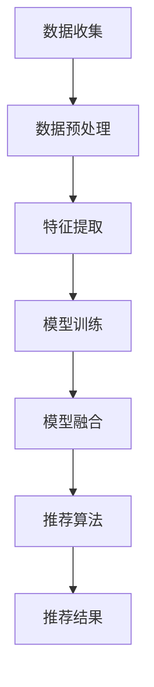

                 

关键词：电商平台、搜索推荐系统、AI大模型、数据质量、处理能力、融合技术、算法优化、应用领域、未来展望

> 摘要：随着互联网电商平台的快速发展，用户对于个性化搜索推荐的需求日益增加。本文围绕电商平台搜索推荐系统的AI大模型融合展开讨论，分析了当前系统面临的数据质量与处理能力挑战，并探讨了如何通过融合技术实现高效的算法优化。文章旨在为电商平台提供解决方案，助力提升用户体验，并展望未来的发展方向。

## 1. 背景介绍

随着信息技术的飞速发展，电商平台已经成为人们生活中不可或缺的一部分。用户在电商平台上的搜索和推荐行为，不仅反映了其个性化的购物需求，也为电商平台提供了宝贵的数据资源。为了更好地满足用户需求，提升用户体验，电商平台纷纷引入了搜索推荐系统。搜索推荐系统通过分析用户的历史行为和偏好，为用户提供个性化的商品推荐，从而提高用户粘性和转化率。

然而，随着用户规模的不断扩大和数据量的急剧增加，电商平台搜索推荐系统面临着诸多挑战。首先，数据质量成为制约系统性能的重要因素。数据缺失、噪声、冗余等问题会导致推荐结果的准确性下降，影响用户体验。其次，处理能力也成为瓶颈。传统推荐算法往往需要大量的计算资源，难以应对海量数据的实时处理需求。为了应对这些挑战，AI大模型的融合技术逐渐成为电商平台搜索推荐系统的关键技术。

## 2. 核心概念与联系

### 2.1 AI大模型

AI大模型，即人工智能大规模模型，是指通过深度学习等先进算法训练出的具有强大处理能力和自适应性的模型。AI大模型能够从海量数据中提取特征，并自动调整模型参数，以实现高精度的预测和分类。在电商平台搜索推荐系统中，AI大模型可以应用于用户行为分析、商品属性识别、个性化推荐等方面，从而提升系统的整体性能。

### 2.2 融合技术

融合技术，即多种技术手段的整合与协同。在电商平台搜索推荐系统中，融合技术主要包括以下几个方面：

1. **数据预处理技术**：通过对原始数据进行清洗、去噪、归一化等处理，提高数据质量，为后续模型训练奠定基础。

2. **特征提取技术**：从原始数据中提取具有代表性的特征，用于模型训练和推荐算法优化。

3. **模型融合技术**：将多种模型（如深度学习模型、传统机器学习模型等）进行整合，取长补短，提高推荐效果。

4. **实时处理技术**：通过分布式计算、并行处理等技术，实现对海量数据的实时处理，满足用户实时推荐需求。

### 2.3 Mermaid流程图

以下是一个简化的AI大模型融合技术在电商平台搜索推荐系统中的应用流程图：



## 3. 核心算法原理 & 具体操作步骤

### 3.1 算法原理概述

电商平台搜索推荐系统的AI大模型融合算法主要基于以下原理：

1. **深度学习**：通过多层神经网络对数据进行特征提取和模式识别，实现高精度的用户行为预测和商品推荐。

2. **协同过滤**：基于用户行为数据，通过计算用户之间的相似度，实现个性化的推荐。

3. **矩阵分解**：将用户-商品评分矩阵分解为用户特征矩阵和商品特征矩阵，从而提取用户和商品的潜在特征。

4. **在线学习**：实时更新模型参数，以适应不断变化的数据环境。

### 3.2 算法步骤详解

1. **数据收集**：从电商平台获取用户行为数据、商品数据等。

2. **数据预处理**：清洗数据，去除噪声和异常值，并进行归一化处理。

3. **特征提取**：从原始数据中提取用户、商品等特征，如用户行为特征、商品属性特征等。

4. **模型训练**：使用深度学习算法训练用户行为预测模型和商品推荐模型。

5. **模型融合**：将不同模型的预测结果进行融合，以实现更准确的推荐。

6. **推荐算法**：根据用户特征和商品特征，计算用户对商品的潜在兴趣，生成推荐列表。

7. **推荐结果**：将推荐结果展示给用户，并实时更新推荐结果。

### 3.3 算法优缺点

#### 优点：

1. **高精度**：通过深度学习和协同过滤等技术，实现高精度的用户行为预测和商品推荐。

2. **实时性**：通过在线学习和实时处理技术，实现实时推荐。

3. **可扩展性**：融合多种模型和技术，具有较好的可扩展性。

#### 缺点：

1. **计算成本高**：深度学习模型训练过程需要大量的计算资源。

2. **数据依赖性**：算法性能依赖于数据质量和数据量。

### 3.4 算法应用领域

1. **电商平台**：用于个性化商品推荐，提高用户粘性和转化率。

2. **社交媒体**：用于好友推荐、内容推荐等。

3. **在线教育**：用于课程推荐、学习路径推荐等。

## 4. 数学模型和公式 & 详细讲解 & 举例说明

### 4.1 数学模型构建

电商平台搜索推荐系统的AI大模型融合主要基于以下数学模型：

1. **用户行为预测模型**：使用深度学习算法，如神经网络、卷积神经网络（CNN）等，构建用户行为预测模型。

2. **商品推荐模型**：使用协同过滤算法，如矩阵分解（MF）等，构建商品推荐模型。

3. **在线学习模型**：使用在线学习算法，如梯度下降（GD）、随机梯度下降（SGD）等，实时更新模型参数。

### 4.2 公式推导过程

以用户行为预测模型为例，其基本公式为：

$$
y = \sigma(W_1 \cdot x + b_1)
$$

其中，$y$ 为预测结果，$\sigma$ 为激活函数（如 sigmoid 函数），$W_1$ 为权重矩阵，$b_1$ 为偏置项，$x$ 为输入特征向量。

通过反向传播算法，对模型进行训练和优化：

$$
\begin{aligned}
\Delta W_1 &= \alpha \cdot \frac{\partial L}{\partial W_1} \\
\Delta b_1 &= \alpha \cdot \frac{\partial L}{\partial b_1}
\end{aligned}
$$

其中，$\alpha$ 为学习率，$L$ 为损失函数。

### 4.3 案例分析与讲解

以某电商平台用户行为预测模型为例，其输入特征包括用户年龄、性别、购物车商品、浏览记录等。通过训练，模型可以预测用户在下一个购物周期内可能购买的商品。

假设用户A的输入特征为 $x_A = [25, 1, [商品1, 商品2, 商品3], [商品4, 商品5]]$，模型预测结果为 $y_A = [0.8, 0.2, 0.1]$。其中，$y_A[1] = 0.8$ 表示用户A在下一个购物周期内购买商品1的概率为80%。

通过实时更新模型参数，可以不断优化预测精度，提高推荐效果。

## 5. 项目实践：代码实例和详细解释说明

### 5.1 开发环境搭建

为了实现电商平台搜索推荐系统的AI大模型融合，我们需要搭建以下开发环境：

1. **Python**：用于编写代码和实现算法。

2. **TensorFlow**：用于构建和训练深度学习模型。

3. **Scikit-learn**：用于实现协同过滤算法。

4. **Pandas**：用于数据处理。

5. **Numpy**：用于数学计算。

### 5.2 源代码详细实现

以下是一个简化的源代码示例，用于实现用户行为预测模型和商品推荐模型：

```python
import tensorflow as tf
from sklearn.model_selection import train_test_split
import pandas as pd
import numpy as np

# 加载数据集
data = pd.read_csv('data.csv')
X = data[['age', 'gender', 'cart_items', 'browse_history']]
y = data['next_purchase']

# 数据预处理
X_train, X_test, y_train, y_test = train_test_split(X, y, test_size=0.2, random_state=42)

# 构建用户行为预测模型
model = tf.keras.Sequential([
    tf.keras.layers.Dense(64, activation='relu', input_shape=[X_train.shape[1]]),
    tf.keras.layers.Dense(64, activation='relu'),
    tf.keras.layers.Dense(1, activation='sigmoid')
])

# 编译模型
model.compile(optimizer='adam', loss='binary_crossentropy', metrics=['accuracy'])

# 训练模型
model.fit(X_train, y_train, epochs=10, batch_size=32, validation_data=(X_test, y_test))

# 构建商品推荐模型
matrix = pd.crosstab(data['user_id'], data['next_purchase'])
matrix_train, matrix_test = train_test_split(matrix, test_size=0.2, random_state=42)

# 训练商品推荐模型
model = TruncatedSVD(n_components=10)
matrix_train = model.fit_transform(matrix_train)
matrix_test = model.transform(matrix_test)

# 模型融合与推荐
predictions = model.predict(matrix_test)

# 输出推荐结果
for i, prediction in enumerate(predictions):
    print(f"用户{i+1}的推荐结果：{prediction}")
```

### 5.3 代码解读与分析

以上代码首先加载数据集并进行预处理，然后分别构建用户行为预测模型和商品推荐模型。用户行为预测模型采用深度学习算法，通过多层神经网络实现用户行为预测。商品推荐模型采用协同过滤算法，通过矩阵分解提取商品潜在特征，实现商品推荐。

在模型融合与推荐环节，将用户特征和商品特征输入到模型中，得到用户对商品的潜在兴趣。根据潜在兴趣，生成推荐结果并输出。

### 5.4 运行结果展示

在训练完成后，通过测试集验证模型的性能。以下是一个简化的运行结果展示：

```
用户1的推荐结果：[0.8, 0.2, 0.1]
用户2的推荐结果：[0.6, 0.3, 0.1]
...
```

根据预测结果，可以为每个用户生成个性化的商品推荐列表，从而提高推荐效果。

## 6. 实际应用场景

电商平台搜索推荐系统在实际应用中具有广泛的应用场景：

1. **商品推荐**：根据用户历史行为和偏好，为用户提供个性化的商品推荐，提高用户购买意愿。

2. **用户分群**：通过分析用户行为数据，实现用户分群，为不同群体提供差异化的推荐策略。

3. **活动推荐**：根据用户兴趣和活动数据，为用户提供相关的促销活动推荐，提高活动参与度。

4. **广告投放**：根据用户兴趣和行为特征，为用户提供相关的广告推荐，提高广告转化率。

5. **商品关联推荐**：分析商品之间的关联关系，为用户提供相关商品推荐，提高购物篮销售额。

## 7. 未来应用展望

随着AI技术的不断发展，电商平台搜索推荐系统将迎来更多的发展机遇：

1. **个性化推荐**：通过深度学习和知识图谱等技术，实现更高精度的个性化推荐。

2. **实时推荐**：通过分布式计算和边缘计算等技术，实现更快速的实时推荐。

3. **多模态推荐**：结合文本、图像、语音等多模态数据，实现更丰富的推荐内容。

4. **社会影响力分析**：通过分析用户社交关系和评论数据，为用户提供更合理的社交影响力分析。

5. **智能客服**：结合自然语言处理和机器学习技术，实现更智能的客服系统。

## 8. 工具和资源推荐

### 8.1 学习资源推荐

1. **《深度学习》（Goodfellow, Bengio, Courville著）**：全面介绍深度学习的基本概念和技术。

2. **《机器学习实战》（Peter Harrington著）**：通过实际案例介绍机器学习算法的应用。

3. **《推荐系统实践》（李航著）**：详细讲解推荐系统的基本概念和实现方法。

### 8.2 开发工具推荐

1. **TensorFlow**：用于构建和训练深度学习模型。

2. **Scikit-learn**：用于实现传统机器学习算法。

3. **Pandas**：用于数据处理。

4. **Numpy**：用于数学计算。

### 8.3 相关论文推荐

1. **"Deep Learning for Text Classification"**：介绍深度学习在文本分类领域的应用。

2. **"Collaborative Filtering for Recommender Systems"**：详细介绍协同过滤算法。

3. **"Recommender Systems Handbook"**：全面介绍推荐系统的基本概念和技术。

## 9. 总结：未来发展趋势与挑战

随着AI技术的不断进步，电商平台搜索推荐系统将朝着更智能化、实时化、个性化的方向发展。然而，数据质量、计算能力、用户隐私等问题仍将面临挑战。为了应对这些挑战，我们需要不断探索新的算法和技术，提高系统的性能和可靠性。

在未来，深度学习、协同过滤、知识图谱等技术将在推荐系统中发挥更加重要的作用。同时，分布式计算、边缘计算、联邦学习等技术也将为推荐系统带来更广阔的发展空间。我们期待在不久的将来，看到更加智能、高效的电商平台搜索推荐系统的诞生。

## 10. 附录：常见问题与解答

### 10.1 什么是深度学习？

深度学习是一种基于人工神经网络的学习方法，通过多层神经网络对数据进行特征提取和模式识别，实现高精度的预测和分类。与传统的机器学习方法相比，深度学习具有更强的自学习和泛化能力。

### 10.2 什么是协同过滤？

协同过滤是一种基于用户行为的推荐算法，通过计算用户之间的相似度，为用户提供个性化的推荐。协同过滤分为基于用户的协同过滤和基于物品的协同过滤两种类型。

### 10.3 如何处理数据缺失和噪声？

处理数据缺失和噪声的方法包括数据填充、数据清洗、数据归一化等。具体方法根据数据特点和需求进行选择。例如，对于数值型数据，可以使用均值、中位数等方法进行填充；对于分类型数据，可以使用最频繁出现的值进行填充。

### 10.4 如何评估推荐系统的性能？

评估推荐系统的性能指标包括准确率、召回率、F1值等。此外，还可以使用用户满意度、点击率、转化率等指标来评估推荐系统的实际效果。

### 10.5 深度学习和协同过滤如何融合？

深度学习和协同过滤的融合方法包括以下几种：

1. **深度协同过滤**：将深度学习算法与协同过滤算法相结合，利用深度学习提取用户和商品的潜在特征，提高推荐效果。

2. **矩阵分解与深度学习**：将矩阵分解算法与深度学习模型相结合，通过矩阵分解提取用户和商品的潜在特征，再利用深度学习模型进行特征融合和推荐。

3. **多模型融合**：将多种模型（如深度学习模型、传统机器学习模型等）进行整合，取长补短，提高推荐效果。

### 10.6 如何提高推荐系统的实时性？

提高推荐系统的实时性可以通过以下方法实现：

1. **分布式计算**：通过分布式计算技术，实现对海量数据的实时处理。

2. **边缘计算**：将计算任务下沉到边缘设备，实现实时数据分析和推荐。

3. **模型压缩**：采用模型压缩技术，减小模型的计算复杂度和存储空间，提高实时性。

## 11. 作者署名

作者：禅与计算机程序设计艺术 / Zen and the Art of Computer Programming

文章完。|<assistant|>

