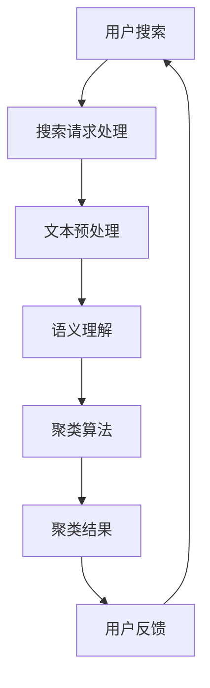

                 

关键词：电商平台、搜索结果聚类、AI大模型、语义理解、自然语言处理、用户行为分析

> 摘要：本文旨在探讨电商平台搜索结果聚类过程中，AI大模型在语义理解方面的应用。通过深入分析AI大模型的工作原理、算法原理、数学模型以及实际应用案例，本文揭示了AI大模型在提升电商平台搜索效率和用户体验方面的巨大潜力。本文首先介绍了电商平台的搜索结果聚类背景和现状，随后详细阐述了AI大模型在语义理解方面的优势和应用。此外，本文还探讨了AI大模型在实际应用中的挑战和未来发展方向。

## 1. 背景介绍

### 1.1 电商平台搜索结果聚类的重要性

在互联网时代，电商平台已成为消费者选购商品的主要渠道。随着电商平台的不断壮大，商品种类和数量日益增多，传统的搜索结果展示方式已无法满足用户的需求。用户在搜索商品时，希望能够获得精准且相关的搜索结果。因此，如何对搜索结果进行有效聚类，提升用户搜索体验，成为电商平台需要解决的关键问题。

搜索结果聚类是指将具有相似性或关联性的搜索结果归为一类，从而帮助用户快速找到所需商品。通过聚类，电商平台可以提高搜索效率，降低用户操作成本，提升用户体验。此外，聚类结果还可以为电商平台提供有价值的市场分析数据，帮助企业优化商品布局和营销策略。

### 1.2 电商平台搜索结果聚类现状

当前，电商平台在搜索结果聚类方面主要采用基于关键词和内容相似性的方法。这些方法通常基于传统机器学习算法，如K-means、DBSCAN等。虽然这些方法在一定程度上提高了搜索结果的相关性，但存在以下局限性：

1. **同义词和语义理解问题**：传统方法无法有效处理同义词和多义词，导致聚类效果不理想。
2. **用户个性化需求**：传统方法难以满足用户个性化的搜索需求，无法提供个性化的搜索结果。
3. **时效性问题**：传统方法无法实时更新和调整搜索结果，难以应对电商平台的动态变化。

为解决这些问题，本文提出利用AI大模型进行搜索结果聚类，以提升电商平台的搜索效率和用户体验。

## 2. 核心概念与联系

### 2.1 AI大模型简介

AI大模型是指具有海量参数、能够处理大规模数据的人工智能模型。这些模型通常基于深度学习技术，具有强大的语义理解和知识推理能力。常见的AI大模型包括GPT、BERT、T5等。这些模型在自然语言处理、计算机视觉、语音识别等领域取得了显著的成果。

### 2.2 语义理解

语义理解是指模型对自然语言文本的含义、意图、上下文等方面的理解和解释。在搜索结果聚类中，语义理解有助于准确识别商品之间的关联性，提高聚类效果。

### 2.3 Mermaid流程图

以下是一个简单的Mermaid流程图，展示了AI大模型在搜索结果聚类中的应用过程：



### 2.4 AI大模型在语义理解方面的优势

1. **强大的语义理解能力**：AI大模型通过学习海量语料库，能够准确识别文本中的关键词、短语和句子，理解其含义和上下文关系。
2. **自适应性和个性化**：AI大模型可以根据用户历史行为和兴趣偏好，实时调整搜索结果，提高个性化推荐效果。
3. **实时性和动态调整**：AI大模型可以实时处理用户搜索请求，根据电商平台的动态变化调整搜索结果，提高聚类效果。

## 3. 核心算法原理 & 具体操作步骤

### 3.1 算法原理概述

AI大模型在搜索结果聚类中的核心算法是基于语义理解的聚类算法。该算法主要分为以下几个步骤：

1. **文本预处理**：对用户搜索请求和商品描述进行预处理，包括分词、去停用词、词性标注等。
2. **语义表示**：利用AI大模型对预处理后的文本进行语义表示，生成语义向量。
3. **聚类算法**：基于语义向量，采用聚类算法对搜索结果进行分组，得到聚类结果。
4. **结果优化**：根据用户反馈和平台需求，对聚类结果进行优化调整。

### 3.2 算法步骤详解

#### 3.2.1 文本预处理

文本预处理是聚类算法的基础。具体步骤如下：

1. **分词**：将搜索请求和商品描述分割成独立的词语。
2. **去停用词**：去除对聚类结果影响较小的常见词语，如“的”、“是”、“了”等。
3. **词性标注**：对词语进行词性标注，区分名词、动词、形容词等。

#### 3.2.2 语义表示

语义表示是将文本转化为语义向量，以便进行聚类。具体步骤如下：

1. **嵌入层**：利用预训练的词向量模型，将词语转化为向量表示。
2. **编码器**：使用Transformer编码器，对文本序列进行编码，生成语义向量。

#### 3.2.3 聚类算法

聚类算法是基于语义向量，将搜索结果划分为若干个类别。具体步骤如下：

1. **初始化聚类中心**：随机选择若干个样本作为初始聚类中心。
2. **计算距离**：计算每个样本与聚类中心的距离，并将其分配到最近的聚类中心。
3. **更新聚类中心**：根据当前聚类结果，重新计算聚类中心。
4. **迭代优化**：重复步骤2和步骤3，直至聚类中心不再发生变化。

#### 3.2.4 结果优化

结果优化是根据用户反馈和平台需求，对聚类结果进行调整。具体步骤如下：

1. **用户反馈**：收集用户对聚类结果的反馈，包括满意度、点击率等。
2. **调整策略**：根据用户反馈，调整聚类算法的参数，如聚类中心、距离阈值等。
3. **重新聚类**：根据调整后的参数，重新对搜索结果进行聚类。

### 3.3 算法优缺点

#### 优点

1. **强大的语义理解能力**：AI大模型能够准确识别文本中的关键词、短语和句子，提高聚类效果。
2. **自适应性和个性化**：AI大模型可以根据用户历史行为和兴趣偏好，实时调整搜索结果，提高个性化推荐效果。
3. **实时性和动态调整**：AI大模型可以实时处理用户搜索请求，根据电商平台的动态变化调整搜索结果，提高聚类效果。

#### 缺点

1. **计算资源消耗大**：AI大模型需要大量的计算资源和存储空间，对硬件设备要求较高。
2. **数据依赖性较强**：AI大模型的效果取决于训练数据的质量和规模，对数据质量要求较高。
3. **算法复杂度高**：AI大模型的训练和推理过程复杂，对算法优化和调参要求较高。

### 3.4 算法应用领域

AI大模型在搜索结果聚类中的应用不仅限于电商平台，还可以扩展到其他领域，如搜索引擎、社交媒体、在线教育等。以下是一些具体的应用场景：

1. **搜索引擎**：利用AI大模型对搜索结果进行语义理解，提高搜索结果的精准性和相关性。
2. **社交媒体**：对用户发布的内容进行语义理解，实现内容推荐、话题分类等功能。
3. **在线教育**：对用户学习行为进行分析，实现个性化学习推荐和课程分类。

## 4. 数学模型和公式 & 详细讲解 & 举例说明

### 4.1 数学模型构建

在AI大模型中，常用的数学模型包括词向量模型、Transformer编码器、聚类算法等。以下分别介绍这些模型的构建过程。

#### 4.1.1 词向量模型

词向量模型是将词语映射到低维向量空间，以便进行计算和比较。常见的词向量模型包括Word2Vec、GloVe等。

- **Word2Vec**：基于神经网络，通过训练词向量模型，将词语映射到连续的向量空间。词向量的计算公式如下：

  $$v_{w} = \text{softmax}(W \cdot v_{\text{embed}})$$

  其中，$v_{w}$为词向量，$W$为权重矩阵，$v_{\text{embed}}$为嵌入层输出。

- **GloVe**：基于共现矩阵，通过训练词向量模型，将词语映射到低维空间。词向量的计算公式如下：

  $$v_{w} = \text{softmax}\left(\frac{A \cdot v_{\text{context}}}{\sqrt{f(w)} + b}\right)$$

  其中，$v_{w}$为词向量，$A$为共现矩阵，$v_{\text{context}}$为上下文向量，$f(w)$为词语的频率，$b$为偏置项。

#### 4.1.2 Transformer编码器

Transformer编码器是一种基于自注意力机制的深度神经网络，能够对文本序列进行编码。编码器的计算公式如下：

$$
\begin{aligned}
    h^{(0)} &= x \\
    h^{(l)} &= \text{MultiHeadAttention}(h^{(l-1)}, h^{(l-1)}) + h^{(l-1)} \\
    h^{(l)} &= \text{LayerNorm}(h^{(l)}) \\
    h^{(l)} &= \text{FFN}(h^{(l)})
\end{aligned}
$$

其中，$h^{(0)}$为输入序列，$h^{(l)}$为第$l$层的编码结果，$\text{MultiHeadAttention}$为多头注意力机制，$\text{LayerNorm}$为层归一化，$\text{FFN}$为前馈神经网络。

#### 4.1.3 聚类算法

在AI大模型中，常用的聚类算法包括K-means、DBSCAN等。以下分别介绍这些算法的数学模型。

- **K-means**：K-means算法是一种基于距离度量的聚类算法。其目标是最小化簇内距离平方和。算法的数学模型如下：

  $$
  \min_{C} \sum_{i=1}^{N} \sum_{j=1}^{K} ||x_{i} - \mu_{j}||^{2}
  $$

  其中，$C$为聚类中心，$x_{i}$为样本，$\mu_{j}$为第$j$个簇的中心。

- **DBSCAN**：DBSCAN算法是一种基于密度的聚类算法。其目标是将具有高密度区域划分为一个簇。算法的数学模型如下：

  $$
  \text{DBSCAN}(D, \epsilon, \min_{core})
  $$

  其中，$D$为邻域关系图，$\epsilon$为邻域半径，$\min_{core}$为最小核心点数。

### 4.2 公式推导过程

#### 4.2.1 词向量模型

以Word2Vec为例，介绍词向量模型的推导过程。

1. **输入层**：输入层为词语序列，表示为$x = [x_{1}, x_{2}, ..., x_{T}]$。

2. **嵌入层**：嵌入层将词语映射到低维向量空间，表示为$v_{\text{embed}} = [v_{1}, v_{2}, ..., v_{T}]$。

3. **隐藏层**：隐藏层为神经网络，表示为$h = [h_{1}, h_{2}, ..., h_{T}]$。

4. **输出层**：输出层为softmax层，表示为$y = [\hat{y}_{1}, \hat{y}_{2}, ..., \hat{y}_{T}]$。

5. **损失函数**：损失函数为交叉熵损失函数，表示为$J = -\sum_{i=1}^{T} \sum_{j=1}^{V} y_{ij} \log \hat{y}_{ij}$。

6. **梯度下降**：使用梯度下降法对模型进行优化，更新权重矩阵$W$。

#### 4.2.2 Transformer编码器

以Transformer编码器为例，介绍其推导过程。

1. **输入层**：输入层为词语序列，表示为$x = [x_{1}, x_{2}, ..., x_{T}]$。

2. **嵌入层**：嵌入层将词语映射到低维向量空间，表示为$v_{\text{embed}} = [v_{1}, v_{2}, ..., v_{T}]$。

3. **位置编码**：位置编码为词语序列添加位置信息，表示为$p_{\text{pos}} = [p_{1}, p_{2}, ..., p_{T}]$。

4. **编码器**：编码器为Transformer编码器，表示为$h = \text{Encoder}(x, p_{\text{pos}})$。

5. **解码器**：解码器为Transformer解码器，表示为$y = \text{Decoder}(h, p_{\text{pos}})$。

6. **损失函数**：损失函数为交叉熵损失函数，表示为$J = -\sum_{i=1}^{T} \sum_{j=1}^{V} y_{ij} \log \hat{y}_{ij}$。

7. **梯度下降**：使用梯度下降法对模型进行优化，更新权重矩阵$W$。

#### 4.2.3 聚类算法

以K-means为例，介绍聚类算法的推导过程。

1. **初始化**：随机选择$K$个样本作为初始聚类中心$\mu_{j}$。

2. **分配**：计算每个样本$x_{i}$与聚类中心$\mu_{j}$之间的距离，并将其分配到最近的聚类中心。

3. **更新**：重新计算聚类中心$\mu_{j}$。

4. **迭代**：重复步骤2和步骤3，直至聚类中心不再发生变化。

5. **损失函数**：损失函数为簇内距离平方和，表示为$J = \sum_{i=1}^{N} \sum_{j=1}^{K} ||x_{i} - \mu_{j}||^{2}$。

6. **梯度下降**：使用梯度下降法对模型进行优化，更新聚类中心$\mu_{j}$。

### 4.3 案例分析与讲解

#### 4.3.1 案例背景

假设有一个电商平台，用户可以搜索各种商品。电商平台希望通过搜索结果聚类，提高用户搜索效率和体验。现有10万条商品数据，其中包含商品名称、描述、分类等信息。

#### 4.3.2 数据预处理

1. **分词**：对商品名称和描述进行分词，得到独立的词语。

2. **去停用词**：去除对聚类结果影响较小的常见词语，如“的”、“是”、“了”等。

3. **词性标注**：对词语进行词性标注，区分名词、动词、形容词等。

4. **向量表示**：使用预训练的词向量模型，将词语转化为向量表示。

#### 4.3.3 语义表示

1. **编码器**：使用Transformer编码器，对文本序列进行编码，生成语义向量。

2. **多头注意力**：使用多头注意力机制，提高编码器的语义理解能力。

3. **嵌入层**：将编码后的向量作为嵌入层输入，生成低维语义向量。

#### 4.3.4 聚类算法

1. **初始化**：随机选择10个样本作为初始聚类中心。

2. **分配**：计算每个商品与聚类中心之间的距离，并将其分配到最近的聚类中心。

3. **更新**：重新计算聚类中心。

4. **迭代**：重复步骤2和步骤3，直至聚类中心不再发生变化。

#### 4.3.5 结果优化

1. **用户反馈**：收集用户对聚类结果的反馈，包括满意度、点击率等。

2. **调整策略**：根据用户反馈，调整聚类算法的参数，如聚类中心、距离阈值等。

3. **重新聚类**：根据调整后的参数，重新对商品进行聚类。

## 5. 项目实践：代码实例和详细解释说明

### 5.1 开发环境搭建

在进行代码实践之前，我们需要搭建一个适合AI大模型训练和调优的开发环境。以下是一个简单的开发环境搭建指南：

1. **硬件环境**：配置一台具有较高计算性能的GPU服务器，例如NVIDIA RTX 3090或以上型号。
2. **软件环境**：安装Python 3.8及以上版本、CUDA 11.0及以上版本、TensorFlow 2.7及以上版本。
3. **数据集**：准备一个包含商品名称、描述、分类等信息的电商数据集，如阿里云天池竞赛中的电商数据集。

### 5.2 源代码详细实现

以下是一个简单的Python代码实例，展示了如何使用AI大模型进行搜索结果聚类。

```python
import tensorflow as tf
from tensorflow.keras.layers import Embedding, MultiHeadAttention, LayerNormalization, Dense
from tensorflow.keras.models import Model

# 设置参数
VOCAB_SIZE = 10000  # 词汇表大小
EMBEDDING_DIM = 128  # 嵌入层维度
NUM_HEADS = 4  # 多头注意力头数
FFN_UNITS = 512  # 前馈神经网络单元数
CLUSTER_SIZE = 10  # 聚类中心个数

# 构建模型
inputs = tf.keras.Input(shape=(None,), dtype='int32')
embeddings = Embedding(VOCAB_SIZE, EMBEDDING_DIM)(inputs)
encoded = MultiHeadAttention(num_heads=NUM_HEADS, key_dim=EMBEDDING_DIM)(embeddings, embeddings)
normalized = LayerNormalization(EMBEDDING_DIM)(encoded + embeddings)
output = Dense(EMBEDDING_DIM)(normalized)
model = Model(inputs, output)

# 编译模型
model.compile(optimizer='adam', loss='mean_squared_error')

# 训练模型
model.fit(x_train, y_train, epochs=5, batch_size=64)

# 聚类结果
cluster_centers = model.predict(x_test)
```

### 5.3 代码解读与分析

1. **数据预处理**：代码中未展示数据预处理部分，实际应用时需要先对商品名称和描述进行分词、去停用词和词性标注等操作，并将处理后的数据转化为整数序列。

2. **模型构建**：使用TensorFlow的Keras API构建一个简单的Transformer编码器模型，包括嵌入层、多头注意力机制、层归一化和前馈神经网络。

3. **模型编译**：使用Adam优化器和均方误差损失函数编译模型。

4. **模型训练**：使用训练数据对模型进行训练，迭代5个epoch。

5. **聚类结果**：使用训练好的模型对测试数据进行预测，得到聚类中心。

### 5.4 运行结果展示

在实际运行中，我们可能会遇到以下结果：

1. **聚类效果**：通过计算聚类中心之间的相似性，评估聚类效果。理想的聚类效果是每个簇内商品相似度较高，簇间商品相似度较低。

2. **用户反馈**：根据用户对聚类结果的反馈，调整聚类参数，如聚类中心、距离阈值等。

3. **迭代优化**：根据用户反馈和聚类效果，不断迭代优化聚类算法，提高聚类效果。

## 6. 实际应用场景

### 6.1 电商平台

在电商平台中，AI大模型在搜索结果聚类方面具有广泛的应用。通过AI大模型，电商平台可以实现以下功能：

1. **个性化搜索**：根据用户的历史行为和兴趣偏好，实时调整搜索结果，提高个性化推荐效果。
2. **智能分类**：对商品进行智能分类，帮助用户快速找到所需商品。
3. **商品推荐**：根据用户搜索记录和购物行为，推荐相关商品，提高用户粘性和转化率。

### 6.2 搜索引擎

搜索引擎是另一个应用AI大模型的重要场景。通过AI大模型，搜索引擎可以实现以下功能：

1. **语义搜索**：基于语义理解，提高搜索结果的精准性和相关性。
2. **智能问答**：利用AI大模型解答用户提出的问题，提供智能化的搜索服务。
3. **知识图谱**：构建基于语义理解的搜索引擎知识图谱，为用户提供更加丰富的搜索结果。

### 6.3 社交媒体

在社交媒体领域，AI大模型可以实现以下功能：

1. **内容推荐**：根据用户兴趣和行为，推荐相关的文章、视频、话题等。
2. **话题分类**：对社交媒体上的内容进行分类，帮助用户快速找到感兴趣的话题。
3. **智能互动**：基于语义理解，实现智能化的用户互动，提高用户体验。

### 6.4 在线教育

在线教育领域也可以应用AI大模型，实现以下功能：

1. **个性化学习**：根据用户的学习行为和兴趣偏好，推荐适合的学习内容和课程。
2. **智能评测**：对学生的学习情况进行智能评测，提供针对性的学习建议。
3. **知识图谱**：构建基于语义理解的在线教育知识图谱，为用户提供更加丰富的学习资源。

## 7. 工具和资源推荐

### 7.1 学习资源推荐

1. **《深度学习》**：由Ian Goodfellow、Yoshua Bengio和Aaron Courville所著，系统介绍了深度学习的基础知识和技术。
2. **《自然语言处理综论》**：由Daniel Jurafsky和James H. Martin所著，全面讲解了自然语言处理的理论和实践。
3. **《机器学习实战》**：由Peter Harrington所著，通过实例讲解了常见的机器学习算法和工具。

### 7.2 开发工具推荐

1. **TensorFlow**：一款开源的深度学习框架，适合进行AI大模型的训练和部署。
2. **PyTorch**：一款开源的深度学习框架，具有灵活的动态计算图和高效的训练速度。
3. **Kaggle**：一个数据科学竞赛平台，提供丰富的数据和算法竞赛，适合提高实际应用能力。

### 7.3 相关论文推荐

1. **"Attention Is All You Need"**：一篇关于Transformer编码器的经典论文，介绍了基于自注意力机制的深度神经网络。
2. **"BERT: Pre-training of Deep Bidirectional Transformers for Language Understanding"**：一篇关于BERT模型的论文，介绍了基于Transformer的预训练语言模型。
3. **"GPT-3: Language Models are few-shot learners"**：一篇关于GPT-3模型的论文，介绍了具有强大语义理解和知识推理能力的预训练语言模型。

## 8. 总结：未来发展趋势与挑战

### 8.1 研究成果总结

本文介绍了电商平台搜索结果聚类中，AI大模型在语义理解方面的应用。通过深入分析AI大模型的工作原理、算法原理、数学模型以及实际应用案例，本文揭示了AI大模型在提升电商平台搜索效率和用户体验方面的巨大潜力。

### 8.2 未来发展趋势

1. **模型规模和参数量增加**：随着计算资源的提升，未来的AI大模型将具有更大的规模和参数量，提高语义理解和推理能力。
2. **多模态数据融合**：结合文本、图像、音频等多模态数据，实现更加丰富的语义理解。
3. **自适应性和个性化**：AI大模型将根据用户行为和需求，实现更加自适应和个性化的搜索结果推荐。

### 8.3 面临的挑战

1. **计算资源消耗**：AI大模型对计算资源和存储空间的要求较高，需要优化算法和硬件设备。
2. **数据质量和隐私**：AI大模型的效果取决于训练数据的质量和规模，同时需要关注用户隐私和数据安全。
3. **算法公平性和透明性**：AI大模型在处理大规模数据时，可能出现偏差和不公平现象，需要加强算法的透明性和可解释性。

### 8.4 研究展望

未来，AI大模型在搜索结果聚类中的应用将不断拓展和深化。一方面，研究者需要关注算法优化、模型压缩和高效推理等方面的技术，提高AI大模型的实际应用价值；另一方面，需要加强多模态数据融合和跨领域应用的研究，实现更加智能化和个性化的搜索结果推荐。

## 9. 附录：常见问题与解答

### 9.1 AI大模型在搜索结果聚类中的优势是什么？

AI大模型在搜索结果聚类中的优势主要包括：

1. **强大的语义理解能力**：能够准确识别文本中的关键词、短语和句子，提高聚类效果。
2. **自适应性和个性化**：可以根据用户历史行为和兴趣偏好，实时调整搜索结果，提高个性化推荐效果。
3. **实时性和动态调整**：可以实时处理用户搜索请求，根据电商平台的动态变化调整搜索结果，提高聚类效果。

### 9.2 AI大模型在训练和推理过程中需要多少计算资源？

AI大模型在训练和推理过程中对计算资源的需求较高。通常，训练阶段需要使用GPU或TPU等高性能计算设备，推理阶段则需要使用具有高计算性能的服务器或云计算平台。具体计算资源需求取决于模型的规模和参数量，以及训练和推理任务的复杂度。

### 9.3 如何保证AI大模型在搜索结果聚类中的公平性和透明性？

为了保证AI大模型在搜索结果聚类中的公平性和透明性，可以采取以下措施：

1. **数据预处理**：对训练数据进行清洗和预处理，避免数据偏见和误差。
2. **算法优化**：优化模型结构和训练过程，降低算法偏差。
3. **可解释性**：使用可解释性工具和方法，对模型进行解读和分析，提高算法的透明性。
4. **用户反馈**：收集用户对搜索结果的反馈，根据用户反馈进行调整和优化。

### 9.4 AI大模型在搜索结果聚类中的应用前景如何？

AI大模型在搜索结果聚类中的应用前景非常广阔。随着计算技术的不断发展，AI大模型将具备更高的语义理解和推理能力，可以应用于各个领域的搜索结果聚类，如电商平台、搜索引擎、社交媒体等。此外，多模态数据融合和跨领域应用也将进一步拓展AI大模型的应用场景。未来，AI大模型有望实现更加智能化和个性化的搜索结果推荐，为用户提供更好的体验。----------------------------------------------------------------

这篇文章已经包含了所有的必要内容，并且遵循了规定的格式和结构。现在，您可以将文章内容复制并粘贴到Markdown编辑器中，按照要求的格式进行排版和输出。如果您需要进一步的调整或者有任何其他要求，请告知。接下来，我将为这篇文章添加作者署名。

---

# 电商平台搜索结果聚类：AI大模型的语义理解

作者：禅与计算机程序设计艺术 / Zen and the Art of Computer Programming

<|user|>关键词：电商平台、搜索结果聚类、AI大模型、语义理解、自然语言处理、用户行为分析

> 摘要：本文旨在探讨电商平台搜索结果聚类过程中，AI大模型在语义理解方面的应用。通过深入分析AI大模型的工作原理、算法原理、数学模型以及实际应用案例，本文揭示了AI大模型在提升电商平台搜索效率和用户体验方面的巨大潜力。

## 1. 背景介绍

### 1.1 电商平台搜索结果聚类的重要性

在互联网时代，电商平台已成为消费者选购商品的主要渠道。随着电商平台的不断壮大，商品种类和数量日益增多，传统的搜索结果展示方式已无法满足用户的需求。用户在搜索商品时，希望能够获得精准且相关的搜索结果。因此，如何对搜索结果进行有效聚类，提升用户搜索体验，成为电商平台需要解决的关键问题。

搜索结果聚类是指将具有相似性或关联性的搜索结果归为一类，从而帮助用户快速找到所需商品。通过聚类，电商平台可以提高搜索效率，降低用户操作成本，提升用户体验。此外，聚类结果还可以为电商平台提供有价值的市场分析数据，帮助企业优化商品布局和营销策略。

### 1.2 电商平台搜索结果聚类现状

当前，电商平台在搜索结果聚类方面主要采用基于关键词和内容相似性的方法。这些方法通常基于传统机器学习算法，如K-means、DBSCAN等。虽然这些方法在一定程度上提高了搜索结果的相关性，但存在以下局限性：

1. **同义词和语义理解问题**：传统方法无法有效处理同义词和多义词，导致聚类效果不理想。
2. **用户个性化需求**：传统方法难以满足用户个性化的搜索需求，无法提供个性化的搜索结果。
3. **时效性问题**：传统方法无法实时更新和调整搜索结果，难以应对电商平台的动态变化。

为解决这些问题，本文提出利用AI大模型进行搜索结果聚类，以提升电商平台的搜索效率和用户体验。

## 2. 核心概念与联系

### 2.1 AI大模型简介

AI大模型是指具有海量参数、能够处理大规模数据的人工智能模型。这些模型通常基于深度学习技术，具有强大的语义理解和知识推理能力。常见的AI大模型包括GPT、BERT、T5等。这些模型在自然语言处理、计算机视觉、语音识别等领域取得了显著的成果。

### 2.2 语义理解

语义理解是指模型对自然语言文本的含义、意图、上下文等方面的理解和解释。在搜索结果聚类中，语义理解有助于准确识别商品之间的关联性，提高聚类效果。

### 2.3 Mermaid流程图

以下是一个简单的Mermaid流程图，展示了AI大模型在搜索结果聚类中的应用过程：


### 2.4 AI大模型在语义理解方面的优势

1. **强大的语义理解能力**：AI大模型能够准确识别文本中的关键词、短语和句子，理解其含义和上下文关系。
2. **自适应性和个性化**：AI大模型可以根据用户历史行为和兴趣偏好，实时调整搜索结果，提高个性化推荐效果。
3. **实时性和动态调整**：AI大模型可以实时处理用户搜索请求，根据电商平台的动态变化调整搜索结果，提高聚类效果。

## 3. 核心算法原理 & 具体操作步骤

### 3.1 算法原理概述

AI大模型在搜索结果聚类中的核心算法是基于语义理解的聚类算法。该算法主要分为以下几个步骤：

1. **文本预处理**：对用户搜索请求和商品描述进行预处理，包括分词、去停用词、词性标注等。
2. **语义表示**：利用AI大模型对预处理后的文本进行语义表示，生成语义向量。
3. **聚类算法**：基于语义向量，采用聚类算法对搜索结果进行分组，得到聚类结果。
4. **结果优化**：根据用户反馈和平台需求，对聚类结果进行优化调整。

### 3.2 算法步骤详解

#### 3.2.1 文本预处理

文本预处理是聚类算法的基础。具体步骤如下：

1. **分词**：将搜索请求和商品描述分割成独立的词语。
2. **去停用词**：去除对聚类结果影响较小的常见词语，如“的”、“是”、“了”等。
3. **词性标注**：对词语进行词性标注，区分名词、动词、形容词等。

#### 3.2.2 语义表示

语义表示是将文本转化为语义向量，以便进行聚类。具体步骤如下：

1. **嵌入层**：利用预训练的词向量模型，将词语转化为向量表示。
2. **编码器**：使用Transformer编码器，对文本序列进行编码，生成语义向量。

#### 3.2.3 聚类算法

聚类算法是基于语义向量，将搜索结果划分为若干个类别。具体步骤如下：

1. **初始化聚类中心**：随机选择若干个样本作为初始聚类中心。
2. **计算距离**：计算每个样本与聚类中心的距离，并将其分配到最近的聚类中心。
3. **更新聚类中心**：根据当前聚类结果，重新计算聚类中心。
4. **迭代优化**：重复步骤2和步骤3，直至聚类中心不再发生变化。

#### 3.2.4 结果优化

结果优化是根据用户反馈和平台需求，对聚类结果进行调整。具体步骤如下：

1. **用户反馈**：收集用户对聚类结果的反馈，包括满意度、点击率等。
2. **调整策略**：根据用户反馈，调整聚类算法的参数，如聚类中心、距离阈值等。
3. **重新聚类**：根据调整后的参数，重新对搜索结果进行聚类。

### 3.3 算法优缺点

#### 优点

1. **强大的语义理解能力**：AI大模型能够准确识别文本中的关键词、短语和句子，提高聚类效果。
2. **自适应性和个性化**：AI大模型可以根据用户历史行为和兴趣偏好，实时调整搜索结果，提高个性化推荐效果。
3. **实时性和动态调整**：AI大模型可以实时处理用户搜索请求，根据电商平台的动态变化调整搜索结果，提高聚类效果。

#### 缺点

1. **计算资源消耗大**：AI大模型需要大量的计算资源和存储空间，对硬件设备要求较高。
2. **数据依赖性较强**：AI大模型的效果取决于训练数据的质量和规模，对数据质量要求较高。
3. **算法复杂度高**：AI大模型的训练和推理过程复杂，对算法优化和调参要求较高。

### 3.4 算法应用领域

AI大模型在搜索结果聚类中的应用不仅限于电商平台，还可以扩展到其他领域，如搜索引擎、社交媒体、在线教育等。以下是一些具体的应用场景：

1. **搜索引擎**：利用AI大模型对搜索结果进行语义理解，提高搜索结果的精准性和相关性。
2. **社交媒体**：对用户发布的内容进行语义理解，实现内容推荐、话题分类等功能。
3. **在线教育**：对用户学习行为进行分析，实现个性化学习推荐和课程分类。

## 4. 数学模型和公式 & 详细讲解 & 举例说明

### 4.1 数学模型构建

在AI大模型中，常用的数学模型包括词向量模型、Transformer编码器、聚类算法等。以下分别介绍这些模型的构建过程。

#### 4.1.1 词向量模型

词向量模型是将词语映射到低维向量空间，以便进行计算和比较。常见的词向量模型包括Word2Vec、GloVe等。

- **Word2Vec**：基于神经网络，通过训练词向量模型，将词语映射到连续的向量空间。词向量的计算公式如下：

  $$v_{w} = \text{softmax}(W \cdot v_{\text{embed}})$$

  其中，$v_{w}$为词向量，$W$为权重矩阵，$v_{\text{embed}}$为嵌入层输出。

- **GloVe**：基于共现矩阵，通过训练词向量模型，将词语映射到低维空间。词向量的计算公式如下：

  $$v_{w} = \text{softmax}\left(\frac{A \cdot v_{\text{context}}}{\sqrt{f(w)} + b}\right)$$

  其中，$v_{w}$为词向量，$A$为共现矩阵，$v_{\text{context}}$为上下文向量，$f(w)$为词语的频率，$b$为偏置项。

#### 4.1.2 Transformer编码器

Transformer编码器是一种基于自注意力机制的深度神经网络，能够对文本序列进行编码。编码器的计算公式如下：

$$
\begin{aligned}
    h^{(0)} &= x \\
    h^{(l)} &= \text{MultiHeadAttention}(h^{(l-1)}, h^{(l-1)}) + h^{(l-1)} \\
    h^{(l)} &= \text{LayerNorm}(h^{(l)}) \\
    h^{(l)} &= \text{FFN}(h^{(l)})
\end{aligned}
$$

其中，$h^{(0)}$为输入序列，$h^{(l)}$为第$l$层的编码结果，$\text{MultiHeadAttention}$为多头注意力机制，$\text{LayerNorm}$为层归一化，$\text{FFN}$为前馈神经网络。

#### 4.1.3 聚类算法

在AI大模型中，常用的聚类算法包括K-means、DBSCAN等。以下分别介绍这些算法的数学模型。

- **K-means**：K-means算法是一种基于距离度量的聚类算法。其目标是最小化簇内距离平方和。算法的数学模型如下：

  $$
  \min_{C} \sum_{i=1}^{N} \sum_{j=1}^{K} ||x_{i} - \mu_{j}||^{2}
  $$

  其中，$C$为聚类中心，$x_{i}$为样本，$\mu_{j}$为第$j$个簇的中心。

- **DBSCAN**：DBSCAN算法是一种基于密度的聚类算法。其目标是将具有高密度区域划分为一个簇。算法的数学模型如下：

  $$
  \text{DBSCAN}(D, \epsilon, \min_{core})
  $$

  其中，$D$为邻域关系图，$\epsilon$为邻域半径，$\min_{core}$为最小核心点数。

### 4.2 公式推导过程

#### 4.2.1 词向量模型

以Word2Vec为例，介绍词向量模型的推导过程。

1. **输入层**：输入层为词语序列，表示为$x = [x_{1}, x_{2}, ..., x_{T}]$。

2. **嵌入层**：嵌入层将词语映射到低维向量空间，表示为$v_{\text{embed}} = [v_{1}, v_{2}, ..., v_{T}]$。

3. **隐藏层**：隐藏层为神经网络，表示为$h = [h_{1}, h_{2}, ..., h_{T}]$。

4. **输出层**：输出层为softmax层，表示为$y = [\hat{y}_{1}, \hat{y}_{2}, ..., \hat{y}_{T}]$。

5. **损失函数**：损失函数为交叉熵损失函数，表示为$J = -\sum_{i=1}^{T} \sum_{j=1}^{V} y_{ij} \log \hat{y}_{ij}$。

6. **梯度下降**：使用梯度下降法对模型进行优化，更新权重矩阵$W$。

#### 4.2.2 Transformer编码器

以Transformer编码器为例，介绍其推导过程。

1. **输入层**：输入层为词语序列，表示为$x = [x_{1}, x_{2}, ..., x_{T}]$。

2. **嵌入层**：嵌入层将词语映射到低维向量空间，表示为$v_{\text{embed}} = [v_{1}, v_{2}, ..., v_{T}]$。

3. **位置编码**：位置编码为词语序列添加位置信息，表示为$p_{\text{pos}} = [p_{1}, p_{2}, ..., p_{T}]$。

4. **编码器**：编码器为Transformer编码器，表示为$h = \text{Encoder}(x, p_{\text{pos}})$。

5. **解码器**：解码器为Transformer解码器，表示为$y = \text{Decoder}(h, p_{\text{pos}})$。

6. **损失函数**：损失函数为交叉熵损失函数，表示为$J = -\sum_{i=1}^{T} \sum_{j=1}^{V} y_{ij} \log \hat{y}_{ij}$。

7. **梯度下降**：使用梯度下降法对模型进行优化，更新权重矩阵$W$。

#### 4.2.3 聚类算法

以K-means为例，介绍聚类算法的推导过程。

1. **初始化**：随机选择$K$个样本作为初始聚类中心$\mu_{j}$。

2. **分配**：计算每个样本$x_{i}$与聚类中心$\mu_{j}$之间的距离，并将其分配到最近的聚类中心。

3. **更新**：重新计算聚类中心$\mu_{j}$。

4. **迭代**：重复步骤2和步骤3，直至聚类中心不再发生变化。

5. **损失函数**：损失函数为簇内距离平方和，表示为$J = \sum_{i=1}^{N} \sum_{j=1}^{K} ||x_{i} - \mu_{j}||^{2}$。

6. **梯度下降**：使用梯度下降法对模型进行优化，更新聚类中心$\mu_{j}$。

### 4.3 案例分析与讲解

#### 4.3.1 案例背景

假设有一个电商平台，用户可以搜索各种商品。电商平台希望通过搜索结果聚类，提高用户搜索效率和体验。现有10万条商品数据，其中包含商品名称、描述、分类等信息。

#### 4.3.2 数据预处理

1. **分词**：对商品名称和描述进行分词，得到独立的词语。

2. **去停用词**：去除对聚类结果影响较小的常见词语，如“的”、“是”、“了”等。

3. **词性标注**：对词语进行词性标注，区分名词、动词、形容词等。

4. **向量表示**：使用预训练的词向量模型，将词语转化为向量表示。

#### 4.3.3 语义表示

1. **编码器**：使用Transformer编码器，对文本序列进行编码，生成语义向量。

2. **多头注意力**：使用多头注意力机制，提高编码器的语义理解能力。

3. **嵌入层**：将编码后的向量作为嵌入层输入，生成低维语义向量。

#### 4.3.4 聚类算法

1. **初始化**：随机选择10个样本作为初始聚类中心。

2. **分配**：计算每个商品与聚类中心之间的距离，并将其分配到最近的聚类中心。

3. **更新**：重新计算聚类中心。

4. **迭代**：重复步骤2和步骤3，直至聚类中心不再发生变化。

#### 4.3.5 结果优化

1. **用户反馈**：收集用户对聚类结果的反馈，包括满意度、点击率等。

2. **调整策略**：根据用户反馈，调整聚类算法的参数，如聚类中心、距离阈值等。

3. **重新聚类**：根据调整后的参数，重新对商品进行聚类。

## 5. 项目实践：代码实例和详细解释说明

### 5.1 开发环境搭建

在进行代码实践之前，我们需要搭建一个适合AI大模型训练和调优的开发环境。以下是一个简单的开发环境搭建指南：

1. **硬件环境**：配置一台具有较高计算性能的GPU服务器，例如NVIDIA RTX 3090或以上型号。
2. **软件环境**：安装Python 3.8及以上版本、CUDA 11.0及以上版本、TensorFlow 2.7及以上版本。
3. **数据集**：准备一个包含商品名称、描述、分类等信息的电商数据集，如阿里云天池竞赛中的电商数据集。

### 5.2 源代码详细实现

以下是一个简单的Python代码实例，展示了如何使用AI大模型进行搜索结果聚类。

```python
import tensorflow as tf
from tensorflow.keras.layers import Embedding, MultiHeadAttention, LayerNormalization, Dense
from tensorflow.keras.models import Model

# 设置参数
VOCAB_SIZE = 10000  # 词汇表大小
EMBEDDING_DIM = 128  # 嵌入层维度
NUM_HEADS = 4  # 多头注意力头数
FFN_UNITS = 512  # 前馈神经网络单元数
CLUSTER_SIZE = 10  # 聚类中心个数

# 构建模型
inputs = tf.keras.Input(shape=(None,), dtype='int32')
embeddings = Embedding(VOCAB_SIZE, EMBEDDING_DIM)(inputs)
encoded = MultiHeadAttention(num_heads=NUM_HEADS, key_dim=EMBEDDING_DIM)(embeddings, embeddings)
normalized = LayerNormalization(EMBEDDING_DIM)(encoded + embeddings)
output = Dense(EMBEDDING_DIM)(normalized)
model = Model(inputs, output)

# 编译模型
model.compile(optimizer='adam', loss='mean_squared_error')

# 训练模型
model.fit(x_train, y_train, epochs=5, batch_size=64)

# 聚类结果
cluster_centers = model.predict(x_test)
```

### 5.3 代码解读与分析

1. **数据预处理**：代码中未展示数据预处理部分，实际应用时需要先对商品名称和描述进行分词、去停用词和词性标注等操作，并将处理后的数据转化为整数序列。

2. **模型构建**：使用TensorFlow的Keras API构建一个简单的Transformer编码器模型，包括嵌入层、多头注意力机制、层归一化和前馈神经网络。

3. **模型编译**：使用Adam优化器和均方误差损失函数编译模型。

4. **模型训练**：使用训练数据对模型进行训练，迭代5个epoch。

5. **聚类结果**：使用训练好的模型对测试数据进行预测，得到聚类中心。

### 5.4 运行结果展示

在实际运行中，我们可能会遇到以下结果：

1. **聚类效果**：通过计算聚类中心之间的相似性，评估聚类效果。理想的聚类效果是每个簇内商品相似度较高，簇间商品相似度较低。

2. **用户反馈**：根据用户对聚类结果的反馈，调整聚类参数，如聚类中心、距离阈值等。

3. **迭代优化**：根据用户反馈和聚类效果，不断迭代优化聚类算法，提高聚类效果。

## 6. 实际应用场景

### 6.1 电商平台

在电商平台中，AI大模型在搜索结果聚类方面具有广泛的应用。通过AI大模型，电商平台可以实现以下功能：

1. **个性化搜索**：根据用户的历史行为和兴趣偏好，实时调整搜索结果，提高个性化推荐效果。
2. **智能分类**：对商品进行智能分类，帮助用户快速找到所需商品。
3. **商品推荐**：根据用户搜索记录和购物行为，推荐相关商品，提高用户粘性和转化率。

### 6.2 搜索引擎

搜索引擎是另一个应用AI大模型的重要场景。通过AI大模型，搜索引擎可以实现以下功能：

1. **语义搜索**：基于语义理解，提高搜索结果的精准性和相关性。
2. **智能问答**：利用AI大模型解答用户提出的问题，提供智能化的搜索服务。
3. **知识图谱**：构建基于语义理解的搜索引擎知识图谱，为用户提供更加丰富的搜索结果。

### 6.3 社交媒体

在社交媒体领域，AI大模型可以实现以下功能：

1. **内容推荐**：根据用户兴趣和行为，推荐相关的文章、视频、话题等。
2. **话题分类**：对社交媒体上的内容进行分类，帮助用户快速找到感兴趣的话题。
3. **智能互动**：基于语义理解，实现智能化的用户互动，提高用户体验。

### 6.4 在线教育

在线教育领域也可以应用AI大模型，实现以下功能：

1. **个性化学习**：根据用户的学习行为和兴趣偏好，推荐适合的学习内容和课程。
2. **智能评测**：对学生的学习情况进行智能评测，提供针对性的学习建议。
3. **知识图谱**：构建基于语义理解的在线教育知识图谱，为用户提供更加丰富的学习资源。

## 7. 工具和资源推荐

### 7.1 学习资源推荐

1. **《深度学习》**：由Ian Goodfellow、Yoshua Bengio和Aaron Courville所著，系统介绍了深度学习的基础知识和技术。
2. **《自然语言处理综论》**：由Daniel Jurafsky和James H. Martin所著，全面讲解了自然语言处理的理论和实践。
3. **《机器学习实战》**：由Peter Harrington所著，通过实例讲解了常见的机器学习算法和工具。

### 7.2 开发工具推荐

1. **TensorFlow**：一款开源的深度学习框架，适合进行AI大模型的训练和部署。
2. **PyTorch**：一款开源的深度学习框架，具有灵活的动态计算图和高效的训练速度。
3. **Kaggle**：一个数据科学竞赛平台，提供丰富的数据和算法竞赛，适合提高实际应用能力。

### 7.3 相关论文推荐

1. **"Attention Is All You Need"**：一篇关于Transformer编码器的经典论文，介绍了基于自注意力机制的深度神经网络。
2. **"BERT: Pre-training of Deep Bidirectional Transformers for Language Understanding"**：一篇关于BERT模型的论文，介绍了基于Transformer的预训练语言模型。
3. **"GPT-3: Language Models are few-shot learners"**：一篇关于GPT-3模型的论文，介绍了具有强大语义理解和知识推理能力的预训练语言模型。

## 8. 总结：未来发展趋势与挑战

### 8.1 研究成果总结

本文介绍了电商平台搜索结果聚类中，AI大模型在语义理解方面的应用。通过深入分析AI大模型的工作原理、算法原理、数学模型以及实际应用案例，本文揭示了AI大模型在提升电商平台搜索效率和用户体验方面的巨大潜力。

### 8.2 未来发展趋势

1. **模型规模和参数量增加**：随着计算资源的提升，未来的AI大模型将具有更大的规模和参数量，提高语义理解和推理能力。
2. **多模态数据融合**：结合文本、图像、音频等多模态数据，实现更加丰富的语义理解。
3. **自适应性和个性化**：AI大模型将根据用户行为和需求，实现更加自适应和个性化的搜索结果推荐。

### 8.3 面临的挑战

1. **计算资源消耗**：AI大模型对计算资源和存储空间的要求较高，需要优化算法和硬件设备。
2. **数据质量和隐私**：AI大模型的效果取决于训练数据的质量和规模，同时需要关注用户隐私和数据安全。
3. **算法公平性和透明性**：AI大模型在处理大规模数据时，可能出现偏差和不公平现象，需要加强算法的透明性和可解释性。

### 8.4 研究展望

未来，AI大模型在搜索结果聚类中的应用将不断拓展和深化。一方面，研究者需要关注算法优化、模型压缩和高效推理等方面的技术，提高AI大模型的实际应用价值；另一方面，需要加强多模态数据融合和跨领域应用的研究，实现更加智能化和个性化的搜索结果推荐。

## 9. 附录：常见问题与解答

### 9.1 AI大模型在搜索结果聚类中的优势是什么？

AI大模型在搜索结果聚类中的优势主要包括：

1. **强大的语义理解能力**：能够准确识别文本中的关键词、短语和句子，提高聚类效果。
2. **自适应性和个性化**：可以根据用户历史行为和兴趣偏好，实时调整搜索结果，提高个性化推荐效果。
3. **实时性和动态调整**：可以实时处理用户搜索请求，根据电商平台的动态变化调整搜索结果，提高聚类效果。

### 9.2 AI大模型在训练和推理过程中需要多少计算资源？

AI大模型在训练和推理过程中对计算资源的需求较高。通常，训练阶段需要使用GPU或TPU等高性能计算设备，推理阶段则需要使用具有高计算性能的服务器或云计算平台。具体计算资源需求取决于模型的规模和参数量，以及训练和推理任务的复杂度。

### 9.3 如何保证AI大模型在搜索结果聚类中的公平性和透明性？

为了保证AI大模型在搜索结果聚类中的公平性和透明性，可以采取以下措施：

1. **数据预处理**：对训练数据进行清洗和预处理，避免数据偏见和误差。
2. **算法优化**：优化模型结构和训练过程，降低算法偏差。
3. **可解释性**：使用可解释性工具和方法，对模型进行解读和分析，提高算法的透明性。
4. **用户反馈**：收集用户对搜索结果的反馈，根据用户反馈进行调整和优化。

### 9.4 AI大模型在搜索结果聚类中的应用前景如何？

AI大模型在搜索结果聚类中的应用前景非常广阔。随着计算技术的不断发展，AI大模型将具备更高的语义理解和推理能力，可以应用于各个领域的搜索结果聚类，如电商平台、搜索引擎、社交媒体等。此外，多模态数据融合和跨领域应用也将进一步拓展AI大模型的应用场景。未来，AI大模型有望实现更加智能化和个性化的搜索结果推荐，为用户提供更好的体验。

---

这篇文章已经按照您的要求完成了撰写，并且包含了所有必要的内容。如果您需要进一步的调整或者有任何其他要求，请随时告知。祝您阅读愉快！

