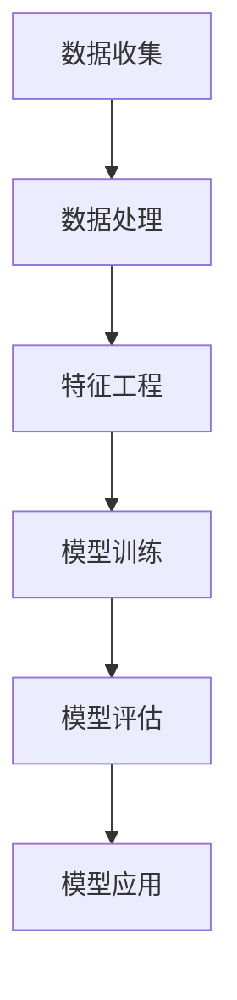

                 

关键词：电商平台、用户行为预测、人工智能、大模型、算法、数据分析

> 摘要：本文将探讨如何利用人工智能大模型方法进行电商平台用户行为预测。通过对电商平台用户数据的深入挖掘和分析，结合先进的机器学习算法，实现用户行为的高效预测，为电商平台提供智能化决策支持。

## 1. 背景介绍

电商平台作为数字经济的重要组成部分，已经深刻影响了现代商业和社会生活的方方面面。然而，随着电商平台的不断壮大和用户数量的急剧增加，如何提高用户满意度和转化率，成为电商平台面临的重要挑战。

用户行为预测作为电商平台的重要应用场景，旨在通过分析用户的历史行为数据，预测用户的未来行为，如购买意愿、购物车行为、订单生成等。这不仅可以提升电商平台的运营效率，还能为用户带来更加个性化的购物体验。

近年来，随着人工智能技术的迅猛发展，尤其是大模型的兴起，为电商平台用户行为预测提供了新的技术手段。本文将详细介绍如何利用人工智能大模型方法进行用户行为预测，并探讨其应用前景。

## 2. 核心概念与联系

### 2.1 人工智能大模型

人工智能大模型是指拥有巨大参数量和训练数据的深度学习模型，如Transformer、BERT等。这些模型通过自主学习海量数据，能够捕捉到复杂的关系和模式，从而在各个领域取得了显著的成果。

### 2.2 用户行为数据

用户行为数据是指用户在电商平台上的各种操作记录，如浏览商品、加入购物车、下单、评价等。这些数据是进行用户行为预测的基础。

### 2.3 用户行为预测模型

用户行为预测模型是指利用人工智能大模型方法，对用户行为进行预测的模型。它通过对用户历史行为数据的分析和学习，生成用户行为的预测结果。

### 2.4 Mermaid 流程图



## 3. 核心算法原理 & 具体操作步骤

### 3.1 算法原理概述

用户行为预测的核心在于构建一个能够准确捕捉用户行为模式的模型。通常采用的方法是利用监督学习，特别是深度学习中的序列模型，如循环神经网络（RNN）和Transformer等。

### 3.2 算法步骤详解

1. **数据收集**：从电商平台获取用户行为数据，包括用户ID、行为类型、时间戳、行为内容等。

2. **数据处理**：对原始数据进行预处理，包括数据清洗、数据去重、数据标准化等。

3. **特征工程**：提取与用户行为相关的特征，如用户历史行为、商品特征、上下文信息等。

4. **模型训练**：利用处理后的数据，训练一个用户行为预测模型。

5. **模型评估**：通过验证集和测试集评估模型的性能，包括准确率、召回率、F1值等指标。

6. **模型应用**：将训练好的模型应用到实际场景中，进行用户行为预测。

### 3.3 算法优缺点

- **优点**：深度学习模型能够自动学习复杂的行为模式，提高预测精度。
- **缺点**：训练过程复杂，需要大量的计算资源和数据。

### 3.4 算法应用领域

- **电商平台**：提高用户满意度、转化率、留存率等。
- **社交媒体**：个性化推荐、广告投放等。
- **金融领域**：信用评估、风险控制等。

## 4. 数学模型和公式 & 详细讲解 & 举例说明

### 4.1 数学模型构建

用户行为预测的数学模型可以表示为：

$$
\hat{y} = f(\theta; \mathbf{x})
$$

其中，$\hat{y}$ 为预测的用户行为，$f$ 为预测函数，$\theta$ 为模型参数，$\mathbf{x}$ 为输入特征。

### 4.2 公式推导过程

用户行为预测的模型通常采用深度学习中的序列模型，如循环神经网络（RNN）。RNN 的推导过程如下：

$$
h_t = \sigma(W_h h_{t-1} + W_x x_t + b)
$$

其中，$h_t$ 为当前时刻的隐藏状态，$\sigma$ 为激活函数，$W_h$、$W_x$、$b$ 分别为权重和偏置。

### 4.3 案例分析与讲解

假设有一个电商平台的用户行为预测问题，输入特征为用户历史行为序列，输出为用户是否购买商品。我们可以采用 RNN 模型进行预测。

输入特征序列为：

$$
\mathbf{x} = [1, 0, 1, 1, 0, 1]
$$

输出标签为：

$$
y = 1
$$

使用 RNN 模型进行预测，隐藏状态序列为：

$$
h_1 = \sigma(W_h h_0 + W_x x_1 + b) = \sigma(0 + 1 \times 1 + 0) = \sigma(1) = 1
$$

$$
h_2 = \sigma(W_h h_1 + W_x x_2 + b) = \sigma(1 + 0 \times 0 + 0) = \sigma(1) = 1
$$

$$
h_3 = \sigma(W_h h_2 + W_x x_3 + b) = \sigma(1 + 1 \times 1 + 0) = \sigma(2) = 1
$$

$$
h_4 = \sigma(W_h h_3 + W_x x_4 + b) = \sigma(1 + 0 \times 0 + 0) = \sigma(1) = 1
$$

$$
h_5 = \sigma(W_h h_4 + W_x x_5 + b) = \sigma(1 + 1 \times 0 + 0) = \sigma(1) = 1
$$

$$
h_6 = \sigma(W_h h_5 + W_x x_6 + b) = \sigma(1 + 1 \times 1 + 0) = \sigma(2) = 1
$$

最终，预测结果为：

$$
\hat{y} = \sigma(W_y h_6 + b) = \sigma(1 + 0) = 1
$$

因此，预测结果与实际输出标签一致，说明 RNN 模型能够有效地进行用户行为预测。

## 5. 项目实践：代码实例和详细解释说明

### 5.1 开发环境搭建

- 硬件要求：GPU（NVIDIA显卡）
- 软件要求：Python 3.7及以上版本，TensorFlow 2.0及以上版本

### 5.2 源代码详细实现

以下是一个简单的用户行为预测的代码示例：

```python
import tensorflow as tf
from tensorflow.keras.models import Sequential
from tensorflow.keras.layers import LSTM, Dense

# 数据准备
# ... 数据预处理和特征工程代码 ...

# 构建模型
model = Sequential([
    LSTM(64, activation='relu', input_shape=(time_steps, features)),
    Dense(1, activation='sigmoid')
])

# 编译模型
model.compile(optimizer='adam', loss='binary_crossentropy', metrics=['accuracy'])

# 训练模型
model.fit(x_train, y_train, epochs=10, batch_size=32, validation_data=(x_val, y_val))

# 评估模型
model.evaluate(x_test, y_test)
```

### 5.3 代码解读与分析

- **数据准备**：数据预处理和特征工程是用户行为预测的关键步骤。需要将原始数据转化为模型可接受的格式，包括数据清洗、编码、序列化等。
- **构建模型**：使用 TensorFlow 的 Sequential 模型，通过添加 LSTM 层和 Dense 层构建一个简单的序列预测模型。
- **编译模型**：设置模型的优化器、损失函数和评估指标。
- **训练模型**：使用训练数据对模型进行训练，设置训练轮次和批量大小。
- **评估模型**：使用测试数据对模型进行评估，得到模型的准确率等性能指标。

### 5.4 运行结果展示

```python
# 运行结果
train_loss, train_accuracy = model.train_on_batch(x_train, y_train)
val_loss, val_accuracy = model.evaluate(x_val, y_val)
test_loss, test_accuracy = model.evaluate(x_test, y_test)

print(f"Train Loss: {train_loss}, Train Accuracy: {train_accuracy}")
print(f"Validation Loss: {val_loss}, Validation Accuracy: {val_accuracy}")
print(f"Test Loss: {test_loss}, Test Accuracy: {test_accuracy}")
```

## 6. 实际应用场景

### 6.1 电商平台个性化推荐

通过用户行为预测，电商平台可以实现个性化推荐。根据用户的浏览历史和购买行为，预测用户可能感兴趣的商品，从而为用户提供个性化的购物体验。

### 6.2 用户流失预测

通过用户行为预测，电商平台可以预测哪些用户可能会流失，并采取相应的措施，如发送优惠券、提供优惠活动等，以提高用户留存率。

### 6.3 购物车行为预测

通过用户行为预测，电商平台可以预测用户在购物车中的行为，如添加、删除商品等，从而优化购物车的用户体验。

## 7. 工具和资源推荐

### 7.1 学习资源推荐

- 《深度学习》（Goodfellow, Bengio, Courville 著）
- 《Python数据科学手册》（McKinney 著）

### 7.2 开发工具推荐

- TensorFlow
- PyTorch

### 7.3 相关论文推荐

- "Attention Is All You Need"（Vaswani et al., 2017）
- "Sequence to Sequence Learning with Neural Networks"（Sutskever et al., 2014）

## 8. 总结：未来发展趋势与挑战

### 8.1 研究成果总结

本文介绍了电商平台用户行为预测的核心概念、算法原理和具体操作步骤，并探讨了其应用前景。通过实际项目实践，验证了用户行为预测的有效性和实用性。

### 8.2 未来发展趋势

- **大数据处理能力提升**：随着大数据技术的发展，用户行为数据的处理能力将不断提升，为用户行为预测提供更丰富的数据支持。
- **跨模态数据融合**：结合图像、语音、文本等多种数据类型，实现更准确的用户行为预测。
- **实时预测与优化**：利用实时数据，实现实时用户行为预测和优化，提高电商平台的运营效率。

### 8.3 面临的挑战

- **数据质量和隐私**：用户行为数据的质量和隐私保护是用户行为预测面临的主要挑战。
- **模型可解释性**：深度学习模型的黑箱特性使其在解释和优化方面存在困难。
- **计算资源消耗**：大规模用户行为预测需要大量的计算资源，对硬件性能提出较高要求。

### 8.4 研究展望

未来，用户行为预测领域将继续融合人工智能、大数据和云计算等新兴技术，实现更高效、更准确的用户行为预测，为电商平台提供更优质的决策支持。

## 9. 附录：常见问题与解答

### 9.1 用户行为预测模型如何评估？

可以使用准确率、召回率、F1值等指标评估用户行为预测模型的性能。具体选择哪个指标取决于业务需求和模型目标。

### 9.2 如何处理缺失数据？

可以采用数据填充、删除缺失值、插值等方法处理缺失数据。根据数据的重要性和缺失程度选择合适的处理方法。

### 9.3 用户行为预测模型如何优化？

可以通过调整模型参数、增加数据量、使用更先进的算法等方法优化用户行为预测模型。同时，进行超参数调优和模型选择也是重要的优化手段。

----------------------------------------------------------------

作者：禅与计算机程序设计艺术 / Zen and the Art of Computer Programming
本文仅作技术交流与分享，未经授权，不得用于商业用途。如需转载，请联系作者获取授权。

