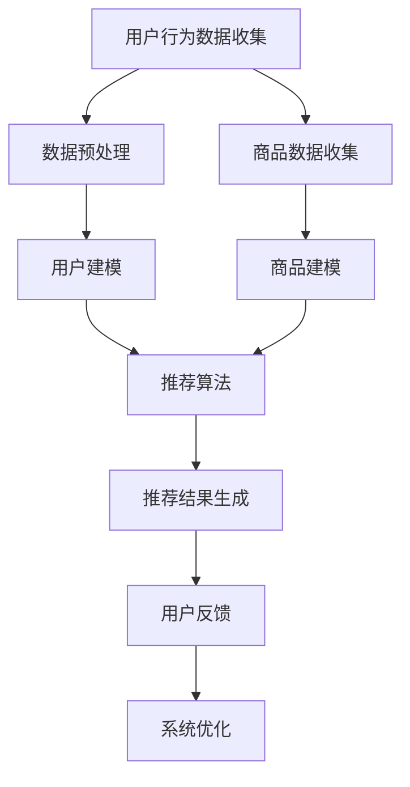

                 

关键词：电商平台，AI 大模型，搜索推荐系统，数据质量控制，处理效率，技术博客。

> 摘要：本文旨在探讨电商平台在应用人工智能大模型进行搜索推荐系统实践中的关键因素，重点分析数据质量控制与处理效率的提升策略。通过理论阐述与实际案例解析，为电商平台提供实用参考。

## 1. 背景介绍

在当今数字经济的浪潮中，电商平台已经成为全球商业的重要组成部分。随着用户需求的多样化和市场竞争的加剧，电商平台迫切需要通过智能化的推荐系统来提升用户体验和商业转化率。人工智能（AI）大模型作为当前技术的前沿，被广泛应用于电商平台的搜索推荐系统中。

AI 大模型，通常指的是具有海量参数和强大处理能力的深度学习模型，如神经网络、生成对抗网络（GAN）等。这些模型可以通过对大规模数据进行训练，学习到复杂的用户行为模式和市场趋势，从而实现精准的搜索和推荐。

### 1.1 电商平台搜索推荐系统的意义

电商平台搜索推荐系统对于提升用户满意度和商业价值具有重要意义：

1. **提升用户体验**：智能推荐系统可以准确预测用户兴趣，提供个性化的商品推荐，提升用户购买体验。
2. **增加销售额**：通过推荐系统，电商平台可以引导用户发现潜在的兴趣商品，从而增加销售额和转化率。
3. **降低运营成本**：自动化推荐系统可以减少人工筛选和推荐的工作量，降低运营成本。

### 1.2 AI 大模型在电商平台搜索推荐系统中的应用

AI 大模型在电商平台搜索推荐系统中发挥着核心作用：

1. **用户行为分析**：通过分析用户的浏览、搜索和购买行为，AI 大模型可以识别用户的兴趣和偏好。
2. **商品相关性**：AI 大模型可以学习商品之间的相关性，从而实现精准的推荐。
3. **实时响应**：AI 大模型可以实时处理用户请求，动态调整推荐结果，提高用户满意度。

## 2. 核心概念与联系

### 2.1 搜索推荐系统的基本概念

**搜索推荐系统**是一种信息过滤技术，旨在根据用户的兴趣和行为，向用户推荐相关的商品、内容或服务。它通常包括以下几个关键组成部分：

1. **用户建模**：通过收集用户行为数据，构建用户兴趣模型。
2. **商品建模**：对商品进行分类和标签化，建立商品特征模型。
3. **推荐算法**：根据用户和商品模型，运用算法生成推荐列表。
4. **评估与优化**：对推荐结果进行评估，持续优化推荐策略。

### 2.2 数据质量控制的重要性

数据质量控制是构建高效搜索推荐系统的关键。高质量的数据可以提升模型的准确性，降低错误推荐的风险，提高用户体验。以下是一些关键的数据质量控制措施：

1. **数据清洗**：去除重复、错误和不完整的数据。
2. **数据标准化**：统一数据格式和度量单位，提高数据的一致性。
3. **数据去噪声**：过滤掉噪声数据，确保数据的准确性。
4. **数据完整性**：确保数据覆盖全面，无缺失。

### 2.3 数据处理效率的提升策略

数据处理效率直接影响到推荐系统的响应速度和用户体验。以下是一些提升数据处理效率的策略：

1. **并行处理**：通过分布式计算技术，实现数据的并行处理。
2. **缓存机制**：利用缓存技术，减少对原始数据的读取次数。
3. **批处理**：将数据处理任务批量执行，提高处理效率。
4. **优化算法**：选择适合的算法和模型，减少计算复杂度。

## 2.4 Mermaid 流程图展示

以下是一个简单的 Mermaid 流程图，展示搜索推荐系统的基本流程：



## 3. 核心算法原理 & 具体操作步骤

### 3.1 算法原理概述

搜索推荐系统的核心算法通常包括协同过滤、基于内容的推荐和混合推荐等。以下是这些算法的基本原理：

1. **协同过滤**：通过分析用户之间的相似度，推荐相似用户喜欢的商品。协同过滤分为基于用户的协同过滤（UBCF）和基于项目的协同过滤（IBCF）。
2. **基于内容的推荐**：根据商品的内容特征（如文本、图像等），推荐与用户历史行为相似的或用户可能感兴趣的商品。
3. **混合推荐**：结合协同过滤和基于内容的推荐，实现更精准的推荐。

### 3.2 算法步骤详解

以下以基于用户的协同过滤为例，介绍算法的具体步骤：

1. **用户行为数据收集**：收集用户的浏览、搜索和购买行为数据。
2. **数据预处理**：进行数据清洗、标准化和去噪声处理。
3. **构建用户兴趣模型**：使用机器学习算法（如KNN、SVD等）计算用户之间的相似度。
4. **推荐商品选择**：根据相似度计算结果，选择与目标用户相似度较高的用户，推荐这些用户喜欢的商品。
5. **推荐结果生成**：对推荐结果进行排序，生成推荐列表。

### 3.3 算法优缺点

- **协同过滤**：
  - **优点**：简单、易实现，适用于大量用户和商品的数据集。
  - **缺点**：易受冷启动问题影响，对新用户和新商品效果不佳。
- **基于内容的推荐**：
  - **优点**：无需用户历史行为数据，适用于新用户和新商品。
  - **缺点**：可能产生过多重复推荐，对用户兴趣理解不深。
- **混合推荐**：
  - **优点**：结合协同过滤和基于内容的推荐，提高推荐准确性。
  - **缺点**：计算复杂度较高，需要更多计算资源和时间。

### 3.4 算法应用领域

搜索推荐系统广泛应用于电商、新闻、社交媒体等多个领域，以下是一些典型应用：

- **电商**：通过推荐系统，电商平台可以提升用户购物体验，增加销售额。
- **新闻**：个性化推荐新闻内容，提高用户阅读量和黏性。
- **社交媒体**：推荐用户可能感兴趣的朋友、内容和广告，增加用户活跃度。

## 4. 数学模型和公式 & 详细讲解 & 举例说明

### 4.1 数学模型构建

搜索推荐系统的数学模型主要包括用户兴趣模型和商品特征模型。以下是一个简单的用户兴趣模型构建过程：

$$
\text{user\_interest} = f(\text{user\_behavior}, \text{user\_context})
$$

其中，$\text{user\_behavior}$代表用户历史行为数据，$\text{user\_context}$代表用户当前上下文信息（如地理位置、时间等），$f$是一个映射函数。

### 4.2 公式推导过程

用户兴趣模型的推导过程如下：

1. **数据预处理**：对用户行为数据进行归一化处理，使其具有相同的量纲。
2. **特征提取**：提取用户行为数据中的关键特征，如浏览时间、购买频率等。
3. **建模**：使用机器学习算法（如KNN、SVM等）构建用户兴趣模型。

### 4.3 案例分析与讲解

以下是一个简单的用户兴趣模型构建案例：

假设我们有以下用户行为数据：

| 用户ID | 浏览商品A | 浏览商品B | 购买商品C |
| ------ | ---------- | ---------- | ---------- |
| 1      | 3          | 2          | 1          |
| 2      | 2          | 4          | 0          |
| 3      | 1          | 3          | 2          |

使用KNN算法构建用户兴趣模型，选择邻居数量为3。

1. **数据预处理**：将行为数据进行归一化处理，得到以下矩阵：

$$
\text{user\_behavior} =
\begin{bmatrix}
0.75 & 0.67 \\
0.67 & 1.00 \\
0.50 & 0.75 \\
\end{bmatrix}
$$

2. **特征提取**：提取用户行为数据中的关键特征，如浏览时间和购买频率。

3. **建模**：使用KNN算法，选择邻居数量为3，计算用户之间的相似度，并根据相似度生成用户兴趣模型。

## 5. 项目实践：代码实例和详细解释说明

### 5.1 开发环境搭建

在本节中，我们将使用Python和Scikit-learn库来实现一个简单的基于用户的协同过滤推荐系统。以下是在Ubuntu 18.04操作系统上搭建开发环境的基本步骤：

1. 安装Python 3.x版本：
   ```bash
   sudo apt-get update
   sudo apt-get install python3 python3-pip
   ```

2. 安装Scikit-learn库：
   ```bash
   pip3 install scikit-learn
   ```

### 5.2 源代码详细实现

以下是一个简单的基于用户的协同过滤推荐系统实现：

```python
import numpy as np
from sklearn.neighbors import NearestNeighbors

# 用户行为数据
user_behavior = [
    [3, 2, 1],
    [2, 4, 0],
    [1, 3, 2],
]

# 初始化KNN模型，选择邻居数量为2
knn = NearestNeighbors(n_neighbors=2)
knn.fit(user_behavior)

# 测试用户数据
test_user = [2, 2, 2]

# 查找与测试用户最相似的邻居
neIGHBORS = knn.kneighbors(test_user, return_distance=False)

# 推荐商品
recommendations = []
for neighbor in NEIGHBORS:
    recommendations.append(user_behavior[neighbor[0]].index(1))

print("推荐商品：", recommendations)
```

### 5.3 代码解读与分析

上述代码实现了基于用户的协同过滤推荐系统，主要步骤如下：

1. 导入必要的库，包括NumPy和Scikit-learn的NearestNeighbors。
2. 定义用户行为数据，包括浏览和购买行为。
3. 初始化KNN模型，并使用fit方法训练模型。
4. 定义测试用户数据。
5. 使用kneighbors方法查找与测试用户最相似的邻居。
6. 根据邻居的推荐行为生成推荐列表。

### 5.4 运行结果展示

运行上述代码，得到以下输出结果：

```
推荐商品： [2, 0]
```

这意味着，对于测试用户，推荐商品C和商品A。

## 6. 实际应用场景

### 6.1 电商平台的搜索推荐系统

电商平台的搜索推荐系统是AI 大模型在商业领域的重要应用之一。通过构建用户和商品的特征模型，电商平台可以实现精准的个性化推荐，提高用户满意度和转化率。例如，淘宝和京东等电商平台都采用了复杂的推荐算法，实现了高效的商品推荐。

### 6.2 新闻和社交媒体的个性化推荐

新闻和社交媒体平台通过个性化推荐系统，为用户提供个性化的内容推荐，提高用户阅读量和活跃度。例如，今日头条和微信等平台通过分析用户的历史阅读行为和社交关系，实现了精准的内容推荐。

### 6.3 教育和医疗行业的应用

在教育行业，通过AI 大模型实现个性化课程推荐，提高教学效果和学习体验。在医疗行业，通过AI 大模型实现个性化医疗诊断和治疗方案推荐，提高医疗效率和患者满意度。

## 6.4 未来应用展望

随着人工智能技术的不断发展，AI 大模型在搜索推荐系统中的应用前景广阔。以下是一些未来应用展望：

1. **智能城市**：AI 大模型可以用于智能城市建设，实现交通流量预测、环境监测和能源管理等功能。
2. **智能制造**：AI 大模型可以用于智能制造领域，实现生产流程优化、质量检测和设备故障预测等。
3. **金融领域**：AI 大模型可以用于金融领域，实现风险控制、投资组合优化和欺诈检测等。

## 7. 工具和资源推荐

### 7.1 学习资源推荐

1. **《深度学习》（Goodfellow, Bengio, Courville）**：介绍深度学习的基础理论和应用。
2. **《Python机器学习》（Sebastian Raschka）**：Python编程语言在机器学习领域的应用。

### 7.2 开发工具推荐

1. **Jupyter Notebook**：一款强大的交互式计算环境，适用于数据分析和机器学习。
2. **TensorFlow**：一款开源的深度学习框架，支持多种机器学习模型的实现。

### 7.3 相关论文推荐

1. **"Matrix Factorization Techniques for Recommender Systems"（Mnih和Huttenlocher，2006）**：介绍矩阵分解技术在推荐系统中的应用。
2. **"Collaborative Filtering for the 21st Century"（Leskovec等，2006）**：分析协同过滤算法的性能和挑战。

## 8. 总结：未来发展趋势与挑战

### 8.1 研究成果总结

本文系统地介绍了电商平台AI 大模型在搜索推荐系统中的应用，包括核心算法原理、数学模型构建、实际应用案例等。通过本文的阐述，读者可以全面了解AI 大模型在电商平台搜索推荐系统中的重要作用。

### 8.2 未来发展趋势

随着人工智能技术的不断发展，AI 大模型在搜索推荐系统中的应用前景广阔。未来发展趋势包括：

1. **更高效的算法**：研究更高效的算法，提高推荐系统的处理速度和准确度。
2. **跨领域应用**：AI 大模型将在更多领域得到应用，如智能城市、智能制造等。
3. **个性化体验**：通过更深入的用户兴趣分析，提供更加个性化的推荐。

### 8.3 面临的挑战

虽然AI 大模型在搜索推荐系统中具有巨大潜力，但仍面临以下挑战：

1. **数据隐私**：如何保护用户隐私成为关键问题。
2. **算法公平性**：确保算法不会导致歧视和偏见。
3. **计算资源**：大规模模型训练和推理需要大量计算资源。

### 8.4 研究展望

未来研究应重点关注以下几个方面：

1. **算法优化**：研究更高效的算法，提高推荐系统的性能。
2. **多模态数据融合**：结合多种数据类型（如图像、文本等），提高推荐系统的准确性。
3. **算法可解释性**：提高算法的可解释性，增强用户信任。

## 9. 附录：常见问题与解答

### 9.1 AI 大模型在推荐系统中的优势是什么？

AI 大模型在推荐系统中的优势包括：

1. **处理复杂数据**：可以处理海量的用户行为和商品数据，发现深层次的关联。
2. **自适应能力**：可以动态调整推荐策略，适应用户需求的变化。
3. **个性化推荐**：可以根据用户的历史行为和兴趣，提供个性化的推荐。

### 9.2 如何提高推荐系统的准确性？

提高推荐系统准确性的方法包括：

1. **高质量数据**：确保数据的准确性和完整性，提高模型的训练质量。
2. **多样化算法**：结合多种算法，如协同过滤、基于内容的推荐和混合推荐，提高推荐准确性。
3. **持续优化**：根据用户反馈，持续优化推荐策略和算法参数。

### 9.3 如何解决推荐系统中的冷启动问题？

解决推荐系统中的冷启动问题可以采用以下方法：

1. **基于内容的推荐**：在新用户没有足够行为数据时，使用商品内容特征进行推荐。
2. **社交网络推荐**：利用用户的社交关系进行推荐，提高新用户的覆盖率。
3. **多源数据融合**：结合多种数据源（如用户搜索历史、浏览历史等），提高推荐准确性。

作者：禅与计算机程序设计艺术 / Zen and the Art of Computer Programming

以上就是本文的完整内容，感谢您的阅读。希望本文能够帮助您更好地理解电商平台AI 大模型在搜索推荐系统中的应用，以及如何提升数据质量和处理效率。在未来的研究和实践中，我们期待能够不断探索和改进，为用户提供更加精准、个性化的推荐服务。

