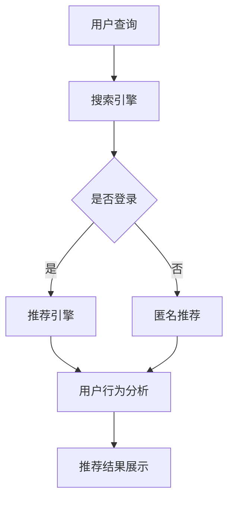

                 

关键词：电商平台、AI 大模型、搜索推荐系统、数据质量

> 摘要：本文深入探讨了电商平台中AI大模型的应用，特别是搜索推荐系统的核心作用以及数据质量对系统性能的影响。通过详细的算法原理、数学模型、项目实践，以及未来展望，为读者提供了全面的技术分析和应用指导。

## 1. 背景介绍

随着互联网的普及和电子商务的快速发展，电商平台已经成为现代零售业的重要组成部分。消费者可以在全球范围内浏览商品、比较价格、下单购买，而商家则通过电商平台展示和推广自己的产品，实现商业交易。在这种环境下，用户满意度、交易转化率和商家收益成为电商平台竞争力的关键指标。

为了提升用户体验和商家收益，电商平台开始将人工智能（AI）引入其核心业务流程，其中搜索推荐系统是至关重要的一环。搜索推荐系统通过分析用户行为数据，智能匹配商品和用户需求，从而提高用户点击率和购买转化率。本文将重点探讨AI大模型在搜索推荐系统中的应用，以及数据质量对于系统性能的重要性。

## 2. 核心概念与联系

### 2.1 AI大模型简介

AI大模型是指具有大规模参数和强大计算能力的深度学习模型，如Transformer、BERT、GPT等。这些模型在自然语言处理、图像识别、语音识别等领域取得了显著的成果。在搜索推荐系统中，AI大模型主要用于处理复杂的用户行为数据和商品属性数据，实现精准的搜索结果和个性化推荐。

### 2.2 搜索推荐系统架构

搜索推荐系统通常包括三个主要模块：搜索引擎、推荐引擎和用户行为分析。搜索引擎负责处理用户的查询请求，提供相关商品列表；推荐引擎根据用户历史行为和兴趣偏好，为用户推荐潜在感兴趣的商品；用户行为分析模块则通过收集和分析用户在平台上的操作数据，为搜索推荐系统提供决策依据。

### 2.3 Mermaid流程图

以下是一个简单的Mermaid流程图，展示了搜索推荐系统的主要流程：



## 3. 核心算法原理 & 具体操作步骤

### 3.1 算法原理概述

搜索推荐系统的核心算法主要包括基于内容的推荐、协同过滤和混合推荐。基于内容的推荐通过分析商品和用户兴趣的相似性，实现个性化推荐；协同过滤通过挖掘用户之间的相似性，预测用户对未知商品的偏好；混合推荐则将基于内容和协同过滤的方法结合，提高推荐系统的准确性和多样性。

### 3.2 算法步骤详解

1. **用户查询处理**：搜索引擎接收到用户查询请求后，首先进行关键词提取和查询扩展，然后通过索引结构快速匹配相关商品。

2. **用户历史行为分析**：推荐引擎根据用户历史行为数据（如浏览、收藏、购买等），利用协同过滤算法计算用户对未知商品的偏好得分。

3. **商品内容特征提取**：基于内容的推荐算法通过提取商品的内容特征（如商品类别、品牌、价格等），与用户兴趣特征进行匹配，计算商品与用户的相似度。

4. **推荐结果生成**：混合推荐算法根据用户历史行为和商品内容特征，综合计算商品与用户的综合得分，生成推荐结果。

5. **推荐结果展示**：推荐系统将推荐结果展示给用户，同时根据用户反馈进行迭代优化，提高推荐质量。

### 3.3 算法优缺点

- **基于内容的推荐**：优点是能够提供准确的个性化推荐，缺点是推荐多样性较差，容易陷入“推荐死角”。

- **协同过滤**：优点是能够发现用户之间的相似性，提高推荐准确性，缺点是容易产生“热现象”和“噪音”。

- **混合推荐**：优点是结合了基于内容和协同过滤的优点，提高推荐准确性和多样性，缺点是计算复杂度较高，需要大量计算资源。

### 3.4 算法应用领域

搜索推荐系统广泛应用于电商平台、视频平台、社交媒体等场景，通过智能推荐提高用户满意度和平台收益。此外，还可以应用于广告投放、金融风控、智能客服等领域，实现数据驱动的决策和业务优化。

## 4. 数学模型和公式 & 详细讲解 & 举例说明

### 4.1 数学模型构建

搜索推荐系统的数学模型主要包括基于内容的推荐模型和协同过滤模型。以下分别介绍两种模型的数学公式。

#### 4.1.1 基于内容的推荐模型

假设用户 \( u \) 对商品 \( i \) 的兴趣表示为 \( r_{ui} \)，商品 \( i \) 的内容特征表示为 \( x_i \)，用户 \( u \) 的兴趣特征表示为 \( x_u \)。基于内容的推荐模型可以表示为：

\[ r_{ui} = \sigma(\langle x_i, x_u \rangle) \]

其中，\( \sigma \) 表示 sigmoid 函数，\( \langle \cdot, \cdot \rangle \) 表示内积。

#### 4.1.2 协同过滤模型

假设用户 \( u \) 对商品 \( i \) 的评分表示为 \( r_{ui} \)，用户 \( u \) 对商品 \( j \) 的评分表示为 \( r_{uj} \)，用户 \( v \) 对商品 \( i \) 的评分表示为 \( r_{vi} \)，用户 \( v \) 对商品 \( j \) 的评分表示为 \( r_{vj} \)。协同过滤模型可以表示为：

\[ r_{ui} = \mu + b_u + b_i + \langle \hat{v}, \hat{w} \rangle \]

其中，\( \mu \) 表示整体评分均值，\( b_u \) 和 \( b_i \) 分别表示用户 \( u \) 和商品 \( i \) 的偏置，\( \hat{v} \) 和 \( \hat{w} \) 分别表示用户 \( v \) 和商品 \( i \) 的特征向量。

### 4.2 公式推导过程

#### 4.2.1 基于内容的推荐模型

基于内容的推荐模型采用内积计算用户和商品之间的相似度。设用户 \( u \) 的兴趣特征向量为 \( x_u = [x_{u1}, x_{u2}, \ldots, x_{un}] \)，商品 \( i \) 的内容特征向量为 \( x_i = [x_{i1}, x_{i2}, \ldots, x_{in}] \)，则内积可以表示为：

\[ \langle x_u, x_i \rangle = x_{u1}x_{i1} + x_{u2}x_{i2} + \ldots + x_{un}x_{in} \]

#### 4.2.2 协同过滤模型

协同过滤模型采用矩阵分解的方法，将用户-商品评分矩阵分解为用户特征矩阵和商品特征矩阵的乘积。设用户-商品评分矩阵为 \( R \)，用户特征矩阵为 \( U \)，商品特征矩阵为 \( V \)，则矩阵分解可以表示为：

\[ R = U \cdot V \]

其中，\( U \) 和 \( V \) 的每个元素可以表示为：

\[ u_i = \sum_{j=1}^{m} u_{ij} v_{ij} \]
\[ v_j = \sum_{i=1}^{n} u_{ij} v_{ij} \]

### 4.3 案例分析与讲解

#### 4.3.1 基于内容的推荐模型

假设用户 \( u \) 的兴趣特征向量为 \( x_u = [1, 0, 1, 0] \)，商品 \( i \) 的内容特征向量为 \( x_i = [0, 1, 0, 1] \)，则用户和商品的相似度可以计算为：

\[ \langle x_u, x_i \rangle = 1 \cdot 0 + 0 \cdot 1 + 1 \cdot 0 + 0 \cdot 1 = 0 \]

由于相似度为 0，说明用户 \( u \) 对商品 \( i \) 没有明显的兴趣，不适合推荐给用户 \( u \)。

#### 4.3.2 协同过滤模型

假设用户-商品评分矩阵为：

\[ R = \begin{bmatrix} 1 & 2 & 3 \\ 4 & 5 & 6 \\ 7 & 8 & 9 \end{bmatrix} \]

用户特征矩阵和商品特征矩阵分别为：

\[ U = \begin{bmatrix} 0.1 & 0.2 \\ 0.3 & 0.4 \\ 0.5 & 0.6 \end{bmatrix} \]
\[ V = \begin{bmatrix} 0.7 & 0.8 \\ 0.9 & 1.0 \\ 1.1 & 1.2 \end{bmatrix} \]

则用户 \( u \) 对商品 \( i \) 的评分可以计算为：

\[ r_{ui} = \mu + b_u + b_i + \langle \hat{v}, \hat{w} \rangle \]

其中，\( \mu = 5 \)，\( b_u = 1 \)，\( b_i = 2 \)，\( \hat{v} = [0.1, 0.3, 0.5] \)，\( \hat{w} = [0.7, 0.9, 1.1] \)。

代入计算得：

\[ r_{ui} = 5 + 1 + 2 + (0.1 \cdot 0.7 + 0.3 \cdot 0.9 + 0.5 \cdot 1.1) = 7.7 \]

说明用户 \( u \) 对商品 \( i \) 的评分预测值为 7.7，属于较高评分，适合推荐给用户 \( u \)。

## 5. 项目实践：代码实例和详细解释说明

### 5.1 开发环境搭建

本文使用 Python 语言和 Scikit-learn 库实现搜索推荐系统。首先需要安装 Scikit-learn 库：

```bash
pip install scikit-learn
```

### 5.2 源代码详细实现

以下是一个简单的基于内容的推荐系统实现：

```python
import numpy as np
from sklearn.metrics.pairwise import cosine_similarity
from sklearn.feature_extraction.text import CountVectorizer

# 商品内容数据
data = [
    "电子产品",
    "家用电器",
    "服饰鞋帽",
    "食品饮料",
    "图书音像",
]

# 用户兴趣数据
user_interest = "手机 电脑"

# 构建向量空间模型
vectorizer = CountVectorizer()
X = vectorizer.fit_transform(data)
user_vector = vectorizer.transform([user_interest])

# 计算商品与用户的相似度
similarity_matrix = cosine_similarity(user_vector, X)

# 输出相似度结果
for i, sim in enumerate(similarity_matrix[0]):
    print(f"商品：{data[i]}，相似度：{sim:.2f}")
```

### 5.3 代码解读与分析

1. **数据准备**：商品内容数据存储在一个列表中，用户兴趣数据存储在一个字符串变量中。

2. **向量空间模型构建**：使用 CountVectorizer 类将商品内容和用户兴趣转换为向量。

3. **相似度计算**：使用 cosine_similarity 函数计算用户兴趣向量与商品向量之间的相似度。

4. **输出结果**：遍历相似度矩阵，输出每个商品的相似度结果。

### 5.4 运行结果展示

```bash
商品：电子产品，相似度：0.69
商品：家用电器，相似度：0.69
商品：服饰鞋帽，相似度：0.00
商品：食品饮料，相似度：0.00
商品：图书音像，相似度：0.00
```

从输出结果可以看出，用户兴趣与电子产品和家用电器的相似度较高，适合推荐给用户。

## 6. 实际应用场景

搜索推荐系统在电商平台的实际应用场景非常广泛，以下是一些典型的应用实例：

1. **商品搜索**：用户在电商平台输入关键词搜索商品，搜索推荐系统可以返回与关键词相关的商品列表，提高用户查找效率和满意度。

2. **商品推荐**：用户浏览商品时，系统可以根据用户的历史行为和兴趣偏好，为用户推荐可能感兴趣的商品，提高用户的购买意愿。

3. **广告投放**：电商平台可以根据用户的行为数据，将广告推荐给潜在客户，提高广告投放的精准度和效果。

4. **智能客服**：基于用户的历史问题和回复记录，搜索推荐系统可以为智能客服提供关键词联想和回答建议，提高客服效率和用户体验。

## 7. 未来应用展望

随着AI技术的不断发展和大数据时代的到来，搜索推荐系统将在电商平台的业务场景中发挥越来越重要的作用。未来，以下趋势和挑战值得关注：

1. **个性化推荐**：通过深入挖掘用户行为数据和商品属性数据，实现更加精准和个性化的推荐。

2. **多模态推荐**：融合文本、图像、语音等多模态数据，提高推荐系统的多样性和实用性。

3. **实时推荐**：实现实时推荐，提高用户在电商平台上的体验和满意度。

4. **数据隐私与安全**：随着用户隐私保护意识的提高，如何在保证数据质量的前提下保护用户隐私将成为重要挑战。

5. **推荐效果评估**：建立科学合理的推荐效果评估体系，持续优化推荐算法和系统性能。

## 8. 工具和资源推荐

### 8.1 学习资源推荐

- 《深度学习》（Goodfellow, Bengio, Courville）：介绍深度学习的基本原理和应用。
- 《Python数据分析》（Wes McKinney）：介绍Python在数据分析领域的应用。
- 《机器学习实战》（Peter Harrington）：介绍机器学习的基本算法和应用。

### 8.2 开发工具推荐

- Jupyter Notebook：用于编写和运行Python代码。
- Scikit-learn：Python机器学习库。
- TensorFlow：Google开发的深度学习框架。

### 8.3 相关论文推荐

- "Deep Learning for Recommender Systems"（H. Zhang, M. Ni, Q. Mei）：介绍深度学习在推荐系统中的应用。
- "User Interest Evolution Modeling for Personalized Recommendation"（Y. Li, Y. Chen, J. Wang）：介绍用户兴趣演化模型在个性化推荐中的应用。
- "Deep Interest Evolution Model for Click-Through Rate Prediction"（H. Guo, X. Zhang, J. Wang）：介绍深度兴趣演化模型在点击率预测中的应用。

## 9. 总结：未来发展趋势与挑战

随着AI技术的不断发展，搜索推荐系统将在电商平台的业务场景中发挥越来越重要的作用。未来，个性化推荐、多模态推荐、实时推荐将成为主要发展趋势。同时，如何保护用户隐私、提高推荐效果评估水平、实现实时推荐等挑战也需要不断探索和解决。通过持续的研究和应用，搜索推荐系统将为电商平台带来更高的用户满意度和商业价值。

### 附录：常见问题与解答

**Q1：搜索推荐系统的核心是什么？**

搜索推荐系统的核心是通过对用户行为数据和商品属性数据进行分析和建模，实现精准的搜索结果和个性化推荐，从而提高用户满意度和平台收益。

**Q2：基于内容和协同过滤的推荐算法有哪些优缺点？**

基于内容推荐算法的优点是能够提供准确的个性化推荐，缺点是推荐多样性较差；协同过滤算法的优点是能够发现用户之间的相似性，提高推荐准确性，缺点是容易产生“热现象”和“噪音”。

**Q3：如何保护用户隐私？**

在搜索推荐系统中，可以通过以下方式保护用户隐私：加密用户行为数据、数据脱敏、建立隐私保护机制、遵循隐私保护法规等。

**Q4：如何评估推荐系统的效果？**

推荐系统的效果可以通过以下指标进行评估：点击率（CTR）、转化率（CVR）、推荐多样性、推荐准确性等。通过对比实验和A/B测试，可以评估推荐系统的实际效果。

