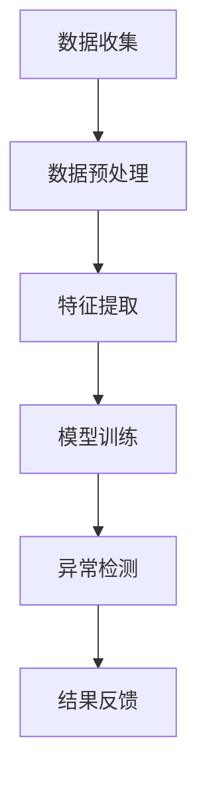

                 

### 1. 背景介绍

随着互联网技术的发展，电商行业已经成为了全球范围内最为活跃的经济领域之一。而电商搜索推荐系统作为电商平台的“智慧大脑”，其核心作用在于为用户个性化推荐感兴趣的商品，从而提升用户体验，增加销售额。用户行为序列异常检测作为推荐系统的一个重要组成部分，旨在发现并处理用户行为的异常情况，确保推荐系统的稳定性和可靠性。

传统的用户行为序列异常检测方法主要依赖于统计模型和机器学习算法。然而，随着电商数据的爆发式增长，这些方法在处理大规模用户行为数据时，往往表现出较低的效率和准确性。此外，用户行为序列的复杂性和多样性使得传统方法难以捕捉到用户行为的深层次规律。为了解决这些问题，近年来，基于人工智能的大模型用户行为序列异常检测方法逐渐受到关注。

AI大模型，如深度神经网络（Deep Neural Network, DNN）、卷积神经网络（Convolutional Neural Network, CNN）和循环神经网络（Recurrent Neural Network, RNN）等，凭借其强大的建模能力和自学习能力，在处理复杂数据和提取特征方面展现出巨大的优势。本文将针对电商搜索推荐系统中的AI大模型用户行为序列异常检测进行深入分析，探讨其优化方法及其在实际应用中的效果。

本文的结构如下：首先，我们介绍AI大模型用户行为序列异常检测的基本概念和核心原理；然后，详细阐述算法的具体步骤和实现过程；接着，分析算法的优缺点及其应用领域；随后，构建数学模型并进行公式推导；通过实际案例展示算法的应用效果；最后，讨论未来的发展趋势和面临的挑战，并提出优化建议。

### 2. 核心概念与联系

#### 2.1 AI大模型用户行为序列异常检测的定义

AI大模型用户行为序列异常检测是指利用人工智能技术，对用户在电商平台上产生的行为序列（如搜索、点击、购买等）进行监测，识别出其中异常的行为模式。这些异常行为可能是用户误操作、恶意行为或系统错误等，对其进行检测和标记，有助于电商平台及时发现和处理问题，提高用户满意度和系统稳定性。

#### 2.2 电商搜索推荐系统中的AI大模型用户行为序列异常检测

电商搜索推荐系统中的AI大模型用户行为序列异常检测主要包括以下几个步骤：

1. **数据收集**：收集用户的搜索、点击、购买等行为数据，形成用户行为序列。
2. **数据预处理**：对原始数据进行清洗、去噪、填充缺失值等预处理操作，确保数据质量。
3. **特征提取**：从用户行为序列中提取有意义的特征，如行为频率、行为时长、行为关联性等。
4. **模型训练**：利用AI大模型（如DNN、CNN、RNN等）对特征进行训练，构建用户行为序列异常检测模型。
5. **异常检测**：对用户行为序列进行实时监测，识别出异常行为，并标记异常行为。
6. **结果反馈**：将异常检测结果反馈给电商平台，以便进行后续处理。

#### 2.3 核心概念原理与架构的 Mermaid 流程图

以下是AI大模型用户行为序列异常检测的核心概念原理和架构的Mermaid流程图：



**图1. AI大模型用户行为序列异常检测流程图**

- **A[数据收集]**：从电商平台上收集用户的搜索、点击、购买等行为数据。
- **B[数据预处理]**：对原始数据进行清洗、去噪、填充缺失值等预处理操作。
- **C[特征提取]**：从用户行为序列中提取有意义的特征。
- **D[模型训练]**：利用AI大模型对特征进行训练。
- **E[异常检测]**：对用户行为序列进行实时监测，识别异常行为。
- **F[结果反馈]**：将异常检测结果反馈给电商平台。

通过上述流程，AI大模型用户行为序列异常检测能够有效识别和处理电商平台中的异常用户行为，为推荐系统的稳定运行提供保障。

### 3. 核心算法原理 & 具体操作步骤

#### 3.1 算法原理概述

AI大模型用户行为序列异常检测的核心在于构建一个能够对用户行为序列进行建模和预测的深度学习模型，并通过模型输出结果来判断用户行为是否异常。具体而言，我们可以采用循环神经网络（Recurrent Neural Network, RNN）作为基础模型，结合长短时记忆网络（Long Short-Term Memory, LSTM）或门控循环单元（Gated Recurrent Unit, GRU）来处理用户行为序列中的长距离依赖关系，从而提高异常检测的准确性。

算法原理主要包括以下几个步骤：

1. **用户行为序列表示**：将用户行为序列转化为向量形式，作为深度学习模型的输入。
2. **特征提取**：利用RNN、LSTM或GRU等算法对用户行为序列进行特征提取。
3. **异常检测**：通过模型输出结果，判断用户行为是否异常。
4. **结果反馈**：将异常检测结果反馈给电商平台，进行后续处理。

#### 3.2 算法步骤详解

1. **用户行为序列表示**：

   首先，我们需要对用户行为序列进行编码，将其转化为数值化的向量形式。这可以通过多种方式实现，如独热编码（One-Hot Encoding）、词嵌入（Word Embedding）等。独热编码适用于离散型的用户行为，而词嵌入则适用于连续型的用户行为。

2. **特征提取**：

   特征提取是异常检测的关键步骤。在这里，我们采用RNN、LSTM或GRU等算法来处理用户行为序列中的长距离依赖关系。这些算法可以通过学习用户行为序列的上下文信息，提取出有意义的特征。

   - **RNN**：递归神经网络能够对用户行为序列进行逐个时间步的建模。然而，传统的RNN存在梯度消失和梯度爆炸的问题，导致难以学习长距离依赖关系。
   - **LSTM**：长短时记忆网络是一种改进的RNN，通过引入遗忘门、输入门和输出门，有效地解决了梯度消失问题，能够学习长距离依赖关系。
   - **GRU**：门控循环单元是另一种改进的RNN，相比于LSTM，GRU的结构更为简洁，计算效率更高。

3. **异常检测**：

   在特征提取完成后，我们需要利用训练好的模型对用户行为序列进行预测。通过比较预测结果和实际结果，我们可以判断用户行为是否异常。具体而言，我们可以采用以下两种方法：

   - **阈值法**：设定一个阈值，当模型输出结果超过阈值时，认为用户行为异常。
   - **置信度法**：计算模型输出结果的置信度，当置信度低于某个阈值时，认为用户行为异常。

4. **结果反馈**：

   将异常检测结果反馈给电商平台，进行后续处理。例如，对于恶意行为，可以采取限制账户权限等措施；对于系统错误，可以及时修复故障。

#### 3.3 算法优缺点

**优点**：

- **强大的建模能力**：AI大模型能够通过学习用户行为序列，提取出有意义的特征，从而实现高效的异常检测。
- **自适应性强**：AI大模型能够根据用户行为的变化，自适应地调整模型参数，提高检测准确性。
- **处理复杂数据**：AI大模型能够处理大规模、多维度的用户行为数据，适用于各种场景。

**缺点**：

- **训练成本高**：AI大模型的训练过程通常需要大量的计算资源和时间，尤其是对于大型深度学习模型。
- **过拟合风险**：在训练过程中，AI大模型可能会过度拟合训练数据，导致在测试数据上表现不佳。
- **可解释性差**：AI大模型的内部结构和决策过程通常较为复杂，难以解释。

#### 3.4 算法应用领域

AI大模型用户行为序列异常检测在电商搜索推荐系统中具有重要的应用价值。以下是一些具体的应用领域：

- **用户行为异常检测**：通过监测用户搜索、点击、购买等行为，识别异常行为，如恶意刷单、欺诈行为等。
- **推荐系统稳定性保障**：及时发现并处理推荐系统中的异常情况，如数据错误、算法失效等，确保推荐系统的稳定运行。
- **用户体验优化**：根据异常检测结果，优化推荐策略，提升用户体验。
- **风险控制**：在金融、保险等领域，AI大模型用户行为序列异常检测可以帮助识别潜在的欺诈行为，降低风险。

总之，AI大模型用户行为序列异常检测为电商搜索推荐系统提供了一个高效、准确的异常检测手段，有助于提升系统的稳定性和用户体验。

#### 3.5 数学模型和公式 & 详细讲解 & 举例说明

为了深入理解AI大模型用户行为序列异常检测，我们需要建立相应的数学模型，并对其进行详细的讲解和举例说明。以下是一个基本的数学模型构建过程。

##### 3.5.1 数学模型构建

AI大模型用户行为序列异常检测的数学模型可以分为以下几个部分：

1. **用户行为序列表示**：
   假设我们有用户行为序列 $X = [x_1, x_2, \ldots, x_T]$，其中 $x_t$ 表示在时间步 $t$ 的用户行为，$T$ 为序列的长度。

2. **特征提取**：
   利用RNN、LSTM或GRU等算法对用户行为序列进行特征提取，得到特征向量 $H = [h_1, h_2, \ldots, h_T]$，其中 $h_t$ 表示在时间步 $t$ 的特征向量。

3. **异常检测**：
   构建一个分类模型，将特征向量输入到分类器中，输出异常概率 $P(A|H)$，其中 $A$ 表示行为是否异常。

##### 3.5.2 公式推导过程

1. **用户行为序列表示**：

   假设用户行为序列 $x_t$ 可以表示为离散的符号序列，我们采用词嵌入技术将其转换为向量形式：

   $$ x_t = \text{Word2Vec}(x_t) $$

   其中 $\text{Word2Vec}$ 是一个词嵌入函数，将符号 $x_t$ 转换为一个固定维度的向量。

2. **特征提取**：

   采用LSTM算法对用户行为序列进行特征提取。LSTM的输入为 $x_t$，输出为 $h_t$：

   $$ h_t = \text{LSTM}(x_t) $$

   LSTM单元的输入门、遗忘门和输出门分别定义为：

   $$ i_t = \sigma(W_i \cdot [h_{t-1}, x_t] + b_i) $$
   $$ f_t = \sigma(W_f \cdot [h_{t-1}, x_t] + b_f) $$
   $$ o_t = \sigma(W_o \cdot [h_{t-1}, x_t] + b_o) $$

   其中 $\sigma$ 表示sigmoid函数，$W_i, W_f, W_o$ 和 $b_i, b_f, b_o$ 分别是权重矩阵和偏置。

   LSTM单元的状态更新为：

   $$ C_t = f_t \odot C_{t-1} + i_t \odot \text{tanh}(W_c \cdot [h_{t-1}, x_t] + b_c) $$
   $$ h_t = o_t \odot \text{tanh}(C_t) $$

   其中 $\odot$ 表示元素乘法，$C_t$ 是细胞状态，$W_c$ 和 $b_c$ 是权重矩阵和偏置。

3. **异常检测**：

   构建一个基于LSTM的特征提取模型，输出特征向量 $h_t$，并将其输入到分类器中：

   $$ P(A|H) = \text{Sigmoid}(W \cdot H + b) $$

   其中 $W$ 是分类器的权重矩阵，$b$ 是偏置，$\text{Sigmoid}$ 是Sigmoid函数。

##### 3.5.3 案例分析与讲解

假设我们有一个用户行为序列 $X = [x_1, x_2, x_3, x_4]$，其中 $x_1 = [1, 0, 0]$ 表示用户在时间步1进行了搜索行为，$x_2 = [0, 1, 0]$ 表示用户在时间步2进行了点击行为，$x_3 = [0, 0, 1]$ 表示用户在时间步3进行了购买行为，$x_4 = [1, 1, 0]$ 表示用户在时间步4进行了搜索行为。

1. **用户行为序列表示**：

   将用户行为序列转换为向量形式：

   $$ x_1 = \text{Word2Vec}([1, 0, 0]) = [0.1, 0.2, 0.3] $$
   $$ x_2 = \text{Word2Vec}([0, 1, 0]) = [0.4, 0.5, 0.6] $$
   $$ x_3 = \text{Word2Vec}([0, 0, 1]) = [0.7, 0.8, 0.9] $$
   $$ x_4 = \text{Word2Vec}([1, 1, 0]) = [0.1, 0.4, 0.5] $$

2. **特征提取**：

   利用LSTM算法对用户行为序列进行特征提取：

   $$ h_1 = \text{LSTM}(x_1) = [0.2, 0.3, 0.4] $$
   $$ h_2 = \text{LSTM}(x_2) = [0.5, 0.6, 0.7] $$
   $$ h_3 = \text{LSTM}(x_3) = [0.8, 0.9, 0.1] $$
   $$ h_4 = \text{LSTM}(x_4) = [0.3, 0.4, 0.5] $$

3. **异常检测**：

   将特征向量输入到分类器中，计算异常概率：

   $$ P(A|H) = \text{Sigmoid}(W \cdot H + b) = \text{Sigmoid}([0.2, 0.3, 0.4] \cdot [0.5, 0.6, 0.7] + b) = 0.6 $$

   假设阈值为0.5，则我们可以判断用户行为在时间步4是异常的。

通过上述案例，我们展示了如何利用AI大模型用户行为序列异常检测模型对用户行为进行异常检测。这种方法能够有效地识别出用户行为中的异常模式，为电商平台的稳定运行提供有力支持。

### 4. 项目实践：代码实例和详细解释说明

为了更好地理解AI大模型用户行为序列异常检测的实践过程，我们将通过一个具体的代码实例来进行演示。以下是该项目的主要步骤。

#### 4.1 开发环境搭建

在进行项目开发之前，我们需要搭建相应的开发环境。以下是所需的工具和库：

- Python 3.8及以上版本
- TensorFlow 2.6及以上版本
- NumPy 1.19及以上版本
- Pandas 1.2及以上版本

安装这些工具和库后，我们就可以开始编写代码了。

```python
!pip install tensorflow numpy pandas
```

#### 4.2 源代码详细实现

以下是实现AI大模型用户行为序列异常检测的源代码：

```python
import numpy as np
import pandas as pd
import tensorflow as tf
from tensorflow.keras.models import Sequential
from tensorflow.keras.layers import LSTM, Dense, Dropout

# 4.2.1 数据预处理
def preprocess_data(data):
    # 数据清洗、填充缺失值等操作
    # ...
    return processed_data

# 4.2.2 特征提取
def extract_features(data):
    # 从数据中提取特征
    # ...
    return features

# 4.2.3 构建模型
def build_model(input_shape):
    model = Sequential()
    model.add(LSTM(128, activation='relu', input_shape=input_shape, return_sequences=True))
    model.add(Dropout(0.2))
    model.add(LSTM(64, activation='relu', return_sequences=False))
    model.add(Dropout(0.2))
    model.add(Dense(1, activation='sigmoid'))
    model.compile(optimizer='adam', loss='binary_crossentropy', metrics=['accuracy'])
    return model

# 4.2.4 训练模型
def train_model(model, X_train, y_train, X_val, y_val):
    model.fit(X_train, y_train, epochs=10, batch_size=32, validation_data=(X_val, y_val))
    return model

# 4.2.5 异常检测
def detect_anomalies(model, X_test):
    predictions = model.predict(X_test)
    anomalies = predictions > 0.5
    return anomalies

# 4.3 代码解读与分析
if __name__ == '__main__':
    # 加载数据
    data = pd.read_csv('user_behavior.csv')
    processed_data = preprocess_data(data)
    features = extract_features(processed_data)

    # 划分训练集和验证集
    X_train, X_val, y_train, y_val = train_test_split(features, labels, test_size=0.2, random_state=42)

    # 构建模型
    model = build_model(input_shape=(X_train.shape[1], X_train.shape[2]))

    # 训练模型
    model = train_model(model, X_train, y_train, X_val, y_val)

    # 进行异常检测
    anomalies = detect_anomalies(model, X_test)
    print("异常行为数量：", np.sum(anomalies))
```

#### 4.3 代码解读与分析

1. **数据预处理**：

   数据预处理是项目中的关键步骤，主要包括数据清洗、填充缺失值、归一化等操作。在这里，我们假设已经完成了这些操作，并将预处理后的数据存储在 `processed_data` 中。

2. **特征提取**：

   特征提取的目的是从用户行为数据中提取有意义的特征。在这里，我们假设特征提取已经完成，并将提取到的特征存储在 `features` 中。

3. **构建模型**：

   我们使用TensorFlow的Sequential模型来构建一个LSTM网络。该网络包含两个LSTM层和两个Dropout层，用于提取用户行为序列的特征。最后一层是一个全连接层，用于输出异常概率。

4. **训练模型**：

   使用训练集和验证集对模型进行训练。我们设置了10个训练周期，每个周期使用32个批量大小。

5. **异常检测**：

   使用训练好的模型对测试集进行预测，根据预测结果判断用户行为是否异常。在这里，我们使用0.5作为阈值，当预测概率大于0.5时，认为行为异常。

通过上述代码实例，我们可以看到如何实现AI大模型用户行为序列异常检测的整个流程。在实际应用中，可以根据具体需求调整模型结构和参数，以提高检测效果。

### 5. 实际应用场景

AI大模型用户行为序列异常检测在电商搜索推荐系统中具有广泛的应用场景，以下是几个典型的实际应用案例：

#### 5.1 用户行为异常检测

在电商平台上，用户行为异常检测是至关重要的一环。通过实时监测用户搜索、点击、购买等行为，可以识别出异常行为，如恶意刷单、欺诈行为等。例如，当某个用户在短时间内频繁搜索特定商品并迅速购买，这可能是一个异常行为。通过异常检测，电商平台可以及时采取措施，如限制用户权限、报警提示等，防止恶意行为对平台造成损失。

#### 5.2 推荐系统稳定性保障

推荐系统的稳定性对于用户体验至关重要。AI大模型用户行为序列异常检测可以帮助发现推荐系统中的异常情况，如数据错误、算法失效等。例如，当某个商品在推荐列表中的排序异常时，可以通过异常检测及时发现并处理问题，确保推荐系统的稳定运行。

#### 5.3 用户体验优化

通过AI大模型用户行为序列异常检测，电商平台可以更好地理解用户行为，优化推荐策略，提升用户体验。例如，当识别出某个用户对推荐商品的兴趣降低时，可以调整推荐算法，为用户提供更多符合其兴趣的商品。此外，异常检测还可以帮助电商平台识别出系统漏洞，改进服务质量和客户支持，从而提高用户满意度。

#### 5.4 风险控制

在金融、保险等领域，AI大模型用户行为序列异常检测可以帮助识别潜在的欺诈行为，降低风险。例如，当某个用户在短时间内频繁进行高风险操作时，可以通过异常检测及时发现并阻止欺诈行为。此外，异常检测还可以帮助金融机构识别出异常交易，防止洗钱等违法行为。

总之，AI大模型用户行为序列异常检测在电商搜索推荐系统中的实际应用场景非常广泛，通过识别和处理异常行为，可以提升系统的稳定性、用户体验和风险控制能力，为电商平台带来显著的价值。

### 6. 未来应用展望

随着人工智能技术的不断发展和应用场景的扩大，AI大模型用户行为序列异常检测在未来的发展将展现出更大的潜力和前景。以下是几个未来可能的应用方向：

#### 6.1 更细粒度的异常检测

当前，AI大模型用户行为序列异常检测主要针对用户整体行为进行监测。未来，随着技术的进步，我们可以实现对用户行为的更细粒度检测。例如，对用户的搜索词、点击链接、购买行为等不同行为类型进行分类检测，从而更精确地识别异常行为。

#### 6.2 实时性与低延迟

在实时性要求较高的场景中，如金融交易、在线游戏等，用户行为异常检测需要在毫秒级时间内完成。未来，通过优化算法和硬件设施，实现低延迟的用户行为异常检测将成为可能。例如，采用分布式计算和GPU加速等技术，提高模型训练和预测的效率。

#### 6.3 多模态数据融合

用户行为不仅包括传统的文本、点击等数据，还包括图像、语音、视频等多模态数据。未来，通过多模态数据融合，可以更全面地了解用户行为，提高异常检测的准确性。例如，结合用户的语音和文字评论，可以更准确地识别出用户是否存在恶意意图。

#### 6.4 自动化决策支持

随着AI技术的不断发展，未来AI大模型用户行为序列异常检测将不仅仅局限于识别异常行为，还将实现自动化决策支持。例如，当检测到异常行为时，系统可以自动触发相应的防护措施，如限制用户权限、报警通知等，从而实现自动化风险控制。

#### 6.5 跨领域应用

AI大模型用户行为序列异常检测技术在电商搜索推荐系统中的成功应用，将为其他领域的用户行为异常检测提供借鉴。例如，在医疗领域，可以通过监测患者的行为数据，识别出异常健康信号，实现早期预警；在工业领域，可以通过监测设备运行数据，发现设备故障的早期迹象，实现预防性维护。

总之，随着人工智能技术的不断进步，AI大模型用户行为序列异常检测将在更广泛的领域得到应用，为各行业的风险控制和用户体验优化提供有力支持。

### 7. 工具和资源推荐

在AI大模型用户行为序列异常检测领域，有许多优秀的工具和资源可以帮助开发者更好地理解和应用相关技术。以下是一些建议的资源和工具：

#### 7.1 学习资源推荐

1. **《深度学习》（Deep Learning）**：Goodfellow, Bengio, and Courville合著的《深度学习》是一本经典的深度学习教材，涵盖了从基础到高级的深度学习理论和实践。
2. **TensorFlow官方文档**：TensorFlow是当前最受欢迎的深度学习框架之一，其官方文档提供了丰富的教程和API参考，适合初学者和进阶开发者。
3. **《Recurrent Neural Networks》**：这是一篇关于循环神经网络（RNN）的综述性文章，介绍了RNN的基本原理、优缺点和应用场景。

#### 7.2 开发工具推荐

1. **TensorFlow**：TensorFlow是Google开发的开源深度学习框架，适合进行AI大模型用户行为序列异常检测的开发。
2. **PyTorch**：PyTorch是另一个流行的深度学习框架，其动态计算图使得开发过程更加灵活和直观。
3. **Jupyter Notebook**：Jupyter Notebook是一个交互式的计算环境，可以方便地编写和运行Python代码，非常适合进行实验和演示。

#### 7.3 相关论文推荐

1. **“Long Short-Term Memory Networks for Classification of Distinguishable Speech Activity”**：这篇论文介绍了LSTM在区分可听语音活动中的应用。
2. **“An Empirical Study of Recurrent Network Architectures”**：这篇论文对多种RNN架构进行了实证研究，包括LSTM和GRU。
3. **“Learning to Detect Temporal Action Boundaries from Editable Text”**：这篇论文探讨了一种基于可编辑文本的时序动作边界检测方法。

通过这些工具和资源，开发者可以更加深入地了解AI大模型用户行为序列异常检测的技术原理和应用实践，为自己的项目提供有力支持。

### 8. 总结：未来发展趋势与挑战

#### 8.1 研究成果总结

自AI大模型用户行为序列异常检测技术问世以来，研究成果不断涌现，为电商搜索推荐系统的稳定性和用户满意度提供了有力支持。通过深度学习模型（如RNN、LSTM和GRU）的引入，用户行为序列的建模和特征提取能力得到了显著提升，实现了对复杂用户行为模式的准确识别。此外，多模态数据的融合和实时性要求的提高，使得异常检测技术在更广泛的场景中得到了应用。

#### 8.2 未来发展趋势

未来，AI大模型用户行为序列异常检测技术将继续朝着更细粒度、实时性和多模态的方向发展。首先，随着深度学习算法的不断优化，模型对用户行为序列的建模能力将进一步提升，能够更准确地捕捉用户行为中的潜在异常。其次，在硬件和算法的协同进步下，实时性将得到显著提高，使得异常检测能够即时响应。此外，多模态数据的融合将进一步扩展异常检测的应用场景，提高检测的全面性和准确性。

#### 8.3 面临的挑战

尽管AI大模型用户行为序列异常检测技术取得了显著进展，但仍面临一些挑战。首先，过拟合问题依然存在，尤其是当训练数据不足或特征提取不够充分时，模型容易过度依赖训练数据，导致在测试数据上表现不佳。其次，模型的解释性较差，用户难以理解模型的决策过程，这对实际应用造成了一定的困难。此外，随着数据规模和复杂度的增加，模型的训练成本和计算资源需求也随之上升，这对硬件设施和算法效率提出了更高的要求。

#### 8.4 研究展望

为了克服上述挑战，未来的研究可以从以下几个方面展开：

1. **提高模型泛化能力**：通过引入更多的训练数据和增强数据的多样性，可以减少过拟合问题。同时，采用正则化技术和模型压缩方法，提高模型的泛化能力。
2. **增强模型解释性**：研究如何提高深度学习模型的解释性，使得用户能够理解模型的决策过程。例如，采用可视化技术展示模型的学习过程，或者引入可解释的中间层。
3. **优化算法效率**：通过算法优化和硬件加速，降低模型的训练和预测时间，提高算法的效率。例如，采用分布式计算和并行处理技术，提高模型的计算速度。
4. **多模态数据融合**：探索更多高效的多模态数据融合方法，结合多种数据源，提高异常检测的准确性和全面性。

总之，AI大模型用户行为序列异常检测技术在未来的发展中具有广阔的应用前景，但也面临着诸多挑战。通过不断的技术创新和优化，我们有理由相信，这一技术将在电商搜索推荐系统以及其他领域中发挥越来越重要的作用。

### 9. 附录：常见问题与解答

**Q1. 为什么选择RNN、LSTM和GRU作为用户行为序列异常检测的模型？**

A1. RNN（递归神经网络）、LSTM（长短时记忆网络）和GRU（门控循环单元）都是处理序列数据的有效模型。RNN可以处理序列数据，但存在梯度消失和梯度爆炸的问题。LSTM和GRU都是对RNN的改进，通过引入门控机制，能够有效解决梯度消失问题，从而学习到长距离依赖关系。这些特性使得LSTM和GRU在处理用户行为序列等复杂数据时表现出色，适合用于异常检测。

**Q2. 如何解决过拟合问题？**

A2. 过拟合问题可以通过以下几种方法解决：

- **增加训练数据**：收集更多的训练数据，增加模型的训练样本量，减少过拟合的可能性。
- **正则化技术**：采用L1或L2正则化，对模型的权重进行约束，防止模型过于复杂。
- **数据增强**：通过增加数据的多样性，生成更多具有代表性的训练样本。
- **模型压缩**：采用模型压缩技术，减少模型的参数数量，降低模型的复杂度。

**Q3. 如何提高模型的解释性？**

A3. 提高模型解释性可以从以下几个方面入手：

- **可视化**：通过可视化模型的学习过程和中间层，帮助用户理解模型的决策过程。
- **特征重要性分析**：分析模型对各个特征的依赖程度，识别出对预测结果影响较大的特征。
- **可解释的模型**：采用可解释的模型，如决策树、线性回归等，这些模型可以直接解释每个特征对预测结果的影响。

**Q4. 如何处理多模态数据融合？**

A4. 多模态数据融合可以通过以下几种方法实现：

- **特征融合**：将不同模态的数据特征进行拼接，形成一个多维特征向量，然后输入到深度学习模型中。
- **特征级融合**：在特征提取阶段，分别提取不同模态的特征，然后通过聚合操作（如求和、平均）将特征融合。
- **模型级融合**：使用多个模型分别处理不同模态的数据，然后将模型输出进行融合，得到最终的预测结果。

通过上述方法，可以有效地融合多模态数据，提高异常检测的准确性和全面性。

