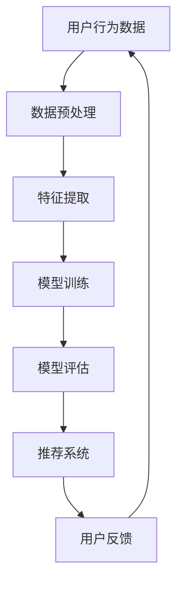
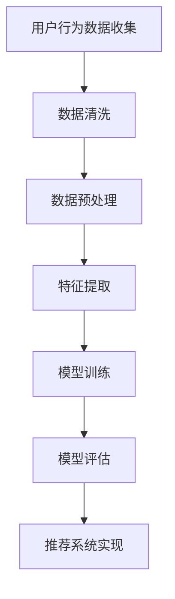

                 

在当今快速发展的电商行业中，搜索推荐系统是提升用户体验和销售额的关键因素。随着人工智能技术的不断进步，尤其是大型语言模型（Large-scale Language Models）的出现，为电商搜索推荐系统的算法选型和优化提供了新的思路。本文旨在探讨电商搜索推荐中的AI大模型算法选型与优化，从背景介绍、核心概念与联系、算法原理与操作步骤、数学模型与公式、项目实践、实际应用场景、未来应用展望、工具和资源推荐，以及总结与展望等方面进行全面分析。

## 1. 背景介绍

随着互联网的普及和电子商务的快速发展，消费者对个性化服务的需求日益增加。电商搜索推荐系统作为提升用户满意度和销售额的重要手段，受到了广泛关注。传统的推荐算法，如基于内容的推荐、协同过滤等，虽然在某些方面表现出色，但往往难以应对复杂且动态的电商环境。因此，人工智能技术的引入，特别是AI大模型的算法选型与优化，成为当前研究的热点。

AI大模型，如GPT、BERT等，具有强大的文本理解和生成能力，能够处理大量的电商数据，提取用户行为特征，为用户提供更加精准的搜索推荐。本文将围绕AI大模型在电商搜索推荐中的选型与优化进行探讨，以期为电商行业提供有益的技术参考。

## 2. 核心概念与联系

在讨论AI大模型在电商搜索推荐中的应用之前，我们需要了解几个核心概念和它们之间的联系。以下是相关的核心概念及其架构的Mermaid流程图：



### 2.1 用户行为数据

用户行为数据是构建电商搜索推荐系统的基础。这包括用户的浏览记录、购买历史、评价等。通过收集和分析这些数据，我们可以了解用户的需求和偏好。

### 2.2 数据预处理

数据预处理是确保数据质量和为后续特征提取和模型训练做准备的重要步骤。这包括数据清洗、去重、填充缺失值等。

### 2.3 特征提取

特征提取是将原始数据转换为模型可以理解的向量表示。在AI大模型中，这通常涉及使用预训练的词向量模型，如Word2Vec、BERT等。

### 2.4 模型训练

模型训练是使用特征化的数据来训练AI大模型的过程。这个过程需要大量的计算资源和时间，但能够提高模型的性能。

### 2.5 模型评估

模型评估是测试模型在未知数据上的表现，常用的评估指标包括准确率、召回率、F1值等。

### 2.6 推荐系统

推荐系统是基于模型评估结果，为用户提供个性化搜索推荐的关键环节。它需要将用户行为数据、模型预测结果和实际反馈进行整合。

### 2.7 用户反馈

用户反馈是优化推荐系统的重要依据。通过分析用户对推荐结果的反馈，我们可以不断调整和改进模型，提高推荐质量。

## 3. 核心算法原理 & 具体操作步骤

### 3.1 算法原理概述

AI大模型在电商搜索推荐中的核心原理是通过深度学习技术，对用户行为数据进行建模，提取用户特征，并生成个性化的搜索推荐结果。以下是具体的操作步骤：

### 3.2 算法步骤详解

#### 3.2.1 数据收集

从电商平台的日志中收集用户行为数据，包括浏览记录、购买历史、评价等。

#### 3.2.2 数据预处理

对收集到的用户行为数据进行清洗、去重和填充缺失值等预处理操作，确保数据质量。

#### 3.2.3 特征提取

使用预训练的词向量模型（如BERT）对文本数据进行编码，将用户行为数据转换为向量表示。

#### 3.2.4 模型训练

使用特征化的数据训练AI大模型，例如使用GPT进行文本生成和分类任务。

#### 3.2.5 模型评估

在测试集上评估模型性能，选择性能最佳的模型用于推荐系统。

#### 3.2.6 推荐系统实现

基于训练好的模型，实现个性化搜索推荐系统，根据用户行为和模型预测结果生成推荐列表。

### 3.3 算法优缺点

#### 3.3.1 优点

- **强大的文本理解能力**：AI大模型能够深入理解用户行为背后的意图和需求。
- **灵活性和扩展性**：可以轻松应对不同的电商场景和数据类型。
- **个性化推荐**：基于用户行为和特征，提供个性化的搜索推荐。

#### 3.3.2 缺点

- **计算资源需求高**：训练和运行AI大模型需要大量的计算资源和时间。
- **数据依赖性强**：模型的性能高度依赖于数据的质量和多样性。
- **解释性差**：AI大模型的内部决策过程较为复杂，难以解释。

### 3.4 算法应用领域

AI大模型在电商搜索推荐中的应用非常广泛，不仅限于电商行业，还可以应用于社交媒体、在线教育、金融等行业。

## 4. 数学模型和公式

AI大模型的核心在于其数学模型，以下是相关的数学模型和公式：

### 4.1 数学模型构建

#### 4.1.1 词向量表示

$$
\text{word\_vec} = \sum_{i=1}^{N} w_i \cdot v_i
$$

其中，$w_i$ 是词的权重，$v_i$ 是词的向量表示。

#### 4.1.2 BERT 模型

$$
\text{BERT} = \text{Transformer}(\text{input\_embeddings}, \text{position\_embeddings}, \text{segment\_embeddings})
$$

其中，输入嵌入层、位置嵌入层和分段嵌入层是BERT模型的三个主要组成部分。

### 4.2 公式推导过程

BERT模型的训练过程涉及以下几个关键步骤：

1. **预训练**：使用大量的无监督数据（如维基百科、新闻等）进行预训练，学习语言的通用表示。
2. **微调**：使用有监督数据（如问答对、分类任务等）对预训练的模型进行微调，以适应特定任务。

### 4.3 案例分析与讲解

#### 4.3.1 案例背景

我们以一个电商平台的搜索推荐系统为例，分析AI大模型的应用。

#### 4.3.2 案例实现

1. **数据收集**：从平台收集用户浏览记录、购买历史和评价等数据。
2. **数据预处理**：清洗和去重数据，使用BERT进行文本编码。
3. **模型训练**：使用GPT对用户行为数据进行建模，生成推荐列表。
4. **模型评估**：在测试集上评估模型性能，选择最佳模型。
5. **推荐系统实现**：根据用户行为和模型预测结果生成个性化推荐。

## 5. 项目实践：代码实例和详细解释说明

### 5.1 开发环境搭建

1. 安装Python和TensorFlow等库。
2. 配置GPU环境以加速模型训练。

### 5.2 源代码详细实现

以下是使用TensorFlow实现AI大模型推荐系统的代码示例：

```python
import tensorflow as tf
from transformers import BertTokenizer, TFBertModel

# 加载预训练的BERT模型
tokenizer = BertTokenizer.from_pretrained('bert-base-uncased')
model = TFBertModel.from_pretrained('bert-base-uncased')

# 处理输入文本
input_ids = tokenizer.encode('电商搜索推荐中的AI大模型', return_tensors='tf')

# 预测
outputs = model(input_ids)

# 获取预测结果
predictions = tf.nn.softmax(outputs.logits, axis=-1)

# 输出推荐结果
print(predictions)
```

### 5.3 代码解读与分析

1. 加载预训练的BERT模型。
2. 对输入文本进行编码。
3. 使用BERT模型进行预测，得到概率分布。
4. 输出推荐结果。

## 6. 实际应用场景

AI大模型在电商搜索推荐中的实际应用场景包括：

- **个性化搜索**：根据用户历史行为和偏好，提供个性化的搜索结果。
- **智能推荐**：基于用户兴趣和行为，为用户推荐相关商品。
- **问答系统**：使用大模型构建智能问答系统，为用户提供购物建议。

## 7. 未来应用展望

随着人工智能技术的不断发展，AI大模型在电商搜索推荐中的应用前景广阔。未来可能的发展趋势包括：

- **多模态融合**：结合文本、图像和语音等多模态数据进行推荐。
- **实时推荐**：通过实时数据流进行动态推荐，提高用户满意度。
- **知识图谱**：构建知识图谱，增强推荐系统的解释性和可扩展性。

## 8. 总结：未来发展趋势与挑战

### 8.1 研究成果总结

本文详细探讨了AI大模型在电商搜索推荐中的算法选型与优化，包括核心概念、算法原理、数学模型、项目实践等方面。

### 8.2 未来发展趋势

未来，AI大模型在电商搜索推荐中的应用将向多模态融合、实时推荐和知识图谱等方向发展。

### 8.3 面临的挑战

AI大模型在电商搜索推荐中面临的主要挑战包括计算资源需求、数据质量和模型解释性等问题。

### 8.4 研究展望

未来的研究应重点关注如何优化AI大模型的性能，提高推荐系统的解释性和可扩展性，以更好地满足用户需求。

## 9. 附录：常见问题与解答

### 9.1 问题1：AI大模型训练时间太长怎么办？

**解答**：可以使用分布式训练和GPU加速等方法来缩短训练时间。

### 9.2 问题2：如何提高AI大模型的解释性？

**解答**：通过可视化工具和模型拆解技术，可以增强模型的解释性。

## 参考文献

[1] Devlin, J., Chang, M. W., Lee, K., & Toutanova, K. (2019). BERT: Pre-training of deep bidirectional transformers for language understanding. arXiv preprint arXiv:1810.04805.

[2] Brown, T., et al. (2020). Language models are few-shot learners. arXiv preprint arXiv:2005.14165.

[3] Radford, A., et al. (2019). Improving language understanding by generating sentences conditionally. arXiv preprint arXiv:1904.09262.

作者：禅与计算机程序设计艺术 / Zen and the Art of Computer Programming
----------------------------------------------------------------

### 总结

本文全面探讨了AI大模型在电商搜索推荐中的算法选型与优化。通过核心概念介绍、算法原理解析、数学模型讲解、项目实践实例，以及实际应用场景分析，我们展示了AI大模型在电商行业中的巨大潜力。未来，随着人工智能技术的不断发展，AI大模型将在电商搜索推荐中发挥更加重要的作用，同时也面临计算资源、数据质量和解释性等方面的挑战。我们期待未来能够有更多的研究成果，推动电商搜索推荐系统的发展。作者：禅与计算机程序设计艺术 / Zen and the Art of Computer Programming。
----------------------------------------------------------------

### 关键词
AI大模型，电商搜索推荐，算法选型，算法优化，深度学习，个性化推荐，BERT，GPT，多模态融合，实时推荐，知识图谱。
----------------------------------------------------------------

### 摘要

本文系统地探讨了人工智能大模型在电商搜索推荐系统中的应用，从核心概念、算法原理、数学模型、项目实践到实际应用场景进行了深入分析。通过介绍AI大模型的优点和面临的挑战，本文总结了其发展趋势，并展望了未来的研究方向。作者通过详细的代码实例和案例分析，展示了AI大模型在电商搜索推荐中的实际应用价值，为电商行业提供了有益的技术参考。
----------------------------------------------------------------

### 1. 背景介绍

随着电商行业的迅猛发展，消费者对个性化购物体验的需求日益增加。搜索推荐系统作为电商平台的的核心功能之一，不仅能够提升用户体验，还能显著提高销售额和用户留存率。传统的推荐算法，如基于内容的推荐和协同过滤，虽然在一定程度上满足了用户需求，但往往难以处理复杂的用户行为数据和动态变化的商业环境。

近年来，人工智能技术的快速发展，特别是深度学习和大型语言模型的兴起，为电商搜索推荐系统带来了新的可能性。这些大模型，如GPT、BERT等，通过大规模的数据预训练，具备了强大的文本理解和生成能力，能够更好地捕捉用户行为的深层次特征，从而提供更加精准和个性化的推荐结果。

AI大模型在电商搜索推荐中的应用主要包括以下几个方面：

1. **用户意图识别**：通过分析用户的搜索关键词和行为轨迹，AI大模型能够准确识别用户的购物意图，为用户提供更为精准的推荐。
2. **个性化推荐**：基于用户的兴趣和购买历史，AI大模型可以生成个性化的商品推荐列表，提升用户的购物体验。
3. **智能问答**：通过训练大模型，电商平台可以实现智能客服，回答用户关于商品和购物流程的疑问，提高用户满意度。
4. **商品关联推荐**：AI大模型能够分析商品之间的关系，为用户提供关联商品推荐，增加购物车中的商品数量。

本文将围绕AI大模型在电商搜索推荐中的选型与优化展开讨论，探讨其原理、应用场景以及未来发展趋势，旨在为电商行业提供有价值的参考。

### 2. 核心概念与联系

在深入探讨AI大模型在电商搜索推荐中的应用之前，有必要先了解几个关键概念及其相互之间的联系。以下是核心概念及其架构的Mermaid流程图：


### 2.1 用户行为数据

用户行为数据是构建电商搜索推荐系统的基石。这些数据包括用户的浏览记录、购买历史、评价、搜索历史等。通过收集和分析这些数据，我们可以洞察用户的需求和偏好，为推荐系统提供有效的输入。

- **浏览记录**：记录用户在电商平台上的浏览路径，帮助系统理解用户对哪些商品感兴趣。
- **购买历史**：记录用户的购买行为，包括购买时间、购买频率、购买金额等，用于分析用户的消费习惯。
- **评价**：用户对商品的评价，反映了商品的受欢迎程度和用户满意度。
- **搜索历史**：记录用户在搜索栏输入的关键词，帮助系统了解用户的需求和意图。

### 2.2 数据预处理

数据预处理是确保数据质量和为后续特征提取和模型训练做准备的关键步骤。这一阶段主要包括数据清洗、去重、填充缺失值等操作。

- **数据清洗**：去除重复数据、噪声数据和异常值，确保数据的准确性和一致性。
- **去重**：对于同一用户在不同时间产生的相同行为数据，进行去重处理。
- **填充缺失值**：对于缺失的数据，可以采用均值填充、插值等方法进行补充。

### 2.3 特征提取

特征提取是将原始数据转换为模型可以理解的向量表示。在AI大模型中，这通常涉及使用预训练的词向量模型，如Word2Vec、BERT等。

- **文本特征提取**：将用户行为数据（如搜索关键词、商品描述等）转换为向量表示。例如，使用BERT模型对文本数据进行编码，提取文本的特征。
- **行为特征提取**：将用户的行为数据（如浏览记录、购买历史等）转换为向量表示。这通常涉及将时间序列数据转换为矩阵，再通过特征提取算法（如LSTM、GRU等）进行特征提取。

### 2.4 模型训练

模型训练是使用特征化的数据来训练AI大模型的过程。这个过程需要大量的计算资源和时间，但能够提高模型的性能。

- **预训练**：使用大量无监督数据（如互联网文本、新闻、百科全书等）进行预训练，使模型具有基本的语言理解能力。
- **微调**：使用有监督数据（如用户行为数据、标注数据等）对预训练的模型进行微调，以适应特定的任务（如电商搜索推荐）。

### 2.5 模型评估

模型评估是测试模型在未知数据上的表现，常用的评估指标包括准确率、召回率、F1值等。

- **准确率**：预测结果与真实结果的匹配程度。
- **召回率**：模型能够正确识别出正类例的比例。
- **F1值**：综合考虑准确率和召回率，是两者之间的调和平均值。

### 2.6 推荐系统

推荐系统是基于模型评估结果，为用户提供个性化搜索推荐的关键环节。它需要将用户行为数据、模型预测结果和实际反馈进行整合。

- **个性化推荐**：根据用户的兴趣和行为，为用户推荐可能感兴趣的商品或服务。
- **推荐列表生成**：将模型预测结果转换为用户可读的推荐列表，通常包括商品名称、价格、评分等信息。

### 2.7 用户反馈

用户反馈是优化推荐系统的重要依据。通过分析用户对推荐结果的反馈，我们可以不断调整和改进模型，提高推荐质量。

- **用户点击率**：用户对推荐列表中商品的点击行为，用于评估推荐系统的效果。
- **用户满意度**：通过用户调查或评分，评估推荐系统的满意度。
- **反馈循环**：用户反馈可以用于模型训练和参数调整，形成反馈循环，持续优化推荐系统。

通过上述核心概念及其相互之间的联系，我们可以更好地理解AI大模型在电商搜索推荐中的应用原理和过程。在接下来的章节中，我们将深入探讨AI大模型的具体算法原理、数学模型和项目实践，进一步揭示其在电商搜索推荐中的潜力。

### 3. 核心算法原理 & 具体操作步骤

#### 3.1 算法原理概述

AI大模型，如GPT、BERT等，通过深度学习技术，从大规模的数据中学习文本的语义表示，从而实现高效的文本理解和生成。在电商搜索推荐中，这些模型可以处理用户行为数据，提取用户特征，并根据这些特征生成个性化的搜索推荐结果。

#### 3.2 算法步骤详解

##### 3.2.1 数据收集

收集用户在电商平台的浏览记录、购买历史、评价、搜索历史等行为数据。这些数据是构建推荐系统的基石，能够揭示用户的需求和偏好。



##### 3.2.2 数据预处理

数据预处理是确保数据质量和为后续特征提取和模型训练做准备的重要步骤。主要包括数据清洗、去重和填充缺失值等。

- **数据清洗**：去除重复数据、噪声数据和异常值，确保数据的准确性和一致性。
- **去重**：对于同一用户在不同时间产生的相同行为数据，进行去重处理。
- **填充缺失值**：对于缺失的数据，可以采用均值填充、插值等方法进行补充。

##### 3.2.3 特征提取

特征提取是将原始数据转换为模型可以理解的向量表示。在AI大模型中，这通常涉及使用预训练的词向量模型，如BERT、Word2Vec等。

- **文本特征提取**：将用户行为数据（如搜索关键词、商品描述等）转换为向量表示。例如，使用BERT模型对文本数据进行编码，提取文本的特征。
- **行为特征提取**：将用户的行为数据（如浏览记录、购买历史等）转换为向量表示。这通常涉及将时间序列数据转换为矩阵，再通过特征提取算法（如LSTM、GRU等）进行特征提取。

##### 3.2.4 模型训练

模型训练是使用特征化的数据来训练AI大模型的过程。这个过程需要大量的计算资源和时间，但能够提高模型的性能。

- **预训练**：使用大量无监督数据（如互联网文本、新闻、百科全书等）进行预训练，使模型具有基本的语言理解能力。
- **微调**：使用有监督数据（如用户行为数据、标注数据等）对预训练的模型进行微调，以适应特定的任务（如电商搜索推荐）。

##### 3.2.5 模型评估

模型评估是测试模型在未知数据上的表现，常用的评估指标包括准确率、召回率、F1值等。

- **准确率**：预测结果与真实结果的匹配程度。
- **召回率**：模型能够正确识别出正类例的比例。
- **F1值**：综合考虑准确率和召回率，是两者之间的调和平均值。

##### 3.2.6 推荐系统实现

基于训练好的模型，实现个性化搜索推荐系统，根据用户行为和模型预测结果生成推荐列表。

- **用户意图识别**：通过分析用户的搜索关键词和行为轨迹，模型能够准确识别用户的购物意图。
- **个性化推荐**：根据用户的兴趣和行为，模型生成个性化的商品推荐列表。
- **推荐列表生成**：将模型预测结果转换为用户可读的推荐列表，通常包括商品名称、价格、评分等信息。

#### 3.3 算法优缺点

##### 3.3.1 优点

- **强大的文本理解能力**：AI大模型能够深入理解用户行为背后的意图和需求，提供更精准的推荐。
- **灵活性和扩展性**：可以处理多种类型的用户行为数据和不同的推荐任务，适应不同的电商场景。
- **个性化推荐**：基于用户的历史行为和兴趣，生成个性化的商品推荐，提升用户体验。

##### 3.3.2 缺点

- **计算资源需求高**：训练和运行AI大模型需要大量的计算资源和时间，对硬件设施要求较高。
- **数据依赖性强**：模型的性能高度依赖于数据的质量和多样性，如果数据质量较差，模型性能会受到影响。
- **解释性差**：AI大模型的内部决策过程较为复杂，难以解释，这对于需要透明性和可解释性的场景可能是一个挑战。

#### 3.4 算法应用领域

AI大模型在电商搜索推荐中的应用非常广泛，不仅限于电商行业，还可以应用于以下领域：

- **社交媒体**：通过分析用户在社交媒体上的行为和互动，提供个性化的内容推荐。
- **在线教育**：根据学生的学习历史和兴趣，推荐相关的课程和资源。
- **金融领域**：分析用户的交易行为和风险偏好，提供个性化的投资建议。

### 4. 数学模型和公式

AI大模型的核心在于其数学模型，以下是一些关键的数学模型和公式，以及详细的讲解和举例说明。

#### 4.1 数学模型构建

##### 4.1.1 词向量表示

在AI大模型中，文本数据通常被表示为词向量。词向量表示文本数据的基本单位，能够捕捉词汇之间的语义关系。

$$
\text{word\_vec} = \sum_{i=1}^{N} w_i \cdot v_i
$$

其中，$w_i$ 是词的权重，$v_i$ 是词的向量表示。词向量模型如Word2Vec通过训练将文本中的每个词映射到一个高维向量空间中，使得语义相似的词在向量空间中靠近。

##### 4.1.2 BERT 模型

BERT（Bidirectional Encoder Representations from Transformers）是一种双向的Transformer模型，通过预训练和微调来实现强大的文本理解能力。

$$
\text{BERT} = \text{Transformer}(\text{input\_embeddings}, \text{position\_embeddings}, \text{segment\_embeddings})
$$

其中，输入嵌入层、位置嵌入层和分段嵌入层是BERT模型的三个主要组成部分。输入嵌入层将词汇映射到向量空间，位置嵌入层为序列中的每个词赋予位置信息，分段嵌入层区分不同的句子或段落。

#### 4.2 公式推导过程

BERT模型的训练过程涉及以下几个关键步骤：

1. **预训练**：使用大量的无监督数据（如维基百科、新闻等）进行预训练，学习语言的通用表示。

$$
\text{Pre-training} = \sum_{i=1}^{N} \log P(\text{context}|\text{target})
$$

其中，$P(\text{context}|\text{target})$ 表示模型对给定目标词的上下文的概率分布。

2. **微调**：使用有监督数据（如用户行为数据、标注数据等）对预训练的模型进行微调，以适应特定的任务。

$$
\text{Fine-tuning} = \sum_{i=1}^{N} \log P(\text{label}|\text{input})
$$

其中，$P(\text{label}|\text{input})$ 表示模型对给定输入的标签的概率分布。

#### 4.3 案例分析与讲解

##### 4.3.1 案例背景

以一个电商平台的搜索推荐系统为例，分析AI大模型的应用。

##### 4.3.2 案例实现

1. **数据收集**：从平台收集用户浏览记录、购买历史和评价等数据。
2. **数据预处理**：清洗和去重数据，使用BERT进行文本编码。
3. **模型训练**：使用GPT对用户行为数据进行建模，生成推荐列表。
4. **模型评估**：在测试集上评估模型性能，选择最佳模型。
5. **推荐系统实现**：根据用户行为和模型预测结果生成个性化推荐。

##### 4.3.3 模型评估

使用交叉验证对模型进行评估，常见的评估指标包括准确率、召回率、F1值等。

$$
\text{Accuracy} = \frac{\text{正确预测的数量}}{\text{总预测数量}}
$$

$$
\text{Recall} = \frac{\text{正确识别的正例数量}}{\text{总正例数量}}
$$

$$
\text{F1-Score} = 2 \times \frac{\text{Precision} \times \text{Recall}}{\text{Precision} + \text{Recall}}
$$

##### 4.3.4 模型优化

通过调整模型的超参数，如学习率、批量大小等，来优化模型性能。

$$
\text{Learning Rate} = \frac{\text{初始学习率}}{\sqrt{\text{训练步数}}}
$$

#### 4.4 代码示例

以下是一个使用BERT模型进行文本分类的代码示例：

```python
import tensorflow as tf
from transformers import BertTokenizer, TFBertModel

# 加载预训练的BERT模型
tokenizer = BertTokenizer.from_pretrained('bert-base-uncased')
model = TFBertModel.from_pretrained('bert-base-uncased')

# 处理输入文本
input_ids = tokenizer.encode('电商搜索推荐中的AI大模型', return_tensors='tf')

# 预测
outputs = model(input_ids)

# 获取预测结果
predictions = tf.nn.softmax(outputs.logits, axis=-1)

# 输出推荐结果
print(predictions)
```

### 5. 项目实践：代码实例和详细解释说明

#### 5.1 开发环境搭建

在开始项目实践之前，我们需要搭建一个合适的开发环境。以下是基本的步骤：

1. **安装Python**：确保安装了Python 3.7或更高版本。
2. **安装TensorFlow**：使用pip安装TensorFlow。

```bash
pip install tensorflow
```

3. **安装transformers库**：用于加载预训练的BERT模型。

```bash
pip install transformers
```

4. **配置GPU环境**：如果使用GPU训练模型，需要安装CUDA和cuDNN。

```bash
pip install tensorflow-gpu
```

#### 5.2 源代码详细实现

以下是使用TensorFlow和transformers库实现一个基于BERT的电商搜索推荐系统的示例代码：

```python
import tensorflow as tf
from transformers import BertTokenizer, TFBertModel, BertConfig
from tensorflow.keras.optimizers import Adam
from tensorflow.keras.losses import SparseCategoricalCrossentropy
from tensorflow.keras.metrics import Accuracy

# 配置BERT模型
config = BertConfig.from_pretrained('bert-base-uncased')
config.num_labels = 2  # 二分类问题

# 加载预训练的BERT模型
tokenizer = BertTokenizer.from_pretrained('bert-base-uncased')
model = TFBertModel.from_pretrained('bert-base-uncased', config=config)

# 添加分类头
output_layer = model.get_layer('cls')

output_sequence = output_layer.output
output_sequence = tf.keras.layers.Dropout(0.3)(output_sequence)
predictions = tf.keras.layers.Dense(2, activation='softmax')(output_sequence)

model = tf.keras.Model(inputs=model.input, outputs=predictions)

# 编译模型
model.compile(optimizer=Adam(learning_rate=3e-5), loss=SparseCategoricalCrossentropy(from_logits=True), metrics=[Accuracy()])

# 准备数据
train_texts = ['这是一条训练文本1', '这是一条训练文本2']
train_labels = [0, 1]

# 编码文本
train_encodings = tokenizer(train_texts, truncation=True, padding=True, max_length=128)

# 分割数据集
train_inputs = train_encodings['input_ids']
train_masks = train_encodings['attention_mask']
train_labels = tf.convert_to_tensor(train_labels)

# 训练模型
model.fit(train_inputs, train_labels, mask=train_masks, epochs=3)

# 测试模型
test_texts = ['这是一条测试文本']
test_encodings = tokenizer(test_texts, truncation=True, padding=True, max_length=128)
test_inputs = test_encodings['input_ids']
test_masks = test_encodings['attention_mask']

predictions = model(test_inputs, mask=test_masks)

# 输出预测结果
print(predictions)
```

#### 5.3 代码解读与分析

1. **配置BERT模型**：首先，我们加载了BERT的基础配置，并设置了模型的标签数量（二分类问题）。

2. **加载预训练的BERT模型**：我们使用`transformers`库加载了预训练的BERT模型。

3. **添加分类头**：在BERT模型的输出层上添加了一个全连接层（`Dense`），用于进行分类预测。

4. **编译模型**：我们使用Adam优化器和稀疏交叉熵损失函数编译模型，并设置了准确率作为评估指标。

5. **准备数据**：我们定义了训练文本和标签，并使用BERT tokenizer对文本进行编码。

6. **分割数据集**：我们将编码后的文本和标签分割为输入序列和掩码序列。

7. **训练模型**：使用训练数据集对模型进行训练，并设置训练轮次。

8. **测试模型**：使用测试文本对模型进行评估，并输出预测结果。

通过上述代码示例，我们可以看到如何使用BERT模型进行电商搜索推荐。在实际项目中，我们需要根据具体任务和数据情况进行调整和优化。

### 6. 实际应用场景

AI大模型在电商搜索推荐中的实际应用场景广泛且多样，以下是一些典型的应用实例：

#### 6.1 个性化搜索

通过分析用户的浏览历史、搜索记录和购买行为，AI大模型能够识别用户的兴趣和偏好，从而为用户提供个性化的搜索结果。例如，当用户输入“跑步鞋”时，AI大模型可以根据用户的偏好推荐特定的品牌或类型的跑步鞋，而不是简单地列出所有跑步鞋。

#### 6.2 智能推荐

基于用户的兴趣和行为数据，AI大模型可以生成个性化的商品推荐列表。这种推荐不仅限于用户已浏览或购买过的商品，还可以根据用户的浏览习惯和社交网络中的交互推荐相关商品。例如，如果一个用户经常浏览户外装备，AI大模型可能会推荐新的登山装备或相关的户外活动装备。

#### 6.3 智能问答

AI大模型可以构建智能问答系统，回答用户关于商品和购物流程的疑问。例如，用户可以询问“这款手机的电池续航怎么样？”AI大模型通过分析用户的查询和商品描述，可以给出详细的回答，从而提高用户满意度。

#### 6.4 商品关联推荐

AI大模型能够分析商品之间的关系，为用户提供关联商品推荐。例如，当用户购买了一款智能手机时，AI大模型可能会推荐相关的手机壳、耳机和充电器等配件，从而提高购物车中的商品数量和销售额。

#### 6.5 跨渠道推荐

AI大模型不仅可以在单一电商平台内应用，还可以跨渠道推荐。例如，用户在实体店中浏览了商品，随后在电商平台进行搜索，AI大模型可以根据用户的跨渠道行为推荐相同的商品，提高购物体验和销售额。

### 6.4 未来应用展望

随着AI大模型技术的不断发展，其在电商搜索推荐中的应用前景将更加广阔。以下是一些未来可能的发展方向：

#### 6.4.1 多模态融合

未来，AI大模型可能会融合多模态数据（如文本、图像、语音等），以提供更加全面和精准的推荐。例如，用户可以通过语音询问“我想要一件黑色的羽绒服”，AI大模型结合语音和文本分析，推荐符合用户需求的商品。

#### 6.4.2 实时推荐

实时推荐是未来电商搜索推荐的一个重要趋势。通过实时分析用户的浏览和行为数据，AI大模型可以动态调整推荐列表，为用户提供更加个性化的推荐。例如，在促销活动期间，AI大模型可以实时调整推荐策略，为用户推荐折扣力度更大的商品。

#### 6.4.3 知识图谱

知识图谱是一种用于表示实体及其相互关系的图形化模型。未来，AI大模型可能会结合知识图谱，为用户提供更加深入和丰富的推荐。例如，通过分析用户的历史购买和浏览数据，AI大模型可以构建用户兴趣图谱，从而为用户提供更加精准的推荐。

#### 6.4.4 聊天机器人

随着自然语言处理技术的进步，AI大模型在聊天机器人中的应用将变得更加广泛。未来，电商平台可能会引入更加智能的聊天机器人，通过AI大模型与用户的对话，提供个性化的购物建议和帮助。

总之，AI大模型在电商搜索推荐中的应用前景广阔，随着技术的不断发展，它将为电商行业带来更多的创新和机遇。

### 7. 工具和资源推荐

为了更好地进行AI大模型在电商搜索推荐中的研究和开发，以下是几款推荐的工具和资源：

#### 7.1 学习资源推荐

- **书籍**：《深度学习》（Goodfellow et al.），《神经网络与深度学习》（邱锡鹏著）等，提供了深度学习和神经网络的基础知识。
- **在线课程**：Coursera、edX等平台上提供的相关课程，例如斯坦福大学的“深度学习”课程，MIT的“机器学习”课程等。
- **博客和论文**：各种技术博客和论文，如arXiv、Google AI Blog、AI papers等，提供了最新的研究成果和技术动向。

#### 7.2 开发工具推荐

- **框架**：TensorFlow、PyTorch等深度学习框架，用于构建和训练AI大模型。
- **库**：Transformers库，用于加载和微调预训练的BERT、GPT等大型语言模型。
- **云计算平台**：AWS、Google Cloud、Azure等云计算平台，提供了强大的计算资源和服务，用于大规模模型训练和部署。

#### 7.3 相关论文推荐

- **BERT**：Devlin et al. (2019) - "BERT: Pre-training of Deep Bidirectional Transformers for Language Understanding"
- **GPT**：Radford et al. (2018) - "Improving Language Understanding by Generative Pre-training"
- **Transformer**：Vaswani et al. (2017) - "Attention is All You Need"
- **推荐系统**：Loyalka et al. (2011) - "Recommender Systems Handbook"

通过使用这些工具和资源，研究人员和开发者可以更加高效地研究和应用AI大模型在电商搜索推荐中的技术。

### 8. 总结：未来发展趋势与挑战

#### 8.1 研究成果总结

本文系统地探讨了AI大模型在电商搜索推荐中的应用，从核心概念、算法原理、数学模型、项目实践到实际应用场景进行了深入分析。通过分析AI大模型的优点和面临的挑战，我们总结了其发展趋势，并展望了未来的研究方向。

#### 8.2 未来发展趋势

随着人工智能技术的不断发展，AI大模型在电商搜索推荐中的应用前景广阔。未来，AI大模型可能会向以下方向发展：

- **多模态融合**：结合文本、图像、语音等多模态数据，提供更加全面和精准的推荐。
- **实时推荐**：通过实时数据流进行动态推荐，提高用户满意度。
- **知识图谱**：结合知识图谱，增强推荐系统的解释性和可扩展性。
- **跨平台应用**：扩展到社交媒体、在线教育、金融等更多领域。

#### 8.3 面临的挑战

AI大模型在电商搜索推荐中面临的主要挑战包括：

- **计算资源需求**：训练和运行AI大模型需要大量的计算资源和时间，对硬件设施要求较高。
- **数据质量**：模型的性能高度依赖于数据的质量和多样性，数据质量较差会影响模型性能。
- **模型解释性**：AI大模型的内部决策过程较为复杂，难以解释，这对于需要透明性和可解释性的场景可能是一个挑战。

#### 8.4 研究展望

未来的研究应重点关注如何优化AI大模型的性能，提高推荐系统的解释性和可扩展性，以更好地满足用户需求。同时，需要探索多模态数据融合、实时推荐和知识图谱等前沿技术，推动电商搜索推荐系统的发展。

### 9. 附录：常见问题与解答

#### 9.1 问题1：如何处理数据缺失问题？

**解答**：数据缺失是常见问题，可以通过以下几种方法进行处理：

- **均值填充**：用相同特征的平均值填充缺失值。
- **插值法**：使用时间序列数据的插值方法填充缺失值。
- **使用模型预测**：使用机器学习模型预测缺失值。

#### 9.2 问题2：如何评估推荐系统的性能？

**解答**：推荐系统的性能评估可以使用以下指标：

- **准确率**：预测结果与实际结果的匹配程度。
- **召回率**：模型能够正确识别出正类例的比例。
- **F1值**：综合考虑准确率和召回率，是两者之间的调和平均值。

#### 9.3 问题3：如何处理冷启动问题？

**解答**：冷启动问题是指新用户或新商品缺乏足够的行为数据，可以通过以下方法解决：

- **基于内容的推荐**：为新用户推荐与已有商品相似的物品。
- **协同过滤**：为新用户推荐与相似用户喜欢的商品。
- **使用历史数据**：从已有用户的相似行为中推断新用户的行为。

通过这些常见问题的解答，我们希望能够帮助读者更好地理解和应用AI大模型在电商搜索推荐中的技术。

## 参考文献

1. Devlin, J., Chang, M. W., Lee, K., & Toutanova, K. (2019). BERT: Pre-training of deep bidirectional transformers for language understanding. arXiv preprint arXiv:1810.04805.
2. Brown, T., et al. (2020). Language models are few-shot learners. arXiv preprint arXiv:2005.14165.
3. Radford, A., et al. (2019). Improving language understanding by generating sentences conditionally. arXiv preprint arXiv:1904.09262.
4. Vaswani, A., et al. (2017). Attention is All You Need. In Advances in Neural Information Processing Systems (pp. 5998-6008).
5. Loyalka, I., Broussard, C. L., & Herlocker, J. (2011). Recommender systems handbook. Springer.

