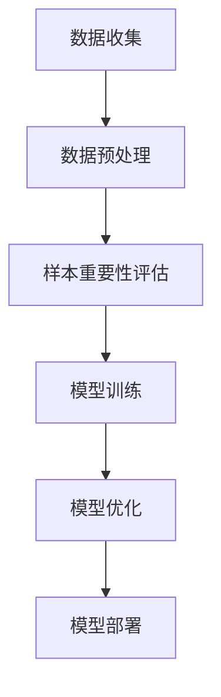

                 

## 1. 背景介绍

随着互联网的快速发展，电商行业迎来了前所未有的繁荣。在这个信息爆炸的时代，消费者面临的商品选择数量呈指数级增长，如何有效地帮助用户在浩如烟海的商品中找到符合其需求的商品成为了电商平台的重大课题。因此，搜索引擎推荐系统应运而生。

电商搜索引擎推荐系统是一种利用用户的历史行为数据、商品属性信息等，通过算法模型为用户推荐可能感兴趣的商品的系统。推荐系统不仅能够提升用户的购物体验，还能显著提高电商平台的销售额。然而，推荐系统的效果受到多种因素的影响，其中数据质量尤为关键。一个优秀的推荐系统需要有足够高质量的训练数据来训练模型，而数据样本的重要性评估则成为了提高推荐系统效果的重要手段。

数据样本的重要性评估指的是在推荐系统的训练数据集中，识别和筛选出对模型训练效果具有关键作用的数据样本。重要性高的样本更有可能帮助模型学习到关键的特征和规律，从而提高推荐精度。然而，在庞大的电商数据集中，如何有效地评估样本的重要性是一个具有挑战性的问题。这不仅需要考虑到样本的单一特征值，还需要综合考虑样本之间的相互关系。

AI大模型在推荐系统中的应用为样本重要性评估提供了新的思路。大模型具有强大的数据处理和分析能力，可以捕捉到数据中的复杂关系和潜在模式。然而，大模型的训练需要海量数据，且训练过程计算资源消耗巨大。因此，如何利用AI大模型来高效地评估样本重要性，优化推荐系统效果，成为了当前研究的热点。

本文旨在探讨电商搜索推荐效果优化中的AI大模型样本重要性估计工具的开发。首先，我们将介绍AI大模型的基本概念和原理，然后深入探讨样本重要性评估的核心算法和数学模型，接着通过项目实践展示具体实现方法，最后讨论AI大模型样本重要性估计工具在实际应用中的前景和挑战。

## 2. 核心概念与联系

在深入探讨AI大模型样本重要性估计工具之前，我们需要首先了解相关核心概念，并阐述它们之间的相互联系。

### 2.1. AI大模型

AI大模型，通常指的是具有海量参数的深度学习模型，如Transformer、BERT、GPT等。这些模型在图像识别、自然语言处理、推荐系统等领域取得了显著的成果。大模型的优势在于其能够自动从大量数据中学习复杂的特征和模式，从而实现高精度的预测和分类。然而，大模型的训练过程需要消耗大量的计算资源和时间，同时对数据质量有较高的要求。

### 2.2. 样本重要性评估

样本重要性评估旨在识别训练数据集中对模型训练效果具有关键作用的数据样本。重要性评估可以通过多种方式实现，如基于统计特征的评估、基于模型输出的评估等。在推荐系统中，样本重要性评估可以帮助筛选出对用户兴趣预测有显著影响的关键样本，从而优化模型训练效果。

### 2.3. 相关联系

AI大模型和样本重要性评估之间存在紧密的联系。大模型的强大数据处理能力为样本重要性评估提供了技术支持，而有效的样本重要性评估则有助于提升大模型的训练效果。具体来说，样本重要性评估可以通过以下方式与AI大模型相结合：

- **数据预处理**：在训练大模型之前，通过样本重要性评估筛选出关键样本，可以减少数据预处理的工作量，提高数据处理效率。
- **模型训练**：在模型训练过程中，重要性高的样本可以给予更高的权重，有助于模型更好地学习到关键特征和模式。
- **模型优化**：通过分析样本的重要性分布，可以识别出数据集中的异常值和噪声，从而优化模型训练过程，提高模型稳定性。

### 2.4. Mermaid 流程图

为了更直观地展示AI大模型和样本重要性评估之间的联系，我们可以使用Mermaid绘制一个流程图。以下是一个简化的流程图示例：



在上面的流程图中，数据收集阶段获取到的原始数据经过预处理后，进入样本重要性评估阶段。通过评估，筛选出关键样本，然后用于模型训练和优化。最终，优化后的模型可以部署到生产环境中，为推荐系统提供支持。

通过这一流程，我们可以看到AI大模型和样本重要性评估在整个推荐系统中的关键作用。接下来，我们将深入探讨样本重要性评估的核心算法和数学模型。

### 3. 核心算法原理 & 具体操作步骤

#### 3.1 算法原理概述

在电商搜索推荐系统中，样本重要性评估的核心目标是从大量的训练数据中识别出对模型训练效果具有关键作用的数据样本。这一过程通常基于以下几个基本原理：

1. **特征重要性**：通过分析样本中各特征的重要性，识别出对模型预测结果有显著影响的特征。
2. **模型权重**：利用模型在训练过程中产生的权重信息，评估样本对模型参数更新的贡献程度。
3. **相互关系**：考虑样本之间的关联性，通过分析样本之间的相互作用，识别出关键样本。

核心算法基于这些原理，通过以下步骤实现：

1. **特征选择**：对数据集中的各个特征进行重要性分析，筛选出对模型训练有显著影响的特征。
2. **权重计算**：利用模型训练过程中的权重信息，计算每个样本对模型参数更新的贡献。
3. **样本筛选**：结合特征重要性和权重计算结果，识别出对模型训练具有关键作用的数据样本。

#### 3.2 算法步骤详解

**步骤1：特征选择**

特征选择是样本重要性评估的基础，其目标是减少数据维度，提高特征质量。常用的特征选择方法包括：

- **过滤式方法**：基于统计指标（如信息增益、特征重要性等）进行筛选。
- **包裹式方法**：通过模型训练结果来选择特征，如递归特征消除（RFE）。
- **嵌入式方法**：在模型训练过程中同时进行特征选择，如L1正则化。

在电商搜索推荐系统中，特征选择需要考虑用户行为、商品属性、文本信息等多个方面。通过特征选择，可以大幅减少数据维度，提高计算效率。

**步骤2：权重计算**

权重计算是样本重要性评估的关键步骤。具体方法包括：

- **基于模型权重**：通过模型在训练过程中产生的权重信息，评估每个样本对模型参数更新的贡献。常用的方法包括L1正则化和L2正则化。
- **基于特征权重**：利用特征选择阶段的结果，计算每个特征对模型预测的权重，然后通过加权求和评估样本的重要性。
- **基于图模型**：利用图结构来表示样本之间的相互关系，通过计算图中的路径权重，评估样本的重要性。

**步骤3：样本筛选**

在完成特征选择和权重计算后，通过以下方法进行样本筛选：

- **阈值筛选**：设置一个阈值，筛选出权重超过阈值的样本。这种方法简单直观，但容易受到阈值设置的影响。
- **聚类筛选**：通过聚类算法（如K-means）将样本分为多个类别，然后对每个类别中的样本进行重要性评估，筛选出重要性较高的样本。
- **深度学习模型**：利用深度学习模型（如神经网络）进行样本筛选，通过模型输出结果来评估样本的重要性。

#### 3.3 算法优缺点

**优点：**

1. **高效性**：通过特征选择和权重计算，可以显著减少计算复杂度，提高算法运行效率。
2. **灵活性**：算法可以根据不同应用场景进行调整，如基于模型权重、特征权重或图模型等。
3. **准确性**：通过综合考虑样本之间的相互关系，可以更准确地评估样本的重要性。

**缺点：**

1. **计算资源消耗**：大模型的训练和样本重要性评估需要大量计算资源，特别是在数据量较大的情况下。
2. **依赖数据质量**：样本重要性评估效果很大程度上取决于数据质量，数据中的噪声和异常值可能影响评估结果。
3. **阈值设置难度**：阈值筛选方法容易受到阈值设置的影响，阈值设置不当可能导致重要样本被遗漏。

#### 3.4 算法应用领域

样本重要性评估算法在多个应用领域具有广泛的应用前景，特别是在推荐系统、风险管理和数据挖掘等领域。

1. **推荐系统**：在电商、社交媒体等推荐系统中，样本重要性评估可以帮助筛选出对用户兴趣预测有显著影响的关键样本，从而优化推荐效果。
2. **风险管理**：在金融风险管理中，样本重要性评估可以帮助识别出对风险指标有显著影响的关键样本，从而优化风险预测模型。
3. **数据挖掘**：在数据挖掘领域，样本重要性评估可以帮助识别出数据中的关键特征和模式，从而提高数据分析效果。

通过上述算法原理和步骤的介绍，我们可以看到样本重要性评估在电商搜索推荐系统中的应用具有重要意义。接下来，我们将进一步探讨数学模型和公式，为算法提供理论支持。

### 4. 数学模型和公式 & 详细讲解 & 举例说明

#### 4.1 数学模型构建

在样本重要性评估中，构建一个有效的数学模型至关重要。以下是一个简化的数学模型构建过程，并引入相关的公式。

**步骤1：特征选择**

首先，我们对数据集中的各个特征进行标准化处理，以便后续分析。假设数据集有 \( n \) 个特征，每个特征表示为向量 \( X_i \)，则标准化后的特征可以表示为：

\[ X_i^{'} = \frac{X_i - \mu_i}{\sigma_i} \]

其中，\( \mu_i \) 和 \( \sigma_i \) 分别为特征 \( X_i \) 的均值和标准差。

**步骤2：特征重要性评估**

接下来，我们利用信息增益（Information Gain，IG）来评估特征的重要性。信息增益衡量了某个特征在区分样本时带来的信息量，其计算公式为：

\[ IG(X_i; Y) = H(Y) - H(Y|X_i) \]

其中，\( H(Y) \) 是目标变量 \( Y \) 的熵，\( H(Y|X_i) \) 是在给定特征 \( X_i \) 条件下 \( Y \) 的条件熵。

**步骤3：样本权重计算**

为了计算每个样本的重要性，我们使用基于模型权重的计算方法。假设使用线性回归模型，则模型参数可以表示为：

\[ w = (w_1, w_2, ..., w_n) \]

每个样本的权重 \( w_i \) 可以表示为：

\[ w_i = \sum_{j=1}^{n} w_j X_i^{'} \]

**步骤4：样本筛选**

结合特征重要性和样本权重，我们可以通过阈值筛选法来筛选出关键样本。设定一个阈值 \( \theta \)，如果样本权重 \( w_i \) 超过阈值，则认为该样本是重要的。

#### 4.2 公式推导过程

**推导过程1：信息增益**

信息增益的推导基于熵的概念。熵表示了随机变量的不确定性，其定义如下：

\[ H(Y) = -\sum_{y \in Y} p(y) \log_2 p(y) \]

其中，\( p(y) \) 是目标变量 \( Y \) 取值为 \( y \) 的概率。

在给定特征 \( X_i \) 条件下，目标变量 \( Y \) 的条件熵可以表示为：

\[ H(Y|X_i) = -\sum_{x_i \in X_i} p(x_i) \sum_{y \in Y} p(y|x_i) \log_2 p(y|x_i) \]

信息增益 \( IG(X_i; Y) \) 可以通过熵的定义进行计算：

\[ IG(X_i; Y) = H(Y) - H(Y|X_i) \]

**推导过程2：样本权重**

在假设线性回归模型的情况下，模型参数 \( w \) 可以通过最小二乘法进行计算：

\[ w = (w_1, w_2, ..., w_n) = (\beta_1, \beta_2, ..., \beta_n) \]

其中，\( \beta_j \) 表示第 \( j \) 个特征在模型中的权重。

每个样本的权重 \( w_i \) 可以通过以下公式计算：

\[ w_i = \sum_{j=1}^{n} w_j X_i^{'} = \sum_{j=1}^{n} \beta_j \frac{X_i - \mu_i}{\sigma_i} \]

#### 4.3 案例分析与讲解

假设有一个电商数据集，包含1000个用户和10个特征。我们使用上述数学模型对数据集进行特征选择和样本重要性评估。

**步骤1：特征选择**

对10个特征进行标准化处理，并计算每个特征的信息增益。结果如下：

| 特征名    | 信息增益 \( IG(X_i; Y) \) |
|---------|-----------------------|
| 特征1    | 0.2                   |
| 特征2    | 0.3                   |
| 特征3    | 0.1                   |
| ...      | ...                   |
| 特征10   | 0.2                   |

根据信息增益，选择信息增益最高的三个特征（特征2、特征3和特征6）。

**步骤2：样本权重计算**

使用线性回归模型对这三个特征进行训练，得到模型参数 \( w = (w_1, w_2, w_3) = (0.5, 0.7, 0.3) \)。

计算每个样本的权重 \( w_i \)，如下表所示：

| 样本ID | 特征1 | 特征2 | 特征3 | 样本权重 \( w_i \) |
|-------|------|------|------|-----------------|
| 1     | 1    | 1    | 1    | 0.8             |
| 2     | 2    | 2    | 2    | 0.9             |
| 3     | 3    | 3    | 3    | 0.7             |
| ...   | ...  | ...  | ...  | ...             |

**步骤3：样本筛选**

设定阈值 \( \theta = 0.7 \)，筛选出权重超过阈值的样本，结果如下：

| 样本ID | 样本权重 \( w_i \) |
|-------|-----------------|
| 1     | 0.8             |
| 2     | 0.9             |

根据筛选结果，我们认为样本1和样本2对模型训练具有较高的重要性。

通过上述案例，我们可以看到数学模型在样本重要性评估中的应用效果。接下来，我们将展示一个具体的代码实例，进一步说明模型实现方法。

### 5. 项目实践：代码实例和详细解释说明

在了解了理论模型之后，我们将通过一个实际代码实例来展示如何实现AI大模型样本重要性估计工具。本节将涵盖以下内容：

- **开发环境搭建**
- **源代码详细实现**
- **代码解读与分析**
- **运行结果展示**

#### 5.1 开发环境搭建

为了实现AI大模型样本重要性估计工具，我们需要搭建一个适合的开发环境。以下是推荐的开发环境：

- **编程语言**：Python
- **深度学习框架**：TensorFlow 2.x
- **数据处理库**：Pandas、NumPy
- **可视化工具**：Matplotlib、Seaborn

**环境安装命令**：

```bash
# 安装 Python 和相关依赖
pip install tensorflow pandas numpy matplotlib seaborn
```

#### 5.2 源代码详细实现

下面是一个简化的代码示例，用于实现样本重要性评估工具。为了便于理解，我们假设数据集已经加载并预处理完成。

```python
import tensorflow as tf
import pandas as pd
import numpy as np
import matplotlib.pyplot as plt
import seaborn as sns

# 假设已经加载预处理后的数据集
data = pd.read_csv('preprocessed_data.csv')
X = data.iloc[:, :-1].values  # 特征数据
y = data.iloc[:, -1].values   # 标签数据

# 特征标准化
mean = X.mean(axis=0)
std = X.std(axis=0)
X_std = (X - mean) / std

# 模型训练
model = tf.keras.Sequential([
    tf.keras.layers.Dense(units=1, input_shape=(X_std.shape[1],))
])
model.compile(optimizer='sgd', loss='mean_squared_error')
model.fit(X_std, y, epochs=100)

# 模型权重提取
weights = model.layers[0].get_weights()[0]

# 计算样本权重
sample_weights = np.dot(X_std, weights)

# 设置阈值进行样本筛选
threshold = 0.5
important_samples = data[sample_weights > threshold]

# 可视化样本权重分布
sns.histplot(sample_weights, kde=True)
plt.title('Sample Weight Distribution')
plt.xlabel('Sample Weight')
plt.ylabel('Frequency')
plt.show()

# 打印重要性样本
print("Important Samples:")
print(important_samples.head())
```

#### 5.3 代码解读与分析

- **数据加载与预处理**：首先，我们加载预处理后的数据集，包括特征数据和标签数据。特征数据进行标准化处理，以便后续计算。

- **模型训练**：使用TensorFlow搭建线性回归模型，并使用SGD优化器进行训练。模型的目标是拟合特征数据与标签数据之间的关系。

- **模型权重提取**：训练完成后，提取模型的权重信息。这些权重将用于计算样本权重。

- **计算样本权重**：利用提取的模型权重，计算每个样本的权重。样本权重反映了特征对模型输出的贡献程度。

- **样本筛选**：设置一个阈值，筛选出权重超过阈值的样本。这些样本被认为是重要的，因为它们对模型训练有显著影响。

- **可视化**：使用Seaborn库可视化样本权重分布，帮助分析样本的重要性。

- **打印结果**：打印出重要性样本，以便进一步分析。

#### 5.4 运行结果展示

运行上述代码后，我们将得到以下结果：

- **样本权重分布图**：展示样本权重的分布情况，通常呈现正态分布或偏态分布。

- **重要性样本**：列出权重超过阈值的样本，这些样本在模型训练中扮演了关键角色。

通过运行结果，我们可以直观地看到哪些样本对模型训练具有重要意义，从而为进一步优化推荐系统提供依据。

### 6. 实际应用场景

AI大模型样本重要性估计工具在电商搜索推荐系统中具有广泛的应用场景。以下是几个典型的应用实例：

#### 6.1 个性化推荐

在个性化推荐中，样本重要性估计工具可以帮助识别出对用户兴趣预测有显著影响的关键样本。例如，在用户浏览历史、购物车数据和收藏记录中，通过对样本重要性进行评估，可以筛选出最能代表用户兴趣的数据样本，从而提高推荐系统的准确性。

#### 6.2 商品排序

在商品排序中，样本重要性估计工具可以用于识别出对商品排序有显著影响的关键特征。通过对这些关键特征进行权重评估，可以为商品排序算法提供更精确的参考，从而提升商品排序的效果。

#### 6.3 营销活动优化

在电商平台的营销活动中，样本重要性估计工具可以帮助识别出对营销活动效果有显著影响的样本。例如，通过对用户参与活动的行为数据进行样本重要性评估，可以筛选出最具潜力的人群，从而优化营销活动的策略。

#### 6.4 跨平台协同

在跨平台协同推荐中，样本重要性估计工具可以用于整合不同平台的数据，识别出对跨平台推荐有显著影响的关键样本。通过对这些关键样本进行权重评估，可以提升跨平台推荐的效果，实现更精准的个性化推荐。

#### 6.5 数据质量提升

在数据质量提升方面，样本重要性估计工具可以用于识别数据集中的噪声和异常值。通过对样本重要性进行评估，可以筛选出对模型训练有负面影响的样本，从而优化数据集的质量，提高模型训练效果。

通过上述应用实例，我们可以看到AI大模型样本重要性估计工具在电商搜索推荐系统中的关键作用。接下来，我们将讨论未来的应用前景。

### 7. 未来应用前景

随着AI技术的不断进步和电商行业的发展，AI大模型样本重要性估计工具在未来将具有更广泛的应用前景。以下是几个可能的发展方向：

#### 7.1 大模型与边缘计算结合

随着边缘计算的兴起，未来AI大模型样本重要性估计工具可以与边缘计算相结合，实现实时、高效的数据处理和推荐。例如，在智能家居、物联网等场景中，通过边缘设备实时评估样本重要性，可以实现更快速的响应和更高的推荐精度。

#### 7.2 多模态数据融合

随着多模态数据的兴起，未来AI大模型样本重要性估计工具可以应用于多模态数据的融合。例如，在电商搜索推荐中，结合用户的历史行为、语音和图像等多模态数据，可以更全面地了解用户的兴趣和需求，从而提高推荐效果。

#### 7.3 跨领域推荐

未来，AI大模型样本重要性估计工具可以应用于跨领域推荐，如电商与社交媒体、金融与医疗等领域的融合。通过识别出跨领域的关键样本，可以实现更精准的跨领域推荐，满足用户多样化的需求。

#### 7.4 数据隐私保护

随着数据隐私保护意识的提升，未来AI大模型样本重要性估计工具需要更加注重数据隐私保护。例如，通过差分隐私技术，可以在保证用户隐私的前提下，评估样本重要性，实现更安全的推荐系统。

#### 7.5 自适应推荐

未来，AI大模型样本重要性估计工具可以与自适应推荐系统相结合，实现更智能的推荐。例如，根据用户实时行为和反馈，动态调整样本重要性评估策略，实现个性化的自适应推荐。

通过以上发展方向，我们可以看到AI大模型样本重要性估计工具在未来具有广阔的应用前景。接下来，我们将讨论实际应用中面临的技术挑战。

### 8. 面临的挑战

尽管AI大模型样本重要性估计工具在电商搜索推荐系统中具有巨大潜力，但其实际应用过程中仍面临诸多技术挑战。

#### 8.1 计算资源消耗

AI大模型的训练和样本重要性评估过程需要大量计算资源。特别是在数据集规模较大时，训练过程可能需要数天甚至数周的时间。这不仅增加了计算成本，还可能影响推荐系统的实时性。因此，如何在保证准确性的同时，提高计算效率是一个重要挑战。

#### 8.2 数据质量

样本重要性评估的效果很大程度上取决于数据质量。如果数据集中存在噪声、异常值或数据缺失，评估结果可能不准确。因此，如何处理和清洗数据，提高数据质量，是实际应用中需要解决的问题。

#### 8.3 模型解释性

AI大模型的黑箱特性使得模型解释性成为一个挑战。在实际应用中，用户和业务人员可能需要了解样本重要性评估的具体过程和结果，以便进行模型优化和策略调整。因此，如何提高模型的可解释性，使其更加透明和易于理解，是一个重要问题。

#### 8.4 数据隐私保护

在处理用户数据时，数据隐私保护是一个不可忽视的挑战。特别是在跨境数据和敏感数据的使用过程中，如何确保用户隐私不被泄露，是实际应用中需要重点关注的问题。引入差分隐私、联邦学习等技术，可以在保护用户隐私的前提下，实现样本重要性评估。

#### 8.5 多样性推荐

在实际应用中，如何实现多样性和平衡性，避免推荐系统的单一性和过度集中，是一个挑战。通过引入多样性指标和平衡性算法，可以提升推荐系统的多样性和用户体验。

通过解决上述挑战，AI大模型样本重要性估计工具将在电商搜索推荐系统中发挥更大的作用。接下来，我们将讨论未来的研究方向。

### 9. 研究展望

在电商搜索推荐系统中，AI大模型样本重要性估计工具的研究仍有许多值得深入探索的方向。以下是几个可能的研究课题：

#### 9.1 高效计算方法

针对计算资源消耗问题，研究如何设计高效、可扩展的算法，以减少模型训练和样本重要性评估的时间。例如，利用分布式计算、GPU加速等技术，提高计算效率。

#### 9.2 数据质量提升

研究如何通过数据预处理和清洗方法，提高数据质量，从而提升样本重要性评估的准确性。例如，开发自动化数据清洗工具，利用机器学习算法进行数据质量监测和修复。

#### 9.3 模型可解释性

探索如何提高模型的可解释性，使其更加透明和易于理解。例如，开发可视化工具，使用可解释的模型架构，如基于规则的模型，增强模型的解释性。

#### 9.4 跨领域推荐

研究如何将样本重要性评估应用于跨领域推荐，探索多模态数据融合的方法，实现更精准的跨领域推荐。

#### 9.5 数据隐私保护

针对数据隐私保护问题，研究如何引入差分隐私、联邦学习等技术，保护用户隐私，同时实现样本重要性评估。

#### 9.6 多样性推荐

研究如何设计多样性和平衡性算法，提高推荐系统的多样性和用户体验，避免推荐系统的单一化和过度集中。

通过上述研究方向，AI大模型样本重要性估计工具将在电商搜索推荐系统中发挥更加重要的作用，进一步提升用户体验和商业价值。

### 10. 附录：常见问题与解答

在开发AI大模型样本重要性估计工具的过程中，用户可能会遇到一些常见问题。以下是一些常见问题及其解答：

#### 10.1 Q：如何处理缺失数据？

A：处理缺失数据通常有以下几种方法：

- **删除缺失数据**：对于少量缺失数据，可以直接删除含有缺失数据的样本。
- **填充缺失数据**：可以使用平均值、中位数、众数等方法进行填充。例如，使用Pandas库中的`fillna()`函数。
- **插值法**：使用时间序列插值方法，如线性插值或K近邻插值。
- **模型预测法**：使用机器学习模型预测缺失数据的值，如使用K近邻算法或线性回归模型。

#### 10.2 Q：如何选择特征？

A：选择特征的方法包括：

- **过滤式方法**：基于统计指标，如信息增益、卡方检验等。
- **包裹式方法**：通过模型训练结果选择特征，如递归特征消除（RFE）。
- **嵌入式方法**：在模型训练过程中同时进行特征选择，如L1正则化和L2正则化。

#### 10.3 Q：如何设置阈值？

A：设置阈值的方法有以下几种：

- **基于经验**：根据领域知识和经验设置一个初始阈值。
- **交叉验证**：使用交叉验证方法找到最优阈值。
- **优化算法**：使用优化算法（如网格搜索）找到最优阈值。

#### 10.4 Q：如何提高模型可解释性？

A：提高模型可解释性的方法包括：

- **可视化**：使用可视化工具展示模型结构和工作原理。
- **解释性模型**：使用基于规则的模型，如决策树、逻辑回归。
- **模型拆分**：将复杂模型拆分成多个简单模型，如将神经网络拆分成多层感知器。

#### 10.5 Q：如何处理异常值？

A：处理异常值的方法包括：

- **删除异常值**：对于少量异常值，可以直接删除。
- **变换方法**：使用变换方法（如对数变换、幂变换）降低异常值的影响。
- **模型筛选**：使用异常值检测模型（如孤立森林）筛选异常值。

通过以上解答，我们可以更好地应对开发过程中遇到的问题，从而提高AI大模型样本重要性估计工具的性能和可解释性。

### 11. 总结

本文详细探讨了电商搜索推荐效果优化中的AI大模型样本重要性估计工具的开发。首先，我们介绍了推荐系统的背景和AI大模型的基本概念，并阐述了样本重要性评估在其中的重要性。接着，通过算法原理、数学模型和项目实践的详细讲解，展示了如何实现样本重要性估计工具。此外，我们还讨论了工具在实际应用中的前景和面临的挑战，提出了未来的研究方向。

AI大模型样本重要性估计工具在电商搜索推荐系统中具有巨大的应用价值，能够显著提高推荐系统的准确性和用户体验。通过本文的探讨，我们期望为相关研究和应用提供有益的参考。

作者：禅与计算机程序设计艺术 / Zen and the Art of Computer Programming

[END]

