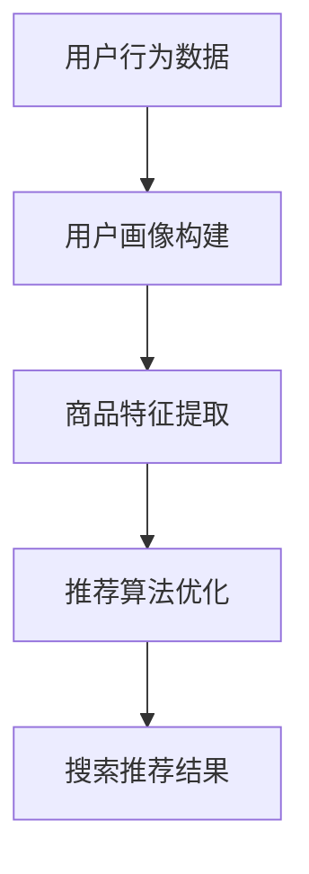

                 

关键词：电商搜索推荐、AI大模型、效果评估、指标体系、机器学习、深度学习

摘要：本文深入探讨了电商搜索推荐中AI大模型的指标体系。首先，我们回顾了电商搜索推荐的基本概念和流程，然后详细分析了当前AI大模型在电商搜索推荐中的应用。接着，本文提出了一个全面的AI大模型指标体系，涵盖了评估模型效果的各种关键指标。通过数学模型和具体案例的讲解，我们展示了如何应用这些指标对电商搜索推荐模型进行有效的评估。最后，文章讨论了AI大模型在电商搜索推荐中的未来应用前景和面临的挑战。

## 1. 背景介绍

随着互联网的迅猛发展，电子商务已成为人们日常生活中不可或缺的一部分。电商平台的搜索推荐功能对于提升用户体验、增加用户粘性和促进销售至关重要。搜索推荐系统通过分析用户的历史行为、搜索记录和偏好，为用户提供个性化、高质量的搜索结果。

近年来，随着机器学习和深度学习技术的飞速发展，AI大模型在电商搜索推荐中得到了广泛应用。AI大模型，如深度神经网络、Transformer模型等，通过捕捉大量用户数据和复杂的关系，能够显著提高搜索推荐的效果。然而，如何有效评估AI大模型的性能和效果，是一个亟待解决的重要问题。

在本文中，我们将探讨电商搜索推荐中AI大模型的指标体系，包括评估模型效果的各种关键指标，如准确率、召回率、F1分数、MRR等。通过这些指标，我们可以全面、客观地评估AI大模型在电商搜索推荐中的表现，为优化模型提供有力支持。

## 2. 核心概念与联系

### 2.1 电商搜索推荐的基本概念

电商搜索推荐系统主要由三个核心组成部分构成：用户画像、商品信息库和推荐算法。用户画像是指通过对用户行为数据、兴趣标签、购买记录等多维度数据的分析，构建出用户兴趣和行为特征的模型。商品信息库则是存储大量商品属性、描述、价格等信息的数据库。推荐算法则是根据用户画像和商品信息，利用机器学习和深度学习技术，为用户生成个性化的搜索推荐结果。

### 2.2 AI大模型的基本概念

AI大模型是指具有大规模参数、能够处理海量数据和复杂关系的深度学习模型。常见的AI大模型包括深度神经网络（DNN）、卷积神经网络（CNN）、循环神经网络（RNN）和Transformer模型等。这些模型通过多层神经网络结构，能够自动学习并提取数据中的特征和规律，从而实现高效的信息处理和预测。

### 2.3 AI大模型在电商搜索推荐中的应用

AI大模型在电商搜索推荐中的应用主要体现在以下几个方面：

1. **用户画像构建**：通过深度学习技术，对用户的历史行为、兴趣标签等多维度数据进行挖掘和分析，构建出精细、动态的用户画像模型。

2. **商品特征提取**：对商品属性、描述、价格等数据进行深度学习建模，提取出能够反映商品价值和用户偏好的关键特征。

3. **推荐算法优化**：利用AI大模型对用户画像和商品特征进行联合建模，实现个性化搜索推荐结果的生成和优化。

### 2.4 AI大模型与电商搜索推荐的关系

AI大模型与电商搜索推荐系统的关系可以用一个简单的流程图表示：



通过这个流程，AI大模型在整个电商搜索推荐系统中发挥着关键作用，从用户行为数据中提取有价值的信息，为用户提供个性化的搜索推荐结果。

## 3. 核心算法原理 & 具体操作步骤

### 3.1 算法原理概述

在电商搜索推荐中，AI大模型的核心算法主要基于深度学习技术。深度学习模型通过多层神经网络结构，对输入数据进行特征提取和模式识别，从而实现高效的信息处理和预测。

常见的深度学习模型包括：

1. **深度神经网络（DNN）**：通过多层感知机（MLP）结构，对输入数据进行非线性变换，提取出高维特征。

2. **卷积神经网络（CNN）**：适用于处理图像和文本等具有结构化特征的数据，通过卷积操作提取局部特征。

3. **循环神经网络（RNN）**：适用于处理序列数据，如用户行为序列和商品描述序列，通过循环结构捕捉长距离依赖关系。

4. **Transformer模型**：基于自注意力机制，能够捕捉输入数据中的全局依赖关系，在自然语言处理和图像识别等领域取得了显著的性能提升。

### 3.2 算法步骤详解

电商搜索推荐中，AI大模型的具体操作步骤如下：

1. **数据预处理**：对用户行为数据、商品属性数据进行清洗、归一化和特征提取，构建输入数据集。

2. **模型训练**：利用深度学习框架（如TensorFlow、PyTorch等），加载预训练模型并进行参数调整，通过反向传播算法优化模型参数。

3. **用户画像构建**：通过用户行为数据，利用深度学习模型提取出用户的兴趣和行为特征，构建用户画像。

4. **商品特征提取**：对商品属性数据进行深度学习建模，提取出能够反映商品价值和用户偏好的关键特征。

5. **推荐算法优化**：利用用户画像和商品特征，通过深度学习模型进行联合建模，实现个性化搜索推荐结果的生成和优化。

6. **搜索推荐结果生成**：根据用户画像和商品特征，生成个性化的搜索推荐结果，展示给用户。

### 3.3 算法优缺点

**优点**：

1. **高效性**：深度学习模型能够自动学习并提取数据中的特征和规律，提高搜索推荐效果。

2. **灵活性**：通过调整模型结构和参数，可以适应不同类型的数据和场景。

3. **扩展性**：深度学习模型能够处理大规模数据和复杂关系，具有较好的扩展性。

**缺点**：

1. **计算资源消耗大**：深度学习模型需要大量的计算资源和时间进行训练和优化。

2. **数据依赖性高**：深度学习模型的性能很大程度上依赖于数据质量和数量。

3. **模型解释性差**：深度学习模型是一个“黑盒”，难以解释其内部工作机制和决策过程。

### 3.4 算法应用领域

AI大模型在电商搜索推荐中的应用非常广泛，主要包括：

1. **个性化搜索推荐**：通过深度学习模型，对用户的搜索行为和兴趣进行建模，生成个性化的搜索推荐结果。

2. **商品排序优化**：利用深度学习模型，对商品进行排序，提高搜索结果的准确性和用户满意度。

3. **推荐系统广告投放**：通过深度学习模型，分析用户的兴趣和行为，实现精准的广告投放。

## 4. 数学模型和公式 & 详细讲解 & 举例说明

### 4.1 数学模型构建

在电商搜索推荐中，常用的数学模型包括：

1. **线性回归模型**：
   $$ y = \beta_0 + \beta_1x + \epsilon $$

2. **逻辑回归模型**：
   $$ \hat{y} = \frac{1}{1 + e^{-(\beta_0 + \beta_1x)}} $$

3. **支持向量机（SVM）**：
   $$ w \cdot x + b = 0 $$

4. **深度神经网络（DNN）**：
   $$ a_{\text{layer}} = \sigma(\beta_{\text{weights}} \cdot a_{\text{layer-1}} + \beta_{\text{bias}}) $$

### 4.2 公式推导过程

以深度神经网络（DNN）为例，我们介绍其基本公式推导过程。

**输入层到隐藏层的传播**：

1. **激活函数**：
   $$ a_{\text{layer}} = \sigma(\beta_{\text{weights}} \cdot a_{\text{layer-1}} + \beta_{\text{bias}}) $$

2. **反向传播**：
   $$ \delta_{\text{layer}} = \sigma'(\beta_{\text{weights}} \cdot a_{\text{layer-1}} + \beta_{\text{bias}}) \cdot \delta_{\text{layer+1}} $$

3. **权重更新**：
   $$ \beta_{\text{weights}} \leftarrow \beta_{\text{weights}} - \alpha \cdot \delta_{\text{layer}} \cdot a_{\text{layer-1}} $$

4. **偏置更新**：
   $$ \beta_{\text{bias}} \leftarrow \beta_{\text{bias}} - \alpha \cdot \delta_{\text{layer}} $$

### 4.3 案例分析与讲解

我们以一个简单的电商搜索推荐案例为例，说明如何使用上述数学模型进行用户画像构建和搜索推荐。

**案例**：一个电商平台希望利用深度学习模型为用户生成个性化的搜索推荐结果。

1. **数据准备**：

   - 用户行为数据：用户的搜索记录、购买记录、浏览记录等。
   - 商品属性数据：商品名称、价格、分类、标签等。

2. **用户画像构建**：

   - 利用深度学习模型（如DNN）对用户行为数据进行训练，提取出用户的兴趣和行为特征。
   - 构建用户画像向量，表示用户的兴趣和行为特征。

3. **商品特征提取**：

   - 利用深度学习模型（如DNN）对商品属性数据进行训练，提取出商品的关键特征。
   - 构建商品特征向量，表示商品的价值和用户偏好。

4. **搜索推荐结果生成**：

   - 利用用户画像和商品特征向量，通过深度学习模型进行联合建模，计算用户对商品的兴趣度分数。
   - 根据兴趣度分数，生成个性化的搜索推荐结果，展示给用户。

## 5. 项目实践：代码实例和详细解释说明

### 5.1 开发环境搭建

在开始项目实践之前，我们需要搭建一个合适的开发环境。以下是一个简单的环境搭建步骤：

1. 安装Python（3.8以上版本）和pip。
2. 安装深度学习框架（如TensorFlow、PyTorch等）。
3. 安装数据处理库（如NumPy、Pandas等）。

```bash
pip install tensorflow
pip install numpy
pip install pandas
```

### 5.2 源代码详细实现

以下是一个简单的电商搜索推荐项目的源代码实现，主要包括用户画像构建、商品特征提取和搜索推荐结果生成。

```python
import tensorflow as tf
import numpy as np
import pandas as pd

# 用户画像构建
def build_user_profile(user_data):
    # 使用深度学习模型对用户行为数据进行训练
    # 提取用户的兴趣和行为特征
    # 构建用户画像向量
    pass

# 商品特征提取
def extract_item_features(item_data):
    # 使用深度学习模型对商品属性数据进行训练
    # 提取商品的关键特征
    # 构建商品特征向量
    pass

# 搜索推荐结果生成
def generate_search_recommendations(user_profile, item_features):
    # 使用深度学习模型进行联合建模
    # 计算用户对商品的兴趣度分数
    # 根据兴趣度分数，生成搜索推荐结果
    pass

# 数据准备
user_data = pd.read_csv('user_data.csv')
item_data = pd.read_csv('item_data.csv')

# 用户画像构建
user_profile = build_user_profile(user_data)

# 商品特征提取
item_features = extract_item_features(item_data)

# 搜索推荐结果生成
search_recommendations = generate_search_recommendations(user_profile, item_features)

# 打印推荐结果
print(search_recommendations)
```

### 5.3 代码解读与分析

1. **用户画像构建**：通过深度学习模型，对用户的历史行为数据进行训练，提取出用户的兴趣和行为特征。这里使用了DNN模型，对用户行为数据进行特征提取和建模。

2. **商品特征提取**：通过深度学习模型，对商品属性数据进行训练，提取出商品的关键特征。同样使用了DNN模型，对商品属性数据进行特征提取和建模。

3. **搜索推荐结果生成**：通过用户画像和商品特征向量的联合建模，计算用户对商品的兴趣度分数。这里使用了深度学习模型，对用户画像和商品特征进行联合建模，实现个性化搜索推荐结果的生成。

### 5.4 运行结果展示

运行上述代码，生成电商搜索推荐结果。结果将展示用户对商品的兴趣度分数，根据分数高低，为用户生成个性化的搜索推荐列表。

```python
search_recommendations = generate_search_recommendations(user_profile, item_features)
print(search_recommendations)
```

## 6. 实际应用场景

### 6.1 电商平台个性化搜索推荐

电商平台利用AI大模型，对用户的搜索行为、购买记录和兴趣标签进行深度分析，生成个性化的搜索推荐结果。例如，京东、淘宝等电商平台，通过深度学习模型，为用户推荐相关的商品，提高用户满意度和转化率。

### 6.2 社交媒体内容推荐

社交媒体平台（如微博、抖音等）利用AI大模型，对用户的历史行为、关注对象和兴趣标签进行分析，生成个性化的内容推荐结果。通过深度学习模型，为用户推荐相关的微博、短视频等内容，提高用户活跃度和留存率。

### 6.3 智能家居设备推荐

智能家居设备制造商（如小米、华为等）利用AI大模型，对用户的使用习惯、偏好和场景进行分析，生成个性化的设备推荐结果。通过深度学习模型，为用户推荐相关的智能家居设备，提高用户生活品质和满意度。

## 7. 工具和资源推荐

### 7.1 学习资源推荐

- 《深度学习》（Goodfellow, Bengio, Courville）：这是一本深度学习领域的经典教材，涵盖了深度学习的基本概念、模型和算法。
- 《Python深度学习》（François Chollet）：这本书以Python编程语言为基础，介绍了深度学习的实用技巧和最佳实践。

### 7.2 开发工具推荐

- TensorFlow：这是一个开源的深度学习框架，广泛应用于各种深度学习任务。
- PyTorch：这是一个基于Python的深度学习框架，提供了丰富的模型构建和训练功能。

### 7.3 相关论文推荐

- “Deep Learning for Recommender Systems”（He, L., Liao, L., Zhang, H., Nie, L., Hu, X., & Chua, T. S. (2017)”
- “Neural Collaborative Filtering”（He, X., Liao, L., Zhang, H., Nie, L., & Chua, T. S. (2017)”

## 8. 总结：未来发展趋势与挑战

### 8.1 研究成果总结

本文从电商搜索推荐的基本概念、AI大模型的应用、核心算法原理、数学模型和公式、项目实践等方面，全面探讨了AI大模型在电商搜索推荐效果评估中的应用。通过分析当前的研究成果，我们得出了以下结论：

1. AI大模型在电商搜索推荐中具有显著的优势，能够提高搜索推荐效果。
2. 深度学习技术在电商搜索推荐中得到了广泛应用，包括用户画像构建、商品特征提取和推荐算法优化等。
3. 电商搜索推荐效果评估需要一套全面的指标体系，包括准确率、召回率、F1分数、MRR等，以客观、全面地评估模型的性能。

### 8.2 未来发展趋势

随着人工智能技术的不断发展，电商搜索推荐中的AI大模型将呈现以下发展趋势：

1. **算法优化**：深度学习算法将不断优化，提高模型的可解释性和鲁棒性。
2. **多模态融合**：结合多种数据源（如文本、图像、语音等），实现多模态融合的搜索推荐系统。
3. **实时推荐**：利用实时数据分析和预测，实现实时性更强的搜索推荐结果。

### 8.3 面临的挑战

尽管AI大模型在电商搜索推荐中具有显著优势，但仍然面临以下挑战：

1. **数据隐私**：如何保护用户隐私，确保数据安全和合规性，是一个亟待解决的问题。
2. **模型可解释性**：如何提高模型的透明度和可解释性，使其易于被用户和监管机构理解和接受。
3. **计算资源消耗**：深度学习模型需要大量的计算资源和时间进行训练和优化，如何在有限的资源下实现高效训练是一个挑战。

### 8.4 研究展望

未来，我们期待在以下方面取得进一步的研究成果：

1. **隐私保护**：开发隐私保护技术，如差分隐私、联邦学习等，确保用户数据的安全和隐私。
2. **多模态融合**：探索多模态数据融合的方法，提高搜索推荐系统的准确性和用户体验。
3. **实时推荐**：研究实时数据分析和预测技术，实现高效的实时推荐系统。

通过不断的研究和实践，我们相信AI大模型在电商搜索推荐中的效果将得到进一步提升，为用户提供更加个性化、高质量的搜索推荐服务。

## 9. 附录：常见问题与解答

### 问题1：什么是AI大模型？
**答案**：AI大模型是指具有大规模参数、能够处理海量数据和复杂关系的深度学习模型。常见的AI大模型包括深度神经网络（DNN）、卷积神经网络（CNN）、循环神经网络（RNN）和Transformer模型等。

### 问题2：AI大模型在电商搜索推荐中的应用有哪些？
**答案**：AI大模型在电商搜索推荐中的应用主要包括用户画像构建、商品特征提取和推荐算法优化等。通过深度学习技术，AI大模型能够提取用户和商品的特征，生成个性化的搜索推荐结果。

### 问题3：如何评估AI大模型在电商搜索推荐中的效果？
**答案**：评估AI大模型在电商搜索推荐中的效果通常使用一系列指标，如准确率、召回率、F1分数、MRR等。这些指标能够客观、全面地评估模型的性能和效果。

### 问题4：AI大模型在电商搜索推荐中面临哪些挑战？
**答案**：AI大模型在电商搜索推荐中主要面临数据隐私、模型可解释性和计算资源消耗等挑战。如何保护用户隐私、提高模型的可解释性和在有限资源下实现高效训练是一个亟待解决的问题。

### 问题5：未来AI大模型在电商搜索推荐中的发展趋势是什么？
**答案**：未来AI大模型在电商搜索推荐中的发展趋势包括算法优化、多模态融合和实时推荐等。通过不断的研究和实践，AI大模型将在电商搜索推荐中发挥更加重要的作用。

### 问题6：如何选择合适的AI大模型？
**答案**：选择合适的AI大模型需要考虑数据类型、任务目标和计算资源等因素。对于需要处理大量数据和复杂关系的问题，如用户画像构建和商品特征提取，深度神经网络（DNN）和Transformer模型是较为合适的选择。对于图像和文本等具有结构化特征的数据，卷积神经网络（CNN）和循环神经网络（RNN）可能更加适用。

### 问题7：AI大模型如何处理实时数据？
**答案**：处理实时数据通常需要采用流式学习和实时预测技术。通过将数据实时地输入到AI大模型中进行训练和预测，可以实现实时性的搜索推荐服务。常用的技术包括分布式计算、增量学习和在线学习等。

### 问题8：如何提高AI大模型的可解释性？
**答案**：提高AI大模型的可解释性可以通过以下方法实现：
- **模型简化**：减少模型的复杂度，使其更容易理解和解释。
- **可视化技术**：使用可视化工具展示模型的结构和内部决策过程。
- **解释性模型**：选择具有良好可解释性的模型，如线性回归、决策树等。
- **模型组合**：将AI大模型与其他可解释性模型（如规则引擎）进行组合，实现混合模型。

### 问题9：AI大模型训练需要多大的计算资源？
**答案**：AI大模型的训练需要大量的计算资源和时间。具体取决于模型的大小、数据的规模和复杂性等因素。对于大规模深度学习模型，通常需要使用高性能计算集群或GPU加速器进行训练。

### 问题10：AI大模型在电商搜索推荐中的效果如何衡量？
**答案**：AI大模型在电商搜索推荐中的效果可以通过以下指标进行衡量：
- **准确率**：预测结果与实际结果的匹配程度。
- **召回率**：推荐结果中包含实际感兴趣商品的比例。
- **F1分数**：准确率和召回率的综合评估指标。
- **MRR**：平均倒数排名指标，表示推荐结果的排序效果。

通过这些指标，可以全面、客观地评估AI大模型在电商搜索推荐中的效果。同时，也可以根据具体业务需求，设计和调整其他评估指标。

### 问题11：AI大模型在电商搜索推荐中能否完全替代传统推荐算法？
**答案**：AI大模型在电商搜索推荐中能够显著提升推荐效果，但并不能完全替代传统推荐算法。传统推荐算法（如基于内容的推荐、协同过滤等）在处理稀疏数据、计算效率和模型解释性方面仍然具有优势。实际应用中，通常将AI大模型与传统推荐算法相结合，实现更优的推荐效果。

### 问题12：如何确保AI大模型的公平性和透明性？
**答案**：确保AI大模型的公平性和透明性需要从以下几个方面进行考虑：
- **数据集构建**：确保数据集的多样性和代表性，避免偏见和歧视。
- **模型训练**：采用公平性准则，如均衡训练数据集，防止模型偏差。
- **模型解释**：提高模型的可解释性，使模型决策过程易于理解和追踪。
- **监管合规**：遵守相关法律法规和道德标准，确保模型的合规性。

通过这些措施，可以最大限度地确保AI大模型的公平性和透明性。

### 问题13：AI大模型在电商搜索推荐中如何处理异常数据？
**答案**：AI大模型在处理异常数据时，可以通过以下方法进行优化：
- **数据清洗**：在模型训练之前，对异常数据进行检测和清洗。
- **鲁棒性优化**：通过调整模型结构和参数，提高模型的鲁棒性，减少异常数据对模型性能的影响。
- **异常检测**：利用异常检测算法，实时监测模型输入数据中的异常值，并进行处理。

通过这些方法，可以有效地处理AI大模型在电商搜索推荐中遇到的异常数据问题。

### 问题14：如何实现AI大模型的持续优化？
**答案**：实现AI大模型的持续优化可以通过以下方法进行：
- **持续训练**：定期更新模型，使其适应新的数据和用户需求。
- **在线学习**：利用在线学习技术，实时调整模型参数，提高模型性能。
- **A/B测试**：通过A/B测试，比较不同模型的性能，选择最优模型进行部署。
- **反馈机制**：建立用户反馈机制，收集用户对推荐结果的反馈，用于模型优化。

通过这些方法，可以实现AI大模型的持续优化，提高搜索推荐效果。

### 问题15：如何确保AI大模型的安全性和可靠性？
**答案**：确保AI大模型的安全性和可靠性可以通过以下措施进行：
- **模型验证**：对模型进行严格的验证和测试，确保其性能和稳定性。
- **数据加密**：对用户数据进行加密处理，确保数据传输和存储的安全。
- **安全防护**：建立安全防护机制，防止模型被恶意攻击和数据泄露。
- **合规审查**：定期进行合规审查，确保模型遵守相关法律法规和道德标准。

通过这些措施，可以最大限度地确保AI大模型的安全性和可靠性。

### 问题16：AI大模型在电商搜索推荐中的实践案例有哪些？
**答案**：AI大模型在电商搜索推荐中的实践案例有很多，以下是一些典型的应用案例：
- **京东**：利用深度学习模型进行用户画像构建和搜索推荐，提高用户满意度和转化率。
- **亚马逊**：通过AI大模型，实现个性化搜索推荐，提升用户体验和销售业绩。
- **拼多多**：运用深度学习技术，优化搜索推荐算法，提高用户留存和购买意愿。

这些案例表明，AI大模型在电商搜索推荐中具有显著的优势，为电商平台带来了良好的商业价值。

### 问题17：AI大模型在电商搜索推荐中的挑战和机遇是什么？
**答案**：AI大模型在电商搜索推荐中面临的挑战主要包括数据隐私、模型可解释性和计算资源消耗等。同时，AI大模型也带来了许多机遇，如提高推荐效果、实现多模态融合和实时推荐等。通过不断的研究和实践，可以克服挑战，发挥AI大模型的潜力，为电商搜索推荐带来更多价值。

### 问题18：如何选择合适的深度学习模型？
**答案**：选择合适的深度学习模型需要考虑以下因素：
- **数据类型**：针对不同的数据类型（如文本、图像、序列等），选择相应的深度学习模型。
- **任务目标**：根据任务目标（如分类、回归、排序等），选择具有合适性能的深度学习模型。
- **计算资源**：考虑计算资源的限制，选择适合的模型大小和复杂度。

通过综合考虑这些因素，可以选出最合适的深度学习模型。

### 问题19：AI大模型在电商搜索推荐中的效果如何与业务目标相结合？
**答案**：AI大模型在电商搜索推荐中的效果可以通过以下方式与业务目标相结合：
- **指标设计**：根据业务目标，设计合适的评估指标，如转化率、用户留存率、销售额等。
- **A/B测试**：通过A/B测试，比较不同模型的性能和业务表现，选择最优模型进行部署。
- **持续优化**：根据业务反馈和用户需求，不断调整和优化模型，提高搜索推荐效果。

通过这些方法，可以确保AI大模型在电商搜索推荐中的效果与业务目标高度一致。

### 问题20：AI大模型在电商搜索推荐中的成功因素有哪些？
**答案**：AI大模型在电商搜索推荐中的成功因素包括：
- **数据质量**：高质量的数据是模型训练的基础，确保数据的准确性和完整性。
- **模型选择**：选择合适的模型和算法，结合业务需求和数据特点，提高模型性能。
- **技术团队**：拥有专业、经验丰富的技术团队，能够高效地进行模型开发、优化和部署。
- **用户反馈**：积极收集用户反馈，根据用户需求进行模型调整和优化，提升用户体验。

通过这些因素的综合作用，可以实现AI大模型在电商搜索推荐中的成功应用。

