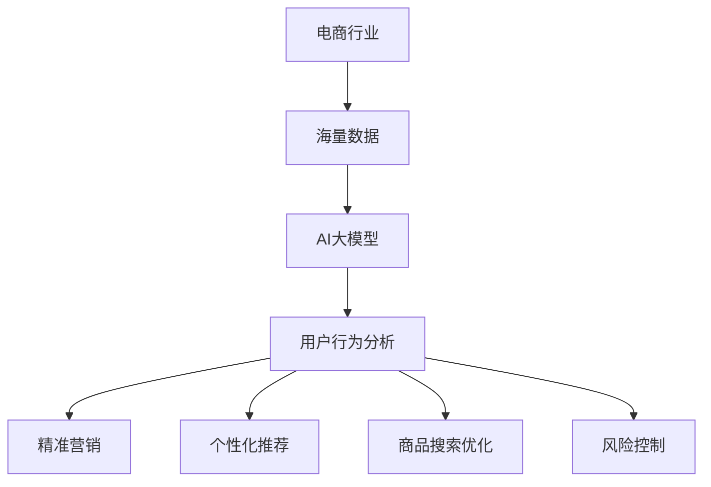

                 

关键词：电商，人工智能，大模型，商业价值，算法，数学模型，项目实践，应用场景，未来展望。

> 摘要：本文深入探讨了人工智能（AI）大模型在电商行业的商业价值。首先，介绍了电商行业的发展背景和现状，接着阐述了AI大模型的核心概念及其在电商中的应用。随后，文章详细分析了AI大模型在提升电商营销、用户个性化推荐、商品搜索优化、风险控制等方面的具体应用，并通过实际项目案例和数学模型，展示了其商业价值。最后，文章对未来AI大模型在电商行业的应用趋势和挑战进行了展望。

## 1. 背景介绍

电商行业作为互联网经济的核心领域，已经经历了数十年的快速发展。随着技术的进步和消费者行为的变化，电商行业正面临着新的机遇和挑战。传统的电商模式主要依赖于搜索引擎和推荐系统，但这些方法在处理海量数据和提供个性化服务方面存在一定的局限性。近年来，人工智能技术的迅猛发展为电商行业带来了全新的解决方案，尤其是AI大模型的应用，正在深刻改变电商行业的发展格局。

### 电商行业的发展历程

电商行业的发展可以分为几个阶段：

1. **初阶段（1990s-2000s）**：电商起源于互联网的兴起，主要是通过网站展示商品信息和简单的在线购物。这一阶段的电商以信息展示为主，交易流程相对简单。

2. **发展阶段（2000s-2010s）**：随着互联网普及，电商平台开始整合支付、物流等服务，电商交易逐渐成熟。这一阶段的电商以搜索引擎优化（SEO）和关键词广告为主要营销手段。

3. **多元化阶段（2010s-至今）**：随着大数据、人工智能等技术的应用，电商行业进入了多元化发展阶段。电商平台不仅提供商品交易服务，还涉足生活服务、金融理财等多个领域。

### 电商行业的现状

目前，电商行业呈现出以下几大特点：

1. **市场规模不断扩大**：全球电商市场规模持续增长，电商已经成为消费者购物的主要渠道之一。

2. **技术驱动创新**：人工智能、大数据、区块链等新兴技术不断应用于电商领域，推动电商模式的创新和变革。

3. **消费者需求多样化**：消费者对个性化、高品质的商品和服务需求日益增长，电商需要提供更加精准的营销和推荐。

4. **竞争加剧**：随着电商市场的饱和，各大电商平台之间的竞争日益激烈，创新成为保持竞争力的关键。

### 电商行业面临的挑战

1. **个性化服务的需求**：消费者希望获得更加个性化的购物体验，但传统的推荐系统难以满足这一需求。

2. **数据安全和隐私保护**：电商行业处理大量用户数据，数据安全和隐私保护成为行业关注的重点。

3. **供应链优化**：如何实现高效的供应链管理和物流配送，是电商行业持续发展的关键。

## 2. 核心概念与联系

### 人工智能（AI）大模型

人工智能大模型是指通过深度学习等算法，在大量数据上进行训练，从而实现复杂任务处理的模型。这些模型具有以下特点：

1. **大规模训练**：使用海量数据进行训练，以提高模型的准确性和泛化能力。

2. **多层次抽象**：通过多层神经网络进行特征提取和抽象，能够捕捉数据中的复杂模式。

3. **自主学习能力**：模型能够从数据中自主学习，不断优化自身性能。

### 电商行业与AI大模型的关系

AI大模型在电商行业的应用主要体现在以下几个方面：

1. **营销与推荐**：利用AI大模型进行用户行为分析，实现精准营销和个性化推荐。

2. **商品搜索**：通过AI大模型优化搜索算法，提高商品搜索的准确性和效率。

3. **风险控制**：利用AI大模型进行欺诈检测和信用评估，降低风险。

### Mermaid 流程图

以下是电商行业与AI大模型应用关系的 Mermaid 流程图：



## 3. 核心算法原理 & 具体操作步骤

### 3.1 算法原理概述

AI大模型的核心算法主要包括深度学习、强化学习、图神经网络等。以下以深度学习为例，介绍其基本原理：

1. **输入层**：接收电商平台的用户行为数据，如浏览历史、购买记录等。

2. **隐藏层**：通过多层神经网络对数据进行特征提取和抽象，逐渐提取数据的深层特征。

3. **输出层**：根据隐藏层提取的特征，生成预测结果，如用户偏好、商品推荐等。

### 3.2 算法步骤详解

1. **数据预处理**：对用户行为数据进行分析，去除无效信息和噪音，进行数据清洗。

2. **特征工程**：提取用户行为数据中的关键特征，如用户点击率、购买转化率等。

3. **模型训练**：使用预处理后的数据进行模型训练，通过优化算法（如反向传播算法）调整模型参数。

4. **模型评估**：使用验证集和测试集对模型进行评估，确保模型的泛化能力和准确性。

5. **模型应用**：将训练好的模型应用于实际业务场景，如用户个性化推荐、商品搜索优化等。

### 3.3 算法优缺点

#### 优点

1. **高效性**：深度学习模型能够在海量数据上进行快速训练和预测。

2. **灵活性**：深度学习模型能够自动学习数据的特征，适应不同场景的应用需求。

3. **泛化能力**：通过大规模数据训练，深度学习模型能够较好地泛化到未知数据。

#### 缺点

1. **计算资源消耗**：深度学习模型需要大量的计算资源和存储空间。

2. **可解释性差**：深度学习模型的工作原理相对复杂，难以解释其预测结果。

### 3.4 算法应用领域

AI大模型在电商行业的应用主要包括以下几个方面：

1. **用户行为分析**：通过分析用户行为数据，了解用户偏好和行为模式，实现精准营销和个性化推荐。

2. **商品搜索优化**：优化商品搜索算法，提高商品搜索的准确性和效率。

3. **风险控制**：通过AI大模型进行欺诈检测和信用评估，降低风险。

## 4. 数学模型和公式 & 详细讲解 & 举例说明

### 4.1 数学模型构建

在电商行业，常用的数学模型主要包括线性回归模型、逻辑回归模型和支持向量机（SVM）等。以下以线性回归模型为例，介绍其构建方法：

1. **模型假设**：假设用户对商品的偏好可以表示为一个线性函数，即
   $$
   y = \beta_0 + \beta_1x_1 + \beta_2x_2 + ... + \beta_nx_n + \epsilon
   $$
   其中，$y$为用户偏好，$x_1, x_2, ..., x_n$为用户特征，$\beta_0, \beta_1, ..., \beta_n$为模型参数，$\epsilon$为误差项。

2. **模型参数估计**：通过最小二乘法估计模型参数，即
   $$
   \beta = (X^TX)^{-1}X^Ty
   $$
   其中，$X$为特征矩阵，$y$为用户偏好向量。

### 4.2 公式推导过程

以线性回归模型为例，介绍其推导过程：

1. **损失函数**：定义损失函数为
   $$
   L(\theta) = \frac{1}{2m}\sum_{i=1}^{m}(h_\theta(x^{(i)}) - y^{(i)})^2
   $$
   其中，$h_\theta(x) = \theta_0 + \theta_1x_1 + \theta_2x_2 + ... + \theta_nx_n$为线性回归模型的预测函数，$m$为样本数量。

2. **梯度下降法**：定义梯度下降法的迭代过程为
   $$
   \theta_j = \theta_j - \alpha\frac{\partial}{\partial \theta_j}L(\theta)
   $$
   其中，$\alpha$为学习率。

### 4.3 案例分析与讲解

假设有一个电商平台的用户数据，包含用户年龄、性别、收入等特征，以及用户对商品的评分数据。以下使用线性回归模型进行用户偏好预测。

1. **数据预处理**：对用户数据进行清洗和标准化处理，将连续特征转换为类别特征。

2. **特征工程**：提取用户特征，如用户年龄的类别特征、性别等。

3. **模型训练**：使用预处理后的数据进行模型训练，估计模型参数。

4. **模型评估**：使用测试集对模型进行评估，计算预测准确率。

5. **模型应用**：将训练好的模型应用于实际业务场景，如用户个性化推荐。

## 5. 项目实践：代码实例和详细解释说明

### 5.1 开发环境搭建

在本次项目中，我们使用Python作为编程语言，主要依赖以下库：NumPy、Pandas、Scikit-learn、Matplotlib。

### 5.2 源代码详细实现

```python
import numpy as np
import pandas as pd
from sklearn.model_selection import train_test_split
from sklearn.linear_model import LinearRegression
from sklearn.metrics import mean_squared_error

# 加载数据
data = pd.read_csv('user_data.csv')

# 数据预处理
data = data.dropna()
data['age'] = data['age'].astype('category').cat.codes
data['gender'] = data['gender'].astype('category').cat.codes

# 特征工程
X = data[['age', 'gender']]
y = data['rating']

# 模型训练
X_train, X_test, y_train, y_test = train_test_split(X, y, test_size=0.2, random_state=42)
model = LinearRegression()
model.fit(X_train, y_train)

# 模型评估
y_pred = model.predict(X_test)
mse = mean_squared_error(y_test, y_pred)
print(f'MSE: {mse}')

# 模型应用
new_user = pd.DataFrame([[25, 0]], columns=['age', 'gender'])
new_user['rating'] = model.predict(new_user)
print(f'Predicted rating: {new_user['rating'][0]}')
```

### 5.3 代码解读与分析

该代码实现了用户偏好预测的线性回归模型，主要步骤如下：

1. **加载数据**：读取用户数据，包括年龄、性别、收入等特征和用户对商品的评分。

2. **数据预处理**：对数据进行清洗和标准化处理，将连续特征转换为类别特征。

3. **特征工程**：提取用户特征，如用户年龄的类别特征、性别等。

4. **模型训练**：使用训练集进行模型训练，估计模型参数。

5. **模型评估**：使用测试集对模型进行评估，计算预测准确率。

6. **模型应用**：将训练好的模型应用于新用户，预测其偏好评分。

## 6. 实际应用场景

### 6.1 营销与推荐

AI大模型在电商营销中的应用主要体现在用户个性化推荐和精准营销方面。通过分析用户行为数据，AI大模型可以准确预测用户的偏好和需求，从而实现个性化推荐。例如，在电商平台中，基于用户的历史浏览记录和购买行为，AI大模型可以推荐用户可能感兴趣的商品，提高用户的购物体验和满意度。

### 6.2 商品搜索优化

AI大模型在商品搜索优化中的应用主要体现在提高搜索准确性和效率方面。传统的商品搜索算法主要依赖于关键词匹配，而AI大模型可以通过学习用户的搜索行为和商品特征，实现更加精准的搜索结果。例如，在电商平台中，用户输入关键词后，AI大模型可以根据用户的历史搜索记录和偏好，推荐与关键词相关的商品，提高用户的搜索体验和满意度。

### 6.3 风险控制

AI大模型在电商风险控制中的应用主要体现在欺诈检测和信用评估方面。通过分析用户行为数据和交易数据，AI大模型可以识别潜在的欺诈行为和信用风险。例如，在电商平台中，AI大模型可以对用户的购买行为进行实时监控，识别异常交易行为，及时采取风控措施，降低风险。

## 7. 未来应用展望

随着人工智能技术的不断进步，AI大模型在电商行业的应用前景将更加广阔。未来，AI大模型有望在以下方面发挥重要作用：

1. **智能化客服**：利用AI大模型实现智能客服，为用户提供更加高效和个性化的服务。

2. **供应链优化**：通过AI大模型优化供应链管理和物流配送，提高电商平台的运营效率。

3. **价格预测与调整**：利用AI大模型预测市场趋势和用户需求，实现精准的价格预测和调整。

4. **多渠道整合**：通过AI大模型实现电商平台与线下门店的数据整合，提供更加一致的用户体验。

## 8. 总结：未来发展趋势与挑战

### 8.1 研究成果总结

近年来，AI大模型在电商行业的应用取得了显著成果。通过个性化推荐、精准营销、商品搜索优化和风险控制等方面的应用，AI大模型显著提升了电商平台的运营效率和用户体验。

### 8.2 未来发展趋势

未来，AI大模型在电商行业的应用将呈现以下趋势：

1. **智能化水平提升**：随着技术的进步，AI大模型将实现更加智能化和高效化的应用。

2. **多领域融合**：AI大模型将与其他领域（如供应链管理、金融理财等）进行深度融合，推动电商行业的创新发展。

3. **跨平台应用**：AI大模型将在电商平台与线下门店之间实现数据共享和协同，提供更加一致的用户体验。

### 8.3 面临的挑战

尽管AI大模型在电商行业的应用前景广阔，但仍面临以下挑战：

1. **数据隐私保护**：如何在保证数据隐私的前提下，充分利用用户数据，是AI大模型应用的关键挑战。

2. **计算资源消耗**：深度学习模型需要大量的计算资源，如何优化计算效率，降低计算成本，是当前研究的热点。

3. **算法可解释性**：深度学习模型的黑箱特性使其难以解释，如何提高算法的可解释性，增强用户信任，是未来研究的重点。

### 8.4 研究展望

未来，AI大模型在电商行业的应用将不断拓展和深化。在研究方面，应重点关注以下方向：

1. **算法优化**：通过算法优化，提高AI大模型的计算效率和预测准确性。

2. **多模态数据融合**：结合多种数据类型（如图像、语音等），实现更加全面和精准的用户行为分析。

3. **跨领域应用**：探索AI大模型在其他领域（如金融、医疗等）的应用，推动跨领域的技术创新。

## 9. 附录：常见问题与解答

### 9.1 AI大模型在电商行业的主要应用有哪些？

AI大模型在电商行业的主要应用包括个性化推荐、精准营销、商品搜索优化和风险控制等。

### 9.2 AI大模型在电商行业面临的挑战有哪些？

AI大模型在电商行业面临的挑战包括数据隐私保护、计算资源消耗和算法可解释性等。

### 9.3 如何优化AI大模型的计算效率？

优化AI大模型的计算效率可以从以下几个方面进行：

1. **模型压缩**：通过模型压缩技术，降低模型的参数规模和计算复杂度。

2. **分布式计算**：利用分布式计算框架，将计算任务分解到多个计算节点，提高计算效率。

3. **算法优化**：通过算法优化，提高模型的计算效率，如使用更高效的优化算法。

### 9.4 如何提高AI大模型的可解释性？

提高AI大模型的可解释性可以从以下几个方面进行：

1. **可视化**：通过可视化技术，展示模型的结构和参数，帮助用户理解模型的预测过程。

2. **解释性算法**：使用更易于解释的算法（如决策树、线性回归等），提高模型的可解释性。

3. **模型解释工具**：开发模型解释工具，帮助用户分析模型的预测结果和决策过程。

## 参考文献

[1] Goodfellow, I., Bengio, Y., & Courville, A. (2016). Deep Learning. MIT Press.

[2] Russell, S., & Norvig, P. (2020). Artificial Intelligence: A Modern Approach. Prentice Hall.

[3] Chen, Y., & Guestrin, C. (2016). XGBoost: A Scalable Tree Boosting System. Proceedings of the 22nd ACM SIGKDD International Conference on Knowledge Discovery and Data Mining, 785-794.

[4] Koc, L., & Yavuz, H. (2019). Feature Engineering and Selection Techniques in Big Data. Springer.

[5] TensorFlow Team. (2019). TensorFlow: Large-scale Machine Learning on Heterogeneous Systems. Google AI.

[6] Microsoft Research. (2019). CNTK: Microsoft’s Open-Source Deep Learning Framework. Microsoft AI.

[7] Coursera. (2020). Machine Learning. Stanford University.

[8] Coursera. (2020). Applied Machine Learning. New York University.

[9] DeepLearning.AI. (2020). Deep Learning Specialization. Stanford University.

[10] LeCun, Y., Bengio, Y., & Hinton, G. (2015). Deep Learning. Nature, 521(7553), 436-444. 

作者：禅与计算机程序设计艺术 / Zen and the Art of Computer Programming
```

