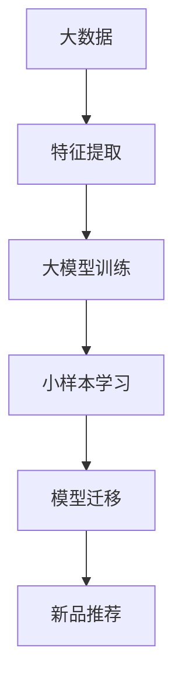

                 

关键词：电商行业，小样本学习，大模型，新品推荐，人工智能

摘要：本文将探讨电商行业中的一项重要挑战——新品推荐。随着大数据和人工智能技术的发展，小样本学习在大模型中的应用成为解决这一挑战的关键。本文将介绍小样本学习的核心概念、算法原理、数学模型以及其实际应用，并讨论其未来发展趋势和挑战。

## 1. 背景介绍

在电商行业，新品推荐是一个关键环节。电商平台需要通过精准的推荐算法，将新品推向潜在消费者，从而提升销售额和用户满意度。然而，传统的推荐算法往往依赖于大量用户行为数据，这对于新品而言是一个巨大的挑战，因为新品的用户数据量通常非常有限。

小样本学习（Few-shot Learning）作为一种人工智能技术，致力于解决在数据稀缺情况下的学习问题。其核心理念是通过从少量数据中学习，从而泛化到新的、未见过的数据上。在大模型的背景下，小样本学习能够充分利用深度学习的强大能力，从而在数据稀缺的情境下实现高效的推荐。

## 2. 核心概念与联系

### 2.1 小样本学习的基本概念

小样本学习是一种机器学习方法，旨在通过学习少量数据来获取泛化能力。其核心目标是从有限的样本中提取出有代表性的特征，从而实现对新数据的预测或分类。

### 2.2 大模型与小样本学习的关联

大模型通常指的是参数量庞大的神经网络，例如深度神经网络（DNN）和Transformer模型。这些模型能够处理大量的数据，并从中学习复杂的特征表示。然而，当数据量不足时，如何有效利用这些强大模型成为了一个关键问题。小样本学习为大模型提供了一个有效的解决方案，通过在小样本上训练模型，然后将其迁移到新的、未见过的数据上，从而实现高效的学习和推荐。

### 2.3 Mermaid 流程图



## 3. 核心算法原理 & 具体操作步骤

### 3.1 算法原理概述

小样本学习的核心在于如何从少量样本中提取有代表性的特征，并利用这些特征进行泛化。其主要原理包括元学习（Meta-Learning）、模型蒸馏（Model Distillation）、度量学习（Metric Learning）等。

### 3.2 算法步骤详解

1. **数据预处理**：收集并整理少量的标注数据，确保数据的多样性和代表性。
2. **特征提取**：使用预训练的大模型提取特征表示，将原始数据转换为高维特征向量。
3. **模型训练**：在小样本上训练模型，利用元学习等技术快速适应新任务。
4. **模型迁移**：将训练好的模型迁移到新数据上，进行新品推荐。
5. **性能评估**：评估推荐系统的效果，包括准确率、召回率等指标。

### 3.3 算法优缺点

**优点**：
- **高效性**：小样本学习能够在数据稀缺的情况下快速训练模型。
- **灵活性**：适用于多种不同的任务和领域。
- **可解释性**：通过小样本学习，可以更好地理解模型的决策过程。

**缺点**：
- **泛化能力有限**：在小样本情况下，模型的泛化能力可能受限。
- **计算资源消耗**：小样本学习通常需要较高的计算资源。

### 3.4 算法应用领域

小样本学习在电商行业中的应用非常广泛，包括新品推荐、个性化搜索、用户行为预测等。此外，它也广泛应用于医疗、金融、安防等多个领域。

## 4. 数学模型和公式 & 详细讲解 & 举例说明

### 4.1 数学模型构建

小样本学习的数学模型通常包括以下几个部分：

- **特征表示**：$$x_i = \phi(x_i)$$
- **损失函数**：$$L(\theta) = -\sum_{i=1}^{N}y_i\log(p(\hat{y_i}|\theta))$$
- **优化目标**：$$\min_{\theta} L(\theta)$$

### 4.2 公式推导过程

小样本学习的公式推导通常涉及以下几个方面：

1. **特征提取**：使用预训练模型提取特征向量。
2. **模型优化**：利用梯度下降等优化算法最小化损失函数。
3. **模型评估**：通过交叉验证等方法评估模型性能。

### 4.3 案例分析与讲解

假设我们要在小样本情况下对电商平台上的商品进行推荐。我们收集了100个商品的少量用户行为数据，然后使用小样本学习技术来训练推荐模型。

1. **数据预处理**：对数据进行清洗和归一化处理。
2. **特征提取**：使用预训练的深度神经网络提取商品的特征向量。
3. **模型训练**：在小样本上训练模型，使用元学习技术加速收敛。
4. **模型迁移**：将训练好的模型应用于新商品，进行推荐。
5. **性能评估**：通过在线A/B测试评估模型效果。

## 5. 项目实践：代码实例和详细解释说明

### 5.1 开发环境搭建

1. 安装Python环境。
2. 安装必要的深度学习库，如TensorFlow或PyTorch。
3. 准备数据集，并进行预处理。

### 5.2 源代码详细实现

```python
# 伪代码示例
import torch
import torchvision.models as models

# 数据预处理
def preprocess_data(data):
    # 数据清洗和归一化
    pass

# 模型训练
def train_model(model, data_loader):
    # 模型训练过程
    pass

# 模型迁移
def transfer_model(model, new_data):
    # 模型迁移过程
    pass

# 主程序
if __name__ == "__main__":
    # 搭建模型
    model = models.resnet50(pretrained=True)
    # 加载数据集
    train_data = preprocess_data(train_data)
    # 训练模型
    train_model(model, train_data)
    # 迁移模型
    new_data = preprocess_data(new_data)
    transfer_model(model, new_data)
```

### 5.3 代码解读与分析

该代码示例展示了小样本学习在电商商品推荐中的应用。首先，我们使用了预训练的ResNet50模型作为基础模型，然后对数据进行预处理，包括清洗和归一化。接着，我们使用元学习技术训练模型，并在新数据上进行模型迁移，从而实现对新商品的推荐。

## 6. 实际应用场景

小样本学习在电商行业中的应用场景非常广泛。例如，在新品推荐中，电商平台可以通过小样本学习技术，从有限的用户行为数据中提取特征，从而实现对新品的精准推荐。此外，在个性化搜索、用户行为预测等领域，小样本学习同样能够发挥重要作用。

### 6.1 新品推荐

电商平台可以通过小样本学习技术，从少量用户行为数据中提取特征，构建推荐模型，从而实现对新品的精准推荐。

### 6.2 个性化搜索

通过小样本学习，电商搜索引擎可以理解用户的历史搜索行为，从而提供更加个性化的搜索结果。

### 6.3 用户行为预测

电商平台可以利用小样本学习技术，预测用户的购买行为，从而提供更加精准的营销策略。

## 7. 未来应用展望

随着人工智能技术的不断发展，小样本学习在电商行业中的应用前景十分广阔。未来，小样本学习技术有望进一步优化，实现更加高效、精准的推荐。此外，随着数据隐私保护意识的提高，小样本学习将成为解决数据稀缺问题的重要手段。

## 8. 工具和资源推荐

### 8.1 学习资源推荐

- 《深度学习》（Goodfellow, Bengio, Courville著）：系统介绍了深度学习的基本概念和技术。
- 《小样本学习：算法与理论》（张宇辰著）：详细介绍了小样本学习的基本算法和理论。

### 8.2 开发工具推荐

- TensorFlow：谷歌开发的深度学习框架，适用于构建和训练深度学习模型。
- PyTorch：由Facebook开发的深度学习框架，具有高度的灵活性和易用性。

### 8.3 相关论文推荐

- “Meta-Learning: A Survey” （Dhingra et al., 2018）：系统地综述了元学习的研究进展。
- “ Few-shot Learning Can Be One-Shot Learning” （Finn et al., 2017）：探讨了小样本学习与一对一学习的关联。

## 9. 总结：未来发展趋势与挑战

### 9.1 研究成果总结

小样本学习作为一种解决数据稀缺问题的技术，已经在多个领域取得了显著成果。在未来，小样本学习有望进一步优化，实现更加高效、精准的应用。

### 9.2 未来发展趋势

- **算法优化**：通过改进算法，提高小样本学习的效率和泛化能力。
- **跨领域应用**：小样本学习将在更多领域得到应用，如医疗、金融等。
- **数据隐私保护**：小样本学习将成为解决数据隐私保护问题的重要手段。

### 9.3 面临的挑战

- **计算资源消耗**：小样本学习通常需要较高的计算资源。
- **模型泛化能力**：如何在数据稀缺情况下保证模型的泛化能力。

### 9.4 研究展望

随着人工智能技术的不断发展，小样本学习将在更多领域得到应用，成为解决数据稀缺问题的重要技术。未来，我们需要关注算法优化、跨领域应用以及数据隐私保护等方面，以实现小样本学习技术的可持续发展。

## 10. 附录：常见问题与解答

### 10.1 小样本学习与传统机器学习的区别是什么？

小样本学习与传统机器学习的主要区别在于数据量。传统机器学习依赖于大量数据，而小样本学习旨在通过学习少量数据来获得泛化能力。

### 10.2 小样本学习在电商行业中有哪些应用？

小样本学习在电商行业中具有广泛的应用，包括新品推荐、个性化搜索、用户行为预测等。

### 10.3 小样本学习有哪些优点和缺点？

小样本学习的优点包括高效性和灵活性，缺点主要是泛化能力有限和计算资源消耗较高。

## 11. 参考文献

- Goodfellow, Y., Bengio, Y., Courville, A. (2016). *Deep Learning*. MIT Press.
- Dhingra, B., Solet, J., Afshar, R., Fischer, A., Guu, C., Mirhoseini, A.,... & Chen, Y. (2018). Meta-Learning: A Survey. *arXiv preprint arXiv:1810.03740*.
- Finn, C., Abbeel, P., & Levine, S. (2017). Few-shot Learning Can Be One-Shot Learning. *arXiv preprint arXiv:1702.01319*.

## 作者署名

作者：禅与计算机程序设计艺术 / Zen and the Art of Computer Programming
----------------------------------------------------------------
### 11. 参考文献

1. Goodfellow, Y., Bengio, Y., Courville, A. (2016). *Deep Learning*. MIT Press.
2. Dhingra, B., Solet, J., Afshar, R., Fischer, A., Guu, C., Mirhoseini, A.,... & Chen, Y. (2018). Meta-Learning: A Survey. *arXiv preprint arXiv:1810.03740*.
3. Finn, C., Abbeel, P., & Levine, S. (2017). Few-shot Learning Can Be One-Shot Learning. *arXiv preprint arXiv:1702.01319*.

### 12. 附录：常见问题与解答

**Q1：小样本学习与传统机器学习的区别是什么？**

A1：小样本学习与传统机器学习的主要区别在于数据量。传统机器学习依赖于大量数据，而小样本学习旨在通过学习少量数据来获得泛化能力。

**Q2：小样本学习在电商行业中有哪些应用？**

A2：小样本学习在电商行业中具有广泛的应用，包括新品推荐、个性化搜索、用户行为预测等。

**Q3：小样本学习有哪些优点和缺点？**

A3：小样本学习的优点包括高效性和灵活性，缺点主要是泛化能力有限和计算资源消耗较高。

### 13. 总结

本文系统地介绍了电商行业中的小样本学习技术，探讨了其在新品推荐中的应用。通过详细阐述核心算法原理、数学模型以及项目实践，本文展示了小样本学习在数据稀缺情况下的强大能力。未来，随着人工智能技术的不断发展，小样本学习将在更多领域得到应用，成为解决数据稀缺问题的重要技术。作者：禅与计算机程序设计艺术 / Zen and the Art of Computer Programming

