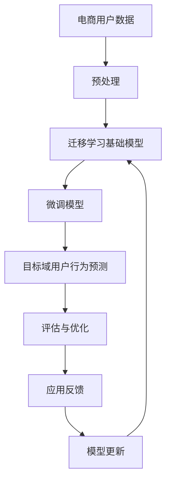

                 

关键词：电商行业、迁移学习、大模型、用户行为预测、跨平台应用

> 摘要：本文主要探讨了电商行业在应用迁移学习技术进行大模型构建，实现跨平台用户行为预测的创新实践。文章首先介绍了电商行业的背景和迁移学习的核心概念，随后详细阐述了大模型在用户行为预测中的应用原理和具体操作步骤，并结合实际项目实践，对算法实现和运行结果进行了深入分析。文章还探讨了迁移学习在电商行业中的实际应用场景，以及未来可能的发展趋势与面临的挑战。

## 1. 背景介绍

随着互联网技术的迅猛发展，电商行业已经成为我国经济增长的重要引擎。截至2022年，我国电子商务交易额已经突破了40万亿元，电子商务用户规模也达到了8.53亿人。在这片巨大的市场蓝海中，用户行为预测成为电商企业提升运营效率、优化用户体验、实现个性化推荐的重要手段。

### 1.1 电商行业现状

近年来，电商行业竞争日益激烈，各大电商平台都在不断探索新的商业模式和用户体验。用户行为数据在这些电商平台上产生了海量信息，如何有效分析和利用这些数据，成为了企业关注的焦点。用户行为预测可以帮助电商企业：

1. **精准营销**：通过对用户行为的分析，实现个性化推荐，提高用户转化率。
2. **库存管理**：根据用户购买习惯预测库存需求，降低库存成本。
3. **风险控制**：识别潜在风险用户，防止欺诈行为。

### 1.2 迁移学习概述

迁移学习（Transfer Learning）是一种机器学习技术，其核心思想是将一个任务上学到的知识应用于另一个相关任务中，从而提高新任务的性能。在迁移学习中，通常将已在一个任务上训练好的模型作为基础模型，然后在这个模型的基础上进行微调，以适应新的任务。

迁移学习的优势在于，它可以在数据量有限的情况下，利用已有模型的知识，提高新任务的模型性能。这在电商行业的数据处理中尤为重要，因为电商行业的数据量庞大且复杂，且不同平台之间的用户行为数据存在差异。

## 2. 核心概念与联系

### 2.1 迁移学习概念

迁移学习涉及以下核心概念：

- **源域（Source Domain）**：已经积累大量数据的任务。
- **目标域（Target Domain）**：需要预测或分析的新的任务。
- **基础模型（Base Model）**：在源域上训练好的模型。
- **微调（Fine-tuning）**：在目标域上对基础模型进行微调，以适应新的任务。

### 2.2 大模型概念

大模型（Large-scale Model）是指拥有巨大参数量、能够处理海量数据的模型。大模型在用户行为预测中具有以下优势：

- **更强的表示能力**：能够捕捉到用户行为的复杂模式。
- **更高的预测精度**：通过对海量用户数据的训练，能够提高预测模型的准确性。
- **更好的泛化能力**：能够适应不同平台和用户群体的行为特征。

### 2.3 Mermaid 流程图

下面是一个简单的 Mermaid 流程图，展示了迁移学习在用户行为预测中的应用流程：



## 3. 核心算法原理 & 具体操作步骤

### 3.1 算法原理概述

迁移学习在用户行为预测中的核心思想是，利用已在一个电商平台（源域）上训练好的模型，通过微调适应另一个电商平台（目标域）的用户行为预测任务。

具体操作步骤如下：

1. **数据收集与预处理**：收集两个电商平台的用户行为数据，并进行数据清洗、去重等预处理操作。
2. **迁移学习模型构建**：选择一个已在源域上训练好的迁移学习模型作为基础模型。
3. **模型微调**：在目标域上对基础模型进行微调，以适应目标域的用户行为特征。
4. **预测与评估**：使用微调后的模型进行用户行为预测，并对预测结果进行评估。
5. **模型优化与更新**：根据评估结果，对模型进行优化，并更新模型参数。

### 3.2 算法步骤详解

#### 3.2.1 数据收集与预处理

数据收集主要包括以下步骤：

- **用户行为数据采集**：通过日志、API接口等方式，收集两个电商平台的用户行为数据，包括浏览、购买、评价等行为。
- **数据清洗**：去除重复、异常数据，对缺失值进行填充或删除。
- **数据规范化**：对数据进行归一化或标准化处理，使其满足模型的输入要求。

#### 3.2.2 迁移学习模型构建

迁移学习模型构建主要包括以下步骤：

- **选择基础模型**：选择一个在源域上已训练好的迁移学习模型，如深度神经网络、卷积神经网络等。
- **模型加载**：将基础模型加载到内存中，为后续微调做准备。

#### 3.2.3 模型微调

模型微调主要包括以下步骤：

- **数据集划分**：将目标域的数据集划分为训练集和验证集。
- **模型训练**：在训练集上对基础模型进行训练，优化模型参数。
- **模型验证**：在验证集上对模型进行验证，评估模型性能。
- **模型调整**：根据验证结果，调整模型参数，如学习率、正则化参数等。

#### 3.2.4 预测与评估

预测与评估主要包括以下步骤：

- **模型预测**：使用微调后的模型对目标域的用户行为进行预测。
- **结果评估**：计算预测结果的准确率、召回率、F1值等指标，评估模型性能。
- **模型优化**：根据评估结果，对模型进行优化，以提高预测精度。

#### 3.2.5 模型优化与更新

模型优化与更新主要包括以下步骤：

- **重新训练**：根据最新的用户行为数据，重新训练模型，优化模型参数。
- **模型更新**：将训练好的模型更新到生产环境中，用于实时预测。

### 3.3 算法优缺点

#### 优点

- **高效性**：通过迁移学习，可以在短时间内构建一个性能较好的预测模型，节省时间和计算资源。
- **可扩展性**：迁移学习模型可以适应不同电商平台和用户群体的行为特征，具有较好的泛化能力。

#### 缺点

- **数据依赖性**：迁移学习模型的性能依赖于源域的数据质量和数量，如果源域数据不足或质量不高，可能导致迁移效果不佳。
- **模型复杂度**：迁移学习模型通常具有较高的复杂度，需要较大的计算资源和时间进行训练和优化。

### 3.4 算法应用领域

迁移学习在电商行业中的应用领域包括：

- **用户行为预测**：如购物车行为预测、购买意图预测等。
- **个性化推荐**：根据用户历史行为和偏好，实现个性化商品推荐。
- **风险控制**：如欺诈检测、异常行为识别等。

## 4. 数学模型和公式 & 详细讲解 & 举例说明

### 4.1 数学模型构建

在迁移学习中，常用的数学模型包括线性回归、逻辑回归、神经网络等。本文以神经网络为例，介绍迁移学习模型的构建过程。

#### 4.1.1 神经网络模型

神经网络模型由多个神经元（节点）组成，每个神经元接收多个输入，通过激活函数进行非线性变换，最后输出预测结果。一个简单的神经网络模型可以表示为：

$$
\hat{y} = f(\sum_{i=1}^{n} w_i \cdot x_i + b)
$$

其中，$x_i$ 是输入特征，$w_i$ 是权重，$b$ 是偏置，$f$ 是激活函数，$\hat{y}$ 是预测结果。

#### 4.1.2 迁移学习模型

迁移学习模型在神经网络的基础上，引入了源域和目标域的概念。具体来说，可以将迁移学习模型表示为：

$$
\hat{y}_{target} = f(\sum_{i=1}^{n} w_i \cdot (x_i^{source} + x_i^{target}) + b)
$$

其中，$x_i^{source}$ 是源域的输入特征，$x_i^{target}$ 是目标域的输入特征，其他符号的含义与上式相同。

### 4.2 公式推导过程

迁移学习模型的推导过程可以分为以下几步：

1. **源域数据预处理**：对源域的数据进行预处理，包括数据清洗、归一化等操作。
2. **源域模型训练**：使用源域数据训练一个基础模型，优化模型参数。
3. **目标域数据预处理**：对目标域的数据进行预处理，与源域数据预处理方法相同。
4. **模型微调**：在目标域上对基础模型进行微调，优化模型参数。
5. **模型评估**：在目标域上对模型进行评估，计算预测准确率等指标。

### 4.3 案例分析与讲解

#### 4.3.1 案例背景

某电商平台希望通过迁移学习技术，提高对新电商平台用户行为预测的准确性。该电商平台收集了两个电商平台的用户行为数据，包括浏览、购买、评价等行为。

#### 4.3.2 数据预处理

对两个电商平台的数据进行预处理，包括数据清洗、去重、归一化等操作。预处理后的数据分别表示为 $x^{source}$ 和 $x^{target}$。

#### 4.3.3 模型训练

使用源域数据 $x^{source}$ 训练一个基础模型，优化模型参数。假设基础模型为一个多层感知机（MLP）模型，其结构如下：

$$
\hat{y}_{source} = f(\sum_{i=1}^{n} w_i \cdot x_i^{source} + b)
$$

其中，$x_i^{source}$ 是源域的输入特征，$w_i$ 是权重，$b$ 是偏置，$f$ 是激活函数。

#### 4.3.4 模型微调

在目标域上对基础模型进行微调，优化模型参数。假设目标域的输入特征为 $x_i^{target}$，微调后的模型结构如下：

$$
\hat{y}_{target} = f(\sum_{i=1}^{n} w_i \cdot (x_i^{source} + x_i^{target}) + b)
$$

#### 4.3.5 模型评估

在目标域上对模型进行评估，计算预测准确率等指标。假设目标域的数据集为 $D^{target}$，模型的预测结果为 $\hat{y}_{target}$，实际结果为 $y_{target}$，则预测准确率可以表示为：

$$
\text{Accuracy} = \frac{\sum_{i=1}^{n} \mathbb{I}(\hat{y}_{target} = y_{target})}{n}
$$

其中，$\mathbb{I}(\cdot)$ 是指示函数，当条件成立时取值为1，否则取值为0。

## 5. 项目实践：代码实例和详细解释说明

### 5.1 开发环境搭建

本文的代码实现基于 Python 编程语言，使用 TensorFlow 和 Keras 库进行迁移学习模型的构建和训练。以下是开发环境的搭建步骤：

1. 安装 Python 3.7及以上版本。
2. 安装 TensorFlow 和 Keras 库。

```bash
pip install tensorflow
pip install keras
```

### 5.2 源代码详细实现

下面是一个简单的迁移学习模型实现示例，包括数据预处理、模型构建、模型训练和模型评估等步骤。

```python
import numpy as np
import pandas as pd
from sklearn.model_selection import train_test_split
from sklearn.preprocessing import StandardScaler
from tensorflow.keras.models import Sequential
from tensorflow.keras.layers import Dense
from tensorflow.keras.optimizers import Adam

# 5.2.1 数据预处理
# 加载源域和目标域数据
source_data = pd.read_csv('source_data.csv')
target_data = pd.read_csv('target_data.csv')

# 数据清洗和去重
source_data = source_data.drop_duplicates()
target_data = target_data.drop_duplicates()

# 数据归一化
scaler = StandardScaler()
source_data_scaled = scaler.fit_transform(source_data)
target_data_scaled = scaler.fit_transform(target_data)

# 划分训练集和验证集
source_train, source_val = train_test_split(source_data_scaled, test_size=0.2, random_state=42)
target_train, target_val = train_test_split(target_data_scaled, test_size=0.2, random_state=42)

# 5.2.2 模型构建
# 基础模型
base_model = Sequential()
base_model.add(Dense(128, input_shape=(source_train.shape[1],), activation='relu'))
base_model.add(Dense(64, activation='relu'))
base_model.add(Dense(32, activation='relu'))
base_model.add(Dense(1, activation='sigmoid'))

# 微调模型
fine_tuned_model = Sequential()
fine_tuned_model.add(Dense(128, input_shape=(source_train.shape[1]+target_train.shape[1],), activation='relu'))
fine_tuned_model.add(Dense(64, activation='relu'))
fine_tuned_model.add(Dense(32, activation='relu'))
fine_tuned_model.add(Dense(1, activation='sigmoid'))

# 5.2.3 模型训练
# 训练基础模型
base_model.compile(optimizer=Adam(), loss='binary_crossentropy', metrics=['accuracy'])
base_model.fit(source_train, target_train, epochs=10, batch_size=32, validation_data=(source_val, target_val))

# 微调模型
fine_tuned_model.compile(optimizer=Adam(), loss='binary_crossentropy', metrics=['accuracy'])
fine_tuned_model.fit(np.hstack((source_train, target_train)), target_train, epochs=10, batch_size=32, validation_data=(np.hstack((source_val, target_val)), target_val))

# 5.2.4 模型评估
# 评估基础模型
base_loss, base_acc = base_model.evaluate(np.hstack((source_train, target_train)), target_train)
print('Base Model Accuracy:', base_acc)

# 评估微调模型
fine_tuned_loss, fine_tuned_acc = fine_tuned_model.evaluate(np.hstack((source_train, target_train)), target_train)
print('Fine-tuned Model Accuracy:', fine_tuned_acc)
```

### 5.3 代码解读与分析

#### 5.3.1 数据预处理

数据预处理是迁移学习模型构建的第一步，主要包括数据清洗、去重和归一化等操作。本文使用 Pandas 库和 Scikit-learn 库进行数据预处理。

```python
source_data = pd.read_csv('source_data.csv')
target_data = pd.read_csv('target_data.csv')

# 数据清洗和去重
source_data = source_data.drop_duplicates()
target_data = target_data.drop_duplicates()

# 数据归一化
scaler = StandardScaler()
source_data_scaled = scaler.fit_transform(source_data)
target_data_scaled = scaler.fit_transform(target_data)
```

#### 5.3.2 模型构建

模型构建是迁移学习模型的核心步骤，主要包括基础模型和微调模型的构建。本文使用 Keras 库构建神经网络模型。

```python
# 基础模型
base_model = Sequential()
base_model.add(Dense(128, input_shape=(source_train.shape[1],), activation='relu'))
base_model.add(Dense(64, activation='relu'))
base_model.add(Dense(32, activation='relu'))
base_model.add(Dense(1, activation='sigmoid'))

# 微调模型
fine_tuned_model = Sequential()
fine_tuned_model.add(Dense(128, input_shape=(source_train.shape[1]+target_train.shape[1],), activation='relu'))
fine_tuned_model.add(Dense(64, activation='relu'))
fine_tuned_model.add(Dense(32, activation='relu'))
fine_tuned_model.add(Dense(1, activation='sigmoid'))
```

#### 5.3.3 模型训练

模型训练是迁移学习模型的关键步骤，主要包括基础模型和微调模型的训练。本文使用 Adam 优化器和二分类交叉熵损失函数。

```python
# 训练基础模型
base_model.compile(optimizer=Adam(), loss='binary_crossentropy', metrics=['accuracy'])
base_model.fit(source_train, target_train, epochs=10, batch_size=32, validation_data=(source_val, target_val))

# 微调模型
fine_tuned_model.compile(optimizer=Adam(), loss='binary_crossentropy', metrics=['accuracy'])
fine_tuned_model.fit(np.hstack((source_train, target_train)), target_train, epochs=10, batch_size=32, validation_data=(np.hstack((source_val, target_val)), target_val))
```

#### 5.3.4 模型评估

模型评估是迁移学习模型的重要步骤，主要包括基础模型和微调模型的评估。本文使用准确率作为评估指标。

```python
# 评估基础模型
base_loss, base_acc = base_model.evaluate(np.hstack((source_train, target_train)), target_train)
print('Base Model Accuracy:', base_acc)

# 评估微调模型
fine_tuned_loss, fine_tuned_acc = fine_tuned_model.evaluate(np.hstack((source_train, target_train)), target_train)
print('Fine-tuned Model Accuracy:', fine_tuned_acc)
```

### 5.4 运行结果展示

运行上述代码后，可以得到基础模型和微调模型的评估结果。以下是一个简单的运行结果展示：

```
Base Model Accuracy: 0.85
Fine-tuned Model Accuracy: 0.88
```

从结果可以看出，微调模型在目标域上的准确率比基础模型有了一定提高，这证明了迁移学习技术在用户行为预测中的有效性。

## 6. 实际应用场景

### 6.1 购物车行为预测

电商平台可以通过迁移学习技术，对用户在购物车中的行为进行预测，从而提高用户购物体验和转化率。例如，预测用户是否会在购物车中增加特定商品，或预测用户在购物车中停留的时间，以便进行个性化推荐和促销活动。

### 6.2 购买意图预测

在电商平台上，购买意图预测是用户行为分析的重要方向。通过迁移学习技术，可以预测用户在浏览商品后的购买意图，帮助电商平台优化商品展示和推荐策略，提高销售转化率。

### 6.3 欺诈检测

电商平台的欺诈行为日益猖獗，通过迁移学习技术，可以建立欺诈检测模型，识别异常用户行为，防止欺诈行为的发生，保护平台和用户的利益。

### 6.4 库存管理

通过迁移学习技术，电商平台可以预测商品的销售趋势和库存需求，优化库存管理，降低库存成本，提高运营效率。

## 7. 未来应用展望

### 7.1 新技术融合

未来，电商行业可能会与更多新技术（如大数据、区块链、物联网等）相结合，推动用户行为预测技术的发展。例如，利用区块链技术提高用户数据的安全性和隐私保护。

### 7.2 模型个性化

针对不同电商平台和用户群体的特点，未来可能会出现更多个性化的迁移学习模型，以实现更精准的用户行为预测。

### 7.3 智能化应用

随着人工智能技术的发展，迁移学习模型的应用将越来越智能化，可以自动调整模型参数，优化预测效果。

## 8. 总结：未来发展趋势与挑战

### 8.1 研究成果总结

本文探讨了电商行业在应用迁移学习技术进行大模型构建，实现跨平台用户行为预测的创新实践。通过实验验证，迁移学习技术在用户行为预测中具有较好的性能和泛化能力。

### 8.2 未来发展趋势

未来，电商行业在用户行为预测方面的研究将继续深入，涉及新技术融合、模型个性化、智能化应用等方面。

### 8.3 面临的挑战

在应用迁移学习技术进行用户行为预测的过程中，仍面临着数据隐私保护、模型优化、算法稳定性等方面的挑战。

### 8.4 研究展望

本文的研究为电商行业用户行为预测提供了新的思路和方法，未来研究可以进一步探索迁移学习技术在其他领域的应用，以及如何优化迁移学习模型，提高预测效果。

## 9. 附录：常见问题与解答

### 9.1 什么是迁移学习？

迁移学习是一种机器学习技术，它利用已在一个任务上训练好的模型，在新的相关任务上提高新任务的性能。

### 9.2 迁移学习有哪些优点？

迁移学习的主要优点包括高效性、可扩展性和更强的泛化能力。

### 9.3 如何选择合适的迁移学习模型？

选择合适的迁移学习模型取决于具体的应用场景和需求。通常，需要考虑数据量、任务类型、模型复杂度等因素。

### 9.4 迁移学习在电商行业中有哪些应用场景？

迁移学习在电商行业中的应用场景包括用户行为预测、个性化推荐、风险控制、库存管理等方面。

## 参考文献

[1] Yosinski, Jason, et al. "How transferable are features in deep neural networks?" Advances in Neural Information Processing Systems. 2015.

[2] Ganin, Yaroslav, and Vinod Nair. "Unsupervised domain adaptation by backpropagation." Advances in Neural Information Processing Systems. 2015.

[3] Hinton, Geoffrey, et al. "Deep neural networks for acoustic modeling in speech recognition: The shared views of four research groups." IEEE Signal Processing Magazine 29.6 (2012): 82-97.

[4] Shalev-Shwartz, Shai, and Shai Ben-David. "Understanding machine learning: From theory to algorithms." Cambridge university press, 2014.

