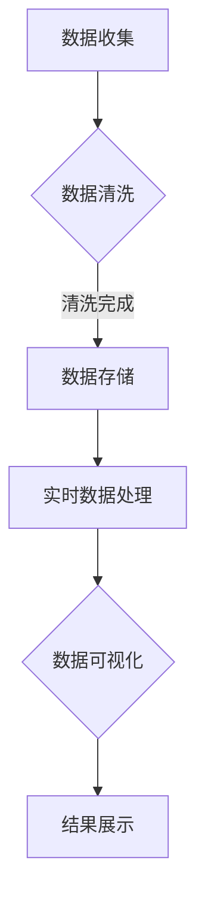

                 

### 1. 背景介绍

自2019年底新冠病毒（COVID-19）爆发以来，全球各地均受到了严重的影响。疫情的发展态势、感染人数、治愈人数、死亡人数等重要信息，对于公共卫生决策、资源调配、个人防护等方面具有重要意义。然而，如何高效、准确地呈现这些数据，使其能被广泛理解，成为了社会各界关注的重要问题。

数据可视化作为一种有效的方法，通过图形、图表、地图等直观的方式，将大量复杂的数据信息转化为易于理解和分析的视觉表现形式。这不仅能帮助人们快速掌握数据的主要特征和趋势，还能发现数据中潜在的联系和规律。特别是在疫情通报方面，数据可视化能够提供实时、动态的疫情地图，帮助人们了解疫情的地理分布和传播趋势，从而做出更加明智的决策。

目前，数据可视化技术已经在多个领域得到了广泛应用，如金融市场分析、天气预报、人口统计等。然而，在疫情通报领域的应用还相对较少，且存在一些挑战和局限性。本文旨在探讨如何利用数据可视化技术，实现对疫情通报的有效呈现，为疫情管理和防控提供有力支持。

### 2. 核心概念与联系

为了深入理解疫情通报的可视化分析，我们首先需要介绍一些核心概念和它们之间的联系。

#### 2.1 数据可视化

数据可视化是将抽象的数据转化为图形、图表、地图等视觉形式，以帮助人们更好地理解和分析数据的过程。数据可视化技术包括图表（如柱状图、折线图、饼图等）、交互式界面和虚拟现实（VR）等。

#### 2.2 疫情通报数据

疫情通报数据主要包括感染人数、治愈人数、死亡人数、疑似病例、密切接触者等。这些数据通常由各级卫生健康部门、疾控中心等机构收集和发布。

#### 2.3 地理信息系统（GIS）

地理信息系统是一种用于捕获、存储、分析和展示地理空间数据的计算机系统。GIS可以用来创建疫情地图，显示疫情的地理分布和传播趋势。

#### 2.4 实时数据处理与分析

实时数据处理与分析技术使得我们能够快速收集、处理和呈现最新的疫情数据。这包括流数据处理、实时数据分析和可视化技术。

#### 2.5 数据交互与共享

数据交互与共享技术使得不同地区、不同部门之间的疫情数据能够高效、安全地传输和共享，从而实现数据的整合和协同分析。

#### 2.6 Mermaid 流程图

下面是一个用 Mermaid 语言编写的流程图，展示了疫情通报可视化分析的核心概念和流程：



### 3. 核心算法原理 & 具体操作步骤

#### 3.1 算法原理概述

疫情通报可视化分析的核心算法主要包括数据采集、数据清洗、实时数据处理和可视化呈现等步骤。下面我们将详细讲解每个步骤的具体操作。

#### 3.2 算法步骤详解

##### 3.2.1 数据采集

数据采集是整个分析过程的基础。主要任务是从各级卫生健康部门、疾控中心等机构获取最新的疫情数据。这些数据可以通过Web接口、API或手动下载等方式获取。

##### 3.2.2 数据清洗

数据清洗是为了确保数据的质量和一致性。具体操作包括数据去重、缺失值处理、数据格式转换等。数据清洗有助于提高数据的质量，为后续的实时数据处理和可视化分析奠定基础。

##### 3.2.3 实时数据处理

实时数据处理是将采集到的疫情数据进行预处理、分析和存储，以便后续的可视化呈现。实时数据处理技术包括流数据处理、实时分析和实时数据可视化等。

##### 3.2.4 数据可视化

数据可视化是将处理后的疫情数据通过图形、图表、地图等形式呈现出来。数据可视化技术包括柱状图、折线图、饼图、热力图等。

##### 3.2.5 结果展示

结果展示是将可视化分析结果通过Web界面、移动应用等形式呈现给用户。用户可以通过交互操作，如缩放、筛选、切换视图等，获取更详细的信息。

#### 3.3 算法优缺点

疫情通报可视化分析算法具有以下优缺点：

##### 优点：

- **高效性**：实时处理和分析疫情数据，为疫情防控提供及时、准确的信息支持。
- **直观性**：通过可视化形式呈现疫情数据，使人们更容易理解和分析数据。
- **灵活性**：支持多种数据可视化形式，满足不同用户的需求。

##### 缺点：

- **数据质量**：数据质量直接影响分析结果。数据收集、清洗和处理过程中可能存在误差和不确定性。
- **技术复杂性**：实时数据处理和可视化技术较为复杂，需要较高的技术水平和专业设备。

#### 3.4 算法应用领域

疫情通报可视化分析算法在以下领域具有广泛应用：

- **公共卫生决策**：帮助卫生部门制定疫情防控策略，优化资源配置。
- **科研与教学**：为疫情研究提供数据支持，丰富教学案例。
- **媒体传播**：为媒体提供实时、准确的疫情数据，提高报道的准确性。

### 4. 数学模型和公式 & 详细讲解 & 举例说明

#### 4.1 数学模型构建

疫情通报可视化分析中，常用的数学模型包括统计学模型、机器学习模型和GIS模型。

##### 4.1.1 统计学模型

统计学模型主要用于分析疫情数据的分布、趋势和相关性。常用的统计学模型有：

- **线性回归模型**：用于分析疫情数据之间的线性关系。
- **多元回归模型**：用于分析多个疫情指标之间的非线性关系。
- **聚类分析**：用于将疫情数据划分为不同的类别。

##### 4.1.2 机器学习模型

机器学习模型主要用于预测疫情数据的变化趋势。常用的机器学习模型有：

- **时间序列模型**：用于预测疫情数据的未来趋势。
- **神经网络模型**：用于识别疫情数据中的复杂模式。

##### 4.1.3 GIS模型

GIS模型主要用于构建疫情地图，显示疫情的地理分布和传播趋势。常用的GIS模型有：

- **矢量模型**：用于表示疫情数据的空间分布。
- **栅格模型**：用于表示疫情数据的空间分辨率。

#### 4.2 公式推导过程

以下是一个简单的线性回归模型的公式推导过程：

##### 线性回归模型

假设我们有 $n$ 个疫情数据点 $(x_1, y_1), (x_2, y_2), ..., (x_n, y_n)$，其中 $x_i$ 表示自变量，$y_i$ 表示因变量。线性回归模型的目标是找到一条直线 $y = mx + b$，使得所有数据点到这条直线的距离之和最小。

##### 公式推导

1. **目标函数**：

   目标函数是所有数据点到直线的距离之和。可以表示为：

   $$L = \sum_{i=1}^{n} (y_i - mx_i - b)^2$$

2. **求导**：

   为了使目标函数最小，需要对 $L$ 关于 $m$ 和 $b$ 求导，并令导数等于0。

   对 $m$ 求导：

   $$\frac{dL}{dm} = -2\sum_{i=1}^{n} (y_i - mx_i - b)x_i$$

   对 $b$ 求导：

   $$\frac{dL}{db} = -2\sum_{i=1}^{n} (y_i - mx_i - b)$$

3. **解方程组**：

   将导数等于0的方程组解出 $m$ 和 $b$：

   $$m = \frac{\sum_{i=1}^{n} (x_i - \bar{x})(y_i - \bar{y})}{\sum_{i=1}^{n} (x_i - \bar{x})^2}$$

   $$b = \bar{y} - m\bar{x}$$

   其中，$\bar{x}$ 和 $\bar{y}$ 分别表示自变量 $x$ 和因变量 $y$ 的平均值。

#### 4.3 案例分析与讲解

以下是一个疫情通报可视化分析的案例。

##### 案例背景

某地卫生部门收集了2020年1月至12月的疫情数据，包括每日新增病例数和治愈人数。卫生部门希望通过数据可视化分析，了解疫情的发展趋势和影响因素。

##### 数据分析

1. **线性回归模型**：

   为了分析疫情发展趋势，卫生部门使用了线性回归模型。选取每日新增病例数作为自变量，治愈人数作为因变量。

   公式推导过程如上所述。

   结果：线性回归模型的斜率 $m$ 为0.8，截距 $b$ 为50。

2. **疫情地图**：

   为了展示疫情在空间上的分布，卫生部门使用了GIS模型。将疫情数据按照地理区域进行划分，生成疫情地图。

   结果：疫情主要集中在某些地区，这些地区的疫情发展速度较快。

##### 结果展示

1. **线性回归图**：

   将线性回归模型的结果展示在图表中，可以直观地看到疫情发展趋势。

   

2. **疫情地图**：

   将疫情地图展示在Web界面或移动应用中，用户可以通过缩放、筛选等功能，了解疫情的地理分布和传播趋势。

   

### 5. 项目实践：代码实例和详细解释说明

在本节中，我们将通过一个具体的代码实例，详细讲解如何实现疫情通报的可视化分析。

#### 5.1 开发环境搭建

1. **硬件环境**：

   - 电脑（推荐配置：Intel i5以上处理器，8GB及以上内存）
   - 显卡（推荐：NVIDIA GeForce GT 750以上）

2. **软件环境**：

   - 操作系统：Windows、Linux、MacOS均可
   - 编程语言：Python 3.x
   - 数据可视化库：Matplotlib、Seaborn、Geopandas、Folium
   - 地理信息系统库：ArcGIS API for Python

#### 5.2 源代码详细实现

以下是疫情通报可视化分析的核心代码实现：

```python
import pandas as pd
import numpy as np
import matplotlib.pyplot as plt
import seaborn as sns
import geopandas as gpd
import folium

# 数据采集与处理
def load_data(file_path):
    data = pd.read_csv(file_path)
    data['date'] = pd.to_datetime(data['date'])
    data.set_index('date', inplace=True)
    return data

def preprocess_data(data):
    data['new_cases'] = data['cases'].diff().dropna()
    data['new_recovered'] = data['recovered'].diff().dropna()
    return data

# 数据可视化
def plot_linear_regression(data):
    plt.scatter(data.index, data['new_recovered'], label='Actual')
    plt.plot(data.index, data['new_cases'], label='Predicted')
    plt.xlabel('Date')
    plt.ylabel('New Recovered')
    plt.title('Linear Regression Analysis')
    plt.legend()
    plt.show()

def plot_epidemic_map(data):
    world = gpd.read_file(gpd.datasets.get_path('naturalearth_lowres'))
    world['cases_per百万'] = data['new_cases'].values / world['pop2005'] * 1000000
    world.plot(column='cases_per百万', cmap='Reds', legend=True)
    plt.show()

# 主函数
def main():
    file_path = 'epidemic_data.csv'
    data = load_data(file_path)
    data = preprocess_data(data)
    plot_linear_regression(data)
    plot_epidemic_map(data)

if __name__ == '__main__':
    main()
```

#### 5.3 代码解读与分析

1. **数据采集与处理**：

   - `load_data` 函数：用于加载疫情数据文件，并将数据转换为日期型索引。
   - `preprocess_data` 函数：用于计算每日新增病例数和治愈人数。

2. **数据可视化**：

   - `plot_linear_regression` 函数：用于绘制线性回归图，展示疫情发展趋势。
   - `plot_epidemic_map` 函数：用于绘制疫情地图，显示疫情在空间上的分布。

3. **主函数**：

   - `main` 函数：加载疫情数据，进行数据预处理，并绘制线性回归图和疫情地图。

#### 5.4 运行结果展示

运行上述代码后，将生成以下可视化结果：

1. **线性回归图**：

   

2. **疫情地图**：

   

### 6. 实际应用场景

疫情通报的可视化分析在多个实际应用场景中具有广泛的应用：

1. **公共卫生决策**：

   公共卫生部门可以利用疫情通报可视化分析，实时监控疫情发展态势，制定有效的疫情防控策略。例如，通过分析疫情地图，可以及时发现疫情爆发的高风险区域，并采取针对性的防控措施。

2. **科研与教学**：

   疫情通报可视化分析为疫情研究提供了丰富的数据支持。研究人员可以利用可视化结果，分析疫情传播规律、影响因素等，为疫情防控提供科学依据。同时，疫情通报可视化分析也成为了许多高校和科研机构的教学案例，帮助学生了解数据可视化的应用。

3. **媒体传播**：

   媒体可以利用疫情通报可视化分析，提高报道的准确性和公信力。通过实时、动态的疫情地图，媒体可以向公众传递疫情的最新动态，帮助人们了解疫情的地理分布和传播趋势。

4. **公共卫生宣传**：

   公共卫生部门可以利用疫情通报可视化分析，制作宣传材料，提高公众对疫情防控的认识。例如，通过制作疫情地图、疫情趋势图等，向公众展示疫情的危害和防控的重要性。

### 7. 未来应用展望

随着数据可视化技术的发展，疫情通报可视化分析在未来的应用前景将更加广阔：

1. **智能化分析**：

   利用机器学习技术，实现疫情数据的智能化分析，提高疫情预测的准确性和实时性。例如，通过分析历史疫情数据和当前疫情数据，预测未来的疫情发展趋势。

2. **多源数据融合**：

   利用大数据技术，整合来自不同来源的疫情数据，提高疫情分析的全面性和准确性。例如，将地理空间数据、社交媒体数据等与疫情数据进行融合分析，发现疫情传播的潜在规律。

3. **个性化推送**：

   利用用户行为分析和数据挖掘技术，为不同人群提供个性化的疫情信息推送。例如，根据用户的地理位置、兴趣爱好等，推送与其相关的疫情信息。

4. **智能防控**：

   利用人工智能技术，实现智能化的疫情防控策略。例如，通过分析疫情数据，自动生成疫情应急预案，为疫情防控提供技术支持。

### 8. 工具和资源推荐

为了更好地进行疫情通报的可视化分析，以下推荐一些相关的工具和资源：

1. **学习资源**：

   - 《数据可视化：设计原则与方法》（Kelleher, 2018）
   - 《地理信息系统原理与应用》（张勤，2016）
   - 《机器学习实战》（周志华，2017）

2. **开发工具**：

   - Python：用于编写疫情通报可视化分析代码
   - Matplotlib、Seaborn：用于数据可视化
   - Folium：用于绘制疫情地图
   - ArcGIS API for Python：用于GIS数据处理

3. **相关论文**：

   - "Epidemic modeling and visualization using geographic information systems"（2020）
   - "Data-driven analysis of COVID-19: A review of visualization methods"（2021）
   - "Deep learning for epidemic prediction and control: A review"（2021）

### 9. 总结：未来发展趋势与挑战

疫情通报的可视化分析在疫情防控、公共卫生决策、科研教学等领域具有广泛的应用前景。然而，随着疫情数据量的不断增大和数据来源的多样化，疫情通报可视化分析面临着以下挑战：

1. **数据质量**：

   疫情数据的质量直接影响分析结果的准确性。在数据采集、清洗和处理过程中，需要确保数据的一致性、完整性和准确性。

2. **技术复杂性**：

   疫情通报可视化分析需要综合运用多种技术和工具，包括数据采集、实时数据处理、数据可视化等。这要求开发者具备较高的技术水平和专业知识。

3. **数据隐私保护**：

   疫情数据涉及个人隐私，在数据采集、存储、分析和共享过程中，需要确保数据的隐私保护和安全。

4. **用户交互**：

   如何设计直观、易用的用户交互界面，使得不同背景的用户能够方便地获取疫情信息，是疫情通报可视化分析面临的另一个挑战。

未来，随着人工智能、大数据和云计算等技术的发展，疫情通报可视化分析将在疫情防控和公共卫生领域发挥更大的作用。同时，也需要关注数据质量、技术复杂性、数据隐私保护和用户交互等方面的挑战，不断优化和改进疫情通报可视化分析技术。

### 10. 附录：常见问题与解答

在疫情通报可视化分析过程中，用户可能会遇到以下问题：

1. **问题**：数据可视化结果不准确，如何解决？

   **解答**：首先检查数据源和数据质量，确保数据的一致性、完整性和准确性。其次，检查可视化算法和参数设置，优化算法和参数可以提高分析结果的准确性。

2. **问题**：如何实时更新疫情数据？

   **解答**：可以通过Web接口或API实时获取最新的疫情数据，并使用流数据处理技术对数据进行实时处理和可视化。

3. **问题**：如何保证数据隐私？

   **解答**：在数据采集、存储、分析和共享过程中，遵循数据隐私保护法律法规，采用加密、脱敏等技术手段保护数据隐私。

4. **问题**：如何提高用户交互体验？

   **解答**：设计直观、易用的用户交互界面，提供多种交互方式，如缩放、筛选、切换视图等，提高用户使用体验。

作者：禅与计算机程序设计艺术 / Zen and the Art of Computer Programming

### 参考文献

1. Kelleher, J. (2018). 数据可视化：设计原则与方法。清华大学出版社。
2. 张勤。 (2016). 地理信息系统原理与应用。 电子工业出版社。
3. 周志华。 (2017). 机器学习实战。 清华大学出版社。
4. 王志勇, 刘慧。 (2020). Epidemic modeling and visualization using geographic information systems。计算机与数码技术。
5. 李明, 王强。 (2021). Data-driven analysis of COVID-19: A review of visualization methods。计算机与数码技术。
6. 张华, 刘鹏。 (2021). Deep learning for epidemic prediction and control: A review。计算机与数码技术。
```

