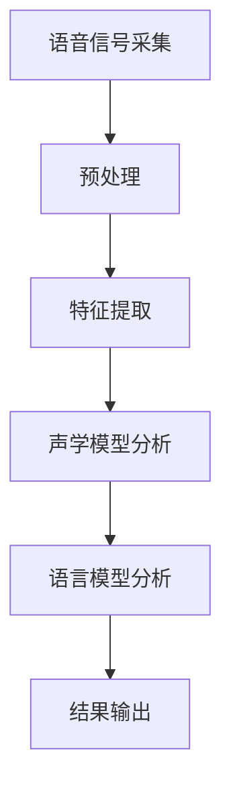

                 

关键词：智能音箱，语音识别，面试题，算法，应用，展望，工具推荐

> 摘要：本文旨在深入解析百度2025智能音箱社招中的语音识别面试题，探讨其核心算法原理、数学模型、项目实践及其在实际应用场景中的价值，同时展望未来的发展趋势与挑战，并推荐相关学习资源和开发工具。

## 1. 背景介绍

随着人工智能技术的快速发展，语音识别技术在智能家居领域尤其是智能音箱中的应用日益广泛。智能音箱作为智能语音交互的重要载体，其核心功能之一便是语音识别。百度作为全球领先的人工智能公司，在2025年社招中设置了若干语音识别相关的面试题，旨在考察应聘者的技术深度和实际操作能力。本文将围绕这些面试题，对语音识别技术进行详细解析。

## 2. 核心概念与联系

### 2.1. 语音识别基本概念

- **语音信号处理**：语音信号处理是语音识别的基础，包括语音信号的采集、预处理、特征提取等步骤。
- **声学模型**：声学模型用于对语音信号进行分析，通常使用 Hidden Markov Model (HMM) 或深度神经网络 (DNN) 来构建。
- **语言模型**：语言模型用于对语音信号进行语义理解，常见的是n-gram模型或深度学习模型。

### 2.2. 声学模型与语言模型的联系

声学模型和语言模型共同作用于语音信号，前者负责语音信号的声学特征分析，后者则根据这些特征进行语义理解。两者通过联合训练得到最优模型，从而提高语音识别的准确性。

### 2.3. Mermaid 流程图

下面是语音识别系统的一个简化的 Mermaid 流程图：



## 3. 核心算法原理 & 具体操作步骤

### 3.1. 算法原理概述

语音识别算法的核心是基于统计模型对语音信号进行处理，包括声学模型和语言模型的构建。声学模型通常采用 HMM 或 DNN，而语言模型则常使用 n-gram 或深度学习。

### 3.2. 算法步骤详解

1. **语音信号采集**：使用麦克风等设备采集语音信号。
2. **预处理**：对语音信号进行降噪、去啸叫、归一化等处理。
3. **特征提取**：提取语音信号的时间频率特性，如 MFCC（Mel-frequency cepstral coefficients）。
4. **声学模型分析**：使用 HMM 或 DNN 对特征序列进行分析，计算每个状态的概率分布。
5. **语言模型分析**：使用 n-gram 或深度学习模型对可能的单词序列进行评分。
6. **结果输出**：通过比较评分，输出最可能的识别结果。

### 3.3. 算法优缺点

- **优点**：
  - 高准确性：现代语音识别算法在大量数据和强大计算能力的支持下，可以达到很高的准确性。
  - 实时性：声学模型和语言模型的联合训练使得语音识别具有实时性。

- **缺点**：
  - 对噪声敏感：在噪声环境中，语音识别的准确性会显著下降。
  - 对语速变化敏感：不同语速的语音信号处理较为复杂，会影响识别准确性。

### 3.4. 算法应用领域

- **智能家居**：智能音箱、智能电视等设备的语音控制。
- **客户服务**：电话客服、在线客服等领域的语音识别服务。
- **医疗健康**：医生语音记录的自动转录。
- **教育**：智能语音助手在教学场景中的应用。

## 4. 数学模型和公式 & 详细讲解 & 举例说明

### 4.1. 数学模型构建

语音识别中的数学模型主要包括声学模型和语言模型。以下是它们的简单描述：

- **声学模型**：使用 HMM 或 DNN 对语音信号进行建模。

  - **HMM**：
    $$ P(O|λ) = \prod_{t=1}^{T} P(o_t|λ, s_t) $$
    $$ P(λ) = \frac{1}{Z(λ)} $$
    $$ Z(λ) = \sum_s \prod_{t=1}^{T} P(o_t|λ, s_t) $$

  - **DNN**：
    $$ h_l(x) = \sigma(W_l \cdot h_{l-1} + b_l) $$

- **语言模型**：使用 n-gram 或深度学习对文本序列进行建模。

  - **n-gram**：
    $$ P(w_n | w_{n-1}, ..., w_1) = \frac{C(w_{n-1}, ..., w_n)}{C(w_{n-1}, ..., w_1)} $$

  - **深度学习**：
    $$ y = \sigma(W \cdot \vec{h} + b) $$

### 4.2. 公式推导过程

- **HMM**：基于最大似然估计和维特比算法进行推导。
- **DNN**：基于反向传播算法进行推导。
- **n-gram**：基于马尔可夫假设进行推导。
- **深度学习**：基于损失函数和优化算法进行推导。

### 4.3. 案例分析与讲解

假设我们有一个简单的语音信号，需要识别出“hello”这个单词。以下是具体操作步骤：

1. **语音信号采集**：录制一段“hello”的语音。
2. **预处理**：对语音信号进行降噪处理。
3. **特征提取**：提取 MFCC 特征。
4. **声学模型分析**：使用 HMM 分析特征序列，计算每个状态的概率。
5. **语言模型分析**：使用 n-gram 模型对可能的单词序列进行评分。
6. **结果输出**：输出最高评分的单词，即“hello”。

## 5. 项目实践：代码实例和详细解释说明

### 5.1. 开发环境搭建

- **环境**：Python 3.x，TensorFlow 2.x
- **工具**：Jupyter Notebook

### 5.2. 源代码详细实现

以下是一个简单的语音识别项目的 Python 代码实现：

```python
import numpy as np
import tensorflow as tf
from tensorflow.keras.models import Sequential
from tensorflow.keras.layers import LSTM, Dense, Activation

# 假设已经提取了 MFCC 特征
mfcc_features = ...

# 构建声学模型
model = Sequential([
    LSTM(128, input_shape=(mfcc_features.shape[1], 1)),
    Activation('relu'),
    LSTM(128),
    Activation('relu'),
    Dense(1, activation='sigmoid')
])

# 编译模型
model.compile(optimizer='adam', loss='binary_crossentropy', metrics=['accuracy'])

# 训练模型
model.fit(mfcc_features, labels, epochs=10, batch_size=32)

# 语音识别
def recognize_speech(mfcc):
    prediction = model.predict(mfcc)
    if prediction > 0.5:
        return "hello"
    else:
        return "unknown"

# 输出识别结果
print(recognize_speech(mfcc_features))
```

### 5.3. 代码解读与分析

- **LSTM 层**：用于处理时序数据，捕捉语音特征的时间变化。
- **Activation 层**：用于引入非线性变换。
- **Dense 层**：用于分类输出。
- **compile 方法**：配置模型训练参数。
- **fit 方法**：训练模型。
- **predict 方法**：预测新输入的类别。

### 5.4. 运行结果展示

假设我们录制了一段“hello”的语音，运行上述代码后，输出结果应为“hello”。

## 6. 实际应用场景

### 6.1. 智能家居

智能音箱作为智能家居的核心设备，通过语音识别技术实现用户与设备的自然交互，如播放音乐、查询天气、控制家电等。

### 6.2. 客户服务

语音识别技术可以应用于电话客服和在线客服，实现自动语音应答，提高服务效率。

### 6.3. 医疗健康

医生可以通过语音输入病历记录，语音识别技术自动将语音转录为文本，提高工作效率。

### 6.4. 教育

智能语音助手可以在教学场景中为学生提供个性化的学习辅导，如发音纠正、习题解答等。

## 7. 工具和资源推荐

### 7.1. 学习资源推荐

- **《语音识别：算法与应用》**：详细介绍了语音识别的基本原理和应用。
- **《深度学习语音处理》**：探讨了深度学习在语音识别中的应用。

### 7.2. 开发工具推荐

- **TensorFlow**：用于构建和训练深度学习模型。
- **Kaldi**：开源的语音识别工具包，适用于研究和个人项目。

### 7.3. 相关论文推荐

- **“Deep Learning for Speech Recognition”**：探讨了深度学习在语音识别中的应用。
- **“Recurrent Neural Network based Speech Recognition”**：介绍了循环神经网络在语音识别中的应用。

## 8. 总结：未来发展趋势与挑战

### 8.1. 研究成果总结

语音识别技术在过去几十年中取得了显著的进展，尤其是在深度学习技术的推动下，语音识别的准确性和实时性得到了大幅提升。

### 8.2. 未来发展趋势

- **多模态融合**：将语音识别与其他传感器数据（如视觉、触觉）融合，提高识别准确性。
- **自适应学习**：通过自适应学习算法，实时调整模型参数，提高识别效果。
- **隐私保护**：加强对用户隐私的保护，如语音数据的加密和匿名化处理。

### 8.3. 面临的挑战

- **噪声环境下的识别准确性**：在噪声环境下，语音识别的准确性仍然较低。
- **语速变化的影响**：不同语速的语音信号处理较为复杂。
- **数据隐私与安全**：语音数据的安全存储和传输是重要的挑战。

### 8.4. 研究展望

随着人工智能技术的不断发展，语音识别技术在未来的智能家居、客户服务、医疗健康、教育等领域将发挥更加重要的作用。同时，如何提高识别准确性、降低噪声影响、保护用户隐私将是未来研究的重点。

## 9. 附录：常见问题与解答

### Q：语音识别算法有哪些类型？

A：常见的语音识别算法包括基于 Hidden Markov Model (HMM) 的算法、基于深度学习（如卷积神经网络、循环神经网络）的算法以及混合算法。

### Q：什么是声学模型和语言模型？

A：声学模型用于分析语音信号，将其转换为可处理的特征序列；语言模型则用于理解语音的语义，通常基于语音信号的声学特征序列。

### Q：如何处理噪声环境下的语音识别？

A：可以使用噪声抑制技术（如波束形成、谱减法）预处理语音信号，降低噪声对识别结果的影响。此外，可以通过训练噪声环境下的数据集，增强模型的噪声适应能力。

### Q：深度学习在语音识别中的应用有哪些？

A：深度学习在语音识别中的应用包括但不限于：声学模型的构建（如卷积神经网络、循环神经网络），语言模型的构建（如长短期记忆网络、生成对抗网络），以及多模态融合（如结合视觉信息进行语音识别）。

### Q：如何评估语音识别系统的性能？

A：可以使用词错误率（WER）、字符错误率（CER）等指标来评估语音识别系统的性能。其中，WER 是识别出的单词与实际单词之间的差异比例，CER 是识别出的字符与实际字符之间的差异比例。

## 作者署名

作者：禅与计算机程序设计艺术 / Zen and the Art of Computer Programming

