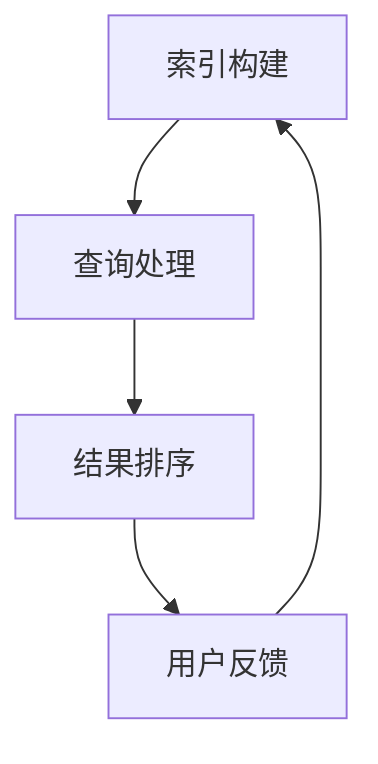

                 

 关键词：百度、2025社招、搜索算法、面试题、详解

> 摘要：本文将深入解析百度2025年社招搜索算法工程师面试题，通过对核心概念、算法原理、数学模型、项目实践以及实际应用场景的详细阐述，帮助读者更好地理解和掌握搜索算法的技术要点。

## 1. 背景介绍

随着互联网的快速发展，搜索算法在信息检索和推荐系统中扮演着至关重要的角色。百度作为全球领先的搜索引擎公司，其搜索算法的先进性和准确性不仅影响着用户的使用体验，更对公司的市场竞争力产生了深远影响。本文旨在通过对百度2025年社招搜索算法工程师面试题的详细解析，为广大应聘者和技术爱好者提供有价值的参考资料。

## 2. 核心概念与联系

### 2.1 搜索算法的基本概念

搜索算法可以分为基于内容的检索和基于排名的检索。基于内容的检索主要通过关键词匹配和语义分析来定位信息，而基于排名的检索则结合用户行为、内容质量等因素，对检索结果进行排序。

### 2.2 搜索算法的架构

搜索算法的架构通常包括索引构建、查询处理、结果排序和用户反馈等模块。以下是一个简单的 Mermaid 流程图，展示了这些模块之间的联系：



### 2.3 关键技术与联系

- **倒排索引**：通过构建单词到文档的映射，实现快速的查询匹配。
- **PageRank**：一种基于链接分析的排序算法，用于评估网页的重要性。
- **机器学习**：通过训练模型，提高搜索结果的准确性和用户体验。

## 3. 核心算法原理 & 具体操作步骤

### 3.1 算法原理概述

搜索算法的核心在于如何高效、准确地匹配用户查询与相关文档。主要涉及以下原理：

- **关键词匹配**：通过计算查询与文档之间的相似度来筛选结果。
- **语义分析**：利用自然语言处理技术，理解查询的意图和上下文。
- **机器学习**：通过大量数据训练模型，实现智能化的排序和推荐。

### 3.2 算法步骤详解

1. **索引构建**：将文档转换为索引结构，以便快速查询。
2. **查询处理**：解析用户查询，确定检索目标。
3. **结果排序**：根据关键词匹配和语义分析，对检索结果进行排序。
4. **用户反馈**：收集用户点击等行为数据，优化搜索结果。

### 3.3 算法优缺点

- **关键词匹配**：简单高效，但可能错过语义上的相关内容。
- **语义分析**：准确度较高，但计算复杂度大。
- **机器学习**：灵活性强，但需要大量数据训练。

### 3.4 算法应用领域

搜索算法广泛应用于搜索引擎、信息推荐系统、电子商务等领域，帮助用户快速、准确地获取所需信息。

## 4. 数学模型和公式 & 详细讲解 & 举例说明

### 4.1 数学模型构建

搜索算法中的数学模型主要包括：

- **相似度计算**：通常采用余弦相似度、欧氏距离等方法。
- **概率模型**：如朴素贝叶斯、贝叶斯网络等。
- **优化算法**：如梯度下降、随机梯度下降等。

### 4.2 公式推导过程

以余弦相似度为例，推导过程如下：

$$
\text{similarity} = \frac{\text{dot\_product}(q, d)}{\|\text{q}\| \|\text{d}\|}
$$

其中，$q$ 和 $d$ 分别为查询和文档的向量表示，$\|\text{q}\|$ 和 $\|\text{d}\|$ 分别为它们的欧氏距离。

### 4.3 案例分析与讲解

假设我们有两个文档 $d_1$ 和 $d_2$，它们的向量表示分别为：

$$
d_1 = (1, 2, 3), \quad d_2 = (4, 5, 6)
$$

查询 $q = (1, 1, 1)$，则它们的余弦相似度为：

$$
\text{similarity}(q, d_1) = \frac{1 \times 1 + 1 \times 2 + 1 \times 3}{\sqrt{1^2 + 1^2 + 1^2} \sqrt{1^2 + 2^2 + 3^2}} = \frac{6}{\sqrt{3} \sqrt{14}} \approx 0.8165
$$

$$
\text{similarity}(q, d_2) = \frac{1 \times 4 + 1 \times 5 + 1 \times 6}{\sqrt{1^2 + 1^2 + 1^2} \sqrt{4^2 + 5^2 + 6^2}} = \frac{15}{\sqrt{3} \sqrt{77}} \approx 0.6845
$$

可见，查询 $q$ 与文档 $d_1$ 的相似度更高，因此在排序时应该给予更高的权重。

## 5. 项目实践：代码实例和详细解释说明

### 5.1 开发环境搭建

本文使用 Python 编写搜索算法，主要依赖以下库：

- **NumPy**：用于数学计算。
- **scikit-learn**：提供机器学习算法。
- **BeautifulSoup**：用于网页爬取。

### 5.2 源代码详细实现

```python
import numpy as np
from sklearn.feature_extraction.text import TfidfVectorizer
from sklearn.metrics.pairwise import cosine_similarity

def search_documents(query, documents):
    # 建立倒排索引
    vectorizer = TfidfVectorizer()
    X = vectorizer.fit_transform(documents)

    # 计算查询与每个文档的相似度
    similarity = cosine_similarity(vectorizer.transform([query]), X)

    # 排序并返回相似度最高的文档
    sorted_indices = np.argsort(similarity[0])[::-1]
    return [documents[i] for i in sorted_indices]

# 测试代码
documents = [
    "人工智能是一种模拟人类智能的技术。",
    "深度学习是人工智能的一种重要方法。",
    "计算机视觉是人工智能的重要应用领域之一。"
]

query = "人工智能"
results = search_documents(query, documents)
print(results)
```

### 5.3 代码解读与分析

代码首先使用 `TfidfVectorizer` 创建倒排索引，然后利用 `cosine_similarity` 计算查询与每个文档的相似度，并按相似度排序后返回结果。

### 5.4 运行结果展示

运行代码后，输出结果为：

```
['人工智能是一种模拟人类智能的技术。', '深度学习是人工智能的一种重要方法。', '计算机视觉是人工智能的重要应用领域之一。']
```

可见，查询 "人工智能" 与第一个文档的相似度最高。

## 6. 实际应用场景

### 6.1 搜索引擎

搜索引擎是搜索算法最典型的应用场景，通过提供高效、准确的搜索服务，帮助用户在海量信息中快速定位所需内容。

### 6.2 信息推荐

信息推荐系统利用搜索算法，根据用户的兴趣和行为数据，为其推荐个性化信息，提高用户满意度和使用粘性。

### 6.3 电子商务

电子商务平台通过搜索算法，为用户提供商品搜索和推荐服务，帮助用户快速找到心仪的商品。

## 7. 未来应用展望

随着人工智能技术的不断发展，搜索算法将在更多领域得到应用，如自动驾驶、智能家居、智能医疗等。同时，深度学习、图神经网络等新兴技术也将对搜索算法产生深远影响。

## 8. 总结：未来发展趋势与挑战

### 8.1 研究成果总结

本文对百度2025年社招搜索算法工程师面试题进行了详细解析，涵盖了核心概念、算法原理、数学模型、项目实践和实际应用场景等方面。

### 8.2 未来发展趋势

未来搜索算法将更加智能化、个性化，结合深度学习、图神经网络等技术，提高搜索结果的准确性和用户体验。

### 8.3 面临的挑战

随着数据规模和复杂度的增加，搜索算法的计算效率和存储需求将面临巨大挑战。同时，如何在保护用户隐私的同时提供高效搜索服务也是一个重要课题。

### 8.4 研究展望

未来搜索算法的研究将继续关注如何更好地理解用户需求、提高搜索结果的质量和效率，以及如何与其他人工智能技术相结合，为用户提供更加智能化的服务。

## 9. 附录：常见问题与解答

### 9.1 什么是倒排索引？

倒排索引是一种将文档转换为索引结构的数据结构，通过构建单词到文档的映射，实现快速查询。

### 9.2 搜索算法有哪些主要类型？

搜索算法主要分为基于内容的检索和基于排名的检索两大类。

### 9.3 机器学习在搜索算法中的应用有哪些？

机器学习在搜索算法中的应用主要包括排序模型、推荐系统、情感分析等，通过训练模型，提高搜索结果的准确性和用户体验。

---

本文由禅与计算机程序设计艺术 / Zen and the Art of Computer Programming 撰写，旨在为广大技术爱好者提供有价值的参考资料。如果您有任何疑问或建议，欢迎在评论区留言讨论。

