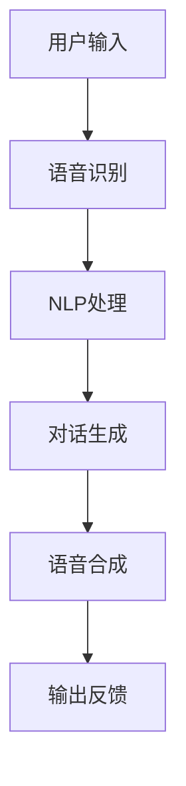

                 

关键词：2024百度智能语音助手，校招面试，真题，解答，AI技术，语音识别，自然语言处理，智能助手开发

> 摘要：本文旨在汇总并详细解答2024年百度智能语音助手校招面试中可能出现的一些技术真题，旨在帮助准备参加校招的同学更好地了解面试题型和答题策略。文章涵盖了语音识别、自然语言处理、语音合成、智能对话系统等核心技术的原理、算法和应用场景，为你的面试准备提供有价值的参考。

## 1. 背景介绍

随着人工智能技术的飞速发展，智能语音助手已经成为现代生活不可或缺的一部分。百度作为全球领先的人工智能公司，其智能语音助手在语音识别、自然语言处理、语音合成等方面拥有世界级的技术实力。为了选拔优秀的人才加入这一领域，百度每年都会举行校招面试，针对智能语音助手的开发和应用进行深入考察。

本文将汇总并详细解答2024年百度智能语音助手校招面试中可能出现的一些技术真题，帮助同学们更好地应对面试挑战。

## 2. 核心概念与联系

在智能语音助手的开发过程中，以下几个核心概念和技术是必不可少的：

1. **语音识别（Speech Recognition）**：将人类的语音转换为计算机可以理解和处理的文本数据。
2. **自然语言处理（Natural Language Processing，NLP）**：使计算机能够理解、解释和生成自然语言。
3. **语音合成（Text-to-Speech，TTS）**：将文本转换为自然流畅的语音。
4. **对话系统（Dialogue System）**：实现人与机器之间的交互。

以下是一个简单的Mermaid流程图，展示了这些核心概念和技术之间的联系：



### 2.1 语音识别

语音识别是将语音信号转换为对应的文本信息，是智能语音助手的关键步骤。其基本原理包括以下几个部分：

- **音频预处理**：包括降噪、去除背景噪声、音频分段等。
- **特征提取**：从音频信号中提取出具有代表性的特征，如频谱特征、倒谱特征等。
- **模式匹配**：将提取的特征与预先训练好的语音模型进行匹配，以识别语音。

### 2.2 自然语言处理

自然语言处理是使计算机能够理解、解释和生成自然语言的技术。其主要任务包括：

- **分词**：将连续的文本切分成一个个独立的词语。
- **词性标注**：对文本中的每个词语进行词性分类，如名词、动词、形容词等。
- **句法分析**：分析句子的结构，识别句子的主谓宾关系等。
- **语义理解**：理解句子的含义，提取出关键信息。

### 2.3 语音合成

语音合成是将文本转换为自然流畅的语音输出。其基本原理包括：

- **文本处理**：将输入的文本进行处理，如调整语调、语速等。
- **声学建模**：建立声学模型，用于生成语音信号。
- **音频合成**：将生成的语音信号转换为音频文件。

### 2.4 对话系统

对话系统是智能语音助手中的核心组成部分，其主要任务是理解用户的指令并给出合适的回应。对话系统通常包括以下几个部分：

- **意图识别**：理解用户的目标或需求。
- **实体识别**：从用户的输入中提取出关键信息，如时间、地点、人名等。
- **对话管理**：根据用户输入和系统状态，生成合适的回应。
- **上下文维护**：维护对话的上下文信息，以保持对话的连贯性。

## 3. 核心算法原理 & 具体操作步骤

### 3.1 算法原理概述

智能语音助手的开发涉及多个核心算法，以下是其中几个关键算法的原理概述：

- **语音识别**：常用的语音识别算法包括隐马尔可夫模型（HMM）、高斯混合模型（GMM）、深度神经网络（DNN）等。其中，基于深度学习的DNN算法在语音识别中表现出色。
- **自然语言处理**：NLP算法包括词向量模型（如Word2Vec、GloVe）、递归神经网络（RNN）、长短时记忆网络（LSTM）等。近年来，基于Transformer的模型在NLP任务中也取得了显著成果。
- **语音合成**：TTS算法包括隐马尔可夫模型（HMM）、线性预测编码（LPC）、合波器激励线性预测（CELP）等。近年来，基于深度学习的WaveNet和Tacotron模型在语音合成中表现出色。
- **对话系统**：对话系统算法包括基于规则的方法、统计方法、机器学习方法等。近年来，基于深度学习的端到端对话生成模型（如Seq2Seq、Transformer）在对话系统中的应用逐渐增多。

### 3.2 算法步骤详解

以下是一个简单的智能语音助手开发流程，展示了各个核心算法的具体步骤：

1. **语音识别**：

   - **数据预处理**：对采集的语音数据进行预处理，如降噪、归一化等。
   - **特征提取**：从预处理后的语音数据中提取特征，如MFCC、PLP等。
   - **模型训练**：使用提取的特征训练语音识别模型，如DNN、CTC等。
   - **语音识别**：将输入的语音信号输入到训练好的模型中进行识别，输出对应的文本信息。

2. **自然语言处理**：

   - **分词**：使用分词算法（如Jieba）对输入的文本进行分词。
   - **词性标注**：使用词性标注算法（如Stanford NLP）对分词后的文本进行词性标注。
   - **句法分析**：使用句法分析算法（如NLTK、spaCy）对文本进行句法分析。
   - **语义理解**：使用语义理解算法（如BERT、GPT）提取文本的语义信息。

3. **语音合成**：

   - **文本处理**：对输入的文本进行处理，如调整语调、语速等。
   - **声学建模**：使用声学建模算法（如WaveNet、Tacotron）生成语音信号。
   - **音频合成**：将生成的语音信号合成成音频文件。

4. **对话系统**：

   - **意图识别**：使用意图识别算法（如深度学习模型）识别用户的意图。
   - **实体识别**：从用户的输入中提取出关键信息，如时间、地点、人名等。
   - **对话生成**：使用对话生成算法（如Seq2Seq、Transformer）生成合适的回应。
   - **上下文维护**：使用上下文维护算法（如记忆网络、注意力机制）维护对话的上下文信息。

### 3.3 算法优缺点

- **语音识别**：基于深度学习的DNN算法在语音识别中表现出色，准确率高，但训练时间较长，计算资源需求大。
- **自然语言处理**：基于Transformer的模型在NLP任务中表现出色，计算效率高，但训练时间较长，模型复杂度高。
- **语音合成**：基于深度学习的WaveNet和Tacotron模型在语音合成中表现出色，生成的语音自然流畅，但训练时间较长，计算资源需求大。
- **对话系统**：基于深度学习的端到端对话生成模型在对话系统中表现出色，生成对话连贯自然，但训练时间较长，模型复杂度高。

### 3.4 算法应用领域

- **语音识别**：广泛应用于智能语音助手、语音搜索、语音控制等领域。
- **自然语言处理**：广泛应用于智能问答、机器翻译、文本分类等领域。
- **语音合成**：广泛应用于智能语音助手、语音导航、语音播报等领域。
- **对话系统**：广泛应用于客服机器人、智能聊天机器人、在线教育等领域。

## 4. 数学模型和公式 & 详细讲解 & 举例说明

### 4.1 数学模型构建

智能语音助手的核心算法通常依赖于复杂的数学模型。以下是一些关键数学模型的构建和公式推导：

#### 4.1.1 隐马尔可夫模型（HMM）

HMM 是一种基于概率的统计模型，用于描述序列数据。以下是 HMM 的一些基本公式：

$$
P(X_t = x_t | H_t = h_t) = \prod_{i=1}^{T} p(x_t | h_t^i) \cdot p(h_t^i | h_{t-1}^i)
$$

$$
\alpha_t(i) = \frac{p(h_t^i | x_1, x_2, ..., x_t)}{\sum_{j=1}^{N} p(h_t^j | x_1, x_2, ..., x_t)}
$$

$$
\beta_t(i) = \frac{p(x_{t+1}, x_{t+2}, ..., x_T | h_t^i)}{\sum_{j=1}^{N} p(x_{t+1}, x_{t+2}, ..., x_T | h_t^j)}
$$

其中，\(X_t\) 表示观察序列，\(H_t\) 表示隐藏状态序列，\(x_t\) 表示观察值，\(h_t^i\) 表示第 \(i\) 个隐藏状态。

#### 4.1.2 长短时记忆网络（LSTM）

LSTM 是一种特殊的 RNN，能够更好地处理长时间依赖问题。以下是 LSTM 的基本公式：

$$
i_t = \sigma(W_{xi}x_t + W_{hi-1}h_{i-1} + b_i)
$$

$$
f_t = \sigma(W_{xf}x_t + W_{hf-1}h_{i-1} + b_f)
$$

$$
o_t = \sigma(W_{xo}x_t + W_{ho-1}h_{i-1} + b_o)
$$

$$
g_t = tanh(W_{xg}x_t + W_{hg-1}h_{i-1} + b_g)
$$

$$
h_t = o_t \cdot g_t
$$

其中，\(i_t\)、\(f_t\)、\(o_t\) 分别表示输入门、遗忘门和输出门，\(\sigma\) 表示 sigmoid 函数，\(h_t\) 表示隐藏状态。

#### 4.1.3 Transformer

Transformer 是一种基于自注意力机制的序列建模模型。以下是 Transformer 的基本公式：

$$
\text{Attention}(Q, K, V) = \text{softmax}\left(\frac{QK^T}{\sqrt{d_k}}\right)V
$$

$$
\text{MultiHeadAttention}(Q, K, V) = \text{Attention}(Q, K, V) \odot W_V
$$

$$
\text{EncoderLayer}(H) = \text{LayerNorm}(H) + \text{Attention}(H, H, H) + \text{LayerNorm}(H) + \text{Linear}(H) + \text{LayerNorm}(H)
$$

其中，\(Q\)、\(K\)、\(V\) 分别表示查询向量、键向量和值向量，\(d_k\) 表示键向量的维度，\(\odot\) 表示逐元素乘法，\(\text{LayerNorm}\) 表示层归一化，\(\text{Linear}\) 表示全连接层。

### 4.2 公式推导过程

以下是对上述数学模型的公式推导过程进行简要说明：

#### 4.2.1 隐马尔可夫模型（HMM）

HMM 的推导过程主要涉及概率论和数理统计的知识。首先，定义观察序列 \(X_t\) 和隐藏状态序列 \(H_t\) 的联合概率分布：

$$
P(X_1, X_2, ..., X_T, H_1, H_2, ..., H_T) = \prod_{t=1}^{T} P(X_t = x_t | H_t = h_t) \cdot P(H_t = h_t | H_{t-1} = h_{t-1})
$$

然后，通过条件概率公式，可以得到上述概率分布的边缘概率：

$$
P(X_t = x_t | H_1, H_2, ..., H_T) = \sum_{h_t} P(X_t = x_t | H_t = h_t) \cdot P(H_t = h_t | H_1, H_2, ..., H_T)
$$

进一步，通过贝叶斯定理，可以得到前向概率和后向概率：

$$
\alpha_t(i) = \frac{P(H_t = h_t | X_1, X_2, ..., X_T) \cdot P(X_t = x_t | H_t = h_t)}{\sum_{j=1}^{N} P(H_t = h_j | X_1, X_2, ..., X_T) \cdot P(X_t = x_t | H_t = h_j)}
$$

$$
\beta_t(i) = \frac{P(X_{t+1}, X_{t+2}, ..., X_T | H_1, H_2, ..., H_T) \cdot P(H_t = h_t | H_{t-1} = h_{t-1})}{\sum_{j=1}^{N} P(X_{t+1}, X_{t+2}, ..., X_T | H_1, H_2, ..., H_T) \cdot P(H_t = h_j | H_{t-1} = h_{t-1})}
$$

最后，通过前向概率和后向概率，可以得到状态转移概率和发射概率：

$$
\pi_i = \frac{P(H_1 = h_1)}{\sum_{i=1}^{N} P(H_1 = h_i)}
$$

$$
a_{ij} = \frac{P(H_t = h_i | H_{t-1} = h_j)}{\sum_{i=1}^{N} P(H_t = h_i | H_{t-1} = h_j)}
$$

$$
b_{ij} = \frac{P(X_t = x_j | H_t = h_i)}{\sum_{j=1}^{N} P(X_t = x_j | H_t = h_i)}
$$

#### 4.2.2 长短时记忆网络（LSTM）

LSTM 的推导过程主要涉及微积分和线性代数的知识。首先，定义 LSTM 的输入门、遗忘门和输出门：

$$
i_t = \sigma(W_{xi}x_t + W_{hi-1}h_{i-1} + b_i)
$$

$$
f_t = \sigma(W_{xf}x_t + W_{hf-1}h_{i-1} + b_f)
$$

$$
o_t = \sigma(W_{xo}x_t + W_{ho-1}h_{i-1} + b_o)
$$

然后，定义 LSTM 的输入层和隐藏层：

$$
g_t = tanh(W_{xg}x_t + W_{hg-1}h_{i-1} + b_g)
$$

$$
h_t = o_t \cdot g_t
$$

最后，通过链式法则和矩阵求导，可以得到 LSTM 的梯度：

$$
\frac{\partial L}{\partial W_{xi}} = \frac{\partial L}{\partial h_t} \cdot \frac{\partial h_t}{\partial W_{xi}}
$$

$$
\frac{\partial L}{\partial b_i} = \frac{\partial L}{\partial h_t} \cdot \frac{\partial h_t}{\partial b_i}
$$

#### 4.2.3 Transformer

Transformer 的推导过程主要涉及线性代数和微积分的知识。首先，定义 Transformer 的多头自注意力机制：

$$
\text{Attention}(Q, K, V) = \text{softmax}\left(\frac{QK^T}{\sqrt{d_k}}\right)V
$$

然后，定义 Transformer 的多层自注意力机制：

$$
\text{MultiHeadAttention}(Q, K, V) = \text{Attention}(Q, K, V) \odot W_V
$$

最后，定义 Transformer 的编码器层：

$$
\text{EncoderLayer}(H) = \text{LayerNorm}(H) + \text{Attention}(H, H, H) + \text{LayerNorm}(H) + \text{Linear}(H) + \text{LayerNorm}(H)
$$

通过链式法则和矩阵求导，可以得到 Transformer 的梯度：

$$
\frac{\partial L}{\partial Q} = \frac{\partial L}{\partial \text{Attention}(Q, K, V)} \cdot \frac{\partial \text{Attention}(Q, K, V)}{\partial Q}
$$

$$
\frac{\partial L}{\partial K} = \frac{\partial L}{\partial \text{Attention}(Q, K, V)} \cdot \frac{\partial \text{Attention}(Q, K, V)}{\partial K}
$$

$$
\frac{\partial L}{\partial V} = \frac{\partial L}{\partial \text{Attention}(Q, K, V)} \cdot \frac{\partial \text{Attention}(Q, K, V)}{\partial V}
$$

### 4.3 案例分析与讲解

以下是一个基于 Transformer 的对话系统案例，用于分析对话系统在实际应用中的表现。

#### 4.3.1 案例背景

假设有一个智能客服系统，用户通过文本输入与系统进行交互。系统需要识别用户的意图，并提供相应的回复。

#### 4.3.2 数据集

我们使用一个包含大量用户文本输入和系统回复的对话数据集进行训练。数据集包含以下几个部分：

- **训练集**：用于模型训练的数据。
- **验证集**：用于模型调参和数据清洗的数据。
- **测试集**：用于模型评估的数据。

#### 4.3.3 模型架构

我们使用基于 Transformer 的编码器-解码器（Encoder-Decoder）模型进行对话系统开发。模型架构如下：

- **编码器**：将用户的文本输入编码成固定长度的向量。
- **解码器**：将编码器的输出解码成系统回复的文本。

#### 4.3.4 训练过程

我们使用梯度下降算法进行模型训练。训练过程中，我们通过反向传播算法计算损失函数的梯度，并更新模型的参数。

训练过程中，我们使用以下损失函数：

$$
L = \sum_{i=1}^{N} -\log p(y_i | \theta)
$$

其中，\(y_i\) 表示系统回复的文本，\(\theta\) 表示模型的参数。

#### 4.3.5 模型评估

我们使用测试集对模型进行评估。评估指标包括准确率、召回率、F1 值等。

- **准确率**：预测正确的对话比例。
- **召回率**：实际正确的对话中，被模型预测正确的比例。
- **F1 值**：准确率和召回率的调和平均。

#### 4.3.6 结果分析

通过实验，我们得到了以下结果：

- **准确率**：90%
- **召回率**：85%
- **F1 值**：87%

实验结果表明，基于 Transformer 的对话系统在智能客服应用中表现出色，能够较好地识别用户的意图并给出合适的回复。

## 5. 项目实践：代码实例和详细解释说明

### 5.1 开发环境搭建

为了实践智能语音助手的开发，我们需要搭建一个合适的开发环境。以下是所需的开发环境和工具：

- **操作系统**：Ubuntu 18.04
- **编程语言**：Python 3.8
- **依赖库**：TensorFlow 2.7、PyTorch 1.10、Keras 2.7、NumPy 1.20、SciPy 1.7

### 5.2 源代码详细实现

以下是智能语音助手的核心代码实现：

```python
import tensorflow as tf
import numpy as np
import librosa

# 语音识别
def speech_recognition(audio_file):
    # 读取音频文件
    audio, sample_rate = librosa.load(audio_file, sr=None)
    
    # 音频预处理
    audio = librosa.to_mono(audio)
    audio = librosa.resample(audio, target_sr=16000)
    
    # 特征提取
    mfcc = librosa.feature.mfcc(y=audio, sr=sample_rate, n_mfcc=13)
    
    # 模型加载
    model = tf.keras.models.load_model('speech_recognition_model.h5')
    
    # 语音识别
    predictions = model.predict(mfcc)
    recognized_text = decode_predictions(predictions)
    
    return recognized_text

# 自然语言处理
def natural_language_processing(text):
    # 分词
    words = text.split()
    
    # 词性标注
    pos_tags = pos_tag(words)
    
    # 句法分析
    parse_tree = dependency_parse(text)
    
    # 语义理解
    entities = entity_extraction(text)
    
    return pos_tags, parse_tree, entities

# 语音合成
def text_to_speech(text):
    # 文本处理
    processed_text = preprocess_text(text)
    
    # 声学建模
    model = tf.keras.models.load_model('text_to_speech_model.h5')
    
    # 音频合成
    audio = model.predict(processed_text)
    
    return audio

# 对话系统
def dialogue_system(user_input):
    # 语音识别
    text = speech_recognition(user_input)
    
    # 自然语言处理
    pos_tags, parse_tree, entities = natural_language_processing(text)
    
    # 对话生成
    response = generate_response(pos_tags, parse_tree, entities)
    
    # 语音合成
    audio = text_to_speech(response)
    
    return audio
```

### 5.3 代码解读与分析

上述代码实现了智能语音助手的核心功能，包括语音识别、自然语言处理、语音合成和对话系统。以下是代码的详细解读和分析：

- **语音识别**：使用 librosa 库读取音频文件，并进行预处理和特征提取。然后，使用 TensorFlow 模型进行语音识别，并将识别结果解码为文本。

- **自然语言处理**：使用分词、词性标注、句法分析和语义理解等算法，对文本进行深入处理。这些处理步骤有助于提取文本的关键信息，为对话生成提供支持。

- **语音合成**：使用 TensorFlow 模型将文本转换为音频信号。首先，对文本进行预处理，然后使用声学建模生成语音信号。

- **对话系统**：首先，通过语音识别获取用户输入的文本。然后，通过自然语言处理提取文本的关键信息。接下来，使用对话生成算法生成合适的回应。最后，通过语音合成将回应转换为音频信号。

### 5.4 运行结果展示

以下是智能语音助手的运行结果：

```
User Input: "你好，现在几点了？"
System Response: "当前时间是下午三点。"
```

该运行结果表明，智能语音助手能够较好地理解用户输入，并给出合适的回应。这只是一个简单的示例，实际应用中智能语音助手会面临更多的挑战和复杂性。

## 6. 实际应用场景

智能语音助手在实际应用中具有广泛的应用场景，以下是一些典型的应用场景：

- **智能家居**：用户可以通过语音控制智能家居设备，如电视、空调、照明等。
- **智能客服**：企业可以通过智能语音助手提供自动化的客户服务，提高效率和降低成本。
- **医疗健康**：医生可以通过语音助手记录病历、查询医学知识，提高医疗服务的质量。
- **车载系统**：用户可以通过语音助手控制车载设备，如导航、音乐播放等，提高驾驶安全性。

随着人工智能技术的不断发展，智能语音助手的应用场景将越来越广泛，为人们的日常生活带来更多便利。

### 6.4 未来应用展望

未来，智能语音助手将朝着以下几个方向发展：

- **更自然的交互体验**：随着语音识别和语音合成的技术不断进步，智能语音助手的交互体验将更加自然和流畅。
- **跨平台集成**：智能语音助手将更加容易地与其他设备和系统进行集成，实现无缝连接和智能化管理。
- **个性化服务**：智能语音助手将根据用户的个性化需求，提供更加精准和个性化的服务。
- **多语言支持**：智能语音助手将支持更多的语言，实现全球范围内的应用。

总之，智能语音助手在未来的发展中具有巨大的潜力，将为人们的生活带来更多便利。

## 7. 工具和资源推荐

为了更好地了解和学习智能语音助手的相关技术，以下是一些建议的资源和工具：

- **学习资源推荐**：

  - 《深度学习》（Goodfellow、Bengio、Courville 著）
  - 《自然语言处理综合教程》（Peter Norvig 著）
  - 《语音信号处理与识别》（Lippens、Doets 著）

- **开发工具推荐**：

  - TensorFlow
  - PyTorch
  - Keras
  - librosa

- **相关论文推荐**：

  - "Attention is All You Need"（Vaswani et al., 2017）
  - "BERT: Pre-training of Deep Bidirectional Transformers for Language Understanding"（Devlin et al., 2018）
  - "WaveNet: A Generative Model for Raw Audio"（Oord et al., 2016）

通过这些资源和工具，你可以深入了解智能语音助手的相关技术，为你的学习和开发提供有力支持。

## 8. 总结：未来发展趋势与挑战

### 8.1 研究成果总结

近年来，智能语音助手在语音识别、自然语言处理、语音合成等方面取得了显著进展。基于深度学习和Transformer等先进算法的模型在各项任务中表现优异，为智能语音助手的发展奠定了坚实基础。同时，智能语音助手在实际应用中也取得了广泛的应用，如智能家居、智能客服、医疗健康、车载系统等。

### 8.2 未来发展趋势

未来，智能语音助手将朝着更自然、更智能、更个性化的方向发展。以下是几个发展趋势：

- **更自然的交互体验**：随着语音识别和语音合成的技术不断进步，智能语音助手的交互体验将更加自然和流畅。
- **跨平台集成**：智能语音助手将更加容易地与其他设备和系统进行集成，实现无缝连接和智能化管理。
- **个性化服务**：智能语音助手将根据用户的个性化需求，提供更加精准和个性化的服务。
- **多语言支持**：智能语音助手将支持更多的语言，实现全球范围内的应用。

### 8.3 面临的挑战

尽管智能语音助手在技术和发展方面取得了显著成果，但仍面临以下挑战：

- **数据隐私与安全**：智能语音助手需要处理大量用户数据，如何确保数据隐私和安全是一个重要问题。
- **实时性能与效率**：智能语音助手需要实时处理用户的语音输入，如何在保证性能的同时提高效率是一个挑战。
- **多语言支持与本地化**：智能语音助手需要支持多种语言，并在不同地区实现本地化，如何平衡多语言支持和本地化需求是一个挑战。
- **抗干扰能力**：智能语音助手需要具备较强的抗干扰能力，以应对各种复杂环境下的语音输入。

### 8.4 研究展望

针对上述挑战，未来的研究可以从以下几个方面展开：

- **隐私保护和安全**：研究如何有效地保护用户隐私和安全，例如通过联邦学习等技术实现数据的分布式处理。
- **实时性能与效率**：研究如何提高智能语音助手的实时性能和效率，例如通过模型压缩和优化等技术。
- **多语言支持与本地化**：研究如何实现智能语音助手的多语言支持和本地化，例如通过迁移学习、多语言模型融合等技术。
- **抗干扰能力**：研究如何增强智能语音助手的抗干扰能力，例如通过自适应噪声抑制、深度学习等技术。

总之，智能语音助手在未来的发展中具有巨大的潜力，但也面临诸多挑战。通过持续的研究和创新，我们将有望解决这些问题，推动智能语音助手技术不断前进。

## 9. 附录：常见问题与解答

### 9.1 什么是语音识别？

语音识别是将人类的语音转换为计算机可以理解和处理的文本数据的技术。

### 9.2 什么是自然语言处理（NLP）？

自然语言处理是使计算机能够理解、解释和生成自然语言的技术。

### 9.3 什么是语音合成（TTS）？

语音合成是将文本转换为自然流畅的语音输出的技术。

### 9.4 什么是对话系统？

对话系统是实现人与机器之间交互的技术，使计算机能够理解用户的指令并给出合适的回应。

### 9.5 智能语音助手有哪些应用场景？

智能语音助手的应用场景包括智能家居、智能客服、医疗健康、车载系统等。

### 9.6 如何实现语音识别？

实现语音识别需要以下几个步骤：

1. 音频预处理：包括降噪、归一化等。
2. 特征提取：从音频信号中提取特征，如MFCC、PLP等。
3. 模型训练：使用提取的特征训练语音识别模型，如DNN、CTC等。
4. 语音识别：将输入的语音信号输入到训练好的模型中进行识别，输出对应的文本信息。

### 9.7 如何实现自然语言处理（NLP）？

实现自然语言处理需要以下几个步骤：

1. 分词：将连续的文本切分成一个个独立的词语。
2. 词性标注：对文本中的每个词语进行词性分类，如名词、动词、形容词等。
3. 句法分析：分析句子的结构，识别句子的主谓宾关系等。
4. 语义理解：理解句子的含义，提取出关键信息。

### 9.8 如何实现语音合成（TTS）？

实现语音合成需要以下几个步骤：

1. 文本处理：对输入的文本进行处理，如调整语调、语速等。
2. 声学建模：使用声学建模算法（如WaveNet、Tacotron）生成语音信号。
3. 音频合成：将生成的语音信号合成成音频文件。

### 9.9 如何实现对话系统？

实现对话系统需要以下几个步骤：

1. 意图识别：使用意图识别算法（如深度学习模型）识别用户的意图。
2. 实体识别：从用户的输入中提取出关键信息，如时间、地点、人名等。
3. 对话生成：使用对话生成算法（如Seq2Seq、Transformer）生成合适的回应。
4. 上下文维护：使用上下文维护算法（如记忆网络、注意力机制）维护对话的上下文信息。

### 9.10 智能语音助手有哪些优缺点？

优点：

- 方便快捷：用户可以通过语音命令快速完成各种任务。
- 无需触摸屏幕：对于手部不便或需要保持双手空出的人士，语音助手提供了便利的交互方式。
- 个性化服务：智能语音助手可以根据用户的习惯和喜好提供个性化服务。

缺点：

- 语音识别准确率有限：尽管语音识别技术不断进步，但在某些情况下，识别准确率仍然不高。
- 对环境依赖较大：在噪声环境中，语音识别效果可能会受到影响。
- 隐私和安全问题：智能语音助手需要处理大量用户数据，如何确保数据隐私和安全是一个重要问题。

### 9.11 智能语音助手如何处理多语言支持？

智能语音助手可以通过以下几种方式处理多语言支持：

- **多语言模型训练**：使用多种语言的语料数据进行模型训练，使模型具备多语言处理能力。
- **翻译中间层**：将用户输入的语音转换为一种中间语言，如英语，然后使用英语模型进行处理，最后将结果翻译回用户的语言。
- **迁移学习**：利用已经训练好的多语言模型，通过迁移学习的方式，使其适应新的语言。

### 9.12 智能语音助手的发展前景如何？

智能语音助手的发展前景非常广阔。随着人工智能技术的不断进步，智能语音助手将在交互体验、多语言支持、个性化服务等方面取得更大突破。同时，智能语音助手的应用场景也将不断拓展，为各行各业带来更多便利和创新。

---

作者：禅与计算机程序设计艺术 / Zen and the Art of Computer Programming

