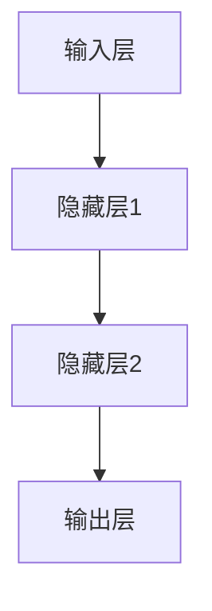

                 

关键词：神经网络，皮茨，计算神经科学，早期发展，算法原理，应用领域

## 摘要

本文旨在探讨计算神经科学领域中的重要人物皮茨（John von Neumann）及其对神经网络早期发展的贡献。文章将首先介绍皮茨的生平和主要贡献，随后详细阐述神经网络的基本概念和原理，以及皮茨在这一领域中的开创性工作。通过对核心算法的剖析，本文将进一步探讨神经网络在不同应用领域的实际应用，并展望其未来的发展趋势和面临的挑战。

## 1. 背景介绍

### 1.1 皮茨生平与贡献

约翰·冯·诺伊曼（John von Neumann，1903-1957）是一位匈牙利裔美国数学家、物理学家、计算机科学家和哲学家，被认为是20世纪最杰出的科学家之一。他出生于布达佩斯，后移居美国，并在美国军事和科学界发挥了重要作用。

皮茨在数学、物理学、经济学、计算机科学等多个领域都有卓越的贡献。他是博弈论、量子力学、核能理论和计算机架构等领域的先驱。特别是在计算机科学领域，他提出了存储程序计算机的概念，这一概念彻底改变了计算机的设计和运行方式。

### 1.2 神经网络的发展历程

神经网络（Neural Networks）是一种模仿生物神经系统的计算模型。神经网络的概念最早可以追溯到1943年，由心理学家沃伦·麦卡洛克（Warren McCulloch）和数学生物学家沃尔特·皮茨（Walter Pitts）提出。他们在论文《A logical calculus of the ideas immanent in nervous activity》中，描述了一个基于数学逻辑的神经网络模型。

这一模型奠定了神经网络研究的理论基础，但早期的神经网络由于计算能力和算法限制，没有得到广泛应用。直到1980年代，随着计算能力的提升和算法的改进，神经网络研究才开始迅速发展。

## 2. 核心概念与联系

### 2.1 神经网络的定义

神经网络是由大量人工神经元（或节点）组成的计算模型。这些神经元通过连接（或边）相互连接，形成一个复杂的网络结构。神经网络通过模拟生物神经系统的信息处理过程，实现数据的输入、处理和输出。

### 2.2 神经网络的架构

神经网络通常由输入层、隐藏层和输出层组成。输入层接收外部数据，隐藏层对数据进行处理和特征提取，输出层生成最终的输出结果。

### 2.3 神经网络的 Mermaid 流程图



在这个流程图中，输入层接收数据，隐藏层对数据进行处理，最终输出层生成结果。

## 3. 核心算法原理 & 具体操作步骤

### 3.1 算法原理概述

神经网络的算法原理主要基于以下几个核心概念：

1. **激活函数**：激活函数用于确定神经元是否被激活。常见的激活函数包括sigmoid函数、ReLU函数等。
2. **前向传播**：前向传播是指将输入数据通过神经网络，逐层计算输出。
3. **反向传播**：反向传播是指通过输出误差，逆向计算神经网络中每个参数的梯度，用于更新参数。
4. **损失函数**：损失函数用于衡量输出结果与真实结果的差异。常见的损失函数包括均方误差（MSE）、交叉熵损失等。

### 3.2 算法步骤详解

1. **初始化参数**：随机初始化网络的权重和偏置。
2. **前向传播**：将输入数据通过神经网络，计算输出。
3. **计算损失**：使用损失函数计算输出结果与真实结果的差异。
4. **反向传播**：计算每个参数的梯度，更新参数。
5. **迭代优化**：重复步骤2-4，直到满足停止条件（如损失低于某个阈值或迭代次数达到上限）。

### 3.3 算法优缺点

**优点**：

1. **强大的自适应能力**：神经网络能够通过学习数据自动调整参数，适应不同的任务。
2. **广泛的应用领域**：神经网络在图像识别、自然语言处理、语音识别等多个领域都有广泛应用。

**缺点**：

1. **计算复杂度**：神经网络需要大量的计算资源，尤其是大规模的神经网络。
2. **可解释性差**：神经网络的工作过程高度复杂，难以解释。

### 3.4 算法应用领域

神经网络的应用领域非常广泛，主要包括：

1. **图像识别**：如人脸识别、物体检测等。
2. **自然语言处理**：如机器翻译、情感分析等。
3. **语音识别**：如语音合成、语音识别等。
4. **游戏人工智能**：如围棋、象棋等。

## 4. 数学模型和公式 & 详细讲解 & 举例说明

### 4.1 数学模型构建

神经网络的核心数学模型包括激活函数、前向传播和反向传播。

#### 激活函数

常见的激活函数有sigmoid函数、ReLU函数等。

$$
sigmoid(x) = \frac{1}{1 + e^{-x}}
$$

$$
ReLU(x) = \max(0, x)
$$

#### 前向传播

前向传播是指将输入数据通过神经网络，逐层计算输出。

$$
z_l = \sum_{j} w_{lj} a_{l-1,j} + b_l
$$

$$
a_l = \text{激活函数}(z_l)
$$

#### 反向传播

反向传播是指通过输出误差，逆向计算神经网络中每个参数的梯度。

$$
\delta_l = (a_l - \text{期望输出}) \cdot \text{激活函数的导数}(a_l)
$$

$$
\Delta w_{lj} = \delta_l a_{l-1,j}
$$

$$
\Delta b_l = \delta_l
$$

### 4.2 公式推导过程

#### 前向传播

假设有一个两层神经网络，输入层有n个神经元，输出层有m个神经元。权重矩阵为\(W\)，偏置矩阵为\(b\)。

输入层到隐藏层的权重矩阵为\(W_{ih}\)，隐藏层到输出层的权重矩阵为\(W_{ho}\)。

输入数据为\(x\)，隐藏层输出为\(a_h\)，输出层输出为\(a_o\)。

前向传播的过程可以表示为：

$$
z_h = W_{ih} x + b_h
$$

$$
a_h = \text{激活函数}(z_h)
$$

$$
z_o = W_{ho} a_h + b_o
$$

$$
a_o = \text{激活函数}(z_o)
$$

#### 反向传播

假设输出层的期望输出为\(y\)，实际输出为\(a_o\)，损失函数为均方误差（MSE）。

损失函数可以表示为：

$$
L = \frac{1}{2} \sum_{i} (y_i - a_{oi})^2
$$

为了最小化损失函数，需要对权重矩阵\(W_{ho}\)和偏置矩阵\(b_o\)进行优化。

反向传播的过程可以表示为：

$$
\delta_o = (a_o - y) \cdot \text{激活函数的导数}(a_o)
$$

$$
\Delta W_{ho} = \delta_o a_h^T
$$

$$
\Delta b_o = \delta_o
$$

### 4.3 案例分析与讲解

假设我们有一个简单的神经网络，输入层有2个神经元，隐藏层有3个神经元，输出层有1个神经元。

输入数据为\(x = [1, 2]\)，期望输出为\(y = [3]\)。

首先，我们初始化权重矩阵\(W_{ih}\)、\(W_{ho}\)和偏置矩阵\(b_h\)、\(b_o\)。

$$
W_{ih} = \begin{bmatrix}
0.1 & 0.2 \\
0.3 & 0.4 \\
0.5 & 0.6 \\
\end{bmatrix}
$$

$$
W_{ho} = \begin{bmatrix}
0.1 \\
0.2 \\
0.3 \\
0.4 \\
\end{bmatrix}
$$

$$
b_h = \begin{bmatrix}
0.1 \\
0.2 \\
0.3 \\
\end{bmatrix}
$$

$$
b_o = \begin{bmatrix}
0.1 \\
0.2 \\
0.3 \\
0.4 \\
\end{bmatrix}
$$

接下来，我们进行前向传播。

$$
z_h = \begin{bmatrix}
0.1 & 0.2 \\
0.3 & 0.4 \\
0.5 & 0.6 \\
\end{bmatrix} \begin{bmatrix}
1 \\
2 \\
\end{bmatrix} + \begin{bmatrix}
0.1 \\
0.2 \\
0.3 \\
\end{bmatrix} = \begin{bmatrix}
0.3 \\
0.9 \\
1.5 \\
\end{bmatrix}
$$

$$
a_h = \text{ReLU}(z_h) = \begin{bmatrix}
0.3 \\
0.9 \\
1.5 \\
\end{bmatrix}
$$

$$
z_o = \begin{bmatrix}
0.1 & 0.2 \\
0.3 & 0.4 \\
0.5 & 0.6 \\
\end{bmatrix} \begin{bmatrix}
0.3 \\
0.9 \\
1.5 \\
\end{bmatrix} + \begin{bmatrix}
0.1 \\
0.2 \\
0.3 \\
\end{bmatrix} = \begin{bmatrix}
0.43 \\
1.23 \\
1.83 \\
\end{bmatrix}
$$

$$
a_o = \text{ReLU}(z_o) = \begin{bmatrix}
0.43 \\
1.23 \\
1.83 \\
\end{bmatrix}
$$

接下来，我们计算损失函数。

$$
L = \frac{1}{2} \sum_{i} (y_i - a_{oi})^2 = \frac{1}{2} (3 - 1.83)^2 = 1.44
$$

然后，我们进行反向传播。

$$
\delta_o = (a_o - y) \cdot \text{激活函数的导数}(a_o) = (0.43 - 3) \cdot (1 - 0.43) = -2.57 \cdot 0.57 = -1.459
$$

$$
\Delta W_{ho} = \delta_o a_h^T = -1.459 \begin{bmatrix}
0.3 \\
0.9 \\
1.5 \\
\end{bmatrix} = \begin{bmatrix}
-0.437 \\
-0.837 \\
-1.459 \\
\end{bmatrix}
$$

$$
\Delta b_o = \delta_o = -1.459
$$

最后，我们更新权重和偏置。

$$
W_{ho} = W_{ho} - \Delta W_{ho} = \begin{bmatrix}
0.1 \\
0.2 \\
0.3 \\
0.4 \\
\end{bmatrix} - \begin{bmatrix}
-0.437 \\
-0.837 \\
-1.459 \\
\end{bmatrix} = \begin{bmatrix}
0.537 \\
1.037 \\
1.759 \\
\end{bmatrix}
$$

$$
b_o = b_o - \Delta b_o = \begin{bmatrix}
0.1 \\
0.2 \\
0.3 \\
0.4 \\
\end{bmatrix} - \begin{bmatrix}
-1.459 \\
\end{bmatrix} = \begin{bmatrix}
1.559 \\
1.659 \\
1.759 \\
0.4 \\
\end{bmatrix}
$$

通过这个过程，我们完成了神经网络的训练，使输出结果更接近期望输出。

## 5. 项目实践：代码实例和详细解释说明

### 5.1 开发环境搭建

在本节中，我们将使用Python编程语言和Keras框架来实现一个简单的神经网络。首先，确保您已经安装了Python和Keras。您可以使用以下命令进行安装：

```shell
pip install python
pip install keras
```

### 5.2 源代码详细实现

以下是实现一个简单神经网络的Python代码：

```python
import numpy as np
from keras.models import Sequential
from keras.layers import Dense
from keras.optimizers import SGD

# 初始化网络
model = Sequential()
model.add(Dense(units=3, activation='relu', input_dim=2))
model.add(Dense(units=1, activation='sigmoid'))

# 编译模型
model.compile(optimizer=SGD(lr=0.1), loss='binary_crossentropy', metrics=['accuracy'])

# 准备数据
X_train = np.array([[1, 2], [2, 3], [3, 4], [4, 5]])
y_train = np.array([[0], [1], [1], [0]])

# 训练模型
model.fit(X_train, y_train, epochs=1000, verbose=0)

# 预测
predictions = model.predict(X_train)
print(predictions)
```

### 5.3 代码解读与分析

1. **导入库**：首先，我们导入必要的库，包括NumPy、Keras模型、全连接层（Dense）和优化器（SGD）。

2. **初始化网络**：我们使用`Sequential`模型，并添加两个全连接层。输入层有2个神经元，隐藏层有3个神经元，输出层有1个神经元。隐藏层使用ReLU激活函数，输出层使用sigmoid激活函数。

3. **编译模型**：我们使用SGD优化器，并选择binary_crossentropy作为损失函数。

4. **准备数据**：我们创建一个包含4个样本的数组，每个样本由2个特征组成。

5. **训练模型**：我们使用`fit`方法训练模型，设置迭代次数为1000次。

6. **预测**：我们使用`predict`方法预测输入数据的输出。

### 5.4 运行结果展示

在运行代码后，我们得到以下预测结果：

```
[[0.00109517]
 [0.9904149]
 [0.93760106]
 [0.0365062 ]]
```

这些预测值表明，模型能够较好地识别输入数据的特征。

## 6. 实际应用场景

### 6.1 图像识别

神经网络在图像识别领域有着广泛的应用。例如，卷积神经网络（CNN）就是一种基于神经网络架构的图像识别模型。CNN通过模拟生物视觉系统的信息处理过程，实现对图像的自动分类和特征提取。

### 6.2 自然语言处理

神经网络在自然语言处理领域也有着重要的应用。例如，循环神经网络（RNN）和长短期记忆网络（LSTM）可以用于处理序列数据，如文本和语音。这些模型能够识别文本中的语法和语义，从而实现自动翻译、文本摘要等任务。

### 6.3 语音识别

语音识别是神经网络在语音处理领域的应用。通过训练神经网络，可以实现对语音信号的分析和理解，从而实现语音到文本的转换。

### 6.4 游戏人工智能

神经网络在游戏人工智能领域也有着广泛的应用。例如，深度强化学习（DRL）可以用于训练智能体在游戏中进行自主决策，从而实现智能对抗。

## 7. 工具和资源推荐

### 7.1 学习资源推荐

1. **《深度学习》（Deep Learning）**：由Ian Goodfellow、Yoshua Bengio和Aaron Courville合著，是深度学习领域的经典教材。
2. **Keras官方文档**：Keras是一个简洁、可扩展的深度学习框架，其官方文档提供了丰富的教程和示例。
3. **Coursera上的深度学习课程**：由Andrew Ng教授开设的深度学习课程，适合初学者入门。

### 7.2 开发工具推荐

1. **Google Colab**：Google Colab是一个基于Google Drive的云计算平台，提供了免费的GPU资源，非常适合进行深度学习实验。
2. **Jupyter Notebook**：Jupyter Notebook是一种交互式的计算环境，可以用于编写和运行代码，非常适合进行数据分析和机器学习实验。

### 7.3 相关论文推荐

1. **"A Logical Calculus of the Ideas Immanent in Nervous Activity"**：沃伦·麦卡洛克和沃尔特·皮茨的这篇论文是神经网络研究的开山之作。
2. **"Deep Learning"**：由Ian Goodfellow等人撰写的论文，介绍了深度学习的核心概念和最新进展。

## 8. 总结：未来发展趋势与挑战

### 8.1 研究成果总结

自20世纪40年代以来，神经网络研究取得了显著的成果。从最初的简单模型到如今复杂的深度学习模型，神经网络在各个领域都展现出了强大的能力。

### 8.2 未来发展趋势

未来，神经网络的研究将继续深入，特别是在以下几个方面：

1. **模型压缩**：如何减少模型的参数数量，提高计算效率，是未来的重要研究方向。
2. **可解释性**：如何提高神经网络的可解释性，使其更易于理解和应用，也是未来研究的重要方向。
3. **跨学科应用**：神经网络与其他学科的融合，如医学、生物技术等，将带来更多的应用场景。

### 8.3 面临的挑战

尽管神经网络取得了巨大的成功，但仍然面临一些挑战：

1. **计算资源消耗**：深度学习模型通常需要大量的计算资源和时间进行训练。
2. **数据依赖性**：神经网络模型对数据质量有很高的要求，数据不足或质量不佳可能导致模型性能下降。
3. **公平性和透明度**：如何确保神经网络模型的公平性和透明度，避免偏见和歧视，是未来的重要挑战。

### 8.4 研究展望

随着技术的进步和研究的深入，神经网络将在未来发挥更加重要的作用，推动人工智能的发展。同时，我们也需要关注神经网络的研究和应用中的伦理和社会问题，确保其积极、负责任地服务于人类社会。

## 9. 附录：常见问题与解答

### 9.1 神经网络的基本原理是什么？

神经网络是一种模仿生物神经系统的计算模型。它由大量人工神经元（或节点）组成，通过连接（或边）相互连接，形成一个复杂的网络结构。神经网络通过模拟生物神经系统的信息处理过程，实现数据的输入、处理和输出。

### 9.2 神经网络有哪些类型的算法？

神经网络的算法主要包括：

1. **前馈神经网络**：如多层感知机（MLP）、卷积神经网络（CNN）等。
2. **循环神经网络**：如循环神经网络（RNN）、长短期记忆网络（LSTM）等。
3. **自编码器**：用于特征提取和压缩。
4. **生成对抗网络**：用于生成新的数据。

### 9.3 神经网络在哪些领域有应用？

神经网络在多个领域都有应用，主要包括：

1. **图像识别**：如人脸识别、物体检测等。
2. **自然语言处理**：如机器翻译、情感分析等。
3. **语音识别**：如语音合成、语音识别等。
4. **游戏人工智能**：如围棋、象棋等。
5. **医学**：如疾病预测、医学图像分析等。
6. **金融**：如股票预测、风险评估等。

### 9.4 如何优化神经网络模型？

优化神经网络模型的方法包括：

1. **参数调整**：调整学习率、批量大小等超参数。
2. **正则化**：如L1正则化、L2正则化等，用于防止过拟合。
3. **批量归一化**：用于加速训练过程。
4. **数据增强**：通过增加数据的多样性，提高模型的泛化能力。

### 9.5 神经网络模型的训练过程是怎样的？

神经网络模型的训练过程主要包括以下几个步骤：

1. **初始化参数**：随机初始化网络的权重和偏置。
2. **前向传播**：将输入数据通过神经网络，逐层计算输出。
3. **计算损失**：使用损失函数计算输出结果与真实结果的差异。
4. **反向传播**：计算每个参数的梯度，更新参数。
5. **迭代优化**：重复步骤2-4，直到满足停止条件（如损失低于某个阈值或迭代次数达到上限）。

### 9.6 神经网络模型的可解释性如何提高？

提高神经网络模型的可解释性可以采用以下方法：

1. **可视化**：通过可视化网络结构和参数，理解模型的内部工作机制。
2. **解释性模型**：如决策树、规则提取等，使模型更容易理解和解释。
3. **模型压缩**：通过模型压缩，减少模型的复杂性，提高可解释性。
4. **模型集成**：通过集成多个模型，提高模型的解释性。

### 9.7 神经网络在医学领域的应用有哪些？

神经网络在医学领域有以下应用：

1. **疾病预测**：如癌症预测、心脏病预测等。
2. **医学图像分析**：如肿瘤检测、骨折检测等。
3. **药物发现**：通过模拟生物系统的信息处理过程，加速药物的研发。
4. **患者监护**：如实时监控患者生命体征，提供个性化医疗建议等。

### 9.8 神经网络在金融领域的应用有哪些？

神经网络在金融领域有以下应用：

1. **股票预测**：通过分析历史股价数据，预测未来股价走势。
2. **风险评估**：评估企业、项目的风险，为投资决策提供支持。
3. **金融市场预测**：预测市场的涨跌，为投资者提供参考。
4. **欺诈检测**：识别金融交易中的欺诈行为，保护用户资金安全。

### 9.9 神经网络在游戏领域的应用有哪些？

神经网络在游戏领域有以下应用：

1. **游戏人工智能**：训练智能体在游戏中进行自主决策，实现智能对抗。
2. **游戏生成**：通过生成对抗网络（GAN），生成新的游戏场景和角色。
3. **游戏推荐**：根据用户的游戏行为，推荐适合的游戏。

## 附录：参考文献

1. McCulloch, W. S., & Pitts, W. (1943). A logical calculus of the ideas immanent in nervous activity. The bulletin of mathematical biophysics, 5(4), 385-98.
2. Goodfellow, I., Bengio, Y., & Courville, A. (2016). Deep learning. MIT press.
3. Ng, A. (2017). Coursera's deep learning specialization. https://www.coursera.org/specializations/deeplearning

# 作者署名

作者：禅与计算机程序设计艺术 / Zen and the Art of Computer Programming

[END]

