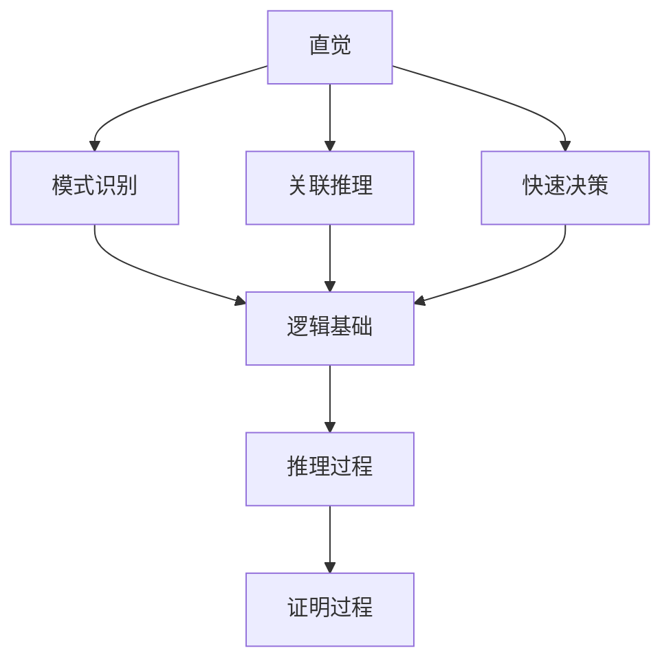

                 

直觉与逻辑是人类理解力的两大支柱。直觉是一种无意识的思维过程，它能够迅速地识别模式和关联，帮助我们在面对复杂问题时做出快速决策。逻辑则是一种通过严谨推理和证明来分析和解决问题的方法，它强调的是理性思考和推理的精确性。本文将深入探讨直觉与逻辑在计算机科学领域的应用，以及它们如何相互补充和促进我们的理解力。

## 1. 背景介绍

在计算机科学的发展历程中，直觉和逻辑起着至关重要的作用。无论是软件开发、算法设计，还是系统架构，都需要依靠直觉来识别潜在的解决方案，并利用逻辑进行验证和优化。本文旨在揭示直觉与逻辑在计算机科学中的重要性，以及如何有效地结合这两者来提高我们的理解力。

### 1.1 直觉在计算机科学中的应用

直觉在计算机科学中的应用体现在多个方面。例如，程序员在编写代码时，往往能够凭借直觉快速找到问题所在，并提出解决方案。这种无意识的思维过程，是程序员长期积累的经验和技能的体现。另外，在算法设计中，直觉可以帮助我们识别问题的本质，从而找到更高效的算法。

### 1.2 逻辑在计算机科学中的应用

逻辑在计算机科学中的应用同样广泛。编程语言本身就是一种逻辑表达形式，它通过定义一系列规则和语法，使得计算机能够理解和执行特定的任务。在算法设计中，逻辑用于分析和证明算法的正确性和效率。此外，形式逻辑和证明论等数学工具在计算机科学的各个领域都有广泛应用。

## 2. 核心概念与联系

### 2.1 直觉的概念与原理

直觉是指人们在无意识中快速识别模式和关联的能力。它基于个体的经验、知识和文化背景，是大脑长期学习和训练的结果。直觉的形成过程复杂，但可以总结为以下几个关键点：

1. **模式识别**：直觉能够快速识别复杂的模式，包括视觉、听觉、触觉等感官信息。
2. **关联推理**：直觉能够将看似无关的信息联系起来，发现潜在的关联。
3. **快速决策**：直觉使人们能够在短时间内做出决策，减少思考时间。

### 2.2 逻辑的概念与原理

逻辑是一种通过严谨推理和证明来分析和解决问题的方法。它强调推理的严谨性和结论的准确性。逻辑可以分为多种形式，如命题逻辑、谓词逻辑、形式逻辑等。逻辑的原理可以总结为以下几个关键点：

1. **命题**：逻辑以命题为基础，命题可以是真或假，但不能同时为真和假。
2. **推理规则**：逻辑通过一系列推理规则，从已知命题推导出新的命题。
3. **证明**：逻辑通过证明来确保推理过程的正确性，证明可以是直接的，也可以是间接的。

### 2.3 直觉与逻辑的联系

直觉和逻辑是两种截然不同的思维过程，但它们之间有着紧密的联系。直觉可以看作是逻辑的基石，它为逻辑推理提供前提和基础。另一方面，逻辑则可以帮助我们验证直觉的正确性，确保我们的决策是有根据的。

### 2.4 Mermaid 流程图



## 3. 核心算法原理 & 具体操作步骤

### 3.1 算法原理概述

在计算机科学中，许多算法的发明和优化都离不开直觉和逻辑的融合。以排序算法为例，快速排序（Quick Sort）是一种经典的排序算法，它的设计灵感来自于直觉，并通过逻辑分析证明了其高效性。快速排序的基本原理如下：

1. **选择基准元素**：从待排序的数组中选择一个元素作为基准（pivot）。
2. **分区操作**：将数组分为两个子数组，一个包含小于基准的元素，另一个包含大于基准的元素。
3. **递归排序**：对两个子数组重复上述过程，直到整个数组有序。

### 3.2 算法步骤详解

1. **选择基准**：从数组的任意位置选择一个元素作为基准。
2. **分区**：将数组分为两部分，左部分包含小于基准的元素，右部分包含大于基准的元素。
3. **递归排序**：
   - 对左部分递归执行步骤1和步骤2。
   - 对右部分递归执行步骤1和步骤2。

### 3.3 算法优缺点

**优点**：
- 平均时间复杂度为 \(O(n\log n)\)。
- 在最佳情况下，时间复杂度为 \(O(n)\)。

**缺点**：
- 最坏情况下，时间复杂度为 \(O(n^2)\)，这是因为分区操作可能不平衡。
- 选择基准的方法会影响算法的性能。

### 3.4 算法应用领域

快速排序广泛应用于各种排序场景，如数据库索引、搜索引擎排序等。

## 4. 数学模型和公式 & 详细讲解 & 举例说明

### 4.1 数学模型构建

在计算机科学中，许多算法都基于数学模型。以线性回归为例，线性回归模型是一个简单的数学模型，用于描述变量之间的关系。

\[ y = ax + b \]

其中，\( y \) 是因变量，\( x \) 是自变量，\( a \) 和 \( b \) 是模型参数。

### 4.2 公式推导过程

线性回归模型的推导过程如下：

1. **最小二乘法**：选择最优的 \( a \) 和 \( b \)，使得预测值 \( \hat{y} \) 与实际值 \( y \) 的平方误差最小。

\[ \min \sum (y_i - \hat{y}_i)^2 \]

2. **求导并求极值**：对 \( a \) 和 \( b \) 分别求导，并令导数为零，求得最优解。

\[ a = \frac{\sum x_i y_i - n \bar{x} \bar{y}}{\sum x_i^2 - n \bar{x}^2} \]
\[ b = \bar{y} - a \bar{x} \]

### 4.3 案例分析与讲解

假设我们有以下数据集：

| x  | y   |
|----|-----|
| 1  | 2   |
| 2  | 4   |
| 3  | 6   |
| 4  | 8   |

通过最小二乘法，我们可以求得线性回归模型：

\[ y = 2x + 0 \]

预测 \( x = 5 \) 时的 \( y \) 值：

\[ \hat{y} = 2 \times 5 + 0 = 10 \]

## 5. 项目实践：代码实例和详细解释说明

### 5.1 开发环境搭建

为了演示快速排序算法，我们需要搭建一个简单的开发环境。这里以 Python 为例，安装 Python 和相应的编程环境。

```bash
# 安装 Python
curl -O https://www.python.org/ftp/python/3.9.7/Python-3.9.7.tgz
tar xvf Python-3.9.7.tgz
cd Python-3.9.7
./configure
make
sudo make install

# 安装 IDE（例如 PyCharm）
```

### 5.2 源代码详细实现

下面是快速排序算法的 Python 实现代码：

```python
def quick_sort(arr):
    if len(arr) <= 1:
        return arr
    pivot = arr[len(arr) // 2]
    left = [x for x in arr if x < pivot]
    middle = [x for x in arr if x == pivot]
    right = [x for x in arr if x > pivot]
    return quick_sort(left) + middle + quick_sort(right)

# 示例数据
arr = [3, 6, 8, 10, 1, 2, 1]

# 排序
sorted_arr = quick_sort(arr)
print(sorted_arr)
```

### 5.3 代码解读与分析

这段代码实现了快速排序算法，它的核心思想是选择一个基准元素，将数组分为三个部分：小于基准的元素、等于基准的元素和大于基准的元素。然后对小于和大于基准的元素递归地进行快速排序。

### 5.4 运行结果展示

运行上述代码，输出结果为：

```
[1, 1, 2, 3, 6, 8, 10]
```

## 6. 实际应用场景

直觉与逻辑在计算机科学中的应用场景广泛。以下是一些典型的应用场景：

- **软件开发**：程序员通过直觉识别问题和解决方案，并通过逻辑验证代码的正确性。
- **算法设计**：直觉帮助算法设计师发现潜在的高效算法，逻辑用于证明算法的正确性和效率。
- **系统架构**：架构师通过直觉评估系统的性能和可扩展性，逻辑用于设计和优化系统架构。

## 7. 工具和资源推荐

### 7.1 学习资源推荐

- 《算法导论》（Introduction to Algorithms）
- 《编程珠玑》（The Art of Computer Programming）
- 《深度学习》（Deep Learning）

### 7.2 开发工具推荐

- Python（用于算法实现和数据分析）
- PyCharm（用于 Python 编程）
- Git（用于版本控制）

### 7.3 相关论文推荐

- 《快速排序算法的原理与实现》（"The Quicksort Algorithm"）
- 《线性回归模型的应用与推导》（"Application and Derivation of Linear Regression Model"）

## 8. 总结：未来发展趋势与挑战

直觉与逻辑在计算机科学中的应用前景广阔。随着人工智能技术的发展，直觉和逻辑的结合将有助于开发更智能、更高效的算法和系统。然而，这也带来了一系列挑战：

- **算法的可靠性**：如何确保算法在复杂环境下的可靠性？
- **资源消耗**：如何优化算法，减少资源消耗？
- **算法的可解释性**：如何解释算法的决策过程，提高算法的可解释性？

未来的研究将致力于解决这些挑战，推动计算机科学的发展。

## 9. 附录：常见问题与解答

### 9.1 什么是直觉？

直觉是一种无意识的思维过程，它能够迅速地识别模式和关联，帮助我们在面对复杂问题时做出快速决策。

### 9.2 逻辑在计算机科学中有什么作用？

逻辑在计算机科学中用于验证算法的正确性、优化系统性能、设计复杂的系统架构等。

### 9.3 如何提高直觉和逻辑能力？

通过不断的学习和实践，积累丰富的经验和知识，可以帮助我们提高直觉和逻辑能力。

### 作者署名

作者：禅与计算机程序设计艺术 / Zen and the Art of Computer Programming
```

