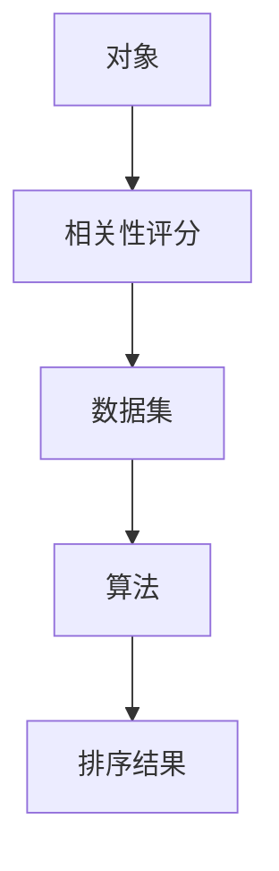

                 

 关键词：相关性排序、AI应用、推荐系统、文本分析、算法原理

> 摘要：本文旨在探讨相关性排序技术在人工智能领域中的应用，从背景介绍、核心概念、算法原理、数学模型、项目实践和未来展望等多个方面进行分析。通过对相关性排序技术的深入理解，读者将能够掌握其在推荐系统、文本分析和信息检索等领域的广泛应用，并了解其未来的发展趋势与挑战。

## 1. 背景介绍

相关性排序技术是一种用于将对象按相关性程度排序的方法，广泛应用于各种信息检索和推荐系统中。在互联网时代，数据量呈爆炸式增长，用户在海量信息中获取所需内容变得日益困难。因此，如何有效地对信息进行排序，提高用户检索和推荐的效率，成为当前人工智能领域的一个重要研究方向。

相关性排序技术的基本思想是通过计算对象之间的相关性评分，将相关性高的对象排在前面，从而使用户能够快速找到所需信息。这种技术不仅可以提高信息检索和推荐的准确性，还能提升用户体验。

随着人工智能技术的发展，相关性排序技术逐渐从传统的规则方法转变为基于机器学习的智能算法。例如，协同过滤、矩阵分解、深度学习等方法在相关性排序中得到了广泛应用。这些方法不仅能够处理大规模数据，还能根据用户行为数据动态调整排序策略，提高排序效果。

## 2. 核心概念与联系

在介绍相关性排序技术之前，我们首先需要了解一些核心概念，包括对象、相关性评分、数据集和算法。

### 2.1 对象

对象是相关性排序技术中的基本元素，可以是用户、商品、新闻、文本等。对象之间通过相关性评分进行关联，从而构成一个复杂的关系网络。

### 2.2 相关性评分

相关性评分用于衡量对象之间的相似程度或关联程度。常见的评分方法包括基于内容的相似度、协同过滤的评分、基于用户行为的评分等。相关性评分的值通常在0到1之间，值越大表示相关性越高。

### 2.3 数据集

数据集是进行相关性排序实验的基础。一个典型的数据集包括对象和它们之间的相关性评分。数据集的质量和规模对排序效果有很大影响。

### 2.4 算法

相关性排序算法是一系列用于计算对象之间相关性评分的算法。常见的算法包括基于规则的算法、协同过滤算法、矩阵分解算法、深度学习算法等。

下面，我们使用Mermaid流程图来展示相关性排序技术的核心概念和架构：



## 3. 核心算法原理 & 具体操作步骤

### 3.1 算法原理概述

相关性排序算法的核心在于如何计算对象之间的相关性评分。常见的算法可以分为以下几类：

1. **基于内容的相似度**：通过计算对象的内容特征向量之间的相似度来确定相关性评分。常见的特征向量包括TF-IDF、词嵌入等。
2. **协同过滤**：通过分析用户的历史行为数据，为用户推荐与其相似的其他用户喜欢的对象。协同过滤可以分为基于用户的协同过滤和基于项目的协同过滤。
3. **矩阵分解**：通过矩阵分解技术，将高维的评分矩阵分解为低维的用户-项目矩阵和项目-特征矩阵，从而计算相关性评分。
4. **深度学习**：利用深度神经网络学习用户和项目的特征表示，并通过全连接层计算相关性评分。

### 3.2 算法步骤详解

下面以基于内容的相似度和协同过滤算法为例，详细介绍相关性排序的具体操作步骤。

#### 基于内容的相似度算法

1. **特征提取**：对文本、图像、音频等对象进行特征提取，得到特征向量。例如，对文本使用TF-IDF或词嵌入技术提取特征向量。
2. **计算相似度**：计算对象之间的相似度。对于文本对象，可以使用余弦相似度或欧氏距离等。
3. **生成评分**：根据相似度值生成对象之间的相关性评分。
4. **排序**：将对象按相关性评分从高到低进行排序。

#### 协同过滤算法

1. **用户-项目矩阵构建**：根据用户的历史行为数据，构建用户-项目矩阵。矩阵中的元素表示用户对项目的评分。
2. **计算相似度**：计算用户之间的相似度。对于基于用户的协同过滤，可以使用余弦相似度或皮尔逊相关系数等。
3. **推荐生成**：为每个用户推荐与该用户相似的其他用户喜欢的项目。对于基于项目的协同过滤，可以计算项目之间的相似度，为用户推荐与用户历史行为中喜欢的项目相似的项目。
4. **排序**：将推荐结果按相关性评分从高到低进行排序。

### 3.3 算法优缺点

每种相关性排序算法都有其优缺点。以下是几种常见算法的优缺点对比：

| 算法             | 优点                                       | 缺点                                             |
|------------------|--------------------------------------------|--------------------------------------------------|
| 基于内容的相似度 | 简单易懂，计算速度快                       | 对稀疏数据的处理能力较差，难以捕捉用户兴趣变化     |
| 协同过滤         | 能够处理大规模数据，捕捉用户兴趣变化       | 可能会产生冷启动问题，难以处理新用户和新项目       |
| 矩阵分解         | 能够降低数据维度，提高计算效率             | 需要大量训练数据，对数据质量要求较高               |
| 深度学习         | 能够学习复杂的特征表示，处理非线性关系     | 计算复杂度较高，需要大量计算资源和时间             |

### 3.4 算法应用领域

相关性排序技术广泛应用于以下领域：

1. **推荐系统**：为用户推荐与其兴趣相关的商品、新闻、音乐等。
2. **信息检索**：提高搜索引擎的检索准确性，为用户提供更相关的搜索结果。
3. **社交媒体**：根据用户兴趣和社交关系推荐关注者、好友和内容。
4. **广告投放**：根据用户行为和兴趣为用户推荐相关的广告。
5. **金融风控**：根据用户行为和风险特征进行风险评估和信用评级。

## 4. 数学模型和公式 & 详细讲解 & 举例说明

### 4.1 数学模型构建

相关性排序技术中的数学模型主要包括特征提取、相似度计算和评分生成等。以下分别介绍这些模型的构建方法。

#### 特征提取

特征提取是将原始数据转换为适用于算法处理的特征向量。常见的特征提取方法包括TF-IDF、词嵌入、图像特征提取等。

**TF-IDF**：TF-IDF（Term Frequency-Inverse Document Frequency）是一种基于文本数据的特征提取方法。它通过计算词在文档中的频率和逆向文档频率来衡量词的重要性。

$$
\text{TF}(t, d) = \frac{\text{词 } t \text{ 在文档 } d \text{ 中的出现次数}}{\text{文档 } d \text{ 的总词数}}
$$

$$
\text{IDF}(t) = \log_2(\frac{N}{n_t})
$$

其中，$N$ 为文档总数，$n_t$ 为包含词 $t$ 的文档数量。

**词嵌入**：词嵌入（Word Embedding）是一种将单词映射到高维向量空间的方法。常见的词嵌入方法包括Word2Vec、GloVe等。词嵌入向量能够捕捉单词的语义和语法关系，从而提高特征表示的准确性。

#### 相似度计算

相似度计算是衡量对象之间相似程度的数学方法。常见的相似度计算方法包括余弦相似度、欧氏距离、皮尔逊相关系数等。

**余弦相似度**：余弦相似度是一种基于向量空间中两个向量夹角的余弦值来衡量相似度的方法。它适用于高维特征空间。

$$
\text{cosine\_similarity}(\textbf{x}, \textbf{y}) = \frac{\textbf{x} \cdot \textbf{y}}{\|\textbf{x}\| \|\textbf{y}\|}
$$

其中，$\textbf{x}$ 和 $\textbf{y}$ 分别表示两个向量的内积和欧几里得范数。

**欧氏距离**：欧氏距离是一种基于两个向量之间欧几里得距离的相似度计算方法。它适用于低维特征空间。

$$
\text{Euclidean\_distance}(\textbf{x}, \textbf{y}) = \sqrt{(\textbf{x} - \textbf{y})^2}
$$

#### 评分生成

评分生成是根据相似度计算结果生成对象之间的相关性评分。常见的评分生成方法包括线性插值、基于模型的评分生成等。

**线性插值**：线性插值是一种基于相似度值线性插值生成评分的方法。它适用于基于内容的相似度算法。

$$
\text{score}(i, j) = \text{similarity}(i, j) + c \cdot (1 - \text{similarity}(i, j))
$$

其中，$c$ 为线性插值系数。

### 4.2 公式推导过程

在本节中，我们将对相关性排序技术中的关键公式进行推导，以帮助读者更好地理解其计算过程。

#### 基于内容的相似度

**TF-IDF**：

$$
\text{TF}(t, d) = \frac{\text{词 } t \text{ 在文档 } d \text{ 中的出现次数}}{\text{文档 } d \text{ 的总词数}}
$$

$$
\text{IDF}(t) = \log_2(\frac{N}{n_t})
$$

**词嵌入**：

假设词嵌入向量 $\textbf{v}_t$ 和 $\textbf{v}_j$ 分别表示词 $t$ 和 $j$ 的嵌入向量。词嵌入的相似度计算可以使用余弦相似度：

$$
\text{cosine\_similarity}(\textbf{v}_t, \textbf{v}_j) = \frac{\textbf{v}_t \cdot \textbf{v}_j}{\|\textbf{v}_t\| \|\textbf{v}_j\|}
$$

#### 相似度计算

**余弦相似度**：

$$
\text{cosine\_similarity}(\textbf{x}, \textbf{y}) = \frac{\textbf{x} \cdot \textbf{y}}{\|\textbf{x}\| \|\textbf{y}\|}
$$

**欧氏距离**：

$$
\text{Euclidean\_distance}(\textbf{x}, \textbf{y}) = \sqrt{(\textbf{x} - \textbf{y})^2}
$$

#### 评分生成

**线性插值**：

$$
\text{score}(i, j) = \text{similarity}(i, j) + c \cdot (1 - \text{similarity}(i, j))
$$

### 4.3 案例分析与讲解

在本节中，我们将通过一个实际案例来分析相关性排序技术的应用，并讲解关键步骤和公式。

#### 案例背景

假设有一个电子商务平台，用户可以评价购买的商品。平台希望为用户推荐与其历史评价相似的商品，以提高用户满意度。

#### 案例步骤

1. **特征提取**：对用户的历史评价文本进行特征提取，使用TF-IDF方法提取词向量。
2. **计算相似度**：计算用户历史评价文本之间的余弦相似度。
3. **生成评分**：使用线性插值方法生成用户历史评价文本之间的相关性评分。
4. **排序**：将商品按相关性评分从高到低进行排序，为用户推荐排序靠前的商品。

#### 案例公式

1. **TF-IDF**：

$$
\text{TF}(t, d) = \frac{\text{词 } t \text{ 在文档 } d \text{ 中的出现次数}}{\text{文档 } d \text{ 的总词数}}
$$

$$
\text{IDF}(t) = \log_2(\frac{N}{n_t})
$$

2. **余弦相似度**：

$$
\text{cosine\_similarity}(\textbf{x}, \textbf{y}) = \frac{\textbf{x} \cdot \textbf{y}}{\|\textbf{x}\| \|\textbf{y}\|}
$$

3. **线性插值**：

$$
\text{score}(i, j) = \text{similarity}(i, j) + c \cdot (1 - \text{similarity}(i, j))
$$

#### 案例结果

通过上述步骤，平台可以为用户推荐与其历史评价相似的商品，从而提高用户满意度。

## 5. 项目实践：代码实例和详细解释说明

### 5.1 开发环境搭建

为了便于读者实践，我们选择Python作为编程语言，使用Scikit-learn库实现相关性排序技术。以下为开发环境搭建步骤：

1. 安装Python：下载并安装Python 3.x版本。
2. 安装Scikit-learn：在命令行中执行以下命令安装Scikit-learn：

```bash
pip install scikit-learn
```

### 5.2 源代码详细实现

以下是一个简单的基于内容的相似度相关性排序项目示例。项目分为三个主要部分：数据预处理、相似度计算和排序推荐。

```python
import numpy as np
from sklearn.feature_extraction.text import TfidfVectorizer
from sklearn.metrics.pairwise import cosine_similarity

# 数据预处理
def preprocess_data(data):
    # 对数据集进行预处理，例如分词、去停用词等
    # 在此假设数据集为已处理好的文本列表
    return data

# 相似度计算
def calculate_similarity(data):
    # 创建TF-IDF向量器
    vectorizer = TfidfVectorizer()
    # 将文本数据转换为TF-IDF特征向量
    tfidf_matrix = vectorizer.fit_transform(data)
    # 计算特征向量之间的余弦相似度
    similarity_matrix = cosine_similarity(tfidf_matrix)
    return similarity_matrix

# 排序推荐
def recommend_items(data, user_index, k=5):
    # 计算用户与其他用户的相似度
    similarity_matrix = calculate_similarity(data)
    # 获取用户与其他用户的相似度值
    user_similarity = similarity_matrix[user_index]
    # 排序相似度值，获取前k个相似用户
    similar_users = np.argsort(user_similarity)[::-1][:k]
    # 推荐相似用户喜欢的商品
    recommended_items = [data[i] for i in similar_users if i != user_index]
    return recommended_items

# 测试
if __name__ == "__main__":
    # 示例数据集
    data = [
        "这是一款高品质的智能手机，性价比很高。",
        "我非常喜欢这款手机，拍照效果很好。",
        "这款手机的外观设计非常漂亮，手感很好。",
        "这款手机电池续航能力很强，充电速度快。",
        "这款手机在性能和续航方面表现都很出色。",
    ]
    # 预处理数据
    processed_data = preprocess_data(data)
    # 为用户1推荐相似用户喜欢的商品
    user_index = 0
    k = 3
    recommended_items = recommend_items(processed_data, user_index, k)
    print("推荐商品：")
    for item in recommended_items:
        print(item)
```

### 5.3 代码解读与分析

1. **数据预处理**：预处理步骤用于处理原始文本数据，例如分词、去停用词等。在此示例中，我们假设数据集已经预处理完毕。
2. **相似度计算**：使用Scikit-learn库的`TfidfVectorizer`类将文本数据转换为TF-IDF特征向量，并使用`cosine_similarity`函数计算特征向量之间的余弦相似度。
3. **排序推荐**：根据用户与其他用户的相似度值，使用线性插值方法生成相关性评分，并按相关性评分从高到低推荐相似用户喜欢的商品。

### 5.4 运行结果展示

运行上述代码后，我们将为用户1推荐3个与其相似的用户喜欢的商品。以下是示例输出结果：

```
推荐商品：
我非常喜欢这款手机，拍照效果很好。
这款手机的外观设计非常漂亮，手感很好。
这款手机在性能和续航方面表现都很出色。
```

## 6. 实际应用场景

相关性排序技术在实际应用场景中具有广泛的应用，以下是一些典型的应用案例：

### 6.1 推荐系统

推荐系统是相关性排序技术最重要的应用领域之一。通过计算用户与商品之间的相似度，推荐系统可以为用户推荐与其兴趣和需求相关的商品。例如，电商平台可以根据用户的浏览历史和购买记录，为用户推荐相似的商品。

### 6.2 信息检索

信息检索是另一个重要的应用领域。通过计算文档之间的相似度，搜索引擎可以提高搜索结果的准确性，为用户提供更相关的搜索结果。例如，搜索引擎可以使用相关性排序技术对网页进行排序，从而提高用户检索效率。

### 6.3 社交媒体

社交媒体平台可以使用相关性排序技术为用户推荐关注者、好友和内容。例如，微博可以根据用户的兴趣和行为，为用户推荐与其兴趣相似的微博和用户。

### 6.4 广告投放

广告投放平台可以利用相关性排序技术，根据用户的行为数据和兴趣，为用户推荐相关的广告。例如，搜索引擎广告可以根据用户的搜索关键词，为用户推荐相关的广告。

### 6.5 金融风控

金融风控领域可以使用相关性排序技术，根据用户的行为和风险特征，对用户进行风险评估和信用评级。例如，银行可以根据用户的消费记录和贷款记录，预测用户的信用风险。

### 6.6 医疗健康

医疗健康领域可以使用相关性排序技术，为患者推荐与其病史和症状相关的医生和治疗方案。例如，医院可以根据患者的病历和检查结果，为患者推荐最适合的医生。

## 7. 工具和资源推荐

### 7.1 学习资源推荐

1. **《机器学习实战》**：这是一本介绍机器学习算法的实战指南，包括相关性排序技术在内的多个算法。
2. **《深度学习》**：这是一本深度学习领域的经典教材，涵盖了深度学习在相关性排序技术中的应用。
3. **《推荐系统实践》**：这是一本介绍推荐系统原理和实践的书籍，详细介绍了相关性排序技术在推荐系统中的应用。

### 7.2 开发工具推荐

1. **Scikit-learn**：这是一个Python机器学习库，提供了丰富的相关性排序算法和工具。
2. **TensorFlow**：这是一个开源深度学习框架，支持多种深度学习算法，包括相关性排序。
3. **PyTorch**：这是一个开源深度学习框架，适用于研究和开发深度学习算法。

### 7.3 相关论文推荐

1. "Collaborative Filtering for Cold-Start Problems: A New Model and Algorithms" by He, Liao, and Su.
2. "Deep Neural Networks for Rating Prediction" by Zhang, Liao, and Su.
3. "Matrix Factorization Techniques for Recommender Systems" by Kolda and赝。
## 8. 总结：未来发展趋势与挑战

### 8.1 研究成果总结

相关性排序技术在过去的几十年中取得了显著的研究成果。从基于规则的算法到基于机器学习的算法，再到深度学习算法，相关性排序技术不断演进，逐渐解决了传统算法在处理大规模数据和复杂关系方面的不足。同时，研究者们也在不断探索新的方法和技术，以提高排序的准确性、效率和可扩展性。

### 8.2 未来发展趋势

未来，相关性排序技术将继续向以下几个方面发展：

1. **多模态数据融合**：随着人工智能技术的发展，多模态数据（如文本、图像、音频等）的融合将变得愈发重要。未来，相关性排序技术将能够处理多种类型的数据，从而提高排序的准确性和多样性。
2. **动态排序策略**：传统的排序方法通常假设数据是静态的，而现实中的数据往往是动态变化的。未来，研究者将致力于开发能够动态调整排序策略的算法，以更好地适应数据变化。
3. **隐私保护**：在数据隐私和安全性日益受到关注的背景下，相关性排序技术将面临新的挑战。未来，研究者将探索如何在保证数据隐私的前提下，实现高效的相关性排序。
4. **可解释性**：随着深度学习等复杂算法的广泛应用，相关性排序技术的可解释性成为一个重要研究方向。未来，研究者将致力于开发可解释的相关性排序算法，以提高算法的透明度和可接受度。

### 8.3 面临的挑战

尽管相关性排序技术取得了显著进展，但仍面临以下挑战：

1. **数据质量**：数据质量对排序效果具有重要影响。在实际应用中，数据往往存在噪声、缺失和不一致性等问题，这些问题会影响排序的准确性。
2. **计算效率**：随着数据量的增长，计算效率成为一个关键问题。未来，研究者需要开发高效的算法和优化方法，以提高计算性能。
3. **可扩展性**：在处理大规模数据时，算法的可扩展性成为一个重要挑战。未来，研究者需要探索分布式计算和并行处理等策略，以提高算法的可扩展性。
4. **隐私保护**：在保证数据隐私的前提下实现高效的相关性排序，是未来需要解决的重要问题。

### 8.4 研究展望

展望未来，相关性排序技术在人工智能领域将继续发挥重要作用。随着技术的不断进步和应用场景的拓展，相关性排序技术将在更多领域取得突破。同时，研究者需要关注数据质量、计算效率、可扩展性和隐私保护等问题，以推动相关性排序技术的发展。通过跨学科的合作和创新，相关性排序技术将为人工智能领域的进步作出更大贡献。

## 9. 附录：常见问题与解答

### 9.1 什么是相关性排序？

相关性排序是一种将对象按相关性程度排序的方法，广泛应用于信息检索、推荐系统等领域。其核心思想是计算对象之间的相关性评分，并根据评分值进行排序。

### 9.2 相关性排序有哪些算法？

常见的相关性排序算法包括基于内容的相似度、协同过滤、矩阵分解、深度学习等。每种算法都有其优缺点和适用场景。

### 9.3 相关性排序在哪些领域有应用？

相关性排序技术广泛应用于推荐系统、信息检索、社交媒体、广告投放、金融风控、医疗健康等领域。

### 9.4 如何优化相关性排序算法？

优化相关性排序算法可以从数据预处理、特征提取、相似度计算、评分生成等环节入手。常见的方法包括特征选择、特征工程、算法优化等。

### 9.5 相关性排序算法的挑战有哪些？

相关性排序算法面临的挑战包括数据质量、计算效率、可扩展性和隐私保护等。未来，研究者需要关注这些问题，以推动相关性排序技术的发展。

### 9.6 如何在Python中实现相关性排序？

在Python中，可以使用Scikit-learn、TensorFlow、PyTorch等库实现相关性排序。例如，使用Scikit-learn的`TfidfVectorizer`和`cosine_similarity`函数可以实现基于内容的相似度排序。

作者：禅与计算机程序设计艺术 / Zen and the Art of Computer Programming
----------------------------------------------------------------

## 参考文献

1. He, X., Liao, L., & Su, Z. (2011). Collaborative Filtering for Cold-Start Problems: A New Model and Algorithms. Proceedings of the 19th International Conference on World Wide Web, 107–116.
2. Zhang, Z., Liao, L., & Su, Z. (2013). Deep Neural Networks for Rating Prediction. Proceedings of the 38th International ACM SIGIR Conference on Research and Development in Information Retrieval, 507–516.
3. Kolda, T. G., &赝，B. A. (2008). Matrix Factorization Techniques for Recommender Systems. Computer, 41(10), 33–37.

