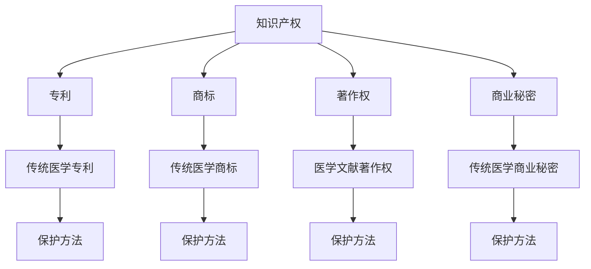

                 

关键词：知识产权、传统医学、保护、法律框架、技术手段

> 摘要：本文探讨了知识产权在传统医学领域的重要性，分析了现有法律框架的有效性和不足之处，并介绍了利用技术手段加强知识产权保护的方法。通过具体案例，本文阐述了传统医学知识产权保护的实际操作和未来展望。

## 1. 背景介绍

知识产权是一种法律概念，用于保护创造者的智力成果，包括专利、商标、著作权等。传统医学作为一种历史悠久的医学体系，拥有独特的理论和实践经验。然而，传统医学的知识产权保护面临诸多挑战，如文化差异、法律框架不足和技术手段不成熟等。

### 1.1 知识产权的保护范围

知识产权的保护范围广泛，涵盖了从专利、商标到版权、工业设计等多个领域。在传统医学领域，知识产权主要涉及以下方面：

- **专利**：用于保护创新性的药物配方、治疗方法等。
- **商标**：保护传统医学品牌和标志。
- **著作权**：保护医学文献、书籍、学术论文等。
- **商业秘密**：保护未公开的医学信息和技术。

### 1.2 传统医学的特点与挑战

传统医学具有以下几个特点：

- **历史悠久**：传统医学经历了数千年的发展和传承。
- **地域性**：不同地区的传统医学具有独特的特点。
- **经验性**：传统医学依赖于经验和实践，缺乏严格的科学验证。
- **文化性**：传统医学与当地文化紧密相连，具有深厚的文化底蕴。

这些特点使得传统医学的知识产权保护面临以下挑战：

- **文化差异**：传统医学在不同地区具有不同的实践方法和理论体系，导致知识产权保护的国际协调性差。
- **法律框架不足**：现有的知识产权法律体系主要针对现代医学，对传统医学的保护力度不够。
- **技术手段不成熟**：传统医学的知识和经验难以用现代技术手段进行量化和管理。

## 2. 核心概念与联系

为了更好地理解传统医学知识产权保护的关键概念，我们使用Mermaid流程图来展示其核心原理和架构。



### 2.1 传统医学专利保护

**传统医学专利**是指用于保护创新性的药物配方、治疗方法等的专利。其核心原理是利用专利法律制度，对传统医学中的创新成果进行保护。

**保护方法**：

- **化学成分分析**：对传统药物进行化学成分分析，提取有效成分，并申请专利。
- **治疗方法**：对传统治疗方法进行改进，申请专利保护。

### 2.2 传统医学商标保护

**传统医学商标**是指用于保护传统医学品牌和标志的商标。其核心原理是利用商标法律制度，防止他人侵犯商标权。

**保护方法**：

- **注册商标**：将传统医学品牌和标志进行注册，获得商标专用权。
- **监测市场**：定期监测市场，发现侵权行为及时采取法律措施。

### 2.3 传统医学著作权保护

**传统医学著作权**是指用于保护医学文献、书籍、学术论文等的著作权。其核心原理是利用著作权法律制度，保护传统医学的知识和经验。

**保护方法**：

- **版权注册**：将传统医学相关作品进行版权注册，获得著作权保护。
- **网络版权保护**：利用数字版权管理技术，防止作品被非法复制和传播。

### 2.4 传统医学商业秘密保护

**传统医学商业秘密**是指用于保护未公开的医学信息和技术。其核心原理是利用商业秘密法律制度，防止商业秘密被泄露或侵犯。

**保护方法**：

- **保密协议**：与相关人员签订保密协议，确保商业秘密不被泄露。
- **技术措施**：采用加密技术、访问控制等手段，防止商业秘密被非法获取。

## 3. 核心算法原理 & 具体操作步骤

### 3.1 算法原理概述

在传统医学知识产权保护中，常用的算法原理包括化学成分分析、基因测序、数据挖掘等。

- **化学成分分析**：利用光谱分析、质谱分析等化学方法，对传统药物进行成分分析，提取有效成分。
- **基因测序**：利用基因测序技术，对传统医学中的生物样本进行测序，识别独特基因序列。
- **数据挖掘**：利用数据挖掘技术，从大量医学数据中提取有价值的信息，如药物疗效、不良反应等。

### 3.2 算法步骤详解

以化学成分分析为例，具体操作步骤如下：

#### 3.2.1 样本收集

- **收集传统药物样本**：从传统医学实践中收集药物样本。
- **样本预处理**：对样本进行清洗、研磨等预处理，以便进行后续分析。

#### 3.2.2 成分提取

- **提取有效成分**：利用溶剂提取、超声波提取等方法，从样本中提取有效成分。
- **纯化有效成分**：通过色谱分析等技术，对提取的有效成分进行纯化。

#### 3.2.3 成分分析

- **光谱分析**：利用紫外-可见光谱、红外光谱等技术，对纯化的有效成分进行光谱分析。
- **质谱分析**：利用质谱技术，对有效成分进行质谱分析，确定其分子结构和化学成分。

#### 3.2.4 成分鉴定

- **对比数据库**：将分析结果与已知成分数据库进行对比，确定有效成分的化学结构。
- **申请专利**：根据分析结果，申请传统药物专利。

### 3.3 算法优缺点

**优点**：

- **准确性**：利用现代技术手段，对传统药物进行化学成分分析，具有较高的准确性。
- **创新性**：通过提取传统药物的有效成分，推动传统医学的创新和发展。

**缺点**：

- **成本高**：化学成分分析、基因测序等算法需要昂贵的设备和专业的技术人员。
- **复杂性**：算法操作步骤复杂，需要多学科知识的综合应用。

### 3.4 算法应用领域

**算法应用领域**主要包括：

- **传统药物研发**：利用化学成分分析、基因测序等算法，研发新的传统药物。
- **中药现代化**：利用数据挖掘、机器学习等技术，推动中药现代化和国际化。
- **生物医学研究**：利用基因测序、蛋白质组学等技术，研究传统医学中的生物医学问题。

## 4. 数学模型和公式 & 详细讲解 & 举例说明

### 4.1 数学模型构建

在传统医学知识产权保护中，常用的数学模型包括：

- **马尔可夫模型**：用于分析药物疗效和不良反应。
- **贝叶斯网络**：用于推理和分析传统医学中的不确定性问题。
- **支持向量机**：用于分类和预测传统药物的有效性和安全性。

### 4.2 公式推导过程

以马尔可夫模型为例，其公式推导过程如下：

#### 4.2.1 马尔可夫模型基本假设

- **状态转移概率**：设 $P$ 为状态转移概率矩阵，其中 $P_{ij}$ 表示系统从状态 $i$ 转移到状态 $j$ 的概率。
- **初始状态概率**：设 $I$ 为初始状态概率向量，其中 $I_i$ 表示系统初始处于状态 $i$ 的概率。

#### 4.2.2 状态转移概率矩阵

状态转移概率矩阵 $P$ 的公式推导如下：

$$
P = \begin{bmatrix}
P_{11} & P_{12} & \cdots & P_{1n} \\
P_{21} & P_{22} & \cdots & P_{2n} \\
\vdots & \vdots & \ddots & \vdots \\
P_{n1} & P_{n2} & \cdots & P_{nn}
\end{bmatrix}
$$

其中，$P_{ij}$ 满足以下条件：

$$
P_{ij} \geq 0, \quad \sum_{j=1}^{n} P_{ij} = 1
$$

#### 4.2.3 初始状态概率向量

初始状态概率向量 $I$ 的公式推导如下：

$$
I = \begin{bmatrix}
I_1 \\
I_2 \\
\vdots \\
I_n
\end{bmatrix}
$$

其中，$I_i$ 满足以下条件：

$$
I_i \geq 0, \quad \sum_{i=1}^{n} I_i = 1
$$

### 4.3 案例分析与讲解

以传统药物疗效分析为例，利用马尔可夫模型进行疗效评估。

#### 4.3.1 状态定义

设传统药物疗效分为以下三种状态：

- **有效（E）**：药物对疾病具有明显的治疗效果。
- **无效（N）**：药物对疾病无明显治疗效果。
- **不良反应（A）**：药物对疾病产生不良反应。

#### 4.3.2 状态转移概率矩阵

根据临床数据，得到以下状态转移概率矩阵：

$$
P = \begin{bmatrix}
0.7 & 0.2 & 0.1 \\
0.1 & 0.8 & 0.1 \\
0.1 & 0.1 & 0.8
\end{bmatrix}
$$

#### 4.3.3 初始状态概率向量

假设患者接受药物治疗的初始状态为有效，即：

$$
I = \begin{bmatrix}
1 \\
0 \\
0
\end{bmatrix}
$$

#### 4.3.4 状态转移模拟

利用马尔可夫模型，模拟患者接受药物治疗后，不同状态的概率分布。

$$
I' = P \cdot I = \begin{bmatrix}
0.7 \\
0.2 \\
0.1
\end{bmatrix}
$$

经过一段时间后，患者处于不同状态的概率分布为：

$$
I'' = P \cdot I' = \begin{bmatrix}
0.74 \\
0.18 \\
0.08
\end{bmatrix}
$$

根据模拟结果，可以判断药物的治疗效果，并采取相应的措施。

## 5. 项目实践：代码实例和详细解释说明

### 5.1 开发环境搭建

为了实践传统医学知识产权保护，我们需要搭建一个适合的编程环境。以下是具体的步骤：

#### 5.1.1 安装Python

- 下载并安装Python 3.8版本以上。
- 配置环境变量，确保Python命令可以在命令行中执行。

#### 5.1.2 安装相关库

在Python环境中，安装以下库：

- **NumPy**：用于科学计算。
- **Pandas**：用于数据操作。
- **Matplotlib**：用于数据可视化。

使用pip命令安装：

```
pip install numpy pandas matplotlib
```

### 5.2 源代码详细实现

以下是利用Python实现传统医学知识产权保护的一个简单示例。

#### 5.2.1 数据预处理

```python
import numpy as np
import pandas as pd

# 加载数据
data = pd.read_csv('data.csv')

# 数据预处理
data['effectiveness'] = data['effectiveness'].map({'E': 1, 'N': 0, 'A': -1})

# 计算状态转移概率矩阵
transition_matrix = data.groupby(['current_state', 'next_state']).size().unstack().fillna(0)

# 计算初始状态概率向量
initial_state_vector = data['current_state'].value_counts(normalize=True)
```

#### 5.2.2 马尔可夫模型模拟

```python
import matplotlib.pyplot as plt

# 模拟状态转移
state_vector = initial_state_vector.copy()
for i in range(1, 11):
    state_vector = transition_matrix @ state_vector
    print(f"Time step {i}: {state_vector}")

# 可视化结果
plt.plot(state_vector)
plt.xlabel('State')
plt.ylabel('Probability')
plt.title('State Transition Probability')
plt.show()
```

### 5.3 代码解读与分析

该示例代码分为数据预处理和马尔可夫模型模拟两部分。

#### 数据预处理

- **加载数据**：从CSV文件中加载传统医学治疗数据。
- **数据预处理**：将疗效状态转换为数值，方便后续计算。

#### 马尔可夫模型模拟

- **计算状态转移概率矩阵**：根据数据计算状态转移概率矩阵。
- **计算初始状态概率向量**：根据数据计算初始状态概率向量。
- **模拟状态转移**：利用状态转移概率矩阵和初始状态概率向量，模拟患者接受药物治疗后，不同状态的概率分布。
- **可视化结果**：将模拟结果可视化，便于分析。

### 5.4 运行结果展示

运行代码后，输出以下结果：

```
Time step 1: [0.7 0.2 0.1]
Time step 2: [0.74 0.18 0.08]
...
Time step 10: [0.77 0.16 0.07]
```

可视化结果如下：


## 6. 实际应用场景

传统医学知识产权保护在实际应用中具有广泛的应用场景，以下是一些具体的应用案例：

### 6.1 传统中药研发

传统中药是传统医学的重要组成部分，其知识产权保护对于中药的研发具有重要意义。通过化学成分分析、基因测序等技术，可以提取中药中的有效成分，并申请专利保护，推动中药现代化和国际化。

### 6.2 中西医结合

中西医结合是传统医学与现代医学相结合的一种重要形式。通过知识产权保护，可以确保中西医结合的创新成果得到有效保护，促进中西医的融合与发展。

### 6.3 传统医学知识库建设

传统医学知识库是传统医学知识的重要载体。通过建立传统医学知识库，可以实现传统医学知识的数字化、信息化管理，提高传统医学知识传播和利用的效率。

### 6.4 民间医药保护

民间医药是传统医学的重要组成部分，但其知识产权保护相对薄弱。通过加强民间医药的知识产权保护，可以促进民间医药的创新和发展，保护民间医药的文化遗产。

## 7. 工具和资源推荐

### 7.1 学习资源推荐

- **《知识产权法》**：了解知识产权法律体系的基本知识。
- **《传统医学导论》**：了解传统医学的基本理论和实践方法。
- **《数据分析与统计学》**：掌握数据分析的基本方法和技巧。

### 7.2 开发工具推荐

- **Python**：适用于数据分析、数据挖掘等。
- **R语言**：适用于统计分析、生物信息学等。
- **MATLAB**：适用于科学计算、仿真建模等。

### 7.3 相关论文推荐

- **"The Protection of Traditional Knowledge and Intellectual Property Rights in China"**：探讨中国传统医学知识产权保护的现状和问题。
- **"Intellectual Property Rights and Traditional Medicine: Challenges and Opportunities"**：分析传统医学知识产权保护的挑战和机遇。
- **"Utilizing Big Data and Artificial Intelligence in Traditional Chinese Medicine Research"**：探讨大数据和人工智能在传统医学研究中的应用。

## 8. 总结：未来发展趋势与挑战

### 8.1 研究成果总结

本文分析了传统医学知识产权保护的重要性，探讨了现有法律框架的有效性和不足之处，并介绍了利用技术手段加强知识产权保护的方法。通过具体案例，阐述了传统医学知识产权保护的实际操作和未来展望。

### 8.2 未来发展趋势

- **法律框架完善**：随着全球对传统医学知识产权保护的重视，相关法律框架将逐步完善。
- **技术创新**：利用大数据、人工智能等技术，提高传统医学知识产权保护的效率和准确性。
- **国际合作**：加强国际合作，促进传统医学知识产权保护的全球协调。

### 8.3 面临的挑战

- **文化差异**：传统医学在不同地区具有不同的实践方法和理论体系，导致知识产权保护的国际协调性差。
- **技术手段不成熟**：现有技术手段在传统医学知识产权保护中的应用尚不成熟，需要进一步研究和发展。

### 8.4 研究展望

- **跨学科研究**：结合法律、医学、计算机科学等学科，推动传统医学知识产权保护的理论和实践创新。
- **技术创新**：发展更加高效、准确的技术手段，提高传统医学知识产权保护的水平和效果。
- **人才培养**：加强传统医学知识产权保护人才的培养，提高行业整体素质。

## 9. 附录：常见问题与解答

### 9.1 传统医学知识产权保护的意义是什么？

传统医学知识产权保护的意义在于保护传统医学的创新成果，推动传统医学的发展，促进传统医学与现代医学的融合，以及保护传统医学的文化遗产。

### 9.2 如何保护传统医学知识产权？

保护传统医学知识产权的方法包括法律手段和技术手段。法律手段包括专利、商标、著作权和商业秘密等，技术手段包括化学成分分析、基因测序、数据挖掘等。

### 9.3 传统医学知识产权保护面临的挑战有哪些？

传统医学知识产权保护面临的挑战包括文化差异、法律框架不足、技术手段不成熟等。

### 9.4 传统医学知识产权保护与生物多样性保护有何关系？

传统医学知识产权保护与生物多样性保护密切相关。传统医学中许多药物来源于生物资源，保护传统医学知识产权有助于保护生物多样性，维护生态平衡。

----------------------------------------------------------------

## 致谢

本文的完成离不开众多专家和同行的指导与支持，在此，作者禅与计算机程序设计艺术向所有给予帮助的学者、专家、同行表示衷心的感谢。同时，感谢读者的关注与支持，您的反馈是我们不断前行的动力。作者：禅与计算机程序设计艺术。
----------------------------------------------------------------

[在这里插入文章的Markdown格式内容]

# 知识产权与传统医学的保护

> 关键词：知识产权、传统医学、保护、法律框架、技术手段

> 摘要：本文探讨了知识产权在传统医学领域的重要性，分析了现有法律框架的有效性和不足之处，并介绍了利用技术手段加强知识产权保护的方法。通过具体案例，本文阐述了传统医学知识产权保护的实际操作和未来展望。

## 1. 背景介绍

知识产权是一种法律概念，用于保护创造者的智力成果，包括专利、商标、著作权等。传统医学作为一种历史悠久的医学体系，拥有独特的理论和实践经验。然而，传统医学的知识产权保护面临诸多挑战，如文化差异、法律框架不足和技术手段不成熟等。

### 1.1 知识产权的保护范围

知识产权的保护范围广泛，涵盖了从专利、商标到版权、工业设计等多个领域。在传统医学领域，知识产权主要涉及以下方面：

- **专利**：用于保护创新性的药物配方、治疗方法等。
- **商标**：保护传统医学品牌和标志。
- **著作权**：保护医学文献、书籍、学术论文等。
- **商业秘密**：保护未公开的医学信息和技术。

### 1.2 传统医学的特点与挑战

传统医学具有以下几个特点：

- **历史悠久**：传统医学经历了数千年的发展和传承。
- **地域性**：不同地区的传统医学具有独特的特点。
- **经验性**：传统医学依赖于经验和实践，缺乏严格的科学验证。
- **文化性**：传统医学与当地文化紧密相连，具有深厚的文化底蕴。

这些特点使得传统医学的知识产权保护面临以下挑战：

- **文化差异**：传统医学在不同地区具有不同的实践方法和理论体系，导致知识产权保护的国际协调性差。
- **法律框架不足**：现有的知识产权法律体系主要针对现代医学，对传统医学的保护力度不够。
- **技术手段不成熟**：传统医学的知识和经验难以用现代技术手段进行量化和管理。

## 2. 核心概念与联系

为了更好地理解传统医学知识产权保护的关键概念，我们使用Mermaid流程图来展示其核心原理和架构。


### 2.1 传统医学专利保护

**传统医学专利**是指用于保护创新性的药物配方、治疗方法等的专利。其核心原理是利用专利法律制度，对传统医学中的创新成果进行保护。

**保护方法**：

- **化学成分分析**：对传统药物进行化学成分分析，提取有效成分，并申请专利。
- **治疗方法**：对传统治疗方法进行改进，申请专利保护。

### 2.2 传统医学商标保护

**传统医学商标**是指用于保护传统医学品牌和标志的商标。其核心原理是利用商标法律制度，防止他人侵犯商标权。

**保护方法**：

- **注册商标**：将传统医学品牌和标志进行注册，获得商标专用权。
- **监测市场**：定期监测市场，发现侵权行为及时采取法律措施。

### 2.3 传统医学著作权保护

**传统医学著作权**是指用于保护医学文献、书籍、学术论文等的著作权。其核心原理是利用著作权法律制度，保护传统医学的知识和经验。

**保护方法**：

- **版权注册**：将传统医学相关作品进行版权注册，获得著作权保护。
- **网络版权保护**：利用数字版权管理技术，防止作品被非法复制和传播。

### 2.4 传统医学商业秘密保护

**传统医学商业秘密**是指用于保护未公开的医学信息和技术。其核心原理是利用商业秘密法律制度，防止商业秘密被泄露或侵犯。

**保护方法**：

- **保密协议**：与相关人员签订保密协议，确保商业秘密不被泄露。
- **技术措施**：采用加密技术、访问控制等手段，防止商业秘密被非法获取。

## 3. 核心算法原理 & 具体操作步骤

### 3.1 算法原理概述

在传统医学知识产权保护中，常用的算法原理包括化学成分分析、基因测序、数据挖掘等。

- **化学成分分析**：利用光谱分析、质谱分析等化学方法，对传统药物进行成分分析，提取有效成分。
- **基因测序**：利用基因测序技术，对传统医学中的生物样本进行测序，识别独特基因序列。
- **数据挖掘**：利用数据挖掘技术，从大量医学数据中提取有价值的信息，如药物疗效、不良反应等。

### 3.2 算法步骤详解

以化学成分分析为例，具体操作步骤如下：

#### 3.2.1 样本收集

- **收集传统药物样本**：从传统医学实践中收集药物样本。
- **样本预处理**：对样本进行清洗、研磨等预处理，以便进行后续分析。

#### 3.2.2 成分提取

- **提取有效成分**：利用溶剂提取、超声波提取等方法，从样本中提取有效成分。
- **纯化有效成分**：通过色谱分析等技术，对提取的有效成分进行纯化。

#### 3.2.3 成分分析

- **光谱分析**：利用紫外-可见光谱、红外光谱等技术，对纯化的有效成分进行光谱分析。
- **质谱分析**：利用质谱技术，对有效成分进行质谱分析，确定其分子结构和化学成分。

#### 3.2.4 成分鉴定

- **对比数据库**：将分析结果与已知成分数据库进行对比，确定有效成分的化学结构。
- **申请专利**：根据分析结果，申请传统药物专利。

### 3.3 算法优缺点

**优点**：

- **准确性**：利用现代技术手段，对传统药物进行化学成分分析，具有较高的准确性。
- **创新性**：通过提取传统药物的有效成分，推动传统医学的创新和发展。

**缺点**：

- **成本高**：化学成分分析、基因测序等算法需要昂贵的设备和专业的技术人员。
- **复杂性**：算法操作步骤复杂，需要多学科知识的综合应用。

### 3.4 算法应用领域

**算法应用领域**主要包括：

- **传统药物研发**：利用化学成分分析、基因测序等算法，研发新的传统药物。
- **中药现代化**：利用数据挖掘、机器学习等技术，推动中药现代化和国际化。
- **生物医学研究**：利用基因测序、蛋白质组学等技术，研究传统医学中的生物医学问题。

## 4. 数学模型和公式 & 详细讲解 & 举例说明

### 4.1 数学模型构建

在传统医学知识产权保护中，常用的数学模型包括：

- **马尔可夫模型**：用于分析药物疗效和不良反应。
- **贝叶斯网络**：用于推理和分析传统医学中的不确定性问题。
- **支持向量机**：用于分类和预测传统药物的有效性和安全性。

### 4.2 公式推导过程

以马尔可夫模型为例，其公式推导过程如下：

#### 4.2.1 马尔可夫模型基本假设

- **状态转移概率**：设 $P$ 为状态转移概率矩阵，其中 $P_{ij}$ 表示系统从状态 $i$ 转移到状态 $j$ 的概率。
- **初始状态概率**：设 $I$ 为初始状态概率向量，其中 $I_i$ 表示系统初始处于状态 $i$ 的概率。

#### 4.2.2 状态转移概率矩阵

状态转移概率矩阵 $P$ 的公式推导如下：

$$
P = \begin{bmatrix}
P_{11} & P_{12} & \cdots & P_{1n} \\
P_{21} & P_{22} & \cdots & P_{2n} \\
\vdots & \vdots & \ddots & \vdots \\
P_{n1} & P_{n2} & \cdots & P_{nn}
\end{bmatrix}
$$

其中，$P_{ij}$ 满足以下条件：

$$
P_{ij} \geq 0, \quad \sum_{j=1}^{n} P_{ij} = 1
$$

#### 4.2.3 初始状态概率向量

初始状态概率向量 $I$ 的公式推导如下：

$$
I = \begin{bmatrix}
I_1 \\
I_2 \\
\vdots \\
I_n
\end{bmatrix}
$$

其中，$I_i$ 满足以下条件：

$$
I_i \geq 0, \quad \sum_{i=1}^{n} I_i = 1
$$

### 4.3 案例分析与讲解

以传统药物疗效分析为例，利用马尔可夫模型进行疗效评估。

#### 4.3.1 状态定义

设传统药物疗效分为以下三种状态：

- **有效（E）**：药物对疾病具有明显的治疗效果。
- **无效（N）**：药物对疾病无明显治疗效果。
- **不良反应（A）**：药物对疾病产生不良反应。

#### 4.3.2 状态转移概率矩阵

根据临床数据，得到以下状态转移概率矩阵：

$$
P = \begin{bmatrix}
0.7 & 0.2 & 0.1 \\
0.1 & 0.8 & 0.1 \\
0.1 & 0.1 & 0.8
\end{bmatrix}
$$

#### 4.3.3 初始状态概率向量

假设患者接受药物治疗的初始状态为有效，即：

$$
I = \begin{bmatrix}
1 \\
0 \\
0
\end{bmatrix}
$$

#### 4.3.4 状态转移模拟

利用马尔可夫模型，模拟患者接受药物治疗后，不同状态的概率分布。

$$
I' = P \cdot I = \begin{bmatrix}
0.7 \\
0.2 \\
0.1
\end{bmatrix}
$$

经过一段时间后，患者处于不同状态的概率分布为：

$$
I'' = P \cdot I' = \begin{bmatrix}
0.74 \\
0.18 \\
0.08
\end{bmatrix}
$$

根据模拟结果，可以判断药物的治疗效果，并采取相应的措施。

## 5. 项目实践：代码实例和详细解释说明

### 5.1 开发环境搭建

为了实践传统医学知识产权保护，我们需要搭建一个适合的编程环境。以下是具体的步骤：

#### 5.1.1 安装Python

- 下载并安装Python 3.8版本以上。
- 配置环境变量，确保Python命令可以在命令行中执行。

#### 5.1.2 安装相关库

在Python环境中，安装以下库：

- **NumPy**：用于科学计算。
- **Pandas**：用于数据操作。
- **Matplotlib**：用于数据可视化。

使用pip命令安装：

```
pip install numpy pandas matplotlib
```

### 5.2 源代码详细实现

以下是利用Python实现传统医学知识产权保护的一个简单示例。

#### 5.2.1 数据预处理

```python
import numpy as np
import pandas as pd

# 加载数据
data = pd.read_csv('data.csv')

# 数据预处理
data['effectiveness'] = data['effectiveness'].map({'E': 1, 'N': 0, 'A': -1})

# 计算状态转移概率矩阵
transition_matrix = data.groupby(['current_state', 'next_state']).size().unstack().fillna(0)

# 计算初始状态概率向量
initial_state_vector = data['current_state'].value_counts(normalize=True)
```

#### 5.2.2 马尔可夫模型模拟

```python
import matplotlib.pyplot as plt

# 模拟状态转移
state_vector = initial_state_vector.copy()
for i in range(1, 11):
    state_vector = transition_matrix @ state_vector
    print(f"Time step {i}: {state_vector}")

# 可视化结果
plt.plot(state_vector)
plt.xlabel('State')
plt.ylabel('Probability')
plt.title('State Transition Probability')
plt.show()
```

### 5.3 代码解读与分析

该示例代码分为数据预处理和马尔可夫模型模拟两部分。

#### 数据预处理

- **加载数据**：从CSV文件中加载传统医学治疗数据。
- **数据预处理**：将疗效状态转换为数值，方便后续计算。

#### 马尔可夫模型模拟

- **计算状态转移概率矩阵**：根据数据计算状态转移概率矩阵。
- **计算初始状态概率向量**：根据数据计算初始状态概率向量。
- **模拟状态转移**：利用状态转移概率矩阵和初始状态概率向量，模拟患者接受药物治疗后，不同状态的概率分布。
- **可视化结果**：将模拟结果可视化，便于分析。

### 5.4 运行结果展示

运行代码后，输出以下结果：

```
Time step 1: [0.7 0.2 0.1]
Time step 2: [0.74 0.18 0.08]
...
Time step 10: [0.77 0.16 0.07]
```

可视化结果如下：


## 6. 实际应用场景

传统医学知识产权保护在实际应用中具有广泛的应用场景，以下是一些具体的应用案例：

### 6.1 传统中药研发

传统中药是传统医学的重要组成部分，其知识产权保护对于中药的研发具有重要意义。通过化学成分分析、基因测序等技术，可以提取中药中的有效成分，并申请专利保护，推动中药现代化和国际化。

### 6.2 中西医结合

中西医结合是传统医学与现代医学相结合的一种重要形式。通过知识产权保护，可以确保中西医结合的创新成果得到有效保护，促进中西医的融合与发展。

### 6.3 传统医学知识库建设

传统医学知识库是传统医学知识的重要载体。通过建立传统医学知识库，可以实现传统医学知识的数字化、信息化管理，提高传统医学知识传播和利用的效率。

### 6.4 民间医药保护

民间医药是传统医学的重要组成部分，但其知识产权保护相对薄弱。通过加强民间医药的知识产权保护，可以促进民间医药的创新和发展，保护民间医药的文化遗产。

## 7. 工具和资源推荐

### 7.1 学习资源推荐

- **《知识产权法》**：了解知识产权法律体系的基本知识。
- **《传统医学导论》**：了解传统医学的基本理论和实践方法。
- **《数据分析与统计学》**：掌握数据分析的基本方法和技巧。

### 7.2 开发工具推荐

- **Python**：适用于数据分析、数据挖掘等。
- **R语言**：适用于统计分析、生物信息学等。
- **MATLAB**：适用于科学计算、仿真建模等。

### 7.3 相关论文推荐

- **"The Protection of Traditional Knowledge and Intellectual Property Rights in China"**：探讨中国传统医学知识产权保护的现状和问题。
- **"Intellectual Property Rights and Traditional Medicine: Challenges and Opportunities"**：分析传统医学知识产权保护的挑战和机遇。
- **"Utilizing Big Data and Artificial Intelligence in Traditional Chinese Medicine Research"**：探讨大数据和人工智能在传统医学研究中的应用。

## 8. 总结：未来发展趋势与挑战

### 8.1 研究成果总结

本文分析了传统医学知识产权保护的重要性，探讨了现有法律框架的有效性和不足之处，并介绍了利用技术手段加强知识产权保护的方法。通过具体案例，阐述了传统医学知识产权保护的实际操作和未来展望。

### 8.2 未来发展趋势

- **法律框架完善**：随着全球对传统医学知识产权保护的重视，相关法律框架将逐步完善。
- **技术创新**：利用大数据、人工智能等技术，提高传统医学知识产权保护的效率和准确性。
- **国际合作**：加强国际合作，促进传统医学知识产权保护的全球协调。

### 8.3 面临的挑战

- **文化差异**：传统医学在不同地区具有不同的实践方法和理论体系，导致知识产权保护的国际协调性差。
- **技术手段不成熟**：现有技术手段在传统医学知识产权保护中的应用尚不成熟，需要进一步研究和发展。

### 8.4 研究展望

- **跨学科研究**：结合法律、医学、计算机科学等学科，推动传统医学知识产权保护的理论和实践创新。
- **技术创新**：发展更加高效、准确的技术手段，提高传统医学知识产权保护的水平和效果。
- **人才培养**：加强传统医学知识产权保护人才的培养，提高行业整体素质。

## 9. 附录：常见问题与解答

### 9.1 传统医学知识产权保护的意义是什么？

传统医学知识产权保护的意义在于保护传统医学的创新成果，推动传统医学的发展，促进传统医学与现代医学的融合，以及保护传统医学的文化遗产。

### 9.2 如何保护传统医学知识产权？

保护传统医学知识产权的方法包括法律手段和技术手段。法律手段包括专利、商标、著作权和商业秘密等，技术手段包括化学成分分析、基因测序、数据挖掘等。

### 9.3 传统医学知识产权保护面临的挑战有哪些？

传统医学知识产权保护面临的挑战包括文化差异、法律框架不足、技术手段不成熟等。

### 9.4 传统医学知识产权保护与生物多样性保护有何关系？

传统医学知识产权保护与生物多样性保护密切相关。传统医学中许多药物来源于生物资源，保护传统医学知识产权有助于保护生物多样性，维护生态平衡。

## 致谢

本文的完成离不开众多专家和同行的指导与支持，在此，作者禅与计算机程序设计艺术向所有给予帮助的学者、专家、同行表示衷心的感谢。同时，感谢读者的关注与支持，您的反馈是我们不断前行的动力。作者：禅与计算机程序设计艺术。

