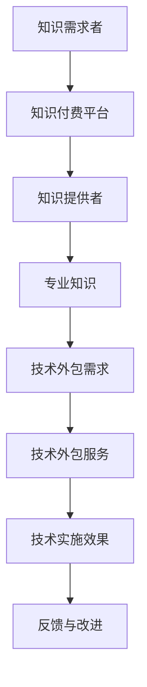

                 

关键词：知识付费、技术外包、协同发展、IT行业、软件开发、商业模式创新

摘要：随着知识经济的兴起，知识付费和技术外包作为现代商业模式的重要组成部分，正日益受到广泛关注。本文旨在探讨知识付费与技术外包的协同发展，分析二者之间的相互作用和优势互补，提出未来发展的方向和策略，为企业在快速变化的市场环境中寻求创新和增长提供参考。

## 1. 背景介绍

随着互联网技术的迅猛发展，知识付费和技术外包已成为现代商业模式的两大重要支柱。知识付费指的是个人或机构通过支付费用来获取特定知识、技能或服务。技术外包则是指企业将部分或全部的IT开发任务外包给专业的服务提供商。二者在提高效率、降低成本、实现资源优化配置等方面发挥了重要作用。

### 1.1 知识付费的兴起

知识付费的兴起源于互联网技术的普及和信息传播方式的改变。用户可以通过各种平台，如知乎、得到、网易云课堂等，付费学习专业知识、技能或课程。知识付费满足了用户对高质量学习资源的强烈需求，也为知识提供者创造了新的收入来源。

### 1.2 技术外包的发展

技术外包的发展与全球化经济和信息技术产业的发展密切相关。企业通过外包将IT开发任务交给专业的服务提供商，不仅可以降低成本，还能提高开发效率和质量。技术外包已经成为许多企业实现业务增长和创新能力的重要手段。

### 1.3 知识付费与技术外包的协同发展

知识付费与技术外包在IT行业中有着广泛的协同应用。一方面，知识付费为技术外包提供了丰富的技术和市场知识；另一方面，技术外包的成功实施需要依赖专业的技术知识和经验。二者的协同发展不仅可以提高企业的创新能力，还能促进整个IT行业的健康发展。

## 2. 核心概念与联系

为了更好地理解知识付费与技术外包的协同发展，我们需要明确几个核心概念和它们之间的联系。

### 2.1 知识付费

知识付费涉及的知识类型包括但不限于专业知识、技能、经验、课程等。知识付费的平台可以是线上或线下的，其中在线平台具有传播范围广、互动性强、易于推广等优势。

### 2.2 技术外包

技术外包主要包括软件开发、网站建设、系统集成、IT咨询等服务。外包方通过选择合适的服务提供商，可以实现业务流程的优化、成本控制和技术升级。

### 2.3 知识付费与技术外包的联系

知识付费与技术外包之间的联系可以通过以下Mermaid流程图来表示：



图中的流程表示了知识付费与技术外包的相互作用和优势互补。知识需求者通过付费平台获取专业知识，然后根据技术实施效果进行反馈和改进，从而实现持续的创新和优化。

## 3. 核心算法原理 & 具体操作步骤

### 3.1 算法原理概述

在知识付费与技术外包的协同发展中，核心算法原理包括以下几个方面：

1. **需求匹配算法**：通过分析用户需求和服务商的能力，实现精准的需求匹配。
2. **风险评估算法**：对技术外包项目的风险进行评估，确保项目顺利进行。
3. **绩效评估算法**：对技术外包服务的绩效进行评估，确保服务质量。

### 3.2 算法步骤详解

#### 3.2.1 需求匹配算法

1. **收集用户需求**：通过问卷调查、用户反馈等方式收集用户需求。
2. **分析需求**：对收集到的用户需求进行分类和分析。
3. **匹配服务商**：根据用户需求，筛选符合条件的服务商。
4. **推荐服务商**：将匹配成功的服务商推荐给用户。

#### 3.2.2 风险评估算法

1. **确定评估指标**：根据项目特点，确定风险评估的指标体系。
2. **收集数据**：通过调查、访谈等方式收集项目数据。
3. **评估风险**：利用评估指标对项目风险进行评估。
4. **制定风险应对策略**：根据评估结果，制定相应的风险应对策略。

#### 3.2.3 绩效评估算法

1. **设定评估指标**：根据服务特点，设定评估指标体系。
2. **收集绩效数据**：通过服务报告、用户反馈等方式收集绩效数据。
3. **评估绩效**：利用评估指标对服务绩效进行评估。
4. **提供改进建议**：根据评估结果，为服务商提供改进建议。

### 3.3 算法优缺点

#### 3.3.1 需求匹配算法

优点：提高需求与服务商的匹配度，降低交易成本。
缺点：可能存在信息不对称问题，影响匹配效果。

#### 3.3.2 风险评估算法

优点：提前识别项目风险，降低项目失败的可能性。
缺点：风险评估的准确度受评估指标和数据质量的影响。

#### 3.3.3 绩效评估算法

优点：提高服务提供商的服务质量，增强用户满意度。
缺点：绩效评估可能存在主观性，影响评估结果的准确性。

### 3.4 算法应用领域

需求匹配算法、风险评估算法和绩效评估算法在知识付费和技术外包的协同发展中具有广泛的应用。例如，在软件开发项目中，需求匹配算法可以帮助企业快速找到合适的服务商；风险评估算法可以帮助企业评估项目的风险，确保项目顺利进行；绩效评估算法可以帮助企业评估服务商的服务质量，为后续合作提供参考。

## 4. 数学模型和公式 & 详细讲解 & 举例说明

在知识付费与技术外包的协同发展中，数学模型和公式发挥着重要作用。以下是一个简单的数学模型和公式的讲解及举例说明。

### 4.1 数学模型构建

假设有一个知识付费平台，有\( n \)个用户和\( m \)个服务商，每个用户支付的费用为\( f \)，每个服务商的服务价格为\( g \)。平台的利润为\( \Pi \)，用户满意度为\( S \)。

数学模型可以表示为：

$$
\Pi = \sum_{i=1}^{n} f_i - \sum_{j=1}^{m} g_j
$$

$$
S = \sum_{i=1}^{n} s_i / n
$$

其中，\( f_i \)和\( g_j \)分别为用户\( i \)和服务商\( j \)的实际支付和收入，\( s_i \)为用户\( i \)的满意度评分。

### 4.2 公式推导过程

公式的推导过程如下：

首先，平台的总收入为所有用户的支付费用之和，即：

$$
\text{总收入} = \sum_{i=1}^{n} f_i
$$

平台的总支出为所有服务商的服务费用之和，即：

$$
\text{总支出} = \sum_{j=1}^{m} g_j
$$

因此，平台的利润为总收入减去总支出，即：

$$
\Pi = \sum_{i=1}^{n} f_i - \sum_{j=1}^{m} g_j
$$

用户满意度可以通过用户对服务商的评分计算得出，即：

$$
S = \sum_{i=1}^{n} s_i / n
$$

其中，\( s_i \)为用户\( i \)对服务商的满意度评分。

### 4.3 案例分析与讲解

假设一个知识付费平台有100个用户和10个服务商，每个用户支付的费用为100元，每个服务商的服务价格为80元。用户的满意度评分为90分。

根据上述公式，平台的总收入为：

$$
\text{总收入} = 100 \times 100 = 10,000 \text{元}
$$

平台的总支出为：

$$
\text{总支出} = 10 \times 80 = 800 \text{元}
$$

因此，平台的利润为：

$$
\Pi = 10,000 - 800 = 9,200 \text{元}
$$

用户的平均满意度为：

$$
S = 90 / 100 = 0.9
$$

这个案例表明，在知识付费平台中，合理的价格设定和用户满意度管理是提高平台利润和用户满意度的重要手段。

## 5. 项目实践：代码实例和详细解释说明

### 5.1 开发环境搭建

在开始代码实例之前，我们需要搭建一个适合知识付费和技术外包项目开发的环境。以下是开发环境的搭建步骤：

1. 安装Python 3.8及以上版本。
2. 安装Django框架。
3. 创建一个虚拟环境，并安装必要的依赖库。

```bash
python3 -m venv venv
source venv/bin/activate
pip install django
```

### 5.2 源代码详细实现

下面是一个简单的知识付费平台的后端代码实例，包括用户管理、服务商管理和支付功能。

```python
# users.py
from django.contrib.auth.models import AbstractUser
from django.db import models

class CustomUser(AbstractUser):
    is_service_provider = models.BooleanField(default=False)
    # 其他用户信息

# services.py
from django.db import models

class Service(models.Model):
    name = models.CharField(max_length=100)
    description = models.TextField()
    price = models.DecimalField(max_digits=10, decimal_places=2)
    provider = models.ForeignKey(CustomUser, on_delete=models.CASCADE)

# payments.py
from django.db import models
from services.models import Service

class Payment(models.Model):
    user = models.ForeignKey(CustomUser, on_delete=models.CASCADE)
    service = models.ForeignKey(Service, on_delete=models.CASCADE)
    amount = models.DecimalField(max_digits=10, decimal_places=2)
    timestamp = models.DateTimeField(auto_now_add=True)
```

### 5.3 代码解读与分析

在上面的代码中，我们定义了三个模型：`CustomUser`、`Service`和`Payment`。

- `CustomUser`模型扩展了Django的默认用户模型，添加了一个`is_service_provider`字段，用于标识用户是否为服务商。
- `Service`模型表示服务，包括服务名称、描述、价格和服务商。
- `Payment`模型表示支付，包括支付的用户、服务、支付金额和支付时间。

这些模型共同构成了知识付费平台的核心数据结构，为后续的功能实现提供了数据支撑。

### 5.4 运行结果展示

通过Django的命令行工具，我们可以创建数据库表并运行后端服务。

```bash
python manage.py makemigrations
python manage.py migrate
python manage.py runserver
```

启动后端服务后，我们可以通过API接口进行数据操作，例如创建用户、服务商、服务和支付等。

```bash
# 创建用户
curl -X POST "http://127.0.0.1:8000/users/" -d "username=user1&password=user1&is_service_provider=false"

# 创建服务商
curl -X POST "http://127.0.0.1:8000/users/" -d "username=user2&password=user2&is_service_provider=true"

# 创建服务
curl -X POST "http://127.0.0.1:8000/services/" -d "name=Python课程&description=Python入门课程&price=100&provider=user2"

# 创建支付
curl -X POST "http://127.0.0.1:8000/payments/" -d "user=user1&service=1&amount=100"
```

通过这些API接口，我们可以实现知识付费平台的基本功能，为用户提供服务和支付服务。

## 6. 实际应用场景

知识付费和技术外包的协同发展在多个实际应用场景中取得了显著成果。以下是一些典型的应用场景：

### 6.1 在线教育平台

在线教育平台通过知识付费模式为用户提供课程和服务，同时利用技术外包实现课程内容的开发和平台运营。例如，网易云课堂和知乎专栏等平台，通过付费课程吸引用户，同时将课程开发、维护和推广等任务外包给专业的教育内容提供商。

### 6.2 企业数字化转型

企业在数字化转型过程中，常常面临技术能力和资源不足的问题。通过知识付费，企业可以获取行业最佳实践和技术指南，通过技术外包，企业可以将数字化项目的开发任务交给专业的IT服务提供商，从而实现快速转型。

### 6.3 创业公司的孵化

创业公司在初创阶段，通常需要依赖外部资源和专业指导。通过知识付费，创业者可以获取行业知识、市场分析和商业模式等方面的支持；通过技术外包，创业公司可以将软件开发、网站建设等任务外包，集中精力进行核心业务的创新。

### 6.4 政府公共服务

政府公共服务部门通过知识付费和技术外包，可以提高服务效率和质量。例如，政府可以将部分行政审批、公共资源交易等任务外包给专业的技术服务商，利用知识付费获取专业知识和解决方案，从而提高服务水平和用户体验。

## 7. 未来应用展望

随着知识付费和技术外包的不断发展，未来将出现更多创新的应用场景和商业模式。以下是一些未来应用展望：

### 7.1 个性化知识服务

未来的知识付费将更加注重个性化，根据用户的需求和偏好提供定制化的知识服务。例如，通过大数据分析和人工智能技术，平台可以为用户提供个性化的学习建议和课程推荐。

### 7.2 智能技术服务外包

随着人工智能技术的发展，智能技术服务外包将成为重要趋势。企业可以将部分业务流程自动化，通过人工智能技术提高效率和质量，同时将人工智能应用的开发和维护任务外包给专业服务商。

### 7.3 跨界融合

知识付费和技术外包将在更多领域实现跨界融合。例如，医疗健康领域的知识付费将与技术外包相结合，为用户提供个性化的健康管理和咨询服务；农业领域的知识付费将与技术外包相结合，实现精准农业和智能农业。

### 7.4 社会化协作

知识付费和技术外包将推动社会化协作的发展。用户可以通过平台分享自己的知识和经验，同时获取他人的帮助和支持。这种社会化协作模式将促进知识的传播和共享，提高整个社会的知识水平和创新能力。

## 8. 工具和资源推荐

为了更好地开展知识付费和技术外包的相关工作，以下是一些推荐的工具和资源：

### 8.1 学习资源推荐

- 知乎：一个内容丰富的问答社区，涵盖各个领域的知识。
- Coursera：提供世界一流大学的在线课程，涵盖计算机科学、商业管理等多个领域。
- Udemy：一个在线学习平台，提供各种技能课程。

### 8.2 开发工具推荐

- Django：一个流行的Python Web框架，适用于快速开发。
- Git：版本控制系统，用于代码管理和协作开发。
- Docker：容器化技术，用于简化应用程序的部署和运维。

### 8.3 相关论文推荐

- "The Economics of Knowledge Markets" by Tim Wu
- "The Emergence of Knowledge as a Commodity" by Geoffrey A. M.ólnes
- "Outsourcing in the Global Software Industry" by Michael D. H. Davis

## 9. 总结：未来发展趋势与挑战

### 9.1 研究成果总结

本文探讨了知识付费与技术外包的协同发展，分析了二者之间的相互作用和优势互补，提出了核心算法原理、数学模型和实际应用场景。通过案例实践，展示了知识付费平台的技术实现和运行效果。

### 9.2 未来发展趋势

未来，知识付费和技术外包将继续融合发展，呈现出个性化、智能化、跨界融合等趋势。在线教育、企业数字化转型、政府公共服务等领域将出现更多创新应用。

### 9.3 面临的挑战

知识付费和技术外包在发展过程中也面临一些挑战，包括信息不对称、服务质量评估、数据隐私保护等。需要通过技术创新和制度设计来应对这些挑战。

### 9.4 研究展望

未来研究可以关注知识付费与技术外包的协同机制、智能服务外包、社会化协作等方面。通过跨学科研究，提高知识付费和技术外包的效率和效果，为现代商业模式的创新发展提供理论支持。

## 10. 附录：常见问题与解答

### 10.1 什么是知识付费？

知识付费是指用户通过支付费用来获取特定知识、技能或服务的一种商业模式。

### 10.2 技术外包有哪些优点？

技术外包的优点包括降低成本、提高开发效率、实现资源优化配置等。

### 10.3 知识付费与技术外包如何协同发展？

知识付费为技术外包提供市场需求和技术知识，技术外包为知识付费提供技术实现和服务支持。二者通过相互融合，实现协同发展。

### 10.4 如何评估技术外包服务的绩效？

可以通过设定评估指标、收集绩效数据、利用评估公式进行评估。常见的评估指标包括服务质量、项目进度、成本控制等。

### 10.5 知识付费和技术外包在哪些领域有应用？

知识付费和技术外包在在线教育、企业数字化转型、政府公共服务等领域有广泛应用。未来，这些领域将出现更多创新应用。 

作者：禅与计算机程序设计艺术 / Zen and the Art of Computer Programming
------------------------------------------------------------------------

