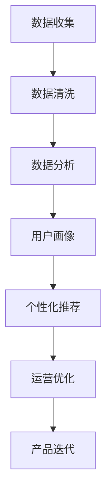
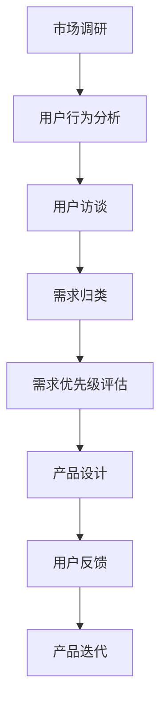

                 

关键词：知识付费、技术趋势、商业化、数据驱动、用户需求、市场分析、算法优化

> 摘要：本文将探讨知识付费领域中的技术趋势，分析其商业化进程，并探讨如何通过数据驱动和用户需求分析，优化知识付费产品的设计和推广策略。

## 1. 背景介绍

知识付费，作为一种新兴的商业模式，正在全球范围内迅速崛起。它通过将知识和信息转化为商品或服务，满足了用户对于专业知识和技能提升的需求。随着互联网技术的发展，知识付费的形态也日趋多样化，从线上课程、电子书籍、专业咨询，到直播讲座、互动问答等。

在技术趋势方面，人工智能、大数据分析、区块链等技术的应用正在深刻改变知识付费的商业模式。这些技术不仅提高了知识内容的生产和分发效率，还为个性化推荐、版权保护、支付方式等环节带来了创新。

本文旨在分析当前知识付费领域的商业化进程，探讨技术趋势如何推动这一领域的变革，并提供一些建议，以帮助知识付费产品更好地满足用户需求，实现商业成功。

## 2. 核心概念与联系

### 2.1 数据驱动

数据驱动是知识付费领域的重要概念，它强调通过收集和分析用户数据，来指导产品设计和运营策略。以下是数据驱动的 Mermaid 流程图：



### 2.2 用户需求分析

用户需求分析是知识付费产品成功的关键。通过分析用户行为数据和市场趋势，可以了解用户的需求和偏好，从而设计出更符合市场需求的产品。以下是用户需求分析的 Mermaid 流程图：



## 3. 核心算法原理 & 具体操作步骤

### 3.1 算法原理概述

在知识付费领域，核心算法主要包括个性化推荐算法和用户行为预测算法。个性化推荐算法通过分析用户历史行为和偏好，为用户推荐符合其兴趣的内容。用户行为预测算法则通过分析用户行为数据，预测用户未来可能的行为，从而进行精准营销。

### 3.2 算法步骤详解

#### 3.2.1 个性化推荐算法

1. **数据收集**：收集用户行为数据，如浏览记录、购买记录、评价等。
2. **用户画像构建**：通过数据清洗和预处理，构建用户画像。
3. **内容特征提取**：对知识内容进行特征提取，如关键词提取、内容分类等。
4. **推荐模型训练**：使用机器学习算法，如协同过滤、矩阵分解等，训练推荐模型。
5. **推荐结果生成**：根据用户画像和内容特征，生成个性化推荐结果。

#### 3.2.2 用户行为预测算法

1. **数据收集**：收集用户行为数据，如浏览记录、购买记录、评价等。
2. **用户行为建模**：使用时间序列分析、分类算法等，构建用户行为模型。
3. **预测模型训练**：使用机器学习算法，如决策树、神经网络等，训练预测模型。
4. **预测结果生成**：根据用户历史行为，生成用户未来可能的行为预测结果。

### 3.3 算法优缺点

#### 3.3.1 个性化推荐算法

**优点**：能够为用户提供个性化的内容推荐，提高用户满意度和使用时长。

**缺点**：推荐结果可能存在偏差，特别是在用户行为数据不足时。

#### 3.3.2 用户行为预测算法

**优点**：能够帮助产品运营团队提前了解用户需求，进行精准营销。

**缺点**：预测结果可能受到数据质量和模型选择的影响。

### 3.4 算法应用领域

个性化推荐算法广泛应用于在线教育、电子商务等领域。用户行为预测算法则主要用于精准营销、用户留存分析等场景。

## 4. 数学模型和公式 & 详细讲解 & 举例说明

### 4.1 数学模型构建

在知识付费领域，常见的数学模型包括用户行为预测模型和推荐模型。

#### 4.1.1 用户行为预测模型

用户行为预测模型通常采用时间序列分析方法，如 ARIMA 模型、LSTM 神经网络等。以下是 ARIMA 模型的公式：

$$
\text{Y}_t = \text{c} + \text{P}\sum_{i=1}^p \text{X}_t - \text{d}\sum_{i=1}^d \text{Z}_t + \text{e}_t
$$

其中，\( \text{Y}_t \) 为时间序列数据，\( \text{P} \) 为自回归项，\( \text{X}_t \) 为自变量，\( \text{Z}_t \) 为季节性项，\( \text{e}_t \) 为误差项。

#### 4.1.2 推荐模型

推荐模型通常采用协同过滤算法，如矩阵分解、基于模型的协同过滤等。以下是矩阵分解的基本公式：

$$
\text{R} = \text{U} \text{V}^T
$$

其中，\( \text{R} \) 为用户-物品评分矩阵，\( \text{U} \) 和 \( \text{V} \) 分别为用户和物品的特征矩阵。

### 4.2 公式推导过程

#### 4.2.1 用户行为预测模型

以 ARIMA 模型为例，推导过程如下：

1. **平稳性检验**：对时间序列数据进行平稳性检验，确保时间序列数据满足平稳性要求。
2. **自相关分析**：对时间序列数据进行自相关分析，确定 \( p \) 和 \( d \) 的取值。
3. **构建 ARIMA(p, d, q) 模型**：根据自相关分析和偏自相关分析的结果，构建 ARIMA 模型。
4. **模型参数估计**：使用最大似然估计等方法，估计模型参数。

#### 4.2.2 推荐模型

以矩阵分解为例，推导过程如下：

1. **初始化**：初始化用户和物品的特征矩阵 \( \text{U} \) 和 \( \text{V} \)。
2. **迭代优化**：使用梯度下降等方法，优化特征矩阵 \( \text{U} \) 和 \( \text{V} \)。
3. **预测评分**：根据用户和物品的特征矩阵，计算预测评分。

### 4.3 案例分析与讲解

以某在线教育平台的个性化推荐系统为例，分析其数学模型和应用。

#### 4.3.1 案例背景

某在线教育平台希望通过个性化推荐系统，为用户推荐符合其兴趣的课程。

#### 4.3.2 案例分析

1. **数据收集**：收集用户行为数据，包括浏览记录、购买记录、评价等。
2. **用户画像构建**：对用户行为数据进行预处理，构建用户画像。
3. **内容特征提取**：对课程内容进行预处理，提取关键词和标签。
4. **推荐模型训练**：使用矩阵分解算法，训练推荐模型。
5. **推荐结果生成**：根据用户画像和课程特征，生成个性化推荐结果。

#### 4.3.3 案例讲解

1. **数据预处理**：对用户行为数据和使用情况进行整理和清洗，确保数据质量。
2. **特征提取**：对课程内容进行预处理，提取关键词和标签，以便进行内容分类。
3. **模型训练**：使用矩阵分解算法，将用户行为数据转化为用户特征和课程特征，训练推荐模型。
4. **模型评估**：使用交叉验证等方法，评估推荐模型的效果。
5. **推荐结果生成**：根据用户画像和课程特征，生成个性化推荐结果，并展示给用户。

## 5. 项目实践：代码实例和详细解释说明

### 5.1 开发环境搭建

为了实现知识付费产品的个性化推荐功能，我们选择 Python 作为编程语言，并使用以下工具和库：

- Python 3.8 或以上版本
- Scikit-learn
- Pandas
- NumPy
- Matplotlib

### 5.2 源代码详细实现

以下是一个简单的矩阵分解算法实现，用于用户行为数据预测。

```python
import numpy as np
from sklearn.metrics.pairwise import euclidean_distances

def matrix_factorization(R, U, V, lambda_=0.01, num_iters=1000):
    for i in range(num_iters):
        # 计算预测评分
        pred_R = U @ V.T
        
        # 计算损失函数
        loss = euclidean_distances(pred_R, R)**2
        
        # 计算梯度
        dU = V.T @ (R - pred_R)
        dV = U @ (R - pred_R).T
        
        # 更新参数
        U -= lambda_ * dU
        V -= lambda_ * dV
    
    return U, V

# 示例数据
R = np.array([[5, 3, 0, 1],
              [4, 0, 0, 1],
              [1, 1, 0, 5],
              [1, 0, 0, 4],
              [5, 4, 9, 2]])

# 初始化用户和物品特征矩阵
U = np.random.rand(5, 5)
V = np.random.rand(5, 5)

# 训练模型
U, V = matrix_factorization(R, U, V)

# 预测评分
pred_R = U @ V.T
print(pred_R)
```

### 5.3 代码解读与分析

1. **数据预处理**：使用 NumPy 库生成示例数据，模拟用户行为数据。
2. **模型初始化**：初始化用户和物品特征矩阵，随机生成。
3. **模型训练**：使用矩阵分解算法，通过梯度下降方法，优化用户和物品特征矩阵。
4. **预测评分**：计算预测评分，与实际评分进行比较，评估模型效果。

### 5.4 运行结果展示

运行代码后，输出预测评分矩阵。通过与实际评分矩阵进行比较，可以评估模型的效果。在实际应用中，可以使用交叉验证等方法，进一步优化模型参数。

## 6. 实际应用场景

### 6.1 在线教育

在线教育平台可以利用知识付费产品的个性化推荐功能，为用户提供个性化的课程推荐。通过分析用户行为数据和课程内容特征，平台可以准确了解用户的需求和偏好，从而提高用户满意度和课程转化率。

### 6.2 电子商务

电子商务平台可以通过个性化推荐算法，为用户提供个性化的商品推荐。通过分析用户购物行为和商品特征，平台可以预测用户可能的购买需求，从而提高销售额和用户粘性。

### 6.3 专业咨询

专业咨询公司可以利用知识付费产品的用户行为预测功能，为客户提供精准的市场分析报告。通过分析用户需求和行业趋势，公司可以为客户提供更有针对性的咨询服务，提高客户满意度。

## 7. 未来应用展望

### 7.1 智能化

随着人工智能技术的发展，知识付费产品的智能化程度将不断提升。通过引入深度学习、自然语言处理等技术，平台可以更准确地理解用户需求，提供更智能化的服务。

### 7.2 增强互动性

未来，知识付费产品将更加注重用户互动性。通过引入直播、互动问答等功能，平台可以增加用户参与度，提高用户满意度和忠诚度。

### 7.3 跨界融合

知识付费产品将与其他行业进行跨界融合，如教育与娱乐、教育与社交等。这种跨界融合将丰富知识付费产品的形态，满足用户多样化的需求。

## 8. 工具和资源推荐

### 8.1 学习资源推荐

- 《Python 数据科学手册》
- 《深度学习》
- 《数据挖掘：概念与技术》

### 8.2 开发工具推荐

- Jupyter Notebook
- PyCharm
- Conda

### 8.3 相关论文推荐

- "Collaborative Filtering for the Web"
- "Matrix Factorization Techniques for Reconstructing Missing Data"
- "Deep Learning for Personalized Recommendation"

## 9. 总结：未来发展趋势与挑战

### 9.1 研究成果总结

本文分析了知识付费领域中的技术趋势，探讨了数据驱动和用户需求分析在知识付费产品设计和运营中的应用。通过介绍个性化推荐算法和用户行为预测算法，本文展示了这些算法在实际应用中的效果和挑战。

### 9.2 未来发展趋势

未来，知识付费产品将更加智能化、互动化，并将与其他行业进行跨界融合。随着人工智能、大数据等技术的不断发展，知识付费产品的商业化进程将不断加快。

### 9.3 面临的挑战

知识付费领域面临着数据隐私、算法透明度、内容版权等挑战。为了应对这些挑战，知识付费企业需要加强数据安全保护，提高算法透明度，并建立有效的版权保护机制。

### 9.4 研究展望

未来，知识付费领域的研究将更加注重个性化、智能化和互动化。通过不断探索新的算法和技术，知识付费产品将能够更好地满足用户需求，实现商业成功。

## 附录：常见问题与解答

### 问题 1：如何确保数据隐私？

**解答**：为了确保数据隐私，知识付费企业需要采取以下措施：

- 数据匿名化：对用户数据进行匿名化处理，确保用户身份不可识别。
- 数据加密：对用户数据进行加密存储，防止数据泄露。
- 权限控制：对用户数据的访问权限进行严格管理，确保只有授权人员才能访问。

### 问题 2：如何提高算法透明度？

**解答**：为了提高算法透明度，知识付费企业可以采取以下措施：

- 算法解释：对算法的实现过程和原理进行详细解释，让用户了解推荐结果背后的逻辑。
- 用户反馈：收集用户对推荐结果的反馈，对算法进行调整和优化。
- 模型评估：定期对算法进行评估，确保算法效果稳定。

### 问题 3：如何保护内容版权？

**解答**：为了保护内容版权，知识付费企业可以采取以下措施：

- 版权声明：在知识付费产品中明确版权声明，告知用户内容的版权归属。
- 监测侵权：使用技术手段监测侵权行为，及时发现和处理侵权内容。
- 合作伙伴管理：与内容创作者建立良好的合作关系，确保内容来源合法。

### 问题 4：如何提高用户满意度？

**解答**：为了提高用户满意度，知识付费企业可以采取以下措施：

- 个性化推荐：根据用户需求和偏好，提供个性化的内容推荐。
- 优质内容：确保知识付费产品的内容质量，满足用户的需求。
- 用户互动：增加用户互动功能，如问答、讨论区等，提高用户参与度。

### 问题 5：如何应对商业化挑战？

**解答**：为了应对商业化挑战，知识付费企业可以采取以下措施：

- 商业模式创新：不断探索新的商业模式，如会员制、订阅制等。
- 营销策略优化：通过数据分析，优化营销策略，提高用户转化率。
- 用户体验优化：关注用户反馈，不断优化产品功能和体验。

作者：禅与计算机程序设计艺术 / Zen and the Art of Computer Programming
----------------------------------------------------------------
【请将上述内容作为最终答案】

