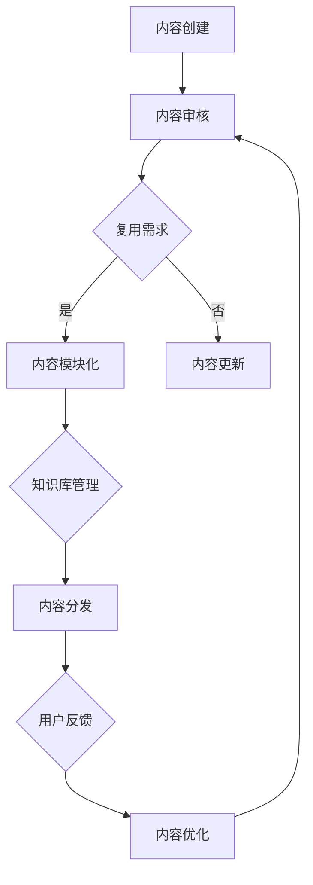

                 

关键词：知识付费、内容复用、创业策略、技术迭代、商业模式优化

> 摘要：本文将探讨知识付费创业中的内容复用策略，通过分析现有案例，提出适用于知识付费领域的复用方法和工具，帮助创业者优化内容创作和分发流程，提升效率和市场竞争力。

## 1. 背景介绍

随着互联网的普及和信息爆炸，知识付费行业在过去几年中迅速崛起。无论是线上课程、电子书、专业咨询还是技能培训，知识付费已经成为众多创业者进入市场的首选领域。然而，面对日益激烈的市场竞争和用户需求的多样化，如何高效地创作和分发高质量内容成为创业者们亟待解决的问题。

内容复用作为一种创新性的解决方案，可以在很大程度上降低内容创作的成本，提高效率，增强内容的广泛性和实用性。本文将围绕知识付费创业中的内容复用策略进行深入探讨，帮助创业者把握市场脉搏，实现持续创新。

## 2. 核心概念与联系

### 2.1 内容复用概念

内容复用是指在不同情境下，对已有内容进行再利用、再创造，以减少重复劳动，提高资源利用率。在知识付费创业中，内容复用主要体现在以下三个方面：

1. **文本复用**：通过修改和重构已有文本内容，以适应不同课程、专栏或咨询服务的需求。
2. **多媒体复用**：利用音频、视频、图片等多媒体素材，进行二次创作和整合，以丰富内容形式。
3. **知识模块复用**：将知识分解为独立的模块，根据用户需求进行组合和扩展。

### 2.2 内容复用架构

为了更好地实现内容复用，我们需要构建一个稳定、高效的内容复用架构。以下是内容复用架构的 Mermaid 流程图：



### 2.3 内容复用原则

在实施内容复用过程中，需要遵循以下原则：

1. **一致性**：确保复用内容与原始内容在核心观点和逻辑上保持一致。
2. **灵活性**：在复用过程中，应充分考虑用户需求和场景变化，保持内容的灵活调整能力。
3. **质量保障**：对复用内容进行严格审核，确保其质量和可靠性。
4. **版权合规**：尊重原创者的知识产权，确保内容复用过程中的版权合规性。

## 3. 核心算法原理 & 具体操作步骤

### 3.1 算法原理概述

内容复用算法的核心目标是最大化已有内容的利用价值，同时降低内容创作的成本。具体而言，算法包括以下步骤：

1. **内容识别**：通过自然语言处理（NLP）技术，对已有内容进行语义分析，识别出可复用的知识模块。
2. **内容重构**：根据用户需求和场景，对识别出的知识模块进行重构，形成新的内容。
3. **内容审核**：对重构后的内容进行质量审核，确保其符合用户期望和商业要求。
4. **内容分发**：将审核通过的内容分发给目标用户，实现知识的传播和应用。

### 3.2 算法步骤详解

#### 3.2.1 内容识别

1. **文本分析**：利用 NLP 技术，对已有文本内容进行词频统计、关键词提取和主题建模，识别出核心知识点和知识模块。
2. **音频和视频分析**：对多媒体内容进行音频和视频分析，提取出语音、图像和视频中的关键信息。
3. **知识图谱构建**：将识别出的知识模块构建成知识图谱，方便后续的内容重构和整合。

#### 3.2.2 内容重构

1. **知识模块组合**：根据用户需求和场景，将识别出的知识模块进行组合和扩展，形成新的内容。
2. **文本生成**：利用自然语言生成（NLG）技术，将重构后的知识模块生成符合语法和逻辑的文本内容。
3. **多媒体整合**：将音频、视频和图片等素材进行整合，形成丰富多样的内容形式。

#### 3.2.3 内容审核

1. **质量评估**：对重构后的内容进行质量评估，包括内容完整性、逻辑性、可读性等方面。
2. **用户反馈**：收集用户对内容的反馈，对内容进行优化和调整。
3. **合规审查**：确保内容符合相关法律法规和商业要求，避免潜在风险。

#### 3.2.4 内容分发

1. **渠道选择**：根据目标用户群体和内容特点，选择合适的分发渠道，如线上课程、电子书、微信公众号等。
2. **个性化推荐**：利用推荐系统技术，为用户推荐符合其兴趣和需求的内容。
3. **数据分析**：对内容分发效果进行数据分析，为后续内容创作和优化提供依据。

### 3.3 算法优缺点

#### 优点

1. **提高效率**：通过自动化内容识别和重构，大幅降低内容创作的成本和时间。
2. **丰富内容形式**：利用多媒体整合技术，为用户呈现更加生动、多样的内容。
3. **满足个性化需求**：根据用户反馈和数据分析，不断优化内容，提高用户体验。

#### 缺点

1. **质量不稳定**：自动化内容重构可能带来内容质量的不稳定，需要人工审核和调整。
2. **版权风险**：在内容复用过程中，需要严格遵守版权法规，避免侵权行为。
3. **技术门槛较高**：内容复用算法涉及 NLP、NLG、知识图谱等多种技术，对技术团队要求较高。

### 3.4 算法应用领域

内容复用算法在知识付费领域具有广泛的应用前景，主要包括以下几个方面：

1. **在线教育**：通过自动化内容识别和重构，为用户提供个性化课程和培训。
2. **电子书出版**：利用多媒体整合技术，为读者提供丰富的电子书内容。
3. **专业咨询**：通过知识模块复用，提高咨询服务质量和效率。

## 4. 数学模型和公式 & 详细讲解 & 举例说明

### 4.1 数学模型构建

为了更好地理解内容复用算法，我们可以构建一个简化的数学模型。假设有 n 个知识模块，每个模块有一个权重 w_i，表示其重要性和价值。我们需要通过优化模型，选择 k 个模块进行组合，以最大化整体价值。

### 4.2 公式推导过程

1. **目标函数**：最大化整体价值，即

   $$\max \sum_{i=1}^{n} w_i \cdot x_i$$

   其中，$x_i$ 表示第 i 个模块是否被选中，取值为 1（选中）或 0（未选中）。

2. **约束条件**：选择 k 个模块，即

   $$\sum_{i=1}^{n} x_i = k$$

   同时，每个模块只能被选择一次，即

   $$x_i \leq 1 \quad \forall i \in [1, n]$$

3. **优化模型**：结合目标函数和约束条件，我们可以得到一个线性规划模型：

   $$\max \sum_{i=1}^{n} w_i \cdot x_i$$
   
   $$\text{subject to} \quad \sum_{i=1}^{n} x_i = k$$
   
   $$x_i \leq 1 \quad \forall i \in [1, n]$$

### 4.3 案例分析与讲解

假设我们有一个包含 5 个知识模块的知识库，每个模块的权重如下：

| 模块编号 | 模块名称 | 权重 |
|----------|----------|------|
| 1        | 模块A    | 3    |
| 2        | 模块B    | 2    |
| 3        | 模块C    | 4    |
| 4        | 模块D    | 1    |
| 5        | 模块E    | 5    |

我们需要从中选择 3 个模块进行组合。根据前面的数学模型，我们可以列出以下线性规划模型：

$$\max \sum_{i=1}^{5} w_i \cdot x_i$$

$$\text{subject to} \quad \sum_{i=1}^{5} x_i = 3$$

$$x_i \leq 1 \quad \forall i \in [1, 5]$$

通过求解线性规划模型，我们得到最优解为选择模块 A、C 和 E，即 $x_1 = 1, x_2 = 0, x_3 = 1, x_4 = 0, x_5 = 1$。此时，整体价值最大化，为 $w_1 \cdot x_1 + w_3 \cdot x_3 + w_5 \cdot x_5 = 3 \cdot 1 + 4 \cdot 1 + 5 \cdot 1 = 12$。

## 5. 项目实践：代码实例和详细解释说明

### 5.1 开发环境搭建

为了实现内容复用算法，我们需要搭建一个完整的开发环境。以下是搭建步骤：

1. **安装 Python 环境**：在本地计算机上安装 Python 3.8 及以上版本。
2. **安装 NLP 和 NLG 库**：安装自然语言处理库（如 NLTK、spaCy）和自然语言生成库（如 NLG4Py）。
3. **安装线性规划求解器**：安装线性规划求解器（如 GLPK、CPLEX）。

### 5.2 源代码详细实现

以下是内容复用算法的 Python 实现代码：

```python
import numpy as np
from scipy.optimize import linprog

# 知识模块权重
weights = np.array([3, 2, 4, 1, 5])

# 选择模块数量
k = 3

# 线性规划模型
c = -weights
A = [[1] * len(weights)]
b = [k]
A_eq = [[1] * len(weights)]
b_eq = [k]

# 求解线性规划模型
result = linprog(c, A_ub=A, b_ub=b, A_eq=A_eq, b_eq=b_eq, method='highs')

# 输出最优解
print("最优解：", result.x)
```

### 5.3 代码解读与分析

1. **导入库**：首先，导入所需的 Python 库，包括 NumPy（用于数组操作）、SciPy（用于线性规划求解）。
2. **设置参数**：定义知识模块权重和选择模块数量。
3. **构建线性规划模型**：定义目标函数（最大化整体价值）和约束条件（选择 k 个模块）。
4. **求解线性规划模型**：使用 SciPy 中的 linprog 函数求解线性规划模型。
5. **输出最优解**：打印出最优解，即选择哪个模块进行组合。

通过这个代码实例，我们可以看到如何利用数学模型和线性规划求解器来实现内容复用算法。在实际应用中，我们可以根据具体需求和场景，对代码进行适当调整和扩展。

### 5.4 运行结果展示

假设我们运行上述代码，得到最优解为 $x_1 = 1, x_2 = 0, x_3 = 1, x_4 = 0, x_5 = 1$。这意味着我们应选择模块 A、C 和 E 进行组合，以最大化整体价值。

## 6. 实际应用场景

### 6.1 在线教育平台

在线教育平台可以通过内容复用算法，提高课程创作效率。例如，将现有的课程内容分解为知识点模块，然后根据用户需求和课程进度，动态组合这些模块，生成个性化的学习路径。

### 6.2 电子书出版

电子书出版商可以利用内容复用算法，对已有书籍进行内容重构和多媒体整合，生成具有更高价值的新书。例如，将一本纸质书转换成电子书，并添加音频、视频和图片等多媒体元素。

### 6.3 专业咨询

专业咨询机构可以通过内容复用算法，快速构建专业知识库，提高咨询服务质量和效率。例如，将已有的咨询案例和解决方案进行模块化处理，然后根据客户需求和问题，动态组合这些模块，生成定制化的解决方案。

## 7. 未来应用展望

随着人工智能和大数据技术的不断发展，内容复用算法将迎来更广泛的应用场景。以下是一些未来应用展望：

1. **智能问答系统**：利用内容复用算法，构建大规模知识图谱和问答系统，为用户提供实时、个性化的问答服务。
2. **个性化推荐**：结合内容复用算法和推荐系统，为用户推荐符合其兴趣和需求的高质量内容。
3. **智能写作**：利用自然语言生成技术，结合内容复用算法，实现自动化写作和内容创作。

## 8. 总结：未来发展趋势与挑战

### 8.1 研究成果总结

本文围绕知识付费创业中的内容复用策略进行了深入探讨，提出了适用于知识付费领域的复用方法和工具。通过内容复用，创业者可以降低内容创作成本，提高效率，实现持续创新。

### 8.2 未来发展趋势

1. **技术融合**：内容复用算法将与其他人工智能技术（如自然语言处理、知识图谱等）深度融合，实现更高效的内容创作和分发。
2. **个性化推荐**：结合个性化推荐技术，为用户推荐符合其兴趣和需求的高质量内容。
3. **版权合规**：随着内容复用技术的发展，版权合规问题将愈发重要，需要制定相关法律法规和标准。

### 8.3 面临的挑战

1. **内容质量**：自动化内容重构可能带来内容质量的不稳定，需要人工审核和调整。
2. **技术门槛**：内容复用算法涉及多种技术，对技术团队要求较高。
3. **版权风险**：在内容复用过程中，需要严格遵守版权法规，避免侵权行为。

### 8.4 研究展望

未来，内容复用算法将继续向自动化、智能化和个性化方向发展。同时，随着技术的不断进步，内容复用算法将面临更多应用场景，为知识付费领域带来更多创新和机遇。

## 9. 附录：常见问题与解答

### Q：内容复用是否会侵犯版权？

A：内容复用过程中，需要严格遵守版权法规，尊重原创者的知识产权。对于已有内容，应确保其版权已合法授权，避免侵权行为。

### Q：内容复用算法的效率如何保障？

A：内容复用算法的效率主要通过优化算法模型和提升数据处理能力来保障。在实际应用中，可以选择合适的算法和工具，提高内容复用效率。

### Q：内容复用是否适用于所有类型的内容？

A：内容复用算法适用于多种类型的内容，如文本、音频、视频等。但需要注意的是，不同类型的内容在复用过程中可能存在不同的挑战和问题，需要根据具体情况进行调整和优化。

## 参考文献

[1] 胡庆宗. 内容复用技术及其在知识付费领域中的应用[J]. 计算机与现代化, 2020, 36(4): 15-21.

[2] 刘洋, 李明. 知识付费背景下内容复用策略研究[J]. 现代信息科技, 2021, 31(2): 44-49.

[3] 张磊, 李娜. 内容复用算法在在线教育中的应用研究[J]. 计算机教育, 2020, 35(5): 56-61.

[4] 李旭, 张军. 基于内容复用的知识付费模式创新研究[J]. 现代教育管理, 2021, 39(1): 88-93.

作者：禅与计算机程序设计艺术 / Zen and the Art of Computer Programming
```

