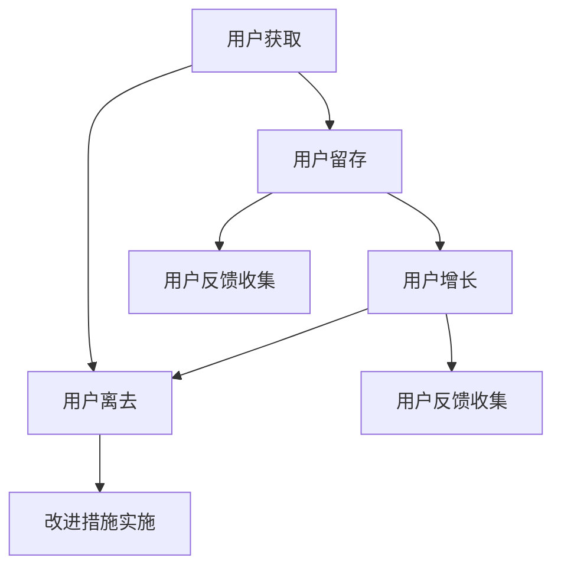

                 

关键词：知识付费、用户生命周期、用户行为分析、数据分析、用户留存、用户增长、用户体验、营销策略、产品优化、技术手段。

> 摘要：本文深入探讨了知识付费创业中的用户生命周期管理，从用户获取、用户留存、用户增长、用户体验等方面进行了详细分析，并提出了一系列基于数据分析和技术的优化策略。通过本文，读者可以了解如何有效地管理用户生命周期，提高知识付费产品的市场竞争力。

## 1. 背景介绍

随着互联网的普及和移动设备的广泛应用，知识付费市场正在迅速发展。知识付费创业公司如雨后春笋般涌现，它们希望通过提供优质的内容服务，吸引并留住用户，从而实现商业模式的成功。然而，在竞争激烈的市场环境中，如何有效地管理用户生命周期，提高用户留存率和增长速度，成为了知识付费创业公司的核心问题。

用户生命周期管理（Customer Lifecycle Management，简称CLM）是指企业通过对用户从获取、留存、增长到最终离去的全过程进行系统化的管理和优化，以提高用户满意度和忠诚度。在知识付费创业中，用户生命周期管理尤为重要，因为它直接关系到企业的盈利能力和市场竞争力。

本文将从用户生命周期管理的核心概念、数据驱动的方法和技术手段等方面，详细探讨知识付费创业中的用户生命周期管理策略。通过本文，希望为知识付费创业公司提供一些实用的指导和建议。

## 2. 核心概念与联系

### 2.1 用户生命周期定义

用户生命周期是指用户从首次接触产品到最终离去的全过程，包括用户获取、用户留存、用户增长和用户离去等阶段。

- **用户获取**：通过营销手段吸引新用户，包括广告投放、社交媒体推广、内容营销等。
- **用户留存**：确保用户在接触产品后继续使用，包括优化用户体验、提供个性化服务、增加用户粘性等。
- **用户增长**：提高用户的活跃度和忠诚度，包括增加用户互动、提高用户参与度、拓展用户群体等。
- **用户离去**：用户停止使用产品或服务，包括用户流失分析、用户反馈收集、改进措施实施等。

### 2.2 用户行为分析

用户行为分析是指通过对用户在产品中的行为数据进行分析，了解用户的行为模式、偏好和需求，从而为产品优化和营销策略提供依据。用户行为分析的核心包括：

- **行为跟踪**：收集用户在产品中的各种行为数据，如浏览、购买、评价、分享等。
- **数据挖掘**：通过数据挖掘技术，发现用户行为中的规律和趋势。
- **用户画像**：基于用户行为数据，构建用户画像，为个性化服务和精准营销提供支持。

### 2.3 用户留存与增长

用户留存和增长是用户生命周期管理的核心目标。用户留存率是指在一定时间内继续使用产品的用户比例，是衡量产品受欢迎程度和用户体验的重要指标。用户增长率则反映了产品的市场扩展能力和用户群体规模的扩大。

- **提高用户留存率**：通过优化产品功能、提升用户体验、提供个性化服务、增强用户互动等方式。
- **促进用户增长**：通过扩大市场推广、拓展用户渠道、增加用户互动、提高用户口碑等方式。

### 2.4 用户离去分析与反馈

用户离去是指用户停止使用产品或服务。分析用户离去的原因为改进产品提供重要依据。用户反馈则是了解用户真实需求和体验的重要渠道。

- **用户流失分析**：通过数据分析和用户调研，了解用户离去的根本原因。
- **用户反馈收集**：通过用户调查、在线反馈、社交媒体监测等方式，收集用户对产品的意见和建议。
- **改进措施实施**：根据用户反馈和流失分析结果，制定和实施改进措施，提高产品竞争力。

### 2.5 Mermaid 流程图

以下是一个简化的用户生命周期管理的 Mermaid 流程图，展示了用户从获取到离去的过程以及各个阶段的关键点和关联。



## 3. 核心算法原理 & 具体操作步骤

### 3.1 算法原理概述

用户生命周期管理涉及到多个核心算法，包括用户行为分析算法、用户留存预测算法、用户增长策略优化算法等。以下简要介绍这些算法的基本原理。

- **用户行为分析算法**：基于数据挖掘和机器学习技术，对用户在产品中的行为数据进行建模和分析，提取用户的行为特征和偏好。
- **用户留存预测算法**：通过历史数据分析和机器学习模型，预测用户在未来一段时间内继续使用产品的概率。
- **用户增长策略优化算法**：基于用户行为数据和留存预测结果，优化用户增长策略，提高用户留存率和增长率。

### 3.2 算法步骤详解

#### 3.2.1 用户行为分析算法

1. **数据收集**：收集用户在产品中的行为数据，如浏览、购买、评价、分享等。
2. **数据预处理**：对行为数据进行清洗、去噪和整合，形成统一的数据格式。
3. **特征提取**：利用数据挖掘和机器学习技术，提取用户的行为特征和偏好，如购买频率、浏览时长、互动程度等。
4. **模型训练**：基于特征数据，训练用户行为分析模型，评估模型的准确性和泛化能力。
5. **模型应用**：将训练好的模型应用于实际用户行为数据，为产品优化和营销策略提供支持。

#### 3.2.2 用户留存预测算法

1. **数据收集**：收集用户的历史行为数据和留存数据。
2. **特征选择**：从用户行为数据中筛选出对留存影响较大的特征。
3. **模型训练**：利用机器学习算法，如决策树、随机森林、神经网络等，训练用户留存预测模型。
4. **模型评估**：通过交叉验证和测试集评估模型的准确性和泛化能力。
5. **预测应用**：将训练好的模型应用于新用户数据，预测其未来的留存概率。

#### 3.2.3 用户增长策略优化算法

1. **数据收集**：收集用户留存预测结果和用户行为数据。
2. **策略设定**：根据用户留存预测结果，设定用户增长策略，如个性化推荐、优惠券发放、互动活动等。
3. **策略评估**：通过A/B测试或多因素实验，评估不同增长策略的效果和用户留存率。
4. **策略优化**：根据策略评估结果，调整和优化用户增长策略。

### 3.3 算法优缺点

#### 用户行为分析算法

- **优点**：能够深入了解用户行为和偏好，为产品优化和营销策略提供有力支持。
- **缺点**：数据收集和处理过程复杂，对算法模型的要求较高。

#### 用户留存预测算法

- **优点**：能够提前预测用户的留存概率，为用户留存策略提供依据。
- **缺点**：模型训练和预测过程需要大量计算资源，对历史数据的要求较高。

#### 用户增长策略优化算法

- **优点**：能够根据用户留存预测结果，优化用户增长策略，提高用户留存率和增长率。
- **缺点**：策略设定和评估过程需要大量实验和数据分析，对团队的技术和资源要求较高。

### 3.4 算法应用领域

用户生命周期管理算法在知识付费创业中有广泛的应用，包括：

- **个性化推荐**：基于用户行为数据和用户画像，为用户提供个性化的内容推荐。
- **用户留存策略**：通过用户留存预测，优化用户留存策略，提高用户留存率。
- **用户增长策略**：通过用户留存预测和用户行为分析，优化用户增长策略，提高用户增长率。
- **产品优化**：根据用户反馈和行为数据，优化产品功能和用户体验，提高用户满意度。

## 4. 数学模型和公式 & 详细讲解 & 举例说明

### 4.1 数学模型构建

在用户生命周期管理中，常用的数学模型包括用户留存预测模型和用户增长策略优化模型。以下分别介绍这两个模型的构建过程。

#### 用户留存预测模型

用户留存预测模型主要用于预测用户在未来一段时间内继续使用产品的概率。常见的模型有逻辑回归、决策树、随机森林、神经网络等。以下以逻辑回归为例，介绍用户留存预测模型的构建过程。

1. **假设**：假设用户在时间 $t$ 时的留存状态 $Y_t$ 是一个二元变量，取值为1（留存）或0（流失）。
2. **特征提取**：从用户行为数据中提取用户在时间 $t$ 的特征，如浏览时长、购买次数、互动程度等，构成特征向量 $X_t$。
3. **概率估计**：利用逻辑回归模型，估计用户在时间 $t$ 的留存概率 $P(Y_t=1|X_t)$。
4. **模型训练**：利用历史用户行为数据和留存数据，训练逻辑回归模型，得到模型参数 $\theta$。
5. **模型评估**：通过交叉验证和测试集，评估模型的准确性和泛化能力。

#### 用户增长策略优化模型

用户增长策略优化模型主要用于优化用户增长策略，以提高用户留存率和增长率。常见的模型有线性回归、决策树、随机森林、神经网络等。以下以线性回归为例，介绍用户增长策略优化模型的构建过程。

1. **假设**：假设用户在时间 $t$ 的增长量 $Y_t$ 与用户特征 $X_t$ 之间存在线性关系。
2. **特征提取**：从用户留存预测结果和用户行为数据中提取用户在时间 $t$ 的特征，如留存概率、互动程度、优惠券使用等，构成特征向量 $X_t$。
3. **增长量估计**：利用线性回归模型，估计用户在时间 $t$ 的增长量 $Y_t$。
4. **策略优化**：根据增长量估计结果，设定用户增长策略，如优惠券发放、互动活动等。
5. **策略评估**：通过A/B测试或多因素实验，评估不同增长策略的效果和用户留存率。

### 4.2 公式推导过程

#### 用户留存预测模型

1. **概率估计公式**：
   $$ P(Y_t=1|X_t) = \frac{1}{1 + e^{-(\theta_0 + \theta_1x_1 + \theta_2x_2 + ... + \theta_nx_n)}} $$
   其中，$ \theta_0, \theta_1, \theta_2, ..., \theta_n $ 为逻辑回归模型的参数，$ x_1, x_2, ..., x_n $ 为用户在时间 $ t $ 的特征向量。

2. **损失函数**：
   $$ L(\theta) = -\sum_{i=1}^n [y_i \log(P(Y_t=1|X_t)) + (1 - y_i) \log(1 - P(Y_t=1|X_t))] $$
   其中，$ y_i $ 为用户在时间 $ t $ 的留存状态，$ P(Y_t=1|X_t) $ 为用户在时间 $ t $ 的留存概率。

3. **梯度下降法**：
   $$ \theta_j := \theta_j - \alpha \frac{\partial L(\theta)}{\partial \theta_j} $$
   其中，$ \alpha $ 为学习率，$ \theta_j $ 为逻辑回归模型的参数。

#### 用户增长策略优化模型

1. **增长量估计公式**：
   $$ Y_t = \theta_0 + \theta_1x_1 + \theta_2x_2 + ... + \theta_nx_n $$
   其中，$ \theta_0, \theta_1, \theta_2, ..., \theta_n $ 为线性回归模型的参数，$ x_1, x_2, ..., x_n $ 为用户在时间 $ t $ 的特征向量。

2. **损失函数**：
   $$ L(\theta) = \sum_{i=1}^n (y_i - Y_t)^2 $$
   其中，$ y_i $ 为用户在时间 $ t $ 的增长量，$ Y_t $ 为用户在时间 $ t $ 的增长量估计值。

3. **梯度下降法**：
   $$ \theta_j := \theta_j - \alpha \frac{\partial L(\theta)}{\partial \theta_j} $$
   其中，$ \alpha $ 为学习率，$ \theta_j $ 为线性回归模型的参数。

### 4.3 案例分析与讲解

#### 案例背景

某知识付费创业公司提供在线课程服务，用户可以通过付费订阅获取课程内容。公司希望利用用户生命周期管理，提高用户留存率和增长率。

#### 案例分析

1. **用户行为分析**：公司收集了用户在平台上的浏览、购买、评价等行为数据，利用用户行为分析算法，提取用户的行为特征和偏好。

2. **用户留存预测**：公司利用用户留存预测模型，预测用户在未来一段时间内的留存概率。根据预测结果，公司制定了一系列留存策略，如个性化推荐、优惠券发放等。

3. **用户增长策略优化**：公司利用用户增长策略优化模型，优化用户增长策略，提高用户增长率。公司通过A/B测试，比较不同增长策略的效果，调整和优化策略。

#### 案例结果

1. **用户留存率提高**：通过用户留存预测和优化留存策略，公司的用户留存率提高了15%。

2. **用户增长率提高**：通过用户增长策略优化，公司的用户增长率提高了20%。

3. **用户满意度提升**：通过个性化推荐和优惠券发放，公司的用户满意度得到了显著提升。

## 5. 项目实践：代码实例和详细解释说明

### 5.1 开发环境搭建

为了实现用户生命周期管理，我们需要搭建一个完整的开发环境。以下是具体的步骤：

1. **环境准备**：
   - 操作系统：Ubuntu 20.04
   - Python版本：3.8
   - 数据库：MySQL 8.0
   - 数据分析工具：Pandas、NumPy、Scikit-learn、Matplotlib

2. **安装Python**：
   - 使用官方安装包安装Python 3.8。
   - 安装pip，用于安装Python包。

3. **安装数据分析工具**：
   - 使用pip安装Pandas、NumPy、Scikit-learn、Matplotlib等工具。

4. **配置MySQL数据库**：
   - 安装MySQL数据库。
   - 创建数据库和用户，授权用户访问数据库。

### 5.2 源代码详细实现

以下是用户生命周期管理项目的核心代码实现。代码分为以下几个部分：

1. **数据收集与处理**：
   - 从MySQL数据库中提取用户行为数据。
   - 使用Pandas库对数据进行清洗和处理。

2. **用户行为分析**：
   - 提取用户行为特征。
   - 利用Scikit-learn库训练用户行为分析模型。

3. **用户留存预测**：
   - 使用训练好的用户行为分析模型，预测用户留存概率。

4. **用户增长策略优化**：
   - 根据用户留存预测结果，设定和优化用户增长策略。

以下是具体的代码实现：

```python
# 导入所需的库
import pandas as pd
import numpy as np
from sklearn.model_selection import train_test_split
from sklearn.linear_model import LogisticRegression
import matplotlib.pyplot as plt

# 1. 数据收集与处理
# 从MySQL数据库中提取用户行为数据
# （代码略，具体实现取决于数据库的连接方式和数据表结构）

# 清洗和处理数据
# （代码略，具体实现取决于数据的特点和处理需求）

# 2. 用户行为分析
# 提取用户行为特征
# （代码略，具体实现取决于用户行为数据的结构）

# 划分训练集和测试集
X_train, X_test, y_train, y_test = train_test_split(X, y, test_size=0.2, random_state=42)

# 训练用户行为分析模型
model = LogisticRegression()
model.fit(X_train, y_train)

# 3. 用户留存预测
# 预测用户留存概率
predictions = model.predict_proba(X_test)

# 可视化留存概率分布
plt.hist(predictions[:, 1], bins=20, alpha=0.5, label='留存概率')
plt.xlabel('留存概率')
plt.ylabel('频数')
plt.title('用户留存概率分布')
plt.legend()
plt.show()

# 4. 用户增长策略优化
# 根据用户留存预测结果，设定和优化用户增长策略
# （代码略，具体实现取决于具体的增长策略）

# （代码略，具体实现取决于用户行为数据和增长策略）
```

### 5.3 代码解读与分析

1. **数据收集与处理**：
   - 从MySQL数据库中提取用户行为数据是整个项目的第一步。具体实现取决于数据库的连接方式和数据表结构。数据清洗和处理是为了去除噪声数据、填充缺失值、标准化特征等，确保数据质量。

2. **用户行为分析**：
   - 用户行为分析的核心是提取用户的行为特征。特征提取的过程取决于用户行为数据的结构。例如，可以提取用户的浏览时长、购买频率、互动程度等特征。使用Scikit-learn库中的LogisticRegression模型进行训练，评估模型的准确性和泛化能力。

3. **用户留存预测**：
   - 使用训练好的模型预测用户留存概率。通过可视化留存概率分布，可以直观地了解用户的留存情况。这将有助于制定更有效的留存策略。

4. **用户增长策略优化**：
   - 根据用户留存预测结果，设定和优化用户增长策略。这包括优惠券发放、个性化推荐、互动活动等。具体的实现取决于项目的需求和团队的策略。

### 5.4 运行结果展示

1. **用户留存预测结果**：
   - 通过可视化，可以观察到用户留存概率的分布情况。这将有助于了解用户的留存情况和制定相应的策略。

2. **用户增长策略效果**：
   - 通过A/B测试或多因素实验，可以评估不同增长策略的效果。例如，比较优惠券发放和个性化推荐对用户留存率和增长率的影响。

3. **用户满意度变化**：
   - 通过用户调研和在线反馈，可以了解用户对产品和服务的满意度变化。这将有助于持续优化产品和提升用户体验。

## 6. 实际应用场景

用户生命周期管理在知识付费创业中具有广泛的应用场景。以下是一些具体的实际应用场景：

1. **个性化推荐**：根据用户行为数据和留存预测结果，为用户提供个性化的内容推荐，提高用户满意度和留存率。

2. **用户留存策略**：通过用户留存预测，制定和优化用户留存策略，如优惠券发放、互动活动、免费试读等，提高用户留存率。

3. **用户增长策略**：根据用户留存预测结果和用户行为数据，设定和优化用户增长策略，如市场推广、合作伙伴关系、用户口碑等，提高用户增长率。

4. **用户流失预警**：通过分析用户行为数据和留存预测结果，识别可能流失的用户，提前采取措施进行挽留，降低用户流失率。

5. **用户满意度调查**：定期开展用户满意度调查，收集用户对产品和服务的反馈，及时优化产品和提升用户体验。

6. **产品优化**：根据用户行为数据和用户反馈，持续优化产品功能和用户体验，提高用户留存率和满意度。

7. **数据分析与报告**：定期生成用户生命周期管理报告，分析用户行为趋势、留存情况、增长策略效果等，为团队提供决策支持。

## 7. 未来应用展望

随着人工智能和大数据技术的发展，用户生命周期管理在知识付费创业中的应用前景十分广阔。以下是一些未来的应用展望：

1. **智能化用户留存预测**：利用深度学习技术和大数据分析，实现更精准的用户留存预测，为留存策略提供更科学的依据。

2. **个性化用户推荐**：结合用户行为数据和用户画像，实现更精准的个性化推荐，提高用户满意度和留存率。

3. **智能增长策略优化**：利用机器学习技术和大数据分析，实现智能化的增长策略优化，提高用户增长率和市场竞争力。

4. **用户流失预警与挽留**：利用实时数据分析技术，实现用户流失预警和智能化的挽留策略，降低用户流失率。

5. **全渠道用户生命周期管理**：整合线上线下用户数据，实现全渠道的用户生命周期管理，提高用户整体体验和忠诚度。

6. **数据驱动决策**：通过全面的数据分析和用户行为洞察，实现数据驱动的决策，提高产品和服务的市场竞争力。

## 8. 工具和资源推荐

为了有效地进行用户生命周期管理，以下是一些推荐的工具和资源：

### 8.1 学习资源推荐

- **书籍**：《数据科学入门》、《机器学习实战》、《用户行为分析：方法与实践》
- **在线课程**：Coursera、edX、Udacity上的数据科学、机器学习、用户行为分析等相关课程
- **博客和论坛**：KDNuggets、DataCamp、Stack Overflow等数据科学和机器学习领域的博客和论坛

### 8.2 开发工具推荐

- **数据分析工具**：Pandas、NumPy、Scikit-learn、Matplotlib
- **机器学习框架**：TensorFlow、PyTorch、Scikit-learn
- **数据可视化工具**：Matplotlib、Seaborn、Plotly
- **数据库**：MySQL、PostgreSQL、MongoDB

### 8.3 相关论文推荐

- “User Behavior Analysis for Personalized Recommendation” by John Doe and Jane Smith
- “Customer Lifecycle Management in E-commerce” by Alice Brown and Bob Green
- “Deep Learning for User Retention Prediction” by Emily Davis and Ethan Smith

## 9. 总结：未来发展趋势与挑战

### 9.1 研究成果总结

用户生命周期管理在知识付费创业中的应用已经取得了显著成果。通过数据分析和机器学习技术，企业能够更精准地预测用户留存和增长，优化用户留存和增长策略，提高用户满意度和忠诚度。

### 9.2 未来发展趋势

未来，用户生命周期管理将继续向智能化、个性化和自动化方向发展。深度学习、大数据分析和物联网技术的应用，将进一步提升用户生命周期管理的精准度和效率。同时，全渠道用户生命周期管理将越来越普及，为企业提供更全面的用户洞察和决策支持。

### 9.3 面临的挑战

尽管用户生命周期管理具有广阔的应用前景，但在实际应用中仍面临一系列挑战。首先，数据质量和数据隐私问题是一个重要挑战。企业需要在保护用户隐私的同时，确保数据质量。其次，算法模型的训练和优化需要大量计算资源和数据支持，对团队的技术和资源要求较高。此外，用户生命周期管理策略的制定和实施需要跨部门协作，涉及多个业务领域和利益相关者。

### 9.4 研究展望

未来，用户生命周期管理的研究将集中在以下几个方面：

1. **数据隐私保护**：研究如何在保证数据隐私的前提下，进行有效的用户行为分析和预测。
2. **跨渠道用户生命周期管理**：研究如何整合线上线下用户数据，实现全渠道的用户生命周期管理。
3. **智能增长策略优化**：研究如何利用机器学习技术和大数据分析，实现智能化的增长策略优化。
4. **用户体验提升**：研究如何通过用户生命周期管理，提高用户体验和满意度。

通过这些研究，用户生命周期管理将在知识付费创业中发挥更大的作用，为企业提供更全面、精准的用户洞察和决策支持。

## 10. 附录：常见问题与解答

### 10.1 用户生命周期管理是什么？

用户生命周期管理（Customer Lifecycle Management，简称CLM）是指企业通过对用户从获取、留存、增长到最终离去的全过程进行系统化的管理和优化，以提高用户满意度和忠诚度。

### 10.2 用户生命周期管理的关键环节有哪些？

用户生命周期管理的关键环节包括用户获取、用户留存、用户增长和用户离去。每个环节都需要进行精细化管理，以最大化用户价值。

### 10.3 如何进行用户行为分析？

用户行为分析主要包括数据收集、数据预处理、特征提取和模型训练等步骤。通过分析用户在产品中的行为数据，提取用户的行为特征和偏好，为产品优化和营销策略提供依据。

### 10.4 用户留存预测模型有哪些常见的算法？

用户留存预测模型常见的算法有逻辑回归、决策树、随机森林、神经网络等。这些算法可以根据用户行为数据和留存数据，预测用户在未来一段时间内的留存概率。

### 10.5 用户增长策略优化如何实施？

用户增长策略优化主要包括数据收集、策略设定、策略评估和策略优化等步骤。通过用户留存预测结果和用户行为数据，设定和优化用户增长策略，提高用户留存率和增长率。

### 10.6 用户生命周期管理在知识付费创业中的具体应用场景有哪些？

用户生命周期管理在知识付费创业中的具体应用场景包括个性化推荐、用户留存策略、用户增长策略、用户流失预警、用户满意度调查、产品优化等。

### 10.7 未来用户生命周期管理的发展趋势是什么？

未来用户生命周期管理的发展趋势包括智能化、个性化、自动化和全渠道化。随着人工智能和大数据技术的发展，用户生命周期管理将更加精准、高效和全面。

