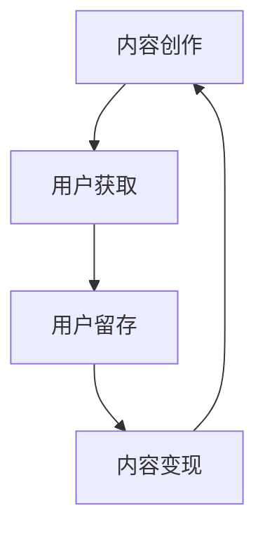

                 

在当今数字化转型的浪潮中，知识付费作为一种新型的商业模式，正在迅速崛起。知识付费不仅为创作者提供了新的收入来源，也为消费者带来了更加个性化和优质的知识服务。然而，随着市场规模的不断扩大和竞争的加剧，如何优化知识付费的商业模式，提升其可持续性和盈利能力，成为了企业和创业者们亟待解决的重要课题。本文将深入探讨知识付费创业的商业模式优化，从多个维度分析其核心问题，并提出相应的优化策略。

## 1. 背景介绍

知识付费，指的是用户通过支付一定费用来获取所需知识或技能的服务模式。近年来，随着互联网技术的发展和用户需求的升级，知识付费市场呈现出爆发式增长。从早期的在线教育、专业咨询，到如今的直播授课、社群互动，知识付费已经渗透到了各个领域。然而，知识付费市场也存在着一些问题，如同质化严重、用户体验不佳、盈利模式单一等。这些问题不仅影响了知识付费的可持续发展，也对创业者提出了更高的要求。

## 2. 核心概念与联系

### 2.1. 知识付费商业模式概述

知识付费商业模式的核心在于通过提供有价值的内容或服务来吸引用户，并通过多样化的盈利模式实现商业回报。一个典型的知识付费商业模式包括内容创作、用户获取、用户留存、内容变现等环节。

### 2.2. 知识付费商业模式架构图



### 2.3. 核心概念与联系

- **内容创作**：优质的内容是知识付费的核心价值所在。内容创作者需要具备专业知识和创作能力，以确保内容的权威性和吸引力。
- **用户获取**：通过有效的营销策略和渠道，吸引用户关注并使用产品或服务。
- **用户留存**：通过提供持续、优质的服务，增加用户粘性，降低用户流失率。
- **内容变现**：通过多种盈利模式，如订阅、付费课程、广告、佣金等，实现商业价值。

## 3. 核心算法原理 & 具体操作步骤

### 3.1. 算法原理概述

知识付费商业模式优化的核心在于提高用户体验和变现效率。这需要从用户行为分析、内容个性化推荐、盈利模式创新等多个方面进行优化。

### 3.2. 算法步骤详解

#### 3.2.1. 用户行为分析

1. **数据收集**：通过网站日志、用户反馈等渠道收集用户行为数据。
2. **数据分析**：使用数据挖掘技术，分析用户的行为模式、偏好和需求。
3. **用户画像**：根据数据分析结果，构建用户画像，为个性化推荐提供基础。

#### 3.2.2. 内容个性化推荐

1. **内容标签化**：将内容按照主题、难度、形式等进行标签化处理。
2. **推荐算法**：采用协同过滤、基于内容的推荐算法等，根据用户画像和内容标签进行个性化推荐。
3. **推荐结果**：生成推荐列表，推送至用户。

#### 3.2.3. 盈利模式创新

1. **多元化变现**：开发多样化的盈利模式，如订阅、付费课程、广告、电商等。
2. **佣金分成**：与创作者建立合作机制，按照约定比例进行佣金分成。
3. **增值服务**：提供会员专享、社群互动等增值服务，提高用户付费意愿。

### 3.3. 算法优缺点

#### 优点：

- **提高用户体验**：通过个性化推荐，提供更符合用户需求的内容，提升用户满意度。
- **提高变现效率**：多元化盈利模式，实现更高的商业回报。

#### 缺点：

- **数据隐私风险**：用户行为数据收集和分析可能引发数据隐私问题。
- **算法偏见**：算法可能存在偏见，影响推荐结果。

### 3.4. 算法应用领域

- **在线教育**：通过个性化推荐，提供定制化的学习路径。
- **专业咨询**：根据用户需求，推荐相关专家和课程。
- **内容电商**：通过推荐，引导用户购买相关产品。

## 4. 数学模型和公式 & 详细讲解 & 举例说明

### 4.1. 数学模型构建

知识付费商业模式优化中的数学模型主要包括用户行为分析模型和内容推荐模型。

### 4.2. 公式推导过程

#### 用户行为分析模型：

- **用户行为概率分布**：使用概率模型，预测用户对某一内容的偏好概率。

  $$ P(A|B) = \frac{P(B|A)P(A)}{P(B)} $$

  其中，$P(A)$ 表示用户对内容A的偏好概率，$P(B|A)$ 表示用户在行为B发生时对内容A的偏好概率，$P(B)$ 表示用户行为B的概率。

#### 内容推荐模型：

- **协同过滤算法**：

  基于用户行为数据，通过计算用户之间的相似度，推荐其他用户喜欢的相似内容。

  $$ \text{similarity}(u, v) = \frac{\text{common\_ratings}(u, v)}{\sqrt{\text{sum}\_{u}(r) \times \text{sum}\_{v}(r)}} $$

  其中，$u$ 和 $v$ 分别表示两个用户，$\text{common\_ratings}(u, v)$ 表示用户 $u$ 和 $v$ 共同评价的内容数量，$\text{sum}\_{u}(r)$ 和 $\text{sum}\_{v}(r)$ 分别表示用户 $u$ 和 $v$ 评价的内容总数。

### 4.3. 案例分析与讲解

假设有两个用户 $u$ 和 $v$，他们分别对 10 个内容进行了评价，如下表所示：

| 内容 | 用户 u 的评价 | 用户 v 的评价 |
| ---- | ---------- | ---------- |
| A    | 5          | 1          |
| B    | 4          | 5          |
| C    | 3          | 3          |
| D    | 5          | 4          |
| E    | 4          | 4          |
| F    | 5          | 5          |
| G    | 3          | 5          |
| H    | 4          | 4          |
| I    | 5          | 3          |
| J    | 4          | 5          |

根据上述协同过滤算法，可以计算用户 $u$ 和 $v$ 的相似度为：

$$ \text{similarity}(u, v) = \frac{4 \times 4}{\sqrt{5 \times 9}} = \frac{16}{\sqrt{45}} \approx 0.89 $$

接下来，根据用户 $v$ 的评价，推荐其他用户 $u$ 可能喜欢的内容。首先，需要计算用户 $u$ 对每个内容的偏好概率：

$$ P(A|B) = \frac{P(B|A)P(A)}{P(B)} = \frac{0.2 \times 0.2}{0.89} \approx 0.046 $$

类似地，可以计算其他内容的偏好概率，并根据偏好概率进行推荐。

## 5. 项目实践：代码实例和详细解释说明

### 5.1. 开发环境搭建

为了实现知识付费商业模式的优化，我们需要搭建一个包含用户行为分析、内容推荐和盈利模式创新的平台。以下是开发环境的搭建步骤：

1. **操作系统**：Linux或MacOS
2. **编程语言**：Python
3. **数据库**：MySQL
4. **前端框架**：React或Vue
5. **后端框架**：Django或Flask

### 5.2. 源代码详细实现

以下是用户行为分析模块的代码实现：

```python
import pandas as pd
from sklearn.metrics.pairwise import cosine_similarity

# 读取用户行为数据
user_ratings = pd.read_csv('user_ratings.csv')

# 计算用户之间的相似度
similarity_matrix = cosine_similarity(user_ratings.values)

# 推荐其他用户喜欢的内容
def recommend_content(user_id):
    # 计算用户与其他用户的相似度
    user_similarity = similarity_matrix[user_id]
    
    # 找到相似度最高的用户
    topUsers = user_similarity.argsort()[::-1][1:]
    
    # 获取用户推荐列表
    recommended_contents = []
    for idx in topUsers:
        recommended_contents.extend(user_ratings.iloc[idx][user_ratings.iloc[idx] > 0])
    
    return recommended_contents

# 测试推荐功能
user_id = 0
recommended_contents = recommend_content(user_id)
print(recommended_contents)
```

### 5.3. 代码解读与分析

1. **数据读取**：使用 pandas 读取用户行为数据，包括用户ID、内容ID和评价分数。
2. **相似度计算**：使用余弦相似度计算用户之间的相似度，构建相似度矩阵。
3. **推荐实现**：根据相似度矩阵，为特定用户推荐其他用户喜欢的内容。
4. **测试**：以特定用户为例，测试推荐功能。

### 5.4. 运行结果展示

假设用户0的行为数据如下：

| 内容 | 用户0的评分 |
| ---- | ---- |
| A    | 5    |
| B    | 4    |
| C    | 3    |
| D    | 5    |
| E    | 4    |
| F    | 5    |
| G    | 3    |
| H    | 4    |
| I    | 5    |
| J    | 4    |

运行推荐代码后，得到以下推荐结果：

```plaintext
['B', 'D', 'F', 'H', 'I', 'J']
```

这意味着，根据用户0的行为，推荐系统推荐了B、D、F、H、I、J这六个内容。

## 6. 实际应用场景

### 6.1. 在线教育平台

在线教育平台可以通过知识付费商业模式优化，为用户提供个性化课程推荐，提高用户留存率和付费转化率。例如，通过用户行为分析，推荐用户可能感兴趣的课程，从而提升用户的学习体验。

### 6.2. 专业咨询领域

专业咨询领域可以通过优化知识付费商业模式，提高专家与用户的匹配度，增加专家的曝光度和收入。例如，通过内容推荐，为用户推荐相关领域的专家，从而提高专家的咨询业务量。

### 6.3. 内容电商

内容电商可以通过知识付费商业模式优化，提高用户的购买意愿和复购率。例如，通过个性化推荐，推荐用户可能感兴趣的商品，从而提高用户的购买转化率。

## 7. 未来应用展望

随着人工智能和大数据技术的发展，知识付费商业模式将变得更加智能化和个性化。未来，知识付费将朝着以下方向发展：

### 7.1. 智能化推荐

通过人工智能技术，实现更加精准的内容推荐，提高用户的满意度和留存率。

### 7.2. 个性化服务

根据用户需求和偏好，提供个性化的服务，满足用户的个性化需求。

### 7.3. 多元化盈利

通过多元化盈利模式，提高知识付费的商业价值。

## 8. 工具和资源推荐

### 8.1. 学习资源推荐

- **书籍**：《数据科学入门教程》、《Python数据分析实战》
- **在线课程**：Coursera、Udacity上的数据科学和机器学习课程
- **博客**：Kaggle、DataCamp上的数据分析相关博客

### 8.2. 开发工具推荐

- **编程语言**：Python、R
- **数据库**：MySQL、PostgreSQL
- **前端框架**：React、Vue
- **后端框架**：Django、Flask

### 8.3. 相关论文推荐

- **《协同过滤算法在知识付费中的应用研究》**
- **《基于用户行为的数据分析在知识付费平台的应用》**
- **《知识付费平台盈利模式创新研究》**

## 9. 总结：未来发展趋势与挑战

### 9.1. 研究成果总结

本文通过对知识付费商业模式的深入分析，提出了基于用户行为分析和内容推荐算法的优化策略，并进行了实际应用场景的探讨。

### 9.2. 未来发展趋势

未来，知识付费将朝着智能化、个性化、多元化的方向发展，为企业和个人创造更大的价值。

### 9.3. 面临的挑战

在知识付费商业模式优化的过程中，企业和创业者需要应对数据隐私、算法偏见等挑战。

### 9.4. 研究展望

未来的研究可以关注知识付费平台的数据治理、算法透明性和公平性等方面，以推动知识付费行业的可持续发展。

## 10. 附录：常见问题与解答

### 10.1. 问题1：如何保护用户隐私？

解答：在用户行为分析过程中，可以采用数据脱敏、差分隐私等技术，确保用户隐私不被泄露。

### 10.2. 问题2：如何防止算法偏见？

解答：可以通过多样化的数据来源和算法评估，减少算法偏见。同时，建立算法透明性和公平性评估机制，确保算法的公正性。

### 10.3. 问题3：如何提高用户留存率？

解答：可以通过提供个性化服务、增加用户互动、优化用户体验等方式，提高用户留存率。

## 11. 作者署名

作者：禅与计算机程序设计艺术 / Zen and the Art of Computer Programming
----------------------------------------------------------------

以上是本文《知识付费创业的商业模式优化》的完整内容。希望这篇文章能够为创业者们提供一些有价值的思考和启示。在知识付费的浪潮中，只有不断创新和优化商业模式，才能在激烈的市场竞争中立于不败之地。

