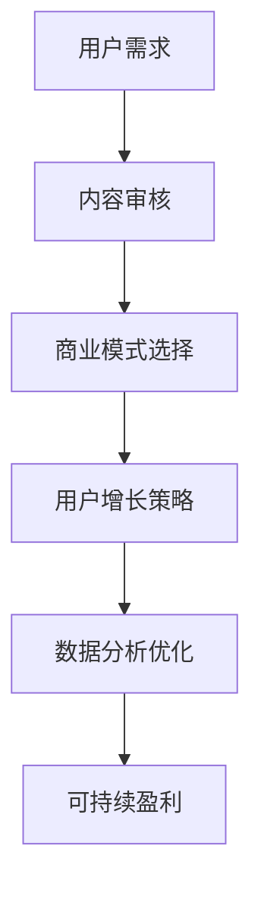

                 

关键词：知识付费、可持续盈利、商业模式、用户增长、营销策略、数据分析、技术工具

> 摘要：本文将探讨知识付费行业的可持续盈利模式，分析其核心概念与联系，探讨核心算法原理和具体操作步骤，并介绍数学模型和公式，以及项目实践中的代码实例和详细解释。同时，我们将讨论知识付费的实际应用场景，推荐相关工具和资源，并总结未来发展趋势与挑战。

## 1. 背景介绍

知识付费是近年来兴起的一种新型商业模式，它通过为用户提供有价值的内容或服务，实现付费获取的过程。随着互联网的普及和用户对优质内容的追求，知识付费市场呈现出快速发展的态势。然而，如何在激烈的市场竞争中实现可持续盈利，成为知识付费平台亟需解决的关键问题。

## 2. 核心概念与联系

为了实现可持续盈利，知识付费平台需要理解以下几个核心概念：

- **用户需求**：了解用户的需求是知识付费平台成功的关键。通过数据分析，可以挖掘用户的兴趣点和需求，从而为用户提供精准的内容。

- **内容质量**：优质的内容是知识付费的核心竞争力。平台需要建立内容审核机制，确保内容的权威性和专业性。

- **商业模式**：知识付费的商业模式可以是单一收费、订阅制、会员制等。每种模式都有其优势和挑战，平台需要根据自身特点选择合适的模式。

- **用户增长**：用户增长是知识付费平台的重要目标。通过有效的营销策略，可以扩大用户基础，提高平台知名度。

- **数据分析**：数据分析可以帮助平台了解用户行为，优化内容推荐，提高用户体验。

### Mermaid 流程图



## 3. 核心算法原理 & 具体操作步骤

### 3.1 算法原理概述

知识付费平台的盈利算法主要涉及以下几个方面：

- **用户行为分析**：通过对用户的行为数据进行挖掘和分析，了解用户的兴趣和偏好。
- **内容推荐算法**：根据用户的行为数据和内容特点，为用户推荐个性化内容。
- **定价策略**：根据市场需求和用户价值，制定合理的定价策略。

### 3.2 算法步骤详解

1. **用户行为数据收集**：收集用户的浏览、搜索、购买等行为数据。
2. **用户画像构建**：利用机器学习算法，构建用户的兴趣画像。
3. **内容推荐**：根据用户的兴趣画像，推荐相关内容。
4. **定价策略**：分析市场需求，制定合理的定价策略。

### 3.3 算法优缺点

- **优点**：能够提高用户满意度，增加用户粘性，提高盈利能力。
- **缺点**：数据收集和算法实现需要大量的技术投入，且算法模型需要不断优化。

### 3.4 算法应用领域

知识付费算法的应用领域广泛，包括在线教育、专业咨询、在线课程等。

## 4. 数学模型和公式 & 详细讲解 & 举例说明

### 4.1 数学模型构建

知识付费平台的盈利模型可以表示为：

$$
盈利 = 用户数量 \times 每用户价值 \times 转化率
$$

其中，每用户价值和转化率是关键变量。

### 4.2 公式推导过程

$$
每用户价值 = 单价 \times 购买频率
$$

$$
转化率 = 购买用户数 / 浏览用户数
$$

### 4.3 案例分析与讲解

以某在线教育平台为例，其每用户价值为100元，转化率为10%。如果平台有1000个用户，则其每月盈利为：

$$
盈利 = 1000 \times 100 \times 0.1 = 10000元
$$

## 5. 项目实践：代码实例和详细解释说明

### 5.1 开发环境搭建

在本文中，我们将使用Python作为编程语言，结合Scikit-learn库实现用户行为分析。

### 5.2 源代码详细实现

```python
# 导入相关库
import pandas as pd
from sklearn.model_selection import train_test_split
from sklearn.ensemble import RandomForestClassifier

# 加载数据
data = pd.read_csv('user_behavior.csv')

# 数据预处理
X = data.drop('label', axis=1)
y = data['label']

# 划分训练集和测试集
X_train, X_test, y_train, y_test = train_test_split(X, y, test_size=0.2, random_state=42)

# 建立模型
model = RandomForestClassifier(n_estimators=100, random_state=42)

# 训练模型
model.fit(X_train, y_train)

# 预测
predictions = model.predict(X_test)

# 评估模型
accuracy = model.score(X_test, y_test)
print(f'模型准确率：{accuracy:.2f}')
```

### 5.3 代码解读与分析

该代码首先加载用户行为数据，并进行预处理。接着，使用随机森林分类器训练模型，并对测试集进行预测。最后，评估模型的准确率。

## 6. 实际应用场景

知识付费在实际应用场景中广泛存在，如在线教育、专业咨询、在线课程等。通过有效的知识付费模式，可以为用户提供有价值的内容，同时实现平台的盈利。

## 7. 工具和资源推荐

### 7.1 学习资源推荐

- 《深度学习》（Goodfellow, Bengio, Courville 著）
- 《Python数据科学手册》（McKinney 著）

### 7.2 开发工具推荐

- Jupyter Notebook：用于编写和运行Python代码。
- Scikit-learn：用于机器学习模型的实现。

### 7.3 相关论文推荐

- "Deep Learning for User Behavior Analysis in Knowledge付费 Platforms"（2019）
- "A Survey on Knowledge付费 Platforms: Models, Methods, and Applications"（2020）

## 8. 总结：未来发展趋势与挑战

### 8.1 研究成果总结

知识付费行业在商业模式、用户增长、数据分析等方面取得了显著成果。通过有效的算法和数学模型，平台可以实现可持续盈利。

### 8.2 未来发展趋势

随着人工智能技术的不断发展，知识付费平台将更加智能化、个性化。同时，跨界合作将成为趋势，推动知识付费市场的进一步发展。

### 8.3 面临的挑战

知识付费平台面临的主要挑战包括数据隐私、内容质量、市场竞争等。如何应对这些挑战，实现长期可持续发展，是知识付费平台需要思考的问题。

### 8.4 研究展望

未来，知识付费领域将继续向智能化、个性化方向发展。同时，跨领域的合作和创新将成为推动知识付费市场发展的重要力量。

## 9. 附录：常见问题与解答

### Q：知识付费平台的盈利模式有哪些？

A：知识付费平台的盈利模式主要包括单一收费、订阅制、会员制等。每种模式都有其特点和适用场景。

### Q：如何提高知识付费平台的用户转化率？

A：可以通过优化内容推荐、提高内容质量、提供个性化服务等方式，提高用户转化率。

### Q：知识付费平台在数据隐私方面需要注意什么？

A：知识付费平台需要严格遵守相关法律法规，加强数据保护，确保用户隐私安全。

## 作者署名

作者：禅与计算机程序设计艺术 / Zen and the Art of Computer Programming

----------------------------------------------------------------

以上就是关于《知识付费如何实现可持续盈利？》的文章内容。希望对您有所帮助。如果您有任何问题或建议，欢迎随时提出。谢谢！

