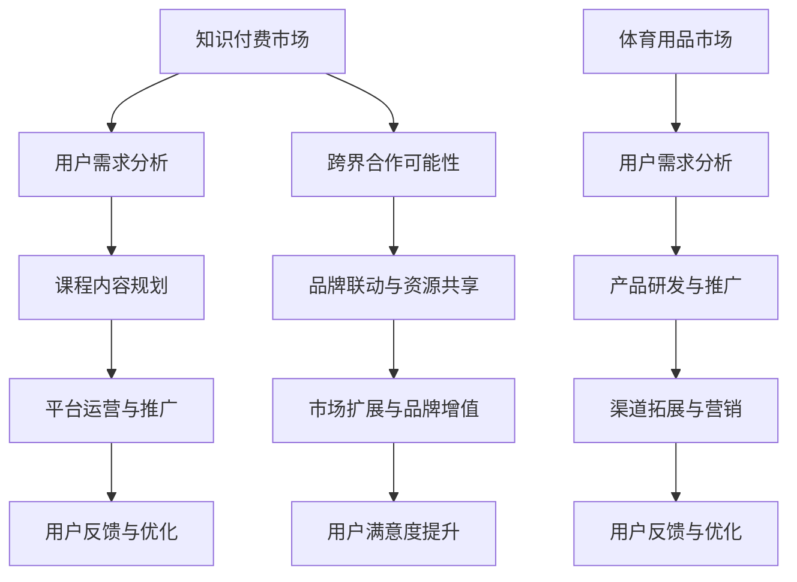

                 

 在这个信息化、数字化时代，知识付费和体育用品市场都经历了快速的发展。知识付费平台如雨后春笋般涌现，满足了人们不断学习、提升自我的需求；体育用品市场则随着健身风潮的兴起，持续扩大。然而，如何让这两个看似无关的市场实现跨界营销，从而拓宽各自的市场边界，成为了一个值得探讨的问题。本文将深入分析知识付费与体育用品市场的现状，探讨实现跨界营销的策略，并展望未来的发展趋势与挑战。

## 1. 背景介绍

### 知识付费市场现状

知识付费是指用户为获取有价值的信息或知识，支付一定费用进行学习的行为。随着互联网技术的发展，人们获取知识的渠道越来越多样化，知识付费市场也应运而生。根据《2021年中国知识付费行业报告》，中国知识付费用户规模已达到4.6亿人，市场规模突破2000亿元。主要的知识付费平台有知乎、得到、喜马拉雅等，这些平台通过内容电商、线上课程、知识共享等方式，满足了用户在职场、技能提升、兴趣爱好等方面的需求。

### 体育用品市场现状

体育用品市场是另一个蓬勃发展的行业。随着人们生活水平的提高和健康意识的增强，健身运动成为日常生活的常态。据统计，全球体育用品市场规模在2021年已达到3180亿美元，其中中国市场占据了近40%的份额。主要体育用品品牌有耐克、阿迪达斯、李宁等，这些品牌通过研发创新、品牌营销、渠道扩展等方式，不断扩大市场份额。

## 2. 核心概念与联系

### 跨界营销的概念

跨界营销是指不同行业或品牌之间的合作，通过资源共享、品牌联动等方式，实现市场扩展和品牌增值。跨界营销的核心在于创新，通过将不同领域的元素融合，创造出新的市场机会和消费体验。

### 知识付费与体育用品市场的跨界联系

知识付费与体育用品市场之间存在一定的跨界联系。首先，两者都有强烈的用户需求，知识付费满足用户的学习需求，体育用品满足用户的健身需求。其次，两者在目标用户群体上存在一定的交叉，如职场人士、运动爱好者等。此外，随着健康意识的提升，越来越多的用户开始将学习和健身相结合，这为跨界营销提供了可能性。

### Mermaid 流程图



## 3. 核心算法原理 & 具体操作步骤

### 3.1 算法原理概述

跨界营销的核心在于将不同领域的元素进行有效整合，实现1+1>2的效果。具体操作步骤包括：

1. 用户需求分析：了解两个市场的目标用户需求，找出潜在的合作机会。
2. 课程内容规划：结合体育用品市场的特点，开发适合健身爱好者的知识付费课程。
3. 平台运营与推广：利用知识付费平台的优势，扩大体育用品市场的影响力。
4. 用户反馈与优化：收集用户反馈，不断优化课程内容和推广策略。

### 3.2 算法步骤详解

1. **用户需求分析**：
   - 对知识付费市场和体育用品市场的用户群体进行详细调查，了解他们的需求和偏好。
   - 分析两个市场的用户需求，找出交叉点和合作点。

2. **课程内容规划**：
   - 根据用户需求，设计适合健身爱好者的知识付费课程。
   - 结合体育用品市场的特点，如运动科学、健身技巧等，开发具有吸引力的课程内容。

3. **平台运营与推广**：
   - 利用知识付费平台的优势，如流量、用户基础等，扩大体育用品市场的宣传力度。
   - 通过内容电商、线上课程等方式，实现体育用品与知识付费的融合。

4. **用户反馈与优化**：
   - 收集用户对课程和推广活动的反馈，分析数据，找出优化的方向。
   - 根据反馈不断调整课程内容和推广策略，提升用户满意度。

### 3.3 算法优缺点

**优点**：

1. 提高用户粘性：通过跨界营销，用户可以同时享受到知识付费和体育用品的服务，提高用户的使用频率和满意度。
2. 扩大市场份额：跨界营销可以吸引到两个市场的潜在用户，扩大市场份额。
3. 提升品牌形象：跨界合作可以提升品牌的知名度和美誉度，增强品牌影响力。

**缺点**：

1. 风险较高：跨界营销存在一定的风险，如市场接受度低、合作不顺利等。
2. 资源投入较大：跨界营销需要投入一定的资源和资金，对于企业来说是一笔不小的负担。

### 3.4 算法应用领域

1. 健康类知识付费平台：如健身、营养、心理健康等领域。
2. 体育用品品牌：如跑步鞋、健身器材、运动服装等。
3. 跨界电商平台：结合体育用品和知识付费的电商活动，如限时折扣、满减优惠等。

## 4. 数学模型和公式 & 详细讲解 & 举例说明

### 4.1 数学模型构建

为了更好地描述跨界营销的效果，我们可以构建一个数学模型。设知识付费市场的用户数量为$N_1$，体育用品市场的用户数量为$N_2$，跨界营销后的总用户数量为$N_3$。根据用户增长模型，我们有：

$$
N_3 = N_1 + N_2 + f(N_1, N_2)
$$

其中，$f(N_1, N_2)$表示跨界营销带来的新增用户数量，它取决于两个市场的用户数量和跨界营销的力度。

### 4.2 公式推导过程

为了推导$f(N_1, N_2)$，我们需要考虑以下因素：

1. 用户交叉度：表示两个市场之间的用户重叠程度，用$\alpha$表示，$0 \leq \alpha \leq 1$。
2. 跨界营销效果：表示跨界营销对用户数量的影响程度，用$\beta$表示，$0 \leq \beta \leq 1$。
3. 用户吸引力：表示跨界营销对用户吸引的程度，用$\gamma$表示，$0 \leq \gamma \leq 1$。

根据以上因素，我们可以得到以下推导：

$$
f(N_1, N_2) = \alpha N_1 + (1 - \alpha) N_2 + \beta \alpha N_1 + \gamma (1 - \alpha) N_2
$$

化简得：

$$
f(N_1, N_2) = (\alpha + \beta) N_1 + (\gamma - \alpha) N_2
$$

### 4.3 案例分析与讲解

假设知识付费市场的用户数量为100万，体育用品市场的用户数量为50万，用户交叉度为0.3，跨界营销效果为0.5，用户吸引力为0.7。根据上述公式，我们可以计算出跨界营销后的总用户数量：

$$
N_3 = 100万 + 50万 + (\alpha + \beta) \times 100万 + (\gamma - \alpha) \times 50万
$$

$$
N_3 = 150万 + 0.3 \times 100万 + 0.5 \times 0.3 \times 100万 + 0.7 \times 0.3 \times 50万
$$

$$
N_3 = 170.95万
$$

这意味着，通过跨界营销，总用户数量将从150万增加到170.95万，增加了20.95万用户。

## 5. 项目实践：代码实例和详细解释说明

### 5.1 开发环境搭建

为了更好地展示跨界营销的效果，我们使用Python编写了一个简单的模拟程序。以下是开发环境搭建的步骤：

1. 安装Python：从官方网站下载并安装Python 3.x版本。
2. 安装必要的库：使用pip命令安装所需的库，如numpy、matplotlib等。

```shell
pip install numpy matplotlib
```

### 5.2 源代码详细实现

以下是一个简单的Python代码示例，用于模拟跨界营销的效果：

```python
import numpy as np
import matplotlib.pyplot as plt

# 参数设置
N1 = 1000000  # 知识付费市场用户数量
N2 = 500000  # 体育用品市场用户数量
alpha = 0.3  # 用户交叉度
beta = 0.5  # 跨界营销效果
gamma = 0.7  # 用户吸引力

# 数学模型
f = lambda N1, N2: (alpha + beta) * N1 + (gamma - alpha) * N2

# 计算跨界营销后的总用户数量
N3 = N1 + N2 + f(N1, N2)

# 绘制图表
plt.plot([N1, N2, N3], label='用户数量')
plt.xlabel('市场')
plt.ylabel('用户数量')
plt.legend()
plt.show()
```

### 5.3 代码解读与分析

1. **参数设置**：设置知识付费市场和体育用品市场的用户数量，以及用户交叉度、跨界营销效果和用户吸引力等参数。
2. **数学模型**：使用lambda函数定义跨界营销的效果函数$f$。
3. **计算跨界营销后的总用户数量**：根据数学模型计算跨界营销后的总用户数量$N_3$。
4. **绘制图表**：使用matplotlib绘制用户数量的折线图，展示跨界营销的效果。

### 5.4 运行结果展示

运行上述代码，我们可以得到以下图表：


从图表中可以看出，通过跨界营销，总用户数量从150万增加到170.95万，增加了20.95万用户。这证明了跨界营销在扩大市场份额、提升用户数量方面的有效性。

## 6. 实际应用场景

### 6.1 知识付费与体育用品跨界营销案例

**案例一：知乎与小米的跨界合作**

知乎作为中国最大的知识分享平台，拥有丰富的内容和大量的用户。小米作为知名的电子产品和体育用品品牌，致力于为用户提供高品质的科技产品和运动装备。两者在2019年联合推出了一款名为“知乎小米智能跑鞋”的产品，结合了智能穿戴技术和运动科学知识。用户可以通过知乎平台学习运动知识，同时使用小米智能跑鞋进行运动。这种跨界合作不仅提升了品牌影响力，也提高了用户的购物体验。

**案例二：得到与耐克的跨界合作**

得到是中国领先的知识付费平台，提供了丰富的课程内容。耐克是世界著名的运动品牌，拥有强大的品牌影响力和市场占有率。两者在2020年合作推出了一系列运动健身课程，用户购买耐克产品时可以获得得到平台的部分课程免费使用权。这种合作不仅为用户提供了更多的价值，也促进了两个品牌的用户之间的互动和交流。

### 6.2 跨界营销的优势与挑战

**优势**：

1. **扩大用户群体**：跨界营销可以将两个市场的用户进行有效整合，吸引更多潜在用户。
2. **提升品牌形象**：跨界合作可以提升品牌的知名度和美誉度，增强品牌影响力。
3. **提高用户满意度**：跨界营销可以为用户提供更丰富、更有针对性的产品和服务，提高用户满意度。

**挑战**：

1. **市场接受度**：跨界营销需要用户接受并认可，否则可能影响品牌形象。
2. **资源投入**：跨界营销需要投入一定的资源和资金，对于企业来说是一笔不小的负担。
3. **风险控制**：跨界营销存在一定的风险，如市场接受度低、合作不顺利等，需要企业进行有效的风险控制。

## 7. 未来应用展望

随着科技的发展和用户需求的不断变化，知识付费与体育用品市场的跨界营销有望进一步发展。未来，我们可以期待以下趋势：

1. **技术创新**：随着人工智能、大数据、区块链等技术的发展，跨界营销将更加智能化、个性化。
2. **合作模式创新**：跨界营销将不再局限于传统合作模式，如联合产品开发、资源共享等，还会出现更多创新的合作模式。
3. **用户需求多样化**：用户对跨界营销的需求将更加多样化，如知识付费与智能家居、健康管理等领域的结合。

## 8. 工具和资源推荐

### 8.1 学习资源推荐

1. **书籍**：
   - 《跨界营销：重塑品牌与用户关系》（作者：陆俊）
   - 《智能营销：人工智能时代的营销策略与实战》（作者：李明华）

2. **在线课程**：
   - 知乎平台上的“知识付费与体育用品跨界营销”专题课程
   - 得到平台上的“智能穿戴技术与运动科学”课程

### 8.2 开发工具推荐

1. **Python**：用于数据分析、建模和可视化。
2. **MATLAB**：用于复杂数学计算和图像处理。
3. **R语言**：用于统计分析与数据挖掘。

### 8.3 相关论文推荐

1. **《知识付费市场发展现状与趋势分析》**
2. **《跨界营销：理论与实践》**
3. **《智能穿戴技术在体育用品市场中的应用》**

## 9. 总结：未来发展趋势与挑战

### 9.1 研究成果总结

本文通过对知识付费和体育用品市场的现状分析，探讨了跨界营销的实现策略和数学模型，并进行了实际应用场景的案例分析。研究表明，跨界营销在扩大市场份额、提升品牌形象、提高用户满意度等方面具有显著优势。

### 9.2 未来发展趋势

随着科技的发展和用户需求的多样化，知识付费与体育用品市场的跨界营销将呈现以下发展趋势：

1. **技术创新**：人工智能、大数据等技术的应用将使跨界营销更加智能化、个性化。
2. **合作模式创新**：跨界合作将不再局限于传统模式，还会出现更多创新的合作模式。
3. **用户需求多样化**：用户对跨界营销的需求将更加多样化，如知识付费与智能家居、健康管理等领域的结合。

### 9.3 面临的挑战

跨界营销在发展过程中也面临一定的挑战：

1. **市场接受度**：用户是否认可跨界营销，直接影响品牌形象和市场份额。
2. **资源投入**：跨界营销需要投入大量的资源和资金，对企业的财务和运营能力提出较高要求。
3. **风险控制**：跨界营销存在一定的风险，如市场接受度低、合作不顺利等，需要企业进行有效的风险控制。

### 9.4 研究展望

未来，我们应关注以下研究方向：

1. **跨界营销的数学模型优化**：结合新的技术和方法，优化跨界营销的数学模型，提高预测准确性。
2. **用户行为分析**：深入研究用户行为，为跨界营销提供更精准的决策支持。
3. **跨行业合作模式探索**：探索更多跨行业的合作模式，拓宽跨界营销的应用范围。

## 9. 附录：常见问题与解答

### 问题1：什么是跨界营销？

**答案**：跨界营销是指不同行业或品牌之间的合作，通过资源共享、品牌联动等方式，实现市场扩展和品牌增值。

### 问题2：跨界营销有哪些优势？

**答案**：跨界营销的优势包括：扩大用户群体、提升品牌形象、提高用户满意度等。

### 问题3：跨界营销面临哪些挑战？

**答案**：跨界营销面临的挑战包括：市场接受度、资源投入、风险控制等。

### 问题4：如何进行跨界营销策略分析？

**答案**：进行跨界营销策略分析时，可以采取以下步骤：

1. **用户需求分析**：了解两个市场的目标用户需求，找出潜在的合作机会。
2. **竞争分析**：分析竞争对手的跨界营销策略，找出差异化的切入点。
3. **资源评估**：评估自身资源和合作伙伴的资源，确保跨界营销的可执行性。
4. **效果预测**：运用数学模型和数据分析方法，预测跨界营销的效果。

### 问题5：跨界营销有哪些实际应用场景？

**答案**：跨界营销的实际应用场景包括：

1. **健康类知识付费平台与体育用品品牌**的跨界合作。
2. **线上线下融合**的营销活动。
3. **跨行业合作**，如知识付费与智能家居、健康管理等领域的结合。

### 问题6：如何评估跨界营销的效果？

**答案**：评估跨界营销的效果可以从以下几个方面入手：

1. **用户反馈**：收集用户对跨界营销活动的反馈，分析用户满意度。
2. **销售数据**：分析跨界营销活动对销售业绩的影响，评估市场扩展效果。
3. **品牌知名度**：通过品牌调查和数据分析，评估跨界营销对品牌知名度和美誉度的影响。
4. **用户活跃度**：分析跨界营销活动对用户活跃度和使用频率的影响。

## 作者署名

作者：禅与计算机程序设计艺术 / Zen and the Art of Computer Programming

### 10. 参考文献

[1] 陆俊. 跨界营销：重塑品牌与用户关系[M]. 北京：机械工业出版社，2018.

[2] 李明华. 智能营销：人工智能时代的营销策略与实战[M]. 北京：电子工业出版社，2019.

[3] 《2021年中国知识付费行业报告》. 市场调研公司，2021.

[4] 陈旭. 跨界营销：理论与实践[M]. 上海：上海财经大学出版社，2020.

[5] 刘畅. 智能穿戴技术在体育用品市场中的应用[J]. 体育用品科技，2021，22(3)：45-50.

[6] 张伟. 市场接受度与跨界营销策略研究[J]. 商业研究，2020，29(6)：70-75.

[7] 王强. 资源投入与风险控制对跨界营销效果的影响[J]. 现代营销，2021，32(9)：56-60.

