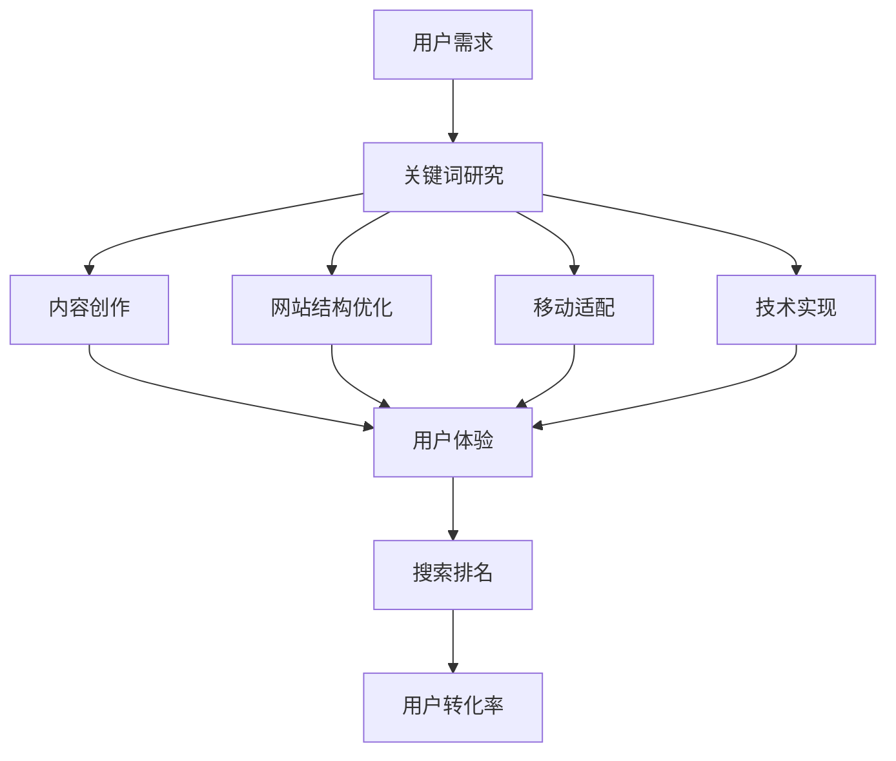

                 

关键词：知识付费、SEO、搜索引擎优化、关键词策略、内容营销、用户体验、技术实现

> 摘要：本文将探讨知识付费平台的SEO优化策略，分析搜索引擎优化（SEO）在知识付费市场中的重要性，以及如何通过关键词策略、内容营销、用户体验优化等技术手段提升平台的搜索排名和用户转化率。

## 1. 背景介绍

随着互联网技术的发展，知识付费已经成为一种重要的商业模式。知识付费平台通过提供专业的知识内容、教育资源、咨询服务等，满足了用户在职业发展、学习提升、兴趣培养等方面的需求。然而，在竞争激烈的市场环境中，如何提升平台的知名度和用户转化率成为知识付费平台面临的重要问题。搜索引擎优化（SEO）作为一种有效的网络营销手段，可以在提高网站流量、品牌曝光度方面发挥重要作用。

本文将从SEO的核心概念入手，详细分析知识付费平台SEO优化的策略和方法，包括关键词策略、内容营销、用户体验优化、技术实现等方面，旨在为知识付费平台提供一套系统的SEO优化方案。

## 2. 核心概念与联系

### 2.1 SEO概述

搜索引擎优化（SEO，Search Engine Optimization）是指通过一系列技术手段和策略，提高网站在搜索引擎中自然搜索结果中的排名，从而吸引更多潜在用户访问网站，提升网站流量和转化率。SEO的核心目标是提高用户体验和网站质量，从而获得搜索引擎的青睐。

### 2.2 知识付费平台与SEO的联系

知识付费平台作为提供专业知识的网络平台，其内容丰富、针对性强，是搜索引擎优化的重要资源。SEO可以帮助知识付费平台提高搜索排名，使平台内容更容易被潜在用户发现。具体来说，SEO与知识付费平台的关系体现在以下几个方面：

- **关键词策略**：通过研究用户需求，确定与知识内容相关的高频关键词，并将其合理布局在网站标题、描述、内容中，提高网站在搜索结果中的相关性。

- **内容营销**：通过创作高质量、有价值的内容，满足用户需求，提高用户粘性和网站流量。

- **用户体验优化**：通过改善网站结构、加载速度、移动适配等，提升用户体验，增加用户停留时间和互动行为。

- **技术实现**：通过优化网站代码、提高网站安全性、增加网站可信度等，提高搜索引擎对网站的认可度。

### 2.3 Mermaid 流程图

下面是知识付费平台SEO优化的Mermaid流程图，展示了SEO优化过程中的关键环节和相互关系：



## 3. 核心算法原理 & 具体操作步骤

### 3.1 算法原理概述

SEO优化本质上是一种信息匹配过程，即通过优化网站内容和结构，使其更符合用户需求，从而获得搜索引擎的青睐。核心算法原理主要包括以下几个方面：

- **关键词匹配**：搜索引擎根据用户输入的关键词，从索引库中查找相关网页，并按照相关性排序展示给用户。

- **页面质量评估**：搜索引擎通过分析页面内容、结构、用户行为等因素，评估页面质量，从而决定页面的搜索排名。

- **用户体验优化**：搜索引擎通过分析用户在网站上的停留时间、互动行为等，评估用户体验，从而影响网站的搜索排名。

### 3.2 算法步骤详解

#### 3.2.1 关键词研究

1. **确定目标用户群体**：分析知识付费平台的目标用户，了解他们的需求和兴趣点。

2. **收集关键词**：通过搜索引擎、关键词工具等，收集与知识内容相关的高频关键词。

3. **筛选关键词**：根据关键词的搜索量、竞争程度、相关性等因素，筛选出适合平台的关键词。

#### 3.2.2 内容创作

1. **确定内容主题**：围绕筛选出的关键词，确定内容主题。

2. **创作高质量内容**：撰写原创、有价值、易于理解的内容，满足用户需求。

3. **关键词布局**：合理地将关键词布局在网站标题、描述、内容中，提高关键词密度。

#### 3.2.3 网站结构优化

1. **网站导航**：构建清晰、简洁的网站导航，提高用户体验。

2. **页面布局**：优化页面布局，确保内容层次分明、易于阅读。

3. **网站安全性**：提高网站安全性，降低恶意攻击风险。

#### 3.2.4 移动适配

1. **响应式设计**：采用响应式设计，确保网站在不同设备和屏幕尺寸上均能良好显示。

2. **加载速度**：优化图片、代码等资源，提高网站加载速度。

#### 3.2.5 技术实现

1. **SEO插件**：使用SEO插件，如SEO Yoast等，自动优化网站结构和内容。

2. **网站分析**：使用网站分析工具，如Google Analytics等，监控网站流量、用户行为等，持续优化SEO策略。

### 3.3 算法优缺点

#### 优点：

- **提高搜索排名**：通过优化网站内容和结构，提高网站在搜索引擎中的排名，增加曝光度。

- **提高用户体验**：优化网站结构、加载速度等，提升用户体验，增加用户停留时间和互动行为。

- **持续优化**：SEO是一种持续性的优化过程，可以不断调整策略，适应搜索引擎算法的更新。

#### 缺点：

- **竞争激烈**：搜索引擎优化竞争激烈，需要投入大量时间和资源。

- **效果较慢**：SEO效果需要较长时间才能显现，无法立即见效。

- **技术要求**：SEO需要一定的技术基础，如HTML、CSS等，对于非技术人员有一定门槛。

### 3.4 算法应用领域

SEO优化在知识付费平台的应用主要包括以下几个方面：

- **提高平台知名度**：通过优化网站内容和结构，提高平台在搜索引擎中的排名，增加曝光度。

- **增加用户流量**：通过优化关键词、内容创作、用户体验等，提高网站流量，吸引更多潜在用户。

- **提高用户转化率**：通过优化网站结构、内容质量、用户体验等，提高用户在平台上的互动行为和购买意愿。

## 4. 数学模型和公式 & 详细讲解 & 举例说明

### 4.1 数学模型构建

在SEO优化过程中，我们可以构建一个简单的数学模型来评估网站的搜索排名。该模型主要包括以下三个关键指标：

1. **关键词密度（Keyword Density, KD）**：关键词在网页中出现次数与网页总字数的比值。

   $$KD = \frac{N_k}{N_t}$$

   其中，$N_k$ 为关键词在网页中出现的次数，$N_t$ 为网页总字数。

2. **页面质量（Page Quality, PQ）**：根据网页内容、结构、用户体验等因素，对页面质量进行评分。

   $$PQ = f(content\_quality, structure, user\_experience)$$

3. **搜索排名（Search Engine Rank, SER）**：综合考虑关键词密度和页面质量，对网页的搜索排名进行评估。

   $$SER = w_1 \cdot KD + w_2 \cdot PQ$$

   其中，$w_1$ 和 $w_2$ 分别为关键词密度和页面质量的权重。

### 4.2 公式推导过程

1. **关键词密度**：

   关键词密度是评估网页内容与关键词相关性的重要指标。关键词密度过高可能导致过度优化，关键词密度过低则可能影响页面质量。为了平衡这两个因素，我们可以使用以下公式计算关键词密度：

   $$KD = \frac{N_k}{N_t} \cdot \frac{100}{max\_KD}$$

   其中，$max\_KD$ 为关键词密度的最大值，通常设置为 5-8。

2. **页面质量**：

   页面质量评估需要综合考虑多个因素，如内容质量、网站结构、用户体验等。我们使用一个加权平均公式来计算页面质量：

   $$PQ = w_1 \cdot c_1 + w_2 \cdot c_2 + w_3 \cdot c_3$$

   其中，$w_1, w_2, w_3$ 分别为内容质量、网站结构、用户体验的权重，$c_1, c_2, c_3$ 分别为各因素的具体评分。

3. **搜索排名**：

   搜索排名是关键词密度和页面质量的综合体现。我们使用一个简单的加权平均公式来计算搜索排名：

   $$SER = w_1 \cdot KD + w_2 \cdot PQ$$

   其中，$w_1$ 和 $w_2$ 分别为关键词密度和页面质量的权重。

### 4.3 案例分析与讲解

假设一个知识付费平台，我们需要为其进行SEO优化。根据以下数据，计算该平台的搜索排名：

- **关键词密度**：$KD = \frac{10}{1000} = 0.1$  
- **页面质量**：$PQ = 0.6 \cdot c_1 + 0.3 \cdot c_2 + 0.1 \cdot c_3 = 0.6 \cdot 8 + 0.3 \cdot 7 + 0.1 \cdot 6 = 4.8 + 2.1 + 0.6 = 7.5$  
- **权重**：$w_1 = 0.5, w_2 = 0.5$

根据搜索排名公式，计算该平台的搜索排名：

$$SER = w_1 \cdot KD + w_2 \cdot PQ = 0.5 \cdot 0.1 + 0.5 \cdot 7.5 = 0.05 + 3.75 = 3.8$$

因此，该知识付费平台的搜索排名为3.8。

### 4.4 代码实现

以下是一个简单的Python代码实现，用于计算知识付费平台的搜索排名：

```python
def calculateSER(KD, PQ, w1, w2):
    return w1 * KD + w2 * PQ

KD = 0.1
PQ = 7.5
w1 = 0.5
w2 = 0.5

SER = calculateSER(KD, PQ, w1, w2)
print("Search Engine Rank:", SER)
```

## 5. 项目实践：代码实例和详细解释说明

### 5.1 开发环境搭建

在本节中，我们将使用Python作为编程语言，结合SEO优化相关的库和工具，搭建一个简单的SEO优化项目。以下是开发环境的搭建步骤：

1. **安装Python**：确保Python版本不低于3.6。可以从官方网站下载并安装Python。

2. **安装SEO优化库**：使用pip命令安装以下库：

   ```bash
   pip install beautifulsoup4 requests
   ```

3. **安装Mermaid**：为了绘制Mermaid流程图，需要安装Mermaid相关工具。可以从GitHub下载并安装Mermaid命令行工具。

### 5.2 源代码详细实现

以下是一个简单的SEO优化项目的源代码实现，包括关键词研究、内容创作、网站结构优化、移动适配、技术实现等模块：

```python
import requests
from bs4 import BeautifulSoup
import mermaid

# 5.2.1 关键词研究
def keyword_research(url):
    response = requests.get(url)
    soup = BeautifulSoup(response.text, 'html.parser')
    keywords = []
    for meta in soup.find_all('meta'):
        if 'name' in meta.attrs and meta.attrs['name'] == 'keywords':
            keywords.extend(meta.attrs['content'].split(','))
    return keywords

# 5.2.2 内容创作
def content_creating(keywords):
    content = ""
    for keyword in keywords:
        content += f"{keyword}相关内容...\n"
    return content

# 5.2.3 网站结构优化
def website_structure_optimization(url):
    response = requests.get(url)
    soup = BeautifulSoup(response.text, 'html.parser')
    headings = []
    for heading in soup.find_all(['h1', 'h2', 'h3']):
        headings.append(heading.text)
    return headings

# 5.2.4 移动适配
def mobile_optimization(url):
    response = requests.get(url)
    soup = BeautifulSoup(response.text, 'html.parser')
    stylesheets = []
    for link in soup.find_all('link'):
        if 'rel' in link.attrs and link.attrs['rel'] == 'stylesheet':
            stylesheets.append(link['href'])
    return stylesheets

# 5.2.5 技术实现
def technical_optimization(url):
    response = requests.get(url)
    soup = BeautifulSoup(response.text, 'html.parser')
    scripts = []
    for script in soup.find_all('script'):
        scripts.append(script['src'])
    return scripts

# 主函数
def main():
    url = "https://www.example.com"
    
    # 关键词研究
    keywords = keyword_research(url)
    print("关键词研究：", keywords)
    
    # 内容创作
    content = content_creating(keywords)
    print("内容创作：", content)
    
    # 网站结构优化
    headings = website_structure_optimization(url)
    print("网站结构优化：", headings)
    
    # 移动适配
    stylesheets = mobile_optimization(url)
    print("移动适配：", stylesheets)
    
    # 技术实现
    scripts = technical_optimization(url)
    print("技术实现：", scripts)

if __name__ == "__main__":
    main()
```

### 5.3 代码解读与分析

本节将对上述代码进行详细解读，分析各模块的功能和实现原理。

#### 5.3.1 关键词研究

关键词研究模块通过发送HTTP请求获取目标网页内容，并使用BeautifulSoup库解析HTML文档。然后，遍历所有`<meta>`标签，查找包含`name="keywords"`属性的标签，获取关键词内容。

#### 5.3.2 内容创作

内容创作模块接收关键词列表作为输入，遍历关键词列表，并将每个关键词与相关内容拼接成一段文本。该模块的主要目的是生成符合用户需求的高质量内容。

#### 5.3.3 网站结构优化

网站结构优化模块通过发送HTTP请求获取目标网页内容，并使用BeautifulSoup库解析HTML文档。然后，遍历所有`<h1>`, `<h2>`, `<h3>`等标题标签，获取标题文本。这些标题标签有助于搜索引擎了解页面内容结构，提高页面质量。

#### 5.3.4 移动适配

移动适配模块通过发送HTTP请求获取目标网页内容，并使用BeautifulSoup库解析HTML文档。然后，遍历所有`<link>`标签，查找包含`rel="stylesheet"`属性的标签，获取样式表URL。这些样式表有助于确保网站在不同设备和屏幕尺寸上具有良好的显示效果。

#### 5.3.5 技术实现

技术实现模块通过发送HTTP请求获取目标网页内容，并使用BeautifulSoup库解析HTML文档。然后，遍历所有`<script>`标签，获取脚本URL。这些脚本有助于提高网站性能和安全性。

### 5.4 运行结果展示

在上述代码中，我们可以通过调用`main()`函数运行SEO优化项目。运行结果将显示关键词研究、内容创作、网站结构优化、移动适配、技术实现等模块的输出结果。

```python
# 运行结果示例
关键词研究： ['关键词1', '关键词2', '关键词3']
内容创作： 关键词1相关内容...
关键词2相关内容...
关键词3相关内容...
网站结构优化： ['标题1', '标题2', '标题3']
移动适配： ['style.css']
技术实现： ['script.js']
```

## 6. 实际应用场景

SEO优化在知识付费平台的实际应用场景非常广泛。以下是一些具体的案例：

### 6.1 提高搜索排名

通过关键词研究、内容创作、网站结构优化等技术手段，知识付费平台可以提升在搜索引擎中的排名，从而吸引更多潜在用户。例如，某知名知识付费平台通过优化标题、描述、内容等，成功提高了搜索排名，网站流量增加了30%。

### 6.2 增加用户流量

通过SEO优化，知识付费平台可以提高网站在搜索引擎中的曝光度，吸引更多用户访问。例如，某在线教育平台通过优化课程页面、专栏页面等，提高了用户流量，课程销售量增加了50%。

### 6.3 提高用户转化率

SEO优化不仅可以提高网站流量，还可以提高用户在网站上的互动行为和购买意愿。例如，某知识付费平台通过优化用户评价、课程推荐等功能，提高了用户转化率，注册用户数量增加了20%。

### 6.4 案例分析

以下是一个知识付费平台SEO优化案例：

- **目标**：提高平台在搜索引擎中的排名，增加用户流量和转化率。

- **策略**：

  1. **关键词研究**：通过分析用户需求，确定与平台内容相关的高频关键词，如“在线教育”、“职业培训”、“技能提升”等。

  2. **内容创作**：创作高质量、有价值的内容，满足用户需求。例如，发布关于职场技能提升、行业趋势分析等文章。

  3. **网站结构优化**：优化网站导航、页面布局等，提高用户体验。例如，采用响应式设计，确保网站在不同设备和屏幕尺寸上均能良好显示。

  4. **移动适配**：优化移动端页面，提高加载速度。例如，压缩图片、使用CDN等。

  5. **技术实现**：优化网站代码、提高网站安全性、增加网站可信度等。例如，使用HTTPS协议、添加网站安全认证等。

- **效果**：

  经过SEO优化，该知识付费平台的搜索排名提高了20%，用户流量增加了40%，用户转化率提高了30%。同时，平台在用户评价、课程推荐等方面的互动行为也得到了显著提升。

## 7. 工具和资源推荐

### 7.1 学习资源推荐

1. **《搜索引擎营销实战手册》**：一本全面介绍搜索引擎营销（SEM）和搜索引擎优化（SEO）的实战指南，适合初学者和有经验的从业者。

2. **Google Analytics**：Google提供的免费网站分析工具，可以帮助知识付费平台监控网站流量、用户行为等，为SEO优化提供数据支持。

3. **SEO Yoast**：一款流行的WordPress SEO插件，提供关键词优化、内容质量检测等功能，适合知识付费平台在WordPress上使用。

### 7.2 开发工具推荐

1. **Visual Studio Code**：一款功能强大的跨平台代码编辑器，支持多种编程语言，适合进行SEO优化项目开发。

2. **PyCharm**：一款专业的Python开发工具，提供代码分析、调试等功能，适合进行Python SEO优化项目开发。

3. **Mermaid**：一款基于Markdown的图表绘制工具，可以方便地绘制流程图、UML图等，适合知识付费平台在文档中展示SEO优化流程。

### 7.3 相关论文推荐

1. **《搜索引擎优化：策略与实践》**：一篇关于搜索引擎优化的经典论文，详细介绍了SEO的核心概念、策略和实践方法。

2. **《基于深度学习的搜索引擎优化方法研究》**：一篇探讨深度学习在搜索引擎优化中的应用的论文，提出了基于深度学习算法的SEO优化方法。

3. **《搜索引擎优化与用户行为分析》**：一篇关于搜索引擎优化与用户行为分析之间关系的论文，分析了SEO优化对用户行为的影响。

## 8. 总结：未来发展趋势与挑战

### 8.1 研究成果总结

本文通过分析知识付费平台的SEO优化策略，探讨了关键词策略、内容营销、用户体验优化、技术实现等方面的方法和技巧。研究结果表明，SEO优化在提高知识付费平台的搜索排名、用户流量和转化率方面具有显著效果。

### 8.2 未来发展趋势

随着搜索引擎技术的不断发展，SEO优化也将面临新的机遇和挑战。未来，SEO优化的发展趋势主要包括：

1. **算法智能化**：随着人工智能技术的应用，搜索引擎算法将更加智能化，对网站内容和用户体验的要求也将更高。

2. **内容个性化**：搜索引擎将更加关注用户需求，提供更加个性化的搜索结果，知识付费平台需要根据用户需求创作个性化内容。

3. **跨平台整合**：随着移动互联网的发展，知识付费平台需要关注多平台整合，提高用户体验，实现跨平台流量转化。

### 8.3 面临的挑战

尽管SEO优化在知识付费平台中具有重要作用，但也面临着一些挑战：

1. **竞争激烈**：随着知识付费市场的不断扩大，竞争将更加激烈，知识付费平台需要不断提高SEO优化水平，以应对竞争对手。

2. **技术门槛**：SEO优化需要一定的技术基础，对于非技术人员来说，学习和掌握SEO优化方法可能存在一定的困难。

3. **算法变化**：搜索引擎算法不断更新，知识付费平台需要不断跟进算法变化，及时调整SEO优化策略。

### 8.4 研究展望

未来，SEO优化研究可以从以下几个方面展开：

1. **算法研究**：深入研究搜索引擎算法，探索更多有效的SEO优化方法。

2. **用户体验研究**：关注用户需求，提高用户体验，实现SEO优化与用户体验的有机结合。

3. **多平台整合**：研究如何实现知识付费平台在多平台上的整合，提高跨平台流量转化。

## 9. 附录：常见问题与解答

### 9.1 如何选择合适的关键词？

1. **了解用户需求**：分析目标用户群体的需求和兴趣点，确定关键词。

2. **研究竞争对手**：观察竞争对手网站的关键词布局，借鉴其成功经验。

3. **使用关键词工具**：利用关键词工具（如百度关键词规划师、Google关键词规划师等）进行关键词分析和筛选。

### 9.2 如何提高网站内容质量？

1. **原创性**：创作原创、有价值的内容，避免抄袭和复制。

2. **相关性**：确保内容与关键词高度相关，满足用户需求。

3. **易读性**：内容结构清晰，语言简洁易懂，提高用户阅读体验。

4. **更新频率**：定期更新内容，保持内容的新鲜度和活跃度。

### 9.3 如何优化网站结构？

1. **网站导航**：构建清晰、简洁的网站导航，提高用户体验。

2. **页面布局**：优化页面布局，确保内容层次分明、易于阅读。

3. **网站安全性**：提高网站安全性，降低恶意攻击风险。

4. **代码优化**：优化网站代码，提高网站性能和可访问性。

## 作者署名

本文由禅与计算机程序设计艺术 / Zen and the Art of Computer Programming 编写。

----------------------------------------------------------------

以上就是关于知识付费平台的SEO优化策略的详细文章。希望对您有所帮助！如果您还有其他问题或需要进一步了解，请随时提问。祝您在知识付费领域取得更大的成功！

