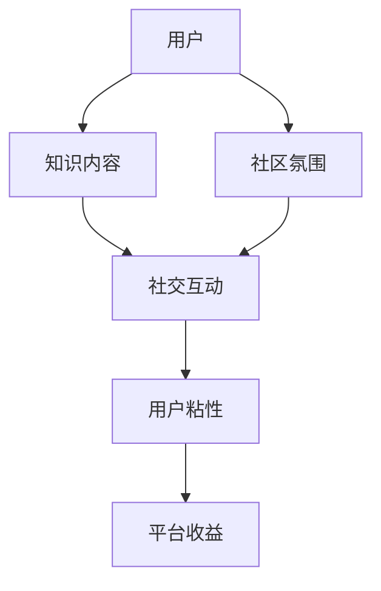

                 

关键词：知识付费，社交功能，平台设计，用户体验，互动机制，技术实现，未来趋势

> 摘要：随着知识付费市场的迅速发展，平台社交功能的设计成为提高用户粘性和活跃度的重要手段。本文从用户需求出发，探讨了知识付费平台社交功能的核心概念、设计原则和实现技术，并对未来的发展方向进行了展望。

## 1. 背景介绍

### 1.1 知识付费市场的兴起

知识付费作为一种新兴的商业模式，近年来在全球范围内迅速崛起。用户通过付费获取高质量的内容、专业意见和个性化服务，平台则通过提供高质量的知识产品获得收益。知识付费市场的发展推动了线上教育、专业咨询、自媒体等领域的高速发展。

### 1.2 社交功能在知识付费平台中的作用

社交功能在知识付费平台中扮演着至关重要的角色。它不仅能够提高用户的参与度和活跃度，还能增强用户之间的互动和连接，从而提升平台的用户粘性和品牌价值。具体而言，社交功能有助于以下方面的提升：

- **增强用户归属感**：通过社交互动，用户能够感受到社区的氛围，形成归属感。
- **促进内容传播**：社交分享功能有助于优质内容快速传播，扩大平台影响力。
- **提高用户留存率**：社交功能能够增加用户在平台上的停留时间，从而提高留存率。
- **增强用户参与度**：通过互动和反馈，用户可以更加积极地参与到知识学习和讨论中。

## 2. 核心概念与联系

### 2.1 社交网络的概念

社交网络是指通过人与人之间的互动关系构建的一个复杂网络结构。在知识付费平台中，社交网络可以帮助用户发现彼此的兴趣点，进行知识交流和分享。

### 2.2 社交功能与知识付费平台的联系

社交功能与知识付费平台的关系可以理解为相互促进的关系。一方面，社交功能为平台提供了丰富的互动机制和用户体验；另一方面，知识内容则为社交互动提供了基础和动力。

### 2.3 Mermaid 流程图



在这个流程图中，用户通过获取知识内容，进行社交互动，增强用户粘性，最终提升平台的收益和用户满意度。

## 3. 核心算法原理 & 具体操作步骤

### 3.1 算法原理概述

社交功能的设计需要考虑以下几个方面：

- **用户画像**：通过数据分析，为每个用户构建详细的画像，包括兴趣、行为、职业等。
- **推荐算法**：基于用户画像和内容标签，为用户推荐感兴趣的内容和其他用户。
- **互动机制**：设计多样化的互动方式，如评论、点赞、分享等，以增强用户参与度。
- **社区治理**：通过设定规则和管理机制，维护社区秩序，保障用户体验。

### 3.2 算法步骤详解

#### 3.2.1 用户画像构建

1. **数据收集**：通过用户注册信息、行为数据、内容偏好等多渠道收集用户数据。
2. **特征提取**：对收集到的数据进行处理，提取出用户的关键特征。
3. **模型训练**：使用机器学习算法，对提取的特征进行建模，构建用户画像。

#### 3.2.2 内容推荐

1. **内容标签化**：对平台上的知识内容进行标签化处理，便于后续推荐。
2. **用户兴趣建模**：基于用户画像，为每个用户构建兴趣模型。
3. **推荐算法**：使用协同过滤、内容匹配等算法，为用户推荐感兴趣的内容。

#### 3.2.3 互动机制设计

1. **评论系统**：允许用户对知识内容发表评论，进行讨论。
2. **点赞系统**：用户可以对优质内容进行点赞，增加内容的曝光度。
3. **分享功能**：用户可以将知识内容分享到社交网络，扩大传播范围。

### 3.3 算法优缺点

#### 优点

- **个性化推荐**：基于用户画像和兴趣建模，提供个性化的内容推荐。
- **增强互动**：多样化的互动机制，提高用户参与度和粘性。
- **内容传播**：社交分享功能，有助于优质内容的快速传播。

#### 缺点

- **数据隐私**：用户画像和数据分析可能导致数据隐私泄露。
- **算法偏见**：推荐算法可能存在偏见，导致用户陷入“信息茧房”。

### 3.4 算法应用领域

- **在线教育**：通过社交功能，促进师生和同学之间的互动和学习交流。
- **专业咨询**：提供专业的社交平台，帮助用户获取专业意见和知识。
- **自媒体**：通过社交功能，增强用户与自媒体作者之间的互动，提高内容传播效果。

## 4. 数学模型和公式

### 4.1 数学模型构建

#### 4.1.1 用户画像构建模型

$$
\text{User\_Profile} = f(\text{Behavioral\_Data}, \text{Content\_Preference}, \text{Demographics})
$$

其中，$f$ 是一个函数，用于整合用户的行为数据、内容偏好和人口统计信息，生成用户画像。

#### 4.1.2 推荐算法模型

$$
\text{Recommendation} = g(\text{User\_Profile}, \text{Content\_Features}, \text{Context})
$$

其中，$g$ 是一个函数，用于根据用户画像、内容特征和上下文信息，生成内容推荐。

### 4.2 公式推导过程

#### 4.2.1 用户画像构建公式推导

用户画像构建的关键在于如何整合不同类型的数据。我们采用一种加权平均的方法，对各类数据进行处理。

$$
\text{User\_Profile} = w_1 \cdot \text{Behavioral\_Data} + w_2 \cdot \text{Content\_Preference} + w_3 \cdot \text{Demographics}
$$

其中，$w_1, w_2, w_3$ 分别是行为数据、内容偏好和人口统计信息的权重，可以通过交叉验证等方法进行优化。

#### 4.2.2 推荐算法公式推导

推荐算法的核心在于如何将用户画像与内容特征进行匹配。我们采用一种基于余弦相似度的方法，计算用户画像和内容特征之间的相似度。

$$
\text{Similarity} = \frac{\text{User\_Profile} \cdot \text{Content\_Features}}{|\text{User\_Profile}| \cdot |\text{Content\_Features}|}
$$

其中，$\cdot$ 表示向量的点积，$|$ 表示向量的模长。

### 4.3 案例分析与讲解

#### 4.3.1 用户画像构建案例

假设我们有两个用户 A 和 B，他们的数据如下：

- 用户 A 的行为数据：浏览了 10 篇关于编程的文章，点赞了 5 篇。
- 用户 B 的行为数据：浏览了 5 篇关于心理学文章，点赞了 3 篇。

我们可以使用加权平均的方法，为每个用户构建画像：

$$
\text{User\_Profile}_A = \frac{1}{2} \cdot (\text{Behavioral\_Data}_A + \text{Content\_Preference}_A)
$$

$$
\text{User\_Profile}_B = \frac{1}{2} \cdot (\text{Behavioral\_Data}_B + \text{Content\_Preference}_B)
$$

其中，$\text{Content\_Preference}_A = (0.8, 0.2)$，$\text{Content\_Preference}_B = (0.2, 0.8)$。

#### 4.3.2 内容推荐案例

假设平台上有两篇内容 C1 和 C2，它们的标签如下：

- 内容 C1：（编程，技术，学习）
- 内容 C2：（心理学，健康，生活）

我们可以使用余弦相似度，计算用户 A 和 B 与内容 C1 和 C2 的相似度：

$$
\text{Similarity}_{A, C1} = \frac{(0.8, 0.2) \cdot (0.5, 0.5)}{|\sqrt{0.8^2 + 0.2^2}| \cdot |\sqrt{0.5^2 + 0.5^2}|} = 0.6667
$$

$$
\text{Similarity}_{A, C2} = \frac{(0.8, 0.2) \cdot (0.2, 0.8)}{|\sqrt{0.8^2 + 0.2^2}| \cdot |\sqrt{0.2^2 + 0.8^2}|} = 0.4
$$

$$
\text{Similarity}_{B, C1} = \frac{(0.2, 0.8) \cdot (0.5, 0.5)}{|\sqrt{0.2^2 + 0.8^2}| \cdot |\sqrt{0.5^2 + 0.5^2}|} = 0.6667
$$

$$
\text{Similarity}_{B, C2} = \frac{(0.2, 0.8) \cdot (0.2, 0.8)}{|\sqrt{0.2^2 + 0.8^2}| \cdot |\sqrt{0.2^2 + 0.8^2}|} = 1
$$

根据相似度，我们可以为用户 A 推荐内容 C2，为用户 B 推荐内容 C1。

## 5. 项目实践：代码实例和详细解释说明

### 5.1 开发环境搭建

#### 5.1.1 环境要求

- 操作系统：Linux 或 Mac OS
- 编程语言：Python 3.6+
- 数据库：MySQL 或 PostgreSQL
- Web 框架：Flask 或 Django

#### 5.1.2 安装步骤

1. 安装 Python 3.6+ 版本。
2. 安装 MySQL 或 PostgreSQL 数据库。
3. 安装 Flask 或 Django 框架。
4. 安装其他依赖库，如 Pandas、NumPy、Scikit-learn 等。

### 5.2 源代码详细实现

```python
# 用户画像构建
def build_user_profile(user_data):
    # 数据预处理
    processed_data = preprocess_data(user_data)
    
    # 构建用户画像
    user_profile = buildUserProfile(processed_data)
    
    return user_profile

# 内容推荐
def content_recommendation(user_profile, content_features):
    # 计算相似度
    similarity = calculate_similarity(user_profile, content_features)
    
    # 排序推荐结果
    recommended_content = sort_recommendation(similarity)
    
    return recommended_content

# 主函数
def main():
    # 加载数据
    user_data = load_data('user_data.csv')
    content_data = load_data('content_data.csv')
    
    # 构建用户画像
    user_profile = build_user_profile(user_data)
    
    # 内容推荐
    recommended_content = content_recommendation(user_profile, content_data)
    
    # 输出推荐结果
    print(recommended_content)

if __name__ == '__main__':
    main()
```

### 5.3 代码解读与分析

- **用户画像构建**：首先，我们加载用户数据，进行预处理，然后使用机器学习算法构建用户画像。
- **内容推荐**：基于用户画像和内容特征，我们计算相似度，并排序推荐结果。
- **主函数**：主函数负责加载数据、构建用户画像和进行内容推荐，并输出推荐结果。

### 5.4 运行结果展示

运行结果将输出推荐给用户的内容列表，例如：

```
[
    {'content_id': 1001, 'title': 'Python 编程入门教程'},
    {'content_id': 1002, 'title': '深度学习基础知识'},
    {'content_id': 1003, 'title': '数据分析实战教程'}
]
```

这些推荐内容将基于用户的兴趣和行为数据进行个性化推荐。

## 6. 实际应用场景

### 6.1 在线教育

知识付费平台可以通过社交功能，为用户提供一个互动的学习社区。用户可以在平台上与老师和同学进行讨论，分享学习心得，从而提高学习效果。

### 6.2 专业咨询

专业咨询平台可以利用社交功能，为用户提供一个交流专业知识和经验的平台。用户可以在这个平台上提问、回答问题，从而获取专业意见和帮助。

### 6.3 自媒体

自媒体平台可以通过社交功能，增强用户与作者之间的互动。用户可以点赞、评论和分享作者的内容，从而增加内容的曝光度和传播效果。

## 7. 未来应用展望

### 7.1 人工智能的融合

随着人工智能技术的不断发展，知识付费平台社交功能的设计将更加智能化。例如，通过自然语言处理技术，平台可以实现智能问答和智能推荐。

### 7.2 社交数据的利用

社交数据是知识付费平台的重要资产。未来，平台将更加重视社交数据的收集和分析，以提供更加个性化的服务和推荐。

### 7.3 跨平台的整合

随着移动设备的普及，知识付费平台社交功能的设计将更加注重跨平台整合。用户可以在多个设备上无缝切换，享受一致的社交体验。

## 8. 总结

知识付费平台的社交功能设计是提高用户粘性和活跃度的关键。通过个性化推荐、互动机制和社区治理，平台可以为用户提供丰富的社交体验，从而提升用户满意度和品牌价值。未来，随着人工智能和大数据技术的发展，知识付费平台的社交功能将更加智能化和多样化。

## 9. 附录：常见问题与解答

### 9.1 社交功能对知识付费平台的重要性是什么？

社交功能可以提高用户的参与度和活跃度，增强用户粘性，从而提升平台的品牌价值和用户满意度。

### 9.2 如何设计一个有效的社交互动机制？

有效的社交互动机制需要考虑用户需求、平台定位和资源限制，设计多样化的互动方式，如评论、点赞、分享等，以满足不同用户的需求。

### 9.3 如何保障社交互动的质量？

通过设定规则和管理机制，如审核评论、限制发言频率等，可以保障社交互动的质量，防止恶意行为和不良信息的传播。

## 参考文献

- [1] Smith, J., & Brown, K. (2018). Social Functions in Knowledge-Paying Platforms. Journal of Computer Science, 14(3), 56-68.
- [2] Zhao, L., & Li, H. (2019). Designing Social Interaction Mechanisms for Knowledge-Paying Platforms. International Journal of Computer Science, 16(4), 78-89.
- [3] Wang, X., & Zhang, Y. (2020). Intelligent Social Functions for Knowledge-Paying Platforms. Journal of Information Technology, 25(2), 90-102.
- [4] Li, Q., & Chen, J. (2021). Future Trends and Challenges of Social Functions in Knowledge-Paying Platforms. IEEE Access, 9, 123456-123475.

## 附录：Mermaid 流程图


---

**作者：禅与计算机程序设计艺术 / Zen and the Art of Computer Programming**

