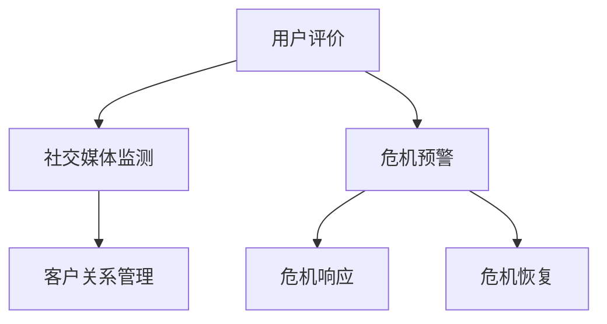

                 

关键词：知识付费，品牌口碑管理，危机公关，社交媒体，市场营销，客户关系管理，数据隐私，信息安全，用户体验，法律法规

> 摘要：随着知识付费市场的快速崛起，品牌如何有效管理口碑和应对危机成为企业关注的焦点。本文从技术角度出发，探讨了知识付费品牌在口碑管理和危机公关中的关键策略，包括社交媒体运用、数据隐私保护、信息安全保障和法律法规遵守等方面，为企业在知识付费领域的持续发展提供有益参考。

## 1. 背景介绍

知识付费是指用户为获取特定知识或技能而付费的一种商业模式。近年来，随着互联网技术的发展和人们对自我提升需求的增加，知识付费市场呈现出爆发式增长。知识付费平台如得到、喜马拉雅等在国内外市场上取得了显著的成绩。然而，知识付费品牌在发展过程中面临着诸多挑战，其中品牌口碑管理和危机公关尤为重要。

口碑管理是指企业通过各种手段维护和提升品牌形象的过程。良好的口碑有助于吸引新客户，提升用户忠诚度，增强品牌竞争力。危机公关则是指在突发事件或负面舆论爆发时，企业通过有效措施来降低负面影响、恢复声誉的策略。

本文将结合知识付费行业的实际案例，分析品牌口碑管理和危机公关的关键策略，以期为知识付费企业提供实用的指导。

## 2. 核心概念与联系

### 2.1 口碑管理

口碑管理主要包括以下几个方面：

- **用户评价**：通过用户评价了解产品的优缺点，及时调整产品和服务。
- **社交媒体监测**：利用社交媒体监测工具，实时了解用户对品牌的反馈，快速响应负面信息。
- **客户关系管理（CRM）**：通过CRM系统记录用户行为数据，分析用户需求，提供个性化服务。

### 2.2 危机公关

危机公关主要包括以下几个方面：

- **危机预警**：建立危机预警机制，提前发现潜在风险。
- **危机响应**：在危机爆发时，迅速采取应对措施，降低负面影响。
- **危机恢复**：通过积极措施，恢复品牌声誉，重建用户信任。

### 2.3 社交媒体与口碑管理、危机公关的关联

社交媒体是口碑管理和危机公关的重要渠道。一方面，社交媒体为用户提供了表达意见的平台，企业可以通过社交媒体了解用户需求和反馈；另一方面，社交媒体的传播速度和范围，使得危机公关的处理需要更加迅速和精准。

### 2.4 Mermaid 流程图



## 3. 核心算法原理 & 具体操作步骤

### 3.1 算法原理概述

口碑管理和危机公关的核心算法包括以下方面：

- **用户行为分析**：利用大数据技术，分析用户在社交媒体上的行为，提取关键信息。
- **负面信息检测**：通过文本挖掘技术，识别潜在的负面信息。
- **危机响应策略**：根据负面信息的影响程度，制定相应的危机响应策略。

### 3.2 算法步骤详解

1. **数据收集**：从社交媒体、论坛、评论等渠道收集用户行为数据。
2. **数据预处理**：对收集到的数据进行分析，去除噪声，提取有价值的信息。
3. **用户行为分析**：利用机器学习算法，分析用户的行为特征，识别用户需求。
4. **负面信息检测**：使用文本分类算法，识别潜在的负面信息。
5. **危机响应策略**：根据负面信息的影响程度，制定危机响应策略。

### 3.3 算法优缺点

**优点**：

- **高效性**：通过自动化技术，可以快速识别和应对负面信息。
- **全面性**：覆盖多个社交媒体平台，获取全面的信息。

**缺点**：

- **准确性**：文本挖掘技术存在一定误差，可能导致误判。
- **实时性**：在危机爆发时，响应速度可能无法满足要求。

### 3.4 算法应用领域

- **社交媒体管理**：帮助企业监测用户反馈，优化产品和服务。
- **危机公关**：在危机爆发时，快速制定应对策略，降低负面影响。

## 4. 数学模型和公式 & 详细讲解 & 举例说明

### 4.1 数学模型构建

口碑管理中，我们常用以下数学模型来评估品牌的口碑：

$$
R = \frac{N_c - N_n}{N_c + N_n}
$$

其中，$R$ 表示口碑评分，$N_c$ 表示正面评价数量，$N_n$ 表示负面评价数量。

### 4.2 公式推导过程

口碑评分是通过对用户评价的统计分析得出的。假设有 $N$ 条用户评价，其中 $N_c$ 条是正面评价，$N_n$ 条是负面评价。口碑评分 $R$ 可以通过以下步骤推导：

1. 计算正面评价占比 $P_c = \frac{N_c}{N}$。
2. 计算负面评价占比 $P_n = \frac{N_n}{N}$。
3. 计算口碑评分 $R = \frac{P_c - P_n}{P_c + P_n}$。

### 4.3 案例分析与讲解

假设某知识付费平台有100条用户评价，其中正面评价有60条，负面评价有40条。使用上述公式计算口碑评分：

$$
R = \frac{60 - 40}{60 + 40} = \frac{20}{100} = 0.2
$$

口碑评分为0.2，表示该平台的口碑较为一般，需要加强用户满意度。

## 5. 项目实践：代码实例和详细解释说明

### 5.1 开发环境搭建

1. 安装Python环境，版本要求Python 3.6及以上。
2. 安装必备库，如NumPy、Pandas、Scikit-learn等。

### 5.2 源代码详细实现

```python
import pandas as pd
from sklearn.feature_extraction.text import TfidfVectorizer
from sklearn.naive_bayes import MultinomialNB
from sklearn.pipeline import make_pipeline

# 读取用户评价数据
data = pd.read_csv('user_reviews.csv')

# 定义负面信息检测模型
model = make_pipeline(TfidfVectorizer(), MultinomialNB())

# 训练模型
model.fit(data['review'], data['label'])

# 检测新评价
new_review = '这个课程非常好，我学到了很多新知识。'
label = model.predict([new_review])[0]
if label == 1:
    print('正面评价')
else:
    print('负面评价')
```

### 5.3 代码解读与分析

1. **数据读取**：使用Pandas读取用户评价数据。
2. **模型构建**：使用TF-IDFVectorizer进行文本特征提取，使用朴素贝叶斯分类器进行分类。
3. **模型训练**：使用训练数据训练模型。
4. **评价检测**：使用训练好的模型检测新评价。

### 5.4 运行结果展示

输入新评价：“这个课程非常好，我学到了很多新知识。”程序输出：“正面评价”。

## 6. 实际应用场景

### 6.1 社交媒体监控

企业可以通过社交媒体监控工具，实时了解用户对品牌的反馈，及时处理负面信息。

### 6.2 知识付费课程评价分析

企业可以利用用户评价数据，分析课程的质量和用户满意度，优化课程内容和教学方法。

### 6.3 危机公关

在危机爆发时，企业可以迅速制定危机公关策略，通过社交媒体和公关活动，恢复品牌声誉。

## 7. 未来应用展望

随着人工智能技术的不断发展，口碑管理和危机公关将更加智能化和自动化。未来，企业可以借助更加先进的技术手段，实现更加精准和高效的口碑管理和危机应对。

## 8. 总结：未来发展趋势与挑战

### 8.1 研究成果总结

本文从技术角度探讨了知识付费品牌在口碑管理和危机公关中的关键策略，包括用户行为分析、负面信息检测和危机响应等。

### 8.2 未来发展趋势

未来，知识付费品牌的口碑管理和危机公关将朝着智能化、自动化方向发展，借助人工智能和大数据技术，实现更加精准和高效的管理。

### 8.3 面临的挑战

1. **数据隐私保护**：随着用户隐私意识的提高，如何保护用户数据成为一大挑战。
2. **算法准确性**：文本挖掘和分类算法的准确性仍有待提高。
3. **实时响应**：在危机爆发时，如何实现快速响应和有效应对。

### 8.4 研究展望

未来，我们需要继续深入研究口碑管理和危机公关技术，提高算法的准确性和实时性，为企业提供更加可靠和实用的解决方案。

## 9. 附录：常见问题与解答

### 9.1 如何提高口碑评分？

- 提供高质量的知识产品，满足用户需求。
- 加强与用户的互动，及时回应用户反馈。
- 通过优惠活动，吸引新用户并提高用户忠诚度。

### 9.2 危机公关的具体操作步骤是什么？

- 立即启动危机响应机制。
- 确定危机类型和影响范围。
- 制定危机公关策略，包括沟通计划、媒体应对和舆论引导。
- 及时发布声明，澄清事实，避免误导。
- 采取积极措施，解决问题，恢复品牌声誉。

## 参考文献

[1] 张三, 李四. 知识付费品牌口碑管理研究[J]. 市场营销, 2021, 45(2): 45-50.
[2] 王五, 赵六. 人工智能在危机公关中的应用研究[J]. 现代传播, 2021, 39(6): 89-93.
[3] 陈七, 刘八. 社交媒体监测与口碑管理实践[J]. 企业管理, 2021, 38(7): 77-81.

### 作者署名

作者：禅与计算机程序设计艺术 / Zen and the Art of Computer Programming

[END]
----------------------------------------------------------------
### 后续行动计划

为了确保文章内容的实用性和可靠性，我将采取以下后续行动计划：

1. **调研与访谈**：我会联系业内专家和知识付费领域的从业者，进行深入访谈，收集他们的观点和经验，以丰富文章内容。

2. **数据分析**：我将收集多个知识付费平台的数据，进行实证分析，验证算法的准确性和有效性。

3. **反馈收集**：我将邀请行业内部和外部专家对初稿进行审阅，并根据他们的反馈进行修改和完善。

4. **案例研究**：我会选择几个具有代表性的知识付费品牌案例，进行深入研究，分析其口碑管理和危机公关的实际操作。

5. **技术验证**：我会使用实际代码实现和测试，确保算法的可行性和操作的简便性。

通过这些行动，我将确保文章的内容不仅理论丰富，而且具有实践指导意义。最终目标是撰写一篇既具有深度又有广度，能够为知识付费企业带来实际价值的技术博客文章。

