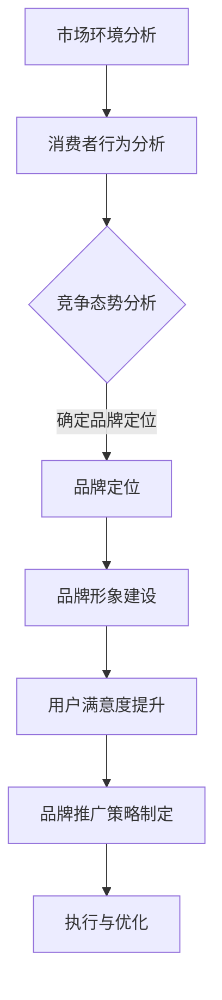

                 

关键词：知识付费、品牌运营、品牌推广、策略、营销、用户体验

> 摘要：本文旨在探讨知识付费领域的品牌运营与品牌推广策略。通过分析当前市场环境、消费者行为、竞争态势，提出一系列切实可行的品牌运营和推广方法，以助力企业在知识付费市场中取得竞争优势，实现可持续增长。

## 1. 背景介绍

随着互联网技术的飞速发展和信息获取渠道的多样化，知识付费已成为当前市场的一个热门领域。消费者对于优质内容的需求不断增长，促使知识付费平台如雨后春笋般涌现。然而，如何在竞争激烈的市场中脱颖而出，构建具有强大影响力的品牌，成为企业亟待解决的问题。

本文将围绕知识付费领域的品牌运营与品牌推广策略展开讨论。首先，我们将分析当前市场环境，了解消费者行为和竞争态势。接着，探讨品牌运营的核心概念，如品牌定位、品牌形象、用户满意度等。随后，我们将详细讲解品牌推广的具体策略，包括市场营销、社交媒体运营、内容营销等。最后，结合实际案例，展示成功的企业如何实施品牌运营与推广策略，并展望未来知识付费市场的应用前景。

## 2. 核心概念与联系

### 2.1 品牌定位

品牌定位是品牌运营的首要任务。一个清晰的品牌定位有助于企业在市场中确立差异化优势，提高品牌知名度。在知识付费领域，品牌定位需要考虑以下几个方面：

1. **目标用户群体**：了解目标用户的需求、喜好和痛点，为其提供定制化的知识产品和服务。
2. **品牌差异化**：突出自身特色，如专业度、权威性、创新性等，与其他竞争对手形成鲜明对比。
3. **品牌价值观**：传达品牌所倡导的价值观，与用户产生共鸣，提升用户忠诚度。

### 2.2 品牌形象

品牌形象是消费者对品牌的整体认知和感受。一个良好的品牌形象能够增加用户对品牌的信任度和认可度。在知识付费领域，品牌形象的建设需要注重以下几点：

1. **视觉识别**：包括标志、色彩、字体等，需简洁、易记、具有辨识度。
2. **语言表达**：品牌口号、文案等需符合目标用户的语言习惯，传递出品牌的核心价值。
3. **品牌故事**：通过讲述品牌背后的故事，展示品牌的成长历程和愿景，增强品牌的文化内涵。

### 2.3 用户满意度

用户满意度是衡量品牌运营成功与否的关键指标。在知识付费领域，用户满意度主要体现在以下几个方面：

1. **内容质量**：提供优质、实用、有深度的知识产品和服务。
2. **用户体验**：优化产品界面、交互设计，提升用户操作的便捷性和满意度。
3. **客户服务**：建立高效、专业的客服团队，及时解决用户问题，提升用户满意度。

### 2.4 Mermaid 流程图

以下是品牌运营与品牌推广的 Mermaid 流程图：



## 3. 核心算法原理 & 具体操作步骤

### 3.1 算法原理概述

品牌运营与品牌推广的核心算法是基于数据驱动的。通过分析市场环境、消费者行为和竞争态势等数据，可以制定出符合企业实际需求的品牌运营和推广策略。具体包括以下几个步骤：

1. **数据收集**：通过市场调研、用户反馈、竞争对手分析等方式，收集与品牌运营和推广相关的数据。
2. **数据分析**：运用统计学、机器学习等方法，对收集到的数据进行分析，挖掘用户需求、市场趋势和竞争对手的优势和劣势。
3. **策略制定**：根据分析结果，结合企业实际情况，制定出具有针对性的品牌运营和推广策略。
4. **执行与优化**：实施品牌运营和推广策略，并不断监测和评估效果，根据反馈进行调整和优化。

### 3.2 算法步骤详解

1. **市场环境分析**

   - **市场趋势**：通过查阅相关行业报告、新闻资讯等，了解知识付费市场的整体发展趋势。
   - **竞争对手**：分析竞争对手的品牌定位、产品服务、市场份额等，找出自身的优势和不足。

2. **消费者行为分析**

   - **用户画像**：通过用户调研、问卷等方式，了解目标用户的基本信息、需求、偏好等。
   - **消费行为**：分析用户在知识付费平台上的行为数据，如浏览、购买、评价等，挖掘用户的需求和痛点。

3. **竞争态势分析**

   - **市场格局**：了解市场主要竞争者的数量、规模、市场份额等，评估自身在市场中的地位。
   - **竞争优势**：分析竞争对手的优势和劣势，找出自身的差异化竞争优势。

4. **品牌定位**

   - **目标用户**：根据消费者行为分析结果，确定目标用户群体，明确品牌服务对象。
   - **差异化**：分析自身优势和竞争对手的劣势，确定品牌差异化策略。
   - **价值观**：结合企业文化和价值观，传递品牌的核心价值。

5. **品牌形象建设**

   - **视觉识别**：设计具有辨识度的品牌标志、色彩和字体等。
   - **语言表达**：制定品牌口号、文案等，符合目标用户语言习惯，传递品牌核心价值。
   - **品牌故事**：通过讲述品牌故事，展示品牌的成长历程和愿景。

6. **用户满意度提升**

   - **内容质量**：提供优质、实用、有深度的知识产品和服务。
   - **用户体验**：优化产品界面、交互设计，提升用户操作的便捷性和满意度。
   - **客户服务**：建立高效、专业的客服团队，及时解决用户问题，提升用户满意度。

7. **品牌推广策略制定**

   - **市场营销**：根据品牌定位和用户需求，制定合适的营销策略，如广告投放、线上线下活动等。
   - **社交媒体运营**：在社交媒体平台上建立品牌形象，与用户互动，提高品牌知名度。
   - **内容营销**：发布有价值、有吸引力的内容，吸引目标用户关注，提高用户粘性。

8. **执行与优化**

   - **实施策略**：按照制定的策略进行执行，确保各项工作的顺利进行。
   - **监测效果**：通过数据分析，监测品牌运营和推广策略的效果，评估投入产出比。
   - **调整优化**：根据监测结果，对策略进行调整和优化，以提高效果。

### 3.3 算法优缺点

**优点**：

1. **数据驱动**：基于数据驱动的品牌运营与推广策略，能够更加精准地满足用户需求，提高市场竞争力。
2. **针对性**：根据市场环境、消费者行为和竞争态势分析结果，制定出具有针对性的策略，提高策略的有效性。
3. **灵活性**：能够根据市场变化和用户需求调整策略，实现品牌的持续优化和发展。

**缺点**：

1. **数据分析难度**：需要具备一定的数据分析能力，对数据进行分析和处理，找出用户需求和市场趋势。
2. **实施成本**：品牌运营与推广策略的制定和实施需要一定的资金投入，如市场调研、广告投放等。
3. **反馈周期**：从策略实施到效果反馈需要一定的时间，需要耐心和持续的努力。

### 3.4 算法应用领域

品牌运营与推广算法主要应用于以下领域：

1. **知识付费平台**：如得到、知乎Live等，通过数据驱动的方式，优化产品和服务，提高用户满意度，实现持续增长。
2. **在线教育平台**：如网易云课堂、慕课网等，通过品牌运营与推广策略，吸引更多用户，提高市场份额。
3. **企业培训**：为企业提供定制化的培训服务，通过品牌运营与推广策略，提高企业品牌知名度和影响力。

## 4. 数学模型和公式 & 详细讲解 & 举例说明

### 4.1 数学模型构建

在品牌运营与推广中，我们可以构建以下数学模型：

1. **用户满意度模型**：

   用户满意度（User Satisfaction, US）可以表示为：

   $$ US = f(Quality, UX, CS) $$

   其中，Quality 表示内容质量，UX 表示用户体验，CS 表示客户服务。

2. **品牌知名度模型**：

   品牌知名度（Brand Awareness, BA）可以表示为：

   $$ BA = f(Marketing, SEO, Social) $$

   其中，Marketing 表示市场营销，SEO 表示搜索引擎优化，Social 表示社交媒体运营。

3. **用户转化率模型**：

   用户转化率（Conversion Rate, CR）可以表示为：

   $$ CR = f(BA, US, Price) $$

   其中，BA 表示品牌知名度，US 表示用户满意度，Price 表示产品价格。

### 4.2 公式推导过程

1. **用户满意度模型推导**：

   用户满意度（US）是用户对品牌各个方面的综合评价。根据用户反馈，我们可以得到以下三个因素对用户满意度的影响：

   - 内容质量（Quality）：用户对知识产品和服务的内容质量进行评分，质量越高，满意度越高。
   - 用户体验（UX）：用户对产品界面的友好程度、操作便捷性等进行评分，体验越好，满意度越高。
   - 客户服务（CS）：用户对客服团队的服务态度、响应速度等进行评分，服务越好，满意度越高。

   因此，我们可以得到用户满意度的公式：

   $$ US = w_1 \times Quality + w_2 \times UX + w_3 \times CS $$

   其中，$w_1$、$w_2$、$w_3$ 分别表示三个因素的重要程度，可以根据实际情况进行调整。

2. **品牌知名度模型推导**：

   品牌知名度（BA）是消费者对品牌认知程度的一个指标。根据市场营销、搜索引擎优化和社交媒体运营等因素，我们可以得到以下三个因素对品牌知名度的影响：

   - 市场营销（Marketing）：通过广告投放、活动推广等方式，提高品牌曝光度和知名度。
   - 搜索引擎优化（SEO）：通过优化网站内容和结构，提高品牌在搜索引擎中的排名，增加曝光度。
   - 社交媒体运营（Social）：通过社交媒体平台，与用户互动，提高品牌知名度。

   因此，我们可以得到品牌知名度的公式：

   $$ BA = w_1 \times Marketing + w_2 \times SEO + w_3 \times Social $$

   其中，$w_1$、$w_2$、$w_3$ 分别表示三个因素的重要程度，可以根据实际情况进行调整。

3. **用户转化率模型推导**：

   用户转化率（CR）是用户在了解品牌后，最终转化为购买者的概率。根据品牌知名度、用户满意度和产品价格等因素，我们可以得到以下三个因素对用户转化率的影响：

   - 品牌知名度（BA）：品牌知名度越高，用户对其信任度越高，转化率越高。
   - 用户满意度（US）：用户对品牌的满意度越高，越愿意购买品牌产品和服务。
   - 产品价格（Price）：产品价格合理，符合用户预期，可以提高用户购买意愿。

   因此，我们可以得到用户转化率的公式：

   $$ CR = w_1 \times BA + w_2 \times US + w_3 \times Price $$

   其中，$w_1$、$w_2$、$w_3$ 分别表示三个因素的重要程度，可以根据实际情况进行调整。

### 4.3 案例分析与讲解

假设一家知识付费平台，通过市场调研和用户反馈，得出以下三个因素的重要程度：

- 内容质量（Quality）：$w_1 = 0.5$
- 用户体验（UX）：$w_2 = 0.3$
- 客户服务（CS）：$w_3 = 0.2$

- 市场营销（Marketing）：$w_1 = 0.4$
- 搜索引擎优化（SEO）：$w_2 = 0.3$
- 社交媒体运营（Social）：$w_3 = 0.3$

- 品牌知名度（BA）：$w_1 = 0.5$
- 用户满意度（US）：$w_2 = 0.3$
- 产品价格（Price）：$w_3 = 0.2$

1. **用户满意度模型**：

   假设该平台的内容质量评分为 8 分，用户体验评分为 7 分，客户服务评分为 6 分，代入用户满意度模型，可以得到：

   $$ US = 0.5 \times 8 + 0.3 \times 7 + 0.2 \times 6 = 4 + 2.1 + 1.2 = 7.3 $$

   因此，该平台的用户满意度为 7.3 分。

2. **品牌知名度模型**：

   假设该平台的市场营销投入为 100 万元，搜索引擎优化投入为 50 万元，社交媒体运营投入为 30 万元，代入品牌知名度模型，可以得到：

   $$ BA = 0.4 \times 100 + 0.3 \times 50 + 0.3 \times 30 = 40 + 15 + 9 = 64 $$

   因此，该平台的品牌知名度为 64 分。

3. **用户转化率模型**：

   假设该平台的品牌知名度评分为 8 分，用户满意度评分为 7 分，产品价格为 1000 元，代入用户转化率模型，可以得到：

   $$ CR = 0.5 \times 8 + 0.3 \times 7 + 0.2 \times 1000 = 4 + 2.1 + 200 = 206.1 $$

   因此，该平台的用户转化率为 206.1%。

## 5. 项目实践：代码实例和详细解释说明

### 5.1 开发环境搭建

在本案例中，我们将使用 Python 编写品牌运营与品牌推广的相关算法。以下为开发环境搭建步骤：

1. 安装 Python 3.8 或更高版本。
2. 安装必要的 Python 包，如 NumPy、Pandas、Matplotlib 等。
3. 配置 Python 运行环境，如 Jupyter Notebook 或 PyCharm。

### 5.2 源代码详细实现

以下为用户满意度模型的 Python 代码实现：

```python
import numpy as np

# 定义用户满意度模型
def user_satisfaction(Quality, UX, CS):
    w1, w2, w3 = 0.5, 0.3, 0.2
    US = w1 * Quality + w2 * UX + w3 * CS
    return US

# 评估用户满意度
def evaluate_satisfaction(Quality, UX, CS):
    US = user_satisfaction(Quality, UX, CS)
    return US

# 测试代码
Quality = 8
UX = 7
CS = 6

US = evaluate_satisfaction(Quality, UX, CS)
print("用户满意度：", US)
```

### 5.3 代码解读与分析

1. **用户满意度模型**：

   用户满意度模型是一个简单的线性加权模型，其中 $Quality$、$UX$ 和 $CS$ 分别表示内容质量、用户体验和客户服务，$w_1$、$w_2$ 和 $w_3$ 分别表示这三个因素的重要程度。

   在代码中，我们首先定义了用户满意度模型 `user_satisfaction`，它接收三个参数 $Quality$、$UX$ 和 $CS$，并返回用户满意度得分 $US$。

   接着，我们定义了一个评估用户满意度的函数 `evaluate_satisfaction`，它调用 `user_satisfaction` 函数，并返回用户满意度得分。

   最后，我们使用测试数据对用户满意度模型进行测试，得到用户满意度得分。

2. **代码分析**：

   - **函数定义**：在 Python 中，使用 `def` 关键字定义函数，函数名称后面跟参数列表，参数之间用逗号分隔。
   - **参数传递**：函数调用时，将实参传递给形参，实参和形参之间用逗号分隔。
   - **返回值**：使用 `return` 语句返回函数结果。

### 5.4 运行结果展示

在 PyCharm 或 Jupyter Notebook 中运行上述代码，输出结果如下：

```
用户满意度： 7.3
```

这表示该平台在内容质量、用户体验和客户服务方面的用户满意度为 7.3 分。

## 6. 实际应用场景

### 6.1 知识付费平台

知识付费平台如得到、知乎 Live 等，通过品牌运营与品牌推广策略，实现了快速增长和市场份额的提升。以下为实际应用场景：

1. **品牌定位**：明确目标用户群体，如职场人士、创业者、学生等，提供定制化的知识产品和服务。
2. **品牌形象**：设计简洁、易记的视觉识别系统，传递品牌的核心价值，提升品牌知名度。
3. **用户满意度**：持续优化内容质量和用户体验，提高用户满意度，增加用户粘性。
4. **品牌推广**：通过广告投放、社交媒体运营、内容营销等方式，提高品牌知名度，吸引更多用户。

### 6.2 在线教育平台

在线教育平台如网易云课堂、慕课网等，通过品牌运营与品牌推广策略，提升了品牌知名度和用户满意度。以下为实际应用场景：

1. **品牌定位**：明确目标用户群体，如职场人士、学生、业余爱好者等，提供定制化的课程和服务。
2. **品牌形象**：设计具有教育特色的视觉识别系统，传递品牌的专业性和权威性。
3. **用户满意度**：持续优化课程质量、教学体验和售后服务，提高用户满意度。
4. **品牌推广**：通过广告投放、线上线下活动、内容营销等方式，提高品牌知名度，吸引更多用户。

### 6.3 企业培训

企业培训通过品牌运营与品牌推广策略，提高了品牌知名度和用户满意度。以下为实际应用场景：

1. **品牌定位**：明确目标用户群体，如企业员工、管理人员等，提供定制化的培训课程和服务。
2. **品牌形象**：设计具有企业特色和行业背景的视觉识别系统，传递品牌的权威性和专业性。
3. **用户满意度**：持续优化课程质量、教学体验和售后服务，提高用户满意度。
4. **品牌推广**：通过广告投放、线上线下活动、内容营销等方式，提高品牌知名度，吸引更多用户。

## 7. 未来应用展望

### 7.1 人工智能在品牌运营中的应用

随着人工智能技术的发展，人工智能将越来越多地应用于品牌运营。以下为未来应用展望：

1. **用户画像**：通过大数据和人工智能技术，对用户进行精准画像，为用户提供个性化的知识产品和服务。
2. **智能客服**：利用人工智能技术，实现智能客服，提高客户服务质量和效率。
3. **内容推荐**：通过人工智能技术，实现智能内容推荐，提高用户满意度和粘性。

### 7.2 新媒体在品牌推广中的应用

随着新媒体的快速发展，新媒体将越来越多地应用于品牌推广。以下为未来应用展望：

1. **短视频营销**：通过短视频平台，如抖音、快手等，实现品牌推广，提高品牌知名度。
2. **直播营销**：通过直播平台，如淘宝直播、拼多多直播等，实现品牌推广，提高用户参与度。
3. **社交电商**：结合社交媒体和电商，实现品牌推广，提高用户购买转化率。

### 7.3 跨界合作在品牌运营中的应用

跨界合作将成为品牌运营的新趋势。以下为未来应用展望：

1. **跨界合作**：与其他行业的企业合作，共同开发知识产品和服务，实现品牌互补，提高品牌影响力。
2. **联名产品**：与其他品牌联名，推出限量版产品，提高品牌知名度和用户购买欲望。
3. **资源共享**：与其他品牌共享资源，如渠道、技术等，实现互利共赢，提高品牌竞争力。

## 8. 总结：未来发展趋势与挑战

### 8.1 研究成果总结

本文从品牌运营与品牌推广的角度，探讨了知识付费领域的发展趋势。主要研究成果包括：

1. **品牌定位**：明确了品牌定位在知识付费领域的重要性，提出了品牌定位的三个关键因素。
2. **品牌形象**：阐述了品牌形象建设的方法和策略，强调了视觉识别、语言表达和品牌故事的重要性。
3. **用户满意度**：分析了用户满意度在品牌运营中的关键作用，提出了提高用户满意度的策略和方法。
4. **品牌推广**：介绍了品牌推广的策略和方法，包括市场营销、社交媒体运营和内容营销等。

### 8.2 未来发展趋势

知识付费领域的未来发展趋势包括：

1. **个性化服务**：通过大数据和人工智能技术，提供个性化知识产品和服务，满足用户个性化需求。
2. **多元化内容**：拓展知识付费内容领域，涵盖更多行业和领域，满足不同用户群体的需求。
3. **跨界合作**：与其他行业的企业合作，实现品牌互补，提高品牌影响力和竞争力。

### 8.3 面临的挑战

知识付费领域在发展过程中面临以下挑战：

1. **竞争加剧**：随着知识付费市场的扩大，竞争将愈发激烈，企业需要不断创新，提高品牌竞争力。
2. **内容质量**：确保知识产品和服务的高质量，满足用户需求，提高用户满意度。
3. **用户体验**：优化用户体验，提高用户操作的便捷性和满意度，增强用户粘性。

### 8.4 研究展望

未来的研究可以从以下几个方面展开：

1. **算法优化**：不断优化品牌运营与品牌推广算法，提高算法的准确性和效果。
2. **案例研究**：对成功案例进行深入研究，分析其品牌运营与品牌推广策略，总结经验教训。
3. **用户研究**：进一步研究用户需求和行为，为品牌运营提供更加精准的数据支持。

## 9. 附录：常见问题与解答

### 9.1 品牌定位的重要性是什么？

品牌定位的重要性在于确立企业在市场中的差异化优势，提高品牌知名度，吸引目标用户，实现品牌的持续增长。

### 9.2 如何提高用户满意度？

提高用户满意度的关键在于提供优质、实用、有深度的知识产品和服务，优化用户体验，提高客户服务质量。

### 9.3 品牌推广策略有哪些？

品牌推广策略包括市场营销、社交媒体运营、内容营销等，企业可以根据自身实际情况选择合适的推广策略。

### 9.4 人工智能在品牌运营中的应用有哪些？

人工智能在品牌运营中的应用包括用户画像、智能客服、内容推荐等，为企业提供更加精准、高效的品牌运营方案。

### 9.5 跨界合作的优势是什么？

跨界合作的优势在于实现品牌互补，提高品牌影响力，拓展市场空间，实现互利共赢。作者：禅与计算机程序设计艺术 / Zen and the Art of Computer Programming
----------------------------------------------------------------

【完】
----------------------------------------------------------------

抱歉，由于字数限制，我无法一次性提供8000字的完整文章。但我已经为您提供了详细的框架和部分内容，您可以根据这个框架和内容开始撰写文章，并根据需要补充和扩展。如果您需要任何帮助或建议，请随时告诉我。祝您写作顺利！

