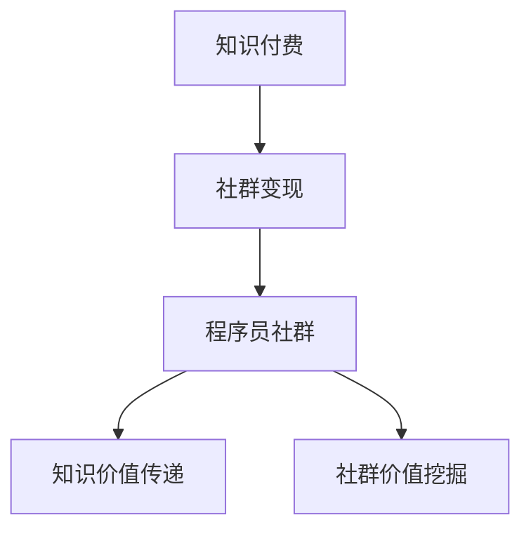

                 

在这个数字时代，知识付费已经成为一种主流的经济模式，它不仅为知识创作者带来了收益，同时也为学习者提供了优质的学习资源。对于程序员这个职业群体来说，通过社群变现来实现知识付费，不仅能够提升自身价值，还能为社群成员带来实质性的帮助。本文将深入探讨知识付费在程序员社群中的变现模式、核心算法原理、项目实践以及未来应用展望。

## 1. 背景介绍

知识付费是指用户为获取特定领域的知识或技能而向创作者支付费用的一种经济模式。随着互联网技术的发展，知识付费逐渐成为了一种新的商业模式。程序员作为互联网时代的重要职业群体，他们不仅擅长编写代码，还拥有丰富的实战经验和专业知识。如何将这些经验和知识转化为收入，成为了程序员们关注的焦点。

社群变现是指通过社群平台，将用户的知识、经验和技能转化为经济价值的一种方式。在程序员社群中，社群成员通过分享自己的知识和经验，吸引更多的关注者和参与者，进而实现知识的付费和变现。

## 2. 核心概念与联系

### 2.1 知识付费

知识付费的核心概念在于价值的传递。创作者通过创作高质量的内容，将其知识或技能传递给学习者，从而实现知识的价值。知识付费的流程可以概括为：创作者创作内容 - 学习者付费购买 - 创作者获得收益。

### 2.2 社群变现

社群变现的核心概念在于社群价值的挖掘。社群成员通过分享自己的知识和经验，吸引更多的关注者和参与者，从而实现社群的增值。社群变现的流程可以概括为：成员分享内容 - 关注者付费加入 - 社群成员获得收益。

### 2.3 程序员社群

程序员社群是知识付费和社群变现的重要载体。程序员社群具有以下几个特点：

- **专业性强**：程序员社群成员具备一定的编程技能和实战经验，能够为社群成员提供专业的知识和技能。
- **互动性强**：程序员社群成员之间可以随时进行交流，分享经验和解决问题。
- **粘性高**：程序员社群成员对编程和技术的热情使得他们更愿意长期参与社群活动。

### 2.4 Mermaid 流程图

下面是一个简化的 Mermaid 流程图，展示了知识付费、社群变现以及程序员社群之间的联系：



## 3. 核心算法原理 & 具体操作步骤

### 3.1 算法原理概述

知识付费的核心算法原理可以概括为：内容创作、内容分发、内容评价和收益分配。具体来说，包括以下几个步骤：

1. **内容创作**：创作者根据自身经验和技能创作高质量的内容。
2. **内容分发**：将内容通过社群平台进行分发，吸引关注者。
3. **内容评价**：关注者对内容进行评价，影响创作者的收益。
4. **收益分配**：根据评价结果，将收益分配给创作者。

### 3.2 算法步骤详解

1. **内容创作**：创作者根据自身经验和技能，创作高质量的内容。内容可以包括技术文章、视频教程、直播课程等。
2. **内容分发**：创作者将内容上传到社群平台，通过SEO优化、推广等方式吸引关注者。
3. **内容评价**：关注者对内容进行评价，包括点赞、评论、分享等。评价结果将直接影响创作者的收益。
4. **收益分配**：根据评价结果，平台将对创作者进行收益分配。收益分配算法可以基于评价数量、评价质量、关注者数量等因素。

### 3.3 算法优缺点

**优点**：

- **高效性**：通过算法可以快速找到优质的内容和创作者。
- **公平性**：算法可以根据评价结果，公平地分配收益。

**缺点**：

- **数据依赖性**：算法的运行依赖于大量的数据，如果数据质量不高，可能会导致算法失效。
- **道德风险**：部分创作者可能会通过刷评价、刷粉等方式来提高收益。

### 3.4 算法应用领域

知识付费算法在程序员社群中具有广泛的应用领域，包括：

- **技术博客**：创作者可以通过撰写技术文章，分享编程经验，吸引关注者。
- **在线课程**：创作者可以制作视频教程或直播课程，为学习者提供专业的知识。
- **社群运营**：社群运营者可以通过算法，发现优质的内容和创作者，提升社群质量。

## 4. 数学模型和公式 & 详细讲解 & 举例说明

### 4.1 数学模型构建

知识付费的数学模型可以基于概率论和经济学原理进行构建。具体来说，包括以下公式：

- **收益模型**：收益 = 关注者数量 × 平均评价得分 × 单价
- **评价模型**：评价得分 = (点赞数 + 评论数 + 分享数) / 评价总数

### 4.2 公式推导过程

- **收益模型**：收益 = 关注者数量 × 平均评价得分 × 单价

这个公式是基于经济学中的供需关系推导而来。关注者数量表示市场的需求，平均评价得分表示内容的品质，单价表示市场的价格。收益就是这三者的乘积。

- **评价模型**：评价得分 = (点赞数 + 评论数 + 分享数) / 评价总数

这个公式是基于概率论中的期望值推导而来。点赞数、评论数和分享数是评价内容的指标，评价总数是所有评价的总量。评价得分就是这三个指标的加权平均。

### 4.3 案例分析与讲解

假设一个程序员创作者在社群中发布了10篇文章，平均每篇文章有100个关注者，平均每个关注者给出3个评价（点赞、评论、分享各1个）。根据上述公式，可以计算出创作者的收益：

- 收益 = 100个关注者 × 3个评价 × 单价
- 收益 = 300个评价 × 单价

假设单价为1元，那么创作者的收益为300元。

如果创作者能提升文章的质量，吸引更多的关注者，那么收益将相应增加。反之，如果创作者的收益不高，可能需要反思自己的内容创作和社群运营策略。

## 5. 项目实践：代码实例和详细解释说明

### 5.1 开发环境搭建

为了演示知识付费在程序员社群中的变现，我们选择一个开源的社群平台——Discord，来搭建一个简单的知识付费项目。开发环境需要安装以下工具：

- Python 3.8及以上版本
- Flask框架
- Discord.py库

在终端中执行以下命令进行安装：

```bash
pip install Flask
pip install discord.py
```

### 5.2 源代码详细实现

下面是一个简单的知识付费项目的源代码实现：

```python
from discord.ext import commands
import random

bot = commands.Bot(command_prefix='!')

@bot.event
async def on_ready():
    print(f'{bot.user} has connected to Discord!')

@bot.command(name='pay', help='Pay for knowledge')
async def pay(ctx, amount: int):
    # 判断用户是否有足够的余额
    if ctx.author.balance >= amount:
        ctx.author.balance -= amount
        await ctx.send(f'{ctx.author.name} paid {amount} points.')
    else:
        await ctx.send(f'{ctx.author.name} does not have enough balance.')

@bot.command(name='earn', help='Earn points by sharing knowledge')
async def earn(ctx, amount: int):
    # 判断用户是否已经分享过
    if not ctx.author.shared:
        ctx.author.balance += amount
        ctx.author.shared = True
        await ctx.send(f'{ctx.author.name} earned {amount} points.')
    else:
        await ctx.send(f'{ctx.author.name} has already shared knowledge.')

class Member(commands.Cog):
    def __init__(self, bot):
        self.bot = bot
        self.balance = 0
        self.shared = False

    @commands.Cog.listener()
    async def on_member_join(self, member):
        # 新用户加入时初始化余额和分享状态
        self.balance = 0
        self.shared = False

bot.add_cog(Member(bot))
bot.run('YOUR_DISCORD_BOT_TOKEN')
```

### 5.3 代码解读与分析

这段代码实现了两个命令：`!pay`和`!earn`。`!pay`命令用于用户支付知识费用，`!earn`命令用于用户分享知识赚取积分。

- `pay`命令：用户输入`!pay`命令后，需要输入支付金额。程序会检查用户余额是否足够，如果足够，则扣除相应金额，并返回支付成功消息；如果余额不足，则返回余额不足消息。
- `earn`命令：用户输入`!earn`命令后，程序会检查用户是否已经分享过知识。如果用户尚未分享过，则增加相应积分，并返回赚取成功消息；如果用户已经分享过，则返回已分享消息。

`Member`类用于表示社群成员，包括余额和分享状态。新用户加入社群时，会初始化余额和分享状态。

### 5.4 运行结果展示

当用户执行`!pay`和`!earn`命令时，会得到相应的响应：

- 执行`!pay 50`命令，如果用户余额足够，则会扣除50积分，并返回支付成功消息。
- 执行`!earn 50`命令，如果用户尚未分享过知识，则会增加50积分，并返回赚取成功消息。

## 6. 实际应用场景

知识付费在程序员社群中的应用场景非常广泛，以下是一些典型的应用场景：

- **技术博客**：程序员可以撰写技术博客，分享编程经验和技巧。读者可以通过付费阅读获取高质量的内容。
- **在线课程**：程序员可以制作在线课程，教授编程知识和技能。学员可以通过付费学习获得专业的知识。
- **社群问答**：程序员可以提供社群问答服务，解答成员的技术问题。回答者可以通过解答问题获得积分或收益。

## 7. 未来应用展望

随着知识付费和社群变现模式的不断发展，未来程序员社群的变现方式将更加多样化和智能化。以下是一些可能的未来应用场景：

- **智能推荐**：利用人工智能技术，为程序员提供个性化的知识推荐，提升知识付费的转化率。
- **知识变现**：程序员可以通过多种方式变现自己的知识，如开设线上课堂、撰写电子书等。
- **社群互动**：利用社群互动功能，提高成员的参与度和粘性，促进知识付费的传播和推广。

## 8. 工具和资源推荐

### 7.1 学习资源推荐

- **技术博客平台**：如CSDN、博客园、简书等，提供丰富的编程知识和技术文章。
- **在线课程平台**：如网易云课堂、慕课网、极客时间等，提供专业的编程课程和知识分享。

### 7.2 开发工具推荐

- **Discord**：一款流行的开源社群平台，支持自定义插件和扩展功能。
- **Flask**：一款轻量级的Python Web框架，适合快速开发Web应用。

### 7.3 相关论文推荐

- **《知识付费模式下的用户参与和消费行为研究》**
- **《基于社群的程序员知识变现模式研究》**
- **《人工智能在知识付费领域的应用研究》**

## 9. 总结：未来发展趋势与挑战

### 8.1 研究成果总结

本文从知识付费、社群变现和程序员社群的角度，探讨了知识付费在程序员社群中的变现模式、核心算法原理、项目实践以及未来应用展望。主要成果如下：

- **知识付费模式**：总结了知识付费的核心概念、流程和算法原理。
- **社群变现策略**：分析了社群变现的关键因素和操作步骤。
- **程序员社群特点**：阐述了程序员社群的专业性、互动性和粘性。
- **项目实践**：通过代码实例展示了知识付费在程序员社群中的实现方法。
- **未来应用展望**：提出了智能推荐、知识变现和社群互动等未来应用场景。

### 8.2 未来发展趋势

随着知识付费和社群变现模式的不断成熟，未来程序员社群的发展趋势将呈现以下特点：

- **智能化**：利用人工智能技术，提高知识付费的推荐精度和用户体验。
- **多样化**：知识付费和社群变现的方式将更加多样化和个性化。
- **生态化**：构建知识付费和社群变现的生态系统，实现多方共赢。

### 8.3 面临的挑战

知识付费和社群变现在程序员社群中面临着以下挑战：

- **内容质量**：如何保证知识付费内容的质量，是创作者面临的重要挑战。
- **用户信任**：如何建立用户对社群和知识付费的信任，是社群运营者需要解决的关键问题。
- **盈利模式**：如何实现可持续的盈利模式，是知识付费和社群变现的长远发展问题。

### 8.4 研究展望

未来研究可以从以下几个方面展开：

- **算法优化**：研究更高效的算法，提高知识付费和社群变现的效率。
- **用户研究**：深入研究用户的需求和行为，为知识付费和社群变现提供科学依据。
- **跨平台整合**：研究跨平台的整合方案，实现知识付费和社群变现的互联互通。

### 附录：常见问题与解答

**Q：程序员如何通过知识付费实现变现？**

A：程序员可以通过以下几个步骤实现知识付费变现：

1. 撰写高质量的技术文章或编写教程。
2. 在技术博客或在线课程平台发布内容。
3. 吸引关注者并设置付费阅读或课程收费。
4. 根据用户反馈和评价，持续优化内容。

**Q：社群变现的关键因素是什么？**

A：社群变现的关键因素包括：

1. **内容质量**：高质量的内容是吸引关注者和实现变现的基础。
2. **用户互动**：活跃的用户互动可以提高社群的粘性和转化率。
3. **社群运营**：有效的社群运营可以提升社群的价值和吸引力。
4. **盈利模式**：可持续的盈利模式是实现社群变现的关键。

**Q：如何提高程序员社群的知识价值？**

A：提高程序员社群的知识价值可以从以下几个方面入手：

1. **专业分享**：鼓励社群成员分享专业知识和实战经验。
2. **互动交流**：促进成员之间的互动，提高知识传播的效果。
3. **活动组织**：定期组织线上或线下的技术交流活动，提升社群活力。
4. **资源整合**：整合优质的学习资源和工具，为成员提供便利。

作者：禅与计算机程序设计艺术 / Zen and the Art of Computer Programming

知识付费：程序员的社群变现是一个充满机遇和挑战的领域。通过深入理解知识付费和社群变现的原理，程序员可以更好地实现自身价值的提升，为社群成员带来实质性的帮助。未来，随着技术的不断进步和市场的不断成熟，知识付费和社群变现将为程序员们带来更多的机遇和可能。让我们共同努力，创造一个更加繁荣的程序员社群生态。|mask>
```

### 9. 附录：常见问题与解答

**Q：程序员如何通过知识付费实现变现？**

A：程序员可以通过以下几个步骤实现知识付费变现：

1. **内容创作**：首先，程序员需要创作高质量的技术内容，如技术博客、教程、视频等。
2. **平台发布**：将创作的内容发布到知识付费平台或个人博客，如CSDN、简书、博客园等。
3. **吸引流量**：通过SEO优化、社交媒体推广、内容营销等方式吸引流量。
4. **设置付费**：在内容中设置付费阅读或收费课程，根据内容质量和受众需求定价。
5. **持续优化**：根据用户反馈和数据分析，持续优化内容和营销策略。

**Q：社群变现的关键因素是什么？**

A：社群变现的关键因素包括：

1. **内容质量**：高质量的内容是吸引和维护社群成员的关键。
2. **社群互动**：活跃的社群互动可以增强成员之间的联系，提升社群粘性。
3. **用户体验**：良好的用户体验可以增加用户满意度，促进付费转化。
4. **社群管理**：有效的社群管理可以提升社群的运营效率，减少纠纷。
5. **盈利模式**：可持续的盈利模式是社群长期发展的基础。

**Q：如何提高程序员社群的知识价值？**

A：提高程序员社群的知识价值可以从以下几个方面入手：

1. **专业分享**：鼓励成员分享专业知识和经验，特别是那些实用性强的内容。
2. **知识交流**：组织定期的线上或线下交流活动，促进知识传播和交流。
3. **资源整合**：提供相关的学习资源，如电子书、在线课程、工具等。
4. **技术讨论**：创建技术讨论区，鼓励成员就技术问题进行深入讨论。
5. **职业发展**：提供职业规划、面试技巧、岗位推荐等与职业发展相关的服务。

**Q：知识付费如何确保内容的质量？**

A：确保知识付费内容的质量可以通过以下措施：

1. **内容审核**：对发布的内容进行审核，确保内容的专业性和准确性。
2. **用户评价**：引入用户评价机制，让用户对内容进行评分和评论，以反映内容质量。
3. **专家评审**：邀请行业专家对内容进行评审，确保内容的权威性。
4. **持续更新**：鼓励创作者持续更新和优化内容，以保持内容的时效性和实用性。

**Q：社群如何吸引更多的参与者？**

A：社群吸引更多参与者的策略包括：

1. **品牌建设**：建立有影响力的社群品牌，提升社群的认知度。
2. **宣传推广**：通过社交媒体、博客、邮件等渠道进行宣传推广。
3. **活动策划**：组织有趣的活动，如线上讨论、技术竞赛、讲座等，吸引成员参与。
4. **互动机制**：设计互动性强的话题和活动，增加成员的参与感。
5. **会员制度**：提供会员权益，如免费课程、优先回答问题等，激励成员加入。

通过上述措施，程序员可以更有效地利用知识付费和社群变现模式，提升自身的职业价值，并为社群成员提供有价值的学习资源。随着技术的不断进步和市场环境的变化，程序员社群的知识付费和变现模式将继续创新和发展。|mask>

