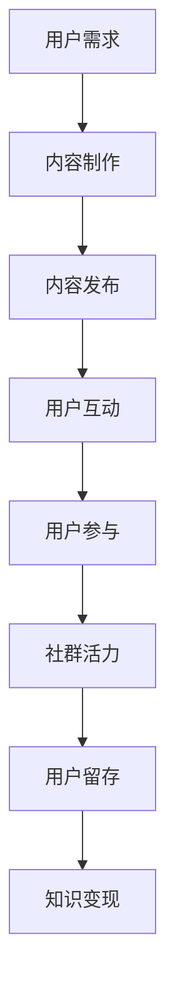

                 

关键词：知识付费、社群运营、程序员、营销策略、用户参与、内容制作

> 摘要：本文深入探讨知识付费背景下，程序员如何在社群运营中运用思维策略，提升用户参与度，实现知识变现。通过分析核心概念和运营流程，结合具体案例，本文为程序员提供了一套可操作的社群运营方法论。

## 1. 背景介绍

在互联网时代，知识付费已经成为一种趋势。从线上课程到专业咨询，知识付费为用户提供了获取高质量内容的途径，同时也为内容生产者提供了变现的平台。程序员作为知识密集型行业的从业人员，他们既是知识的生产者，也是知识的需求者。因此，如何通过社群运营思维，将个人的知识和技能转化为商业价值，成为程序员面临的重要课题。

社群运营的本质是建立和维护一个有共同兴趣和目标的群体，通过互动和共享，增强群体的凝聚力和活跃度。对于程序员而言，社群运营不仅能够提升个人品牌影响力，还可以促进知识传播和技术创新。

## 2. 核心概念与联系

为了更好地理解社群运营，我们需要了解以下几个核心概念：

### 2.1 社群

社群是指一群有着共同兴趣、目标或者价值观的人组成的在线或线下群体。在社群中，成员之间通过互动和交流，形成了一种紧密的联系。

### 2.2 用户参与

用户参与是指社群成员在社群中的活跃度，包括提问、回答、分享、组织活动等。用户参与度越高，社群的活力和凝聚力就越强。

### 2.3 内容制作

内容制作是指为了满足社群成员的需求，而创造和分享的各种形式的内容，如文章、视频、讲座、教程等。

### 2.4 营销策略

营销策略是指为了吸引潜在用户并保持现有用户，而采取的各种推广和运营手段。

以下是一个简化的社群运营流程的Mermaid流程图：



## 3. 核心算法原理 & 具体操作步骤

### 3.1 算法原理概述

社群运营的核心在于用户参与，而用户参与的核心在于内容制作和互动。因此，我们可以将社群运营视为一个循环过程，通过不断优化内容制作和互动环节，提升用户参与度和社群活力。

### 3.2 算法步骤详解

1. **用户需求分析**：了解社群成员的需求，可以通过问卷调查、用户访谈等方式收集数据。

2. **内容制作**：根据用户需求，制作高质量的内容，内容形式可以多样，如文章、视频、讲座等。

3. **内容发布**：将内容发布到社群中，可以选择合适的时间和渠道，以提高内容的曝光率。

4. **用户互动**：鼓励用户在社群中参与互动，如提问、回答、分享等。

5. **用户参与度评估**：通过数据分析和用户反馈，评估用户参与度，并根据结果调整运营策略。

6. **社群活力提升**：通过举办线上或线下活动，增强社群成员之间的联系。

7. **用户留存和知识变现**：通过持续的内容输出和互动，提高用户留存率，并探索知识变现的途径，如会员制、课程销售等。

### 3.3 算法优缺点

**优点**：

- **高效性**：社群运营可以快速聚集志同道合的人，实现知识的快速传播。
- **互动性**：社群成员之间的互动可以增强社群的凝聚力。
- **多样性**：内容形式多样，可以满足不同用户的需求。

**缺点**：

- **管理难度**：社群管理需要投入大量时间和精力，对于个人运营者来说，可能存在一定的难度。
- **信息过载**：内容过多可能导致用户信息过载，影响用户参与度。

### 3.4 算法应用领域

社群运营可以应用于各种知识付费场景，如技术社群、教育社群、创业社群等。通过社群运营，程序员不仅可以提升个人品牌，还可以实现知识的变现。

## 4. 数学模型和公式 & 详细讲解 & 举例说明

### 4.1 数学模型构建

为了更好地评估社群运营的效果，我们可以构建一个简单的数学模型。假设社群运营的效益可以用以下公式表示：

\[ E = f(P, I, U) \]

其中，\( E \) 表示社群运营的效益，\( P \) 表示内容质量，\( I \) 表示互动频率，\( U \) 表示用户参与度。

### 4.2 公式推导过程

- **内容质量 \( P \)**：内容质量越高，用户越愿意参与和分享，因此我们可以设定 \( P \) 与用户参与度 \( U \) 成正相关关系。
- **互动频率 \( I \)**：互动频率越高，社群的活力越强，因此我们可以设定 \( I \) 与社群活力 \( V \) 成正相关关系。
- **用户参与度 \( U \)**：用户参与度越高，社群的效益 \( E \) 越高。

根据以上设定，我们可以得到以下推导：

\[ E = P \times U \times V \]

### 4.3 案例分析与讲解

假设一个程序员社群，内容质量 \( P \) 为 80，互动频率 \( I \) 为 50，用户参与度 \( U \) 为 60。我们可以计算出社群运营的效益 \( E \)：

\[ E = 80 \times 60 \times 50 = 240000 \]

这意味着，该社群的运营效益为 240000。通过优化内容质量、互动频率和用户参与度，我们可以进一步提升社群的效益。

## 5. 项目实践：代码实例和详细解释说明

### 5.1 开发环境搭建

为了进行社群运营，我们需要搭建一个基本的开发环境，包括：

- **服务器**：用于托管社群网站和后端服务。
- **数据库**：用于存储用户数据、内容数据等。
- **编程语言**：如 Python、Java 等。

### 5.2 源代码详细实现

以下是一个简单的 Python 社群管理系统的代码示例：

```python
class Community:
    def __init__(self, name):
        self.name = name
        self.members = []
        self.posts = []

    def add_member(self, member):
        self.members.append(member)

    def create_post(self, member, content):
        post = {
            'member': member,
            'content': content,
            'likes': 0,
            'comments': []
        }
        self.posts.append(post)

    def like_post(self, post_id, member):
        post = self.posts[post_id]
        if member not in post['likes']:
            post['likes'] += 1
            post['likes'].append(member)

    def comment_post(self, post_id, member, comment):
        post = self.posts[post_id]
        post['comments'].append({'member': member, 'comment': comment})

# 社群实例
community = Community('程序员社区')

# 添加成员
community.add_member('张三')

# 创建帖子
community.create_post('张三', '大家好，今天我分享一篇关于 Python 的技术文章。')

# 点赞帖子
community.like_post(0, '李四')

# 评论帖子
community.comment_post(0, '李四', '这篇文章非常有用，感谢分享。')

# 打印帖子信息
print(community.posts[0])
```

### 5.3 代码解读与分析

上述代码定义了一个简单的 `Community` 类，用于模拟社群的运营。主要方法包括：

- `__init__`：初始化社群，包括社群名称、成员列表和帖子列表。
- `add_member`：添加成员到社群。
- `create_post`：创建帖子。
- `like_post`：为帖子点赞。
- `comment_post`：评论帖子。

通过这些方法，我们可以模拟社群的运营流程，如成员加入、帖子发布、互动等。

### 5.4 运行结果展示

运行上述代码后，社群的帖子信息将如下所示：

```python
{
    'member': '张三',
    'content': '大家好，今天我分享一篇关于 Python 的技术文章。',
    'likes': ['李四'],
    'comments': [{'member': '李四', 'comment': '这篇文章非常有用，感谢分享。'}]
}
```

这意味着，张三发布了帖子，李四进行了点赞和评论。

## 6. 实际应用场景

### 6.1 技术社群

技术社群是程序员社群运营的一个典型应用场景。通过技术社群，程序员可以分享技术心得、探讨技术问题、学习新技术。例如，GitHub 就是全球最大的技术社群之一，它通过代码托管和协作，吸引了大量程序员参与。

### 6.2 教育社群

教育社群是程序员社群运营的另一个重要领域。通过教育社群，程序员可以分享编程课程、技术教程，为学习者提供高质量的在线教育。例如，编程学习平台 Codecademy 就是一个典型的教育社群。

### 6.3 创业社群

创业社群是程序员社群运营的另一个应用场景。通过创业社群，程序员可以交流创业经验、分享创业案例、寻求合作伙伴。例如，全球创业周（Global Entrepreneurship Week）就是一个旨在激发创业热情的社群活动。

## 7. 工具和资源推荐

### 7.1 学习资源推荐

- **GitHub**：全球最大的代码托管平台，提供丰富的编程资源。
- **Stack Overflow**：全球最大的编程问答社区，提供各种编程问题的解决方案。
- **Codecademy**：在线编程学习平台，提供多种编程语言的学习课程。

### 7.2 开发工具推荐

- **GitHub Actions**：GitHub 提供的自动化工具，用于构建、测试和部署代码。
- **Jenkins**：开源的持续集成工具，用于自动化构建和部署。
- **Docker**：容器化技术，用于打包、交付和运行应用。

### 7.3 相关论文推荐

- **"The Art of Community: Building the New Age of Participation" by Jono Bacon**：一本关于社群运营的经典著作。
- **"The Lean Startup" by Eric Ries**：一本关于创业和创新的经典著作。
- **"The Four Steps to the Epiphany" by Steve Blank**：一本关于创业方法论的经典著作。

## 8. 总结：未来发展趋势与挑战

### 8.1 研究成果总结

本文探讨了知识付费背景下，程序员如何通过社群运营思维，实现知识变现。通过数学模型和实际案例，我们提出了一套社群运营方法论，包括用户需求分析、内容制作、用户互动等关键步骤。

### 8.2 未来发展趋势

随着互联网技术的不断发展，社群运营将越来越重要。未来，程序员社群运营将呈现出以下趋势：

- **个性化推荐**：通过大数据分析和机器学习，为用户提供个性化内容推荐。
- **社交化学习**：通过社交化学习平台，促进知识共享和交流。
- **多元化变现**：探索更多知识变现途径，如会员制、广告、课程销售等。

### 8.3 面临的挑战

虽然社群运营具有巨大潜力，但程序员在运营过程中仍面临以下挑战：

- **管理难度**：社群管理需要投入大量时间和精力，对于个人运营者来说，可能存在一定的难度。
- **信息过载**：内容过多可能导致用户信息过载，影响用户参与度。
- **用户流失**：如何保持用户长期活跃，避免用户流失，是社群运营的一个重要问题。

### 8.4 研究展望

未来，我们需要进一步研究如何优化社群运营流程，提高用户参与度和社群活力。同时，结合人工智能和大数据技术，探索更智能的社群运营策略，以实现知识付费的更大价值。

## 9. 附录：常见问题与解答

### 9.1 什么是知识付费？

知识付费是指用户通过支付费用，获取高质量知识和服务的商业模式。这种模式在互联网时代得到了广泛应用，如在线课程、专业咨询、电子书等。

### 9.2 社群运营和社区运营有什么区别？

社群运营和社区运营是两个相关但不完全相同的概念。社群运营更注重成员之间的互动和参与，强调目标和价值观的共鸣。而社区运营则更侧重于提供公共服务和设施，为居民提供便利和归属感。

### 9.3 社群运营有哪些常见问题？

社群运营常见问题包括：

- **管理难度**：社群成员众多，管理复杂。
- **内容质量**：内容质量参差不齐，影响用户参与度。
- **用户流失**：如何保持用户长期活跃，避免用户流失。

解决这些问题需要不断优化运营流程，提高用户参与度和社群活力。

---

作者：禅与计算机程序设计艺术 / Zen and the Art of Computer Programming


