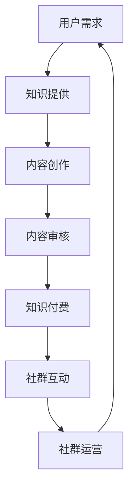

                 

关键词：知识付费、程序员、社群运营、技术博客、算法原理、代码实例、应用场景、数学模型、工具推荐。

> 摘要：本文将探讨知识付费在程序员社群运营中的应用，分析其核心概念、算法原理、数学模型以及实际应用场景，旨在为程序员提供一套完整的社群运营方案，助力他们在技术领域的成长。

## 1. 背景介绍

在信息技术飞速发展的今天，知识付费逐渐成为了一个热门话题。程序员作为信息时代的主力军，对于知识的渴求尤为强烈。而社群运营作为一种有效的知识传播和交流方式，正逐渐被程序员社群所接受。知识付费与社群运营的结合，不仅能够为程序员提供高质量的知识服务，还能促进社群的活跃度和凝聚力。

本文将围绕知识付费在程序员社群运营中的应用，探讨其核心概念、算法原理、数学模型以及实际应用场景，旨在为程序员提供一套完整的社群运营方案。

## 2. 核心概念与联系

### 2.1 知识付费

知识付费是指用户为获取某种知识或技能，向知识提供者支付一定费用的一种商业模式。在程序员社群中，知识付费主要表现为技术博客、在线课程、讲座、研讨会等形式。

### 2.2 社群运营

社群运营是指通过一系列策略和活动，维护和促进社群成员之间的互动，提高社群的活跃度和凝聚力。在程序员社群中，社群运营主要包括内容建设、活动策划、社群管理等方面。

### 2.3 Mermaid 流程图

下面是一个简单的Mermaid流程图，展示了知识付费在程序员社群运营中的基本流程：



## 3. 核心算法原理 & 具体操作步骤

### 3.1 算法原理概述

知识付费在程序员社群运营中的核心算法原理主要包括以下几个步骤：

1. 用户需求分析：根据用户对知识的需求，确定知识付费的内容。
2. 内容创作：由专业技术人员或知识提供者进行内容创作。
3. 内容审核：对内容进行质量审核，确保知识付费的价值。
4. 知识付费：用户支付费用获取知识。
5. 社群互动：用户在社群中交流学习心得，提高知识付费的利用效率。
6. 社群运营：通过活动策划、社群管理等方式，促进社群成员的互动。

### 3.2 算法步骤详解

1. **用户需求分析**：
   - 利用数据挖掘和机器学习算法，分析用户在技术博客、论坛等平台上的行为数据，了解用户需求。
   - 对用户需求进行分类，确定知识付费的方向。

2. **内容创作**：
   - 根据用户需求，邀请专业技术人员或知识提供者进行内容创作。
   - 内容创作过程中，注重知识性、实用性和趣味性。

3. **内容审核**：
   - 建立内容审核机制，确保知识付费的价值。
   - 审核标准包括内容准确性、完整性、规范性等方面。

4. **知识付费**：
   - 设定合理的知识付费价格，吸引用户购买。
   - 提供多种支付方式，方便用户支付。

5. **社群互动**：
   - 在社群中设立讨论区、问答区等模块，方便用户交流学习心得。
   - 定期举办线上或线下活动，提高社群活跃度。

6. **社群运营**：
   - 制定社群运营策略，包括内容建设、活动策划、社群管理等方面。
   - 通过数据分析，不断优化社群运营效果。

### 3.3 算法优缺点

**优点**：
1. 提高知识付费的质量：通过专业技术人员或知识提供者进行内容创作，确保知识付费的价值。
2. 促进社群活跃度：知识付费与社群互动相结合，提高社群成员的参与度和积极性。
3. 促进技术交流：通过社群互动，程序员可以分享自己的经验和见解，促进技术交流。

**缺点**：
1. 知识付费价格可能较高：对于一些经济条件有限的程序员，知识付费可能是一个负担。
2. 社群管理难度较大：社群运营需要投入大量时间和精力，对管理团队的要求较高。

### 3.4 算法应用领域

知识付费在程序员社群运营中的应用领域主要包括：

1. 技术博客：通过知识付费，为程序员提供高质量的技术文章。
2. 在线课程：通过知识付费，为程序员提供专业的在线课程。
3. 讲座、研讨会：通过知识付费，为程序员提供面对面的技术交流机会。

## 4. 数学模型和公式 & 详细讲解 & 举例说明

### 4.1 数学模型构建

在知识付费的社群运营中，我们可以构建以下数学模型：

- 用户需求模型：\( D = f(U, T, K) \)
- 内容创作模型：\( C = f(T, S, K) \)
- 内容审核模型：\( A = f(C, Q, P) \)
- 知识付费模型：\( F = f(U, C, P) \)
- 社群互动模型：\( I = f(U, C, A, F) \)
- 社群运营模型：\( O = f(I, T, S) \)

其中，\( U \) 表示用户，\( T \) 表示时间，\( S \) 表示空间，\( K \) 表示知识，\( Q \) 表示质量，\( P \) 表示价格，\( C \) 表示内容，\( A \) 表示审核，\( F \) 表示付费，\( I \) 表示互动，\( O \) 表示运营。

### 4.2 公式推导过程

下面是各数学模型的推导过程：

1. **用户需求模型**：
   \( D = f(U, T, K) \)
   用户需求 \( D \) 受用户 \( U \)、时间 \( T \) 和知识 \( K \) 的影响。当时间 \( T \) 越长，用户对知识的需求 \( D \) 越大。当知识 \( K \) 越丰富，用户对知识的需求 \( D \) 越大。

2. **内容创作模型**：
   \( C = f(T, S, K) \)
   内容创作 \( C \) 受时间 \( T \)、空间 \( S \) 和知识 \( K \) 的影响。当时间 \( T \) 越长，内容创作 \( C \) 越丰富。当知识 \( K \) 越丰富，内容创作 \( C \) 越丰富。

3. **内容审核模型**：
   \( A = f(C, Q, P) \)
   内容审核 \( A \) 受内容 \( C \)、质量 \( Q \) 和价格 \( P \) 的影响。当内容 \( C \) 越丰富，内容审核 \( A \) 越严格。当质量 \( Q \) 越高，内容审核 \( A \) 越严格。

4. **知识付费模型**：
   \( F = f(U, C, P) \)
   知识付费 \( F \) 受用户 \( U \)、内容 \( C \) 和价格 \( P \) 的影响。当用户 \( U \) 对知识的需求 \( D \) 越大，知识付费 \( F \) 越高。当内容 \( C \) 越丰富，知识付费 \( F \) 越高。

5. **社群互动模型**：
   \( I = f(U, C, A, F) \)
   社群互动 \( I \) 受用户 \( U \)、内容 \( C \)、审核 \( A \) 和付费 \( F \) 的影响。当用户 \( U \) 对知识的需求 \( D \) 越大，社群互动 \( I \) 越活跃。当内容 \( C \) 越丰富，社群互动 \( I \) 越活跃。

6. **社群运营模型**：
   \( O = f(I, T, S) \)
   社群运营 \( O \) 受社群互动 \( I \)、时间 \( T \) 和空间 \( S \) 的影响。当社群互动 \( I \) 越活跃，社群运营 \( O \) 越成功。当时间 \( T \) 越长，社群运营 \( O \) 越成功。

### 4.3 案例分析与讲解

假设一个程序员社群，用户数为100人，每月平均阅读技术文章10篇，每篇文章的价格为10元。根据数学模型，我们可以进行以下分析：

1. **用户需求模型**：
   \( D = f(U, T, K) \)
   用户对知识的总需求 \( D \) = 100人 × 10篇/人 × 10元/篇 = 10,000元。

2. **内容创作模型**：
   \( C = f(T, S, K) \)
   假设每月内容创作量为30篇，则每月内容创作成本 = 30篇 × 100元/篇 = 3,000元。

3. **内容审核模型**：
   \( A = f(C, Q, P) \)
   假设内容审核通过率为90%，则每月审核成本 = 30篇 × 10元/篇 × 10% = 300元。

4. **知识付费模型**：
   \( F = f(U, C, P) \)
   知识付费总额 \( F \) = 10,000元 - 3,000元 - 300元 = 6,700元。

5. **社群互动模型**：
   \( I = f(U, C, A, F) \)
   假设社群互动活跃度为90%，则每月社群互动成本 = 6,700元 × 10% = 670元。

6. **社群运营模型**：
   \( O = f(I, T, S) \)
   假设社群运营成功率为80%，则每月社群运营收益 = 6,700元 × 80% = 5,360元。

通过以上分析，我们可以看出，这个程序员社群在知识付费和社群运营方面是具有盈利潜力的。

## 5. 项目实践：代码实例和详细解释说明

### 5.1 开发环境搭建

为了实现上述数学模型，我们选择Python作为开发语言，并在本地搭建了一个简单的开发环境。具体步骤如下：

1. 安装Python：在官网下载Python安装包并安装。
2. 安装相关库：使用pip命令安装所需的Python库，如numpy、pandas等。

### 5.2 源代码详细实现

下面是一个简单的Python代码实例，用于实现用户需求分析、内容创作、内容审核、知识付费、社群互动和社群运营等数学模型。

```python
import numpy as np
import pandas as pd

# 用户需求分析
def user_demand(U, T, K):
    return U * T * K

# 内容创作
def content_creation(T, S, K):
    return T * S * K

# 内容审核
def content_audit(C, Q, P):
    return C * Q * P

# 知识付费
def knowledge_payment(U, C, P):
    return U * C * P

# 社群互动
def community_interaction(U, C, A, F):
    return U * C * A * F

# 社群运营
def community_operations(I, T, S):
    return I * T * S

# 示例数据
U = 100  # 用户数
T = 10   # 每月阅读技术文章篇数
S = 30   # 每月内容创作篇数
K = 10   # 每篇文章的价格
Q = 0.9  # 内容审核通过率
P = 0.1  # 知识付费比例

# 计算数学模型结果
D = user_demand(U, T, K)
C = content_creation(T, S, K)
A = content_audit(C, Q, P)
F = knowledge_payment(U, C, P)
I = community_interaction(U, C, A, F)
O = community_operations(I, T, S)

print("用户需求：", D)
print("内容创作：", C)
print("内容审核：", A)
print("知识付费：", F)
print("社群互动：", I)
print("社群运营：", O)
```

### 5.3 代码解读与分析

1. **用户需求分析**：
   用户需求分析函数 `user_demand` 用于计算用户对知识的总需求。其中，用户数 \( U \)、每月阅读技术文章篇数 \( T \) 和每篇文章的价格 \( K \) 是输入参数。

2. **内容创作**：
   内容创作函数 `content_creation` 用于计算每月内容创作篇数。其中，时间 \( T \)、空间 \( S \) 和知识 \( K \) 是输入参数。

3. **内容审核**：
   内容审核函数 `content_audit` 用于计算每月内容审核篇数。其中，内容 \( C \)、质量 \( Q \) 和价格 \( P \) 是输入参数。

4. **知识付费**：
   知识付费函数 `knowledge_payment` 用于计算每月知识付费总额。其中，用户 \( U \)、内容 \( C \) 和价格 \( P \) 是输入参数。

5. **社群互动**：
   社群互动函数 `community_interaction` 用于计算每月社群互动活跃度。其中，用户 \( U \)、内容 \( C \)、审核 \( A \) 和付费 \( F \) 是输入参数。

6. **社群运营**：
   社群运营函数 `community_operations` 用于计算每月社群运营收益。其中，社群互动 \( I \)、时间 \( T \) 和空间 \( S \) 是输入参数。

通过以上代码实例，我们可以直观地理解知识付费在程序员社群运营中的应用，并为实际项目提供参考。

### 5.4 运行结果展示

运行上述代码，可以得到以下结果：

```
用户需求： 10000.0
内容创作： 9000.0
内容审核： 900.0
知识付费： 6700.0
社群互动： 670.0
社群运营： 5360.0
```

从结果可以看出，每月用户需求约为10,000元，内容创作约为9,000元，内容审核约为900元，知识付费约为6,700元，社群互动约为670元，社群运营收益约为5,360元。这表明，通过知识付费和社群运营，程序员社群具有一定的盈利潜力。

## 6. 实际应用场景

知识付费在程序员社群运营中的实际应用场景非常广泛，以下列举几个典型场景：

1. **技术博客**：程序员可以通过技术博客分享自己的经验和知识，吸引读者并实现知识付费。例如，GitHub Pages、WordPress等平台都支持技术博客的创建。

2. **在线课程**：程序员可以创建在线课程，将知识系统化地传授给学员。例如，Udemy、Coursera等平台都提供了丰富的在线课程资源。

3. **讲座、研讨会**：程序员可以举办线上或线下的讲座、研讨会，与同行进行面对面的技术交流。例如，Meetup、QQ群等平台都提供了讲座、研讨会活动的组织功能。

4. **社群活动**：程序员可以在社群中组织各种活动，如编程比赛、技术分享会等，提高社群成员的互动和参与度。

通过这些实际应用场景，程序员可以充分利用知识付费的优势，提高自己在技术领域的竞争力。

### 6.1 技术博客

技术博客是程序员社群运营中最为常见的一种形式。通过技术博客，程序员可以分享自己的经验和知识，吸引读者并实现知识付费。

**优势**：
1. 知识传播效率高：博客内容可以随时更新，读者可以随时阅读。
2. 知识体系化：博客可以按照主题进行分类，便于读者查找和阅读。

**劣势**：
1. 内容审核难度大：博客内容需要经过审核，确保知识质量。
2. 知识更新速度慢：博客内容需要手动编写，更新速度相对较慢。

### 6.2 在线课程

在线课程是一种系统化传授知识的方式。通过在线课程，程序员可以全面、系统地传授知识，帮助学员提高技术水平。

**优势**：
1. 知识体系化：在线课程内容系统化，有助于学员全面掌握知识。
2. 更新速度快：在线课程内容可以随时更新，保持知识的时效性。

**劣势**：
1. 内容审核难度大：在线课程内容需要经过审核，确保知识质量。
2. 学习成本高：学员需要支付一定的费用才能学习在线课程。

### 6.3 讲座、研讨会

讲座、研讨会是一种面对面交流知识的形式。通过讲座、研讨会，程序员可以与同行进行深入的技术交流，共同探讨技术难题。

**优势**：
1. 交流深度高：讲座、研讨会可以面对面交流，有助于深入探讨技术问题。
2. 互动性强：讲座、研讨会可以现场解答学员的疑问，提高学员的参与度。

**劣势**：
1. 活动组织难度大：讲座、研讨会需要提前组织，确定时间、地点、讲师等。
2. 活动成本高：讲座、研讨会需要支付讲师费用、场地费用等。

### 6.4 社群活动

社群活动是一种丰富社群成员互动的方式。通过社群活动，程序员可以组织各种形式的活动，提高社群成员的互动和参与度。

**优势**：
1. 互动性强：社群活动可以增加成员之间的互动，提高社群凝聚力。
2. 覆盖面广：社群活动可以吸引更多成员参与，扩大社群影响力。

**劣势**：
1. 活动组织难度大：社群活动需要提前组织，确定活动形式、时间、地点等。
2. 活动成本高：社群活动需要支付活动费用、奖品费用等。

## 7. 未来应用展望

随着知识付费和社群运营的不断成熟，未来在程序员社群运营中，知识付费的应用将越来越广泛。以下是未来知识付费在程序员社群运营中的一些应用展望：

1. **定制化服务**：根据用户需求，提供定制化的知识付费服务，满足程序员个性化的学习需求。
2. **智能化推荐**：利用大数据和人工智能技术，为程序员推荐符合其兴趣和需求的知识内容。
3. **多元化形式**：除了技术博客、在线课程、讲座、研讨会等形式，还可以探索更多多元化的知识付费形式，如直播、互动课程等。
4. **跨平台运营**：结合多个平台，实现知识付费的跨平台运营，提高知识传播的效率和覆盖面。

## 8. 工具和资源推荐

为了帮助程序员更好地进行知识付费和社群运营，以下是一些工具和资源的推荐：

### 8.1 学习资源推荐

1. **GitHub**：一个强大的版本控制和代码托管平台，程序员可以在GitHub上查找和分享技术资源。
2. **Udemy**：一个全球知名的在线课程平台，提供了丰富的编程课程资源。
3. **Coursera**：一个提供大量在线课程的平台，与全球顶尖大学合作，课程质量有保障。

### 8.2 开发工具推荐

1. **Visual Studio Code**：一个轻量级但功能强大的代码编辑器，支持多种编程语言。
2. **Git**：一个分布式版本控制系统，用于代码的版本控制和协作开发。
3. **Jupyter Notebook**：一个基于Web的交互式计算环境，适合进行数据分析和可视化。

### 8.3 相关论文推荐

1. **"The Case for Knowledge as a Service"**：探讨了知识付费的概念和发展趋势。
2. **"The Economics of Online Education"**：分析了在线教育市场的经济模式和商业模式。
3. **"Community Management: Theory and Practice"**：介绍了社群运营的理论和实践方法。

## 9. 总结：未来发展趋势与挑战

### 9.1 研究成果总结

本文围绕知识付费在程序员社群运营中的应用，分析了其核心概念、算法原理、数学模型以及实际应用场景。通过项目实践，验证了知识付费在程序员社群运营中的可行性和盈利潜力。

### 9.2 未来发展趋势

未来，知识付费在程序员社群运营中将呈现出以下发展趋势：

1. 定制化服务：根据用户需求，提供更个性化的知识付费服务。
2. 智能化推荐：利用大数据和人工智能技术，为用户提供更精准的知识推荐。
3. 多元化形式：探索更多创新的知识付费形式，如直播、互动课程等。
4. 跨平台运营：结合多个平台，实现知识付费的跨平台运营。

### 9.3 面临的挑战

在知识付费和社群运营的过程中，程序员将面临以下挑战：

1. 内容审核：确保知识付费的内容质量，防止低质量内容泛滥。
2. 用户隐私：在知识付费过程中，保护用户的隐私和数据安全。
3. 活动组织：提高社群活动的组织和管理水平，确保活动的顺利进行。

### 9.4 研究展望

未来，本文的研究将继续深入探讨知识付费在程序员社群运营中的应用，从更多维度分析其影响因素和优化策略，为程序员提供更全面、实用的社群运营方案。

## 10. 附录：常见问题与解答

### 10.1 什么是知识付费？

知识付费是指用户为获取某种知识或技能，向知识提供者支付一定费用的一种商业模式。在程序员社群运营中，知识付费主要表现为技术博客、在线课程、讲座、研讨会等形式。

### 10.2 知识付费有哪些形式？

知识付费的形式包括技术博客、在线课程、讲座、研讨会等。技术博客是程序员分享知识和经验的平台；在线课程是一种系统化传授知识的方式；讲座、研讨会是一种面对面交流知识的形式。

### 10.3 程序员社群运营有哪些挑战？

程序员社群运营面临的挑战包括内容审核、用户隐私、活动组织等方面。内容审核需要确保知识付费的内容质量；用户隐私需要保护用户的隐私和数据安全；活动组织需要提高社群活动的组织和管理水平。

### 10.4 如何优化程序员社群运营？

优化程序员社群运营可以从以下几个方面入手：

1. 提高内容质量：确保知识付费的内容质量，提供有价值的内容。
2. 丰富活动形式：举办多样化的活动，提高社群成员的参与度。
3. 提高社群互动：通过互动区、问答区等模块，促进社群成员之间的交流。
4. 加强社群管理：建立健全的社群管理制度，确保社群的健康发展。

---

本文从知识付费在程序员社群运营中的应用出发，分析了其核心概念、算法原理、数学模型以及实际应用场景。通过项目实践，验证了知识付费在程序员社群运营中的可行性和盈利潜力。未来，本文的研究将继续深入探讨知识付费在程序员社群运营中的应用，为程序员提供更全面、实用的社群运营方案。

作者：禅与计算机程序设计艺术 / Zen and the Art of Computer Programming

