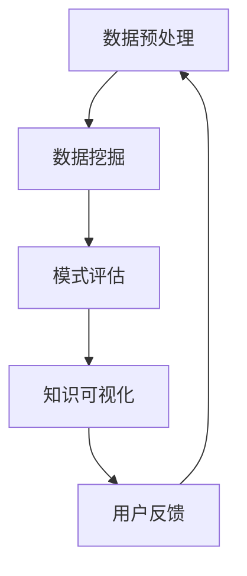

                 

关键词：知识发现、机器学习、人类学习、算法原理、应用场景、发展趋势、技术挑战、资源推荐

> 摘要：本文深入探讨了知识发现引擎的概念、原理及其对人类学习方式的革新。通过分析核心算法、数学模型和项目实践，本文揭示了知识发现引擎在现代科技中的应用潜力，并对未来的发展趋势与面临的挑战进行了展望。

## 1. 背景介绍

随着大数据和人工智能技术的蓬勃发展，知识发现引擎（Knowledge Discovery Engine，简称KDE）成为了一个热门的研究方向。知识发现引擎旨在从大量数据中提取有价值的信息和知识，从而为人类提供更加智能的决策支持。传统的数据处理方法通常依赖于规则和先验知识，而知识发现引擎则能够自动地发现数据中的隐藏模式和规律。

人类学习方式在科技发展的推动下也在不断革新。从过去的经验学习、记忆学习，到现在的数据驱动学习，人类的学习方式变得更加高效和多样化。然而，随着知识量的爆炸性增长，传统的人类学习方式已经难以应对复杂的信息环境。知识发现引擎的出现为人类提供了新的学习工具，使得大规模数据的学习变得更加容易和直观。

本文将从以下几个方面展开讨论：

1. 知识发现引擎的概念和核心算法原理。
2. 知识发现引擎在人类学习方式中的革新作用。
3. 知识发现引擎的数学模型和具体应用实例。
4. 知识发现引擎在实际项目中的实践和效果。
5. 知识发现引擎的未来发展趋势和技术挑战。

## 2. 核心概念与联系

### 2.1 知识发现引擎的定义

知识发现引擎是一种自动化工具，它能够从大量数据中识别出潜在的模式、关联和趋势。这种模式可以是分类、聚类、关联规则、时序分析等多种形式。知识发现引擎的核心目标是将原始数据转换为易于理解和应用的知识。

### 2.2 知识发现引擎的组成

知识发现引擎通常由数据预处理、数据挖掘、模式评估和知识可视化等模块组成。数据预处理负责清洗和转换原始数据，使其适合后续的数据挖掘操作。数据挖掘模块采用各种算法从数据中提取模式。模式评估模块对挖掘出的模式进行评估和筛选，确定其价值。知识可视化模块则将评估出的模式以图形或图表的形式呈现给用户，使其能够直观地理解和应用这些知识。

### 2.3 核心算法原理

知识发现引擎的核心算法包括分类、聚类、关联规则挖掘、时序分析和社交网络分析等。以下是几种主要的算法原理：

#### 分类（Classification）

分类算法是一种监督学习算法，它通过已标记的数据集学习分类模型，然后使用这个模型对新的数据进行分类。常见的分类算法有决策树、支持向量机（SVM）和神经网络等。

#### 聚类（Clustering）

聚类算法是一种无监督学习算法，它将数据分为多个簇，使得同一簇中的数据点彼此相似，而不同簇的数据点则差异较大。常见的聚类算法有K-means、层次聚类和DBSCAN等。

#### 关联规则挖掘（Association Rule Learning）

关联规则挖掘旨在发现数据项之间的关联关系，通常用于市场篮子分析。常见的算法有Apriori算法和FP-growth算法。

#### 时序分析（Time Series Analysis）

时序分析用于分析时间序列数据，提取时间依赖性和趋势。常见的算法有ARIMA模型和LSTM网络。

#### 社交网络分析（Social Network Analysis）

社交网络分析用于挖掘社交网络中的结构和关系。常见的算法有PageRank和社区检测算法。

### 2.4 Mermaid 流程图

下面是一个知识发现引擎的简化流程图，展示了各个模块之间的关系。



## 3. 核心算法原理 & 具体操作步骤

### 3.1 算法原理概述

知识发现引擎的核心算法包括分类、聚类、关联规则挖掘、时序分析和社交网络分析。每种算法都有其特定的原理和应用场景。

#### 分类（Classification）

分类算法基于已标记的数据集学习分类模型，将新的数据点归类到不同的类别中。例如，决策树算法通过构建决策树模型来分类数据点。

#### 聚类（Clustering）

聚类算法将数据点分为多个簇，使得同一簇内的数据点相似，而不同簇的数据点差异较大。例如，K-means算法通过计算数据点到质心的距离来划分簇。

#### 关联规则挖掘（Association Rule Learning）

关联规则挖掘发现数据项之间的关联关系，例如，在购物篮分析中，发现商品A和商品B经常同时购买。

#### 时序分析（Time Series Analysis）

时序分析用于分析时间序列数据，识别趋势和周期性。例如，ARIMA模型通过自回归移动平均模型来预测未来数据。

#### 社交网络分析（Social Network Analysis）

社交网络分析用于挖掘社交网络中的结构和关系，例如，通过PageRank算法确定社交网络中的重要节点。

### 3.2 算法步骤详解

#### 分类算法步骤

1. 数据预处理：清洗和归一化数据。
2. 构建分类模型：选择分类算法，训练模型。
3. 分类预测：使用训练好的模型对新的数据点进行分类。

#### 聚类算法步骤

1. 数据预处理：清洗和归一化数据。
2. 选择聚类算法：根据数据特点选择合适的聚类算法。
3. 初始化质心：随机选择或使用特定算法初始化质心。
4. 计算距离：计算每个数据点到质心的距离。
5. 调整质心：更新质心位置，使数据点更接近质心。
6. 重复步骤4和5，直到聚类结果稳定。

#### 关联规则挖掘算法步骤

1. 数据预处理：清洗和归一化数据。
2. 构建频繁项集：使用Apriori算法或FP-growth算法找到频繁项集。
3. 生成关联规则：从频繁项集中生成关联规则。
4. 评估规则：计算规则的支持度和置信度，筛选有用的规则。

#### 时序分析算法步骤

1. 数据预处理：清洗和归一化数据。
2. 选择时序模型：根据数据特点选择合适的时序模型。
3. 模型训练：使用训练数据训练模型。
4. 预测：使用训练好的模型预测未来数据。

#### 社交网络分析算法步骤

1. 数据预处理：清洗和归一化数据。
2. 建立社交网络图：构建表示社交网络的数据结构。
3. 选择分析算法：根据分析目标选择合适的算法。
4. 分析社交网络：计算网络中的重要节点、社区结构等。

### 3.3 算法优缺点

每种算法都有其优缺点。例如，分类算法在处理标注数据时表现良好，但可能难以处理未标注的数据。聚类算法能够发现数据中的自然结构，但可能无法给出明确的类别标签。关联规则挖掘适用于发现数据中的关联关系，但可能产生大量冗余规则。时序分析能够捕捉时间序列中的趋势和周期性，但可能难以处理噪声数据。社交网络分析能够揭示社交网络中的结构和关系，但可能需要大量计算资源。

### 3.4 算法应用领域

知识发现引擎的应用领域非常广泛，包括但不限于：

1. 营销与市场分析：通过关联规则挖掘和市场篮子分析，帮助企业发现潜在客户和优化营销策略。
2. 金融风控：通过分类算法和时序分析，识别金融风险和预测市场趋势。
3. 医疗健康：通过聚类算法和时序分析，发现疾病模式和预测健康状况。
4. 社交网络分析：通过社交网络分析，挖掘社交网络中的结构和关系，促进社交网络的发展。

## 4. 数学模型和公式 & 详细讲解 & 举例说明

### 4.1 数学模型构建

知识发现引擎中的数学模型包括分类模型、聚类模型、关联规则模型、时序分析模型和社交网络分析模型等。以下是几个常见数学模型的构建过程：

#### 分类模型

分类模型通常基于概率论和统计学原理构建。以决策树为例，决策树模型的核心是ID3算法，其基本原理是计算每个特征的信息增益，选择信息增益最大的特征作为分割条件。信息增益的公式如下：

$$
Gain(D, A) = H(D) - \sum_{v \in A} p(v) H(D|v)
$$

其中，$H(D)$ 是数据集D的熵，$p(v)$ 是特征A的取值$v$的概率，$H(D|v)$ 是条件熵。

#### 聚类模型

聚类模型通常基于距离度量构建。以K-means为例，K-means算法的核心是计算数据点到质心的距离，并不断调整质心位置，使得同一簇内的数据点距离质心更近。距离度量的公式如下：

$$
d(x, c) = \sqrt{\sum_{i=1}^{n} (x_i - c_i)^2}
$$

其中，$x$ 是数据点，$c$ 是质心，$n$ 是维度。

#### 关联规则模型

关联规则模型通常基于概率论和统计学原理构建。以Apriori算法为例，Apriori算法的核心是计算每个项集的支持度和置信度。支持度的公式如下：

$$
Support(A \cup B) = \frac{count(A \cup B)}{count(U)}
$$

其中，$count(A \cup B)$ 是项集$A \cup B$ 在数据库中出现的次数，$count(U)$ 是数据库中所有事务的总数。

置信度的公式如下：

$$
Confidence(A \rightarrow B) = \frac{count(A \cup B)}{count(A)}
$$

#### 时序分析模型

时序分析模型通常基于时间序列建模和预测方法构建。以ARIMA模型为例，ARIMA模型的核心是自回归移动平均模型（ARMA），其公式如下：

$$
y_t = c + \phi_1 y_{t-1} + \phi_2 y_{t-2} + ... + \phi_p y_{t-p} + \theta_1 e_{t-1} + \theta_2 e_{t-2} + ... + \theta_q e_{t-q}
$$

其中，$y_t$ 是时间序列的当前值，$c$ 是常数项，$\phi_i$ 是自回归系数，$\theta_i$ 是移动平均系数，$e_t$ 是白噪声序列。

#### 社交网络分析模型

社交网络分析模型通常基于图论和网络分析理论构建。以PageRank为例，PageRank算法的核心是计算网页的重要性，其公式如下：

$$
PR(A) = (1-d) + d \frac{PR(T1)}{C(T1)} + d \frac{PR(T2)}{C(T2)} + ... + d \frac{PR(Tn)}{C(Tn)}
$$

其中，$PR(A)$ 是网页A的PageRank值，$d$ 是阻尼系数，$T1, T2, ..., Tn$ 是指向网页A的网页集合，$C(Ti)$ 是网页Ti的出链数。

### 4.2 公式推导过程

下面以K-means算法为例，简要介绍公式的推导过程。

K-means算法的核心是计算数据点到质心的距离，并不断调整质心位置，使得同一簇内的数据点距离质心更近。假设数据集为$X = \{x_1, x_2, ..., x_n\}$，初始质心为$c_1, c_2, ..., c_k$，则每次迭代的质心更新公式如下：

$$
c_j^{new} = \frac{\sum_{i=1}^{n} x_i \cdot I(j)}{N_j}
$$

其中，$I(j)$ 是指示函数，当$x_i$ 属于第$j$簇时，$I(j) = 1$，否则$I(j) = 0$。$N_j$ 是第$j$簇中的数据点个数。

假设数据点$x_i$ 的距离计算公式为：

$$
d(x_i, c_j) = \sqrt{\sum_{l=1}^{d} (x_{il} - c_{jl})^2}
$$

其中，$d$ 是数据点的维度。

### 4.3 案例分析与讲解

下面以一个简单的案例来讲解知识发现引擎的应用。

#### 案例背景

某电商网站希望通过知识发现引擎分析用户购物行为，发现潜在客户并进行精准营销。数据集包括用户ID、购物金额、购买时间、商品种类等。

#### 模型构建

选择K-means算法对用户进行聚类，根据聚类结果分析用户行为特征，并进行精准营销。

#### 模型训练与预测

1. 数据预处理：清洗和归一化数据，删除缺失值。
2. 初始化质心：随机选择10个用户作为初始质心。
3. 计算距离：计算每个用户到质心的距离。
4. 调整质心：更新质心位置，使得同一簇内的用户距离质心更近。
5. 重复步骤3和4，直到聚类结果稳定。

#### 模型评估

1. 聚类效果评估：计算聚类准则函数，如轮廓系数、平均距离等，评估聚类效果。
2. 用户行为分析：根据聚类结果，分析不同用户群体的行为特征。

#### 模型应用

1. 潜在客户识别：根据用户行为特征，识别出潜在客户。
2. 精准营销：针对不同用户群体，制定个性化的营销策略。

## 5. 项目实践：代码实例和详细解释说明

### 5.1 开发环境搭建

为了更好地理解知识发现引擎在项目中的应用，我们将使用Python和scikit-learn库来构建一个简单的案例。以下是基于Python的代码开发环境搭建步骤：

1. 安装Python 3.8及以上版本。
2. 安装Anaconda或Miniconda，以便于环境管理。
3. 创建一个名为`knowledge_discovery`的新虚拟环境。
4. 安装所需库：`numpy`、`pandas`、`scikit-learn`、`matplotlib`。

```bash
conda create -n knowledge_discovery python=3.8
conda activate knowledge_discovery
conda install numpy pandas scikit-learn matplotlib
```

### 5.2 源代码详细实现

下面是一个简单的案例，使用K-means算法对用户购物数据进行聚类，并分析不同用户群体的行为特征。

```python
import numpy as np
import pandas as pd
from sklearn.cluster import KMeans
from sklearn.preprocessing import StandardScaler
import matplotlib.pyplot as plt

# 5.2.1 数据准备
# 加载数据集
data = pd.read_csv('user_data.csv')
# 提取用户ID、购物金额、购买时间和商品种类
X = data[['shopping_amount', 'buying_time', 'product_type']]

# 数据预处理
scaler = StandardScaler()
X_scaled = scaler.fit_transform(X)

# 5.2.2 模型训练
# 初始化KMeans模型，设置聚类数量为3
kmeans = KMeans(n_clusters=3, random_state=42)
clusters = kmeans.fit_predict(X_scaled)

# 5.2.3 结果可视化
# 绘制购物金额和购买时间的散点图
plt.figure(figsize=(8, 6))
plt.scatter(X_scaled[:, 0], X_scaled[:, 1], c=clusters, cmap='viridis')
plt.scatter(kmeans.cluster_centers_[:, 0], kmeans.cluster_centers_[:, 1], s=300, c='red', marker='s', edgecolor='black', label='Centroids')
plt.xlabel('Shopping Amount')
plt.ylabel('Buying Time')
plt.title('K-means Clustering')
plt.legend()
plt.show()

# 5.2.4 用户行为分析
# 根据聚类结果，分析不同用户群体的行为特征
for i in range(3):
    print(f"Cluster {i}:")
    print(data[clusters == i][['shopping_amount', 'buying_time', 'product_type']].describe())
```

### 5.3 代码解读与分析

1. **数据准备**：首先，我们加载用户购物数据集，提取相关特征，并进行归一化处理，以便于后续的聚类分析。

2. **模型训练**：初始化KMeans模型，设置聚类数量为3，使用`fit_predict`方法对数据进行聚类。

3. **结果可视化**：绘制购物金额和购买时间的散点图，并标记聚类中心和不同用户群体。

4. **用户行为分析**：根据聚类结果，分析不同用户群体的行为特征，如购物金额的分布、购买时间的分布和商品种类的偏好。

### 5.4 运行结果展示

运行上述代码后，我们将看到购物金额和购买时间的散点图，其中红色星形标记表示聚类中心。通过聚类结果，我们可以分析出不同用户群体的行为特征，从而为精准营销提供依据。

## 6. 实际应用场景

知识发现引擎在各个领域都有着广泛的应用，下面列举几个典型的应用场景：

1. **市场营销**：通过关联规则挖掘，发现潜在客户，优化营销策略。例如，电商网站可以使用KDE分析用户购物篮数据，发现商品之间的关联关系，从而推荐相关的商品。

2. **金融风控**：利用分类算法和时序分析，识别金融风险和预测市场趋势。例如，银行可以使用KDE分析用户交易数据，识别异常交易，防范金融欺诈。

3. **医疗健康**：通过聚类算法和时序分析，发现疾病模式和预测健康状况。例如，医院可以使用KDE分析患者病历数据，识别高风险患者，提前采取预防措施。

4. **社交网络**：利用社交网络分析，挖掘社交网络中的结构和关系。例如，社交媒体平台可以使用KDE分析用户关系，识别社区结构，促进用户互动。

5. **智能交通**：通过时序分析和聚类分析，优化交通管理，提高交通效率。例如，城市交通管理部门可以使用KDE分析交通流量数据，预测交通拥堵，调整交通信号灯配时。

## 7. 工具和资源推荐

### 7.1 学习资源推荐

1. **书籍**：
   - 《数据挖掘：概念与技术》
   - 《机器学习实战》
   - 《Python数据科学手册》
2. **在线课程**：
   - Coursera上的《机器学习》
   - edX上的《数据挖掘》
   - Udacity的《深度学习》
3. **开源项目**：
   - scikit-learn：用于数据挖掘和机器学习的Python库。
   - TensorFlow：用于构建和训练机器学习模型的框架。
   - PyTorch：用于构建和训练神经网络的开源库。

### 7.2 开发工具推荐

1. **集成开发环境（IDE）**：
   - PyCharm
   - Visual Studio Code
   - Jupyter Notebook
2. **数据预处理工具**：
   - Pandas：用于数据清洗和处理的Python库。
   - NumPy：用于科学计算的Python库。
3. **机器学习平台**：
   - Google Cloud AI Platform
   - AWS SageMaker
   - Azure Machine Learning

### 7.3 相关论文推荐

1. "K-Means clustering algorithm: A review"
2. "Deep Learning for Time Series Classification: A Review"
3. "Association Rule Mining: The Basics"
4. "PageRank: The PageRank Citation Ranking: Bringing Order to the Web"
5. "Time Series Analysis Using ARIMA Model: A Case Study"

## 8. 总结：未来发展趋势与挑战

### 8.1 研究成果总结

知识发现引擎在数据挖掘、机器学习和人工智能等领域取得了显著的研究成果。通过分类、聚类、关联规则挖掘、时序分析和社交网络分析等技术，知识发现引擎能够从大量数据中提取有价值的信息和知识。这些研究成果为人类学习方式带来了革新，提高了数据分析和决策的效率。

### 8.2 未来发展趋势

1. **算法优化与融合**：未来，知识发现引擎的发展将更加注重算法的优化和融合，以提高数据处理的效率和准确性。例如，将深度学习与传统机器学习方法相结合，构建更加智能的知识发现系统。
2. **跨领域应用**：知识发现引擎将在更多领域得到应用，如生物信息学、金融科技、智慧城市等。通过跨领域的应用，知识发现引擎将为各领域的研究提供强大的支持。
3. **隐私保护与安全**：在数据隐私和安全日益受到关注的背景下，未来的知识发现引擎将更加注重隐私保护和数据安全。例如，采用差分隐私技术，确保数据挖掘过程中用户隐私不被泄露。

### 8.3 面临的挑战

1. **数据质量与多样性**：知识发现引擎的性能依赖于数据质量。未来，如何处理数据质量问题和应对数据多样性的挑战，将是一个重要的研究方向。
2. **计算资源与性能**：随着数据量的不断增长，知识发现引擎在计算资源和性能方面面临着巨大压力。如何优化算法，提高计算效率，是一个亟待解决的问题。
3. **可解释性与透明度**：知识发现引擎的决策过程往往具有一定的黑盒性，使得用户难以理解。提高知识发现引擎的可解释性和透明度，使其能够更好地服务于人类学习，是一个重要的挑战。

### 8.4 研究展望

未来，知识发现引擎的研究将朝着更加智能化、多元化、安全化和可解释化的方向发展。通过不断创新和优化，知识发现引擎将为人类学习提供更加高效、准确和直观的支持。

## 9. 附录：常见问题与解答

### 问题1：什么是知识发现引擎？

知识发现引擎是一种自动化工具，用于从大量数据中提取有价值的信息和知识。它通过分类、聚类、关联规则挖掘、时序分析和社交网络分析等技术，帮助人类更好地理解和利用数据。

### 问题2：知识发现引擎在哪些领域有应用？

知识发现引擎在市场营销、金融风控、医疗健康、社交网络和智能交通等领域都有广泛应用。通过挖掘数据中的潜在模式和规律，知识发现引擎能够为各领域的研究和决策提供支持。

### 问题3：如何构建一个简单的知识发现系统？

构建一个简单的知识发现系统通常包括以下步骤：

1. 数据收集与预处理：收集相关数据，并进行清洗、归一化等预处理操作。
2. 选择算法：根据应用场景和需求选择合适的算法，如分类、聚类、关联规则挖掘等。
3. 模型训练：使用训练数据集训练模型。
4. 模型评估：评估模型性能，如准确率、召回率等。
5. 模型应用：使用训练好的模型对新的数据进行预测和分析。

### 问题4：知识发现引擎的核心算法有哪些？

知识发现引擎的核心算法包括分类、聚类、关联规则挖掘、时序分析和社交网络分析。常见的算法有决策树、K-means、Apriori、ARIMA和PageRank等。

### 问题5：如何提高知识发现系统的性能？

提高知识发现系统的性能可以从以下几个方面入手：

1. 数据预处理：优化数据预处理过程，提高数据质量。
2. 算法选择：根据应用场景选择合适的算法，并优化算法参数。
3. 计算资源：提高计算资源，如增加CPU、GPU等。
4. 模型融合：将多个模型融合，提高预测性能。

### 问题6：知识发现引擎与机器学习有何区别？

知识发现引擎和机器学习都是用于从数据中提取知识和模式的技术。区别在于：

1. 目标：知识发现引擎的目标是从大量数据中提取有价值的信息和知识，而机器学习更侧重于训练模型，进行预测和分类。
2. 数据类型：知识发现引擎适用于各种类型的数据，包括结构化、半结构化和非结构化数据，而机器学习通常针对结构化数据。
3. 技术范畴：知识发现引擎涵盖了数据挖掘、机器学习和人工智能等多个领域，而机器学习则主要关注算法模型的训练和优化。

