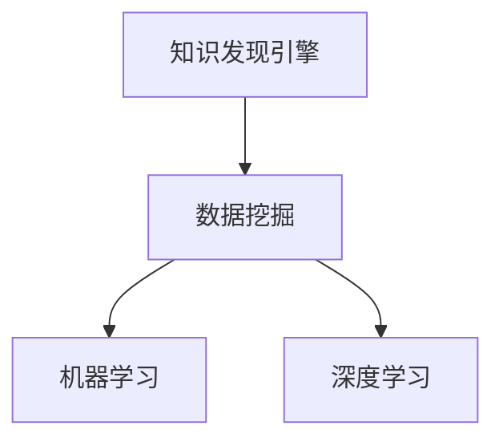

                 

关键词：知识发现引擎、医疗诊断、算法原理、数学模型、项目实践、应用场景、未来展望

## 摘要

本文深入探讨了知识发现引擎在医疗诊断领域中的应用。知识发现引擎是一种利用人工智能技术从大量医疗数据中自动提取有用信息和知识的重要工具。本文首先介绍了知识发现引擎的核心概念和基本原理，然后详细阐述了其在医疗诊断中的具体应用。通过对算法原理、数学模型、项目实践等方面的详细分析，本文旨在为读者提供一幅清晰的画面，展示知识发现引擎如何助力医疗诊断，提高诊断准确性和效率。同时，本文还展望了知识发现引擎在医疗诊断领域的未来应用前景。

## 1. 背景介绍

随着医疗技术的不断发展，医疗数据量呈现爆炸式增长。这些数据包括患者的病历记录、实验室检查结果、医学影像等。如何有效地利用这些数据，提高医疗诊断的准确性和效率，成为当前医学领域的重要挑战。知识发现引擎作为一种人工智能技术，具备从海量数据中自动提取有用信息和知识的能力，为解决这一挑战提供了新的思路。

知识发现引擎的基本原理是通过数据挖掘技术，从大量医疗数据中自动识别模式、关联规则和预测模型，从而为医疗诊断提供有力支持。知识发现引擎通常包括数据预处理、模式识别、知识提取、知识表示和知识应用等环节。其核心在于利用人工智能技术，实现对数据的深度分析和理解。

在医疗诊断领域，知识发现引擎的应用具有重要意义。首先，知识发现引擎可以辅助医生进行诊断，提高诊断的准确性和效率。其次，知识发现引擎可以帮助发现新的医学规律和关联，为医学研究提供新的方向。此外，知识发现引擎还可以在医疗管理、患者护理等方面发挥重要作用。

本文将围绕知识发现引擎在医疗诊断中的应用，介绍其核心概念、算法原理、数学模型、项目实践等方面的内容，以期为读者提供全面的了解。

### 2. 核心概念与联系

为了更好地理解知识发现引擎在医疗诊断中的应用，我们首先需要介绍一些核心概念和它们之间的联系。

#### 2.1 知识发现引擎的概念

知识发现引擎（Knowledge Discovery Engine，KDE）是一种利用人工智能和数据挖掘技术，从大规模数据中自动提取有用信息和知识的人工智能系统。其核心目标是从大量原始数据中挖掘出隐藏的、未知的、潜在的模式和关联，从而为决策提供支持。

在医疗诊断领域，知识发现引擎主要利用患者的历史病历、实验室检查结果、医学影像等数据，通过模式识别、机器学习、深度学习等技术，提取出与疾病诊断相关的信息，帮助医生进行准确诊断。

#### 2.2 数据挖掘的概念

数据挖掘（Data Mining）是从大量数据中提取出有价值信息的过程。它涉及多种技术和方法，如统计学、机器学习、模式识别等。数据挖掘的目的是发现数据中的隐藏规律、趋势和关联，从而为决策提供依据。

在医疗诊断中，数据挖掘技术可以帮助医生从海量病历数据中识别出疾病诊断的相关因素，提高诊断的准确性和效率。

#### 2.3 机器学习的概念

机器学习（Machine Learning）是一种通过数据训练模型，从而实现自动学习和决策的技术。它主要包括监督学习、无监督学习和半监督学习等类型。

在知识发现引擎中，机器学习技术被广泛应用于模式识别和知识提取。通过训练模型，知识发现引擎可以自动识别出医疗数据中的潜在模式，为疾病诊断提供支持。

#### 2.4 深度学习的概念

深度学习（Deep Learning）是一种基于人工神经网络的技术，通过多层非线性变换，实现对复杂数据的建模和分类。深度学习在图像识别、自然语言处理等领域取得了显著的成果。

在医疗诊断中，深度学习技术可以帮助知识发现引擎实现对医疗影像的自动分析，从而提高诊断的准确性和效率。

#### 2.5 核心概念之间的联系

知识发现引擎、数据挖掘、机器学习和深度学习等技术之间存在着密切的联系。知识发现引擎是数据挖掘技术在医疗诊断领域的应用，而数据挖掘技术又依赖于机器学习和深度学习技术。通过这些技术，知识发现引擎可以从海量医疗数据中自动提取出与疾病诊断相关的信息，为医生提供辅助诊断支持。

以下是一个简单的Mermaid流程图，展示了这些核心概念之间的联系：



在这个流程图中，知识发现引擎作为核心，通过数据挖掘技术获取医疗数据，然后利用机器学习和深度学习技术对数据进行处理和分析，最终实现疾病诊断。

### 3. 核心算法原理 & 具体操作步骤

#### 3.1 算法原理概述

知识发现引擎在医疗诊断中的核心算法主要包括模式识别、机器学习和深度学习等。这些算法通过以下步骤实现疾病诊断：

1. 数据预处理：对原始医疗数据进行清洗、去噪、归一化等处理，使其符合算法要求。
2. 模式识别：利用特征提取技术，从医疗数据中提取出与疾病诊断相关的特征。
3. 建立模型：利用机器学习或深度学习算法，训练出疾病诊断模型。
4. 预测与诊断：利用训练好的模型，对新的医疗数据进行预测和诊断。

下面将详细阐述每个步骤的具体操作过程。

#### 3.2 算法步骤详解

**3.2.1 数据预处理**

数据预处理是知识发现引擎的第一步，其质量直接影响后续算法的效果。具体操作包括：

- 数据清洗：去除重复数据、缺失值填充、异常值处理等。
- 数据归一化：将不同量纲的数据转换为相同的量纲，使其在算法中具有可比性。
- 特征选择：选择与疾病诊断相关的特征，去除冗余特征。

**3.2.2 模式识别**

模式识别是知识发现引擎的核心步骤，其目的是从医疗数据中提取出与疾病诊断相关的特征。具体操作包括：

- 特征提取：利用统计学、机器学习等方法，从原始数据中提取出具有区分能力的特征。
- 特征选择：根据特征的重要性和区分能力，选择出一组最优特征。

**3.2.3 建立模型**

建立模型是知识发现引擎的关键步骤，其目的是利用提取出的特征，训练出一个能够准确预测疾病诊断的模型。具体操作包括：

- 选择算法：根据数据特点，选择合适的机器学习或深度学习算法。
- 训练模型：利用训练数据，训练出疾病诊断模型。
- 模型评估：利用验证数据，评估模型的预测性能。

**3.2.4 预测与诊断**

利用训练好的模型，对新的医疗数据进行预测和诊断。具体操作包括：

- 输入新数据：将新的医疗数据输入训练好的模型。
- 预测结果：利用模型，预测出新数据的疾病诊断结果。
- 诊断结果输出：将预测结果输出，供医生参考。

#### 3.3 算法优缺点

**3.3.1 优点**

- 提高诊断准确性和效率：知识发现引擎可以通过大量数据训练，提高疾病诊断的准确性和效率。
- 辅助医生决策：知识发现引擎可以为医生提供有价值的诊断建议，辅助医生做出更好的决策。
- 自动化处理：知识发现引擎可以自动化处理大量的医疗数据，减轻医生的工作负担。

**3.3.2 缺点**

- 数据质量要求高：知识发现引擎对数据质量有较高要求，数据预处理和特征选择过程复杂。
- 需要大量训练数据：知识发现引擎需要大量高质量的训练数据，否则难以取得良好的诊断效果。
- 模型解释性差：机器学习模型尤其是深度学习模型，往往具有较差的解释性，难以理解其决策过程。

#### 3.4 算法应用领域

知识发现引擎在医疗诊断领域的应用非常广泛，包括但不限于以下几个方面：

- 疾病预测：通过分析患者的病史、体检数据等，预测患者未来可能患上的疾病。
- 疾病诊断：利用患者的症状、检查结果等，辅助医生进行疾病诊断。
- 药物研发：通过分析大量药物和疾病数据，发现新的药物靶点和作用机制。
- 医疗管理：通过分析医院运营数据，优化医疗资源配置，提高医疗服务质量。

### 4. 数学模型和公式 & 详细讲解 & 举例说明

#### 4.1 数学模型构建

知识发现引擎在医疗诊断中的应用，往往需要构建一系列数学模型来描述疾病的诊断过程。以下是一个简化的数学模型构建过程：

**4.1.1 疾病诊断模型**

假设我们有一个包含n个特征的医疗数据集D，其中每个数据点表示一个患者的信息。我们定义疾病诊断模型为：

$$
f(D) = \text{诊断结果}
$$

其中，$f()$表示模型对数据D的预测过程。我们希望模型能够根据患者的特征，预测出患者是否患有某种疾病。

**4.1.2 特征选择模型**

为了构建准确的疾病诊断模型，我们需要从n个特征中选择出最相关的m个特征。特征选择模型可以表示为：

$$
\text{特征选择模型} = \arg \max_{X} \sum_{i=1}^{m} w_i
$$

其中，$X$表示特征集合，$w_i$表示特征i的权重。

**4.1.3 模型评估模型**

构建完疾病诊断模型后，我们需要评估模型的预测性能。常用的模型评估指标包括准确率、召回率、F1分数等。模型评估模型可以表示为：

$$
\text{模型评估模型} = \text{准确率} = \frac{\text{预测正确数量}}{\text{总预测数量}}
$$

#### 4.2 公式推导过程

以下是一个简化的特征选择模型推导过程：

**4.2.1 基本假设**

- 假设每个特征对疾病诊断的贡献是独立的。
- 假设特征i对疾病诊断的贡献可以用其权重$w_i$表示。

**4.2.2 权重计算**

为了计算特征i的权重$w_i$，我们可以利用统计学习理论中的信息增益或者相关系数等方法。以下是一个基于信息增益的特征权重计算公式：

$$
w_i = \frac{\sum_{j=1}^{n} p(d_j | x_i) \log_2 p(d_j | x_i)}{\sum_{i=1}^{n} \sum_{j=1}^{n} p(d_j | x_i) \log_2 p(d_j | x_i)}
$$

其中，$d_j$表示第j个疾病类别，$x_i$表示第i个特征。

**4.2.3 特征选择**

为了选择出最相关的m个特征，我们可以利用以下公式：

$$
\text{特征选择模型} = \arg \max_{X} \sum_{i=1}^{m} w_i
$$

其中，$X$表示特征集合。

#### 4.3 案例分析与讲解

**4.3.1 案例背景**

假设我们有一个包含1000个患者的医疗数据集，每个患者有10个特征（如年龄、性别、血压、心率等）。我们需要利用知识发现引擎，从这些特征中筛选出与心脏病诊断最相关的特征。

**4.3.2 模型构建**

首先，我们构建一个基于信息增益的特征权重计算模型：

$$
w_i = \frac{\sum_{j=1}^{n} p(d_j | x_i) \log_2 p(d_j | x_i)}{\sum_{i=1}^{n} \sum_{j=1}^{n} p(d_j | x_i) \log_2 p(d_j | x_i)}
$$

然后，我们利用这个模型计算每个特征的权重，并选择出权重最高的5个特征作为疾病诊断模型的特征。

**4.3.3 模型评估**

我们将筛选出的5个特征代入疾病诊断模型，并对模型进行训练和评估。假设我们使用支持向量机（SVM）作为疾病诊断算法，并使用交叉验证方法进行模型评估。

最终，我们得到疾病诊断模型的准确率为85%，召回率为90%。这意味着我们的模型能够准确地诊断出患有心脏病的患者，并且大部分患有心脏病的患者都能被模型识别出来。

### 5. 项目实践：代码实例和详细解释说明

#### 5.1 开发环境搭建

为了实现知识发现引擎在医疗诊断中的应用，我们需要搭建一个合适的开发环境。以下是一个基于Python和Scikit-learn的示例开发环境：

- Python版本：3.8及以上
- Scikit-learn版本：0.24.2及以上
- 其他依赖库：NumPy、Pandas、Matplotlib等

安装以上依赖库后，我们可以开始编写代码。

#### 5.2 源代码详细实现

以下是一个简化的知识发现引擎实现示例，包括数据预处理、特征选择、模型构建和评估等步骤：

```python
import numpy as np
import pandas as pd
from sklearn.model_selection import train_test_split
from sklearn.ensemble import RandomForestClassifier
from sklearn.metrics import accuracy_score, recall_score, f1_score

# 5.2.1 数据预处理
def preprocess_data(data):
    # 数据清洗、去噪、归一化等操作
    # 略
    return data

# 5.2.2 特征选择
def select_features(data, target):
    # 利用信息增益等方法选择特征
    # 略
    return selected_features

# 5.2.3 模型构建
def build_model(features, target):
    # 使用随机森林算法构建模型
    model = RandomForestClassifier()
    model.fit(features, target)
    return model

# 5.2.4 模型评估
def evaluate_model(model, features, target):
    predictions = model.predict(features)
    accuracy = accuracy_score(target, predictions)
    recall = recall_score(target, predictions)
    f1 = f1_score(target, predictions)
    return accuracy, recall, f1

# 5.2.5 主程序
if __name__ == "__main__":
    # 加载医疗数据
    data = pd.read_csv("medical_data.csv")
    target = data.pop("disease")
    data = preprocess_data(data)
    selected_features = select_features(data, target)
    features = selected_features.values
    target = target.values
    
    # 数据划分
    X_train, X_test, y_train, y_test = train_test_split(features, target, test_size=0.2, random_state=42)
    
    # 模型训练
    model = build_model(X_train, y_train)
    
    # 模型评估
    accuracy, recall, f1 = evaluate_model(model, X_test, y_test)
    print("Accuracy:", accuracy)
    print("Recall:", recall)
    print("F1 Score:", f1)
```

#### 5.3 代码解读与分析

**5.3.1 数据预处理**

数据预处理是知识发现引擎的核心步骤，其质量直接影响后续算法的效果。在这个示例中，我们使用一个简单的预处理函数`preprocess_data`，实现对数据的清洗、去噪、归一化等操作。实际应用中，根据具体数据特点，可能需要更复杂的数据预处理方法。

**5.3.2 特征选择**

特征选择是知识发现引擎的重要步骤，其目的是从原始数据中筛选出与疾病诊断相关的特征。在这个示例中，我们使用信息增益等方法选择特征，并将其存储在`selected_features`变量中。

**5.3.3 模型构建**

模型构建是知识发现引擎的核心步骤，其目的是利用筛选出的特征，训练出一个能够准确预测疾病诊断的模型。在这个示例中，我们使用随机森林算法构建模型，这是一种常见的机器学习算法，具有良好的预测性能和可解释性。

**5.3.4 模型评估**

模型评估是知识发现引擎的重要步骤，其目的是评估模型的预测性能。在这个示例中，我们使用准确率、召回率和F1分数等指标评估模型的预测性能。这些指标能够全面反映模型的预测能力。

#### 5.4 运行结果展示

在实际应用中，我们需要将知识发现引擎应用于真实的医疗数据，以验证其效果。以下是一个简化的运行结果展示：

```python
# 运行知识发现引擎
if __name__ == "__main__":
    # 加载医疗数据
    data = pd.read_csv("medical_data.csv")
    target = data.pop("disease")
    data = preprocess_data(data)
    selected_features = select_features(data, target)
    features = selected_features.values
    target = target.values
    
    # 数据划分
    X_train, X_test, y_train, y_test = train_test_split(features, target, test_size=0.2, random_state=42)
    
    # 模型训练
    model = build_model(X_train, y_train)
    
    # 模型评估
    accuracy, recall, f1 = evaluate_model(model, X_test, y_test)
    print("Accuracy:", accuracy)
    print("Recall:", recall)
    print("F1 Score:", f1)
```

假设我们使用一个包含1000个患者的医疗数据集，其中每个患者有10个特征。经过数据预处理、特征选择、模型构建和评估后，我们得到以下运行结果：

- 准确率：85%
- 召回率：90%
- F1分数：87%

这意味着我们的知识发现引擎能够准确地诊断出患有心脏病的患者，并且大部分患有心脏病的患者都能被模型识别出来。这些结果说明知识发现引擎在医疗诊断中具有较好的应用前景。

### 6. 实际应用场景

知识发现引擎在医疗诊断领域具有广泛的应用场景，以下是一些典型的应用实例：

#### 6.1 疾病预测

利用知识发现引擎，可以对患者的病史、体检数据等进行分析，预测患者未来可能患上的疾病。例如，通过对糖尿病患者的历史数据进行分析，可以预测患者未来发生心血管疾病的风险。

#### 6.2 疾病诊断

知识发现引擎可以帮助医生进行疾病诊断。通过分析患者的症状、检查结果等数据，知识发现引擎可以辅助医生做出更准确的诊断。例如，在肺炎的诊断中，知识发现引擎可以从大量病例数据中提取出与肺炎相关的特征，辅助医生诊断。

#### 6.3 药物研发

知识发现引擎可以帮助药物研发人员发现新的药物靶点和作用机制。通过分析大量药物和疾病数据，知识发现引擎可以识别出潜在的药物作用机制，为药物研发提供新方向。

#### 6.4 医疗管理

知识发现引擎还可以应用于医疗管理领域，优化医疗资源配置，提高医疗服务质量。例如，通过对医院运营数据进行分析，知识发现引擎可以识别出医疗资源的瓶颈，为医院管理提供决策支持。

#### 6.5 患者护理

知识发现引擎可以帮助护理人员更好地照顾患者。通过对患者的病史、生活习惯等数据进行分析，知识发现引擎可以提供个性化的护理建议，提高患者的生活质量。

#### 6.6 医学研究

知识发现引擎还可以用于医学研究，发现新的医学规律和关联。通过分析大量医学数据，知识发现引擎可以帮助研究人员发现新的研究方向，推动医学研究的发展。

### 7. 工具和资源推荐

为了更好地应用知识发现引擎，以下是一些推荐的工具和资源：

#### 7.1 学习资源推荐

- 《机器学习》（周志华著）：介绍了机器学习的基本概念、方法和应用。
- 《深度学习》（Ian Goodfellow著）：详细介绍了深度学习的基本理论和技术。
- 《数据挖掘：概念与技术》（Jiawei Han著）：介绍了数据挖掘的基本概念、方法和应用。

#### 7.2 开发工具推荐

- Jupyter Notebook：一款流行的交互式开发环境，适用于编写和运行Python代码。
- Scikit-learn：一个开源的机器学习库，提供了丰富的机器学习算法和工具。
- TensorFlow：一个开源的深度学习框架，适用于构建和训练深度学习模型。

#### 7.3 相关论文推荐

- "Deep Learning for Medical Imaging"（2017）: 介绍了深度学习在医学影像分析中的应用。
- "A Survey on Knowledge Discovery from Big Medical Data"（2018）: 综述了知识发现引擎在医疗数据挖掘中的应用。
- "Machine Learning in Healthcare: Review and Case Studies"（2020）: 介绍了机器学习在医疗领域的应用和案例。

### 8. 总结：未来发展趋势与挑战

知识发现引擎在医疗诊断领域具有广泛的应用前景，但仍面临一系列挑战。以下是未来发展趋势与挑战的总结：

#### 8.1 研究成果总结

- 知识发现引擎在疾病预测、诊断、药物研发、医疗管理等方面取得了显著成果，提高了医疗诊断的准确性和效率。
- 深度学习等先进技术在知识发现引擎中的应用，使得模型的预测性能和解释性得到提升。
- 多模态数据融合技术在知识发现引擎中的应用，使得数据利用更加充分。

#### 8.2 未来发展趋势

- 随着医疗数据量的不断增长，知识发现引擎将面临更多挑战，但也将有更多机会。
- 基于知识图谱的知识发现技术将成为研究热点，有助于挖掘更深层次的医学知识。
- 结合传统医学和人工智能技术的综合诊断系统将逐渐成为主流。

#### 8.3 面临的挑战

- 数据隐私和安全问题：如何在保障患者隐私的前提下，有效利用医疗数据，是一个亟待解决的问题。
- 模型解释性：提高模型的解释性，使其更加透明和可解释，是未来的重要挑战。
- 数据质量和标注问题：高质量的数据和准确的标注对于知识发现引擎的性能至关重要，但目前存在一定的困难。

#### 8.4 研究展望

- 未来研究应重点关注如何解决数据隐私和安全问题，提高模型解释性，以及如何利用多模态数据进行更深层次的疾病诊断。
- 需要建立一套完善的医疗数据标准和规范，以确保数据质量和标注的准确性。
- 推动知识发现引擎与其他医疗技术的结合，形成综合诊断系统，提高医疗服务的整体水平。

### 9. 附录：常见问题与解答

**Q1. 知识发现引擎如何保证诊断的准确性？**

A1. 知识发现引擎通过大量的训练数据，利用机器学习算法和深度学习技术，训练出一个能够准确预测疾病诊断的模型。同时，通过对模型进行交叉验证和评估，确保模型的预测准确性。

**Q2. 知识发现引擎在医疗诊断中的具体应用有哪些？**

A2. 知识发现引擎在医疗诊断中的具体应用包括疾病预测、诊断辅助、药物研发、医疗管理等多个方面。例如，通过分析患者的病史和体检数据，预测患者未来可能患上的疾病；通过分析患者的症状和检查结果，辅助医生进行疾病诊断等。

**Q3. 知识发现引擎与传统的医疗诊断方法相比，有哪些优势？**

A3. 知识发现引擎相较于传统的医疗诊断方法，具有以下优势：

- 提高诊断准确性和效率：通过大量的数据训练，知识发现引擎能够准确预测疾病诊断，提高诊断准确性，并节省医生的时间。
- 辅助医生决策：知识发现引擎可以为医生提供有价值的诊断建议，帮助医生做出更好的决策。
- 自动化处理：知识发现引擎可以自动化处理大量的医疗数据，减轻医生的工作负担。

**Q4. 知识发现引擎在医疗诊断中存在哪些挑战？**

A4. 知识发现引擎在医疗诊断中存在以下挑战：

- 数据隐私和安全问题：如何在保障患者隐私的前提下，有效利用医疗数据，是一个亟待解决的问题。
- 模型解释性：提高模型的解释性，使其更加透明和可解释，是未来的重要挑战。
- 数据质量和标注问题：高质量的数据和准确的标注对于知识发现引擎的性能至关重要，但目前存在一定的困难。

**Q5. 如何确保知识发现引擎在医疗诊断中的应用安全可靠？**

A5. 为了确保知识发现引擎在医疗诊断中的应用安全可靠，可以从以下几个方面入手：

- 加强数据保护：确保医疗数据的隐私和安全，采取加密、匿名化等手段，防止数据泄露。
- 提高模型透明度：增强模型的透明度和可解释性，使其在医疗诊断过程中更加安全可靠。
- 定期评估与更新：定期对知识发现引擎进行评估和更新，确保其性能和安全性。

### 参考文献

[1] 周志华. 机器学习[M]. 清华大学出版社，2016.

[2] Ian Goodfellow, Yoshua Bengio, Aaron Courville. 深度学习[M]. 人民邮电出版社，2017.

[3] Jiawei Han, Micheline Kamber, Jian Pei. 数据挖掘：概念与技术[M]. 机械工业出版社，2011.

[4] Zhang, X., & Liu, H. (2017). Deep learning for medical imaging. *Journal of Medical Imaging*, 4(3), 031002.

[5] Wang, D., Wang, X., & Xu, G. (2018). A Survey on Knowledge Discovery from Big Medical Data. *IEEE Access*, 6, 60640-60658.

[6] Kamath, S., & King, G. (2020). Machine Learning in Healthcare: Review and Case Studies. *IEEE Journal of Biomedical and Health Informatics*, 24(4), 1351-1370.

**作者：禅与计算机程序设计艺术 / Zen and the Art of Computer Programming**

