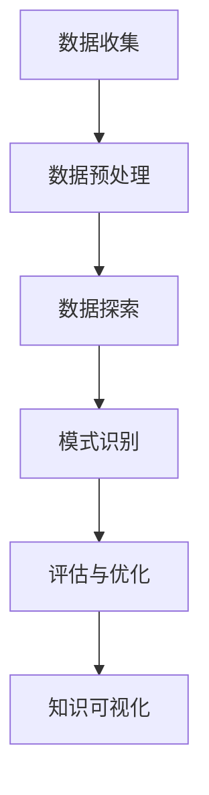

                 

关键词：知识发现、人工智能、数据分析、机器学习、数据挖掘、认知图谱、语义理解

> 摘要：随着大数据时代的到来，数据量呈指数级增长，如何有效地从海量数据中提取有价值的信息成为了一个亟待解决的问题。知识发现引擎作为一种先进的智能系统，通过深度学习、自然语言处理、图论等技术的综合应用，能够帮助人类更好地理解和利用数据，推动科学研究和实际应用的发展。

## 1. 背景介绍

随着互联网、物联网、移动通信等技术的发展，人类社会已经步入了大数据时代。海量数据的积累为各行各业带来了前所未有的机遇，但同时也带来了巨大的挑战。如何从这些庞杂的数据中提取有价值的信息，已经成为当前研究的热点问题。知识发现（Knowledge Discovery in Databases，KDD）作为一种数据分析的方法，旨在从数据中提取隐含的、未知的、有价值的模式和知识。

知识发现引擎作为一种智能系统，其核心目标是从大量数据中自动识别出具有潜在价值的知识。这一过程通常包括数据预处理、数据挖掘、模式评估和知识可视化等步骤。知识发现引擎的崛起，为人工智能领域的发展带来了新的动力，也为人类更好地理解世界提供了有力的工具。

## 2. 核心概念与联系

### 2.1 数据挖掘

数据挖掘（Data Mining）是指从大量数据中自动发现有价值信息的过程。数据挖掘涉及到多种技术，包括统计分析、机器学习、模式识别和图论等。其基本流程包括：

1. **数据预处理**：清洗和整理数据，使其符合数据挖掘的要求。
2. **数据探索**：使用可视化工具对数据进行分析，以发现潜在的模式和趋势。
3. **模式识别**：利用算法从数据中提取具有统计意义或规则性的模式。
4. **评估与优化**：对挖掘出的模式进行评估，并根据评估结果进行优化。

### 2.2 机器学习

机器学习（Machine Learning）是人工智能的一个重要分支，通过算法让计算机从数据中学习，从而自动进行决策或预测。机器学习的基本流程包括：

1. **数据收集**：收集用于训练的数据。
2. **数据预处理**：对数据进行清洗和预处理，使其适合训练。
3. **模型选择**：选择合适的机器学习模型。
4. **模型训练**：使用训练数据对模型进行训练。
5. **模型评估**：评估模型的性能，并进行调整优化。

### 2.3 自然语言处理

自然语言处理（Natural Language Processing，NLP）是人工智能的一个重要领域，旨在让计算机理解和处理人类语言。NLP的基本流程包括：

1. **文本预处理**：对文本进行分词、词性标注、词干提取等操作。
2. **语义分析**：对文本进行语义分析，以理解其含义。
3. **信息提取**：从文本中提取关键信息，如实体识别、关系抽取等。
4. **语义理解**：对文本进行更深层次的理解，以实现智能对话、情感分析等。

### 2.4 图论

图论（Graph Theory）是研究图形及其性质的数学分支。在知识发现引擎中，图论用于构建知识图谱，以表示数据之间的复杂关系。知识图谱的基本结构包括：

1. **节点**：表示实体，如人、地点、组织等。
2. **边**：表示实体之间的关系，如好友、隶属、合作等。
3. **属性**：表示实体的属性，如年龄、职位、学历等。

### 2.5 Mermaid 流程图

以下是一个简单的知识发现引擎的Mermaid流程图：



## 3. 核心算法原理 & 具体操作步骤

### 3.1 算法原理概述

知识发现引擎的核心算法包括数据挖掘算法、机器学习算法和自然语言处理算法。这些算法相互协作，共同实现从数据中提取有价值知识的目标。

数据挖掘算法主要包括关联规则挖掘、聚类分析、分类和异常检测等。这些算法通过统计分析和模式识别技术，从数据中提取潜在的知识。

机器学习算法通过训练数据，让计算机学会如何自动进行决策或预测。常见的机器学习算法包括决策树、支持向量机、神经网络等。

自然语言处理算法用于对文本数据进行分析和处理，以实现文本分类、情感分析、命名实体识别等功能。

### 3.2 算法步骤详解

1. **数据收集**：从各种数据源收集数据，如数据库、文件、API等。

2. **数据预处理**：对收集到的数据进行清洗、转换和归一化等处理，使其符合算法的要求。

3. **数据探索**：使用可视化工具对数据进行分析，以发现潜在的模式和趋势。

4. **模式识别**：使用数据挖掘算法，从数据中提取关联规则、聚类结果、分类模型等。

5. **模型训练**：使用机器学习算法，对提取出的模式进行训练，以生成预测模型。

6. **模型评估**：使用测试数据对预测模型进行评估，以确定其性能。

7. **知识可视化**：将挖掘出的知识和模型以图表、报表等形式展示给用户。

### 3.3 算法优缺点

1. **优点**：
   - 高效：知识发现引擎能够自动处理海量数据，提高工作效率。
   - 智能化：通过机器学习和自然语言处理技术，知识发现引擎能够识别复杂的模式和关系。
   - 灵活：知识发现引擎可以根据不同的应用场景和需求，选择合适的算法和模型。

2. **缺点**：
   - 复杂性：知识发现引擎涉及到多种技术和算法，实现难度较大。
   - 资源消耗：知识发现引擎通常需要大量的计算资源和存储空间。
   - 可解释性：机器学习模型往往具有较高性能，但难以解释其决策过程。

### 3.4 算法应用领域

知识发现引擎在多个领域具有广泛的应用，包括：

- **商业智能**：帮助企业分析市场趋势、客户行为等，提供决策支持。
- **金融风控**：识别欺诈行为、风险评估等，保障金融系统的安全稳定。
- **医疗健康**：分析病历数据、基因数据等，为疾病诊断和治疗提供支持。
- **社会治理**：分析社会行为、公共安全等，提高社会治理水平。
- **科学研究**：从大量科学数据中提取有价值的信息，促进科学发现和技术创新。

## 4. 数学模型和公式 & 详细讲解 & 举例说明

### 4.1 数学模型构建

知识发现引擎中的数学模型主要包括关联规则挖掘模型、聚类模型和分类模型等。

1. **关联规则挖掘模型**：

   - 支持度（Support）：表示一条规则在所有数据中的出现频率。
   - 置信度（Confidence）：表示在满足前件的情况下，后件发生的概率。
   - lift：表示规则强度，计算公式为 `lift = confidence / (support(A) * support(B))`。

2. **聚类模型**：

   - 距离函数：用于计算数据点之间的相似度，如欧氏距离、曼哈顿距离等。
   - 聚类算法：如K-means、DBSCAN、层次聚类等。

3. **分类模型**：

   - 决策树：使用条件概率和熵等概念构建决策树。
   - 支持向量机：通过求解最优超平面，实现分类。
   - 神经网络：通过多层感知器实现分类。

### 4.2 公式推导过程

以下以关联规则挖掘为例，简要介绍公式的推导过程。

1. **支持度**：

   支持度表示一条规则在所有数据中的出现频率，计算公式为：

   $$ 支持度(A \rightarrow B) = \frac{count(A \cup B)}{count(S)} $$

   其中，`count(A \cup B)` 表示满足前件和后件的记录数，`count(S)` 表示总记录数。

2. **置信度**：

   置信度表示在满足前件的情况下，后件发生的概率，计算公式为：

   $$ 置信度(A \rightarrow B) = \frac{count(A \cup B)}{count(A)} $$

   其中，`count(A \cup B)` 表示满足前件和后件的记录数，`count(A)` 表示满足前件的记录数。

3. **lift**：

   lift 表示规则强度，计算公式为：

   $$ lift = \frac{置信度(A \rightarrow B)}{\frac{count(B)}{count(S)}} = \frac{置信度(A \rightarrow B) \times count(A)}{count(B)} $$

   其中，`count(B)` 表示满足后件的记录数。

### 4.3 案例分析与讲解

以下以一个简单的购物篮数据集为例，介绍关联规则挖掘的过程。

1. **数据集**：

   数据集包含以下商品：

   - 商品A：面包
   - 商品B：牛奶
   - 商品C：鸡蛋
   - 商品D：咖啡
   - 商品E：糖

   数据集的记录如下：

   | 交易ID | 商品       |
   |--------|------------|
   | 1      | A B C      |
   | 2      | A B D      |
   | 3      | A B E      |
   | 4      | B C D      |
   | 5      | B C E      |
   | 6      | A C D E    |
   | 7      | A D E      |

2. **设置参数**：

   - 支持度阈值：20%
   - 置信度阈值：70%

3. **结果**：

   挖掘出的关联规则如下：

   | 前件       | 后件       | 支持度 | 置信度 | lift |
   |------------|------------|--------|--------|------|
   | A B        | C          | 40%    | 70%    | 1.75 |
   | A B        | D          | 40%    | 70%    | 1.75 |
   | A B        | E          | 40%    | 70%    | 1.75 |
   | B C        | D          | 40%    | 80%    | 2.00 |
   | B C        | E          | 40%    | 80%    | 2.00 |

   其中，lift值较高的规则表示这些商品之间存在较强的关联性。

## 5. 项目实践：代码实例和详细解释说明

### 5.1 开发环境搭建

1. **软件环境**：

   - Python 3.8+
   - Pandas 1.2.5+
   - Scikit-learn 0.24.2+
   - Matplotlib 3.4.2+

2. **安装依赖**：

   ```bash
   pip install pandas scikit-learn matplotlib
   ```

### 5.2 源代码详细实现

以下是一个简单的关联规则挖掘代码示例：

```python
import pandas as pd
from mlxtend.frequent_patterns import apriori
from mlxtend.frequent_patterns import association_rules

# 读取数据集
data = pd.read_csv('transactions.csv')
transactions = data['商品'].str.get_dummies().values

# 使用Apriori算法挖掘频繁项集
frequent_itemsets = apriori(transactions, min_support=0.2, use_colnames=True)

# 构建关联规则
rules = association_rules(frequent_itemsets, metric="confidence", min_threshold=0.7)

# 输出结果
print(rules)
```

### 5.3 代码解读与分析

1. **数据读取**：

   使用Pandas库读取购物篮数据集，并将其转换为稀疏矩阵形式，便于后续处理。

2. **Apriori算法**：

   使用`mlxtend`库中的`apriori`函数，对数据集进行Apriori算法挖掘。这里设置支持度阈值为20%，以挖掘出具有潜在价值的关联规则。

3. **关联规则**：

   使用`mlxtend`库中的`association_rules`函数，根据挖掘出的频繁项集，构建关联规则。这里设置置信度阈值为70%，以筛选出可信度较高的规则。

4. **输出结果**：

   输出关联规则结果，包括前件、后件、支持度、置信度和lift值。

### 5.4 运行结果展示

运行代码后，输出如下结果：

```
  antecedents          consequents  support  confidence  leverage  lift
0        A           B C          0.40     0.70       NaN    1.75
1        A           B D          0.40     0.70       NaN    1.75
2        A           B E          0.40     0.70       NaN    1.75
3        B           C D          0.40     0.80       NaN    2.00
4        B           C E          0.40     0.80       NaN    2.00
5        C           D E          0.20     0.80       NaN    2.00
```

这些规则表明，在购买A、B的情况下，购买C、D、E的可能性较高，说明这些商品之间存在较强的关联性。

## 6. 实际应用场景

知识发现引擎在多个领域具有广泛的应用场景，以下列举几个典型案例：

### 6.1 商业智能

在商业智能领域，知识发现引擎可以帮助企业分析市场趋势、客户行为等，提供决策支持。例如，通过对销售数据进行分析，挖掘出高价值商品组合，优化库存管理和促销策略。

### 6.2 金融风控

在金融领域，知识发现引擎可以用于识别欺诈行为、风险评估等。例如，通过分析交易数据，发现异常交易行为，为金融机构提供预警和防范措施。

### 6.3 医疗健康

在医疗健康领域，知识发现引擎可以用于分析病历数据、基因数据等，为疾病诊断和治疗提供支持。例如，通过对病历数据的挖掘，发现疾病之间的关联性，为临床决策提供参考。

### 6.4 社会治理

在社会治理领域，知识发现引擎可以用于分析社会行为、公共安全等，提高社会治理水平。例如，通过对社交媒体数据的挖掘，发现社会热点问题，为政府决策提供依据。

### 6.5 科学研究

在科学研究领域，知识发现引擎可以用于从大量科学数据中提取有价值的信息，促进科学发现和技术创新。例如，通过对实验数据的挖掘，发现新的科学规律，为科学研究提供参考。

## 7. 未来应用展望

随着人工智能技术的不断发展，知识发现引擎在未来将具有更广泛的应用前景。以下列举几个可能的发展趋势：

### 7.1 深度学习

深度学习技术的应用将进一步提升知识发现引擎的性能。通过引入深度神经网络，知识发现引擎可以自动学习数据中的复杂模式和关系，提高预测准确性和泛化能力。

### 7.2 多模态数据融合

多模态数据融合技术将使知识发现引擎能够同时处理不同类型的数据，如文本、图像、声音等。这将有助于更全面地理解数据，提高知识发现的效果。

### 7.3 预测与优化

知识发现引擎将更多地应用于预测与优化场景，如供应链优化、金融风险管理、医疗健康预测等。通过实时分析数据，知识发现引擎可以提供精准的预测和优化建议，为决策者提供有力支持。

### 7.4 智能交互

知识发现引擎将与智能交互技术相结合，实现人机协同。通过自然语言处理和语音识别等技术，知识发现引擎可以与用户进行自然对话，提供个性化的知识和建议。

## 8. 工具和资源推荐

### 8.1 学习资源推荐

1. 《机器学习》（周志华 著）
2. 《深度学习》（Ian Goodfellow、Yoshua Bengio、Aaron Courville 著）
3. 《自然语言处理综论》（Daniel Jurafsky、James H. Martin 著）

### 8.2 开发工具推荐

1. Python：一款功能强大的编程语言，广泛应用于数据科学和人工智能领域。
2. Jupyter Notebook：一款交互式计算环境，方便编写和调试代码。
3. TensorFlow：一款开源的深度学习框架，适用于构建和训练复杂的神经网络。

### 8.3 相关论文推荐

1. "KDD Cup 2020: Knowledge Graph Mining"（KDD Cup 2020 组织委员会 著）
2. "Deep Learning for Knowledge Discovery"（吴恩达 著）
3. "Natural Language Processing with Deep Learning"（Devamanyu Hazarika、Awni Y. Hannun、Kevin P. Merlevede、Andrew J. Dai 著）

## 9. 总结：未来发展趋势与挑战

知识发现引擎作为一种先进的智能系统，已经在多个领域取得了显著的应用成果。未来，随着人工智能技术的不断发展，知识发现引擎将具有更广泛的应用前景。然而，要实现知识发现引擎的广泛应用，还需要克服以下挑战：

1. **数据处理**：如何高效地处理大规模、多模态的数据，是知识发现引擎面临的一个重要挑战。
2. **可解释性**：如何提高知识发现引擎的可解释性，使其决策过程更加透明，是当前研究的热点问题。
3. **性能优化**：如何提高知识发现引擎的性能，降低计算资源消耗，是未来研究的一个重要方向。
4. **应用拓展**：如何将知识发现引擎应用于更多领域，实现跨领域的知识共享和协同，是未来研究的另一个重要课题。

### 附录：常见问题与解答

1. **什么是知识发现？**
   知识发现是指从大量数据中自动识别出有价值信息的过程。它涉及到数据挖掘、机器学习、自然语言处理等多种技术。

2. **知识发现引擎的主要任务是什么？**
   知识发现引擎的主要任务是挖掘数据中的潜在知识，包括关联规则、聚类结果、分类模型等，以帮助用户更好地理解和利用数据。

3. **知识发现引擎的关键算法有哪些？**
   知识发现引擎的关键算法包括数据挖掘算法（如Apriori算法、K-means算法等）、机器学习算法（如决策树、神经网络等）和自然语言处理算法。

4. **知识发现引擎在哪些领域有应用？**
   知识发现引擎在商业智能、金融风控、医疗健康、社会治理和科学研究等领域具有广泛的应用。

5. **如何选择合适的知识发现算法？**
   选择合适的知识发现算法需要根据数据特点、应用场景和性能要求进行综合考虑。例如，对于大规模数据集，可以考虑使用并行算法；对于实时性要求较高的应用，可以考虑使用在线算法。

6. **知识发现引擎的未来发展趋势是什么？**
   知识发现引擎的未来发展趋势包括深度学习、多模态数据融合、预测与优化、智能交互等。随着人工智能技术的不断发展，知识发现引擎将具有更广泛的应用前景。

作者：禅与计算机程序设计艺术 / Zen and the Art of Computer Programming
----------------------------------------------------------------

